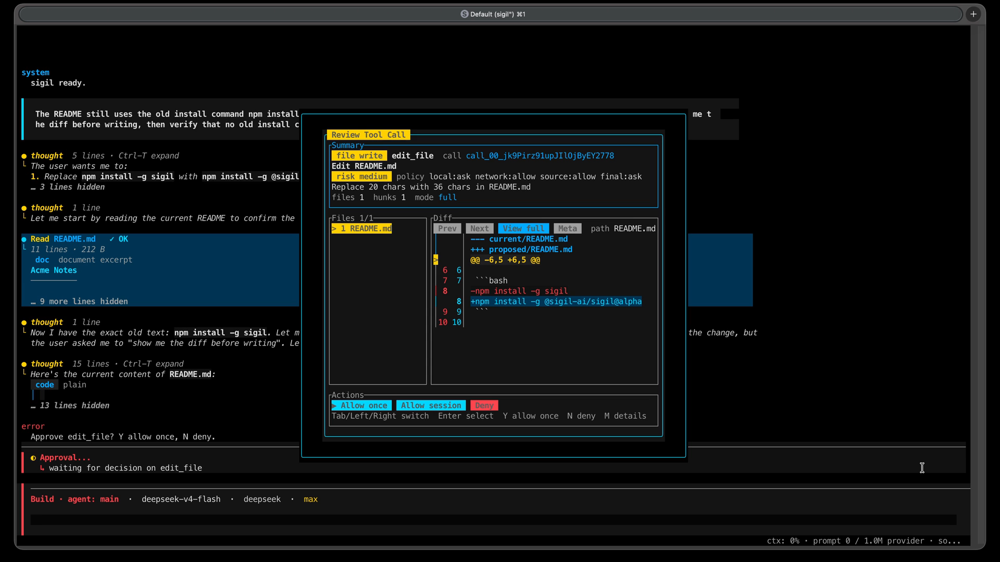

<p align="center">
  <picture>
    <source media="(prefers-color-scheme: dark)" srcset="assets/logo/sigil-lockup-dark-mode.svg">
    
  </picture>
</p>

<p align="center"><strong>Reviewable edits. Resumable sessions. One terminal.</strong></p>
<p align="center">A TUI-first coding agent for real repository work.</p>

<p align="center">
  <a href="https://github.com/JimmyDaddy/sigil/releases"></a>
  <a href="https://github.com/JimmyDaddy/sigil/actions/workflows/ci.yml"></a>
  <a href="https://github.com/JimmyDaddy/sigil/actions/workflows/pages.yml"></a>
  <a href="LICENSE"></a>
</p>

<p align="center">
  <a href="https://sigil.corerobin.com/">Website</a> ·
  <a href="https://sigil.corerobin.com/docs/">Documentation</a> ·
  <a href="docs/en/quickstart.md">Quickstart</a> ·
  <a href="https://sigil.corerobin.com/docs/visual-tour/">Visual tour</a>
</p>

<p align="center">English · <a href="README.zh-CN.md">简体中文</a></p>

<p align="center">
  <a href="https://sigil.corerobin.com/#demo">
    
  </a>
</p>

<p align="center"><a href="https://sigil.corerobin.com/#demo">Watch the 45-second demo</a> · <a href="assets/demo/sigil-45-second-demo.mp4">MP4</a></p>

> [!NOTE]
> Sigil is an early preview. The website and user docs follow `main`; packaged releases can lag behind. Check [Installation](docs/en/installation.md) and the [Changelog](docs/en/changelog.md) before relying on a newly documented feature.

## Why Sigil

| Work in context | Stay in control |
| --- | --- |
| **TUI-first workspace**<br>Follow the conversation, tool activity, changes, and next action without leaving the terminal. | **Review before risk**<br>Inspect approvals and diffs before writes, commands, network access, or external integrations proceed. |
| **Resumable sessions**<br>Return to saved work and recover interrupted tasks without silently rerunning an unfinished tool. | **Models and tools, your way**<br>Choose among supported providers, add MCP integrations, and enable repository-aware assistance when you need it. |

## Start in under a minute

```bash
npm install -g @sigil-ai/sigil@alpha
cd /path/to/your/project
sigil
```

Quick Setup opens when configuration is missing. Choose a provider and model, add authentication, and run `sigil doctor` if anything looks incomplete. The [Quickstart](docs/en/quickstart.md) takes you from a first read-only task to a small reviewed change.

## Go deeper

| Guide | What it covers |
| --- | --- |
| [TUI user guide](docs/en/user-guide.md) | Daily controls, approvals, sessions, and recovery. |
| [Configuration](docs/en/configuration.md) | Common setup paths and exact fields. |
| [Providers](docs/en/providers.md) and [MCP](docs/en/mcp.md) | Models, authentication, and integrations. |
| [Safety](docs/en/safety.md), [permissions](docs/en/permissions-and-sandbox.md), and [privacy](docs/en/privacy.md) | Decisions, limits, and data handling. |
| [Troubleshooting](docs/en/troubleshooting.md) | Symptoms, checks, and recovery actions. |
| [Reference](docs/en/reference.md) | Commands, keys, paths, and exit behavior. |

## Project

[Project status](https://sigil.corerobin.com/docs/status/) · [Contributing](CONTRIBUTING.md) · [Developer docs](dev/docs/index.md) · [Security](SECURITY.md) · [MIT License](LICENSE)
