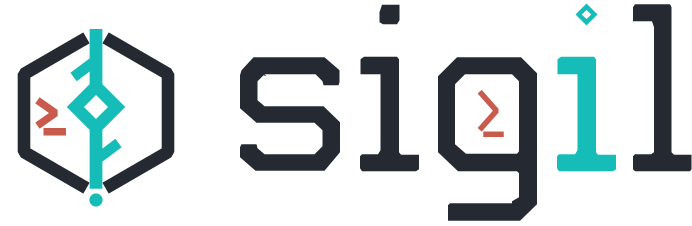

<p align="center">
  <picture>
    <source media="(prefers-color-scheme: dark)" srcset="assets/logo/sigil-lockup-dark-mode.svg">
    
  </picture>
</p>

<p align="center"><strong>修改可审查，任务可恢复，工作留在一个终端。</strong></p>
<p align="center">面向真实仓库工作的 TUI-first coding agent。</p>

<p align="center">
  <a href="https://github.com/JimmyDaddy/sigil/releases"></a>
  <a href="https://github.com/JimmyDaddy/sigil/actions/workflows/ci.yml"></a>
  <a href="https://github.com/JimmyDaddy/sigil/actions/workflows/pages.yml"></a>
  <a href="LICENSE"></a>
</p>

<p align="center">
  <a href="https://sigil.corerobin.com/zh-CN/">网站</a> ·
  <a href="https://sigil.corerobin.com/zh-CN/docs/">文档</a> ·
  <a href="docs/zh-CN/quickstart.md">快速开始</a> ·
  <a href="https://sigil.corerobin.com/zh-CN/docs/visual-tour/">视觉导览</a>
</p>

<p align="center"><a href="README.md">English</a> · 简体中文</p>

<p align="center">
  <a href="https://sigil.corerobin.com/zh-CN/docs/visual-tour/">
    
  </a>
</p>

> [!NOTE]
> Sigil 仍处于早期预览阶段。网站与用户文档跟随 `main`，可能领先于已发布的软件包。依赖新功能前，请先查看[安装指南](docs/zh-CN/installation.md)与[变更记录](docs/zh-CN/changelog.md)。

## 为什么选择 Sigil

| 工作不脱离上下文 | 风险始终可控 |
| --- | --- |
| **TUI-first 工作区**<br>在终端内同时查看对话、工具活动、修改内容和下一步操作。 | **风险操作先审查**<br>写文件、运行命令、访问网络或外部集成前，先检查审批信息和 diff。 |
| **任务可恢复**<br>回到已保存的 session，恢复中断任务时不会静默重跑未完成的工具。 | **模型与工具自由组合**<br>从支持的 provider 中选择模型，接入 MCP，并按需启用仓库感知能力。 |

## 一分钟内开始

```bash
npm install -g @sigil-ai/sigil@alpha
cd /path/to/your/project
sigil
```

缺少配置时，Sigil 会打开 Quick Setup。选择 provider 和 model、填写认证信息；如果状态不完整，运行 `sigil doctor`。按照[快速开始](docs/zh-CN/quickstart.md)，可以从第一次只读任务走到一个经过检查的小改动。

## 深入了解

| 指南 | 内容 |
| --- | --- |
| [TUI 用户指南](docs/zh-CN/user-guide.md) | 日常操作、审批、session 与恢复。 |
| [配置指南](docs/zh-CN/configuration.md) | 常用设置路径和精确字段。 |
| [Provider 指南](docs/zh-CN/providers.md)与 [MCP](docs/zh-CN/mcp.md) | 模型、认证与集成。 |
| [安全](docs/zh-CN/safety.md)、[权限](docs/zh-CN/permissions-and-sandbox.md)与[隐私](docs/zh-CN/privacy.md) | 决策、限制和数据处理。 |
| [故障排查](docs/zh-CN/troubleshooting.md) | 从症状到检查与恢复动作。 |
| [参考](docs/zh-CN/reference.md) | 命令、键位、路径和退出行为。 |

## 项目

[项目状态](https://sigil.corerobin.com/zh-CN/docs/status/) · [参与贡献](CONTRIBUTING.md) · [开发者文档](dev/docs/index.md) · [安全报告](SECURITY.md) · [MIT License](LICENSE)
