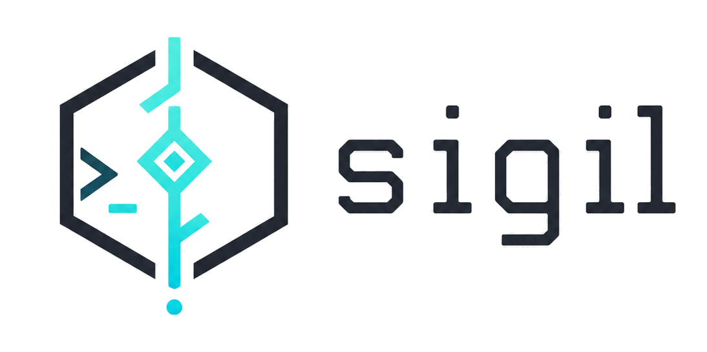

# Sigil

<p align="center">
  
</p>

[English](README.md) | 简体中文

[](https://github.com/JimmyDaddy/sigil/actions/workflows/ci.yml)
[](https://github.com/JimmyDaddy/sigil/actions/workflows/pages.yml)

Sigil 是一个 TUI-first 的 Rust coding agent，用来在真实仓库里协助开发。它把对话、工具调用、审批、diff、诊断、计划任务和 session 恢复放进同一个终端界面里；CLI 只保留为轻量自动化入口。

[网站](https://jimmydaddy.github.io/sigil/) · [文档](docs/zh-CN/README.md) · [快速上手](docs/zh-CN/quickstart.md) · [视觉导览](docs/zh-CN/visual-tour.md) · [Provider 指南](docs/zh-CN/providers.md)

Sigil 的首个 release 已准备面向 npm、Homebrew tap、Cargo git-tag 安装和 GitHub release archive 分发。自更新仍属于后续 packaging 工作。

## 快速开始

前置要求：

- 一个现代终端模拟器。
- 一种安装器：npm、Homebrew，或与本仓库兼容的 Rust toolchain。
- 一个模型 provider 凭据。首次启动时可以通过 Quick Setup 填写。

使用首发包管理器路径之一安装 Sigil：

```bash
npm install -g @jimmydaddy/sigil
```

```bash
brew install JimmyDaddy/sigil/sigil-ai
```

```bash
cargo install --git https://github.com/JimmyDaddy/sigil --tag v0.1.0 --locked sigil
```

本地开发时，可以从 checkout 安装：

```bash
git clone https://github.com/JimmyDaddy/sigil.git
cd sigil
cargo install --path crates/sigil --locked
```

进入希望 Sigil 操作的仓库并启动：

```bash
cd /path/to/your/project
sigil
```

如果 Sigil 找不到可用配置，会进入 Quick Setup。确认 workspace、选择 provider/model，并在界面里填写认证信息。可重复配置文件和环境变量方式见 [配置指南](docs/zh-CN/configuration.md)。

检查本地 setup：

```bash
sigil --version
sigil doctor
```

## Sigil 做什么

- 把 coding 工作留在 TUI：transcript、composer、live tool activity、approval、status、usage 和 controls。
- 让 agent 通过结构化工具读取、搜索、编辑文件和运行命令。
- 在高风险写操作前展示 approval card、受影响文件和有边界的 diff。
- 从 `.sigil/sessions/` 下的 append-only JSONL 恢复 session。
- 用 `/plan` 执行只读规划 prompt，用 `/task` 执行 durable 多步骤任务，进入 planner、executor 和可选 subagent 流程。
- 普通 chat 明确要求子 agent 时，会在最终回答前强制等待有效 agent 结果。
- 受信任的 agent profile 可通过 `@profile <prompt>` 或受信任的 profile slash name 直接调用。
- 按显式 trust、approval 和 secret-egress policy 接入 stdio MCP server。
- 可选开启 code intelligence，支持符号、引用、诊断、code action 和 rename preview。

## 日常工作流

正常使用时直接运行无子命令的 `sigil`。常用 TUI 入口：

| 需求 | 使用 |
| --- | --- |
| 普通提问或编辑 | 直接在 composer 输入 |
| 规划但暂不执行 | `/plan` 后输入 prompt，或 `/plan <prompt>` |
| 执行 durable 多步骤任务 | `/task <任务>`；未完成任务用 `/task continue` |
| 要求普通 chat 使用子 agent | 明确说明“使用子 agent ...” |
| 直接调用受信任 agent profile | `@profile <prompt>` 或 `/review-agent <prompt>` 这类受信任 profile slash name |
| 切换或重命名主/子 agent transcript | composer 下方 agent 面板（`Down`、`Up/Down`、`Enter`）、`Alt-A`、`Shift-Alt-A`、`/agent` 或 `/agent rename <child-id|current> <name>` |
| 查看较长子 agent 结果 | 切到子 agent transcript，或让 `read_agent_result` 分页读取子 agent final answer |
| 新建或切换 session | `/new`、`/resume` |
| 修改常用设置 | `/config` |
| 诊断 setup/auth/MCP/LSP | `/doctor` |
| 切换默认权限模式 | `Shift-Tab` |
| 取消当前运行或关闭浮层 | `Ctrl-C` 或 `Esc` |

完整键位、鼠标、transcript 选择和 OSC52 剪贴板行为见 [TUI 使用指南](docs/zh-CN/user-guide.md) 和 [terminal 兼容性检查清单](docs/zh-CN/terminal-compatibility.md)。

## 安全与状态

Sigil 把工具执行视为可审计状态，而不是隐藏副作用。

- 文件写入、编辑、删除、命令执行、MCP 调用和外部数据访问都经过 permission model。
- 写工具围绕 preview 和 diff 审批体验设计。
- 中断的工具执行在恢复时会投影为 interrupted result，不会静默重放。
- Provider 专项行为留在 provider crate；`sigil-kernel` 保持通用的 agent、tool、session、approval 和 event 契约。

## Provider 与集成

| 能力 | 配置入口 | 适合场景 | 详情 |
| --- | --- | --- | --- |
| DeepSeek | `[providers.deepseek]` | 默认 Quick Setup 路径和 DeepSeek 专项选项。 | [DeepSeek 指南](docs/zh-CN/provider-deepseek.md) |
| OpenAI-compatible | `[providers.openai_compat]` | 兼容 Chat Completions 的 `/v1` endpoint。 | [OpenAI-compatible 指南](docs/zh-CN/provider-openai-compatible.md) |
| Anthropic | `[providers.anthropic]` | 通过 Anthropic Messages streaming 使用 Claude 模型。 | [Anthropic 指南](docs/zh-CN/provider-anthropic.md) |
| Gemini | `[providers.gemini]` | 通过 `streamGenerateContent` 使用 Gemini 模型。 | [Gemini 指南](docs/zh-CN/provider-gemini.md) |
| MCP server | `[[mcp_servers]]` | 带显式 trust policy 的外部 stdio 工具。 | [MCP 指南](docs/zh-CN/mcp.md) |
| Code intelligence | `[code_intelligence]` | LSP-backed 符号、引用、诊断、action 和 rename preview。 | [配置指南](docs/zh-CN/configuration.md) |

## 按任务找文档

| 我想要... | 阅读 |
| --- | --- |
| 第一次试用 Sigil | [快速上手](docs/zh-CN/quickstart.md) |
| 看产品界面大概长什么样 | [视觉导览](docs/zh-CN/visual-tour.md) |
| 学习 TUI、命令、键位、session 和 approval | [TUI 使用指南](docs/zh-CN/user-guide.md) |
| 配置 provider、权限、memory、planning、terminal 或 LSP | [配置指南](docs/zh-CN/configuration.md) |
| 选择或排查模型 provider | [Provider 指南](docs/zh-CN/providers.md) |
| 理解 approval、workspace、MCP 和数据边界 | [安全](docs/zh-CN/safety.md) 和 [隐私](docs/zh-CN/privacy.md) |
| 修复 setup、认证、terminal、MCP 或 LSP 问题 | [排障](docs/zh-CN/troubleshooting.md) |
| 查找所有命令、键位、路径和环境变量 | [参考](docs/zh-CN/reference.md) |
| 开发 Sigil 本身 | [代码规范](dev/governance/code-standards.md)、[工程规范](dev/governance/engineering-standards.md) 和 [核心技术方案](dev/docs/sigil-rust-agent-core-technical-solution.md) |

## 项目维护

项目站点源码位于 [site](site)。生成后的 Pages 站点通过下面命令验证：

```bash
scripts/check-pages-site.sh
```

代码变更默认按仓库工程规范执行相关 gate：

```bash
cargo fmt --all --check
cargo check
cargo test
cargo clippy --all-targets -- -D warnings
./scripts/coverage.sh
```

只改文档时可以不跑全量 Rust gate，但需要确认链接、路径和示例命令仍然成立。Logo 文件位于 [assets/logo](assets/logo)。
