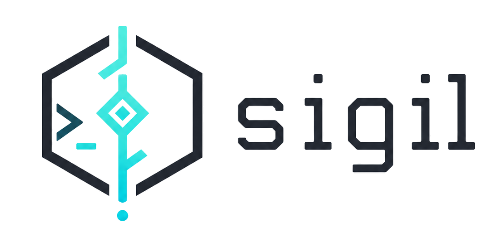

# Sigil

<p align="center">
  
</p>

[English](README.md) | 简体中文

[](https://github.com/JimmyDaddy/sigil/actions/workflows/ci.yml)
[](https://github.com/JimmyDaddy/sigil/actions/workflows/pages.yml)

Sigil 是一个 TUI-first 的 Rust coding agent，用来在真实仓库里协助开发。它把对话、工具调用、审批、diff、诊断、计划任务和 session 恢复放进同一个终端界面里；CLI 只保留为轻量自动化入口。

项目站点源码位于 [site](site)。在 GitHub Pages 启用后，会发布到 [jimmydaddy.github.io/sigil](https://jimmydaddy.github.io/sigil/)。

当前项目仍通过本地开发流程验证。现阶段推荐从 checkout 安装，再在希望 Sigil 操作的工作区里启动 `sigil` binary。

## 快速开始

前置要求：

- 一个现代终端模拟器。
- 与本仓库兼容的 Rust toolchain。
- 一个模型 provider 凭据。首次启动时可以通过 Quick Setup 填写。

在仓库根目录安装：

```bash
cargo install --path crates/sigil --locked
```

进入你要操作的项目并启动 Sigil：

```bash
cd /path/to/your/project
sigil
```

如果 Sigil 找不到可用配置，会进入 Quick Setup。确认 workspace、选择 provider/model，并在界面里填写认证信息。环境变量和 `sigil.toml` 配置方式见 [配置指南](docs/zh-CN/configuration.md)。

检查已安装 binary：

```bash
sigil --version
sigil doctor
```

## Sigil 适合做什么

Sigil 面向这样的 coding session：你希望 agent 理解当前仓库、通过工具真实执行改动，并且在关键操作前保留人的控制权。

- 在 TUI 中询问代码库问题，并查看流式 reasoning/output。
- 让 agent 通过结构化工具读取、搜索、编辑文件和运行命令。
- 在写操作前查看 approval card、受影响文件和有边界的 diff。
- 重启 TUI 后从 append-only session log 恢复上下文。
- 用 `/plan` 发起 durable 多步骤任务，进入 planner、executor 和可选 subagent 流程。
- 按显式 trust、approval 和 secret-egress 策略接入 stdio MCP server。
- 可选开启 code intelligence，支持符号、引用、诊断、code action 和 rename preview。

## TUI 工作流

直接运行无子命令的 `sigil` 会打开主界面。默认界面是 chat-first：transcript、composer、live tool activity，以及展示 session、permissions、agents、LSP、usage 和 controls 的 info rail。

常用入口：

- 直接在 composer 输入普通问题或 coding task。
- 遇到较大的任务时，用 `/plan <任务>` 先生成计划再执行。
- 用 `/new` 开始新 session，用 `/resume` 切换历史 session，用 `/config` 修改常用配置。
- 用 `/doctor` 在 transcript 中查看本地诊断报告。
- 用 `Shift-Tab` 切换默认权限模式。
- 用 `Ctrl-C` 或 `Esc` 取消当前运行或关闭浮层。

完整键位、鼠标、transcript 选择和 OSC52 剪贴板行为见 [TUI 使用指南](docs/zh-CN/user-guide.md) 和 [terminal 兼容性检查清单](docs/zh-CN/terminal-compatibility.md)。

## 安全与状态

Sigil 把工具执行视为可审计状态，而不是隐藏副作用。

- 文件写入、编辑、删除、命令执行、MCP 调用和外部数据访问都经过 permission model。
- 写工具默认围绕 preview 和 diff 审批体验设计。
- Session 和 control records 以 append-only JSONL 保存到 `.sigil/sessions/`。
- 中断的工具执行在恢复时会投影为 interrupted result，不会静默重放。
- Provider 专项行为留在 provider crate；`sigil-kernel` 保持通用的 agent、tool、session、approval 和 event 契约。

## 自动化

CLI 面向脚本、CI 和诊断，不是主要产品表面。

```bash
sigil run "总结一下当前仓库"
sigil doctor
```

在 checkout 内做本地开发而不安装时：

```bash
cargo run -p sigil
cargo run -p sigil -- doctor
```

## Provider 与集成

Sigil 当前支持：

- 通过 `[providers.deepseek]` 使用 DeepSeek
- 通过 `[providers.openai_compat]` 使用 OpenAI-compatible Chat Completions
- 通过 `[providers.anthropic]` 使用 Anthropic Messages
- 通过 `[providers.gemini]` 使用 Gemini GenerateContent
- 通过 `[[mcp_servers]]` 接入 stdio MCP server
- 通过 `[code_intelligence]` 可选开启 code intelligence

DeepSeek 仍是 Quick Setup 默认路径。其他 provider 通过 `[agent].provider` 选择，并在对应 `[providers.*]` 区块里配置。
Provider 专项配置、key 优先级和排障路径见 [Provider 指南](docs/zh-CN/providers.md)。

## 文档

用户文档：

- [用户文档首页](docs/zh-CN/README.md) / [English](docs/en/README.md)
- [快速上手](docs/zh-CN/quickstart.md) / [English](docs/en/quickstart.md)
- [安装](docs/zh-CN/installation.md) / [English](docs/en/installation.md)
- [视觉导览](docs/zh-CN/visual-tour.md) / [English](docs/en/visual-tour.md)
- [常见工作流](docs/zh-CN/workflows.md) / [English](docs/en/workflows.md)
- [Cookbook](docs/zh-CN/cookbook.md) / [English](docs/en/cookbook.md)
- [TUI 使用指南](docs/zh-CN/user-guide.md) / [English](docs/en/user-guide.md)
- [安全与权限](docs/zh-CN/safety.md) / [English](docs/en/safety.md)
- [配置指南](docs/zh-CN/configuration.md) / [English](docs/en/configuration.md)
- [Provider 指南](docs/zh-CN/providers.md) / [English](docs/en/providers.md)
- [隐私与数据处理](docs/zh-CN/privacy.md) / [English](docs/en/privacy.md)
- [排障](docs/zh-CN/troubleshooting.md) / [English](docs/en/troubleshooting.md)
- [命令与键位参考](docs/zh-CN/reference.md) / [English](docs/en/reference.md)
- [MCP 接入指南](docs/zh-CN/mcp.md) / [English](docs/en/mcp.md)
- [Terminal 兼容性](docs/zh-CN/terminal-compatibility.md) / [English](docs/en/terminal-compatibility.md)
- [当前支持状态与未来工作](docs/zh-CN/status.md) / [English](docs/en/status.md)
- [用户 Changelog](docs/zh-CN/changelog.md) / [English](docs/en/changelog.md)
- [配置示例](docs/examples/config)

开发者文档：

- [代码规范](dev/governance/code-standards.md)
- [工程规范](dev/governance/engineering-standards.md)
- [核心技术方案](dev/docs/sigil-rust-agent-core-technical-solution.md)
- [当前实现快照](dev/docs/current-implementation-notes.md) / [English](dev/docs/current-implementation-notes.en.md)
- [能力路线图](dev/docs/sigil-capability-roadmap.md)
- [发布流程](dev/docs/release-process.md)
- [仓库内协作说明](AGENTS.md)

## 品牌资产

Logo 文件位于 [assets/logo](assets/logo)。透明 `sigil-full.png` 用于 README、release 页面和网站 hero；`sigil-mark-square-1024.png` 适合方形 package 或社交预览；目标环境不保留透明通道时使用 `*-on-white.png` 版本。

## 开发

代码变更默认按仓库工程规范执行相关 gate：

```bash
cargo fmt --all --check
cargo check
cargo test
cargo clippy --all-targets -- -D warnings
./scripts/coverage.sh
```

只改文档时可以不跑全量 Rust gate，但需要确认链接、路径和示例命令仍然成立。

验证分发产物时，可以构建本地 release archive：

```bash
scripts/build-release-archive.sh
```
