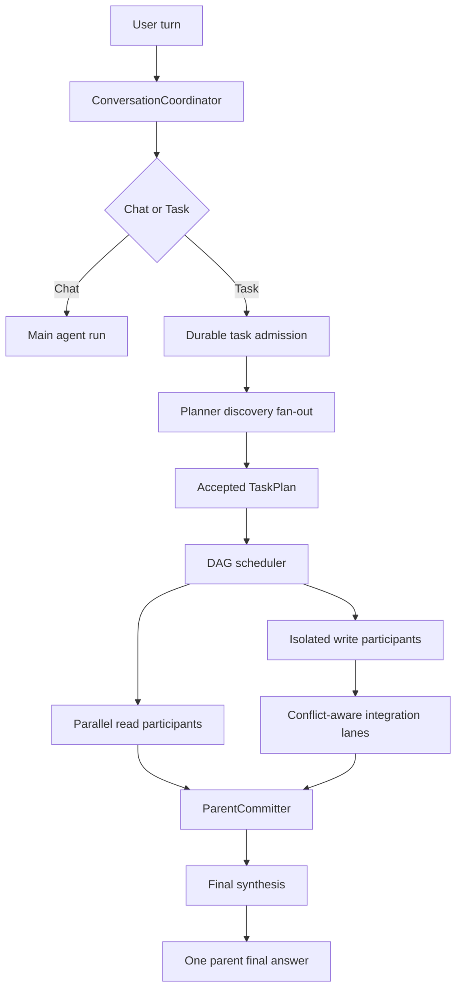
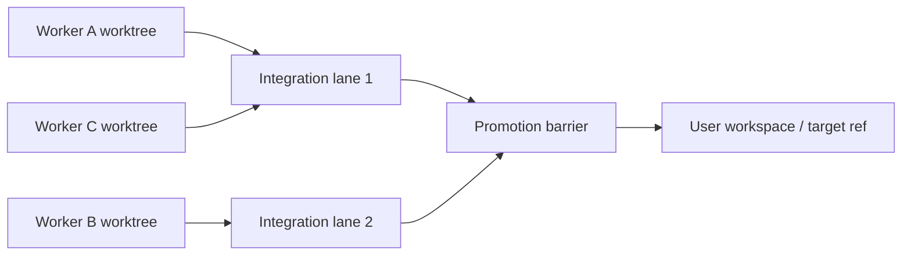

# RFC-0053 Autonomous Task Routing and Parallel Agent Orchestration V1

状态：accepted / O0-O3 and O4a-O4b2 implemented; O4b3-O8 deferred

创建日期：2026-07-22

依赖：

- [RFC-0001](0001-durable-event-stream-and-event-taxonomy.md)
- [RFC-0002](0002-crash-consistent-mutation-protocol.md)
- [RFC-0003](0003-verification-contract-and-workspace-snapshot.md)
- [RFC-0007](0007-task-dag-and-isolated-agent-workflows.md)
- [RFC-0008](0008-thread-projection-and-agent-graph-observability.md)
- [RFC-0011](0011-crash-resume-and-job-reconciliation.md)
- [RFC-0014](0014-write-isolation-and-worktree-merge.md)
- [RFC-0018](0018-plan-to-task-handoff.md)
- [RFC-0028](0028-real-model-acceptance-and-provider-conformance-v1.md)
- [RFC-0035](0035-tui-orchestration-boundary-hardening-v1.md)

## 1. Problem statement

Sigil 已有 durable task、planner/executor/subagent role、agent profile、child session、
append-only task projection 和 task DAG，但当前产品行为仍与 Claude Code、Codex 等成熟
agent harness 有明显差距：

- 普通 chat 没有可靠的 structured task admission；只有显式 `/task` 才进入 durable planner。
- `[task].routing_policy` 已在 O1 加入兼容解析，并由 O2 接入 TUI 普通输入；`default_mode` 只保留 composer 偏好语义。尚未拥有 task executor 的 HTTP/Desktop application surface 继续强制 manual。
- `multi_agent_mode = "explicit_request_only"` 是默认值，`spawn_agent` 描述明确禁止因任务复杂而主动委派。
- O1 之前 `multi_agent_mode` 只停留在模型提示层；当前 runtime spawn admission 已在 provider、budget 和 thread 创建前执行硬检查。
- ordinary chat 的显式 delegation hard gate 在 kernel 有类型和测试，但 TUI 生产输入没有稳定绑定。
- planner 不能先声明一组受控 Explore probes，再利用并行调研结果形成计划。
- task scheduler 能选出 `read_only_batch`，runner 却仍对 batch 中的步骤逐项 `.await`。
- `TaskChildSessionRunner` 持有 parent `Session`、handler 和 approval handler 的可变借用，接口本身阻止并发。
- 同一模型轮次的 tool calls 顺序执行；`join_before_final` agent call 会在第一个 child 上阻塞后续 fan-out。
- agent completion 仍围绕 `wait_agent` 和轮询心智，完成后还可能要求模型再次调用 wait，浪费模型轮次。
- child 权限组合没有被证明是 parent、role、profile 与 invocation policy 的单调收窄。
- 写 agent 目前只有 changeset-only foreground 路径；物理 worktree 和 conflict-aware integration 尚未闭环。

因此，问题不是“模型不知道列 TODO”，而是 Sigil 尚未给同一模型提供一个可靠、可恢复、
可并发且可审计的 orchestration control plane。

## 2. Design outcome

V1 将普通对话、Plan mode、durable task 和 agent collaboration 明确拆成四个概念：

| Concept | Product meaning | Durable execution |
| --- | --- | --- |
| Chat | 简单问答、单点调查、局部修改 | 普通 agent run |
| Plan mode | 用户主动进入的只读方案设计 | 只生成可审阅 plan artifact |
| Task | 复杂目标的 durable DAG、状态、恢复和最终 synthesis | 是 |
| Agent | 独立 context 的 participant；Explore、Worker 或自定义 profile | 由 chat 或 Task 调用 |

目标用户行为：

1. 简单问题仍直接回答，不创建 task，不派生 child。
2. 复杂普通 prompt 可以自动 handoff 为一个 durable task，并立即显示 task list。
3. planner 可以用一次受控 discovery fan-out 并行调用 Explore，再生成 accepted plan。
4. 独立只读步骤真实并发执行，模型不负责轮询 child 状态。
5. 多个写 agent 可以并行工作；并行度由冲突域和隔离能力决定，不由全局单锁决定。
6. parent conversation 最终只出现一个正式 final answer；planner/participant 的内部 final 不污染 parent history。
7. 进程中断、429、compaction 或 continue 不会重复建 task、重复 spawn 或重放不确定副作用。

## 3. Non-goals

V1 明确不做：

- 不把 Markdown TODO 当成 durable task list。
- 不用关键词或正则直接决定是否进入 task。
- 不把 Plan mode 和 durable Task 合并成同一种运行模式。
- 不让模型生成 task id、attempt id、permission grant 或 durable terminal status。
- 不让 planner、executor 或 child 通过重复 tool call 轮询运行状态。
- 不把完整 child transcript 注入 parent history。
- 不把 auto task routing 解释成 tool、shell、network 或 merge 权限批准。
- 不允许多个 agent 无协调地修改同一 workspace revision 或同一冲突域。
- 不承诺 crash 后自动重放状态不确定的 provider、tool 或 merge attempt。
- 不新增一组 CLI-first orchestration 命令作为普通用户主入口。
- V1 不建设 teammate-to-teammate 自治通信的完整 agent team；先完成 parent-coordinated participant model。

## 4. Product policy

### 4.1 Task admission policy

替换当前无效的 `task.default_mode` 路由心智，新增：

```rust
pub enum TaskRoutingPolicy {
    Manual,
    Auto,
}
```

语义：

- `Manual`：普通 chat 永远不自动 handoff；`/task` 仍可显式创建 durable task。
- `Auto`：普通 chat 可以通过 typed handoff 请求创建 durable task；目标默认值。

V1 暂不引入 `Suggest`。Suggest 会增加 awaiting-user、decline-resume 和 duplicated prompt ownership；
自动路由稳定后可作为独立增量设计。

### 4.2 Multi-agent policy

保留现有 `MultiAgentMode`，但把它变成 runtime admission policy：

```rust
pub enum MultiAgentMode {
    None,
    ExplicitRequestOnly,
    Proactive,
}
```

规则：

- `None`：拒绝 model-initiated spawn 和用户 `@profile` 手动入口；只保留不创建 child 的观察、取消与关闭能力。
- `ExplicitRequestOnly`：只有 typed user/skill delegation authority 或 accepted TaskPlan step 可以 spawn。
- `Proactive`：允许模型主动 spawn 通过安全证明的 Explore；Worker 仍必须满足 isolation 和 permission。

目标默认值是 `Proactive`，但只有在本文 O1-O5 的 admission、completion、权限 meet 和真实并发闭环后切换。

### 4.3 Default behavior matrix

| User request | Route | Task list | Agent behavior |
| --- | --- | --- | --- |
| 简单解释、查一个符号 | Chat | 无 | 主 agent 直接处理 |
| 单点局部修改 | Chat | 无 | 主 agent 顺序完成 |
| 跨 crate、实现 + 测试 + 文档 | Task | 自动创建 | planner 可 discovery；DAG 调度 |
| 多个互不依赖的只读调查 | Chat 或 Task | 视目标复杂度 | 2-4 个 Explore 并行 |
| 多个互不依赖的写模块 | Task | 自动创建 | isolated workers + integration lanes |
| `/plan` | Plan mode | 不创建 Task | 只读 planner，可用 read-only discovery |
| `/task` | Task | 立即创建 | 跳过自动 route decision |

## 5. Target architecture



### 5.1 Ownership

`sigil-kernel` owns：

- provider-neutral domain types；
- task/agent lifecycle entries and projections；
- pure DAG readiness and conflict-domain decisions；
- typed coordinator actions and public events；
- terminal、resume、idempotency invariants。

`sigil-runtime` owns：

- `ConversationCoordinator` application service；
- provider/profile resolution；
- model-visible tool surface and runtime admission；
- child session creation and participant execution；
- concurrency/provider budget；
- completion hub、integration coordinator and permission meet。

`sigil-tui`、CLI、HTTP/Desktop own：

- submit typed request；
- render public projection/events；
- collect user approval/guidance/cancel；
- 不解析模型文本猜 task phase，不复制 agent loop。

### 5.2 Root-run authority

一次用户输入只创建一个 root `ConversationRun`。Chat handoff、planner、participants、integration 和 synthesis
是它的子阶段。普通 chat agent 在请求 task handoff 后不能再取得 root final-answer authority。

建议引入：

```rust
pub enum AgentRunPurpose {
    Conversation(ConversationPurposeContext),
    TaskPlanner(TaskPlannerContext),
    TaskParticipant(TaskParticipantContext),
    TaskSynthesis(TaskSynthesisContext),
}
```

`AgentRunPurpose` 统一决定：

- 哪些 internal tools 可见；
- user/internal prompt 写入 parent、child 还是 transient context；
- 哪个 run 可以写 parent final answer；
- delegation authority 和 task-tree budget；
- terminal outcome 的 owner。

这将替换当前散落的 `task_plan_update: Option<_>`、plan boolean 和 TUI-side run-kind 特判。

## 6. Ordinary chat to Task handoff

### 6.1 Internal tool

普通 Conversation run 在 `routing_policy = Auto` 时获得一个 internal tool：

```text
request_task_planning {
  reason_codes: [string]
}
```

工具约束：

- 模型不能传 objective、task id、permission、role、profile 或 plan。
- objective 永远引用本轮已经持久化的 user turn，防止模型改写用户目标。
- `reason_codes` 使用有界枚举，例如 `cross_layer`、`parallel_research`、`multi_stage_change`、
  `long_verification`、`high_risk`；不保存自由文本推理。
- 同一 persisted user turn 只允许一次 accepted handoff。
- handoff 被接受后，同一 model response 中其他 tool calls 不执行，并记录 ignored reason。
- agent loop 返回 typed `NextAction::StartDurableTask`，不写伪 final answer。

模型 routing instruction 应明确 negative examples：简单问答、单文件小改、一次只读查询不应建 task。
可靠性通过 model eval 约束，而不是 prompt keyword classifier。

### 6.2 Durable handoff records

```rust
pub struct TaskHandoffRequestedEntry {
    pub handoff_id: TaskHandoffId,
    pub source_turn: ConversationTurnRef,
    pub trigger: TaskAdmissionTrigger,
    pub reason_codes: Vec<TaskAdmissionReason>,
    pub policy_snapshot_hash: String,
    pub requested_at_ms: u64,
}

pub struct TaskHandoffResolvedEntry {
    pub handoff_id: TaskHandoffId,
    pub decision: TaskHandoffDecision,
    pub task_id: Option<TaskId>,
    pub decided_at_ms: u64,
}
```

`TaskAdmissionTrigger`：

- `ExplicitTaskCommand`
- `ModelRequested`
- `ApprovedPlan`
- `ExplicitUserDelegation`

恢复规则：

1. `handoff_id` 由 session、source turn 和 logical run 稳定派生。
2. `Accepted` resolution 必须同时绑定稳定 `task_id`。
3. crash 位于 Accepted 与 `TaskRun Started` 之间时，只补本地 TaskRun，不重新询问模型。
4. 重复相同 handoff 返回既有 task；冲突 resolution fail closed。
5. 原始 user turn 只写一次，planner objective 使用 ref/transient context，不再写第二个 User message。

### 6.3 Explicit `/task`

`/task` 不维护第二套 orchestrator。它转换为 `TaskAdmissionTrigger::ExplicitTaskCommand`，直接调用同一
`ConversationCoordinator::admit_explicit_task`。

## 7. Planner and discovery

### 7.1 Planner transcript isolation

当前 planner 使用普通 `AgentRunInput::user(planner_prompt(...))` 跑在 parent session。目标设计必须改为：

- planner 有独立 participant transcript，或使用不持久化为 parent User 的 transient context；
- parent 只保存 task phase、plan、research links 和 bounded result；
- planner 的内部提示不得在 parent resume 时作为用户消息重放。

### 7.2 Planner-only discovery protocol

Planner 不调用通用 `spawn_agent` / `wait_agent`。新增 planner-only internal tool：

```text
request_task_discovery {
  probes: [{
    probe_id,
    title,
    objective,
    path_hints?
  }]
}
```

规则：

- 每个 planning attempt 最多一次 discovery fan-out。
- 默认最多 3 个 probe，硬上限 4。
- probe 必须互不重叠；host 做 bounded duplicate/path-overlap check，但不使用关键词决定业务范围。
- 所有 probe 固定绑定 trusted built-in Explore、`SubagentRead`、`SharedReadOnly`。
- runtime 先全量预检、预留预算，再并发启动；任一 probe 不合法则零启动。
- completion hub 在全部 terminal 后主动恢复 planner；planner 不调用 wait。
- 注入 planner 的结果按 `probe_id` 稳定排序，内容仅为 bounded summary + result ref。
- 完整 transcript 继续属于 child session。

### 7.3 Plan schema changes

`TaskStepSpec` 建议 additive 增加：

```rust
#[serde(default)]
pub profile_id: Option<AgentProfileId>;

#[serde(default)]
pub failure_policy: TaskStepFailurePolicy;

#[serde(default)]
pub conflict_domain: Option<TaskConflictDomainHint>;
```

规则：

- `SubagentRead` 缺 profile 时默认 `explore`。
- `SubagentWrite` 缺 profile 时默认 `worker`。
- profile id 是 identity；`display_name` 继续只用于 presentation。
- profile snapshot/hash 在 attempt start 前绑定，恢复时 hash drift 不得静默换 agent。
- 新 plan schema 不允许 executable `role = planner`；旧日志只做兼容投影。
- `failure_policy` V1 支持 `required | advisory`；required failure 阻断依赖节点，advisory failure 进入 synthesis。
- `conflict_domain` 只是 planner hint，最终冲突域以 materialized write set 和 runtime effect plan 为准。

### 7.4 Plan mode handoff

`/plan` 仍是一次性只读模式，但输出必须使用与 Task 相同的 structured plan schema。
用户选择执行时，直接把同一 plan 作为 TaskPlan v1 Accepted，不再清空 mapping 后重新调用 planner。

## 8. Task state machine

不要继续依赖 `TaskRun.reason` 文本猜阶段。新增 additive phase entry：

```rust
pub enum TaskPhase {
    Admitted,
    Discovering,
    Planning,
    Scheduling,
    Executing,
    Integrating,
    Verifying,
    Synthesizing,
    AwaitingUser,
    Cancelling,
    Terminal,
}

pub struct TaskPhaseEntry {
    pub task_id: TaskId,
    pub phase: TaskPhase,
    pub status: TaskPhaseStatus,
    pub attempt_id: Option<TaskAttemptId>,
    pub reason_code: Option<TaskPhaseReason>,
}
```

状态流：

```text
Admitted
  -> Discovering? -> Planning -> Scheduling
  -> Executing ready batches
  -> Integrating isolated changes
  -> Verifying merged workspace
  -> Synthesizing
  -> Completed
```

任意非 final 状态可以进入：

- `AwaitingUser`：approval、merge review 或 guidance；
- `Paused`：可恢复阻塞；
- `Cancelling`：已停止新 admission，正在等待 quiescence；
- `Interrupted`：cleanup 或远端状态不确定；
- `Cancelled`：所有 child/effect permit 已确认 quiescent。

`Completed` 与 `Cancelled` 是 final；`Paused`、`Failed`、`Interrupted` 是否可 continue 由 typed
`TaskResumeEligibility` 决定，不依赖 UI 猜测。

## 9. Participant execution protocol

### 9.1 Attempt identity

不能只靠 `(plan_version, step_id)` 表达 retry 和恢复：

```rust
pub struct TaskStepAttemptEntry {
    pub attempt_id: TaskStepAttemptId,
    pub task_id: TaskId,
    pub plan_version: u32,
    pub step_id: TaskStepId,
    pub role: AgentRole,
    pub profile_binding: AgentProfileBinding,
    pub batch_id: Option<TaskBatchId>,
    pub workspace_snapshot_id: WorkspaceSnapshotId,
    pub status: TaskAttemptStatus,
}

pub struct TaskStepResultEntry {
    pub attempt_id: TaskStepAttemptId,
    pub summary: String,
    pub summary_hash: String,
    pub result_ref: Option<String>,
    pub artifact_refs: Vec<String>,
    pub observed_paths: Vec<String>,
    pub changed_paths: Vec<String>,
    pub verification_refs: Vec<String>,
}
```

结果正文有硬上限；完整 child final 和 transcript 继续留在 child session。

### 9.2 Prepare / execute / commit split

替换当前借用 parent `&mut Session` 的 child runner：

```rust
pub trait TaskParticipantLauncher {
    async fn start(
        &self,
        request: TaskParticipantStartRequest,
    ) -> Result<TaskParticipantHandle>;
}

pub struct TaskParticipantHandle {
    pub attempt_id: TaskStepAttemptId,
    pub cancellation: RunCancellationHandle,
    pub completion: oneshot::Receiver<TaskParticipantOutcome>,
}
```

执行拆成：

```text
prepare(parent projection)
  -> durable Started + PreparedParticipantRun
execute(prepared child-owned session)
  -> ChildTerminalEnvelope
commit(parent, envelope)
  -> durable attempt/result/projection update
```

约束：

- `prepare` 在 provider dispatch 前持久化 Started、profile、permission、snapshot 和 input hash。
- `execute` 不持有 parent Session、parent handler 或 parent approval handler 的可变借用。
- child completion 只发送一次 terminal envelope。
- `ParentCommitter` 按 attempt id 去重并串行写 parent control log。
- completion 到达顺序可实时显示；注入模型的结果按 plan order/request key 稳定排序。

这里的 parent single writer 是审计与 projection 不变量，不是 agent 执行或 merge 并发限制。

## 10. True read-only concurrency

### 10.1 Runnable batch

Scheduler 输出：

```rust
pub enum TaskLaunchBatchKind {
    ParallelReadOnly,
    IsolatedWrite,
    ExclusiveEffect,
}

pub struct TaskLaunchBatch {
    pub batch_id: TaskBatchId,
    pub kind: TaskLaunchBatchKind,
    pub steps: Vec<TaskParticipantStartRequest>,
}
```

只有以下步骤可进入 `ParallelReadOnly`：

- child participant，不共享 parent transcript；
- effective ToolSpec 全部被证明为 read-only；
- 无 network mutate/unknown、MCP unknown、external directory 和 shell execute；
- 无 active conflicting write/integration lease；
- parent、role、profile、invocation 四层 permission meet 为 Allow；
- workspace snapshot 已绑定。

普通 executor step 若继续写 parent session，仍是 exclusive；独立读取应由 planner 转成 `SubagentRead`。

### 10.2 Runtime execution

- runtime 使用 `JoinSet` / `FuturesUnordered` 管理 child handles。
- 独立 child failure 不立即取消 sibling；只阻断 transitive dependents。
- 所有仍可执行 sibling terminal 后，batch 汇总成功/失败给 coordinator。
- user cancel 传播到同 batch 的 active children。
- provider route 出现 pressure 时缩小后续 fan-out，不让模型发起 polling/retry storm。

有效并发度：

```text
min(
  task.max_parallel_read_steps,
  task.max_subagents,
  runtime active-child budget,
  provider route budget
)
```

当前 hard-coded read concurrency 应改成 config input。

### 10.3 Projection

`current_step: Option<_>` 不能表达并行。新增：

```rust
pub active_steps: BTreeSet<(u32, TaskStepId)>;
```

`current_step` 暂时作为兼容 view：只有恰好一个 active step 时返回 `Some`。

## 11. Batch agent tools for ordinary chat

Task DAG 不应依赖模型调用 agent tools，但普通 Chat 仍需要稳定 fan-out。新增：

```text
spawn_agents {
  members: [{
    request_key,
    profile_id,
    objective,
    prompt
  }],
  completion_mode: "join_before_final" | "background"
}
```

规则：

- 先对全 batch 做 profile、permission、budget、tool safety 和 isolation 预检，再原子预留 slots。
- 任一 member 预检失败则零启动。
- `batch_id` 由 parent logical run + tool call id 稳定派生。
- thread id 由 `batch_id + request_key` 稳定派生；tool replay 不重复创建 child。
- batch member Started 按 request key 稳定顺序写入，然后并发启动。
- `join_before_final` 注册 parent dependency；不要求模型随后调用 wait。
- `background` 立即返回，terminal 时只标记 result-ready，不抢占用户 follow-up。
- 保留 `spawn_agent` 作为单 member compatibility wrapper。

V1 不新增模型可见的 polling `await_agents`。Host-owned join 由 completion hub 触发；用户或高级 API 如需等待，
可以有非模型循环的 typed wait endpoint。

2026-07-23 落地的 O4b2 compatibility slice 先提供 `completion_mode=join_before_final`：
`request_key` 在批内唯一并稳定排序，host 对 2-4 个只读 participant 做完整预检和原子 slot
reservation，完成后注入 `agent_batch_results` 并自动恢复 parent。当前 `batch_id` 由 parent
session ref 与外层 tool call id 稳定派生；把 parent logical run id 纳入公开协议、detached
`background` batch 和 restart reconciliation 留在 O4b3。

## 12. Completion-driven continuation

引入 `AgentCompletionHub`：

- 每个 child/attempt 只发布一次 terminal envelope。
- envelope 带 thread、attempt、batch、status、summary hash、result ref 和 effect facts。
- ParentCommitter 持久化 terminal/result 后，才发布 continuation-ready。
- 一个 batch generation 最多启动一次 parent continuation。
- joined batch completion 优先于普通 follow-up，因为原始 root run 尚未完成。
- detached background completion 不自动调用 provider，也不抢占 queued input。
- provider 429、进程恢复、重复 event 不得重复 delivery。

恢复给模型的 transient context：

```json
{
  "type": "agent_batch_results",
  "batch_id": "batch-...",
  "members": [
    {
      "request_key": "inspect-kernel",
      "status": "completed",
      "summary": "...",
      "result_ref": "agent-result://...",
      "changed_paths": [],
      "risks": []
    }
  ]
}
```

不再注入“请调用 wait_agent”的提示。需要全文时仍使用分页 `read_agent_result`，分页正文只进当前 transient context。

## 13. Permission and admission

### 13.1 Monotonic permission meet

child effective permission 不能通过 config 覆盖合并得出。每个 concrete tool call/subject 分别评估：

```text
effective =
  parent decision
  intersection role decision
  intersection profile decision
  intersection invocation grant

Deny > Ask > Allow
```

保证：

- parent deny 永远不能被 role/profile 放宽；
- role policy 不得被忽略；
- profile 只能收窄；
- 批准 spawn 不等于 blanket approval child tools；
- task auto routing 不改变 permission；
- session grant 只对规范化 permission signature 生效。

### 13.2 Runtime spawn admission

```rust
pub struct AgentSpawnAdmissionContext {
    pub source: AgentInvocationSource,
    pub authority: DelegationAuthority,
    pub profile_binding: AgentProfileBinding,
    pub isolation: TaskIsolationMode,
    pub tool_contract_fingerprint: String,
}
```

`DelegationAuthority` 由 host 绑定，模型参数不能伪造：

- `UserExplicit`
- `AcceptedTaskPlan { task_id, plan_version, step_id }`
- `ModelProactive`
- `SystemRecovery`

`multi_agent_mode` 在 runtime 检查：

- `None` 拒绝所有 model authority；
- `ExplicitRequestOnly` 只允许 UserExplicit / AcceptedTaskPlan；
- `Proactive` 允许通过 safety proof 的 ModelProactive Explore。

### 13.3 Approval UX

- 全部安全 Explore：不逐成员询问。
- Worker/custom/network/MCP：一次 batch-level spawn preview。
- preview 展示 profile、成员数、目标、isolation、工具范围和预期 effect，不展示内部 schema 噪音。
- child 真正的 Ask 仍带 thread/batch source；V1 background child 遇到 Ask 可进入 typed `BlockedNeedsApproval`，
  不静默 deny、不无限等待。
- 完全相同 permission signature 可以聚合审批并复用 session grant。

## 14. Parallel writes and integration lanes

### 14.1 Correct invariant

V1 不采用“所有写入只能由一个 merge owner 串行完成”的全局限制。正确不变量是：

> 多个 agent 不能无协调地同时修改同一个 workspace revision、branch ref 或 conflict domain。

`ParentCommitter` 仍是 parent control log 的逻辑单写者；写 agent 执行、验证和隔离集成可以并行。

### 14.2 Write modes

1. `ChangesetOnly`
   - workers 基于同一 immutable snapshot 并行生成 proposals；
   - 不直接修改 parent workspace；
   - proposal 带 declared/observed write set、base revision 和 verification facts。

2. `Worktree`
   - 每个 worker 在独立 physical workspace 写入；
   - 必须物化用户当前 snapshot，包括允许的 dirty/untracked 内容，而不是简单从 HEAD fork；
   - build artifacts 隔离；可共享安全的 compiler cache；
   - child 验证只证明 isolated state，promote 后仍需 parent-level verification。

3. `SharedWorkspaceWrite`
   - V1 仅 exclusive；
   - 后续只有 exact path lease、actual write-set enforcement、CAS 和 effect classification 全部成立时，
     才允许 disjoint direct writes 并行；
   - formatter、codegen、package manager、git ref、全仓脚本和未知 shell 始终进入 exclusive effect lane。

### 14.3 Conflict graph

Integration Coordinator 根据以下事实构建 graph：

- base workspace snapshot / branch ref；
- declared and materialized changed paths；
- file content hashes and CAS preconditions；
- task DAG dependencies；
- shared generated artifacts；
- build/package/git/global effect classification。

两个 proposals 只有在下列条件全部满足时才进入不同 integration lanes：

- changed path sets disjoint；
- 没有 dependency edge；
- 不触及同一 generated artifact 或 global effect；
- base snapshot compatible；
- verification scopes 可独立执行。

### 14.4 Multi-lane integration



- 独立 lanes 可以并行 rebase/apply 到 integration refs，并行运行 scoped verification。
- 同一 branch ref 的最终推进使用 compare-and-swap，ref update 本身短暂串行。
- promotion 到用户当前 workspace 使用 RFC-0002 mutation protocol 和 exact current snapshot check。
- 某 lane 变 stale 只重算该 lane，不取消不冲突 lanes。
- 多 repository/workspace scope 可以拥有独立 promotion barriers。
- 冲突 resolution 是新的 isolated attempt，不让 agent 直接覆盖 winner。

这使长时间的写、测试、rebase 和冲突预处理保持并行；只有真正共享的最终 effect 被序列化。

## 15. Rate limit, retry, cancellation and recovery

### 15.1 Provider pressure

增加 provider-neutral `RateLimited { retry_after_ms, route_fingerprint }`：

- 同一 provider route 共享 cooldown；429 后暂停新 admission，不取消已运行请求。
- 尊重 Retry-After；缺失时使用有界指数退避和 attempt-id-derived deterministic jitter。
- 自动 retry 只允许 read-only/idempotent 且可证明 zero-output、zero-tool、zero-effect 的 attempt。
- 默认最多 2 次，总等待有上限。
- retry 使用新 physical attempt id，保留 thread、profile snapshot 和 input hash。
- transport uncertain、已有模型输出、已有 tool/effect 或 write worker 不自动 retry。
- `RetryScheduled` 持久化 `not_before`；恢复后至多继续一次，不形成 retry storm。

### 15.2 Failure policy

- required child failure 阻断其 transitive dependents，但不取消独立 siblings。
- advisory child failure 进入最终 synthesis。
- batch 收集所有可执行结果后再决定 phase，不在首个失败处丢失其他结果。

### 15.3 Cancellation

- joined child 随 root run cancel；detached background child 由 session/显式 child cancel 拥有。
- cancel 先关闭新 admission，再传播 cancellation handle。
- completion/cancel race 由 ParentCommitter 的 durable append 顺序裁决。
- 所有 child/effect permit quiescent 后才能写 Cancelled。
- deadline 后仍不确定则写 Interrupted/CleanupIncomplete。
- cancelled parent 后到达的 child success 可保留 child facts，但不能重新触发 merge 或 final continuation。

### 15.4 Restart reconciliation

- Started without terminal 的 participant 变 Interrupted，不自动重放。
- Accepted handoff without TaskRun 可安全补 TaskRun。
- terminal batch without delivered continuation 恢复并投递一次。
- delivered continuation 不重复注入。
- running isolated worktree 进入 cleanup/review inventory，不自动 merge。
- stale proposal 保留审计和 preview，不自动 apply。

## 16. Final synthesis

Task 全部 required steps terminal、integration 和 parent verification 完成后，运行 system-owned synthesis：

- 输入：原始 objective ref、accepted plan、bounded step results、conflict/merge/verification projection；
- 默认只读工具面；发现缺口只能请求 typed replan，不直接临时写 workspace；
- 只允许 synthesis 写一个 parent `AssistantMessageKind::FinalAnswer`；
- executor、planner、child final 都不是 parent final；
- synthesis 前再次检查 required steps、pending approval、active effect、verification verdict 和 changed-file facts。

## 17. TUI product design

### 17.1 Automatic handoff

普通 prompt 被 handoff 后：

- composer 正常清空，live panel 显示 `Planning task…`；
- planner 创建计划后显示 durable task strip；
- 不新增必须记忆的 slash command；`/task` 仍是确定性显式入口；
- auto routing 不弹“允许 AI 思考”类审批；真正 write/execute/network 仍按 permission 流程。

### 17.2 Task strip

Task strip 与 live progress、follow-ups 必须是三个有边界的区域：

```text
Task · 3/7 complete · 2 agents running
  ✓ inspect kernel
  ◉ inspect runtime       Explore A
  ◉ inspect TUI           Explore B
  ○ implement coordinator
────────────────────────────────────────
Live · Exploring 2 scopes…
────────────────────────────────────────
Follow-ups · 1 pending
```

规则：

- task strip 显示 pending/running/completed/failed/blocked 和 active agents；
- 当前步骤可展开 detail，不默认展示 role/schema/internal ids；
- completed task 在一个 turn 后折叠，但可从 task/history surface 恢复查看；
- F2 隐藏 info rail 不影响 task strip 的主区域宽度计算；
- agent panel 展示 batch/member status，child transcript 仍可 inspect；
- detached background completion 只显示 result-ready，不抢 composer 焦点。

### 17.3 Follow-ups during task

增加：

```rust
ConversationInputTarget::Task { task_id }
ConversationInputKind::TaskGuidance
```

- active task 默认 follow-up 目标为当前 task，而不是新 main-thread chat；
- guidance 在 scheduler safe point 应用；
- 已 promotion/dispatched 的 follow-up 从 pending list 删除，durable audit 继续保留；
- joined agent completion 优先恢复原 root run；普通 queued follow-up 随后 dispatch；
- 用户可显式把 message 定向到某 child agent。

### 17.4 User actions

高频 action 只保留：

- Pause / Continue
- Cancel
- View plan
- View agents
- Review integration

复杂并发预算、failure policy 和 conflict domain 不进入默认 footer；留在 advanced config/diagnostics。

## 18. Public events and observability

增加 bounded provider-neutral public events：

```rust
TaskRoutingChanged { handoff_id, status, task_id }
TaskPhaseChanged { task_id, phase, status }
TaskPlanUpdated { task_id, plan_version, steps }
TaskBatchChanged { task_id, batch_id, active, completed, failed }
TaskStepChanged { task_id, step_id, attempt_id, status }
IntegrationLaneChanged { task_id, lane_id, status, conflicts }
```

TUI/HTTP/Desktop 不应解析 opaque `Control.payload` 才能显示核心 task state。

必须记录的指标：

- task routing rate、false-positive cancel/undo rate；
- simple prompt direct rate；
- plan/replan count；
- proactive Explore spawn rate；
- actual max/average parallelism 和 overlap duration；
- parent wait-model-turn count，目标为 0；
- time to first useful result / first edit / completion；
- token/cost overhead by parent/planner/child/synthesis；
- 429/cooldown/retry count；
- duplicate handoff/spawn/continuation prevented count；
- integration lane parallelism、conflict、stale proposal rate；
- restore reconciliation outcomes。

## 19. Configuration and migration

目标配置：

```toml
[task]
enabled = true
routing_policy = "auto"
multi_agent_mode = "proactive"
max_plan_steps = 12
max_replans = 2
max_subagents = 8
max_parallel_read_steps = 4
max_planning_research_agents = 3
allow_write_subagents = true
```

迁移：

1. `default_mode` 标记 deprecated；一版内保留解析和 warning。
2. 显式 legacy `default_mode = "chat"` 映射 `routing_policy = "manual"`，避免升级后突然自动编排。
3. 显式 legacy `default_mode = "plan"` 只映射 composer Plan-mode preference，不隐式启动 Task。
4. 未配置的新安装在 O1-O5 完成后默认 `routing_policy = "auto"`、`multi_agent_mode = "proactive"`。
5. 旧 session 缺 phase/attempt/batch entries 时使用 legacy projection；running legacy step 恢复为 Interrupted/Paused。
6. 不扫描旧 prompt 猜测并补建 task。
7. unfinished legacy task 只能显式 continue，不自动重放。
8. 新字段使用 `serde(default)`；新 entry 通过 session schema/version capability 管理。

`max_subagents` 继续作为整个 agent tree 的 active child 上限，不再叠加多套难以解释的 token spawn threshold。

## 20. Implementation plan

### 2026-07-23 implementation checkpoint

- O0 事实基线已落地：RFC-0007 和回归测试明确当前只有 ready batching，runner 仍串行；planner internal prompt 污染的基线断言已在 O2 翻转为 transient-only。
- O1a 已落地安全基础：`multi_agent_mode` 在 provider、budget reservation 和 `AgentThreadStarted` 之前 fail closed；`none` 同时覆盖 model spawn 与 `@profile`。生产 runtime 不再暴露 ambient authority setter，模型工具参数不能提供 authority。每次成功启动前追加 `AgentDelegationAdmitted`，绑定 thread、profile、mode、source、objective hash 与冻结后的 tool-contract fingerprint。
- O1b 已落地第一阶段：child 的 ancestor、parent、role、profile materialized policies 在 concrete ToolSpec、operation、network effect 和 subjects 上逐层求最严格决策；prepared execution 复用同一 policy chain。invocation-scoped permission grant 尚未实现，不得把当前实现描述为四层 permission meet。
- O1c 已落地：proactive Explore 基于冻结 registry 的实际 ToolSpec、network effect 和 `ToolMutationTracking` 证明；Custom/MCP 默认 unknown，已审计的本地只读 Custom tool 显式声明 `None`；detachable 分支复用同一证明。
- O1d 已落地配置基础：新增 `routing_policy = "manual" | "auto"`，缺字段保持 `manual`；O2 已接入生产 consumer，兼容迁移 warning 和新安装默认值仍留待 O8。
- O2 已落地 runtime-owned `ConversationCoordinator`、host-owned `AgentRunPurpose`、内部 `request_task_planning`、typed `AgentRunDisposition` 和 recovery-critical handoff events。TUI direct chat 与 queued follow-up 均绑定精确 source turn，并在同一 cancellation/approval root 内接管 durable task。HTTP/Desktop application surface 在拥有同一 executor 和 synthesis contract 前强制 manual，不能创建无人执行的 Started task。
- `/task` 已复用相同 admission service；planner prompt 改为 transient context，orchestrator 会复用既有 `TaskRun::Started` 和 accepted plan，不重复 admission 或 replan。
- TUI 启动及 session switch 都执行本地 handoff reconciliation；Requested→Resolved→TaskRun 的 crash gap 不重放 provider。只有可证明未发起不确定 planner/participant 的 admission gap 才自动接管；stale Running step/lease 先记为 Interrupted、task 置 Paused，等待显式 continue。
- direct chat 与 queued follow-up 的 task handoff 会在 `TaskHandoffRequested` / `Resolved` / `TaskRun::Started` 之前追加 `TaskRunCancellationScopeBound`，把 task 绑定到继承的 root run scope，避免 admission→binding 崩溃窗口。恢复只认可最新绑定 scope 上的 `Run` 或同 task `Task` cancellation；后续显式 continue 使用新 scope，因此旧取消不会永久污染 task。
- O3 已落地 participant isolation：Planner、Executor、Subagent 和 Synthesis 都写入 retry-stable child session，parent 只保存 bounded summary、result ref、attempt/result lifecycle 与 task control state。child 的 assistant/text delta 不再进入 root TUI stream。
- O4b1 已落地 runtime-owned `AgentCompletionHub` 和 single-delivery terminal envelope：完整 batch 在任何 participant future 被 poll 前拒绝重复 attempt identity；accepted registration 由 consuming hub 每项只产出一个 terminal envelope，同时保留真实 completion order 和稳定 request sequence。现有 O4a join barrier 已复用该 hub，完成顺序可以实时收集，parent durable commit 继续单写，注入模型前继续按原 tool-call sequence 稳定排序。
- O4b2 已落地普通 chat 的 `spawn_agents` join compatibility surface：schema 接受 2-4 个带稳定 `request_key` 的 participant，整批完成 profile、delegation、permission/tool-safety、provider/session materialization 和 budget 预检后才原子预留全部 active slots。容量或任一成员预检/注册失败时不 poll 任何 provider future；成功批次并发执行，经 completion hub 收口后按 `request_key` 稳定顺序注入 typed `agent_batch_results`，parent 不产生 `wait_agent` polling turn。当前只支持 `join_before_final`；planner discovery、background batch、公开 logical-run identity 和 TUI batch projection 属于 O4b3。
- approved `/plan` 的 `sigil-plan-v2` executable schema 只有在 base/current workspace snapshot 均存在且完全相等时，才直接 promotion 为同一份 `TaskPlan v1 Accepted`，保留 step mapping，不再调用第二个 Planner；snapshot 缺失、旧 `sigil-plan-v1` 或字段不完整的 draft 继续走隔离 planner 兼容路径。draft 会持久化解析出的 schema version；task id 由 plan id 与 plan hash 稳定派生，`TaskCreatedFromPlan` 记录 durable link，`PlanDecisionRecorded(Accepted)` 是最终提交标记。提交前 crash 会继续显示 pending 并幂等补齐同一 task；若期间 workspace drift，则 supersede 已提升 plan、取消未完成 task并要求重新规划。
- Task 完成后由隔离 Synthesis participant 生成结果，只有 host 可以向 parent 追加唯一正式 final。`TaskFinalAnswerCommitted` 绑定 task、plan version、synthesis attempt、child message ref 和内容 hash；启动恢复可幂等修补 child-result-only 或 parent-assistant-only 的部分提交前缀。
- ordinary-chat natural-language explicit delegation 仍不得用关键词扫描补 authority。`@profile` 使用固定的 user-explicit admission，并继续受 `multi_agent_mode` 约束。

本 checkpoint 表示 O4b2 已完成；Task DAG 并发、planner discovery、完整诊断通道和
background/restart batch 协议仍属于 O4b3-O8。

### O0: Truth baseline and contract correction

范围：kernel/runtime/TUI/docs；不改变默认行为。

- 增加测试证明当前 read-only batch 实际串行。
- 记录普通 chat 无 `task_plan_update`、`default_mode` 未接线、hard gate 未进入生产路径的事实。
- 修正文档中“read concurrency/hard gate 已完成”的过度声明。
- 为 planner internal prompt 污染 parent history 增加失败回归。
- 冻结 RFC-0053 类型和迁移边界。

退出条件：文档与 live code 一致；后续测试能先红后绿证明每个缺口。

### O1: Runtime admission and permission foundation

- runtime 强制执行 `multi_agent_mode`，不再只依赖工具描述。
- 接入 typed delegation authority 和 ordinary chat explicit hard gate。
- 实现 parent/role/profile/invocation permission meet。
- 自动 Explore 按最终 ToolSpec/effect proof 判定，不按工具名称白名单。
- 把 `default_mode` 迁移为真实 `routing_policy`。

退出条件：parent deny 不可被 child 放宽；unsafe 同名 tool 不能伪装 Explore；mode 配置改变真实 spawn admission。

### O2: ConversationCoordinator and auto handoff MVP

实施状态：完成（2026-07-23）。兼容默认值仍为 `manual`，待 O8 才评估切换。

- 新增 runtime-owned `ConversationCoordinator`。
- 新增 `AgentRunPurpose`、`request_task_planning` 和 typed handoff outcome。
- `/task` 与 ordinary chat 复用同一 task admission service。
- handoff/task idempotency、crash gap reconciliation。
- simple prompt scripted negative protocol regression；真实模型 routing eval 留在 O8。

退出条件：复杂普通 prompt 只写一个 User entry并创建一个 Task；简单 prompt 无 task；重复 handoff 不重复创建。

### O3: Planner transcript isolation and final synthesis

实施状态：完成（2026-07-23）。

- Planner、Executor、Subagent、Synthesis 使用 child-owned transcript；parent 只投影 bounded result 与 durable ref。
- `TaskParticipantAttempt` / `TaskParticipantResult` 绑定 retry-stable attempt id、child session ref、purpose、plan/step identity 和 terminal result；新写入的 result 原子携带 terminal status，使 result→attempt-terminal 的 crash gap 可恢复。step result 已提交但 readiness/step terminal 尚未提交时，恢复必须把 step 置为 Blocked、释放 write lease 并暂停 task，不得重放可能已经产生副作用的 step；缺少 terminal status 的旧日志同样 fail closed。
- 完整 `sigil-plan-v2` artifact 直接 promotion 为 accepted TaskPlan；legacy/incomplete schema fail closed 到隔离 Planner。
- system-owned final synthesis 是唯一结果生产者，host 是唯一 parent final writer；final commit 支持幂等 crash-prefix reconciliation。
- recovery 遇到不确定的 Started participant 时记录 Interrupted 并 Pause，必须显式 continue，不重放 provider。

退出条件：parent history 无 internal planner prompt；Task 完成只有一个正式 final answer。

### O4: Completion hub and batch Explore

实施状态：O4a、O4b1、O4b2 完成（2026-07-23），O4b3 deferred。

- O4a 已为 ordinary chat 的兼容 `spawn_agent(mode=join_before_final)` 接入 root-run
  host join barrier：只有同一 provider turn 的整批调用均为 runtime 明确认识的
  `spawn_agent(join_before_final)`、child tool contracts 被证明为安全只读且 child 绑定 root
  cancellation scope 时，多个 child 才并发执行；自定义 Agent 类工具和 background spawn 均
  fail closed，不能仅凭粗粒度 `ToolCategory::Agent` 获得 overlap 资格。
- Kernel 在整批 tool calls 处理后调用 runtime join hook；runtime 先等待全部 sibling terminal，
  再由 parent 单写者逐个提交 `AgentThreadResultRecorded` / terminal projection，并按原 tool-call
  顺序注入 bounded `agent_join_results` transient context。模型不需要也不会被提示调用
  `wait_agent`；完整正文仍只通过显式分页 `read_agent_result` 按需读取。
- `AgentResultContinuation(Pending -> Started -> Completed)` 记录 join 注册、parent commit 与
  bounded context delivery。`Completed` 只在携带 join context 的下一 provider turn 成功返回后
  持久化；max-turn、发送失败或发送前取消均保持未完成并继续触发 final blocker。Completed
  continuation 可以解除旧的“必须读完整 child 正文” final blocker，但不伪造
  `AgentThreadResultDelivered`，因此 projection 仍诚实区分 bounded host context 与完整分页正文交付。
- Joined child 以受 parent settle future 所有的普通 future 并发执行，不作为可脱离 parent 的 Tokio
  task；settle 被取消时 unfinished child 随 future 一起 drop，RAII 释放全部 supervisor slot。root
  cancellation 会为全部成员追加 Interrupted/Cancelled；单成员 parent commit 失败仍会继续收口其他
  sibling，避免结果和 slot 因第一个错误而遗失。若 kernel 在 delegate 返回后、settle 前写 tool
  result/event 失败，会显式 abort 尚未启动的 dependency；若 settle 后、下一 provider dispatch 前取消，
  已提交的 Started context 会转为 Cancelled，不能在恢复时伪装成待自动续跑的交付。
- TUI 的 legacy/background result continuation runner 只有在 typed disposition 为 `FinalAnswer` 时
  才写 Completed；`MaxTurns -> Interrupted`、Blocked、task handoff 与 plan acceptance 都按失败收口，
  不再因为 Rust future 返回 `Ok(AgentRunOutput)` 就错误永久关闭 continuation。
- barrier 回归要求两个 Explore child 同时到达同步点，证明真实 overlap；父模型只发生 spawn turn
  和 results turn，polling turn 为 0。另有 max-turn 未交付、root cancellation/quiescence、单成员
  commit 失败继续收口 sibling、spawn result event 失败在 settle 前 abort、settle 后发送前取消 context，
  以及自定义 Agent 写工具不得进入 join batch 的负向回归。
- O4b1 将 O4a 内联的 `FuturesUnordered` completion 收集提升为 runtime-owned
  `AgentCompletionHub`。hub 对完整 batch 做 duplicate attempt identity preflight，只有全量通过后
  才 poll participant future；每个 accepted registration 由 consuming hub 生成且仅生成一个
  `AgentTerminalEnvelope`。envelope 同时携带 completion arrival index 和原始 stable sequence，
  因此 runtime 可按真实完成顺序收集、由 parent single writer 提交，并在构造 model context 前
  独立恢复稳定请求顺序。participant failure 也是 terminal envelope，不会使 sibling 消失。
- O4b2 新增 ordinary-chat `spawn_agents` compatibility surface。每个调用接收 2-4 个
  `request_key` 唯一的 read-only participant；runtime 先对全 batch 做 profile、delegation、
  permission/tool-safety、provider/session materialization 和 budget 预检，再在 supervisor
  单锁内原子预留全部 slot。任一预检或容量失败时零 provider 启动；reservation 在提交前用 RAII
  回收，child Started 按 request key 稳定顺序写入。
- 成功批次使用 O4b1 completion hub 并发驱动；parent durable commit 仍为单写，随后注入包含稳定
  `batch_id` / `request_key` 的 bounded `agent_batch_results`，直接触发下一 parent provider
  turn，不调用 `wait_agent`。barrier 回归证明 2 个 Explore 同时 active，模型只有 spawn/results
  两个 turn；容量失败回归证明无 provider dispatch、无 active slot、无 child thread projection。

O4b3 仍包括：

- planner `request_task_discovery` 和 discovery 结果驱动的自动续跑。
- detached `background` batch、公开 parent logical-run identity 与 restart reconciliation。
- TUI batch/member projection。

退出条件：2-4 个 Explore 真实重叠；等待期间 provider/model polling turn 为 0；任一预检失败零启动。

### O5: True Task read concurrency

- 拆 `TaskChildSessionRunner` 为 prepare/execute/commit。
- coordinator actions + runtime launcher；parent Session 保持单写。
- `active_steps` projection 和 configurable concurrency。
- 独立失败继续，依赖步骤阻断；逆序 completion 稳定合并。
- provider cooldown/backpressure。

退出条件：barrier 测试证明 overlap；无 parent mutable borrow 跨 child await；429 不产生 fan-out storm。

完成 O5 并通过 dogfood/eval 后，才把新安装默认切到 auto/proactive。

### O6: Parallel isolated writes and integration lanes

- 并行 changeset-only proposals。
- worktree snapshot materialization、path confinement、artifact isolation 和 cleanup ownership。
- conflict graph、multi-lane integration refs、scoped verification。
- final promotion CAS、parent verification、stale/conflict UX。
- shared-workspace direct write 保持 exclusive；path-lease parallel direct write 作为后续 gated slice。

退出条件：非冲突 workers 的写/测试/integration 时间区间可重叠；冲突 proposals 不自动覆盖；最终 ref/workspace promotion 可审计、可恢复。

### O7: Recovery, follow-up and approval routing

- task-targeted guidance 和 safe-point application。
- dispatched follow-up 从 pending view 删除。
- parallel child approval attribution 和 identical-signature aggregation。
- cancel/quiescence、restart、continuation dedupe、stale isolated workspace inventory。

退出条件：resume 后不重复 plan/spawn/merge；cancel 后晚到 child 结果不会复活 task；approval 能定位到 exact agent/batch。

### O8: TUI polish, public protocol and model eval

- task/live/follow-up 视觉分区与键盘/鼠标交互。
- typed public events 和 HTTP/Desktop projection。
- performance：长 task/task strip/agent list 使用缓存 projection，不按 frame replay 全日志。
- deterministic eval、real-model eval、PTY E2E、chaos/restart suite。
- 文档、README、config guide 和 migration note。

退出条件：满足第 22 节 Definition of Done。

## 21. Verification matrix

| Layer | Required cases |
| --- | --- |
| Kernel state | handoff idempotency；phase/attempt/batch roundtrip；active_steps；duplicate terminal/continuation rejection |
| DAG scheduler | true overlap barrier；dependency order；independent failure continues；reverse completion deterministic merge |
| Runtime admission | none/explicit/proactive；typed authority；whole-batch zero-start rejection；budget release |
| Permission | parent deny upper bound；role policy active；profile only narrows；unsafe same-name ToolSpec；batch approval signature |
| Planner | one discovery round；bounded probes；profile snapshot binding；no internal User history；no executable planner step |
| Completion | single terminal envelope；joined automatic resume；background no focus steal；restart delivery once；no wait polling |
| Cancellation | before launch；provider stream；tool effect；partial batch；cleanup incomplete；late success after cancel |
| Rate limit | Retry-After；route cooldown；bounded retry；zero-effect proof；after-output/uncertain no retry |
| Changeset | same-base parallel proposals；disjoint lanes；overlap conflict；stale CAS；parent re-verification |
| Worktree | dirty/untracked snapshot；secret/cache exclusion；symlink escape；build isolation；crash cleanup |
| TUI | auto handoff；task/live/follow-up separators；agent inspect；pause/continue/cancel；completed collapse |
| Negative eval | simple Q&A、single lookup、one-line edit 不建 task；overlapping work不重复 spawn；no parent-child duplicate investigation |
| Positive eval | cross-layer implementation builds task；planner fans out Explore；independent read/write scopes use concurrency |
| Recovery E2E | 429、provider disconnect、compaction、process restart、task continue 不重复 task/step/spawn/merge |

验证顺序：

1. pure state/projection unit tests；
2. runtime fake-provider concurrency and recovery tests；
3. targeted kernel/runtime/TUI tests；
4. `./scripts/check-touched.sh --tier standard`；
5. core semantic changes完成后 full gate；
6. opt-in real-model and PTY acceptance。

## 22. Definition of Done

RFC-0053 只有同时满足以下条件才算完成：

1. 普通复杂 prompt 能自动创建一个 durable task 和可见 task list。
2. 简单 prompt 不被 planner/subagent 过度处理。
3. ordinary chat、`/task`、Plan promotion 使用同一个 task admission/coordinator。
4. planner internal prompt 和 participant transcript 不进入 parent user history。
5. planner 可以一次声明多个 Explore probes，并真实并发完成。
6. Task DAG 的 independent read attempts 存在可证明的时间重叠。
7. 模型等待 child 时不会重复调用 wait 或 terminal polling tool。
8. `multi_agent_mode` 是 runtime hard policy，permission meet 只能收窄。
9. auto Explore 无多余审批；Worker/network/MCP 的来源和 effect 可审阅。
10. 多个 isolated workers 可以并行写和测试；非冲突 integration lanes 可以并行预集成。
11. 同一 ref/workspace promotion 使用 CAS；冲突/stale proposal 不会静默覆盖。
12. Task 最终只写一个 parent final answer。
13. crash、429、cancel、continue 和 compaction 不会重复 task、attempt、spawn、continuation 或 merge。
14. task、live progress 和 follow-ups 在 TUI 中有清晰边界；dispatched follow-up 不留在 pending list。
15. public protocol、用户文档、核心技术方案和真实实现一致。
16. targeted、standard/full gates 和 opt-in real-model acceptance 按阶段要求通过。

## 23. Rollout rule

实现期默认保持现有 `explicit_request_only`，按 O0-O5 逐项落地并开启内部 dogfood。

只有同时满足以下指标，才将新安装默认切换为 `routing_policy = "auto"`、
`multi_agent_mode = "proactive"`：

- negative eval 中简单任务误触发率低于约定阈值；
- joined agent completion 无 polling turn；
- duplicate handoff/spawn/continuation 为 0；
- parent permission monotonicity suite 全绿；
- 429/cancel/restart chaos suite 无自动重放不确定副作用；
- TUI 能明确展示 task/agent 状态和用户可恢复 action。

切换默认值不放宽 write、execute、network、external directory、MCP 或 merge 权限；autonomy 与 permission
继续是两条正交的控制轴。
