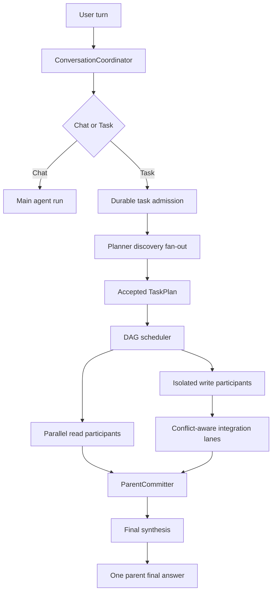
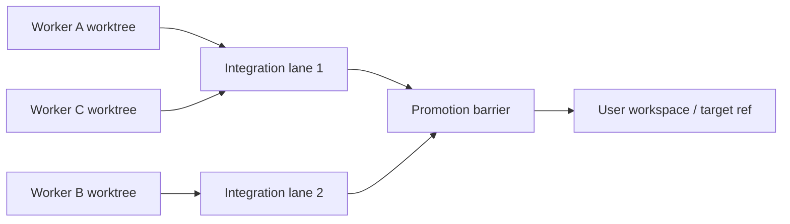

# RFC-0053 Autonomous Task Routing and Parallel Agent Orchestration V1

状态：accepted / O0、O1a-O1e、O2-O5b2、O6a、O6b1、O6b2a-O6g、O7、O8a implemented；O8b public protocol、O8c harness 与 typed routing microturn implemented，O8b application parity、O8c qualified real-model evidence、O8d deferred

创建日期：2026-07-22

依赖：

- [RFC-0001](0001-durable-event-stream-and-event-taxonomy.md)
- [RFC-0002](0002-crash-consistent-mutation-protocol.md)
- [RFC-0003](0003-verification-contract-and-workspace-snapshot.md)
- [RFC-0007](0007-task-dag-and-isolated-agent-workflows.md)
- [RFC-0008](0008-thread-projection-and-agent-graph-observability.md)
- [RFC-0011](0011-crash-resume-and-job-reconciliation.md)
- [RFC-0014](0014-write-isolation-and-worktree-merge.md)
- [RFC-0018](0018-plan-to-task-handoff.md)
- [RFC-0028](0028-real-model-acceptance-and-provider-conformance-v1.md)
- [RFC-0035](0035-tui-orchestration-boundary-hardening-v1.md)

后续集成：

- [RFC-0051 Intent Stack / 意图级版本控制 V1](0051-intent-stack-and-intent-level-version-control-v1.md)
  复用本 RFC 的 TaskPlan、attempt、isolated changeset、integration 和 parent verification
  事实；Intent Stack 未启用时，本 RFC 不创建或猜测 intent identity。

## 1. Problem statement and current residual

Sigil 已有 durable task、planner/executor/subagent role、agent profile、child session、
append-only task projection 和 task DAG。下列列表同时保留 RFC 建立时的历史基线与当前剩余；
已经由 O2-O6b2b 关闭的项目必须按实现检查点理解，不能作为待办重复实施：

- RFC 建立时普通 chat 只有显式 `/task`；O2 已接入 structured task admission，剩余问题是
  HTTP/Desktop parity、默认 rollout 和真实 routing eval。
- `[task].routing_policy` 已在 O1 加入兼容解析，并由 O2 接入 TUI 普通输入；`default_mode` 只保留 composer 偏好语义。Production HTTP/Desktop 已附加 foreground task executor，但完整 Task control/recovery parity 尚未完成，兼容默认值继续保持 manual。
- `multi_agent_mode = "explicit_request_only"` 是默认值，`spawn_agent` 描述明确禁止因任务复杂而主动委派。
- O1 之前 `multi_agent_mode` 只停留在模型提示层；当前 runtime spawn admission 已在 provider、budget 和 thread 创建前执行硬检查。
- ordinary chat 的显式 delegation hard gate 在 kernel 有类型和测试，但 TUI 生产输入没有稳定绑定。
- O4b3a 之前 planner 不能先声明一组受控 Explore probes，再利用并行调研结果形成计划；当前
  TUI Task planner 已接入一次性的 host-owned read-only discovery batch。
- O5a 之前 task scheduler 虽能选出 `read_only_batch`，runner 仍对 batch 中的步骤逐项 `.await`；当前 shared-read-only participant 已进入真实并发执行。
- `TaskChildSessionRunner` 的单成员兼容接口仍接收 parent `Session`、handler 和 approval handler；O5a batch override 已把 participant future 与 parent Session 分离，并把 parent mutation 收口到 prepare/commit。
- O4 前同一模型轮次的 Agent tool calls 会串行阻塞；当前 host-owned joined/background batch 已
  解决已证明安全的 Agent fan-out，其他普通 tool calls 仍按各自 effect policy 调度。
- joined completion 已不再围绕 `wait_agent`；手动 detached/background inspect 仍保留轻量
  status/read surface，但不能退回模型 polling 编排。
- child 的 ancestor/parent/role/profile policy 已单调收窄；invocation-scoped grant 与自然语言
  explicit authority 仍由 O1e 补齐。
- 写 agent 已有 changeset-only foreground 与单 child physical worktree 路径；并行 worktree
  conflict-aware integration 尚未闭环。

因此，问题不是“模型不知道列 TODO”，而是 Sigil 尚未给同一模型提供一个可靠、可恢复、
可并发且可审计的 orchestration control plane。

## 2. Design outcome

V1 将普通对话、Plan mode、durable task 和 agent collaboration 明确拆成四个概念：

| Concept | Product meaning | Durable execution |
| --- | --- | --- |
| Chat | 简单问答、单点调查、局部修改 | 普通 agent run |
| Plan mode | 用户主动进入的只读方案设计 | 只生成可审阅 plan artifact |
| Task | 复杂目标的 durable DAG、状态、恢复和最终 synthesis | 是 |
| Agent | 独立 context 的 participant；Explore、Worker 或自定义 profile | 由 chat 或 Task 调用 |

目标用户行为：

1. 简单问题仍直接回答，不创建 task，不派生 child。
2. 复杂普通 prompt 可以自动 handoff 为一个 durable task，并立即显示 task list。
3. planner 可以用一次受控 discovery fan-out 并行调用 Explore，再生成 accepted plan。
4. 独立只读步骤真实并发执行，模型不负责轮询 child 状态。
5. 多个写 agent 可以并行工作；并行度由冲突域和隔离能力决定，不由全局单锁决定。
6. parent conversation 最终只出现一个正式 final answer；planner/participant 的内部 final 不污染 parent history。
7. 进程中断、429、compaction 或 continue 不会重复建 task、重复 spawn 或重放不确定副作用。

## 3. Non-goals

V1 明确不做：

- 不把 Markdown TODO 当成 durable task list。
- 不用关键词或正则直接决定是否进入 task。
- 不把 Plan mode 和 durable Task 合并成同一种运行模式。
- 不让模型生成 task id、attempt id、permission grant 或 durable terminal status。
- 不让 planner、executor 或 child 通过重复 tool call 轮询运行状态。
- 不把完整 child transcript 注入 parent history。
- 不把 auto task routing 解释成 tool、shell、network 或 merge 权限批准。
- 不允许多个 agent 无协调地修改同一 workspace revision 或同一冲突域。
- 不承诺 crash 后自动重放状态不确定的 provider、tool 或 merge attempt。
- 不新增一组 CLI-first orchestration 命令作为普通用户主入口。
- V1 不建设 teammate-to-teammate 自治通信的完整 agent team；先完成 parent-coordinated participant model。

## 4. Product policy

### 4.1 Task admission policy

替换当前无效的 `task.default_mode` 路由心智，新增：

```rust
pub enum TaskRoutingPolicy {
    Manual,
    Auto,
}
```

语义：

- `Manual`：普通 chat 永远不自动 handoff；`/task` 仍可显式创建 durable task。
- `Auto`：普通 chat 可以通过 typed handoff 请求创建 durable task；目标默认值。

V1 暂不引入 `Suggest`。Suggest 会增加 awaiting-user、decline-resume 和 duplicated prompt ownership；
自动路由稳定后可作为独立增量设计。

### 4.2 Multi-agent policy

保留现有 `MultiAgentMode`，但把它变成 runtime admission policy：

```rust
pub enum MultiAgentMode {
    None,
    ExplicitRequestOnly,
    Proactive,
}
```

规则：

- `None`：拒绝 model-initiated spawn 和用户 `@profile` 手动入口；只保留不创建 child 的观察、取消与关闭能力。
- `ExplicitRequestOnly`：只有 typed user/skill delegation authority 或 accepted TaskPlan step 可以 spawn。
- `Proactive`：允许模型主动 spawn 通过安全证明的 Explore；Worker 仍必须满足 isolation 和 permission。

目标默认值是 `Proactive`，但 O1-O5 只建立 admission、completion 和只读并发基础；必须等
O1e、O6-O8 的写隔离、恢复、产品面和冻结 eval 门槛全部完成后才切换。

### 4.3 Default behavior matrix

| User request | Route | Task list | Agent behavior |
| --- | --- | --- | --- |
| 简单解释、查一个符号 | Chat | 无 | 主 agent 直接处理 |
| 单点局部修改 | Chat | 无 | 主 agent 顺序完成 |
| 跨 crate、实现 + 测试 + 文档 | Task | 自动创建 | planner 可 discovery；DAG 调度 |
| 多个互不依赖的只读调查 | Chat 或 Task | 视目标复杂度 | 2-4 个 Explore 并行 |
| 多个互不依赖的写模块 | Task | 自动创建 | isolated workers + integration lanes |
| `/plan` | Plan mode | 不创建 Task | 只读 planner，可用 read-only discovery |
| `/task` | Task | 立即创建 | 跳过自动 route decision |

## 5. Target architecture


```mermaid
flowchart TD
    U["User turn"] --> C["ConversationCoordinator"]
    C --> R{"Chat or Task"}
    R -->|Chat| A["Main agent run"]
    R -->|Task| H["Durable task admission"]
    H --> D["Planner discovery fan-out"]
    D --> P["Accepted TaskPlan"]
    P --> S["DAG scheduler"]
    S --> X["Parallel read participants"]
    S --> W["Isolated write participants"]
    X --> PC["ParentCommitter"]
    W --> I["Conflict-aware integration lanes"]
    I --> PC
    PC --> Y["Final synthesis"]
    Y --> F["One parent final answer"]
```

### 5.1 Ownership

`sigil-kernel` owns：

- provider-neutral domain types；
- task/agent lifecycle entries and projections；
- pure DAG readiness and conflict-domain decisions；
- typed coordinator actions and public events；
- terminal、resume、idempotency invariants。

`sigil-runtime` owns：

- `ConversationCoordinator` application service；
- provider/profile resolution；
- model-visible tool surface and runtime admission；
- child session creation and participant execution；
- concurrency/provider budget；
- completion hub、integration coordinator and permission meet。

`sigil-tui`、CLI、HTTP/Desktop own：

- submit typed request；
- render public projection/events；
- collect user approval/guidance/cancel；
- 不解析模型文本猜 task phase，不复制 agent loop。

### 5.2 Root-run authority

一次用户输入只创建一个 root `ConversationRun`。Chat handoff、planner、participants、integration 和 synthesis
是它的子阶段。普通 chat agent 在请求 task handoff 后不能再取得 root final-answer authority。

建议引入：

```rust
pub enum AgentRunPurpose {
    Conversation(ConversationPurposeContext),
    TaskPlanner(TaskPlannerContext),
    TaskParticipant(TaskParticipantContext),
    TaskSynthesis(TaskSynthesisContext),
}
```

`AgentRunPurpose` 统一决定：

- 哪些 internal tools 可见；
- user/internal prompt 写入 parent、child 还是 transient context；
- 哪个 run 可以写 parent final answer；
- delegation authority 和 task-tree budget；
- terminal outcome 的 owner。

这将替换当前散落的 `task_plan_update: Option<_>`、plan boolean 和 TUI-side run-kind 特判。

## 6. Ordinary chat to Task handoff

### 6.1 Internal tool

普通 Conversation run 在 `routing_policy = Auto` 时，必须先执行一个独立 routing-only
microturn；该 microturn 只能看到两个 internal tool：

```text
request_task_planning {
  reason_codes: [string]
}

continue_without_task_planning {
  reason: "does_not_meet_task_planning_criteria"
}
```

工具约束：

- 模型必须按语义调用且只调用其中一个 typed decision；host 不根据 prompt 关键词替模型判断。
- routing microturn 不暴露普通 read/write/agent tool，也不允许产生用户可见回答。负向 decision
  被接受后，下一 model turn 才恢复普通工具面并处理用户请求。
- 模型不能传 objective、task id、permission、role、profile 或 plan。
- objective 永远引用本轮已经持久化的 user turn，防止模型改写用户目标。
- `reason_codes` 使用有界枚举，例如 `cross_layer`、`parallel_research`、`multi_stage_change`、
  `long_verification`、`high_risk`；不保存自由文本推理。
- 同一 persisted user turn 只允许一次 accepted handoff。
- 任一 typed routing decision 被接受后，同一 model response 中其他 tool calls 不执行，并记录
  ignored reason。
- free text、未知 tool 或无效参数只允许一次 typed retry；第二次仍无效时以
  `task_routing_unsatisfied` blocked terminal 收口，不能把 routing 文本当成用户回答。
- agent loop 返回 typed `NextAction::StartDurableTask`，不写伪 final answer。

模型 routing instruction 是位于当前 user turn 之前的 transient system message，要求模型按语义
先分类并给出正向或负向 typed decision；它还应明确 negative examples：简单问答、单文件小改、
一次只读查询不应建 task。host 不扫描 prompt 关键词，可靠性通过 route contract 绑定该
instruction 与两个 tool schema，并由 model eval 约束。独立 microturn 避免普通工具面和直接
作答与 task admission 在同一模型回合竞争。

### 6.2 Durable handoff records

```rust
pub struct TaskHandoffRequestedEntry {
    pub handoff_id: TaskHandoffId,
    pub source_turn: ConversationTurnRef,
    pub trigger: TaskAdmissionTrigger,
    pub reason_codes: Vec<TaskAdmissionReason>,
    pub policy_snapshot_hash: String,
    pub requested_at_ms: u64,
}

pub struct TaskHandoffResolvedEntry {
    pub handoff_id: TaskHandoffId,
    pub decision: TaskHandoffDecision,
    pub task_id: Option<TaskId>,
    pub decided_at_ms: u64,
}
```

`TaskAdmissionTrigger`：

- `ExplicitTaskCommand`
- `ModelRequested`
- `ApprovedPlan`
- `ExplicitUserDelegation`

恢复规则：

1. `handoff_id` 由 session、source turn 和 logical run 稳定派生。
2. `Accepted` resolution 必须同时绑定稳定 `task_id`。
3. crash 位于 Accepted 与 `TaskRun Started` 之间时，只补本地 TaskRun，不重新询问模型。
4. 重复相同 handoff 返回既有 task；冲突 resolution fail closed。
5. 原始 user turn 只写一次，planner objective 使用 ref/transient context，不再写第二个 User message。

### 6.3 Explicit `/task`

`/task` 不维护第二套 orchestrator。它转换为 `TaskAdmissionTrigger::ExplicitTaskCommand`，直接调用同一
`ConversationCoordinator::admit_explicit_task`。

## 7. Planner and discovery

### 7.1 Planner transcript isolation

当前 planner 使用普通 `AgentRunInput::user(planner_prompt(...))` 跑在 parent session。目标设计必须改为：

- planner 有独立 participant transcript，或使用不持久化为 parent User 的 transient context；
- parent 只保存 task phase、plan、research links 和 bounded result；
- planner 的内部提示不得在 parent resume 时作为用户消息重放。

### 7.2 Planner-only discovery protocol

Planner 不调用通用 `spawn_agent` / `wait_agent`。新增 planner-only internal tool：

```text
request_task_discovery {
  probes: [{
    probe_id,
    title,
    objective,
    path_hints?
  }]
}
```

规则：

- 每个 planning attempt 最多一次 discovery fan-out。
- 默认最多 3 个 probe，硬上限 4。
- probe 必须互不重叠；host 做 bounded duplicate/path-overlap check，但不使用关键词决定业务范围。
- 所有 probe 固定绑定 trusted built-in Explore、`SubagentRead`、`SharedReadOnly`。
- runtime 先全量预检、预留预算，再并发启动；任一 probe 不合法则零启动。
- completion hub 在全部 terminal 后主动恢复 planner；planner 不调用 wait。
- 注入 planner 的结果按 `probe_id` 稳定排序，内容仅为 bounded summary + result ref。
- 完整 transcript 继续属于 child session。

### 7.3 Plan schema changes

`TaskStepSpec` 建议 additive 增加：

```rust
#[serde(default)]
pub profile_id: Option<AgentProfileId>;

#[serde(default)]
pub failure_policy: TaskStepFailurePolicy;

#[serde(default)]
pub conflict_domain: Option<TaskConflictDomainHint>;

#[serde(default)]
pub intent_refs: Vec<IntentVersionRef>;
```

规则：

- `SubagentRead` 缺 profile 时默认 `explore`。
- `SubagentWrite` 缺 profile 时默认 `worker`。
- profile id 是 identity；`display_name` 继续只用于 presentation。
- profile snapshot/hash 在 attempt start 前绑定，恢复时 hash drift 不得静默换 agent。
- 新 plan schema 不允许 executable `role = planner`；旧日志只做兼容投影。
- `failure_policy` V1 支持 `required | advisory`；required failure 阻断依赖节点，advisory failure 进入 synthesis。
- `conflict_domain` 只是 planner hint，最终冲突域以 materialized write set 和 runtime effect plan 为准。
- `intent_refs` 是 RFC-0051 启用后的 additive extension point。模型只能返回 proposal alias；
  runtime 必须从 accepted IntentPlan 解析为稳定 `IntentVersionRef`。Intent Stack V1 中，
  可形成 selective-drop layer 的 write step 必须精确绑定一个 accepted intent；未绑定或绑定多个
  intent 的 write 仍可执行和审查，但其产物标记为 `unassigned/shared`，不能获得意图级改写权限。
- read/review/verify step 可以关联多个 intent closure；其输出只提供 evidence link，不把模型结论
  变成 acceptance criterion 已通过的系统证据。

### 7.4 Plan mode handoff

`/plan` 仍是一次性只读模式，但输出必须使用与 Task 相同的 structured plan schema。
用户选择执行时，直接把同一 plan 作为 TaskPlan v1 Accepted，不再清空 mapping 后重新调用 planner。

## 8. Task state machine

不要继续依赖 `TaskRun.reason` 文本猜阶段。新增 additive phase entry：

```rust
pub enum TaskPhase {
    Admitted,
    Discovering,
    Planning,
    Scheduling,
    Executing,
    Integrating,
    Verifying,
    Synthesizing,
}

pub enum TaskPhaseStatus {
    Started,
    Completed,
    Blocked,
    Interrupted,
}

pub struct TaskPhaseEntry {
    pub task_id: TaskId,
    pub phase: TaskPhase,
    pub status: TaskPhaseStatus,
    pub attempt_id: Option<TaskAttemptId>,
    pub reason_code: Option<TaskPhaseReason>,
}
```

`TaskPhase` 只表示工作阶段，`TaskPhaseStatus` 只表示该阶段的执行状态；已有
`TaskRunStatus::{Started, Running, Paused, Completed, Failed, Cancelled, Interrupted}` 继续表示
整个 Task 生命周期。不得再把 `Paused/Failed/Completed` 同时当作 phase 名和 run status。

状态流：

```text
Admitted
  -> Discovering? -> Planning -> Scheduling
  -> Executing ready batches
  -> Integrating isolated changes
  -> Verifying merged workspace
  -> Synthesizing
  -> Completed
```

任意非 final phase 可以让 Task run 进入：

- `Paused + AwaitingUser reason`：approval、merge review 或 guidance；
- `Paused + typed blocker`：其他可恢复阻塞；
- cancellation-requested typed entry：已停止新 admission，正在等待 quiescence；不伪造一个已经
  terminal 的 run status；
- `Interrupted`：cleanup 或远端状态不确定；
- `Cancelled`：所有 child/effect permit 已确认 quiescent。

`Completed`、`Failed`、`Cancelled` 与 `Interrupted` 按现有 `TaskRunStatus::is_terminal`
解释；是否可以创建新的 continue attempt 由 typed `TaskResumeEligibility` 决定，不依赖 UI
猜测。phase reducer 必须拒绝从 terminal run 继续追加 Running phase，除非先有合法 continue
admission 和新的 root cancellation scope。

## 9. Participant execution protocol

### 9.1 Attempt identity

不能只靠 `(plan_version, step_id)` 表达 retry 和恢复：

```rust
pub struct TaskStepAttemptEntry {
    pub attempt_id: TaskStepAttemptId,
    pub task_id: TaskId,
    pub plan_version: u32,
    pub step_id: TaskStepId,
    pub role: AgentRole,
    pub profile_binding: AgentProfileBinding,
    pub batch_id: Option<TaskBatchId>,
    pub workspace_snapshot_id: WorkspaceSnapshotId,
    pub status: TaskAttemptStatus,
}

pub struct TaskStepResultEntry {
    pub attempt_id: TaskStepAttemptId,
    pub summary: String,
    pub summary_hash: String,
    pub result_ref: Option<String>,
    pub artifact_refs: Vec<String>,
    pub observed_paths: Vec<String>,
    pub changed_paths: Vec<String>,
    pub verification_refs: Vec<String>,
}
```

结果正文有硬上限；完整 child final 和 transcript 继续留在 child session。

### 9.2 Prepare / execute / commit split

替换当前借用 parent `&mut Session` 的 child runner：

```rust
pub trait TaskParticipantLauncher {
    async fn start(
        &self,
        request: TaskParticipantStartRequest,
    ) -> Result<TaskParticipantHandle>;
}

pub struct TaskParticipantHandle {
    pub attempt_id: TaskStepAttemptId,
    pub cancellation: RunCancellationHandle,
    pub completion: oneshot::Receiver<TaskParticipantOutcome>,
}
```

执行拆成：

```text
prepare(parent projection)
  -> durable Started + PreparedParticipantRun
execute(prepared child-owned session)
  -> ChildTerminalEnvelope
commit(parent, envelope)
  -> durable attempt/result/projection update
```

约束：

- `prepare` 在 provider dispatch 前持久化 Started、profile、permission、snapshot 和 input hash。
- `execute` 不持有 parent Session、parent handler 或 parent approval handler 的可变借用。
- child completion 只发送一次 terminal envelope。
- `ParentCommitter` 按 attempt id 去重并串行写 parent control log。
- completion 到达顺序可实时显示；注入模型的结果按 plan order/request key 稳定排序。

这里的 parent single writer 是审计与 projection 不变量，不是 agent 执行或 merge 并发限制。

## 10. True read-only concurrency

### 10.1 Runnable batch

Scheduler 输出：

```rust
pub enum TaskLaunchBatchKind {
    ParallelReadOnly,
    IsolatedWrite,
    ExclusiveEffect,
}

pub struct TaskLaunchBatch {
    pub batch_id: TaskBatchId,
    pub kind: TaskLaunchBatchKind,
    pub steps: Vec<TaskParticipantStartRequest>,
}
```

只有以下步骤可进入 `ParallelReadOnly`：

- child participant，不共享 parent transcript；
- effective ToolSpec 全部被证明为 read-only；
- 无 network mutate/unknown、MCP unknown、external directory 和 shell execute；
- 无 active conflicting write/integration lease；
- parent、role、profile、invocation 四层 permission meet 为 Allow；
- workspace snapshot 已绑定。

普通 executor step 若继续写 parent session，仍是 exclusive；独立读取应由 planner 转成 `SubagentRead`。

### 10.2 Runtime execution

- runtime 使用 `JoinSet` / `FuturesUnordered` 管理 child handles。
- 独立 child failure 不立即取消 sibling；只阻断 transitive dependents。
- 所有仍可执行 sibling terminal 后，batch 汇总成功/失败给 coordinator。
- user cancel 传播到同 batch 的 active children。
- provider route 出现 pressure 时缩小后续 fan-out，不让模型发起 polling/retry storm。

有效并发度：

```text
min(
  task.max_parallel_read_steps,
  task.max_subagents,
  runtime active-child budget,
  provider route budget
)
```

O5a 已把 read concurrency 改为 `[task].max_parallel_read_steps` config input，默认值为 `4`。
O6a 为独立 `ChangesetOnly` proposal 增加第二个有界并发面：有效并发度由
`[task].max_parallel_changeset_steps`（默认 `2`）、`max_subagents`、runtime active-child
budget 和 provider route budget 共同限制。read-only 与 changeset-only batch 不混跑，
shared-workspace direct write 继续保持 exclusive。

### 10.3 Projection

`current_step: Option<_>` 不能表达并行。新增：

```rust
pub active_steps: BTreeSet<(u32, TaskStepId)>;
```

`current_step` 暂时作为兼容 view：只有恰好一个 active step 时返回 `Some`。

## 11. Batch agent tools for ordinary chat

Task DAG 不应依赖模型调用 agent tools，但普通 Chat 仍需要稳定 fan-out。新增：

```text
spawn_agents {
  members: [{
    request_key,
    profile_id,
    objective,
    prompt
  }],
  completion_mode: "join_before_final" | "background"
}
```

规则：

- 先对全 batch 做 profile、permission、budget、tool safety 和 isolation 预检，再原子预留 slots。
- 任一 member 预检失败则零启动。
- `batch_id` 由 parent logical run + tool call id 稳定派生。
- thread id 由 `batch_id + request_key` 稳定派生；tool replay 不重复创建 child。
- batch member Started 按 request key 稳定顺序写入，然后并发启动。
- `join_before_final` 注册 parent dependency；不要求模型随后调用 wait。
- `background` 立即返回，terminal 时只标记 result-ready，不抢占用户 follow-up。
- 保留 `spawn_agent` 作为单 member compatibility wrapper。

V1 不新增模型可见的 polling `await_agents`。Host-owned join 由 completion hub 触发；用户或高级 API 如需等待，
可以有非模型循环的 typed wait endpoint。

2026-07-23 落地的 O4b2 compatibility slice 先提供 `completion_mode=join_before_final`：
`request_key` 在批内唯一并稳定排序，host 对 2-4 个只读 participant 做完整预检和原子 slot
reservation，完成后注入 `agent_batch_results` 并自动恢复 parent。O4b2 最初让 `batch_id` 由
parent session ref 与外层 tool call id 派生；O4b3b identity slice 已改为由 kernel 传递的
parent logical run id 与 tool call id 派生，不再把 session 文件路径当作运行身份。detached
`background` batch 也已接入同一身份、预检和原子 slot reservation。restart reconciliation
会在 session writer restore 时依据 durable thread/attempt/result/continuation evidence 收口：
缺失 live owner 的 thread/attempt 变为 Interrupted，不能证明安全的 continuation 变为 Failed，
不会重放 provider 请求。

## 12. Completion-driven continuation

引入 `AgentCompletionHub`：

- 每个 child/attempt 只发布一次 terminal envelope。
- envelope 带 thread、attempt、batch、status、summary hash、result ref 和 effect facts。
- ParentCommitter 持久化 terminal/result 后，才发布 continuation-ready。
- 一个 batch generation 最多启动一次 parent continuation。
- joined batch completion 优先于普通 follow-up，因为原始 root run 尚未完成。
- detached background completion 不自动调用 provider，也不抢占 queued input。
- provider 429、进程恢复、重复 event 不得重复 delivery。

恢复给模型的 transient context：

```json
{
  "type": "agent_batch_results",
  "batch_id": "batch-...",
  "members": [
    {
      "request_key": "inspect-kernel",
      "status": "completed",
      "summary": "...",
      "result_ref": "agent-result://...",
      "changed_paths": [],
      "risks": []
    }
  ]
}
```

不再注入“请调用 wait_agent”的提示。需要全文时仍使用分页 `read_agent_result`，分页正文只进当前 transient context。

## 13. Permission and admission

### 13.1 Monotonic permission meet

child effective permission 不能通过 config 覆盖合并得出。每个 concrete tool call/subject 分别评估：

```text
effective =
  parent decision
  intersection role decision
  intersection profile decision
  intersection invocation grant

Deny > Ask > Allow
```

保证：

- parent deny 永远不能被 role/profile 放宽；
- role policy 不得被忽略；
- profile 只能收窄；
- 批准 spawn 不等于 blanket approval child tools；
- task auto routing 不改变 permission；
- session grant 只对规范化 permission signature 生效。

### 13.2 Runtime spawn admission

```rust
pub struct AgentSpawnAdmissionContext {
    pub source: AgentInvocationSource,
    pub authority: DelegationAuthority,
    pub profile_binding: AgentProfileBinding,
    pub isolation: TaskIsolationMode,
    pub tool_contract_fingerprint: String,
}
```

`DelegationAuthority` 由 host 绑定，模型参数不能伪造：

- `UserExplicit`
- `AcceptedTaskPlan { task_id, plan_version, step_id }`
- `ModelProactive`

`multi_agent_mode` 在 runtime 检查：

- `None` 拒绝所有 model authority；
- `ExplicitRequestOnly` 只允许 UserExplicit / AcceptedTaskPlan；
- `Proactive` 允许通过 safety proof 的 ModelProactive Explore。

Recovery 不属于 agent spawn authority。startup/resume 只能执行 runtime 内建、zero-forward-effect、
幂等的 typed reconciliation action；它不能创建 child、发起 provider/tool/merge 请求，也不能从
旧 admission 重新铸造 `AgentInvocationGrant`。需要继续执行时必须走新的显式 continue/root-run
admission。

### 13.3 Approval UX

- 全部安全 Explore：不逐成员询问。
- Worker/custom/network/MCP：一次 batch-level spawn preview。
- preview 展示 profile、成员数、目标、isolation、工具范围和预期 effect，不展示内部 schema 噪音。
- child 真正的 Ask 仍带 thread/batch source；V1 background child 遇到 Ask 可进入 typed `BlockedNeedsApproval`，
  不静默 deny、不无限等待。
- 完全相同 permission signature 可以聚合审批并复用 session grant。

## 14. Parallel writes and integration lanes

### 14.1 Correct invariant

V1 不采用“所有写入只能由一个 merge owner 串行完成”的全局限制。正确不变量是：

> 多个 agent 不能无协调地同时修改同一个 workspace revision、branch ref 或 conflict domain。

`ParentCommitter` 仍是 parent control log 的逻辑单写者；写 agent 执行、验证和隔离集成可以并行。

### 14.2 Write modes

1. `ChangesetOnly`
   - workers 基于同一 immutable snapshot 并行生成 proposals；
   - 不直接修改 parent workspace；
   - proposal 带 declared/observed write set、base revision 和 verification facts。

2. `Worktree`
   - 每个 worker 在独立 physical workspace 写入；
   - 必须物化用户当前 snapshot，包括允许的 dirty/untracked 内容，而不是简单从 HEAD fork；
   - build artifacts 隔离；可共享安全的 compiler cache；
   - child 验证只证明 isolated state，promote 后仍需 parent-level verification。

3. `SharedWorkspaceWrite`
   - V1 仅 exclusive；
   - 后续只有 exact path lease、actual write-set enforcement、CAS 和 effect classification 全部成立时，
     才允许 disjoint direct writes 并行；
   - formatter、codegen、package manager、git ref、全仓脚本和未知 shell 始终进入 exclusive effect lane。

### 14.3 Conflict graph

Integration Coordinator 根据以下事实构建 graph：

- base workspace snapshot / branch ref；
- declared and materialized changed paths；
- file content hashes and CAS preconditions；
- task DAG dependencies；
- shared generated artifacts；
- build/package/git/global effect classification。

两个 proposals 只有在下列条件全部满足时才进入不同 integration lanes：

- changed path sets disjoint；
- 没有 dependency edge；
- 不触及同一 generated artifact 或 global effect；
- base snapshot compatible；
- verification scopes 可独立执行。

### 14.4 Multi-lane integration


```mermaid
flowchart LR
    W1["Worker A worktree"] --> L1["Integration lane 1"]
    W2["Worker B worktree"] --> L2["Integration lane 2"]
    W3["Worker C worktree"] --> L1
    L1 --> G["Promotion barrier"]
    L2 --> G
    G --> P["User workspace / target ref"]
```

- 独立 lanes 可以并行 rebase/apply 到 integration refs，并行运行 scoped verification。
- 同一 branch ref 的最终推进使用 compare-and-swap，ref update 本身短暂串行。
- promotion 到用户当前 workspace 使用 RFC-0002 mutation protocol 和 exact current snapshot check。
- 某 lane 变 stale 只重算该 lane，不取消不冲突 lanes。
- 多 repository/workspace scope 可以拥有独立 promotion barriers。
- 冲突 resolution 是新的 isolated attempt，不让 agent 直接覆盖 winner。

这使长时间的写、测试、rebase 和冲突预处理保持并行；只有真正共享的最终 effect 被序列化。

## 15. Rate limit, retry, cancellation and recovery

### 15.1 Provider pressure

增加 provider-neutral `RateLimited { retry_after_ms, route_fingerprint }`：

- 同一 provider route 共享 cooldown；429 后暂停新 admission，不取消已运行请求。
- 尊重 Retry-After；缺失时使用有界指数退避和 attempt-id-derived deterministic jitter。
- 自动 retry 只允许 read-only/idempotent 且可证明 zero-output、zero-tool、zero-effect 的 attempt。
- 默认最多 2 次，总等待有上限。
- retry 使用新 physical attempt id，保留 thread、profile snapshot 和 input hash。
- transport uncertain、已有模型输出、已有 tool/effect 或 write worker 不自动 retry。
- `RetryScheduled` 持久化 `not_before`；恢复后至多继续一次，不形成 retry storm。

O5b2b 已落地其中的 pressure detection/cooldown 子集：canonical provider 在 HTTP 429 时使用
kernel `ProviderRateLimitError` 保留 provider-owned source error，并把 `Retry-After` 的
delta-seconds 或 HTTP-date 解析为 `retry_after_ms`。Task role provider 由同一
`AgentSupervisor` 生命周期共享的 provider+model route-pressure registry 包装；重建 task
runner 不会丢失 cooldown。每个 model turn 在发请求前检查 cooldown，429
使用 `Retry-After` 或有界指数退避+确定性 jitter，单次 cooldown 上限 120 秒。同一路由后续
read batch 会用 kernel `ProviderRouteCooldownError` 在 whole-batch preflight 阶段零 provider
dispatch、零 child Started 地拒绝，并为所有 member 保留 typed retry-after/route metadata；
不同 model route 不互相阻塞，429 前已在途请求不被取消，较早在途成功也不能清除较新的
cooldown。当前 fallback jitter 由 route+连续 429 次数稳定派生。

O5b2c 已为 shared-read-only Task step 接入 durable bounded retry。真实 provider 失败只有在
child session 的 physical-attempt projection 恰好证明 `ConfirmedNoModelConsumption +
RateLimited`、零 durable output/side-effect ref 且 child transcript 没有 assistant/tool/effect
记录时才获得 retry authority；whole-batch preflight 的 cooldown 则使用
`AdmissionRejectedBeforeDispatch` 零派发证明。普通 transport uncertain、已有 text delta、
tool/effect 或 write step 均不自动 retry；Planner/Synthesis 在 O5b2c 阶段尚未接入。Parent 以一个原子 append batch
提交旧 attempt `Failed`、`TaskParticipantRetryScheduled` 和 step `Pending`，schedule 绑定
route fingerprint、retry-stable input hash、旧/新 attempt id、`not_before` 与 proof。默认每个
step 最多 2 次自动 retry、累计等待最多 120 秒；replacement 使用新 attempt id、child session
和 logical run，恢复后只消费尚未 Started 的 durable schedule。输入 hash drift 会在 provider
dispatch 前 fail closed。实际 Retry-After/cooldown 之上增加 attempt-id-derived deterministic
jitter；supervisor 的 process-local cooldown 仍不是单独的 restart 授权。

O5b2d1 已在同一个 task provider-pressure registry 上加入 process-local adaptive route
concurrency window。每个 `provider + model` route 独立计数，TUI 的
`[task].max_parallel_read_steps` 同时作为窗口上限；provider request 只有在真正 dispatch
前领取 route lease，lease 覆盖完整 response stream，并在 `Done`、error 或 stream drop 时
释放。HTTP 429 对当前窗口执行乘法下降（最小为 1），cooldown 后的成功 completion 按当前
窗口大小累计并做加法恢复，直至配置上限。窗口饱和只暂停该 route 的新 dispatch，不阻断不同
route，也不取消已在途请求；429 仍继续使用 O5b2c 的 durable retry authority。窗口、in-flight
计数与恢复进度属于 supervisor 生命周期内的运行态，不作为 restart 后自动重放授权，也没有
进入 kernel 公共协议。

O5b2d2 将相同的 durable retry authority 扩展到隔离 Planner 和 Synthesis participant。它们
仍必须由 child physical-attempt projection 证明 `ConfirmedNoModelConsumption + RateLimited`
且 child session 没有 assistant、tool result、tool execution/egress、TaskPlan 或 changeset
记录；Planner 已经调用 discovery/task-plan tool 或 Synthesis 已经产生文本后都不能自动重试。
失败 attempt 与 `TaskParticipantRetryScheduled` 原子追加，新 attempt 使用独立 child session
和 logical run；schedule 继续绑定 retry-stable input hash、route、proof 与 `not_before`。Planner
和每个 plan version 的 Synthesis 各自最多 2 次自动 retry、累计等待最多 120 秒，重启只消费
未 Started schedule。预算耗尽后 Planner 保持原有 task Failed，Synthesis 保持原有 task Paused
语义。

### 15.2 Failure policy

- required child failure 阻断其 transitive dependents，但不取消独立 siblings。
- advisory child failure 进入最终 synthesis。
- batch 收集所有可执行结果后再决定 phase，不在首个失败处丢失其他结果。

### 15.3 Cancellation

- joined child 随 root run cancel；detached background child 由 session/显式 child cancel 拥有。
- cancel 先关闭新 admission，再传播 cancellation handle。
- completion/cancel race 由 ParentCommitter 的 durable append 顺序裁决。
- 所有 child/effect permit quiescent 后才能写 Cancelled。
- deadline 后仍不确定则写 Interrupted/CleanupIncomplete。
- cancelled parent 后到达的 child success 可保留 child facts，但不能重新触发 merge 或 final continuation。

### 15.4 Restart reconciliation

- Started without terminal 的 participant 变 Interrupted，不自动重放。
- Accepted handoff without TaskRun 可安全补 TaskRun。
- terminal batch without delivered continuation 恢复并投递一次。
- delivered continuation 不重复注入。
- running isolated worktree 进入 cleanup/review inventory，不自动 merge。
- stale proposal 保留审计和 preview，不自动 apply。

## 16. Final synthesis

Task 全部 required steps terminal、integration 和 parent verification 完成后，运行 system-owned synthesis：

- 输入：原始 objective ref、accepted plan、bounded step results、conflict/merge/verification projection；
- 默认只读工具面；发现缺口只能请求 typed replan，不直接临时写 workspace；
- 只允许 synthesis 写一个 parent `AssistantMessageKind::FinalAnswer`；
- executor、planner、child final 都不是 parent final；
- synthesis 前再次检查 required steps、pending approval、active effect、verification verdict 和 changed-file facts。

## 17. TUI product design

### 17.1 Automatic handoff

普通 prompt 被 handoff 后：

- composer 正常清空，live panel 显示 `Planning task…`；
- planner 创建计划后显示 durable task strip；
- 不新增必须记忆的 slash command；`/task` 仍是确定性显式入口；
- auto routing 不弹“允许 AI 思考”类审批；真正 write/execute/network 仍按 permission 流程。

### 17.2 Task strip

Task strip 与 live progress、follow-ups 必须是三个有边界的区域：

```text
Task · 3/7 complete · 2 agents running
  ✓ inspect kernel
  ◉ inspect runtime       Explore A
  ◉ inspect TUI           Explore B
  ○ implement coordinator
────────────────────────────────────────
Live · Exploring 2 scopes…
────────────────────────────────────────
Follow-ups · 1 pending
```

规则：

- task strip 显示 pending/running/completed/failed/blocked 和 active agents；
- 当前步骤可展开 detail，不默认展示 role/schema/internal ids；
- completed task 在一个 turn 后折叠，但可从 task/history surface 恢复查看；
- F2 隐藏 info rail 不影响 task strip 的主区域宽度计算；
- agent panel 展示 batch/member status，child transcript 仍可 inspect；
- detached background completion 只显示 result-ready，不抢 composer 焦点。

### 17.3 Follow-ups during task

增加：

```rust
ConversationInputTarget::Task { task_id }
ConversationInputKind::TaskGuidance
```

- active task 默认 follow-up 目标为当前 task，而不是新 main-thread chat；
- guidance 在 scheduler safe point 应用；
- 已 promotion/dispatched 的 follow-up 从 pending list 删除，durable audit 继续保留；
- joined agent completion 优先恢复原 root run；普通 queued follow-up 随后 dispatch；
- 用户可显式把 message 定向到某 child agent。

### 17.4 User actions

高频 action 只保留：

- Pause / Continue
- Cancel
- View plan
- View agents
- Review integration

复杂并发预算、failure policy 和 conflict domain 不进入默认 footer；留在 advanced config/diagnostics。

## 18. Public events and observability

增加 bounded provider-neutral public events：

```rust
TaskRoutingChanged { handoff_id, status, task_id }
TaskPhaseChanged { task_id, phase, status }
TaskPlanUpdated { task_id, plan_version, steps }
TaskBatchChanged { task_id, batch_id, active, completed, failed }
TaskStepChanged { task_id, step_id, attempt_id, status }
IntegrationLaneChanged { task_id, lane_id, status, conflicts }
```

TUI/HTTP/Desktop 不应解析 opaque `Control.payload` 才能显示核心 task state。

必须记录的指标：

- task routing rate、false-positive cancel/undo rate；
- simple prompt direct rate；
- plan/replan count；
- proactive Explore spawn rate；
- actual max/average parallelism 和 overlap duration；
- parent wait-model-turn count，目标为 0；
- time to first useful result / first edit / completion；
- token/cost overhead by parent/planner/child/synthesis；
- 429/cooldown/retry count；
- duplicate handoff/spawn/continuation prevented count；
- integration lane parallelism、conflict、stale proposal rate；
- restore reconciliation outcomes。

## 19. Configuration and migration

目标配置：

```toml
[task]
enabled = true
routing_policy = "auto"
multi_agent_mode = "proactive"
max_plan_steps = 12
max_replans = 2
max_subagents = 8
max_parallel_read_steps = 4
max_parallel_changeset_steps = 2
max_planning_research_agents = 3
allow_write_subagents = true
```

迁移：

1. `default_mode` 标记 deprecated；一版内保留解析和 warning。
2. 显式 legacy `default_mode = "chat"` 映射 `routing_policy = "manual"`，避免升级后突然自动编排。
3. 显式 legacy `default_mode = "plan"` 只映射 composer Plan-mode preference，不隐式启动 Task。
4. 未配置的新安装只有在 O8d rollout gate 完成后才默认
   `routing_policy = "auto"`、`multi_agent_mode = "proactive"`；此前继续保持 manual/explicit。
5. 旧 session 缺 phase/attempt/batch entries 时使用 legacy projection；running legacy step 恢复为 Interrupted/Paused。
6. 不扫描旧 prompt 猜测并补建 task。
7. unfinished legacy task 只能显式 continue，不自动重放。
8. 新字段使用 `serde(default)`；新 entry 通过 session schema/version capability 管理。

`max_subagents` 继续作为整个 agent tree 的 active child 上限，不再叠加多套难以解释的 token spawn threshold。

## 20. Implementation plan

### 2026-07-23 implementation checkpoint

- O0 事实基线已落地：RFC-0007 和回归测试明确当前只有 ready batching，runner 仍串行；planner internal prompt 污染的基线断言已在 O2 翻转为 transient-only。
- O1a 已落地安全基础：`multi_agent_mode` 在 provider、budget reservation 和 `AgentThreadStarted` 之前 fail closed；`none` 同时覆盖 model spawn 与 `@profile`。生产 runtime 不再暴露 ambient authority setter，模型工具参数不能提供 authority。每次成功启动前追加 `AgentDelegationAdmitted`，绑定 thread、profile、mode、source、objective hash 与冻结后的 tool-contract fingerprint。
- O1b 已落地第一阶段：child 的 ancestor、parent、role、profile materialized policies 在 concrete ToolSpec、operation、network effect 和 subjects 上逐层求最严格决策；prepared execution 复用同一 policy chain。invocation-scoped permission grant 尚未实现，不得把当前实现描述为四层 permission meet。
- O1e 尚未落地：普通自然语言输入在 `explicit_request_only` 下还不能形成 host-owned
  delegation authority；当前只有 `@profile` 和 accepted TaskPlan 等 typed source 可以获得
  authority。invocation-scoped grant、确认后的 natural-language delegation handoff 和逐 tool-call
  revalidation 必须在默认切换前完成。
- O1c 已落地：proactive Explore 基于冻结 registry 的实际 ToolSpec、network effect 和 `ToolMutationTracking` 证明；Custom/MCP 默认 unknown，已审计的本地只读 Custom tool 显式声明 `None`；detachable 分支复用同一证明。
- O1d 已落地配置基础：新增 `routing_policy = "manual" | "auto"`，缺字段保持 `manual`；O2 已接入生产 consumer，兼容迁移 warning 和新安装默认值仍留待 O8。
- O2 已落地 runtime-owned `ConversationCoordinator`、host-owned `AgentRunPurpose`、内部 `request_task_planning`、typed `AgentRunDisposition` 和 recovery-critical handoff events。TUI direct chat 与 queued follow-up 均绑定精确 source turn，并在同一 cancellation/approval root 内接管 durable task。后续 O8 runtime slice 已让 production HTTP/Desktop 附加同一 foreground executor/synthesis contract；完整 Task control/recovery parity 仍由 O8b 收口。
- `/task` 已复用相同 admission service；planner prompt 改为 transient context，orchestrator 会复用既有 `TaskRun::Started` 和 accepted plan，不重复 admission 或 replan。
- TUI 启动及 session switch 都执行本地 handoff reconciliation；Requested→Resolved→TaskRun 的 crash gap 不重放 provider。只有可证明未发起不确定 planner/participant 的 admission gap 才自动接管；stale Running step/lease 先记为 Interrupted、task 置 Paused，等待显式 continue。
- direct chat 与 queued follow-up 的 task handoff 会在 `TaskHandoffRequested` / `Resolved` / `TaskRun::Started` 之前追加 `TaskRunCancellationScopeBound`，把 task 绑定到继承的 root run scope，避免 admission→binding 崩溃窗口。恢复只认可最新绑定 scope 上的 `Run` 或同 task `Task` cancellation；后续显式 continue 使用新 scope，因此旧取消不会永久污染 task。
- O3 已落地 participant isolation：Planner、Executor、Subagent 和 Synthesis 都写入 retry-stable child session，parent 只保存 bounded summary、result ref、attempt/result lifecycle 与 task control state。child 的 assistant/text delta 不再进入 root TUI stream。
- O4b1 已落地 runtime-owned `AgentCompletionHub` 和 single-delivery terminal envelope：完整 batch 在任何 participant future 被 poll 前拒绝重复 attempt identity；accepted registration 由 consuming hub 每项只产出一个 terminal envelope，同时保留真实 completion order 和稳定 request sequence。现有 O4a join barrier 已复用该 hub，完成顺序可以实时收集，parent durable commit 继续单写，注入模型前继续按原 tool-call sequence 稳定排序。
- O4b2 已落地普通 chat 的 `spawn_agents` join compatibility surface：schema 接受 2-4 个带稳定 `request_key` 的 participant，整批完成 profile、delegation、permission/tool-safety、provider/session materialization 和 budget 预检后才原子预留全部 active slots。容量或任一成员预检/注册失败时不 poll 任何 provider future；成功 join 批次并发执行，经 completion hub 收口后按 `request_key` 稳定顺序注入 typed `agent_batch_results`，parent 不产生 `wait_agent` polling turn。
- O4b3a 已为隔离 Task planner 注册 planner-only `request_task_discovery`。每次 planning
  attempt 最多调用一次，默认最多 3 个 probe、硬上限 4；所有 probe 固定使用 trusted built-in
  Explore、`SubagentRead` 和 `SharedReadOnly`。Runtime 在 provider dispatch 前完成重复 id/objective、
  workspace-relative path、结构重叠、profile/tool-safety、容量与 session materialization 检查，再
  原子预留整个 batch。成功批次经 completion hub 真实并发，全部 terminal 后按 `probe_id`
  稳定排序注入 typed `task_discovery_results` 并自动恢复 planner，模型 polling turn 为 0。
- O4b3b 的 durable/TUI projection slice 已完成：kernel 新增 provider-neutral
  `AgentBatchId`，`AgentThreadStarted` 可选携带 `batch_id` / `batch_member_key`，旧日志缺字段继续
  兼容；ordinary `spawn_agents` 和 planner discovery 都在 provider dispatch 前冻结并在 Started
  entry 中持久化该身份。projection 按首次出现顺序重建 batch/member，保留首个 member-key
  绑定并标记 parent mismatch、duplicate key 或不完整 identity。TUI 直接消费该 projection，
  展示不可选 batch header 与缩进成员，compact info rail 优先保留 header，且 `/agent N` 的
  可选序号不会被 header 行偏移。
- O4b3b 的 parent logical-run identity slice 已完成：kernel 通过 provider-neutral
  `AgentToolDelegate` 在批准 Agent tool 后、child admission 前绑定当前 root logical-run id；
  runtime 使用 `root logical-run id + outer tool call id` 派生 opaque `AgentBatchId`，缺失或空
  identity 时整批 fail closed。该身份不作为 provider response handle 暴露给模型，也不再依赖
  session 文件路径；同一 root run 的 tool replay 得到相同 batch id，不同 root run 相互隔离。
- O4b3b 的 detached background batch slice 已完成：`spawn_agents` 接受
  `completion_mode=background`，沿用整批 profile、permission/tool-safety、provider/session、
  budget 预检和原子 slot reservation。每个 member 有独立 cancellation owner 与 mailbox；runtime
  在所有 detached handles 原子注册前用启动闸门阻止 provider dispatch，注册失败则整批零
  provider 启动并写失败终态。成功后 tool 立即返回，members 真并发运行；空闲 collector 单写
  terminal/result，TUI 沿用 non-blocking `AgentResultContinuation(Pending)` 显示 result-ready，
  有 queued follow-up 时不抢占输入，也不要求模型轮询。
- O4b3b 的 restart reconciliation 已完成：session writer restore 先为无终态 attempt 追加
  `AgentRunInterrupted`，再收口仅有 ThreadStarted/Running、尚未来得及写 AttemptStarted 的 crash
  window；因此 batch 的所有未知 member 都进入 Interrupted terminal，active batch 计数归零。
  continuation 已为 Started 时，provider delivery outcome 不确定，恢复追加 Failed；Pending 只有在
  child result 已 durable 时才保留为可继续，否则同样 Failed。恢复条目幂等，第二次 load 不重复
  追加，也不根据稳定 batch id 或旧 handle reference 自动创建新的 provider request。
- approved `/plan` 的 `sigil-plan-v2` executable schema 只有在 base/current workspace snapshot 均存在且完全相等时，才直接 promotion 为同一份 `TaskPlan v1 Accepted`，保留 step mapping，不再调用第二个 Planner；snapshot 缺失、旧 `sigil-plan-v1` 或字段不完整的 draft 继续走隔离 planner 兼容路径。draft 会持久化解析出的 schema version；task id 由 plan id 与 plan hash 稳定派生，`TaskCreatedFromPlan` 记录 durable link，`PlanDecisionRecorded(Accepted)` 是最终提交标记。提交前 crash 会继续显示 pending 并幂等补齐同一 task；若期间 workspace drift，则 supersede 已提升 plan、取消未完成 task并要求重新规划。
- Task 完成后由隔离 Synthesis participant 生成结果，只有 host 可以向 parent 追加唯一正式 final。`TaskFinalAnswerCommitted` 绑定 task、plan version、synthesis attempt、child message ref 和内容 hash；启动恢复可幂等修补 child-result-only 或 parent-assistant-only 的部分提交前缀。
- ordinary-chat natural-language explicit delegation 仍不得用关键词扫描补 authority。`@profile` 使用固定的 user-explicit admission，并继续受 `multi_agent_mode` 约束。

本 checkpoint 表示 O4b3a、O4b3b、O5a、O5b1、O5b2a whole-batch admission、O5b2b
process-local provider route cooldown、O5b2c shared-read-only durable bounded retry、
O5b2d1 adaptive provider route concurrency window 和 O5b2d2 Planner/Synthesis retry
以及 O5b2d3a 实时 route attribution/diagnostics、O5b2d3b completion-arrival 与
request-order durable commit 双序视图，以及显式 prepare/detached future/one-shot commit
envelope 边界均已完成。O6a 也已完成 changeset-only proposal 的有界真实并发、共享 immutable
base snapshot、parent snapshot revalidation 与稳定 proposal/review commit；后续工作从 O1e
和 O6c 开始。

### O0: Truth baseline and contract correction

范围：kernel/runtime/TUI/docs；不改变默认行为。

- 增加测试证明当前 read-only batch 实际串行。
- 记录普通 chat 无 `task_plan_update`、`default_mode` 未接线、hard gate 未进入生产路径的事实。
- 修正文档中“read concurrency/hard gate 已完成”的过度声明。
- 为 planner internal prompt 污染 parent history 增加失败回归。
- 冻结 RFC-0053 类型和迁移边界。

退出条件：文档与 live code 一致；后续测试能先红后绿证明每个缺口。

### O1: Runtime admission and permission foundation

实施状态：O1a-O1d 完成；O1e deferred。

已完成：

- runtime 强制执行 `multi_agent_mode`，不再只依赖工具描述。
- ancestor、parent、role 和 profile policy 在 concrete tool call 上单调收窄。
- 自动 Explore 按最终 ToolSpec/effect proof 判定，不按工具名称白名单。
- 把 `default_mode` 迁移为真实 `routing_policy`。

O1e：invocation-scoped grant 与普通输入显式委派闭环。

1. runtime 新增 host-minted、模型参数不可构造的 `AgentInvocationGrant`。它绑定 source turn、
   authority、profile、role、isolation、允许的 tool/effect upper bound、root cancellation scope、
   tool-contract fingerprint 和有效期；durable entry 只保存安全 fingerprint 与来源，不保存可重放
   的 ambient capability。
2. `@profile` 与 accepted TaskPlan 分别产生 `UserExplicit`、`AcceptedTaskPlan` grant。
   `Proactive` Explore 只能获得 read-only、无 network mutate/unknown、无 external path 和无
   unknown custom/MCP effect 的 `ModelProactive` grant。System recovery 不产生 invocation
   grant，只能执行 §13.2 的 zero-forward-effect reconciliation。
3. `explicit_request_only` 下的普通自然语言不能靠关键词扫描直接铸造 `UserExplicit`。模型只能
   返回 typed `request_agent_delegation` proposal；runtime 展示一次 bounded batch preview，
   用户确认后才铸造对应 invocation grant。拒绝或取消继续原 chat，不创建 child。
4. child 每次 concrete tool call 和 prepared execution 都计算
   `ancestor ∩ parent ∩ role ∩ profile ∩ invocation grant`；显式 `Deny/Ask`、network/source
   policy、protected path 和 external-directory gate 不能被 grant 放宽。
5. spawn admission 与 tool execution 前都重新核对 source turn、profile/tool fingerprint、
   workspace snapshot 和 cancellation scope；任一漂移在 provider/tool effect 前 fail closed。
6. 增加 durable projection 与恢复规则：confirmed grant 只能在绑定 root run 内使用；crash 后
   未开始的 grant 失效，已 Started attempt 按现有 interrupted reconciliation 收口，不能凭旧 grant
   自动重放 provider、工具或创建 recovery child。

O1e 验收：

- parent/profile/invocation 任一层 `Deny` 都不能被 child 放宽；
- natural-language proposal 未确认时 child/provider dispatch 为零；
- 同一确认只授权 preview 中的 exact batch/profile/effect upper bound；
- profile、tool schema、workspace 或 source-turn binding 漂移时零 effect；
- `none`、`explicit_request_only`、`proactive` 的正反例均由 runtime 测试证明，而不是只检查 prompt。

O1 总退出条件：四层 permission meet 真实生效；unsafe 同名 tool 不能伪装 Explore；
ordinary natural-language delegation 不依赖关键词且没有 ambient authority；mode 配置改变真实
spawn admission。

### O2: ConversationCoordinator and auto handoff MVP

实施状态：完成（2026-07-23）。兼容默认值仍为 `manual`，待 O8 才评估切换。

- 新增 runtime-owned `ConversationCoordinator`。
- 新增 `AgentRunPurpose`、`request_task_planning` 和 typed handoff outcome。
- `/task` 与 ordinary chat 复用同一 task admission service。
- handoff/task idempotency、crash gap reconciliation。
- simple prompt scripted negative protocol regression；真实模型 routing eval 留在 O8。

退出条件：复杂普通 prompt 只写一个 User entry并创建一个 Task；简单 prompt 无 task；重复 handoff 不重复创建。

### O3: Planner transcript isolation and final synthesis

实施状态：完成（2026-07-23）。

- Planner、Executor、Subagent、Synthesis 使用 child-owned transcript；parent 只投影 bounded result 与 durable ref。
- `TaskParticipantAttempt` / `TaskParticipantResult` 绑定 retry-stable attempt id、child session ref、purpose、plan/step identity 和 terminal result；新写入的 result 原子携带 terminal status，使 result→attempt-terminal 的 crash gap 可恢复。step result 已提交但 readiness/step terminal 尚未提交时，恢复必须把 step 置为 Blocked、释放 write lease 并暂停 task，不得重放可能已经产生副作用的 step；缺少 terminal status 的旧日志同样 fail closed。
- 完整 `sigil-plan-v2` artifact 直接 promotion 为 accepted TaskPlan；legacy/incomplete schema fail closed 到隔离 Planner。
- system-owned final synthesis 是唯一结果生产者，host 是唯一 parent final writer；final commit 支持幂等 crash-prefix reconciliation。
- recovery 遇到不确定的 Started participant 时记录 Interrupted 并 Pause，必须显式 continue，不重放 provider。

退出条件：parent history 无 internal planner prompt；Task 完成只有一个正式 final answer。

### O4: Completion hub and batch Explore

实施状态：O4a、O4b1、O4b2、O4b3a 和 O4b3b 完成（2026-07-23）。

- O4a 已为 ordinary chat 的兼容 `spawn_agent(mode=join_before_final)` 接入 root-run
  host join barrier：只有同一 provider turn 的整批调用均为 runtime 明确认识的
  `spawn_agent(join_before_final)`、child tool contracts 被证明为安全只读且 child 绑定 root
  cancellation scope 时，多个 child 才并发执行；自定义 Agent 类工具和 background spawn 均
  fail closed，不能仅凭粗粒度 `ToolCategory::Agent` 获得 overlap 资格。
- Kernel 在整批 tool calls 处理后调用 runtime join hook；runtime 先等待全部 sibling terminal，
  再由 parent 单写者逐个提交 `AgentThreadResultRecorded` / terminal projection，并按原 tool-call
  顺序注入 bounded `agent_join_results` transient context。模型不需要也不会被提示调用
  `wait_agent`；完整正文仍只通过显式分页 `read_agent_result` 按需读取。
- `AgentResultContinuation(Pending -> Started -> Completed)` 记录 join 注册、parent commit 与
  bounded context delivery。`Completed` 只在携带 join context 的下一 provider turn 成功返回后
  持久化；max-turn、发送失败或发送前取消均保持未完成并继续触发 final blocker。Completed
  continuation 可以解除旧的“必须读完整 child 正文” final blocker，但不伪造
  `AgentThreadResultDelivered`，因此 projection 仍诚实区分 bounded host context 与完整分页正文交付。
- Joined child 以受 parent settle future 所有的普通 future 并发执行，不作为可脱离 parent 的 Tokio
  task；settle 被取消时 unfinished child 随 future 一起 drop，RAII 释放全部 supervisor slot。root
  cancellation 会为全部成员追加 Interrupted/Cancelled；单成员 parent commit 失败仍会继续收口其他
  sibling，避免结果和 slot 因第一个错误而遗失。若 kernel 在 delegate 返回后、settle 前写 tool
  result/event 失败，会显式 abort 尚未启动的 dependency；若 settle 后、下一 provider dispatch 前取消，
  已提交的 Started context 会转为 Cancelled，不能在恢复时伪装成待自动续跑的交付。
- TUI 的 legacy/background result continuation runner 只有在 typed disposition 为 `FinalAnswer` 时
  才写 Completed；`MaxTurns -> Interrupted`、Blocked、task handoff 与 plan acceptance 都按失败收口，
  不再因为 Rust future 返回 `Ok(AgentRunOutput)` 就错误永久关闭 continuation。
- barrier 回归要求两个 Explore child 同时到达同步点，证明真实 overlap；父模型只发生 spawn turn
  和 results turn，polling turn 为 0。另有 max-turn 未交付、root cancellation/quiescence、单成员
  commit 失败继续收口 sibling、spawn result event 失败在 settle 前 abort、settle 后发送前取消 context，
  以及自定义 Agent 写工具不得进入 join batch 的负向回归。
- O4b1 将 O4a 内联的 `FuturesUnordered` completion 收集提升为 runtime-owned
  `AgentCompletionHub`。hub 对完整 batch 做 duplicate attempt identity preflight，只有全量通过后
  才 poll participant future；每个 accepted registration 由 consuming hub 生成且仅生成一个
  `AgentTerminalEnvelope`。envelope 同时携带 completion arrival index 和原始 stable sequence，
  因此 runtime 可按真实完成顺序收集、由 parent single writer 提交，并在构造 model context 前
  独立恢复稳定请求顺序。participant failure 也是 terminal envelope，不会使 sibling 消失。
- O4b2 新增 ordinary-chat `spawn_agents` compatibility surface。每个调用接收 2-4 个
  `request_key` 唯一的 read-only participant；runtime 先对全 batch 做 profile、delegation、
  permission/tool-safety、provider/session materialization 和 budget 预检，再在 supervisor
  单锁内原子预留全部 slot。任一预检或容量失败时零 provider 启动；reservation 在提交前用 RAII
  回收，child Started 按 request key 稳定顺序写入。
- 成功批次使用 O4b1 completion hub 并发驱动；parent durable commit 仍为单写，随后注入包含稳定
  `batch_id` / `request_key` 的 bounded `agent_batch_results`，直接触发下一 parent provider
  turn，不调用 `wait_agent`。barrier 回归证明 2 个 Explore 同时 active，模型只有 spawn/results
  两个 turn；容量失败回归证明无 provider dispatch、无 active slot、无 child thread projection。
- O4b3b detached background batch 复用相同 schema 的
  `completion_mode=background`。整批预检、session materialization 与 slot reservation 完成后，
  runtime 为每个 member 建立独立 cancellation owner 和 mailbox；所有 task 先阻塞在
  provider-start gate，只有 detached handle map 原子注册整批成功后才统一放行。tool 立即返回
  `backgrounded=true` 和稳定 batch/member identity；TUI 空闲 collector 持久化 terminal/result
  后走既有 non-blocking result-ready continuation，有 queued follow-up 时只保留 pending notice。
  单成员 message/cancel/read 能力继续按 member thread id 工作。
- O4b3a 新增只在隔离 Task planner 临时 registry 可见的 `request_task_discovery`。Planner 不能
  使用通用 `spawn_agent` / `spawn_agents` / `wait_agent`，每个 planning attempt 最多提交一个
  probe batch。默认 3、硬上限 4；`multi_agent_mode=none` 或
  `max_planning_research_agents=0` 会隐藏该能力。
- 每个 probe 的 id、objective 和 workspace-relative path hints 必须唯一且结构不重叠；整批固定
  绑定 trusted built-in Explore、read-only effective registry 和继承的 root cancellation/web
  budget。Runtime 先完成全量 preflight 和 supervisor 原子 slot reservation，再写 child Started
  并并发 poll provider；任一语义或容量拒绝返回 typed whole-batch error，provider 启动数为 0。
- 完成结果经 O4b1 hub 收口，由 parent 单写者逐项提交 terminal/result projection，再按
  `probe_id` 稳定顺序注入 bounded `task_discovery_results`。Planner 自动进入下一 provider turn
  并直接提交 `task_plan_update`，不产生 `wait_agent` polling turn。并发 barrier、overlap
  zero-start 和 second-discovery rejection 均有 fake-provider 回归。
- Ordinary batch 和 planner discovery 现在都把 typed `AgentBatchId` 与稳定 member key 写入
  `AgentThreadStarted`。Kernel projection 不从 parent/thread naming 猜 batch，而是按 append-only
  identity 重建 batch/member；重复 member key 保留第一个绑定并将 projection 标记 degraded，
  只出现 batch id 或 member key 的不完整 identity fail closed 为 unavailable。产品 graph summary
  暴露 batch/active-batch 计数，TUI info rail 以 batch header + 缩进成员展示，header 不可操作且不
  占用 `/agent` 可选序号。kernel projection、ordinary batch、planner discovery、TUI row/model 和
  layout hit-area 均有回归测试。

O4b3b restart reconciliation 会在进程重启后依据 durable batch/member/attempt/result/
continuation evidence fail closed 地收口未知运行；缺失 live handle 的 participant 不会被静默
重放为新 provider 请求。只有 durable child result 对应的 Pending continuation 可以恢复为待处理
通知；Started 或无 durable result 的 Pending continuation 均追加 Failed terminal。

退出条件：2-4 个 Explore 真实重叠；等待期间 provider/model polling turn 为 0；任一预检失败零启动。

### O5: True Task read concurrency

O5a 已完成：

- `TaskChildSessionRunner::run_child_session_batch` 提供兼容串行默认值，runtime override
  把 shared-read-only participant 拆为 prepare/execute/commit；participant future 不接收、
  捕获或修改 parent Session。
- coordinator 在 provider dispatch 前按 plan order 持久化全部 Running/attempt，runtime 并发
  execute，随后由 parent single writer 按 request order 提交 terminal/result。
- `[task].max_parallel_read_steps` 默认 `4`，TUI task runtime 已接线；scheduler 按配置截断
  ready read batch，并继续服从 supervisor active-child budget。
- 独立 member failure 不取消同批 sibling；同批终态全部提交后，失败步骤的 transitive
  dependents 被阻断。barrier 与逆序 completion 测试证明真实 overlap 和稳定 parent commit。
- 并发 child 共用的同步 approval decision 暂时通过 mutex 串行化；child session 内的真实
  approval/tool audit 先持久化，parent route summary 缓冲到稳定 commit。O7 再补实时并行审批归因。

O5b1 已完成：

- `TaskRunProjection.active_steps` 从 append-only `TaskStep(Running/terminal)` 重建全部 active
  step；`current_step` 只在 active 集合恰好一个成员时保留兼容值。
- Task terminal 与 plan supersede 会清空对应 active identity；TUI task strip/info rail
  同时标记全部 active step，有限窗口优先保留 active 行。
- 用户取消/中断 Task 时为全部 active step 和 started child 写 terminal，而不是只收口一个
  `current_step`。无 source identity 的 legacy MCP elicitation 在多个 active child 间 fail closed，
  不猜测 latest child。

O5b2a 已完成：

- runtime 在任何 provider dispatch 前完成整批 member 的 shared-read-only、agent/session identity
  preflight，并把并发 task child 标记为 `join_before_final`。
- supervisor 通过 `reserve_task_child_batch` 原子预留全部 active-child slot；容量不足、重复
  identity 或任一 member preflight 失败时整批拒绝，provider 启动数为零，不出现部分 admission。
- 全部 child 成功领取 reservation 且 append-only Started 已提交后才放行并发 execute；启动提交
  中途失败会为已 Started member 写失败终态、释放未领取 reservation，并保持零 provider dispatch。

O5b2b 已完成：

- 五个 canonical provider 的 HTTP 429 保留 provider-neutral `retry_after_ms`，支持
  `Retry-After` delta-seconds / HTTP-date；provider 自有错误继续作为 source。
- 同一 `AgentSupervisor` 生命周期的 Planner、Executor、Subagent、Synthesis provider 共享
  provider+model route cooldown；重建 task runner 不清空 cooldown。每个 model turn 在
  dispatch 前检查；read batch 同时在
  whole-batch preflight 检查，因此 cooling route 不创建 child Started，也不触发 provider。
- 缺失 `Retry-After` 时使用有界指数退避和 route+strike-derived deterministic jitter；provider 指定与 fallback
  cooldown 都限制在 1ms..120s。不同 route 保持独立，已在途 sibling 不被取消，stale success
  不能清除更新的 429。
- 本阶段不把 process-local cooldown 本身持久化为恢复授权；只有 O5b2c 的 durable proof 和
  schedule 可以在重启后发起 replacement attempt。

O5b2c 已完成：

- shared-read-only Task step 的真实 429 必须由 child physical-attempt terminal 证明
  `ConfirmedNoModelConsumption + RateLimited`、zero-output/zero-tool/zero-effect；
  provider 已有输出、tool/effect 或 transport uncertain 均 fail closed。
- cooling route 的 whole-batch preflight 使用 `AdmissionRejectedBeforeDispatch` proof；
  所有 member 仍保持零 provider dispatch、零 child Started，并各自绑定 retry-stable input hash。
- Parent 原子追加旧 attempt `Failed`、`TaskParticipantRetryScheduled` 和 step `Pending`；
  schedule 持久化旧/新 attempt identity、route、input hash、`not_before` 和 proof。
- 默认每个 step 最多 2 次、累计等待最多 120 秒；每次 retry 使用新 attempt、child session 和
  logical run。重启只消费未 Started schedule 一次，输入漂移在 provider dispatch 前拒绝。
- retry delay 在 route cooldown 之上加入 attempt-id-derived deterministic jitter。

O5b2d1 已完成：

- Task role provider 在真正 dispatch 前按 `provider + model` 领取独立 route lease；lease 覆盖
  完整 response stream，并在 Done、error 或提前 drop 时释放。
- `[task].max_parallel_read_steps` 同时作为 route window 的配置上限。429 将窗口减半且最小为
  1；cooldown 后的成功 completion 按当前窗口大小累计，加 1 恢复直至配置上限。
- route 饱和只在 runtime 内等待 capacity，不取消已在途请求；不同 route 可继续 dispatch。
  cooldown preflight、typed rejection 与 O5b2c durable retry proof 保持原语义。
- adaptive window 是 `AgentSupervisor` 生命周期内的 provider-pressure 运行态，不持久化为
  restart authority，也不新增 kernel 公共并发预算类型。

O5b2d2 已完成：

- 隔离 Planner 与 Synthesis 的 provider 失败只有在 physical attempt 证明
  `ConfirmedNoModelConsumption + RateLimited`，且 child session 零 assistant/tool/TaskPlan/
  changeset 时才转换为 retry authority。
- failed attempt 与 `TaskParticipantRetryScheduled` 原子提交；replacement 使用新 attempt、
  child session 和 logical run，输入 hash drift 在 dispatch 前 fail closed。
- Planner 和每个 plan version 的 Synthesis 各自最多自动 retry 2 次、累计等待最多 120 秒；
  durable pending schedule 可在重启后消费一次。预算耗尽后分别进入 Failed / Paused。

O5b2d3a 已完成：

- provider pressure registry 在 route lease 生命周期内记录 planner、executor、
  subagent-read、subagent-write 与 synthesis 的实时 in-flight/waiting 归因，并暴露
  provider-neutral snapshot、route fingerprint、adaptive window、cooldown 和连续限流次数；
  被取消的 waiter 通过 guard 立即撤销归因。
- TUI worker 复用本地 50ms 调度 tick，只有 snapshot 变化时才发送 live-only diagnostics；
  cooldown 倒计时按 250ms 分桶，避免向 UI 重复灌入等价状态。live task strip 展示紧凑 route
  状态，info rail 展示短 route id；durable task projection 尚未到达时使用 task-start
  runtime metadata 生成临时 strip，避免首个 provider request 无可见归因。
- diagnostics 不追加 session entry、不参与 restart/retry authority；task 结束、取消、切换或新
  task 开始时清空，避免运行态归因污染 durable timeline。

O5b2d3b 已完成：

- shared-read-only Task batch 复用 runtime-owned `AgentCompletionHub`，hub 支持受 parent
  调用边界约束的 borrowed participant future；每个 terminal envelope 保留真实
  `completion_index` 与稳定 request sequence。所有 sibling 仍会收口，完成到达不会提前改写
  parent session。
- `AgentSupervisor` 保存 latest-batch process-local completion snapshot。每个 member 同时暴露
  one-based arrival order、one-based request/commit order 与 terminal outcome；snapshot 只用于
  当前 task 的实时观测，worker 会按 task identity 过滤旧 generation，并继续只在 50ms tick
  发现变化时推送。
- parent single writer 在所有 terminal envelope 到达后按 stable request sequence 排序并提交，
  逆序完成不会改变 durable `TaskChildSession` / result 顺序。TUI task strip 用
  `arrival #N → commit #M` 展示双序进度，info rail 保留完整批次明细；task boundary 会清空
  live snapshot，session log 和恢复投影不记录 arrival order。

O5b2 coordinator boundary 已完成：

- `TaskChildSessionRunner::prepare_child_session_batch` 是同步 prepare 边界；runtime 只在这个调用
  内完成 parent-side preflight、reservation 与 Started 持久化，随后返回不借用 parent
  `Session` 的 detached participant future。旧 runner 返回原 requests，继续走原有
  `run_child_session_batch` fallback，保持 trait 兼容。
- detached future 只收集 terminal envelopes，完成后产出 consuming
  `TaskChildSessionBatchCommitEnvelope`；kernel 在 await 结束后才显式重新交回 parent
  `Session` 与 event handler，并由 one-shot action 按稳定 request sequence 单写提交。
- runtime barrier test 在 child future settle 前直接向 parent session 写入 boundary probe，
  编译期与运行期共同证明 parent mutable borrow 不跨 child await；同一测试继续证明 provider
  overlap、逆序 arrival 与正序 durable commit。

退出条件：barrier 测试证明 overlap；无 parent mutable borrow 跨 child await；429 不产生 fan-out storm。

完成 O5 只证明只读编排基础，不授权切换默认；默认值必须继续等待 O1e、O6-O8 和第 23 节
rollout gate。

### O6: Parallel isolated writes and integration lanes

- O6a（已完成）：并行 changeset-only proposals。
  - scheduler 只把相互独立的 `SubagentWrite + ChangesetOnly` ready step 组成 homogeneous
    batch；`[task].max_parallel_changeset_steps` 默认 `2`，并继续受 `max_subagents`、
    supervisor active-child budget 与 provider route budget 限制。
  - coordinator 在启动前冻结一份共享 immutable base snapshot，并把 exact snapshot id 绑定到
    每个 child；whole-batch preflight 会在任一成员缺少 base snapshot 或身份/容量检查失败时保持
    零 provider dispatch。
  - runtime 复用 prepare / detached future / one-shot commit envelope，让 proposal provider
    request 真并发且不跨 await 借用 parent Session。child 只能返回结构化 proposal，不能修改
    parent workspace。
  - parent 在稳定 request order 提交前重新校验 workspace snapshot；drift 会 fail closed。
    通过校验的成员才追加 `ChangeSetProposed`、`IsolatedChangeSetProduced` 和
    `MergeReviewRequested`。shared-workspace direct write 继续 exclusive。
- O6b1（已完成）：runtime-private Git worktree materializer。
  - 只接受 clean repository root、无 submodule、exact parent snapshot；destination 由 canonical
    Git common directory 与 path-safe opaque id 唯一派生，调用侧不能注入路径。
  - checkout 后比较 parent/child snapshot manifest 内容，但保留独立 child snapshot id，不能把
    child verification 误当成 parent verification。
  - materialization receipt 不可 clone；cleanup 按值消费，只删除 exact owned Git worktree，
    不使用任意路径递归删除。
- O6b2a（已完成）：append-only workspace ownership 与 restart inventory。
  - `IsolatedWorkspacePrepared` 在 physical materialization 前冻结完整 binding；
    `IsolatedWorkspaceCleanupRecorded` 记录 removed/already-missing/retained/failed。
  - projection 从 prepared-only、created 和 failed-cleanup crash window 重建 cleanup
    inventory；只有 terminal cleanup 移出 inventory。
  - duplicate prepared/created binding 不一致时标记 inconsistent，不能静默改写 ownership。
- O6b2b（已完成）：Task child physical workspace binding、changeset artifact
  isolation/extraction、startup cleanup reconciliation 和取消收口。
  - planner schema 接受 `SubagentWrite + Worktree`；kernel 在 child 启动前冻结 parent
    snapshot，runtime 先 durable append `Prepared`，物理创建成功后 append `Created`，随后才
    允许 child thread 绑定 exact owned workspace。
  - supervisor 会校验 durable owner、backend、active lifecycle、owned-root 路径和 Git
    worktree inventory；child 的 tool workspace 与 permission workspace 都切到 physical
    worktree，parent workspace 保持不变。
  - child terminal 后 runtime 从 exact base commit 提取有界 text diff 与 file hash，拒绝
    ref drift、symlink/special file、binary/non-UTF8、unsafe path 和预算溢出，并保留独立 child
    snapshot id；proposal 继续进入既有 merge review，而不会把 child verification 当作 parent
    verification。
  - success、failure 与 cancellation 都消费 ownership receipt 并 append terminal cleanup；
    TUI 启动和 session transition 会从 durable inventory 重试 prepared-only、created 或 failed
    cleanup crash window，binding 冲突继续 fail closed。
  - 当前物理路径仍要求 clean、无 submodule 的 Git repository root；并行 Worktree batch 与
    integration lane 属于 O6 后续。

O6c：exact user snapshot materialization。

1. Worktree base identity 由 `repository HEAD/base commit + WorkspaceSnapshotId +
   overlay manifest digest` 共同组成，不能再把 clean Git HEAD 等同于用户当前 workspace。
2. runtime 在 parent mutation lease/read barrier 下冻结 tracked dirty files 与显式纳入的安全
   untracked files；每个 entry 绑定 relative path、kind、content digest、mode/readonly metadata
   和来源。artifact 复用 RFC-0002 content-addressed lifecycle，不建立第二套无 retention 的 blob
   store。
3. `.git`、Sigil state/cache、owned worktree root、ignored build output、secret-like content、
   symlink/special file、超限或读取不确定 entry 不进入 overlay。若目标 task 依赖其中任一 entry，
   Worktree admission 在任何 physical materialization/provider dispatch 前失败，并建议
   `ChangesetOnly` 或用户先整理 workspace；不得静默从 HEAD 启动缺文件的 child。
4. child worktree 先从 exact base commit 创建，再应用一次 immutable overlay；应用后重新生成
   manifest，必须与 frozen parent snapshot 的可物化范围逐 entry 相等。overlay 只能按值消费，
   不得在不同 child 间共享可变目录。
5. overlay 应用完成后的 child snapshot 是 worker delta 的唯一 before baseline。O6b2b 当前
   clean-only 路径从 base commit 提取 diff；O6c 必须把 extraction、per-file before hash、
   ChangeSet 和 integration candidate 全部改为相对 frozen post-overlay snapshot 计算。parent 原有
   dirty/untracked bytes 只能作为 inherited baseline，不能被误归因为 agent proposal。
6. 多个 child 可以引用同一 content-addressed immutable overlay，但各自拥有独立 workspace、
   branch/ref、build output、snapshot id 和 cleanup receipt。compiler cache 只有在 backend
   明确只读或按 child namespace 隔离时才可共享。
7. V1 继续拒绝 submodule、nested repository、non-Git root 和不受支持的文件类型；这些限制必须
   进入 admission diagnostic、TUI review 和 DoD 边界，不能由 copy fallback 绕过。

O6c 验收：dirty tracked 与安全 untracked fixture 在每个 child 中逐字节一致；ignored/secret/
unsupported entry 不泄漏；worker 未修改 inherited dirty/untracked entry 时 proposal changed-set
为空，修改时 before hash 精确等于 overlay bytes；parent 在 materialization 期间 drift 时整批
零启动；restart cleanup 不会删除非 owned path。

O6d：parallel Worktree batch 与 deterministic conflict graph。

当前实现检查点（O6d、O6e 已完成）：

- clean、无 overlay 的 Git base 已支持 homogeneous Worktree whole-batch：所有 owned worktree
  materialize/Created 与 child Started 完成后才统一放行 provider；provider execution 可真实重叠，
  parent workspace 不被 child 直接修改，terminal 后各自提取 proposal 并收口 cleanup。
- dirty tracked 与安全 untracked 已在 mutation lease 下冻结为 content-addressed immutable overlay；
  多 child 共享 exact manifest/content artifact references，但分别物化 owned worktree。post-overlay
  tree 是唯一 worker delta baseline，inherited bytes 不进入 proposal，runtime state/cache、ignored
  output、secret-like 与 unsupported entry 不会泄漏；durable prepared/created refs 参与 artifact
  retention 与 crash cleanup。
- kernel 已有 deterministic conflict graph；runtime 同时实现 clean-base managed-ref lane 与
  dirty-overlay snapshot-workspace lane。不同 lane 的 apply 和 scoped check 可真实重叠，同 lane
  按 accepted plan 顺序执行；managed ref 使用 expected-old/new-object CAS，snapshot workspace
  使用 expected snapshot/revision CAS，parent workspace 在此阶段保持不变。
- child terminal proposal 已携带 content-bound base representation、changed-path、before/after hash、
  rename/content classification、declared/observed effect、artifact 与 verification refs；缺失、
  unknown 或 unsupported fact 一律保留 typed gap 并转 serial/manual review。graph 对 Task DAG、
  path/rename、generated root、package/build/Git/global effect、base 与 verification scope 生成稳定
  edge reason，反向 completion 不改变 plan/lane identity。
- clean commit 与 O6c snapshot-overlay 已成为互斥 base representation。managed-ref runtime 会在
  materialization 后复核 exact base commit；snapshot lane 从 frozen post-overlay baseline 独立
  物化，未被 proposal 修改的 inherited dirty/untracked bytes 不进入 candidate delta。
- runtime 在每个后续 physical effect 前等待
  `IntegrationLanePrepared/MemberApplied/VerificationLinked/Terminal/CleanupRecorded` 的 durable
  acknowledgement。`IntegrationLaneVerificationLinked` 原子携带 RFC-0003 receipt，绑定 exact
  check spec、scope、backend、network policy 和 candidate；配置的 execution backend 同时用于
  task final check 与 lane scoped check。
- active/retained snapshot workspace 的 manifest/content artifacts 会从
  `IsolatedWorkspacePrepared` 起被 retention pin；只有 `Removed/AlreadyMissing` cleanup 才释放
  age/quota/workspace cleanup pin。启动恢复可从 append-only projection 重建 prepared、applied、
  verified、conflicted 与 cleanup inventory，不会把 replay 当成重新 apply/check 的授权。
- lane candidate 与 final promotion target 已改为 tagged union，不能同时记录 snapshot workspace 与
  managed ref，也不能在一次 promotion 中同时记录 workspace apply 与 Git ref advance。
- O1e explicit invocation grant、O6c dirty overlay、O6d deterministic conflict graph、O6e
  physical/recovery lane contract、O6f promotion barrier 和 O6g TUI review/accept 产品闭环均已
  完成；下一实施边界从 O7 的 guidance、approval routing 与 restart reconciliation 开始。

1. scheduler 只把相互独立的 `SubagentWrite + Worktree` ready step 组成 homogeneous batch；
   coordinator 在启动前冻结同一 O6c base identity，并对 profile、permission、workspace、
   provider route、slot 和 owned-root capacity 做 whole-batch preflight。
2. 全部 `IsolatedWorkspacePrepared/Created` 与 child Started durable 后才统一放行 provider；
   中途创建失败会收口已创建 workspace、释放 reservation，并保持所有 child provider dispatch
   为零。
3. 每个 child terminal envelope 必须携带 materialized changed-path set、per-file before/after
   hash、rename/special/binary classification、declared effect、observed global effect、
   changeset artifact ref 和 child verification refs。缺失或超限 facts 使 proposal 只能进入
   serial/manual review，不能猜成 disjoint。
4. kernel 用稳定输入构建 `TaskIntegrationGraph`：Task DAG edge、path overlap、generated artifact、
   package/build/git/global effect、base compatibility 和 verification scope 都形成 edge reason。
   planner `conflict_domain` 只作提示，不参与授权。
5. unknown shell、formatter/codegen/package manager、Git ref mutation、shared generated root 或
   无法证明的 effect 默认进入同一 exclusive lane；不同 repository/workspace 才可拥有独立
   promotion barrier。
6. lane assignment 同时冻结 base representation：只有无 overlay 的 clean commit batch 可以使用
   managed-ref lane；携带 O6c overlay 的 batch 必须使用 snapshot-workspace lane。runtime 不得把
   dirty/untracked baseline 丢失后仍把 proposals 应用到仅含 base commit 的 private ref。

O6d 验收：反向 completion 不改变 graph/lane identity；任一缺失 effect fact 不会被判定为
non-conflicting；同路径、rename、generated output 和 global effect corpus 全部稳定产生 edge；
whole-batch admission 失败时零 provider dispatch。

O6e：integration lane ownership、target 与 scoped verification。

1. runtime 分配 opaque `IntegrationLaneId` 和互斥 lane target；renderer、模型和 planner 不能提供
   真实 path 或 ref name：
   - `ManagedRefLane { expected_oid, private_ref }` 只用于无 overlay 的 clean commit base；
   - `SnapshotWorkspaceLane { base_snapshot, overlay_digest, revision, owned_workspace }` 从 O6c
     frozen post-overlay snapshot 物化，用于 dirty/untracked baseline，不要求这些 inherited bytes
     能表示为 Git commit。
   新增 recovery-critical typed facts：
   `IntegrationLanePrepared`、`IntegrationLaneMemberApplied`、
   `IntegrationLaneVerificationLinked`、`IntegrationLaneTerminal` 和
   `IntegrationLaneCleanupRecorded`。
2. 同一 lane 内按 accepted TaskPlan order 应用 proposal；不同 lane 可并行 apply/rebase 和运行
   scoped verification。`ManagedRefLane` 每次 ref advance 使用 expected-old/new-object CAS；
   `SnapshotWorkspaceLane` 每次 apply 使用 RFC-0002 full preflight 与 expected snapshot/revision
   CAS。两者都把 receipt 绑定 lane、exact base representation、ordered member set 和 candidate
   snapshot。
3. child `Passed` 只能作为 lane input evidence；lane check 只证明 lane candidate，不证明 parent。
   check spec、scope、backend、network receipt 和 candidate snapshot 必须沿用 RFC-0003。
4. apply conflict、stale base 或 CAS failure 会把该 lane置为 `Conflicted/Stale`；不冲突 lane
   继续。冲突修复必须创建新的 isolated attempt 和 proposal，不能让 agent 直接覆盖 winner 或
   就地改写旧 lane。
5. lane ref/workspace cleanup 与 O6b ownership inventory 使用同一 startup/session-transition
   reconciliation。Snapshot lane 的 overlay artifact 在 lane terminal/cleanup 前 retention-pin；
   未知 ref/workspace ownership、cleanup failure 或 partial apply 都保留 review inventory，不能
   被最终 promotion 忽略。

O6e 验收：两个 disjoint lane 的 apply/check 时间可证明重叠；同 lane member 顺序稳定；clean
ref 与 dirty-overlay fixtures 分别只进入正确 target；snapshot lane 未触碰 inherited dirty file 时
candidate delta 不包含该文件；restart 能重建 prepared/applied/verified/conflicted/cleanup 状态
且不重放 apply/check。

O6f 协议检查点（尚不构成 O6f 完成）：

- kernel 已增加 content-bound `TaskPromotionPreview`、host-owned
  `TaskPromotionAuthorityConsumed`、attempt-bound `IntegrationPromotionRecorded` 和
  `TaskParentVerificationRecorded`。preview 只能从全部 terminal-ready、已有 lane receipt 且
  cleanup disposition 明确的 lanes 生成；target、aggregate diff、intent binding、policy、
  expiry 与 single-use nonce 都参与 authority admission。
- user integration review 是当前唯一可消费的 authority source；RFC-0005 E05.17 尚未启用，
  因此 `ControlledAutoPostEffect` 即使被构造也 fail closed。duplicate nonce/attempt、stale、
  target/digest/policy mismatch 在 effect 前使 projection inconsistent。
- `IntegrationPlanState::synthesis_ready_attempt` 只接受 terminal promoted attempt 上的
  parent-scope RFC-0003 `Passed` receipt；child/lane receipt、prepared promotion 或 failed/stale
  parent check 都不能打开 final synthesis。
- runtime 已完成物理 promotion substrate：从 exact frozen base 按 lane/member 稳定顺序重建
  aggregate diff；`WorkspaceApply` 复用 RFC-0002 全量 preflight/mutation batch 且不更新 ref；
  `GitRefAdvance` 只在 clean repo、目标 ref 未 checkout、expected-old 仍匹配且 candidate 为其后代
  时执行单次 CAS，不修改用户 worktree。authority consumed 与 Prepared 都要求 durable ack；
  parent/ref drift、checked-out ref、ack 拒绝和 digest/file preflight mismatch 均在首个目标 effect
  前 fail closed，private candidate 会清理。parent-check runner 现在会校验 preview-bound policy，
  在同一 policy scope 的 authoritative target snapshot 上复用 RFC-0003 checks；GitRef checkout
  保留到检查 terminal 后再清理。task runner 只在当前版本全部 integration plans 都返回
  `synthesis_ready_attempt` 后启动 Synthesis。启动和 session switch 现在还会投影 attempt-bound
  `Prepared`：WorkspaceApply 只接受完整 RFC-0002 batch 与当前 policy snapshot，GitRefAdvance
  只接受 exact expected/candidate ref；可唯一证明的本地终态会幂等补齐，证据缺失或歧义则保留
  needs-review，且不会重放 merge、check 或 provider。

O6f：promotion barrier、parent mutation 与 final verification。

1. coordinator 只有在 required lanes terminal-success、没有 pending approval/conflict/cleanup
   ambiguity 时，才生成 content-bound `TaskPromotionPreview`。preview 绑定 task/plan、ordered
   lane candidates、aggregate diff artifact、一个且仅一个 promotion target、verification
   invalidation 和 digest。
2. V1 默认只接受 exact user integration review 产生的 host-owned promotion authority。若
   RFC-0005 E05.17 已启用，runtime 可以额外消费其 post-effect、content-bound promotion
   admission；该 authority 必须绑定 task/plan、target kind、aggregate diff digest、expected
   snapshot/ref、intent binding、policy digest、expiry 和 single-use nonce。TaskPlan、
   multi-agent mode、planner 文本或普通 tool approval 都不能自行铸造 merge authority。apply 前
   重新投影 preview 并校验 authority、artifact availability 和 permission policy。
3. V1 promotion target 是互斥 tagged union：
   - `WorkspaceApply { expected_snapshot, expected_revision }`：默认目标，复用 RFC-0002 full
     preflight/mutation batch，把 aggregate delta 应用到当前用户 workspace；不更新任何 Git ref，
     支持 O6c 的 dirty/untracked baseline。
   - `GitRefAdvance { expected_old_oid, candidate_oid }`：只允许 clean、未被用户 worktree checkout
     的显式目标 ref，通过 expected-old/new-object CAS 更新；不修改用户 workspace 文件。目标 ref
     正被 checkout、repo dirty 或 candidate 不能完整表示 inherited overlay 时拒绝该模式，用户
     使用 `WorkspaceApply`。
   同一次 promotion 不同时执行 ref CAS 和 workspace mutation；需要 commit/export 时必须在
   parent verification 后发起独立、可审阅 action。
   当 accepted TaskPlan 含 RFC-0051 executable `intent_refs` 时，V1 只允许
   `WorkspaceApply`；`GitRefAdvance` 只能保留 read-only/unassigned intent provenance，不能把
   intent application state 标记为 applied/verified。preview 在 target 选择阶段必须解释这一限制，
   Synthesis 也不能把 ref-only proposal 宣称为 Intent Stack 已闭环。
4. promotion 为所选 target 生成新的 authoritative snapshot：`WorkspaceApply` 使用用户
   workspace 的 post-mutation snapshot；`GitRefAdvance` 在 runtime-owned clean checkout 中
   物化 target oid 的 snapshot，不把未变化的用户 worktree 当作结果。所有旧 child/lane receipt
   继续是 stale 或 child-scoped。required parent checks 必须在该 promoted target snapshot 上
   重新运行；只有 RFC-0003 verdict 满足 accepted plan policy，Task 才能进入 Synthesis。
5. promotion、parent check 与 synthesis 各有独立 attempt identity；crash recovery只补齐可由
   durable evidence唯一推导的本地 terminal，不重放 merge、check 或 provider final。

O6f 验收：`WorkspaceApply` 的 parent drift 与 `GitRefAdvance` 的 ref drift 分别在首个 effect 前
fail closed；preview/authority 不能换 target kind；workspace mutation partial 与 ref CAS failure
分别恢复且不误报成功；一次 operation 的 durable facts 不同时出现 workspace/ref effect；
user/content-bound authority 的 stale/replay/target-digest mismatch 零 effect；带 executable
intent_refs 的 GitRef target 在 admission 前拒绝；parent verification 失败或 stale 时没有 Task
final answer。

O6g：integration review 最小产品面。

- Task 主面只显示 `review integration`、`resolve conflict`、`run parent checks` 或 `continue`
  中唯一推荐动作；lane/ref/path inventory 留在 detail/audit。
- review 展示 aggregate diff、lane provenance、冲突原因、child/lane/parent verification 区别和
  exact promotion digest。TUI 不暴露 private worktree path/ref，也不提供“强制覆盖”快捷动作。
- stale preview、迟到响应、session switch 和 task supersede 都以 request id/task id/plan version
  隔离；旧 modal 回包不能作用于新 task。

实施状态：O6f、O6g 完成（2026-07-24）。

- Kernel 只投影当前 task/plan version 的未消费 exact preview；authority consumed、promotion
  terminal、supersede 或 inconsistent projection 都会移除旧 action。
- Runtime 从 durable artifact/provenance 重建 reviewed candidate，接受时再次校验 preview、
  policy、frozen base、target 与 authority，随后完成单次 promotion 和 authoritative parent
  verification；只有 `Passed` / `NotApplicable` 才开放 synthesis gate。
- TUI 的 review 与 accept 都携带 request id、task id、plan id/version 和 preview digest；迟到
  load/accept 回包不覆盖当前状态。detail 展示 aggregate diff、脱敏 lane provenance、冲突原因与
  child/lane/parent verification 分层，不暴露 private ref/worktree path。接受并通过 parent
  verification 后，TUI 按 exact task id 自动继续到 Synthesis。

O6 依赖顺序：

```text
O1e -> O6c -> O6d -> O6e -> O6f
                         \-> O6g
```

O6 总退出条件：非冲突 workers 的写、测试和 integration 时间区间可证明重叠；冲突 proposal
不自动覆盖；最终 ref/workspace promotion 可审计、可恢复；parent verification 是 final
synthesis 的硬前置。Shared-workspace direct write 继续 exclusive；path-lease parallel direct
write 不属于本 RFC V1。

### O7: Recovery, follow-up and approval routing

O7a：task-targeted guidance。

- `ConversationInputTarget::Task` / `TaskGuidance` 绑定 task、plan version、queue revision 和 source
  turn；只有 scheduler safe point 能将 pending guidance promotion 为 dispatched。
- guidance 影响 plan、scope 或 accepted intent 时必须进入 typed replan/review，不能直接改写
  running participant prompt。只影响尚未 Started step 的补充信息可在新 attempt input hash 中
  materialize。
- pending view 只展示未 promotion 的 item；dispatched/expired/rejected 仍保留 durable audit，
  但不继续占据 pending UI。crash recovery 按 promotion 与 physical-attempt evidence分类，不自动
  重发状态不确定的 guidance。

O7b：parallel approval routing。

- 每个 Ask 绑定 task、batch、thread、attempt、tool call、permission signature 和 source workspace；
  parent presenter 只展示安全 preview。
- 只有 signature、policy snapshot、subjects、risk、network/source facet 与 isolation 全部相同
  时才可聚合；一次 decision 分别追加每个 child 的 routed/resolved evidence。
- background child 在没有交互 owner 时进入 `BlockedNeedsApproval`；它不能把 Ask 降为 deny 或
  无限等待。session switch/resume 后，过期 approval 必须重新预览。

O7c：cancel、quiescence 与 restart reconciliation。

- Task cancel 先关闭新 planner/child/integration/promotion admission，再传播 root cancellation；
  child、lane、worktree、process 和 effect permit 全部收口后才写 `Cancelled`。
- deadline、cleanup/ref ownership 或远端结果不确定时写 `Interrupted/CleanupIncomplete`，并保留
  exact recovery action。晚到 child/lane success 只能补审计，不能重新触发 integration、
  promotion 或 final continuation。
- 启动恢复按 handoff、plan、attempt、continuation、workspace、lane、promotion 和 guidance 的
  typed projection 顺序执行；每个 repair 幂等，且不得创建 provider/tool/merge request。

O7 退出条件：resume 后不重复 plan/spawn/merge；cancel 后晚到结果不会复活 task；approval
能定位到 exact agent/batch/tool；dispatched follow-up 不再显示 pending。

2026-07-25 落地的 O7b 以 `ToolApprovalContext` 固化 permission signature、policy fingerprint
与五分钟有效期。并行 Task participant 的 batch id 由 exact attempt set 稳定派生；只有 batch、
permission/policy、workspace 与 isolation 全部相同的 Ask 才进入同一 decision group。Parent
只展示一个安全 preview，但每个 child 都分别追加带 task/thread/attempt/tool 绑定的
requested/resolved route。展示失败或 decision 过期会唤醒全部 follower 并 fail closed。
Background child 没有交互 owner 时追加 exact route 并进入 `Blocked`，不再静默 deny 或等待；
restart 会把未决 Task route 标记为 stale、关闭丢失的 live route，已过期 Agent route 先标记
stale，后续只能由新 attempt 重新 preview。O7a 的 typed guidance promotion 与 O7c 的
cancellation terminal ownership、late-result fencing、restart reconciliation 已由前序 slice
完成。

### O8: TUI polish, public protocol and model eval

O8a：TUI product completion。

- 完成 task/live/follow-up 三分区、task/agent/integration inspect、Pause/Continue/Cancel、
  completed collapse、narrow layout、mouse hit-area、keyboard help 和 session switch。
- renderer 只消费 versioned ViewModel/cache；durable cursor 未变化时不重放全日志。增加长 task
  fixture，证明 frame render 不触发 session store scan 或完整 reducer replay。
- 所有异步 modal/action 使用 request id + task id + plan version；迟到回包不能覆盖新状态。

2026-07-25 已完成 O8a 的 exact verification action slice：

- verification rerun request 同时绑定 deterministic request id、task id、plan version、step、
  check spec/hash、policy hash 与 workspace snapshot；kernel 在写入 queued lifecycle 前重新计算
  identity，并确认请求仍指向最新、未 supersede 且包含该 step 的 plan。
- plan 更新、伪造/漂移 identity、step/check/policy/workspace snapshot 任一变化都会 fail closed；
  TUI、HTTP、Desktop IPC 和 generated contract 复用同一 binding。

2026-07-25 已继续完成 O8a 的剩余产品面：

- task、live progress 与 pending follow-up 使用同一个 renderer-owned 高度计算，viewport、绘制与
  hit-area 不再各自估算 live band；已 dispatched 的 follow-up 只保留在 durable timeline，不继续
  占用 pending list。窄终端、mouse、completed collapse、task/agent/integration inspect、keyboard
  help 与 session switch 保留各自回归门禁。
- session timeline 只在 durable view version 变化时重建 cache；250-step / 752-entry 的长 task
  fixture 在禁止再次读取 session log 后连续渲染三帧，证明 unchanged frame 不触发 store scan
  或完整 reducer replay。
- `Alt-P` 生成内容绑定的 `TaskPauseRequest(request_id, task_id, plan_version)`。Worker 在停止
  physical run 前重新核对 latest accepted plan、task running 状态与 exact cancellation scope；
  ordinary-chat auto handoff 继承 root scope 时也会收窄为 exact task cancellation target。只有
  quiescence 成功才追加 Task `Paused`、active step/child `Interrupted` 并返回可恢复 session；
  `/task continue` 会从该状态继续，Ctrl-C/Esc 仍保持 Cancel 语义。planning 尚未形成 accepted
  plan 时 Pause fail closed，不猜测目标。
- integration review/accept、verification rerun 与 task pause 的异步 action 均绑定 request id、
  task id 和 plan version；旧画面、迟到操作或不同 cancellation scope 不能作用到当前 task。
  自动 handoff -> Pause -> Continue -> Completed 的 worker E2E 同时验证 durable lifecycle 与
  产品消息恢复。

至此 O8a 完成；它不改变 O8b application parity、O8c 真实模型评测或 O8d 默认切换的门槛。

O8b：typed public protocol 与 application parity。

- 第 18 节 public events 进入 versioned DTO/OpenAPI；HTTP replay/live SSE 和 Desktop renderer
  复用同一 task/agent/integration projection，不解析 opaque `Control.payload`。
- HTTP/Desktop 只有在拥有与 TUI 相同的 coordinator、executor、approval/cancel、synthesis 和
  recovery contract 后才允许 `routing_policy=auto`；否则继续强制 manual。
- DTO 不暴露 bearer、absolute/private worktree path、private Git ref、raw prompt/transcript 或
  mutation authority。generated schema drift、真实 `sigil serve` contract 和 Desktop interaction
  test 是完成门。

2026-07-25 已完成 O8b 的 public protocol slice：

- `/runs/{run_id}/events` 的 SSE response 在 OpenAPI 中绑定 versioned `ProtocolEvent` /
  `PublicRunEvent` discriminated union；task run、routing、phase、plan、batch、step 与 integration
  lane 均有独立 schema，生成的 TypeScript contract 不再把事件流声明为普通字符串。
- native Desktop client 不再用 `serde_json::Value` 读取已知 run event 或从 opaque
  `Control.payload` 猜 task 状态；它以 provider-neutral typed DTO 解码全部当前 public event，
  只把 bounded task identity、plan version、计数、冲突与安全 plan step 投影给 renderer。未知
  future event 只能降级为 `Other`，raw payload 不穿过 IPC。
- renderer reducer 为 exact task/entity slot 保留单调 high-watermark，并在 run discard 时同步
  清理；OpenAPI snapshot/generated schema、HTTP、native Desktop、Tauri 与 renderer tests 共同
  形成 drift gate。
- shared application runtime 与 production HTTP driver 已附加 foreground Task executor；Desktop
  持有的 `sigil serve` child 复用该路径。显式 `routing_policy=auto` 的 uninterrupted run 可以
  进入 planner/executor/synthesis，不再产生无人执行的 Started task。

这不代表 O8b application parity 完成：shared application control 已经复用 TUI 的 exact
`TaskPauseRequest` 校验、root cancellation scope 与单一有序 Task stop writer batch。Pause 在请求前和
quiescence 后分别校验 task/plan/scope；只有 execution join、child/effect permit 与 cleanup
全部确认后才追加 `Paused`，否则追加 `Interrupted`。Application cancel 也只关闭当前 scope
真实绑定的 Task，普通 chat cancel 不再猜测 latest Task。

HTTP schema v9 已新增 authenticated `POST /runs/{run_id}/task-pause`、typed request/receipt、
`pause_requested` / `paused` 状态和 `task_pause` capability。Command store 以 command identity
幂等重放；registry 在交给 production driver 前核对 session、stream sequence 和 exact
task/plan identity，driver 只有在 shared application control 完成 durable pause finalization
后才确认成功。Activation、join、cleanup 或 durable terminal 不能证明时必须 fail closed 为
`Interrupted`；driver 拒绝且尚未激活 stop 时才恢复之前的 active status。OpenAPI snapshot 与
generated TypeScript contract 已同步形成 drift gate。

Desktop native handshake 已同步到 schema v9，并将 `task_pause` 纳入启动所需 capability；typed
client 在 native trust boundary 根据 task id 与 plan version 生成相同的内容绑定 request id，
核对 receipt 的 command/client/session/run/task/plan/stream binding 后才向 renderer 返回。Tauri
只暴露 allowlist `desktop_pause_task`，Task card 只有在 active Task 已形成 accepted plan 时才显示
“Pause Task”；它不会复用普通 Stop/Cancel，pending approval 也不会遮蔽 Pause，因为 shared
application control 会负责解除该 wait。`paused` / `pause_requested` 已进入 native 与 renderer
run status，Task 的 `TaskRunFinished(paused)` 仍是可继续性的 durable product truth。

O8b 仍缺 task-targeted guidance、integration review/accept 与 restart control 的完整
application parity。显式 `auto` 在需要这些动作时仍会停在 blocked/paused terminal，因此这是
必须收口的 interim gap；兼容默认值继续为 manual，本 slice 也不授权 O8d 默认切换。

O8c：deterministic、real-model 与 chaos acceptance。

1. 先为 RFC-0013/0028 production-path harness 增加 orchestration campaign extension。RFC-0028
   V1 明确禁止 child agent，现有 runner 不能被直接宣称为 O8 证据；extension 必须继续复用
   `ApplicationRunServices`、真实 coordinator/supervisor/session、隔离 workspace、cost admission
   和 report contract，不能新建评测专用 agent loop。
2. extension 提交至少 20 个 negative（问答、单符号查询、单文件小改）和 10 个 positive
   （跨层实现、并行调研、独立写模块）case；默认候选 provider/model 每 case 至少 3 次同质
   repetition 才进入 rollout 统计。
   每份 report 必须绑定不可变 `OrchestrationEvalIdentity`：provider adapter/kind、resolved
   endpoint family、canonical model id/version、route fingerprint、routing/planner/system prompt
   digest、tool/profile contract digest、task config digest、corpus version/digest、Sigil commit/build
   和 repetition seed。可漂移 model alias 未解析到同一 identity 时报告立即 stale。
3. negative automatic-task false-positive rate 必须 `<= 5%`，且任一 case 不得在多数 repetition
   中误路由；positive task miss rate 必须 `<= 10%`。安全断言、duplicate handoff/spawn/
   continuation/merge、parent-child duplicate final 和 model polling turn 的容忍值均为 `0`。
4. deterministic fake-provider suite 必须 100% 通过 permission monotonicity、whole-batch
   zero-start、reverse completion、429、cancel、restart、compaction、guidance、approval、
   lane CAS、promotion partial 和 cleanup inventory。
5. PTY E2E 覆盖 auto handoff、并行进度、approval、cancel/continue、integration review 和唯一 final；
   真实模型失败保留 session/artifact，不以补跑隐藏失败。
6. gate 按 route fingerprint 独立计算。一个 route/model 的 report 不授权其他 provider、model、
   endpoint 或 prompt/config digest；未出现在候选 release qualified-route manifest 中的 route
   保持 `manual + explicit_request_only`，即使全局新安装默认已经切换。

2026-07-25 已完成 O8c harness slice：

- production `ApplicationRunServices` campaign extension、V1 orchestration report/route gate、
  exact route identity、zero-tolerance invariant observation 和 20 negative / 10 positive 的
  committed generated corpus 已接线；`orchestration-v1` selector 只接受完整 30-case corpus，
  不允许与普通 fixture 混跑。
- `scripts/run-evals.sh` 可显式传递 bounded route contract，并校验通用 V3 与 orchestration V1
  三件套产物；deterministic mode 同时执行 corpus drift check 与 permission、whole-batch、
  reverse completion、429、cancel/restart、approval、lane CAS、partial recovery 和 cleanup
  inventory gate。CI 对 corpus、wrapper 和 orchestration scripts 的变化会重新运行这些门禁。
- 冻结候选 binary 可通过 hidden release-owner command 从完整 corpus、production prompt、
  tool/profile surface 与嵌入式 build identity 生成 create-new route contract；DeepSeek hosted
  route 还会把实际 usage `system_fingerprint` 与冻结 canonical version 核对，缺失或漂移的
  observation 直接把该 route gate 标记为 `stale`。
- 本地 fixture-provider PTY campaign 已通过 auto handoff、parallel progress、participant
  approval、crash/continue、cancel、integration review/promotion 与唯一 final；Pause 的 exact
  scope 与 resumable lifecycle 由 O8a worker E2E 覆盖。

同日对候选 `6432fc5728a6` 的 DeepSeek V4 Flash exact route 执行了 30 case × 3
provider-admitted 真实模型 campaign。90 次请求中 55 次完成、48 次通过基础 acceptance；exact
route 的 negative false-positive 为 `0`，但 positive task miss 为 `77.8%`，另有 33 次请求因
TLS handshake EOF 在任何可确认的 provider 输出前失败，route gate 因此为
`insufficient_evidence`，没有授权默认切换。该失败证据暴露出原设计把 routing instruction、
`request_task_planning` 与普通工具放在同一 turn，模型常直接解决任务而不 handoff；实现已改为
上述独立 typed routing microturn，并把两个 routing schema 纳入 exact route digest。由于 prompt
和 tool contract 已改变，`6432fc5728a6` 的报告只能作为失败诊断，不能用于新候选 qualification。

O8c 尚未完成：仍需在连接失败的“已确认未派发”安全重试收口后，重建同一候选 release 与 route
contract，重新通过 deterministic、PTY 和目标 provider route 的 30 case × 3 真实模型报告，
最终得到 `qualified` route gate。运行仍须由 release owner 显式确认 route 与成本准入；在此之前
O8d 继续被阻止。

O8d：默认切换、迁移与回滚。

- 只有 O1e、O6、O7、O8a-O8c 全部完成并附带同一候选 release 的 eval report 后，才允许修改
  新安装默认值。O1-O5 完成不再被描述为足以切换默认。
- rollout 固定为 internal dogfood -> exact-route explicit opt-in -> qualified-route
  new-install default。新安装对 qualified manifest 中的 route 使用
  `routing_policy=auto` / `multi_agent_mode=proactive`；其他 route 仍 manual/explicit。任何已有
  显式配置和 legacy `default_mode=chat` 继续保持原行为，不静默迁移。
- runtime 对每个 route 维护本地 kill switch：任何 duplicate handoff/spawn/continuation/merge、
  permission monotonicity violation、unknown-effect replay 或 parent-child duplicate final（阈值
  `> 0`）立即为当前 build/route 追加 `OrchestrationRouteDisabled`，后续输入回退
  manual/explicit，并在 doctor/TUI 给出 report handle；不能等下一次模型判断自行恢复。
- candidate/canary report 只要 false-positive `> 5%`、positive miss `> 10%` 或任一 case 在多数
  repetition 中误路由，就阻止/撤销该 route 的阶段晋级。重新启用必须由新 build/manifest 和新
  eval identity 证明，不能编辑旧报告。
- 保留用户可见的 coarse rollback：配置恢复 `manual + explicit_request_only` 即完全关闭自动
  handoff/proactive spawn；rollback 不需要删除 durable task history。
- README、EN/ZH user/config/safety 文档、migration note、doctor 和 setup 默认展示必须与真实
  binary 一致。

O8 退出条件：满足第 22 节 Definition of Done 和上述冻结阈值；阈值只能通过 RFC amendment
调整，不能在实现时临时放宽。

## 21. Verification matrix

| Layer | Required cases |
| --- | --- |
| Kernel state | handoff idempotency；phase/attempt/batch roundtrip；active_steps；duplicate terminal/continuation rejection |
| DAG scheduler | true overlap barrier；dependency order；independent failure continues；reverse completion deterministic merge |
| Runtime admission | none/explicit/proactive；natural-language confirmation handoff；typed invocation grant；whole-batch zero-start rejection；budget release |
| Permission | ancestor/parent/role/profile/invocation monotonic meet；grant drift；unsafe same-name ToolSpec；batch approval signature |
| Planner | one discovery round；bounded probes；profile snapshot binding；no internal User history；no executable planner step |
| Completion | single terminal envelope；joined automatic resume；background no focus steal；restart delivery once；no wait polling |
| Cancellation | before launch；provider stream；tool effect；partial batch；cleanup incomplete；late success after cancel |
| Rate limit | Retry-After；route cooldown；bounded retry；zero-effect proof；after-output/uncertain no retry |
| Changeset/integration | same-base parallel proposals；deterministic conflict graph；disjoint lane overlap；clean-ref/dirty-snapshot lane target；lane CAS；互斥 workspace/ref promotion target；aggregate promotion preview；parent re-verification |
| Worktree | dirty tracked/safe untracked snapshot；post-overlay delta baseline；secret/cache exclusion；symlink escape；submodule/non-Git rejection；build isolation；crash cleanup |
| TUI | auto handoff；task/live/follow-up separators；agent inspect；pause/continue/cancel；completed collapse |
| Public protocol | replay/live DTO parity；OpenAPI/generated schema；private path/ref redaction；real serve/Desktop contract |
| Negative eval | simple Q&A、single lookup、one-line edit 不建 task；overlapping work不重复 spawn；no parent-child duplicate investigation |
| Positive eval | cross-layer implementation builds task；planner fans out Explore；independent read/write scopes use concurrency |
| Recovery E2E | 429、provider disconnect、compaction、process restart、task continue 不重复 task/step/spawn/merge |

验证顺序：

1. pure state/projection unit tests；
2. runtime fake-provider concurrency and recovery tests；
3. targeted kernel/runtime/TUI tests；
4. `./scripts/check-touched.sh --tier standard`；
5. core semantic changes完成后 full gate；
6. opt-in real-model and PTY acceptance。

## 22. Definition of Done

RFC-0053 只有同时满足以下条件才算完成：

1. 普通复杂 prompt 能自动创建一个 durable task 和可见 task list。
2. 简单 prompt 不被 planner/subagent 过度处理。
3. ordinary chat、`/task`、Plan promotion 使用同一个 task admission/coordinator。
4. planner internal prompt 和 participant transcript 不进入 parent user history。
5. planner 可以一次声明多个 Explore probes，并真实并发完成。
6. Task DAG 的 independent read attempts 存在可证明的时间重叠。
7. 模型等待 child 时不会重复调用 wait 或 terminal polling tool。
8. `multi_agent_mode` 是 runtime hard policy；host-minted invocation grant 已进入逐 tool-call
   permission meet，普通自然语言显式委派不靠关键词或 ambient authority。
9. auto Explore 无多余审批；Worker/network/MCP 的来源和 effect 可审阅。
10. dirty tracked 与安全 untracked 内容能被 exact materialize；多个 isolated workers 可以并行
    写和测试，非冲突 integration lanes 可以并行预集成。
11. Workspace promotion 使用 snapshot/revision CAS，Git ref promotion 使用 object CAS；两种 target
    互斥，冲突/stale proposal 不会静默覆盖。
12. Task 最终只写一个 parent final answer。
13. crash、429、cancel、continue 和 compaction 不会重复 task、attempt、spawn、continuation 或 merge。
14. task、live progress 和 follow-ups 在 TUI 中有清晰边界；dispatched follow-up 不留在 pending list。
15. public protocol、用户文档、核心技术方案和真实实现一致。
16. TUI、HTTP 和 Desktop 在声明 auto 支持时消费同一 coordinator/executor/synthesis contract，
    public DTO 不泄漏 private worktree/ref 或 mutation authority。
17. targeted、standard/full gates 和 O8c 冻结的 deterministic/real-model/PTY acceptance 按阶段要求通过。

## 23. Rollout rule

实现期默认保持现有 `manual + explicit_request_only`，按剩余 slice 逐项落地并开启内部 dogfood。

只有同时满足以下指标，才将新安装默认切换为 `routing_policy = "auto"`、
`multi_agent_mode = "proactive"`：

- O1e、O6、O7、O8a-O8c 均已完成；
- O8c 的至少 20 个 negative / 10 个 positive case 满足 `false-positive <= 5%`、
  `positive miss <= 10%`，且没有 case 在多数 repetition 中误路由；每个启用 route 都有独立
  `OrchestrationEvalIdentity` 和 qualified manifest entry；
- joined agent completion 无 polling turn；
- duplicate handoff/spawn/continuation/merge 与 parent-child duplicate final 为 0；
- parent permission monotonicity suite 全绿；
- 429/cancel/restart/compaction/promotion chaos suite 无自动重放不确定副作用；
- TUI/HTTP/Desktop 的支持声明、projection 与恢复 action 通过各自 contract gate。
- route-local hard invariant kill switch 和 staged rollback fixtures 全绿。

切换默认值不放宽 write、execute、network、external directory、MCP 或 merge 权限；autonomy 与 permission
继续是两条正交的控制轴。

## 24. Completion boundary and remaining product gaps

RFC-0053 完成后，Sigil 将具备默认可启用的 Chat/Task 自动路由、host-owned 并行探索、隔离写
Agent、冲突感知 integration、统一进度、恢复和唯一 final answer。它仍不单独解决：

1. **受控自动执行预设**：沙箱内 execute 自动、越界/network/high-risk 再审批属于
   [RFC-0005](0005-execution-backend.md) 的 permission/execution/network 组合产品化，不由
   multi-agent policy 放宽。
2. **跨会话项目记忆**：Task/Agent 只产生可作为来源的 durable facts；workspace-wide retention、
   validity、trust、inspect/edit/delete 属于
   [RFC-0010](0010-structured-compaction-and-task-memory.md) 的项目记忆产品化。
3. **意图级版本控制**：TaskPlan 可以携带 `intent_refs` extension，但 intent acceptance、
   ownership、drop/replace 和 checkpoint/retention 联动由
   [RFC-0051](0051-intent-stack-and-intent-level-version-control-v1.md) 实现。
4. **外部副作用补偿**：shell、network、MCP、database、publish 等 effect 仍只能审计、阻断或
   人工补救；本 RFC 不宣称可以按 task/intent 自动撤销。
5. **完全自治 agent team 与任意 workspace backend**：V1 保持 parent-coordinated participant
   model，并继续拒绝 submodule、nested/non-Git worktree materialization 和无证明的
   shared-workspace parallel direct write。

这些是完成边界，不得用来降低第 22 节 DoD；其中前 3 项已有各自 RFC 的可执行 follow-up，
后 2 项需要新的独立安全契约后才能扩展。
