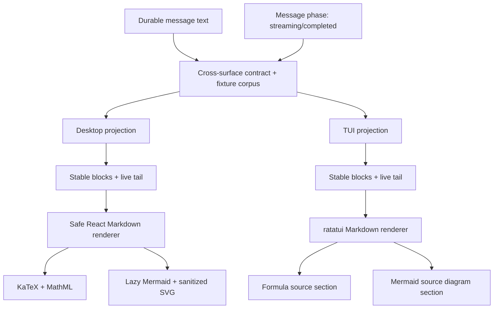

# RFC-0054 Conversation Streaming Markdown, Math and Diagrams V1

状态：active / R54.0-R54.7 implemented；R54.6 final cursor-cache re-run and R54.8 current-dev Desktop smoke blocked by concurrent RFC-0056 WIP / absent dev window；R54.9 docs/ledger complete

创建日期：2026-07-24

依赖：

- [RFC-0045 Desktop UI/UX Foundation V1](0045-desktop-ui-ux-foundation-v1.md)
- [RFC-0046 Desktop Material-derived Design System and Theme Preferences V1](0046-desktop-material-derived-design-system-and-theme-preferences-v1.md)
- [RFC-0048 Desktop Composer and Transcript V2](0048-desktop-composer-and-transcript-v2.md)
- [RFC-0052 Desktop Conversation Continuity and Control V1](0052-desktop-conversation-continuity-and-control-v1.md)
- [RFC-0038 Alpha Long-session Performance V1](0038-alpha-long-session-performance-v1.md)

## 1. Problem statement

RFC-0048 已为 desktop 建立 `react-markdown + remark-gfm + rehype-highlight` 的安全
CommonMark/GFM 基线，但当前渲染入口仍把下列职责集中在 `SafeMarkdown.tsx`：

- 修复模型偶发生成的 malformed fence；
- 将持续增长的 streaming string 重新交给完整 Markdown parser；
- 选择代码块、表格和链接的 React component；
- 承担外部 URL admission；
- 为 tool output 提供嵌入式代码高亮。

TUI 则由 `crates/sigil-tui/src/ui/markdown.rs` 维护独立的 ratatui renderer。它已经支持 heading、
list、quote、table、fenced code 和 syntax highlighting，但使用另一套逐行识别和 fence state；
当前没有数学公式或 Mermaid 的一等语义，也没有与 desktop 共享异常输入 corpus。

这会产生四个问题。

第一，LLM 输出不是普通静态 Markdown。streaming 期间 fence、列表、表格、链接、强调和数学公式
经常暂时不闭合；直接重解析整段文本会造成结构抖动、滚动锚点变化和已完成内容重复工作。

第二，局部 malformed 输入会扩大故障范围。典型例子是模型把 closing fence 粘在代码最后一行：

````text
```text
value```

Following paragraph
````

如果不做受限修复，后续正文会被吞入代码块。继续向一个全局正则追加规则会逐渐形成不可验证的
Markdown 方言，并可能静默改写合法源码。

第三，desktop 还缺少正式的数学公式与 Mermaid 图表能力。两者都不能靠开放 raw HTML 或直接向
transcript 注入任意 SVG 来实现；模型输出、历史 session 和外部 provider 内容都必须按不可信输入处理。

第四，Sigil 是 TUI-first 产品。若仅修 desktop，两个表面将继续分别定义 fence 修复、streaming
边界、数学语法和 Mermaid 降级，用户从同一 durable session 进入不同表面时会得到不同的内容结构，
回归也只能在发现后重复修复。

## 2. Decision summary

V1 采用以下方案：

1. 冻结一个跨 desktop/TUI 的 Markdown 产品契约、normalization diagnostic 名称和共享 fixture
   corpus；不建立跨语言 renderer ABI。
2. Desktop 保留 `react-markdown` 作为最终 React AST renderer，不迁移到 Marked 或手写 HTML
   renderer；TUI 保留 `ui/markdown.rs` 作为 Markdown façade，不引入 JavaScript/browser renderer。
3. 两个表面各自在 presentation 层实现 Sigil-owned streaming projection，区分稳定块与实时尾块，
   并用同一 corpus 证明兼容行为一致。
4. streaming 只对实时尾块做临时、可逆、显式的展示修复；durable session text 永远不被改写。
5. completed message 使用 document-wide final projection，保证 reference link、footnote 等跨块语义
   最终正确。
6. Desktop 数学公式使用 `remark-math + rehype-katex + KaTeX CSS`；TUI 将相同 inline/display
   math 识别为一等公式内容并保真展示 LaTeX source，不伪造终端排版。
7. Mermaid 只识别显式、已经闭合的 `mermaid` fenced code block。Desktop 使用官方完整
   `mermaid` 包按需生成 SVG；TUI 显示一等 diagram 卡片、类型、状态、可展开源码和复制操作，
   不执行图表脚本。
8. 普通 Markdown 不启用 `rehype-raw`。Mermaid 生成 SVG 走独立严格配置、限额和 SVG sanitization。
9. 公式或图表失败时局部降级为源码；不能吞掉消息其余内容，也不弹出全局 toast。

本 RFC 不引入新的 HTTP、Tauri IPC、session、provider 或 `sigil-kernel` contract。原始 Markdown
仍是唯一 durable truth；projection、repair、KaTeX markup、Mermaid SVG 和 terminal styling
都只存在各自 renderer。跨表面共享的是行为规范与测试语料，不是 presentation implementation。

## 3. Product contract

### 3.1 Supported Markdown

完成态消息在两个表面都必须识别：

- CommonMark；
- GFM table、task list、strikethrough、autolink；
- inline/fenced code 与本地 syntax highlight；
- inline math：`$E = mc^2$`；
- display math：独占行的 `$$ ... $$`；
- Mermaid：显式 ```` ```mermaid ```` fenced block。

V1 不把任意 `math` 或 `mermaid` 单词猜成特殊内容，不识别 HTML 中的图表容器，也不执行
Markdown 内嵌 script/style/iframe/image/form。

“支持”不等于像素一致。两个表面的最低能力矩阵如下：

| 内容 | Desktop | TUI |
| --- | --- | --- |
| CommonMark/GFM | React AST，完整语义组件 | ratatui 原生文本布局 |
| fenced code | syntax highlight、复制 | syntax highlight、终端选择/OSC52 复制 |
| inline math | KaTeX inline + MathML | 保留 `$...$` 语义，使用 formula token 区分正文 |
| display math | KaTeX display + MathML | 独立 formula block，保真展示 `$$...$$` source |
| Mermaid | sanitized SVG diagram card | diagram card、类型/状态、展开源码、复制 |
| invalid/incomplete syntax | 局部 source fallback | 局部 source fallback |

Parity 的定义是：相同 source 不被吞字、分块顺序一致、copy/export 一致、失败边界一致、用户能辨认
内容类型；不要求字符终端复刻浏览器的二维排版。

### 3.2 Streaming behavior

streaming message 的展示规则：

1. 已经确定闭合的顶层块成为 `stable`，其 React identity 或 TUI render-cache identity 在后续
   token 到达时保持不变。
2. 最后一个无法证明完整的块成为 `live_tail`，允许随 token 更新。
3. 未闭合 code fence 在 live tail 中以代码预览展示；投影器可以追加 synthetic closing fence，
   但 synthetic bytes 不得写回 message、session、copy 或 export。
4. 未闭合 Mermaid fence 只展示源码与“图表生成中”状态，不执行 Mermaid。
5. Mermaid fence 闭合并成为 stable 后，desktop 才启动异步渲染；TUI 将 live diagram card
   转为 stable source card。两个表面都不得每个 token 重跑完整历史 layout。
6. 不完整数学公式保持源码形式；desktop 只有 parser 接受的 math node 才进入 KaTeX，TUI
   只有可证明闭合的 delimiter 才应用 formula styling。
7. message terminal 后执行 final normalization 和 document-wide render。
8. streaming 到 completed 的 DOM 或 TUI render-cache 替换必须保持用户阅读锚点；用户已离开
   底部时不得自动拉回底部。

V1 允许 reference-style link 或 footnote 在 streaming 阶段暂时保持 literal；completed projection
必须恢复 document-wide 正确语义。

### 3.3 Final normalization

final normalization 只允许一组可枚举、带测试的 model-output compatibility rule：

- closing fence 粘在同一行的最后一个非空代码内容之后时，将 closing run 移到新行；
- 保留 fence marker、长度与最多三个空格的合法 indentation；
- 不在 inline code、普通 prose、空代码行或 marker 长度不足时触发；
- 不猜测或补写表格分隔线、列表编号、链接目标、HTML 或 Mermaid 语法。

每条规则必须返回结构化 diagnostic。Desktop 使用下列 TypeScript 形状；TUI 使用同名 Rust enum
variant 和 byte range，fixture 断言使用稳定字符串 `attached_closing_fence`：

```ts
interface MarkdownRepairDiagnostic {
  readonly kind: "attached_closing_fence";
  readonly sourceStart: number;
  readonly sourceEnd: number;
}
```

diagnostic 只用于测试和本地 debug telemetry，不进入用户 transcript 或 durable event。

### 3.4 Math UX

Desktop：

- inline math 与正文 baseline 对齐；
- display math 居中，宽度超出时只在公式容器内部横向滚动，不产生 document horizontal scroll；
- KaTeX 输出使用 `htmlAndMathml`，保留视觉 HTML 和辅助技术可读的 MathML；
- invalid/unsupported LaTeX 显示原始表达式与局部错误标记，不能导致整条消息白屏。

TUI：

- inline math 保留原始表达式，delimiter 与内容使用独立的 formula token，不把 LaTeX 命令误当普通
  Markdown emphasis；
- display math 作为独立 `formula` section，按终端宽度换行，默认展开，不产生横向滚动；
- TUI 不将 LaTeX 猜测转换为 Unicode 公式，避免改变上下标、矩阵、分式和宏的原义；
- invalid 或未闭合表达式保持普通 source，不产生错误 notice。

共同规则：

- copy message 复制原始 Markdown/LaTeX，不复制 KaTeX markup 或 styled terminal text；
- theme 切换只改变 token/CSS，不重新定义公式语义。

### 3.5 Mermaid UX

Desktop Mermaid block 渲染为 Sigil diagram card：

- header：图表类型/状态；
- body：默认 fit-to-width 的 SVG；
- actions：复制源码、显示/隐藏源码、展开查看；
- expanded viewer：内部 pan/scroll，提供缩放与恢复适配，不扩大 document width；
- loading：只在 diagram card 内显示固定高度的 Sigil loading state，不遮挡 transcript；
- error：显示简短的 parser error、原始 Mermaid 源码和复制动作；
- theme：从 Sigil theme token 生成 Mermaid `base` theme variables，切换主题时只重绘受影响图表。

禁止 diagram click callback、外部导航、remote image、remote icon、remote font 和用户提供的
`themeCSS`。V1 拒绝 `%%{init: ...}%%` 等配置 directive；普通 `%%` comment 仍可使用。

TUI Mermaid block 渲染为紧凑的一等 diagram section：

- header：`diagram · mermaid · <type> · ready/generating/error`；
- body：默认显示一行摘要，不为短 source 建造大空卡片；
- `Enter/Ctrl-O` 沿用 timeline/tool-card disclosure 交互展开或收起 source；
- 复制操作复制原始 Mermaid source；
- 闭合 source 可从首个非注释声明提取 `flowchart`、`sequenceDiagram`、`classDiagram` 等显示类型；
  无法识别时显示 `mermaid`，不能猜错后改变 source；
- TUI 不执行 Mermaid、不生成 HTML/SVG、不访问网络，也不因当前 terminal 支持 Kitty/iTerm image
  protocol 就改变 durable 行为。

## 4. Architecture



### 4.1 Module ownership

Desktop 目标目录：

```text
apps/desktop/src/markdown/
  types.ts
  projection.ts
  normalize.ts
  MarkdownRenderer.tsx
  MarkdownCodeBlock.tsx
  MarkdownMath.tsx
  MermaidDiagram.tsx
  mermaidSecurity.ts
  renderCache.ts
  tests/
    projection.test.ts
    normalize.test.ts
    MarkdownRenderer.test.tsx
    MermaidDiagram.test.tsx
    fixtures.ts
```

现有 `SafeMarkdown.tsx` 保留为外部 façade，避免 `MessageContent`、`ToolCard` 和 approval/tool surface
直接依赖第三方 parser 或新的内部模块。

```ts
interface SafeMarkdownProps {
  readonly text: string;
  readonly phase?: "streaming" | "complete";
  readonly contentId?: string;
  readonly onOpenExternalUrl?: (url: string) => Promise<void>;
  readonly codeBlockVariant?: "message" | "embedded";
  readonly codeBlockAriaLabel?: string;
}
```

`phase` 默认是 `complete`。只有 conversation row 明确持有 live status 时传 `streaming`；tool output、
历史记录和静态 preview 不得根据字符串内容猜状态。

TUI 目标模块：

```text
crates/sigil-tui/src/ui/
  markdown.rs                 # façade and render options
  markdown/
    projection.rs
    normalize.rs
    inline.rs
    block.rs
    math.rs
    mermaid.rs
```

assistant timeline、tool preview 和 approval modal 继续只通过 `ui/markdown.rs` 与
`MarkdownRenderOptions` 进入 renderer，不各自复制 delimiter、fence 或 diagram detection。

跨表面 corpus：

```text
dev/fixtures/markdown-rendering-v1/
  cases.json
  sources/
```

`cases.json` 只描述 source、phase、expected block kind/range、normalization diagnostic 和 copy
source，不保存 React DOM 或 ratatui color snapshot。各表面另有自己的 presentation tests。

### 4.2 Projection model

```ts
interface MarkdownProjection {
  readonly mode: "streaming" | "complete";
  readonly sourceLength: number;
  readonly blocks: readonly ProjectedMarkdownBlock[];
  readonly diagnostics: readonly MarkdownRepairDiagnostic[];
}

interface ProjectedMarkdownBlock {
  readonly key: string;
  readonly source: string;
  readonly stability: "stable" | "live";
  readonly kind: "markdown" | "code" | "mermaid";
  readonly syntheticClosingFence: boolean;
}
```

TUI 使用等价的私有 Rust struct；这些类型不得进入 `sigil-kernel`、session schema、machine protocol
或 provider prompt。

block key 由 `contentId + source start offset + block kind` 构成，不能只用内容 hash，避免相同段落
发生 React identity 冲突。

Projection cursor 保存上次 source、最后 safe boundary 和 fence/list/table state：

- 新文本是旧文本的 append-only extension 时，只从最后 safe boundary 继续扫描；
- history refresh、repair、reconnect 或 source replacement 不是 append-only 时，从零重建；
- stable block 一旦发布不能被后续普通 append 改写；
- 如果新输入证明先前 boundary 判断错误，必须 fail safe：丢弃 cursor 并完整重建，不拼接不一致状态。

safe boundary 至少识别：

- 闭合 fenced code；
- 空行结束的 paragraph、blockquote、list 和 table；
- ATX heading、thematic break；
- 独占块的 display math；
- Mermaid fence。

扫描器不是第二个 Markdown parser。无法证明边界时宁可扩大 live tail，不能用正则猜测并提前冻结。

TypeScript 与 Rust scanner 不要求共享实现，但必须消费同一 corpus。任一表面新增长度修复或
boundary rule 时，提交必须先更新跨表面 fixture；不能只补本地 snapshot。

### 4.3 Complete projection

completed message 执行一次 document-wide render：

```text
original source
  -> bounded final normalization
  -> remark parse
  -> remark-gfm
  -> remark-math
  -> rehype sanitation boundary
  -> rehype-katex / rehype-highlight
  -> Sigil React components
```

final render 不复用 streaming 阶段追加的 synthetic closing bytes。attached-fence compatibility rule
是显式 final normalization，可以应用，但 copy/export 仍使用 original source。

TUI completed projection 对完整 source 重建一次 block sequence，并将结果交给现有 timeline render
store；不得把 desktop AST、KaTeX markup 或 Mermaid SVG 序列化后传给 TUI。

### 4.4 Parser and renderer boundary

`react-markdown` 继续负责 CommonMark/GFM AST 到 React element。Sigil-owned components 负责：

- HTTPS-only link；
- code block header/copy；
- table bounded overflow；
- Mermaid dispatch；
- accessible task list；
- bounded error fallback。

raw HTML 显式 `skipHtml`。不引入 `rehype-raw`。

`rehype-sanitize` 位于不可信 Markdown AST 与受信任 transform plugin 之间，只允许既有 Markdown 元素、
language class、`math-inline` 和 `math-display` trigger。随后执行 KaTeX/highlight transform，避免为了
KaTeX 的复杂输出开放任意 inline style。KaTeX 和 highlight 因此被视为受审计的 trusted renderer dependency；
升级仍需供应链复核。

TUI renderer 把 HTML 当普通不可信 source，不增加 HTML parser。数学和 Mermaid 识别发生在 fenced
code/inline delimiter classification 层；它们只能生成 ratatui `Line`/`Span` 和既有 disclosure action，
不能执行 source。

## 5. Math design

### 5.1 Dependency choice

采用：

- `remark-math`：生成 inline/display math node；
- `rehype-katex`：生成本地 KaTeX markup；
- `katex`：render engine 与随 bundle 提供的 CSS。

不采用 MathJax。当前需求是 transcript 内公式显示，不需要 MathJax 更大的 runtime 与 extension surface；
KaTeX 的同步、自包含输出更适合本地 desktop。

### 5.2 KaTeX policy

冻结配置：

```ts
{
  output: "htmlAndMathml",
  throwOnError: false,
  trust: false,
  strict: "warn",
  maxExpand: 1000,
  maxSize: 20,
  globalGroup: false,
}
```

- `trust: false` 禁止 `\includegraphics`、`\href` 和 HTML attribute commands 扩大资源/DOM 权限；
- `maxSize` 防止模型用极大尺寸破坏布局；
- `maxExpand` 限制 macro expansion；
- 不跨消息共享 mutable macro map，避免早期消息改变后续消息的公式语义；
- error text 必须经过 React text rendering，不使用未经转义的 exception HTML。

### 5.3 Loading

数学插件与 KaTeX CSS 可以单独 code split。第一次遇到 math candidate 时异步加载本地 chunk；
加载期间保留带 delimiter 的普通文本，而不是清空整条消息或展示全局 spinner。

TUI 不加载数学 runtime，因此没有 formula loading state。识别闭合 delimiter 后同步生成 bounded
terminal lines；其成本必须计入现有 timeline render-cache benchmark。

### 5.4 TUI formula rendering

TUI V1 不增加 LaTeX parser dependency。`math.rs` 只负责：

- 在非 code、非 escaped source 中识别闭合 `$...$` 与独占行 `$$...$$`；
- 保留 delimiter 内全部 bytes；
- inline 公式使用 `markdown_math` theme token；
- display 公式生成 `formula` section，并复用 display-width aware wrapping；
- 未闭合 delimiter 留在 live tail，禁止跨 stable block 配对。

这是语义保真的 terminal fallback，不宣称完成数学排版。若未来要支持 Unicode/terminal graphics
公式，必须独立 RFC 评估准确性、terminal capability 和依赖成本。

## 6. Mermaid design

### 6.1 Dependency choice

使用官方完整 `mermaid` 包，不使用 `@mermaid-js/tiny`：

- 官方建议普通 npm 集成使用完整包；
- 完整包支持 lazy loading；
- Tiny 不支持 mindmap、architecture diagram、KaTeX rendering 或 lazy loading。

Mermaid 必须动态 `import("mermaid")`，不存在 Mermaid block 的普通会话不能下载/初始化该 chunk。

### 6.2 Admission and limits

每个 diagram 在进入 parser 前执行：

- UTF-8 source 最大 32 KiB；
- 最大 1,000 行；
- 拒绝 NUL/control character；
- 拒绝 init/config directive；
- diagram id 由 content identity 和 source hash 生成，不接受用户 id；
- 同一 message 同时最多渲染 16 个 diagram，超过部分降级源码；
- LRU cache 最多 64 个 result，按 source hash + theme identity 隔离。

Conversation display 当前单条内容上限为 64 KiB；32 KiB diagram cap 是 renderer 的更窄 defense-in-depth，
不是新的 durable message 限制。

### 6.3 Mermaid initialization

```ts
mermaid.initialize({
  startOnLoad: false,
  securityLevel: "strict",
  suppressErrorRendering: true,
  maxTextSize: 32 * 1024,
  theme: "base",
  flowchart: { htmlLabels: false },
});
```

额外规则：

- 不注册 click callback；
- 不消费用户 theme/config；
- 不向 Mermaid 传递 workspace path、session id、bearer 或 external URL opener；
- render promise 使用 generation token；theme/source 变化后旧结果不得提交到 DOM；
- component unmount 后忽略迟到结果。

### 6.4 SVG sanitation

Mermaid 的 `strict` 配置是第一层；生成 SVG 在进入 React DOM 前仍经过 DOMPurify 的 SVG profile：

- 禁止 `script`、`foreignObject`、`iframe`、`object`、`embed` 和 event handler；
- 删除非 fragment 的 `href` / `xlink:href`；
- 保留 Mermaid layout 所需的 SVG shape、marker、path、text 和 local `url(#id)` reference；
- Mermaid 生成的 style element/attribute 只在本地 CSS validator 拒绝 `@import`、external/data
  `url(...)`、`expression`、`behavior`、binding 和越出当前 SVG root 的 selector 后保留；
- 禁止 remote image/font/CSS；
- sanitation 后没有合法 root SVG 时降级为 source/error card。

用户 source 不能提供 `themeCSS`，因此可保留样式只来自锁定版本 Mermaid 和 Sigil theme config。
这是 V1 唯一允许 `dangerouslySetInnerHTML` 的位置；调用必须封装在 `MermaidDiagram` 内，业务组件、
普通 Markdown 和 tool card 不得复用。CSS validator 无法证明样式安全时必须降级源码，不能用
“删除全部样式后仍插入”伪装成功。

Tauri 当前 CSP 保持 `frame-src 'none'`，V1 不为 Mermaid 放宽 CSP，不使用 CDN 或 iframe。

### 6.5 Rendering lifecycle

```text
live incomplete fence
  -> source preview
stable closed fence
  -> bounded validation
  -> local lazy chunk
  -> parse/render
  -> sanitize SVG
  -> diagram card ready
```

任何阶段失败都落到同一局部状态机：

```ts
type DiagramState =
  | { kind: "source_preview" }
  | { kind: "loading" }
  | { kind: "ready"; svg: string }
  | { kind: "error"; summary: string };
```

不得把 Mermaid parser error 作为 conversation error、run failure 或 toast。

### 6.6 TUI Mermaid lifecycle

```text
live incomplete fence
  -> generating diagram source section
stable closed fence
  -> bounded source validation
  -> derive display type
  -> compact diagram section
  -> optional source disclosure/copy
```

TUI 使用与 desktop 相同的 32 KiB、1,000 行、16 diagrams/message admission limit；超限只影响
diagram presentation，不截断 durable source。V1 不引入 `mermaid-cli`、Chromium、Node sidecar、
temporary HTML 或 terminal-specific image output。这些方案会把纯 presentation 变成进程、文件和
平台 capability 问题，不适合作为 TUI 基线。

## 7. Scroll, layout and theme contract

Markdown 实施必须复用 RFC-0052 的 conversation scroll ownership：

- stable block append 时，只有用户处于 bottom threshold 才跟随新内容；
- KaTeX font/CSS 或 Mermaid SVG 完成导致高度变化时，保留当前 visual anchor；
- focused composer 不能触发 Markdown block remount 或回到最后一条消息开头；
- diagram/table/display-math/code block 的 overflow 限制在自身 viewport；
- 900 px 工作宽度和 200% zoom 不产生 document horizontal scroll。

TUI 同时必须保持：

- stable block 不触发无关 timeline prefix 重建；
- formula/diagram disclosure 使用既有 selected timeline entry 与 scrollback anchor；
- terminal resize 只按新宽度重排可见 block，不改变 source 或 disclosure state；
- 20-column 最低宽度仍可访问 formula/diagram label 和 source，不产生隐藏的横向 viewport；
- live block 完成后，用户已向上阅读时不跳回 timeline bottom。

Theme integration：

- KaTeX 使用继承色与 Sigil surface token；
- Mermaid 使用 `theme: "base"` 加由 ThemeProvider 生成的固定 theme variables；
- cache key 包含 resolved theme id；
- system theme 变化只重绘可见/缓存命中的 diagram，不重跑普通 Markdown parser。

TUI theme integration：

- 新增稳定语义 token `markdown_math`、`markdown_diagram`，内置主题和合法 override 全部提供值；
- theme preview、保存后 render-cache rebuild 和 high-contrast gate 复用现有 appearance contract；
- 颜色不能成为 formula/diagram 与正文的唯一差异，必须同时有 section label。

## 8. Accessibility

- KaTeX 使用 MathML 输出，视觉 HTML 对 screen reader 隐藏；
- diagram card 有可读标题和状态；
- ready SVG 使用 `role="img"` 和 bounded accessible label；
- “显示源码”“复制源码”“展开图表”全部可键盘触发并有 tooltip/aria-label；
- diagram error 不只依赖颜色；
- reduced-motion 模式禁用 diagram loading 动画和过渡；
- Mermaid source 始终可访问，图表不能成为信息的唯一表达。

TUI：

- formula/diagram section label 不只靠颜色；
- source disclosure、复制和收起操作沿用 keyboard help/焦点 contract；
- screen reader/复制路径始终取得原始 source；
- 窄终端下 label、状态和 source 按 display width 截断/换行，不截断 UTF-8 grapheme。

## 9. Performance and caching

目标：

- 无 math/Mermaid 的普通消息不加载对应重依赖 chunk；
- stable streaming block 不因后续 live token 重建；
- Mermaid 不在未闭合 fence 或每个 token 上运行；
- TUI stable block 不因 live tail append 重建历史 prefix；
- TUI formula/Mermaid source rendering 不启动进程、不访问网络、不写临时文件；
- syntax highlight、KaTeX 和 Mermaid 都按块隔离错误；
- cache 不保存 session identity、absolute path 或 secret，只保存由已投影文本生成的 presentation result。

建议观测：

- projection rebuild count；
- stable/live block count；
- Mermaid load/render/sanitize duration；
- diagram fallback reason；
- final normalization rule hit count。
- TUI projection rebuild count 与 rendered line count。

这些数据默认只留在本地 debug telemetry，不进入 provider prompt、session export 或远程分析。

## 10. Failure behavior

| Failure | User-visible fallback |
| --- | --- |
| streaming boundary uncertain | 扩大 live tail，继续显示文本 |
| Markdown parser error | escaped plain text card |
| KaTeX invalid expression | 原始公式 + 局部错误状态 |
| math chunk load failure | 带 delimiter 的原始文本 |
| Mermaid fence incomplete | source preview |
| Mermaid source over limit | “图表过大” + source/copy |
| Mermaid parse/render error | compact error + source/copy |
| Mermaid sanitation removes root | 安全降级 source，不注入 SVG |
| theme rerender stale result | 丢弃旧 generation，保持上一个安全结果或 loading |
| TUI math delimiter incomplete | 原始文本，等待 live tail 完成 |
| TUI Mermaid fence incomplete | generating source section |
| TUI Mermaid source over limit | compact warning + source/copy |
| TUI diagram type unknown | generic `mermaid` label + source/copy |

任何 presentation failure 都不能改变 run/session terminal state。

## 11. Execution slices

| Slice | Scope | Completion evidence |
| --- | --- | --- |
| R54.0 | 跨表面产品契约、竞品/依赖/安全边界与 implementation freeze | RFC accepted；desktop bundle/CSP baseline；TUI render benchmark baseline |
| R54.1 | 共享 corpus、diagnostic vocabulary 和两个 projection state-machine skeleton | TS/Rust 消费同一 fence/list/table/math/Mermaid/CJK cases；append/rebuild equivalence |
| R54.2 | Desktop Message phase、stable/live rendering、scroll-anchor integration | streaming DOM identity、completion transition、focus/scroll regression tests |
| R54.3 | Desktop `remark-math + rehype-katex`、sanitation schema、CSS/theme/AX | inline/display/error/security/MathML tests；lazy chunk evidence |
| R54.4 | Desktop Mermaid lazy renderer、strict policy、SVG sanitation、cache | malicious directive/SVG/URL、limit、stale generation、theme/error tests |
| R54.5 | Desktop diagram card、expanded viewer、i18n、reduced motion | keyboard/AX/zoom/pan/source/copy component tests |
| R54.6 | TUI projection、normalization、stable/live render-cache integration | shared corpus parity；scrollback/resize/cache benchmark regression tests |
| R54.7 | TUI formula/diagram section、theme token、disclosure/copy UX | inline/display/live/complete/oversize/unknown-type tests；real terminal smoke |
| R54.8 | Cross-surface dogfood、performance/bundle/security audit | same session/source on desktop/TUI；active stream、long answer、math、diagram、theme smoke；no P1/P2 |
| R54.9 | 文档与 acceptance closure | user docs、dependency ledger、RFC status、site if user-visible release requires it |

依赖顺序：

```text
R54.0 -> R54.1 -> R54.2 -> R54.3
                         -> R54.4 -> R54.5
                 -> R54.6 -> R54.7
R54.3 + R54.5 + R54.7 -> R54.8 -> R54.9
```

R54.2 与 R54.6 可在共享 contract/corpus 冻结后并行；R54.3 与 R54.4 可并行；R54.5 等待
desktop Mermaid state machine，R54.7 等待 TUI projection。

### 11.1 Implementation record

| Slice | 状态 | 当前证据 |
| --- | --- | --- |
| R54.0 | complete | 产品契约、安全边界、exact dependency 和 Desktop/TUI baseline 已冻结 |
| R54.1 | complete | `dev/fixtures/markdown-rendering-v1/cases.json` 同时由 TypeScript 与 Rust 测试消费，覆盖 14 个 normalization/projection case |
| R54.2 | complete | Desktop 按 message phase 分离 live/final projection；append-only cursor 从最后 stable boundary 续扫，replacement/completion 强制重建；stable prefix identity、completion 与 scroll-anchor 回归测试已进入 `pnpm --dir apps/desktop check` |
| R54.3 | complete | KaTeX 本地 HTML/MathML、显式 sanitize schema、非法命令降级和 lazy chunk 已验证 |
| R54.4 | complete | Mermaid 闭合/大小/数量 admission、strict config、directive/URL/HTML 拒绝、SVG 二次净化、generation/cache 已验证 |
| R54.5 | complete | diagram card、source/copy、local zoom、i18n、键盘/AX 和 reduced-motion 行为已验证 |
| R54.6 | implemented, final re-run pending | TUI projection cursor 已接入真实 timeline render store，并缓存 stable block 的已排版 `Line`，append-only 更新只排版 live tail；replacement/completion/宽度/主题/显示选项变化重建。projection 与 render-store 等价测试已加入独立 sidecar；最终重跑被并行 RFC-0056 的当前编译中间态阻断。5k timeline release benchmark 既有证据为 5000 个 timeline item 30 ms |
| R54.7 | complete | TUI formula/diagram theme token、状态、源码 disclosure/copy、20/80/160 columns 与当前源码终端 smoke 已验证；TUI 不执行 Mermaid |
| R54.8 | in progress | Desktop check、high-severity audit、bundle audit 与 TUI terminal smoke 已通过；当前 dev Desktop 原生窗口未运行，真实 Desktop smoke 待补 |
| R54.9 | complete except final status | EN/ZH user guide/reference 与 dependency ledger 已同步；不发布版本，因此 site 不增加发布型宣传内容 |

当前自动验证记录：

- `pnpm --dir apps/desktop check`：通过，18 个 Vitest 文件、202 个测试，以及 typecheck、contract
  drift 和 production build 全部通过；
- `pnpm --dir apps/desktop audit --audit-level high --json`：411 个依赖，所有 severity 为 0；
- RFC-0054 相关 Rust targeted tests 与 `cargo check -p sigil-tui --lib` 在 cursor 接线后通过；
  随后的最终 `cargo clippy -p sigil-tui --all-targets -- -D warnings` 被并行 RFC-0056 未完成的
  provider setup dead code、旧 test field 和 import 阻断；
- `cargo test -p sigil-tui`：1426 passed、20 failed、5 ignored；20 个失败均属于并行中的
  RFC-0056 provider setup/credential UI 旧断言，RFC-0054 targeted tests 无失败。本 RFC 不通过
  修改或弱化 RFC-0056 测试来伪造全量 green；
- `cargo fmt --all --check` 当前同样被 RFC-0056 尚未格式化的 `sigil-kernel`、
  `sigil-runtime` 和 `worker_loop.rs` 变更阻断；RFC-0054 Rust 文件已用 scoped `rustfmt --check`
  验证通过；
- `pnpm --dir apps/desktop check` 的最终 production build 主 JS 为
  `817.48 kB / 246.84 kB gzip`；KaTeX core 为 `259.63 kB / 77.62 kB gzip`，Mermaid core 为
  `36.27 kB / 12.07 kB gzip`，两者均保持 lazy chunk；
- 当前源码 `target/debug/sigil` 真实终端 smoke 已验证 inline/display formula、Mermaid ready
  section、`Ctrl-O` source disclosure 和原始行边界。

当前收口阻断记录（2026-07-25）：

- Desktop cursor 变更后的 `pnpm --dir apps/desktop check` 已再次通过（18 个文件、202 个测试）；
- TUI projection cursor 与 timeline render-store 的初版定向测试通过后，又补齐了“stable block 不重复
  layout”的 renderer cache；补充的独立 sidecar smoke 尚待最终执行；
- 最终 sidecar 执行时，并行 RFC-0056 正处于未闭合中间态：`sigil-kernel` 缺少
  `ResolvedModelRoute` 导入/字段处理，TUI provider setup 也存在未完成的 test contract；本 RFC
  不修改这些文件来伪造 green；
- 当前机器没有正在运行的 Tauri/Vite/Sigil Desktop dev 原生窗口，只有 `target/debug/sigil` TUI
  进程；遵守既有 dogfood 约束，不启动过时的已安装 Sigil.app。因此真实 current-dev Desktop smoke
  仍待用户现有 dev 进程恢复后执行。

## 12. Test matrix

### 12.1 Projection corpus

- valid backtick/tilde fence；
- attached closing fence；
- marker 长度 3/4/5；
- code 内容自身包含较短 marker；
- incomplete fence append 后闭合；
- GFM table 后接 paragraph；
- nested list/blockquote；
- reference link/footnote final projection；
- CJK、emoji、CRLF；
- inline/display math 分段；
- incomplete/complete Mermaid fence；
- source replacement/reconnect 非 append path。
- 相同 case 的 TS/Rust block kind、source range、stability 和 diagnostic parity。

### 12.2 Security corpus

- raw HTML/script/event handler；
- `javascript:`、`data:`、`file:` URL；
- KaTeX `\includegraphics`、`\href`、`\htmlClass`、large rule、macro expansion；
- Mermaid init directive、click、link、HTML label、foreignObject、external image；
- SVG event attribute、remote href、CSS URL；
- oversize/too-many diagrams。

### 12.3 UI regressions

共同：

- streaming short/long content remains expanded；
- completed disclosure behavior remains content-specific；
- copy returns original Markdown；
- code copy excludes synthetic closing fence；
- same durable source keeps block order across desktop/TUI；
- one broken block does not hide following blocks。

Desktop：

- focus composer does not jump transcript；
- history open uses final phase and does not show streaming placeholder；
- theme switch and 200% zoom；
- Mermaid error does not create toast or conversation error；
- diagram late layout preserves visual anchor。

TUI：

- terminal resize and composer focus preserve timeline scrollback anchor；
- incomplete formula/Mermaid stays live source；
- completed formula/Mermaid becomes stable without rebuilding unrelated prefix；
- source disclosure/copy works at 20/80/160 columns；
- every built-in/high-contrast theme distinguishes formula/diagram without color-only meaning。

## 13. Acceptance gates

R54 完成必须同时满足：

1. 当前 attached-fence reproduction 不再吞掉后续 table/prose。
2. Shared corpus 在 desktop/TUI 产生相同 block order、source range 和 normalization diagnostic。
3. 64 KiB conversation message 能有界渲染；普通 desktop Markdown path 不加载 Mermaid chunk，
   TUI path 不启动任何额外进程。
4. append-only stream 中已发布 stable block 保持 React 或 TUI render-cache identity。
5. incomplete Mermaid 不执行；desktop 闭合后只渲染一次，theme/source stale result 不提交；
   TUI 闭合后只建立一个 stable diagram source section。
6. Desktop inline/display math 正确显示且包含 MathML；不可信 KaTeX command 不取得 URL/HTML
   trust；TUI 保真显示相同 LaTeX source。
7. Mermaid strict config、directive rejection 和 SVG sanitation 全部有 negative tests；TUI 不执行
   Mermaid source。
8. raw HTML、remote asset、script、click handler 和 unrestricted URL 不进入 transcript DOM，
   也不在 TUI 触发进程/文件/网络动作。
9. formula、diagram、table、code block 不导致 desktop document 或 TUI timeline 横向滚动。
10. composer focus、completion transition、diagram late layout 或 terminal resize 不破坏各自 scroll
    anchor。
11. `pnpm --dir apps/desktop check`、`cargo test -p sigil-tui`、high-severity audit、dependency ledger、
    真实 dev desktop smoke 和真实 TUI terminal smoke 通过。

## 14. Dependency and supply-chain plan

Desktop 拟新增 direct dependency：

- `remark-math`；
- `rehype-katex`；
- `katex`；
- `rehype-sanitize`；
- `mermaid`；
- `dompurify`。

TUI V1 不新增 Markdown、LaTeX、Mermaid、browser 或 terminal-image direct dependency，继续复用
ratatui、syntect、unicode-segmentation 和 unicode-width。若 R54.6 证明现有逐行 renderer 无法可靠
满足共享 corpus，必须先记录失败证据，再单独评估 Rust CommonMark parser；不能在 R54.7 顺手引入。

R54.0/R54.3/R54.4 实施时必须：

- 锁定 exact version 和 lockfile；
- 核对 MIT/兼容许可、维护来源和 transitive graph；
- 记录到 `dev/governance/dependency-supply-chain.md`；
- 比较 initial bundle 与 lazy chunk，并保存 TUI release-profile render benchmark；
- 执行 `pnpm audit --audit-level high`；
- 不使用 CDN、remote grammar、remote CSS/font/script；
- Mermaid 或 sanitizer security release 必须进入依赖升级监控。

V1 不默认引入 `remend`。通用 Markdown healing 会扩大语义改写面；先用 corpus 驱动的 bounded
projection 与显式 final normalization。只有 R54.6 证明仍有无法覆盖的系统性 streaming 缺口时，
再独立评估 healing dependency，不能在实现中顺手加入。

## 15. Research basis

- [react-markdown](https://github.com/remarkjs/react-markdown)：safe-by-default React AST renderer、
  unified pipeline 和 math plugin 集成。
- [remark-math](https://github.com/remarkjs/remark-math)：Markdown math syntax 与 KaTeX/MathJax
  transform。
- [rehype-sanitize](https://github.com/rehypejs/rehype-sanitize)：不可信 AST sanitation，以及在
  KaTeX/highlight 前只放行 trigger class 的推荐顺序。
- [KaTeX options](https://katex.org/docs/options)：`trust`、`maxSize`、`maxExpand`、`strict` 与
  `htmlAndMathml` 安全/可访问性选项。
- [Mermaid security level](https://mermaid.js.org/config/schema-docs/config-properties-securitylevel.html)：
  strict 模式编码 HTML 并关闭 click。
- [Mermaid usage](https://mermaid.js.org/config/usage)：完整包、Tiny 差异与安全级别。
- [OpenCode streaming Markdown](https://github.com/anomalyco/opencode/blob/dev/packages/session-ui/src/components/markdown-stream.ts)：
  stable block 与 live tail 分离。
- [Crush streaming Markdown](https://github.com/charmbracelet/crush/blob/main/internal/ui/chat/streaming_markdown.go)：
  只在可证明边界缓存 stable prefix。
- [Codex TUI Markdown normalization](https://github.com/openai/codex/blob/main/codex-rs/tui/src/markdown.rs)：
  对 LLM fence/table 异常做保守、可枚举的预处理。

## 16. Non-goals

- 不修改 provider 输出或 session durable text 来“修好”Markdown。
- 不做 WYSIWYG/MDX/raw HTML renderer。
- 不支持 Mermaid click callback、remote resource 或用户 theme script。
- 不在 V1 为 Mermaid 放宽 Tauri CSP 或新增 generic web/network capability。
- 不保证 streaming 阶段的跨块 reference link/footnote 已完成解析；terminal 后必须正确。
- 不在 V1 实现任意 LaTeX package、MathJax extension 或跨消息全局 macro。
- 不承诺 TUI 与 desktop 像素一致，也不在 V1 为 TUI 实现 LaTeX typesetting 或 Mermaid 图像渲染。
- 不引入 Mermaid CLI、Chromium/Node sidecar、temporary HTML 或 terminal-specific image protocol。
- 不把 Markdown projection 或 presentation DTO 下沉到 `sigil-kernel`、session 或 machine protocol。
- 不把 presentation parser error 上升成 run failure、approval 或全局通知。
