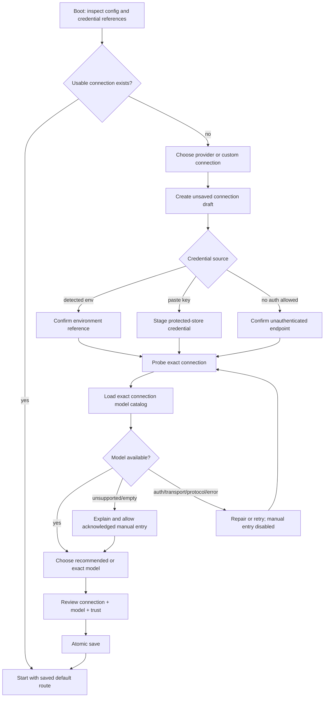

# RFC-0056 Provider Connections, Credential Storage and Model Catalog V1

状态：accepted / implementation complete (R56.1-R56.9 complete)

创建日期：2026-07-24

### 2026-07-31 current-only cutover

当前实现只接受 `config_version = 2` 的 provider connection 配置、当前 credential source 和当前
catalog schema。本文后续关于 V1 配置读取、迁移、旧 credential source 或旧 catalog 状态的段落仅保留
为历史设计记录，不再对应可执行代码；非当前数据直接报错，用户应替换配置或删除无效本地数据。

依赖：

- [Rust agent core technical solution](../sigil-rust-agent-core-technical-solution.md)
- [RFC-0026 Stable Machine Protocol and Real Serve](0026-stable-machine-protocol-and-real-serve.md)
- [RFC-0027 Local Session Lifecycle V1](0027-local-session-lifecycle-v1.md)
- [RFC-0028 Real-model Acceptance and Provider Conformance V1](0028-real-model-acceptance-and-provider-conformance-v1.md)
- [RFC-0035 TUI Orchestration Boundary Hardening V1](0035-tui-orchestration-boundary-hardening-v1.md)
- [RFC-0040 MCP Production Reliability and OAuth V1](0040-mcp-production-reliability-oauth-v1.md)
- [RFC-0050 Desktop Conversation Library and Settings V1](0050-desktop-conversation-library-and-settings-v1.md)
- [RFC-0052 Desktop Conversation Continuity and Control V1](0052-desktop-conversation-continuity-and-control-v1.md)

### 2026-07-28 credential startup amendment

Provider API key 的安全承诺保持不变：secret 不进入普通配置、workspace、session、cache、日志或
support artifact。默认后端与启动时序调整如下：

- 新配置默认 `credential_store = "file"`，使用独立、owner-only 的
  `~/.sigil/credentials.json`；`auto` 和 `keyring` 保留为显式选择。
- 已持久化的显式 `keyring` 配置继续按原语义读取，不把现有 native credential 静默复制到
  file backend；`auto` 的最终边界由下方 7 月 30 日修订替代。
- TUI 启动只生成 secret-free offline connection inventory；stored credential verification
  只在用户主动打开或保存配置等明确配置流程中运行，不与 agent worker 的必要 credential
  resolution 竞争。
- native credential operation 通过一个 process-global blocking mutex 串行执行。读取不使用
  无法取消底层系统 prompt 的短 async timeout；等待系统认证期间 TUI 保持可用，provider build
  的真实成功、拒绝或取消结果决定 worker 状态。
- worker 不再用固定 readiness deadline 丢弃等待系统认证的 prompt；provider build 在 ready 前
  明确失败时，TUI 直接退休该 worker 与尚未发送的 pending command，不再追加第二条泛化错误。

### 2026-07-30 file-only auto amendment

7 月 28 日保留 `auto` 原生优先语义后，真实发布包仍会在 macOS 启动阶段触发 Keychain ACL
认证。ad-hoc 或不同签名发布包的 code requirement 会变化，因此把 provider API key 的普通启动
依赖原生记录会持续制造登录密码框。随后尝试的 `kSecUseAuthenticationUISkip` 查询虽然不会主动
显示认证 UI，但真实 release preflight 证明它仍可能在 `securityd` 中无限等待。因此“静默查询”
也不能作为 non-interactive 启动路径。

本修订替代此前 `auto` 的 native-first 和 no-auth-UI fallback 语义，但不改变 strict `keyring`：

- `file` 仍是默认值，写入 owner-only `~/.sigil/credentials.json`。
- `auto` 改为严格的非交互文件策略：读取、写入与删除都只访问 owner-only credential file。
- `auto` 不查询、复制、迁移或清理任何旧 native record；file 缺少目标记录时明确视为 missing，
  用户可以在 `/config` 中重新输入一次。
- `keyring` 仍是用户显式选择的 native-only 策略；该模式可以触发平台认证 UI，并在 unavailable
  时 fail closed。
- 所有平台都遵守同一 `auto` file-only 边界；只有显式 `keyring` 使用 macOS Keychain、Windows
  Credential Manager 或 Linux Secret Service。
- 同步 Doctor inventory 只等待 native verification 两秒；超时返回 secret-free offline
  inventory，不让诊断或发布 smoke 无限阻塞。实际 `keyring` provider resolution 仍保留平台
  认证语义，不伪装为 file fallback。

## 1. Problem statement

Sigil 当前已经支持 DeepSeek、OpenAI-compatible Chat Completions、OpenAI Responses、Anthropic
和 Gemini 五条 provider 路径，也已经把首次配置放进 TUI。但当前配置界面仍把
`provider`、`transport`、`credential`、`endpoint` 和 `model` 当成若干松散字段，缺少一个能约束
它们关系的持久化对象。

直接后果是：用户切换到 `openai_responses` 后，模型选择器仍可能先显示
`deepseek-v4-flash` 和 `deepseek-v4-pro`。这不是单纯的列表文案错误，而是当前状态模型允许
“新 provider + 旧 model”组成一个看似合法的草稿。

当前实现链路如下：

| 当前 owner | 当前行为 | 结果 |
| --- | --- | --- |
| `sigil-tui::slash::KNOWN_MODEL_IDS` | 全局静态模型列表只包含两个 DeepSeek model | 所有 provider 共用 DeepSeek fallback |
| `build_model_picker_options` | remote 为空时回退到全局列表 | 网络、认证、协议或空列表错误被伪装为 DeepSeek 可选项 |
| `provider_drafts_from_root_config` | 未配置 provider 使用 root active model 作为 fallback | 切换 provider 时旧 model 泄漏到新 provider 草稿 |
| `default_provider_config_fields(provider, model)` | provider 默认 endpoint 与调用方传入 model 组合 | provider 自己的默认 model 被旧 root model 覆盖 |
| `provider_model_status_config_from_fields` | 只对 DeepSeek、OpenAI-compatible、OpenAI Responses 开启列表请求 | Anthropic、Gemini 永远不能得到 provider-owned model list |
| `fetch_remote_model_ids` | 固定请求 `GET <base_url>/models` 并解析 OpenAI `data[].id` | provider-native discovery 被误当成同一种协议 |
| `ConfigDraft::to_root_config` | 保存时只 materialize 当前 provider | 切换期间的其他 provider 草稿只存在于进程内 |
| provider config `api_key` | 用户在 TUI 输入后序列化进 `sigil.toml` | secret 与普通配置混存 |
| `RootConfig::save` | `fs::write` 直接覆盖 | 缺少 atomic publish、Unix `0600` 和 parent `0700` contract |

默认配置路径是 `~/.sigil/sigil.toml`；`[agent]` 保存 active `provider` 和 `model`，
`[providers.<provider>]` 保存 endpoint、API key 和 provider-specific options。provider config
中的 model 通过 `__runtime_model` 跳过序列化，所以 `[agent].model` 实际上是唯一持久化 model；
但 `[providers]` 仍是按 provider key 组织的一组松散配置值。该结构不能表达：

- 同一家 provider 的多个账号、区域、代理或 endpoint；
- 一个 model 到底属于哪个认证与 endpoint；
- `openai_responses` 是 OpenAI 产品选择，还是一条 wire protocol；
- model list 是从哪个账号、哪个 endpoint、哪个时间点得到的；
- 当前 session route 与“下次启动默认 route”的区别。

本地代码审计还确认，现有 save path 不主动收紧权限；在常见 `022` umask 下，包含 inline API key
的配置可能成为 `0644`。即使把文件改成 `0600`，长期把新 secret 写回 TOML 仍不是合理默认。

因此，当前体验不合理。它会在首次配置阶段同时制造三个高风险信号：

1. 用户不能相信模型列表与刚选的 provider 有关；
2. 用户不知道“API key 未设置”“模型目录拉取失败”和“provider 没有模型”之间的区别；
3. 用户被要求在普通配置文件中保存 plaintext secret，或自行理解环境变量。

## 2. Decision summary

V1 采用以下方案：

1. 产品持久化主对象从松散 `provider` 字段升级为 **Provider Connection**。一个 connection
   表示确定的 provider family、wire protocol、endpoint、credential reference 和 provider options。
2. model identity 永远是复合值 `ModelRef { connection_id, model_id }`。UI、recent、cache、
   session route、测试以及未来的 favorite 都不得只用裸 `model_id` 作为身份。
3. “Provider”继续作为用户选择的连接模板；“Protocol”进入 Advanced，不再把
   `openai_responses` 作为普通用户与 OpenAI、Anthropic 并列的品牌概念。
4. 首启固定为 `选择 provider/connection -> 认证 -> 获取同一 connection 的模型 -> 选择模型
   -> 原子保存并启动`。认证不完整时不能把该 connection 的 model 标为 available。
5. model catalog 按 connection 隔离。fallback 顺序固定为：
   `同 connection 的 remote -> 同 connection 的 cache -> provider-owned bundled metadata
   -> 同 connection 的 manual entry`。永远不跨 connection 或 provider fallback。
6. remote catalog 只证明“该 ID 被当前 connection 暴露”；它不能授予 tool、image、reasoning、
   context window 或 hosted search 等安全/能力位。能力仍由 provider-owned exact matrix 保守解释。
7. 新输入的 API key 默认进入独立、owner-only 的 `~/.sigil/credentials.json`。
   `[storage].credential_store = "auto"` 保留为严格的 non-interactive file-only 策略，不读取
   或清理旧 native record；`keyring` 是唯一显式 native system store 策略。
   TOML connection 只保存 opaque credential reference；environment reference 和显式
   unauthenticated local connection 也是一等来源。这里不承诺“secret 在任何地方都不落盘”，
   而是承诺 secret 不进入主配置、workspace、session、catalog cache、log、snapshot 或
   support artifact。
8. legacy inline API key 继续可读，但进入只读兼容状态；迁移成功后不再 dual-write plaintext。
9. config save 使用 copy-on-write credential rotation 与 atomic file publish。Unix parent 为
   `0700`，config/cache/credential file 为 `0600`；file mode 是受权限保护的独立 plaintext
   credential store，不得被描述为加密存储。
10. 修改 saved default 不改变当前 session。切换 connection/model 只能在 idle 边界创建新 session；
    active run、provider continuation 和已有 durable session 不做原地 route mutation。
11. V1 的“Recommended”在选择时解析为一个确定 model ID。V1 不引入跨 provider 动态 `Auto`
    router，避免不可审计的隐式 route 漂移。
12. 本 RFC 初始评审先冻结 contract；R56.1-R56.7 完成后，R56.8 继续收敛连接管理、
    模型目录复用和 Desktop 首启/设置表面。

## 3. Goals and non-goals

### 3.1 Goals

- 首次启动时，用户在不编辑 TOML 的前提下完成一个可用 connection 和 model 的配置。
- provider 切换后，任何可见 model 都能证明属于当前 connection。
- 配置、认证、model discovery、model selection 和 session route 使用同一身份模型。
- 支持同 provider 多 connection，为账号、代理、区域和本地 endpoint 留出稳定扩展边界。
- 保留 TUI-first；CLI、Doctor 和后续 Desktop Settings 复用 runtime contract。
- secret 默认不进入 TOML、session、event、support bundle、cache、Debug 或错误字符串。
- offline、认证失败、catalog unsupported、empty catalog 和 malformed response 有不同的可恢复状态。
- migration 不改变用户当前 provider/model，不创建包含 plaintext secret 的备份副本。

### 3.2 Non-goals

- 不在 V1 支持任意第三方 provider plugin 或动态下载 provider executable。
- 不把 models.dev、Catwalk 或其他第三方目录设为 Sigil 的默认真相源。
- 不实现价格排序、实时价格同步、智能成本路由或自动 provider failover。
- 不实现跨 provider 的全局 `Auto` model router。
- 不在 model picker 中测试付费 generation。
- 不把远端 model metadata 直接映射为安全关键 capability。
- 不允许 active run 中途更换 model、endpoint、protocol 或 credential。
- 不让 desktop renderer、TUI view 或 `sigil-kernel` 直接访问 credential store、HTTP 或
  provider-private config。
- R56.1-R56.7 不顺带重做完整 Desktop Settings；R56.8 仅实现 Provider Connection 的
  首启与设置表面，不扩张 MCP credential 或 task role routing。

## 4. Research basis

调研结论来自 2026-07-24 的官方文档和本地竞品仓库快照。仓库代码链接固定到审计 commit，
避免后续 main 分支漂移改变本 RFC 的证据含义。

| 产品 | 观察 | 对 Sigil 的启示 |
| --- | --- | --- |
| [Crush `d8fc48a03c36`](https://github.com/charmbracelet/crush/blob/d8fc48a03c36/internal/ui/dialog/models.go) | model selection 返回 provider、model 和 model type；列表按 provider 分组，recent key 使用 `provider:model` | model 必须携带 provider/connection identity |
| [Crush auth flow](https://github.com/charmbracelet/crush/blob/d8fc48a03c36/internal/ui/model/ui.go) | 选择未配置 provider 的 model 会先进入认证，验证成功后保存 | “看到 model”不能绕过 connection readiness |
| [Crush catalog fallback](https://github.com/charmbracelet/crush/blob/d8fc48a03c36/internal/config/provider.go) | embedded、cache、remote 形成有界 fallback | offline fallback 必须保留 provenance，不应伪装成 remote success |
| [OpenCode `884c25603395` model spec](https://github.com/anomalyco/opencode/blob/884c25603395/specs/v2/provider-model.md) | `ModelRef` 包含 `providerID + id + variant`；model storage 按 provider 嵌套 | 裸 model ID 不能作为全局主键 |
| [OpenCode model dialog](https://github.com/anomalyco/opencode/blob/884c25603395/packages/tui/src/component/dialog-model.tsx) | favorite/recent 都保存 providerID + modelID；同一 dialog 可进入 connect provider | model selection 与 provider connection 是一个流程 |
| [OpenCode models.dev cache](https://github.com/anomalyco/opencode/blob/884c25603395/packages/core/src/models-dev.ts) | 有 TTL、disk/snapshot fallback、timeout、retry、lock 和 refresh | catalog 是独立的有缓存 service，不应散落在 modal 中 |
| [Goose `fe7f16b727fa` configure flow](https://github.com/aaif-goose/goose/blob/fe7f16b727fa/ui/text/src/configure.tsx) | phase 明确区分 provider、config、loading models、select model、saving；空列表提供 manual entry | empty/error/manual 必须是显式状态，不能借用其他 provider 的列表 |
| [Goose OpenAI provider](https://github.com/aaif-goose/goose/blob/fe7f16b727fa/crates/goose-providers/src/openai.rs) | `/models` 不存在时只回退到该 provider 的 custom list | fallback scope 必须保持在同一 connection |
| [Aider `5dc9490bb35f`](https://github.com/Aider-AI/aider/blob/5dc9490bb35f/aider/onboarding.py) | 先检测环境变量，再选择与该 credential 对应的 model | 已有环境凭据应减少首启输入，但必须显示来源 |
| [Gemini CLI `ae0a3aa7b928` auth](https://github.com/google-gemini/gemini-cli/blob/ae0a3aa7b928/packages/cli/src/ui/auth/AuthDialog.tsx) | auth 是独立首启步骤，并根据已有设置/环境选择默认项 | auth state 不应退化为一个空字符串字段 |
| [Gemini CLI model dialog](https://github.com/google-gemini/gemini-cli/blob/ae0a3aa7b928/packages/cli/src/ui/components/ModelDialog.tsx) | Auto 与 Manual 是明确的产品语义，不是任意 ID fallback | Sigil 若没有真实 router，就不应伪造 Auto |

官方资料进一步确认：

- [OpenCode Providers](https://opencode.ai/docs/providers/) 将 `/connect` credential 存储与普通
  provider config 分开，之后才通过 `/models` 选择 model。
- [OpenCode Models](https://opencode.ai/docs/models/) 使用 `provider_id/model_id` 作为完整 model ID。
- [Crush README](https://github.com/charmbracelet/crush) 将“在 model picker 选择 provider、认证、
  再选择 model”作为最短上手路径。
- [OpenAI Codex advanced configuration](https://learn.chatgpt.com/docs/config-file/config-advanced#custom-model-providers)
  将 model provider 定义为 base URL、wire API、authentication 和 headers 的连接对象，并把
  `config.toml` 与 `auth.json`/OS keychain 分开。
- [OpenAI Codex configuration reference](https://developers.openai.com/codex/config-reference/)
  提供 `cli_auth_credentials_store = file | keyring | auto`；`file` 使用
  `~/.codex/auth.json`，`auto` 在系统存储可用时优先使用系统存储。
- [Claude Code authentication](https://code.claude.com/docs/en/authentication) 在 macOS 使用
  Keychain，在 Linux 使用 mode `0600` 的 `~/.claude/.credentials.json`，在 Windows 使用
  用户 profile 下受 ACL 保护的 credential file。
- [OpenCode CLI](https://opencode.ai/docs/cli/) 将 `/connect` credential 保存到
  `~/.local/share/opencode/auth.json`，与普通 provider config 分离。
- [DeepSeek List Models](https://api-docs.deepseek.com/api/list-models/) 与
  [OpenAI List Models](https://developers.openai.com/api/reference/resources/models/methods/list)
  都提供 OpenAI-shaped model list，但这不代表其他 provider 使用同一 wire shape。
- [Claude List Models](https://platform.claude.com/docs/en/api/models/list) 与
  [Gemini models.list](https://ai.google.dev/api/models) 各自有 provider-native endpoint、
  authentication、pagination 和 response schema。
- [Gemini CLI model selection](https://geminicli.com/docs/cli/model/) 的 Auto 是 Gemini CLI 已实现的
  routing contract；它不能被泛化成任意 provider 的占位 model。

共同模式不是“模型列表越大越好”，而是：

> 先建立可用连接，再只展示该连接能解释的 model；model identity 始终携带连接身份。

## 5. Vocabulary and invariants

### 5.1 Vocabulary

**Provider family**

用户理解的服务或协议家族，例如 DeepSeek、OpenAI、Anthropic、Google Gemini、Custom。

**Protocol**

物理 wire API，例如 DeepSeek native profile、OpenAI Responses、OpenAI Chat Completions、
Anthropic Messages、Gemini GenerateContent。标准 provider 模板决定默认 protocol；普通用户不必
先理解它。

**Provider connection**

一个可保存、可探测的连接实例，绑定 provider family、protocol、endpoint、credential reference
和 provider options。相同 provider 可以存在多个 connection。

**Connection readiness**

该 connection 是否具备完成下一次 provider request 所需的配置与 credential。readiness 不等于
网络当前可达，也不等于某个 model 一定可用。

**ModelRef**

`connection_id + model_id` 的复合身份。

**Model catalog**

某一个 connection 在一个时间点可展示的 model snapshot，包含来源、freshness 和 availability；
它不是 durable session truth。

**Resolved model route**

session 创建时冻结的 connection identity、provider family、protocol、model ID 和 semantic route
fingerprint。它是 run preparation 的输入。

### 5.2 Hard invariants

1. 任意 model picker row 必须有 `connection_id`。
2. `model_id` 只在 connection 内唯一。
3. catalog response 只能更新发起请求时 exact connection、draft revision 和 route fingerprint
   仍匹配的 modal。
4. credential missing/rejected 时，cache 可以显示为 stale reference，但不能把 connection 标为 ready。
5. remote empty、remote error 和 catalog unsupported 是三个不同状态。
6. fallback 不能跨 connection。
7. provider bundled model 不能覆盖 remote 对当前账号的明确不可用证据。
8. remote metadata 不能打开 capability、tool 或安全策略。
9. credential value 不可序列化、不可 `Debug`、不可进入 event/session/cache。
10. current session route 与 saved default route 分离。
11. route semantic fingerprint 漂移时，已有 session 不能静默续跑。
12. credential rotation 不改变 semantic route fingerprint，不强迫已有 session fork。

## 6. Product UX

### 6.1 First-run state machine

首启不再展示四个平铺字段。它使用一个可返回、可恢复的状态机：



进入 TUI 后，首屏结构固定为：

```text
Set up a model connection

  DeepSeek          API key · recommended
  OpenAI            API key
  Anthropic         API key
  Google Gemini     API key
  OpenAI-compatible Custom endpoint

  Detected: SIGIL_OPENAI_RESPONSES_API_KEY

↑/↓ choose   Enter continue   Esc quit
```

Provider row 展示用户需要做决策的信息：

- provider label；
- 认证类型：API key、environment、OAuth（未来）、none；
- `ready`、`needs auth`、`saved but unavailable` 等状态；
- 是否有检测到的 environment reference；
- 标准 provider 的一句推荐说明。

row 不展示 crate 名、`openai_responses`、raw capability matrix 或完整 endpoint。

### 6.2 Authentication step

V1 支持三种用户可选来源：

1. **Use detected environment variable**
   - 显示 variable name，不显示 value；
   - 保存 `environment` reference；
   - 只检测非空，不在 UI 中复制 value。
2. **Save API key in protected credential store**
   - secret 只进入 modal buffer 和 runtime-owned credential store；
   - 验证/保存后立即清空 draft secret carrier；
   - 新配置默认写入 owner-only credential file；
   - `auto` 与 `file` 都把 owner-only credential file 作为新记录的唯一写入位置；
   - `auto` 与 `file` 都不探测旧 native record，file 缺失时明确要求用户重新输入；
   - 只有显式 `keyring` 模式访问 native store，并允许平台显示认证 UI；
   - `keyring` 模式不可用时明确报错，任何模式都不得回退写入 `sigil.toml`。
3. **No authentication**
   - 只对 provider template 显式声明允许的 local/custom connection 可选；
   - 不能通过留空 API key 隐式获得该状态。

标准 provider 的 environment 变量由 provider template 给出。选择 environment 后，运行时只解析
该 reference；它不会因为另一个 ambient variable 存在而静默覆盖用户已选 credential store。

认证探测必须是无 generation side effect 的 provider-owned operation。优先使用 model list 或专用
account/readiness endpoint。探测结果使用 typed state：

```rust
pub enum ConnectionProbeState {
    Ready,
    CredentialMissing,
    CredentialRejected,
    EndpointUnreachable,
    TlsRejected,
    ProtocolMismatch,
    CatalogUnsupported,
    EmptyCatalog,
    MalformedResponse,
}
```

`CatalogUnsupported` 不等于 credential invalid。对 custom endpoint，用户可以在看到明确警告后
选择 manual model；Sigil 不发送一条付费 prompt 来“验证”配置。

### 6.3 Model selection step

model picker 只显示当前 connection。布局按以下顺序：

1. `Recommended`：provider-owned bundled metadata 中、且 remote 未证明不可用的 exact model；
2. `Recent on this connection`；
3. `Available from <connection label>`；
4. `Configured but not returned`：只在 legacy/current value 存在时显示，带 warning；
5. `Enter model ID manually`，仅在 authoritative remote/fresh cache、confirmed empty 或
   catalog unsupported 状态出现。

示例：

```text
Choose a model · OpenAI (personal)

  Recommended
> gpt-5.4                 balanced coding default

  Available from this connection
  gpt-5.4-mini
  gpt-5.3-codex

  Enter model ID manually…

catalog: live · 3 models · refreshed now
↑/↓ choose   Enter apply   R refresh   Esc back
```

加载和失败是 modal 内状态，不使用旧列表掩盖：

```text
Choose a model · Local gateway

  Model discovery is not supported by this endpoint.

> Enter model ID manually…
  Retry discovery

No models from another provider will be shown here.
```

manual entry 生成当前 connection 的 `ModelRef`，不是全局裸 ID。保存前执行格式与长度校验；
它只在 catalog 已成功建立可信边界、明确为空或明确不支持 discovery 时开放。auth、transport、
TLS、protocol、malformed 和 stale-cache failure 均 fail closed，不允许用 manual ID 绕过。
该 row 标记为 `manual · unverified`。

### 6.4 Recommended is not Auto

`Recommended` 是 presentation action：

```text
Recommended -> ModelRef {
    connection_id: "openai-personal",
    model_id: "gpt-5.4",
}
```

一旦选择，review、config 和 session 都保存 exact model ID。provider catalog 更新不能在背后改变
已经保存的 route。

只有未来存在独立 RFC，定义 router 的输入、成本/能力策略、durable decision、resume 和 failure
semantics 后，才能加入真正的 `Auto`。

### 6.5 `/config` Provider section

Provider section 改为 connection-first：

```text
[connections]
> OpenAI (personal)        ready · protected store
  DeepSeek (work)          ready · environment
  Local gateway            needs model · no auth
  + Add connection

[default for new sessions]
  connection               : OpenAI (personal)
  model                    : gpt-5.4

[details]
  provider                 : OpenAI
  protocol                 : Responses
  endpoint                 : api.openai.com
  credential               : protected store · available
```

默认 view 不显示 secret、credential ID、完整 private endpoint 或 protocol-specific switches。
Advanced detail 才允许编辑 endpoint、protocol 和 provider-specific fields。

切换当前正在编辑的 connection 时：

- 先把完整 connection draft 写回 `ConfigDraft.connections`；
- 新 connection 使用 provider-owned default model，不继承 root active model；
- 未保存的各 connection draft 都保留；
- F2/F3 save materialize 整个 connection set，不只 materialize 当前 row。

connection 切换与新增统一通过一个显式选择器完成：

- Enter on `Connection` 打开已保存 connection 与 `Add <Provider>` 两组；
- `A` 和 `Ctrl-N` 只把焦点定位到新增组，不创建草稿；
- 只有用户选择具体 Provider template 后才创建未保存 connection；
- Up/Down 是普通 macOS 键盘的主导航；PageUp/PageDown 只可作为不展示的兼容别名；
- 切换已保存 connection 不产生 dirty state，新增具体 Provider 才产生 dirty state。

模型目录成功后按 `connection_id + semantic fingerprint` 保留最多 64 份进程内 view。十分钟内
重新进入 picker 直接复用，不显示 loading；更旧 view 先按 unverified/stale 展示并后台刷新。
使用进程 staged credential 的目录不得跨编辑复用；secret account isolation 仍由 runtime
catalog key 保证。

删除 connection 是独立 destructive action：

- 显示它是否为 saved default、current session route 或被 agent role 引用；
- active/current session 引用时不能直接删除；
- config commit 成功后才删除旧 stored credential；
- credential-store 删除失败只留下不可引用 orphan，不回滚已经安全提交的 no-secret config。

### 6.6 `/model` semantics

`/model` 是快速 route picker，可跨 **ready connections** 分组展示，但每个 row 仍携带完整
`ModelRef`：

```text
Recent
  OpenAI (personal) / gpt-5.4
  DeepSeek (work) / deepseek-v4-pro

OpenAI (personal)
  gpt-5.4
  gpt-5.4-mini

DeepSeek (work)
  deepseek-v4-flash
  deepseek-v4-pro
```

选择结果遵守：

- busy 时拒绝，不改变 config、session 或 credential；
- idle 时创建 fresh session，并将选择记录为 recent；
- 默认只改变新 session route，不写 saved default；
- `D` 或显式 footer action `Set default` 才更新下次启动默认值；
- UI 同时显示 `current session` 与 `saved default`，两者不同时不得省略。

从 `/config` 保存新的 default 也不修改当前 session。可提供第二个显式 action：
`save and start a new session`，但它仍经过 fresh-session boundary。

### 6.7 Custom connection

Custom 不是“任意 provider 名称”，而是选择一个受支持 protocol template：

- OpenAI-compatible Chat Completions；
- OpenAI-compatible Responses。

V1 custom form 包含：

- label；
- base URL；
- protocol；
- credential source；
- optional organization/project 等已支持非秘密 options；
- model discovery；
- manual model ID。

endpoint validation：

- 禁止 userinfo、query 和 fragment；
- credentialed remote endpoint 默认要求 HTTPS；
- loopback HTTP 必须由显式 local connection action 创建；
- authenticated catalog request 不跨 origin redirect；
- endpoint 改变后旧 catalog 立即失效，credential 是否继续使用需要显式确认；
- private endpoint 只在 config UI 中显示 bounded、control-safe projection，不进入 support bundle。

V1 不允许把 arbitrary Authorization/header value 直接写进 TOML。未来 custom header credential
必须引用 secret store，并接受独立安全设计。

### 6.8 Keyboard, mouse and accessibility

- 每个步骤保持 Up/Down、Enter、Esc、Tab 的稳定含义；
- loading 期间 Esc 可以取消，provider/connection 切换会 abort 旧 request；
- screen reader/terminal text 不以颜色作为唯一 readiness 信号；
- API key input 默认 masked，paste 后只显示长度级状态，不回显前后缀；
- model/provider 文本经过 control、OSC、bidi 和宽度处理，远端 display name 不能注入终端控制；
- mouse hit area 与 keyboard focus 使用同一 item identity；
- 小终端优先保留当前步骤、错误和 footer，不把完整 catalog 强塞进不可滚动区域。

## 7. Domain model

### 7.1 Provider-neutral identity

`sigil-kernel` 只增加 provider-neutral identity，不包含 DeepSeek、OpenAI 或某种 auth 的私有字段：

```rust
#[derive(Debug, Clone, PartialEq, Eq, Hash, Serialize, Deserialize)]
pub struct ConnectionId(String);

#[derive(Debug, Clone, PartialEq, Eq, Hash, Serialize, Deserialize)]
pub struct ModelRef {
    pub connection_id: ConnectionId,
    pub model_id: String,
}

#[derive(Debug, Clone, PartialEq, Eq, Serialize, Deserialize)]
pub struct ResolvedModelRoute {
    pub model_ref: ModelRef,
    pub provider_family: String,
    pub protocol: String,
    pub semantic_fingerprint: String,
}
```

`provider_family` 与 `protocol` 在 kernel 中只是经过 runtime admission 的 bounded label；
kernel 不根据字符串分支 provider behavior。

`ConnectionId`：

- 1-64 bytes；
- ASCII lowercase、digit、`.`、`_`、`-`；
- 首字符必须是 lowercase 或 digit；
- 不接受 path separator、whitespace、control 或 Unicode confusable；
- rename 是 create-new + reference migration，不是原地身份变更。

`model_id`：

- trim 后 1-256 UTF-8 bytes；
- 不接受 control、NUL、CR/LF、OSC 或 bidi override；
- 保留 provider 合法的 `/`、`:`、`.`、`-`；
- UI 搜索使用 display projection，wire 使用 exact admitted bytes。

### 7.2 Runtime connection config

provider-specific config 继续由 provider crate 解释；通用 connection shell 由 `sigil-runtime` 拥有：

```rust
pub struct ProviderConnectionConfig {
    pub id: ConnectionId,
    pub label: String,
    pub provider_family: ProviderFamily,
    pub protocol: ProviderProtocol,
    pub base_url: String,
    pub credential: CredentialRefConfig,
    pub options: serde_json::Value,
}

pub enum ProviderFamily {
    DeepSeek,
    OpenAi,
    Anthropic,
    Gemini,
    Custom,
}

pub enum ProviderProtocol {
    DeepSeek,
    OpenAiResponses,
    OpenAiChatCompletions,
    AnthropicMessages,
    GeminiGenerateContent,
}
```

`ProviderFamily` 是 runtime/config concept，不进入 `sigil-kernel::Provider` 公共 API。provider crate
继续拥有：

- default endpoint、protocol 和 model；
- provider-specific options schema；
- credential environment name；
- model discovery request/response mapping；
- model list filtering；
- exact capability matrix；
- provider-specific validation errors。

`RootConfig` 仍位于 `sigil-kernel`，但它不解释上述 enum。kernel config 只增加
`config_version`、`AgentConfig.connection` 和 raw
`connections: BTreeMap<String, serde_json::Value>`；`sigil-runtime` 将 exact connection value
反序列化为 `ProviderConnectionConfig`。这样 config discovery 与 provider-neutral session identity
仍可共享，同时 provider family、protocol、endpoint 和 options 不进入 kernel 行为分支。

### 7.3 Credential reference

```rust
pub enum CredentialRefConfig {
    Environment { name: String },
    Stored { credential_id: CredentialId },
    None,
    LegacyInline,
}

pub struct ResolvedCredential {
    pub secret: SecretString,
    pub source: ResolvedCredentialSource,
    pub generation_id: Option<CredentialGenerationId>,
}
```

约束：

- `LegacyInline` 只由 V1 loader migration projection 生成，不允许新 schema 反序列化该值；
- `Environment.name` 必须命中 provider template allowlist，custom connection 则需要 advanced
  config admission，不能读取任意 ambient variable；
- stored `credential_id` 是随机 128-bit opaque ID，不从 label、path、endpoint 或 secret 派生；
- credential record 绑定 version、credential ID、provider family、auth kind 和 rotation generation；
- 凭据引用只使用 provider-neutral `source = "stored"`；
- `storage.credential_store` 决定 `stored` record 的 backend，而 connection schema 不绑定 backend；
- secret 使用 `SecretString`/zeroizing carrier，`Debug` 永远 redacted；
- environment value 不进入 persistent catalog cache identity；
- credential update 总是创建新 credential ID，config commit 后再删除旧 record，避免原地覆盖失败
  破坏旧配置。

V1 不实现 command-backed credential。该能力需要单独处理 executable ownership、stdout cap、
timeout、refresh、environment、sandbox 和 credential exfiltration。

### 7.4 Connection inventory DTO

TUI 和未来 Desktop 只消费 runtime 的 secret-free DTO：

```rust
pub struct ConnectionInventoryEntry {
    pub id: ConnectionId,
    pub label: String,
    pub provider_label: String,
    pub protocol_label: String,
    pub endpoint_display: String,
    pub credential_source: CredentialSourceView,
    pub readiness: ConnectionReadiness,
    pub default_model: Option<ModelRef>,
    pub issue: Option<ConnectionIssueView>,
}

pub enum ConnectionReadiness {
    Ready,
    NeedsCredential,
    CredentialUnavailable,
    NeedsModel,
    Unverified,
    Invalid,
}
```

DTO 不包含：

- secret value 或 credential ID；
- raw private endpoint；
- provider config JSON；
- raw remote error body；
- credential-store account/record identifier；
- filesystem path。

## 8. Configuration schema and storage

### 8.1 V2 schema

新配置示例：

```toml
config_version = 2

[agent]
connection = "openai-personal"
model = "gpt-5.4"
tool_timeout_secs = 30

[storage]
credential_store = "file"

[connections.openai-personal]
label = "OpenAI (personal)"
provider = "openai"
protocol = "responses"
base_url = "https://api.openai.com/v1"
credential = { source = "stored", id = "3b2c8d6e-3fc0-4f52-9daa-15c0ddfe8571" }

[connections.deepseek-work]
label = "DeepSeek (work)"
provider = "deepseek"
protocol = "deepseek"
base_url = "https://api.deepseek.com"
credential = { source = "environment", name = "SIGIL_API_KEY" }

[connections.deepseek-work.options]
beta_base_url = "https://api.deepseek.com/beta"
anthropic_base_url = "https://api.deepseek.com/anthropic"
fim_model = "deepseek-v4-flash"
strict_tools_mode = "auto"
```

设计规则：

- `[agent].connection + [agent].model` 共同组成 saved default `ModelRef`；
- model 不再复制进 connection block；
- `protocol` 是持久化字段，不能只靠 endpoint 猜测；
- 标准 provider 创建时写入明确默认值，避免未来 binary default 改变旧配置语义；
- provider-specific options 位于 connection 下，不能进入 kernel；
- `credential` 永远是 reference；
- 多 connection 一次 save 全量保存，其他已知 root section 与未编辑 connection 的 provider options
  保持不变。

### 8.2 Storage ownership map

| Data | Authoritative location | Secret | Lifecycle |
| --- | --- | --- | --- |
| connection definitions | `~/.sigil/sigil.toml` `[connections]` | no | atomic config save |
| saved default ModelRef | `~/.sigil/sigil.toml` `[agent]` | no | explicit set-default |
| API key | system credential store、owner-only `~/.sigil/credentials.json` or named environment variable | yes | `[storage].credential_store` + credential source policy |
| remote model snapshot | cache root, only when credential generation can be isolated | potentially private IDs | TTL/retention cache |
| bundled model metadata | provider crate/release artifact | no | binary release |
| recent ModelRefs | user-local state, bounded to 20 exact compound identities | no | best-effort UX state |
| optional future favorites | user-local state with compound identities | no | explicit user action |
| current session route | durable session metadata as `ResolvedModelRoute` | no | immutable per session |
| unsaved draft/secret input | process memory | yes for secret input only | cleared on cancel/save/drop |

recent/favorite state 不是 provider availability authority。connection 删除后，对应 recent rows 在下一次
projection 中被过滤；cleanup failure 不能让已删除 connection 重新出现。

### 8.3 Config path and atomic publish

默认路径仍是 `~/.sigil/sigil.toml`，显式 `--config` 继续优先。workspace-local `sigil.toml` 不做
implicit discovery。

成功 save 的文件系统 contract：

1. 验证 destination parent 不是 symlink escape；
2. Unix 创建/收紧 parent 为 `0700`；
3. 在同一 parent 创建随机、create-new、no-follow temporary file；
4. temporary file 在写入前设为 `0600`；
5. 写入完整 TOML，`sync_all`；
6. atomic rename 覆盖目标；
7. fsync parent directory；
8. Windows 使用 user-local inherited ACL，并通过 hosted conformance 验证非 broad-readable；
9. 失败时旧 config 保持完整。

config 即使不再保存 secret，也保持 `0600`，因为它可能包含 private endpoint、workspace 和 policy。

### 8.4 Credential store policy and copy-on-write save

`[storage].credential_store` 是 provider API key 的持久化策略：

| Mode | Behavior | Failure semantics |
| --- | --- | --- |
| `auto` | 只使用 owner-only credential file；不探测、复制或清理旧 native record | 与 `file` 相同；path、permission、lock、schema 或 atomic publish 异常时 fail closed |
| `keyring` | 只使用 system credential store，并允许显式平台认证 UI | unavailable 时 fail closed |
| `file` | 只使用 `~/.sigil/credentials.json` | path、permission、lock、schema 或 atomic publish 异常时 fail closed |

新配置默认 `file`。`auto` / `keyring` 必须由用户显式配置。读取已有 `auto` 时只查看 file；
旧 native record 不参与 resolution 或 cleanup。file 记录缺失时，用户可在 `/config` 重新输入
一次。该行为是存储策略 cutover，不是 credential migration。

credential file 与 `sigil.toml` 分离，使用 versioned bounded JSON、advisory lock、same-parent atomic
publish、Unix parent `0700`/file `0600` 和 Windows current-user ACL。其内容是 plaintext-equivalent
credential material，base64 只是一种 wire encoding，不是加密。它不得进入 workspace、session、
cache、support bundle 或普通 config backup。

用户粘贴新 secret 时：

1. 获取该 config path 的 owner-only 跨进程 update lock；
2. 在锁内重载 config，并与 UI/CLI 的 source snapshot 做 CAS；stale snapshot 在任何 credential
   write 前失败；
3. modal 创建 process-local `PreparedCredential`;
4. configured credential store 以新随机 credential ID 写入 versioned record；
5. read-back 并比较 in-process keyed fingerprint，不记录 secret/hash；
6. config draft 指向新 credential ID；
7. 在同一把 update lock 下 atomic publish no-secret config；
8. publish 成功后清空 modal carrier；
9. 若替换旧 stored ref，best-effort 删除旧 record；
10. config publish 失败时删除新 record并保留旧 config；
11. cleanup 失败只返回 redacted orphan warning，不把 secret 写入主 config 或其他未配置 backend。

credential backend 与 config filesystem 不共享底层数据库，但完整 COW 流程由同一 config
update lock 和 source CAS 串行化。所有正常 TUI/CLI config mutation 也使用 conditional save，
保证任何失败点或并发写入都不会产生
“新 config 指向不存在 secret”或“旧 config 的 secret 被提前覆盖”。

### 8.5 Legacy migration

loader 对当前 schema 做 deterministic projection：

| Legacy provider | V2 connection | Provider family | Protocol |
| --- | --- | --- | --- |
| `deepseek` | `deepseek-default` | DeepSeek | DeepSeek |
| `openai_compat` | `openai-compatible-default` | Custom | OpenAI Chat Completions |
| `openai_responses` official endpoint | `openai-default` | OpenAI | OpenAI Responses |
| `openai_responses` custom endpoint | `openai-responses-default` | Custom | OpenAI Responses |
| `anthropic` | `anthropic-default` | Anthropic | Anthropic Messages |
| `gemini` | `gemini-default` | Gemini | Gemini GenerateContent |

legacy `[agent].model` 原样成为该 connection 的 model。迁移时绝不调用其他 provider default 覆盖它。

legacy inline `api_key`：

- 可用于当前进程兼容启动；
- inventory 显示 `legacy plaintext · migration required`；
- 不进入新 `CredentialRefConfig`；
- 显式 save/migrate 时要求选择 protected store 或 environment；
- stored migration 完成、read-back 验证和 config atomic publish 成功后，plaintext 才从 config 消失；
- 不生成含 plaintext 的 `.bak`；
- configured credential store 不可用时保留旧文件，不做部分迁移。

权限 migration：

- load 发现 Unix group/world bits 时报告 warning，不在 read-only load 中静默修改；
- 任意成功 save 会收紧到 `0600`；
- Doctor 提供显式 permission fix；
- Headless 启动可继续读取 legacy config，但 warning 必须可见且不包含 secret。

兼容期内 loader 支持 V1/V2，writer 只写 V2。V2 保存后不 dual-write `[providers]`。

## 9. Model catalog architecture

### 9.1 Runtime service

`sigil-runtime` 新增 connection-scoped service：

```rust
#[async_trait]
pub trait ProviderConnectionService: Send + Sync {
    async fn inventory(&self, config: &RootConfig) -> Result<ConnectionInventory>;
    async fn probe(&self, request: ConnectionProbeRequest) -> ConnectionProbeResult;
    async fn models(&self, request: ModelCatalogRequest) -> ModelCatalogResult;
    async fn prepare_save(&self, draft: ConnectionConfigDraft)
        -> Result<PreparedConnectionSave>;
}
```

TUI 只能通过 worker command 调用该 service：

```rust
pub enum ProviderControlCommand {
    ProbeConnection {
        request_id: u64,
        connection_id: ConnectionId,
        draft_revision: u64,
        connection_fingerprint: String,
        draft: RedactedConnectionDraft,
        credential: Option<PreparedCredential>,
    },
    RefreshModels {
        request_id: u64,
        connection_id: ConnectionId,
        draft_revision: u64,
        connection_fingerprint: String,
    },
}
```

result 必须匹配全部 identity 才能 apply；关闭 modal、切换 connection、修改 endpoint/protocol/auth
或创建新 draft revision 会 abort/丢弃旧 result。

### 9.2 Provider-owned discovery

provider crate 负责物理请求和 response mapping：

| Provider/protocol | Discovery | Filtering |
| --- | --- | --- |
| DeepSeek | provider `/models` | exact model ID；provider-owned recommendation metadata |
| OpenAI Responses | OpenAI `/models` | 排除 exact known non-generation IDs；unknown/account model 保留为 `unverified` |
| OpenAI-compatible | optional `/models` | endpoint unsupported 时返回 `CatalogUnsupported` |
| Anthropic Messages | Anthropic Models API | 处理 provider-native headers、pagination 和 schema |
| Gemini GenerateContent | Gemini `models.list` | 只保留支持 `generateContent` 的 model，处理 pagination |

实现前每条 route 必须重新核对 provider 官方文档；endpoint、header、pagination 和 schema 不写成
一个通用 OpenAI parser。

provider crate 返回 bounded provider-local entries，runtime 映射为：

```rust
pub struct ModelCatalogEntry {
    pub model_ref: ModelRef,
    pub display_name: String,
    pub availability: ModelAvailability,
    pub recommendation: ModelRecommendation,
    pub provenance: ModelCatalogProvenance,
}

pub enum ModelCatalogProvenance {
    Remote,
    Cache,
    Bundled,
    Configured,
    Manual,
}
```

remote response 中的 context window、price、feature、owner、display name 都是不可信 metadata。
只有 provider-owned exact mapping 可以把已验证字段提升为 capability；unknown model 保守处理。

### 9.3 Source precedence

一次 catalog resolution：

1. 若显式 refresh 且 credential/readiness 允许，尝试 remote；
2. remote 成功：
   - remote IDs 是当前 availability 主集合；
   - bundled 只为 remote 中相同 ID 补 provider-owned label/recommendation；
   - configured ID 若不在 remote，进入 warning section，不混入 available；
3. remote 失败：
   - auth rejected：connection non-ready，cache 只可作为 stale reference；
   - network/timeout：读取 exact connection cache；
   - catalog unsupported：读取 provider-owned bundled + manual；
   - malformed/oversized：视为 provider failure，不接受部分 unbounded 数据；
4. cache 不存在或太旧时，使用 provider-owned bundled；
5. manual entry 只在 remote/cache-fresh、confirmed empty 或 catalog unsupported 时保留；
   auth/transport/TLS/protocol/malformed/stale-cache failure 禁止 manual 绕过；
6. 永远不查询或合并其他 connection。

### 9.4 Cache

cache 位于 configured `storage.cache_root`：

```text
provider-models/v1/<connection-id>/<catalog-fingerprint>.json
```

catalog fingerprint 包含：

- connection ID；
- provider family；
- protocol；
- normalized endpoint；
- provider options digest；
- stored credential ID + rotation generation，或 unauthenticated marker。

environment credential 不持久化 account-scoped remote catalog；它只使用 process-memory cache，避免
环境变量换账号后泄漏上一个账号的 custom deployment names。bundled metadata 可持久化/随 binary
发布，因为它不来自账号。

cache contract：

- fresh TTL：10 minutes；
- stale display window：7 days；
- retention：30 days 后 best-effort 删除；
- 同 connection/fingerprint single-flight refresh；
- response body 上限 1 MiB；
- 最多 2,000 entries；
- 单 model ID 256 bytes，display name 256 bytes；
- 完整 snapshot 再受 1 MiB serialization cap；
- directory `0700`、file `0600`、atomic publish；
- 不进入 session、support bundle 或 telemetry；
- endpoint/protocol/options/credential generation 变化立即换 fingerprint；
- cache parse failure 删除该 entry 并继续 bundled/manual fallback。

### 9.5 Egress and retry

- model discovery 只在用户打开 model picker、点击 refresh 或首启 auth continuation 后发生；
- 普通 startup inventory 不为每个 connection 隐式联网；
- timeout 最大 5 seconds；
- 只允许在 request bytes 未发送或幂等 GET 明确安全时做一次 bounded transient retry；
- authenticated request 禁止跨 origin redirect；
- 401/403 不 retry，不把 cache 标为 ready；
- 429 显示 retry-after，不在 modal 中自动循环；
- cancellation/connection switch 终止 owner，迟到结果不能污染新 draft；
- error body 先做 provider-owned bounded/redacted mapping，不进入 TUI raw text。

## 10. Runtime and session semantics

### 10.1 Default route resolution

startup resolution 顺序：

1. 显式 CLI `--connection + --model`，两者必须共同出现；
2. V2 `[agent].connection + [agent].model`；
3. legacy migration projection；
4. 若无配置，进入 TUI setup；headless 入口返回 typed `model_route_not_configured`。

V1 不根据“最后一个存在的环境变量”在 headless 中静默选择 provider。TUI 可以把 detected env
作为推荐项，但最终选择必须由用户确认并持久化。

### 10.2 Session creation

创建 session 前，runtime：

1. 解析 `ModelRef`；
2. 加载 exact connection；
3. 解析 credential reference；
4. 构建 provider-specific config；
5. 计算 semantic route fingerprint；
6. 创建 provider；
7. 将 secret-free `ResolvedModelRoute` 绑定到 session metadata。

semantic fingerprint 包含 provider family、protocol、normalized endpoint 和影响 wire semantics 的
provider options；不包含 secret、credential ID、label 或 rotation generation。

### 10.3 Restore and drift

restore 时：

- exact connection 存在且 semantic fingerprint 匹配：可使用当前 credential 继续；
- credential 旋转：允许继续；
- connection 缺失、endpoint/protocol/options 漂移：fail closed；
- UI 提供 `restore config` 或 `fork with current route`；
- fork 创建新 session，不复制 provider-private continuation；
- existing durable session metadata 不因 saved default 变化而重写。

### 10.4 Model switching

- active provider stream、tool、approval、task child 或 continuation 存在时拒绝；
- idle switch 创建 fresh session；
- 不把 old provider continuation、compaction target proof、route pressure 或 usage budget 带到新 route；
- recent model 只在 session 创建成功后记录；
- set-default 与 start-session 是两个独立 mutation。

## 11. Crate and module ownership

### 11.1 `sigil-kernel`

- `ConnectionId`、`ModelRef`、`ResolvedModelRoute`；
- provider-neutral durable session route identity；
- bounded validation 与 safe persistence；
- 不包含 provider template、endpoint、credential source 或 catalog HTTP。

### 11.2 `sigil-runtime`

目标模块：

```text
crates/sigil-runtime/src/provider_connections/
  mod.rs
  config.rs
  inventory.rs
  migration.rs
  credential.rs
  keyring_store.rs
  file_store.rs
  configured_store.rs
  catalog.rs
  catalog_cache.rs
  probe.rs
  persistence.rs
  dto.rs
```

职责：

- V1/V2 config load 与 V2 write；
- connection registry；
- credential reference resolution；
- configured credential store；
- provider-specific discovery orchestration；
- cache、single-flight、timeout、stale result binding；
- atomic save；
- CLI/TUI/Desktop secret-free DTO。

provider credential store 不复用名为 `McpOAuthCredentialStore` 的 MCP-specific public type。
V1 可以在 runtime 内实现 narrow store；未来若要抽取通用 credential crate，必须单独审查 MCP OAuth、
provider API key 和 continuation key 不同的 scope/lifecycle。

### 11.3 Provider crates

每个 provider crate 新增 provider-local catalog/profile module，负责：

- standard template；
- default exact model；
- environment variable allowlist；
- protocol-specific discovery；
- response parsing和 filtering；
- bundled recommendation metadata；
- provider-specific validation；
- exact capability matrix。

禁止把 DeepSeek 的 FIM、strict tools、Anthropic endpoint 等字段提升为通用 connection API。

### 11.4 `sigil-tui`

目标模块：

```text
crates/sigil-tui/src/provider_setup/
  state.rs
  reducer.rs
  view.rs
  provider_picker.rs
  credential_input.rs
  model_picker.rs
  review.rs
```

职责：

- presentation state；
- keyboard/mouse；
- secret input carrier 的最小生命周期；
- worker request scheduling；
- stale result rejection；
- config/current-session/default-route 的清晰展示。

TUI 不构造 URL、不读 environment value、不访问 credential store、不解析 provider JSON。

### 11.5 CLI, Doctor and Desktop

CLI/Doctor：

- `doctor` 显示 connection readiness、credential source、config mode 和 migration state；
- 不显示 secret、credential ID、raw endpoint；
- headless missing config 返回 typed remediation；
- migration/fix 是显式 action。

Desktop：

- Settings 通过 typed Tauri/HTTP command 消费相同 inventory/catalog DTO；
- renderer 不持有 bearer、credential ID、config path 或 generic HTTP；
- native secret input 通过 one-shot command 进入 Rust owner；
- 缺少用户配置时 `sigil serve` 以 provider-neutral setup root 启动，先提供 inventory/catalog/save
  边界；损坏的已有配置仍 fail closed；
- Desktop 打开项目后先加载 secret-free inventory；没有可用 saved default 时阻止新建会话，
  进入 `Provider -> Authentication -> Model -> Save` 三步向导；
- 设置页不依赖已有会话即可查看 connection/readiness/credential source 并添加 connection；
- renderer 的模型 view 使用十分钟进程内 cache，过期结果先展示后后台刷新，API key 只以
  SHA-256 fingerprint 参与 cache identity，cache 不保存 key；
- R56.6 只要求 Desktop-ready contract，R56.8 完成 renderer、native command 和首次启动表面。

## 12. Security and privacy

### 12.1 Secret boundary

以下位置不得出现 credential value：

- V2 TOML；
- model catalog cache；
- session JSONL；
- durable event；
- support bundle/feedback；
- logs/tracing；
- `Debug`；
- panic/error chain；
- Desktop DTO；
- TUI notice/history；
- recent/favorite。

provider request materialization 前，runtime 将 resolved secret 注入 provider config 的 process-local
carrier。provider crate 不负责持久化。

### 12.2 Catalog privacy

custom deployment/model IDs 可能包含内部项目命名，因此：

- persistent cache 仅用于可稳定区分 credential generation 的 stored/none connection；
- environment connection remote snapshot 只留内存；
- catalog 不进入 session/export/support；
- error 不回显完整 response body；
- display name 和 ID 做 terminal-safe projection；
- cache 清理随 connection removal best-effort 执行。

### 12.3 Remote trust

- remote model ID 不授予 tool capability；
- remote `owned_by`、price、context、description 仅作不可信展示候选，V1 默认不展示 price；
- bundled metadata 由 provider crate 测试与 release 更新；
- unknown model 使用 conservative capabilities；
- provider catalog compromise 不能扩大 local permission、network、sandbox 或 tool scope。

### 12.4 Config trust

- implicit config 只来自 per-user path；
- explicit config 仍视为用户主动选择，但 credential env name、endpoint 和 protocol 接受 validation；
- V2 parser `deny_unknown_fields` 应在 typed connection shell 生效，provider options 由 exact provider
  schema决定；
- malformed connection 不阻止 Doctor 读取其他可恢复 connection，但不能进入 provider dispatch。

## 13. Error model

UI-facing error 使用 stable code + bounded message：

| Code | Meaning | Recovery |
| --- | --- | --- |
| `connection_not_found` | ModelRef 指向不存在 connection | 选择或恢复 connection |
| `credential_missing` | reference 可解析但 value 不存在 | 重新认证或改 source |
| `credential_store_unavailable` | configured store 不可访问 | 修复 store、切换 mode 或使用 env；不写主 config |
| `credential_rejected` | provider 明确拒绝 | 更换 credential |
| `endpoint_unreachable` | timeout/DNS/connect | retry 或检查 endpoint |
| `endpoint_tls_rejected` | TLS validation failed | 修正 endpoint/certificate |
| `catalog_unsupported` | endpoint 不支持 model list | manual model |
| `catalog_empty` | 成功返回零可用 generation model | refresh/manual/support |
| `catalog_malformed` | schema/limit/control validation failed | retry/report provider mismatch |
| `catalog_rate_limited` | 429 | 等待 retry-after |
| `route_drift` | restore 时 semantic fingerprint 改变 | 恢复 config 或 fork |
| `legacy_secret_migration_required` | inline secret 阻止 V2 save | protected-store/env migration |

错误文案不根据 provider raw string 猜分类。未分类 transport error 保守落入
`endpoint_unreachable` 或 `provider_error`，并保留 redacted local diagnostic。

## 14. Migration and rollout

### R56.1 Immediate invariant repair

- 删除 TUI 全局 DeepSeek fallback；
- provider switch 使用 provider-owned default model；
- empty/error/manual 状态分开；confirmed empty 不保留 bundled 候选；
- model picker request 以 provider-owned snapshot 同时解析 environment endpoint 与
  credential，saved provider 配置 malformed 时 fail closed；
- Anthropic/Gemini 暂无 discovery 时只显示各自 bundled/manual，不显示 DeepSeek；
- config save atomic + Unix `0600`；Windows existing-target replacement 保留 DACL，部分替换
  保留 recovery file；
- 加入 screenshot 场景回归。

该 slice 可以先于 V2 config landing，但必须使用 temporary `provider + model` compound identity，
不能继续扩大全局裸 model list。

### R56.2 Connection config and credential references

- `ConnectionId`、`ModelRef`、V2 config；
- V1 loader migration projection；
- stored/env/none refs；
- copy-on-write save；
- Doctor migration/status。

### R56.3 Provider-native catalog

- runtime catalog service/cache；
- DeepSeek/OpenAI/OpenAI-compatible/Anthropic/Gemini adapters；
- pagination、limits、filtering、single-flight、cancellation；
- provider-owned bundled metadata。

### R56.4 TUI onboarding and config

- provider picker；
- auth step；
- connection-scoped model picker；
- review/save；
- multi-connection config；
- explicit default/current route distinction。

### R56.5 Session route hardening

- durable `ResolvedModelRoute`；
- semantic drift check；
- fresh-session model switch；
- restore/fork recovery；
- recent identity migration。

### R56.6 CLI, docs and Desktop-ready DTO

- headless typed remediation；
- EN/ZH provider/config/quickstart/Doctor docs；
- generated protocol/DTO drift checks；
- Desktop native owner contract，不要求 renderer surface 同 slice 上线。

### R56.7 Completion and platform conformance

- native macOS Keychain、Windows Credential Manager、Linux Secret Service round trip；
- `auto` 与 explicit `file` 的 file-only round trip/permission/lock/atomic publish，并验证两者
  不探测 native store；
- real PTY first-run；
- optional real-provider catalog acceptance；
- legacy inline migration；
- full workspace/docs/security gates；
- final architecture and RFC progress sync。

### R56.8 Connection-management UX and Desktop first run

- TUI Provider `Connection` 显式选择器与 `A`/`Ctrl-N` add-provider flow；
- 移除 Provider 主路径对 PageUp/PageDown 的依赖并同步帮助与状态测试；
- exact connection/fingerprint 模型目录 view 十分钟复用与 stale-while-revalidate；
- 缺少配置时 setup-capable `sigil serve`、authenticated HTTP catalog/save API 与 OpenAPI；
- Desktop native/Tauri typed owner、首启三步向导、设置页 connection inventory/add flow；
- Desktop first-run 首页三步说明、新建会话 admission 与 EN/ZH 文档；
- secret-bearing request 无 `Debug`/response serialization，错误不回显 secret；
- TUI/HTTP/Desktop/process/contract tests 和 touched-crate gates。

### R56.9 Explicit legacy migration in Desktop and TUI

旧版 V1 配置不能继续只显示为一张 `migration required` 卡片。迁移必须是一个
configuration-wide、本地完成且不依赖 provider 网络的显式操作：

- runtime 从同一份已加载 V1 config 生成迁移 plan，保留全部合法 connection projection、
  endpoint/options、exact default model 和 role route；
- legacy inline key 只在 runtime 内存中变成 credential update，并通过既有 COW/CAS transaction
  写入 configured credential store；environment-only credential 继续保留环境变量引用；
- HTTP migration request 不接收 API key，response/error/Debug 不返回 key 或 credential ID；
- Desktop legacy mode 显示迁移说明、review/confirm、progress、failure/retry 和 success refresh；
  V2 发布前不再提供会被 migration gate 拒绝的 Add connection 主路径；
- TUI Provider 第一行在合法 legacy 状态显示 `Legacy migration` / `Enter migrate`；Enter
  直接以用户刚刚复核的精确文件版本原子迁移全部 connection。直接输入 replacement key，以及
  在目标环境变量已存在时用 `Shift-E` 改用 environment reference，仍是可见替代方案；
- runtime 在每次 credential store write 前先在 config 同目录发布有界、typed、无 secret、
  owner-only recovery record，保证 marker 失败时不会调用 credential store；record 只保存
  native reconcile/cleanup 所需的 opaque credential ID 与原始 credential storage mode，不进入
  renderer、HTTP response、日志或诊断。recheck 持 config update lock 后必须再次匹配 exact
  config bytes 与 exact recovery record，不能删除另一轮迁移的新 guard；`auto` 无法通过
  non-interactive native cleanup 验证完整清理时保持阻断。确认发布或完整回滚后删除；不确定时
  Desktop/TUI/进程重启从 record 重建阻断。
  显式 recheck 会保留 healthy V2 实际引用的 ID、删除未引用 ID；rollback 后 exact unchanged
  valid V1 可在 cleanup 后恢复 migration-ready，publication reconcile 仍要求 healthy V2；
- TUI 在 config missing/malformed 且 recovery pending/unavailable 时，初始化保存路径保持
  fail-closed，不得用新 setup 覆盖尚未核对的旧状态；
- Desktop 的 migration/reload/recheck 异步结果必须绑定发起时的 workspace；切换项目后到达的
  旧结果不能更新新 workspace 的 inventory、default model 或 recovery state；
- Desktop 与 TUI 都不得要求 PageUp/PageDown、手工编辑 credential ID 或重新请求模型目录。

用户已于 2026-07-24 排期实施，并于 2026-07-26 完成 R56.1-R56.9。实施结果以
`.repo-local-dev/rfcs/0056-provider-connections-credentials-model-catalog/r56-execution-plan.md`
和 `.repo-local-dev/rfcs/STATUS.md` 为准。

## 15. Test strategy

### 15.1 Unit and contract tests

- ConnectionId/ModelRef validation；
- V1 -> V2 deterministic migration；
- provider default 不继承其他 provider model；
- credential ref precedence；
- configured-store COW success/failure/cleanup；
- config atomic publish、mode、symlink/no-follow；
- catalog source precedence；
- exact connection cache key；
- environment remote cache 不落盘；
- remote metadata 不授予 capability；
- stale request identity rejection；
- route fingerprint drift；
- all error codes redaction-safe。

### 15.2 Provider fixtures

每个 provider 使用 loopback fixture：

- successful model list；
- auth rejection；
- empty list；
- malformed JSON；
- oversized body/list/ID；
- duplicate IDs；
- control/OSC/bidi display data；
- pagination；
- 429 retry-after；
- cross-origin redirect；
- timeout/cancellation；
- endpoint unsupported；
- provider-native filtering。

普通 CI 不访问公网、不使用 paid credential。

### 15.3 TUI tests

- first-run provider -> auth -> model -> save；
- detected environment confirmation；
- credential store unavailable；
- switching provider aborts old catalog；
- modal error/manual/retry；
- multi-connection draft preservation；
- current session/default route divergence；
- busy `/model` rejection；
- narrow terminal/mouse hit area；
- secret paste never appears in snapshots/notices；
- screenshot regression：OpenAI Responses picker 中没有 DeepSeek fallback。

### 15.4 Process and real-binary acceptance

至少覆盖：

1. isolated HOME 首启，loopback OpenAI Responses，fake protected store，选择 model 并启动；
2. isolated config 从 legacy DeepSeek inline key 迁移到 stored ref；
3. config publish failure 保留旧 config 与旧 credential；
4. offline restart 使用 exact stale cache 并显示 provenance；
5. environment credential 运行后磁盘不存在 remote model IDs；
6. existing session 遇到 endpoint drift fail closed；
7. fresh session model switch 不携带 continuation；
8. config/cache Unix mode 分别为 `0600`，parent 为 `0700`。

真实 provider acceptance 只在用户显式提供 credential 和 budget 时运行，并复用 RFC-0028 的
provider conformance 入口。

### 15.5 Platform gates

- macOS native Keychain round trip；
- Windows native credential store + ACL；
- Linux Secret Service 可用路径；
- protected store unavailable 的 fail-closed path、`auto` file round trip 与 macOS
  auth-required legacy record 的 no-prompt path；
- terminal PTY on macOS/Linux/Windows；
- no plaintext write to main config/workspace/session/cache/log/support on every platform。

## 16. Acceptance criteria

V1 完成必须同时满足：

1. 任意 provider/connection 切换后，picker 不显示其他 connection 的 fallback model。
2. OpenAI connection 首次打开时不能出现普通可选的 DeepSeek model。
3. current configured legacy mismatch 只能显示为 warning row，不能伪装为 known/available。
4. 五个 canonical provider 都有 provider-owned default 和 discovery-or-explicit-manual contract。
5. remote empty、auth rejected、offline、unsupported 和 malformed 有不同 UI。
6. user 粘贴的新 API key 不出现在 V2 config、session、cache、logs 或 snapshots。
7. strict keyring 不可用时 fail closed；`auto` 只写 owner-only 专属 credential file，普通启动
   不得显示系统认证 UI，且不得把 secret 写入主配置、workspace、session、cache、log 或
   support artifact。
8. V1 legacy config 可启动；显式 migration 保留 exact provider/model。
9. model recent/cache/session identity 都包含 connection ID；未来若加入 favorite，也必须使用相同
   compound identity。
10. current session 与 saved default 可同时、准确显示。
11. busy switch 为 zero mutation；idle switch 创建 fresh session。
12. endpoint/protocol drift 不能静默恢复旧 session。
13. stale background result 不能更新已切换 connection 的 UI。
14. config/cache 权限和 atomic publish 通过 Unix/Windows contract tests。
15. remote metadata 不能扩大 provider capability、tool 或 safety policy。
16. first-run 标准 provider 的 happy path 最多需要三个主决策：
    provider、credential source、model；review/save 是确认，不重新要求输入。
17. TUI、CLI/Doctor 和 runtime 对同一 config 得到相同 connection/default route。
18. EN/ZH 用户文档解释 connection、credential source、model selection、migration 和 troubleshooting，
    不要求用户理解 crate 或 wire protocol。
19. Provider 设置不要求 PageUp/PageDown；Enter 打开显式 connection/provider 选择器，新增前不产生
    随机或推测的 Provider 草稿。
20. 成功加载模型后离开并返回 picker，十分钟内不再进入 blocking loading；stale view 可见且后台刷新。
21. 新电脑没有配置文件时 Desktop workspace server 能启动，renderer 在新建会话前完成显式
    Provider/credential/model 设置。
22. Desktop Settings 不依赖已有会话即可查看连接并添加 Provider；renderer 不接触 bearer、
    credential ID、配置路径或 generic HTTP。
23. Desktop/TUI setup 的 API key 不进入 config、catalog cache、Debug、错误、OpenAPI response、
    session、support 或前端持久化偏好。
24. Desktop legacy mode 提供可发现的迁移、确认、失败重试和成功刷新；迁移成功前不引导用户进入
    必然被 legacy gate 拒绝的 Add connection。
25. TUI Provider 第一行通过普通 Enter 主动作原子迁移全部 legacy connection；如果文件在打开
    `/config` 后变化则拒绝迁移。typed replacement 和已验证存在的 environment reference
    替代方案保持可见。
26. Legacy migration 保留所有合法 connection projection、endpoint/options、default model 和
    role route，且不调用 provider catalog 或要求网络可用。
27. Legacy inline key 不经过 Desktop renderer、Tauri command input、HTTP request/response、
    TUI display/notices 或 `Debug`，只从 runtime-loaded config 进入 configured credential store。
28. Migration reconciliation/rollback recovery 使用 credential-write-ahead、有界、typed、
    无 secret、owner-only record，并绑定原始 credential storage mode；marker 发布失败时
    credential store 不得被调用。普通 reload 不解除；显式 credential-aware recheck 在 config
    update lock 内同时匹配 exact config 和 exact record，保留 V2 已引用 ID、从原始后端清理
    未引用 ID，或在 rollback 后 exact valid V1 上完成 cleanup；publication reconcile 必须确认
    healthy V2。Desktop/TUI/进程重启和 config missing/malformed setup 都不能在阻断状态执行
    盲目重试或覆盖。
29. Desktop provider migration、reload 和 recheck 的完成结果绑定发起 workspace；用户切换项目后
    才到达的结果不能污染当前项目的 inventory、default model、通知或 recovery state。

## 17. Alternatives considered

### 17.1 Keep the current provider field and add more global model IDs

拒绝。它扩大 hardcoded drift，不能解决 account/endpoint 归属，也会继续允许非法 provider/model 组合。

### 17.2 Maintain one static model list per provider only

拒绝作为完整方案。它可以修 P0 cross-provider bug，但无法表达 custom/account-scoped deployment、
offline freshness 和 model retirement。它只作为 bundled fallback。

### 17.3 Always trust remote `/models`

拒绝。不是所有 provider 使用 OpenAI schema；endpoint 可能不支持、离线、返回过大或被攻击。
remote metadata 也不能成为 capability authority。

### 17.4 Use a third-party global catalog by default

拒绝。它增加额外 egress、供应链和 freshness dependency，也不能证明当前 credential 对 model 有权限。
未来可作为 opt-in display metadata，但不能替代 exact connection discovery。

### 17.5 Store API keys in TOML but force `0600`

拒绝把 secret 放回主配置。`0600` 是必要 filesystem hardening，但 config 会被备份、复制、diff
或误发；独立 credential store/environment reference 更符合 secret lifecycle。显式或自动回退的
owner-only credential file 与普通 config 分离并有独立权限、锁和原子发布 contract；legacy inline
plaintext 仅保留兼容读取。

### 17.6 Treat `openai_responses` as a provider forever

拒绝。它混合了 vendor 和 transport，阻碍同一 provider 多 protocol，也迫使普通用户先理解 wire API。
V2 保留 protocol 字段和 legacy alias migration。

### 17.7 Add global Auto now

拒绝。没有 durable routing decision、cost/capability policy 和 resume semantics 的 Auto 只是隐藏 fallback。
V1 Recommended 必须解析到 exact ModelRef。

### 17.8 Mutate the current session when `/model` changes

拒绝。provider continuation、compaction proof、usage、rate-limit route 和 durable replay 都绑定旧 route。
fresh session 是唯一安全边界。

## 18. Consequences

正向结果：

- 首启流程与用户心智一致；
- provider/model 不再是可任意拼接的字符串；
- secret storage 默认安全；
- custom endpoint、多个账号和后续 OAuth 有稳定扩展点；
- catalog failure 可诊断、可离线、可测试；
- TUI、CLI 和 Desktop 能共享一个 runtime owner。

成本：

- config schema 需要一次兼容迁移；
- provider crate 都要实现 catalog/profile contract；
- system credential store 带来平台 conformance，file backend 带来权限、锁与 plaintext-at-rest
  说明责任；
- session route metadata 需要升级；
- TUI setup 不再是四个简单字段，需要明确 reducer/state；
- bundled recommendation 需要 release 维护。

这些成本是修复身份模型所必需的。只补一个 provider-specific `match` 虽然能隐藏截图中的症状，
但仍会在 custom endpoint、多账号、offline、credential rotation 和 session restore 中重复出现同类问题。

## 19. Final decision

Sigil 的 provider 配置不再被定义为“选择一个 adapter 字符串，再单独输入一个 model 字符串”。
V1 的产品与架构主语是 **Provider Connection**：

```text
Connection = provider family + protocol + endpoint + credential reference + options
ModelRef   = connection id + model id
Session    = frozen resolved model route
```

模型目录、推荐、最近使用、默认值、认证、缓存和错误都必须服从这个身份关系。

本 RFC 已完成实施。R56.1-R56.9 已交付 provider/model 隔离、V2 compound identity、
credential reference 与 keyring/file/environment storage、五类 provider-native catalog、
provider-first TUI、durable session route、CLI/Doctor/Desktop contract，以及三平台
credential/PTY/workspace/security conformance；同时补齐显式 connection 管理、模型目录 view
复用、setup-capable Desktop server、Desktop 首启向导与设置页，以及 configuration-wide
legacy migration、write-ahead recovery/recheck 与 Desktop/TUI fail-closed 恢复路径。

这里的“密钥不进入配置”不是“任何持久介质都不保存密钥”：`sigil.toml`、workspace、
session、cache、log 和 support artifact 永远不承载 secret；新配置默认使用 owner-only
`~/.sigil/credentials.json`，用户可显式选择 non-interactive `auto`、native-only `keyring`
或非持久化 environment reference。旧 native record 不静默迁移。该边界与 §7.3、§8.4、
§12.1 和 §17.5 保持一致。
