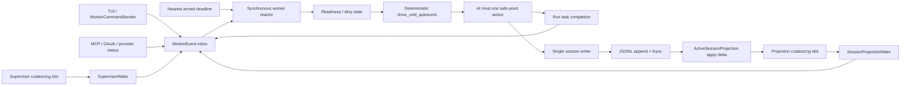

# RFC-0058 Event-driven Worker Reactor and Incremental Durable-session Projection V1

状态：accepted / implemented

创建日期：2026-07-28

依赖：

- [Rust agent core technical solution](../sigil-rust-agent-core-technical-solution.md)
- [RFC-0001 Durable Event Stream and Event Taxonomy](0001-durable-event-stream-and-event-taxonomy.md)
- [RFC-0008 Thread Projection and Agent Graph Observability](0008-thread-projection-and-agent-graph-observability.md)
- [RFC-0011 Crash Resume and Job Reconciliation](0011-crash-resume-and-job-reconciliation.md)
- [RFC-0018 Plan-to-task Handoff](0018-plan-to-task-handoff.md)
- [RFC-0035 TUI Orchestration Boundary Hardening V1](0035-tui-orchestration-boundary-hardening-v1.md)
- [RFC-0038 Alpha Long-session Performance V1](0038-alpha-long-session-performance-v1.md)
- [RFC-0042 SQLite Projection and Desktop Session Catalog V1](0042-sqlite-projection-and-desktop-session-catalog-v1.md)
- [RFC-0053 Autonomous Task Routing and Parallel Agent Orchestration V1](0053-autonomous-task-routing-and-parallel-agent-orchestration-v1.md)
- [RFC-0057 Cache-stable Compaction and Conversation Continuity V3](0057-cache-stable-compaction-and-conversation-continuity-v3.md)

## 1. Summary

Sigil 当前 TUI worker 使用固定 `50ms` timeout 作为所有后台状态的统一发现机制。只要 TUI 存活，
worker 即使没有命令、没有 active run、没有 queued TaskGuidance，也会反复执行完整 advancement pass。
其中 TaskGuidance discovery 每次从 durable JSONL 重新读取并解析全部记录；idle automatic compaction
又会在真正判断 context fit 之前启动后台 session reload。长 session 下，这两个路径会让一个空闲
worker 持续占用 CPU，并让同一进程中的 shared read lock 与 background exclusive lock 互相竞争。

2026-07-28 的现场 session 已确认这一失败形态：

- durable JSONL 约 `9.3 MiB`、`400` 条连续记录；
- 最新 `prompt_tokens = 216,803`，目标 context window 为 `1,000,000`，即约 `22% used`；
- 空闲 `sigil-agent-worker` 仍接近占满一个 CPU core；
- sample 栈稳定落在
  `advance_task_guidance -> prepare_next_task_guidance_candidate ->
  try_conversation_queue_durable_projection_from_durable -> read_event_records -> JSON parse`；
- automatic compaction background reload 需要 JSONL exclusive lock，而前台 discovery 持续获取 shared
  lock；bounded retry 最终返回 macOS `EAGAIN / os error 35`；
- 没有第二个 Sigil writer，也没有 stream sequence gap 或 compaction lifecycle append，故这是同进程
  调度与锁争用，不是 session corruption。

本 RFC 决定把 worker 一步迁移为 **事件唤醒、同步 reactor、确定性 safe-point driver**，同时建立
**active-session 增量 durable-source projection**。JSONL 继续是唯一 durable truth；事件通知只负责
“叫醒 worker”，projection 只负责从已验证 durable frontier 提供低成本 read model；最终 mutation
仍在 single-writer boundary 下做 cursor/CAS revalidation。

“先消除热扫描和锁竞争”与“建立增量 durable projection”都仍然值得做，并且是事件驱动方案的两个必要
组成部分：

| Mechanism | Solves | Does not solve alone |
| --- | --- | --- |
| Event-driven reactor | 无变化时不再每 `50ms` 执行 advancement | 真正发生一次事件时仍可能全量 replay |
| Incremental active projection | 每次 durable append 只 apply delta；查询为 bounded clone | 如果 worker 仍固定轮询，仍会产生无意义 wake/work |
| Active-session I/O coordinator | 同进程读写不用靠相互竞争的 OS file locks 协调 | 不能替代跨进程 writer lease |
| Cheap compaction preflight | `22% used` 等明显不 eligible 的请求不启动 reload | 不能替代 eligible compaction 的 exact admission |

因此，本 RFC 不把前两项作为未来独立优化，也不保留一套长期并行的 legacy polling engine。它们共同构成
R58 的完成定义。

## 2. Decision summary

1. 保留独立 `sigil-agent-worker` OS thread、单 active run、单 session writer 与当前
   `runtime.block_on(...)` boundary；V1 不把整个 worker 改成 async task。
2. 用一个统一的 `WorkerEvent` inbox 接收 command、async completion、durable-session advance、
   supervisor generation change 与 shutdown。空闲时 worker 阻塞在 `recv()`；只有存在明确 deadline
   时才使用 `recv_timeout(time_until_nearest_deadline)`。
3. 删除 production `50ms` general poll。MCP retry、terminal-process reconcile 等真实时间语义改成
   显式 one-shot deadline；没有 armed timer 时不产生 timer wake。
4. inbox event 只进入 readiness state；现有 safe-point 顺序由确定性
   `drive_until_quiescent()` 统一决定，不能让多 producer 的到达竞争隐式改变任务优先级。
5. command/completion/terminal lifecycle event 必须 deliver；snapshot/progress 类 event 可以按
   `(scope, generation)` 合并。streaming token delta 不进入 worker reactor，继续直接流向 UI。
6. `JsonlSessionStore` 的同路径 clones 继续共享 single writer，但升级为 active-session coordinator：
   writer、增量 projection、durable frontier 与 observers 共享同一 process-local state。
7. projection 在一次 append fsync 成功后、发出 wake 之前 apply 新 records。projection apply 失败不能
   回滚已 durable 的 append；它会把 cache 标为 invalid，下一次 authority read 在 writer boundary
   执行一次 full rebuild。
8. V1 active projection覆盖 scheduler hot-path 所需的 queue + revision、task/accepted-plan、
   compaction lifecycle、agent-result continuation、terminal task 与 usage/readiness summary；typed
   projection不复制 transcript body、tool output body 或 secret exact prompt。
9. TaskGuidance discovery 只在相关 durable family、exact prompt availability 或 active-run transition
   发生变化时变 dirty；候选从 active projection 读取。promotion 继续使用 durable CAS，并在 projection
   frontier 与 writer tail 不一致时 fail closed / rebuild。
10. idle automatic compaction 在 worker thread 上先做纯内存 cheap preflight。`22% used` 且不满足
    fit/economics admission 时直接 consume request，不创建 preparation task、不 reload session、
    不触碰 JSONL data-file lock。
11. eligible compaction 在 worker确认现有 `Session` entry projection已追到 coordinator frontier后，
    才克隆一次 frontier-bound stable snapshot；candidate完成后继续按 RFC-0057 revalidate session
    scope、source cursor和 exact target admission。
12. active-session runtime 禁止再调用 path-static full reader。OS shared/exclusive lock保留为跨进程
    safety boundary，但不再承担同进程热路径的互斥职责。
13. RFC-0042 SQLite catalog保持独立：它是跨 session、跨重启的历史查询 projection；本 RFC 的 active
    projection 是 process-local、可删除、可重建的 scheduler read model，绝不能经 SQLite 决定 live
    run、approval、queue promotion 或 compaction。
14. V1 不新增 runtime dependency。特别是不为 multi-receiver select 引入 `crossbeam-channel`；统一 inbox
    让标准库 channel 足够表达当前同步 reactor。

## 3. Goals and non-goals

### 3.1 Goals

- TUI worker 在没有 command、completion、relevant durable append 或 armed deadline 时真正休眠。
- 空闲长 session 不再重复 full JSONL scan、parse、shared-lock acquire 或 projection rebuild。
- TaskGuidance、conversation queue、blocking child continuation、background result 和 compaction 的
  safe-point priority 与当前 product contract 等价且可测试。
- 每个 relevant durable append 在同一进程中最多增量 apply 一次；active scheduler query 不随完整
  JSONL bytes 线性增长。
- durable notification 丢失、重复或合并都不能改变正确性；worker 能按 frontier 检测 stale/gap 并
  rebuild。
- automatic compaction 对显然不 eligible 的 session 完成零 I/O preflight。
- 同进程 active-session reads 不再与 writer/compaction 通过 advisory file lock竞争。
- session restart、tail recovery、checksum mismatch、projection schema upgrade 后仍能从 JSONL
  完整重建。
- 不泄漏 prompt、secret、absolute path 或 tool body 到 reactor event/telemetry。

### 3.2 Non-goals

- 不把 JSONL 替换成 SQLite、RocksDB、Kafka 或其他 truth store。
- 不移除 `.writer-lock`、data-file advisory lock、fsync 或 cross-process ownership。
- 不把 TUI worker、agent loop 和所有 tool runtime 一次性改写成 async actor system。
- 不让 event arrival order替代现有 safe-point priority。
- 不把 model token delta、terminal stdout chunk 或每次 UI render 都送入 scheduler inbox。
- 不在 V1 持久化 active projection sidecar；restart 可以做一次 bounded full rebuild。
- 不通过 projection 绕过 approval、mutation、promotion 或 compaction activation 的 durable CAS。
- 不把 RFC-0042 catalog用于 active run correctness。
- 不把 `ctx: 22%` 解释成剩余 22%；该 UI 值在本现场表示已使用约 22%。

## 4. Current baseline and confirmed root cause

### 4.1 Fixed-cadence worker

当前 [`scheduler.rs`](../../../crates/sigil-tui/src/runner/worker_loop/scheduler.rs) 在每轮先执行
`advance_worker_loop`，没有 immediate work 时再：

```rust
command_rx.recv_timeout(Duration::from_millis(50))
```

这意味着 `50ms` 不是某个明确 timer 的 deadline，而是 run result、compaction result、MCP、provider
status、background agent、terminal task、queue 和 TaskGuidance 的共同 polling clock。

[`advancement.rs`](../../../crates/sigil-tui/src/runner/worker_loop/advancement.rs) 每轮按固定顺序调用：

```text
provider/MCP refresh
MCP OAuth
route diagnostics
task progress
compaction results
run results
task guidance
pending task handoff
idle compaction
background agents
blocking agent continuation
conversation queue
```

这个顺序本身包含重要 product semantics，应保留；问题是所有分支都用“定时重问全部状态”来发现变化。

### 4.2 TaskGuidance hot scan

只要 `state.run.active.is_none()`，`advance_task_guidance` 就调用
`prepare_next_task_guidance_candidate`，不先检查是否存在 TaskGuidance，也没有 change generation。
后者调用：

```text
Session::try_conversation_queue_durable_projection_from_durable
  -> JsonlSessionStore::read_event_records(path)
  -> open file
  -> shared lock with retry
  -> read complete file
  -> parse all records
  -> ConversationQueueDurableProjection::from_records
```

`last_task_guidance_block` 只去重 Notice，不去重 discovery work。于是没有任何 queued guidance 的空闲
session 也会反复解析完整历史。

### 4.3 Compaction preflight is too late

successful chat run 会调用 `request_after_successful_chat_run()`。scheduler 随后创建 background
preparation task，而 closure 第一件事是
`load_session_with_captured_runtime_attachments(...)`。只有 reload 完成后，
`prepare_idle_auto_compaction` 才读取 `last_prompt_tokens` 并判定：

```text
last_prompt_tokens
+ next_turn_p95_tokens
+ output_reserve
+ safety_margin
>= context_window
```

现场 `216,803 / 1,000,000` 明显不满足 fit-required admission，却仍先做了一次需要 exclusive data-file
lock 的完整 reload。

### 4.4 Why lock retry failed

active reader 通过 `try_lock_shared` 读取整份 JSONL；background reload 通过
`try_lock_exclusive` 获取 writer-mode snapshot。当前 bounded retry 是 `51` 次、每次 `10ms`，总窗口约
`0.5s`。当 reader以固定 cadence 释放后又重新获取 shared lock，exclusive waiter没有公平性保证，
最终可能持续看到 `WouldBlock/EAGAIN`。

Rust 与 `fs2` 文档都明确区分 shared/exclusive whole-file lock，并提醒 file lock 存在平台差异；它适合
跨进程 advisory safety，不应当被当作同进程高频 read-cache mutex：

- [`std::fs::File::try_lock_shared`](https://doc.rust-lang.org/stable/std/fs/struct.File.html#method.try_lock_shared)
  允许多个 shared holder，但 exclusive lock 存在时返回 `WouldBlock`；
- [`fs2::FileExt`](https://docs.rs/fs2/latest/fs2/trait.FileExt.html) 明确把 file lock称为
  cross-platform hazard，并要求谨慎处理 duplicated handles。

### 4.5 What is not broken

- stream sequence `1..=400` 连续；
- session file可完整 parse；
- `.writer-lock` 由当前 Sigil PID 持有符合 single-writer contract；
- 没有第二个 live Sigil process；
- 没有 `CompactionStarted` / `CompactionApplied` 等本次 lifecycle记录；
- TaskGuidance final promotion 已在 writer lock下验证 queue revision 与 accepted plan。

因此不应通过删除 lock、放宽 CAS、重写 JSONL 或提高 compaction threshold“修复”本问题。

## 5. Why the three changes remain complementary

### 5.1 Event-driven does not make full replay cheap

迁移为 event-driven 后，空闲期间的 `20Hz` general wake 消失，但一次真实事件仍可能触发：

- queue projection full replay；
- task projection full replay；
- agent continuation full replay；
- terminal task full replay；
- compaction session reload；
- final promotion predicate full replay。

长 session 的一次 legitimate wake 仍会变成多个 `O(total_stream_bytes)` consumers。随着 control/event
种类增加，event-driven 甚至可能把“每次事件触发多个独立 replay”固定成新瓶颈。

### 5.2 Incremental projection does not make polling acceptable

即使 active projection query 是 `O(1)`/bounded clone，每 `50ms` 仍遍历所有 advancement branches、
锁多个 mutex、比对 snapshots、执行 channel `try_recv` 并制造 telemetry/render noise。projection 能
降低每轮成本，但不能证明 idle quiescence。

### 5.3 I/O coordination is a correctness boundary, not only optimization

event-driven 降低锁竞争概率，却不能保证 background reload 与某个真实 shared read永不重叠。
process-local coordinator 让同路径 store clones 共享 writer + projection frontier，并明确：

- 同进程先用 memory synchronization；
- 跨进程再用 OS lock；
- authority read若发现 frontier mismatch，进入一次受控 rebuild；
- automatic background work遇到 cross-process Busy 时 defer，不和前台形成重试风暴。

这比“把 retry 从 `0.5s` 加到 `5s`”更接近问题根因。

## 6. Required invariants

### I58.1 Single worker ownership

一个 TUI session仍只有一个 `sigil-agent-worker` thread负责：

- dispatch `WorkerCommand`；
- 修改 `WorkerLoopState`；
- 决定 safe-point action；
- 激活最多一个 foreground provider run。

background tasks只能产生 typed completion或更新受控 registry，不能自行启动下一次 run。

### I58.2 Wake is not truth

`WorkerEvent::SessionProjectionWake`、`SupervisorWake` 等 event 是 hint。它们可以重复、合并或在
receiver shutdown时丢失，但不得包含足以绕过 durable validation 的 authority。

### I58.3 Durable-before-visible

一次 durable append 的顺序必须是：

```text
validate/assign identity
-> append bytes
-> flush/fsync according to existing contract
-> update writer tail
-> apply active projection delta
-> publish projection frontier
-> emit worker wake
```

绝不能先 wake，再让 worker观察尚未 durable或尚未进入 projection 的状态。

### I58.4 Cursor-monotonic projection

active projection只能按严格连续的 `stream_sequence` apply。session id、event id、record checksum、
writer generation、durable end offset或 schema version 任一不匹配时，projection进入 `Invalid`，不得
猜测性跳过 gap。

### I58.5 CAS remains final authority

queue mutation、TaskGuidance promotion、compaction activation、approval和 forward effect仍在 writer
boundary 下验证 expected revision/cursor。cached projection只有在被证明与 current writer tail一致时
才能参与 validation；否则必须 rebuild或返回 typed stale/busy。

### I58.6 Safe-point priority is explicit

channel arrival order不能决定：

- blocking child continuation是否先于 ordinary queued input；
- non-blocking background result是否抢走 queued input；
- TaskGuidance何时绑定 accepted plan；
- compaction是否可以越过 active run/queue/continuation。

这些规则继续由一个可审计 priority table决定。

### I58.7 No idle work without cause

worker从一次 `drive_until_quiescent` 返回后，只有以下原因可以再次运行：

- inbox 收到 event；
- 已注册 deadline到期；
- shutdown/disconnection。

禁止保留“为了保险每 N ms 扫一遍所有状态”的 production fallback。

## 7. Research basis

### 7.1 Official runtime and architecture guidance

- Rust standard `mpsc::Receiver::recv_timeout` 在消息发送时会唤醒 blocked receiver；因此同步 OS thread
  可以用“无 deadline 时 `recv()`、有 deadline 时 `recv_timeout(nearest_deadline)`”实现 reactor，
  不需要固定 tick。[Rust `Receiver` documentation](https://doc.rust-lang.org/stable/std/sync/mpsc/struct.Receiver.html)
- Tokio `select!` 能等待多个 async branch，并说明 default fairness、`biased` starvation责任以及
  cancellation safety；但所有 branch仍在当前 task并发执行，blocking branch会阻塞其他 branch。
  [Tokio `select!` documentation](https://docs.rs/tokio/latest/tokio/macro.select.html)
- Tokio bounded `mpsc`提供 backpressure，unbounded channel可能把系统内存当作隐式上限；sync-to-sync
  receiver可继续使用 standard channel。R58 因而禁止把 token delta送进 unbounded worker inbox，并对
  outstanding event计数。
  [Tokio `mpsc` documentation](https://docs.rs/tokio/latest/tokio/sync/mpsc/)
- Tokio `watch`只保留最后一个 value，适合 status/generation；`Notify`只保存一个 permit，适合
  “state changed, re-read latest state”而不适合传递 authority payload。
  [Tokio `watch`](https://docs.rs/tokio/latest/tokio/sync/watch/)、
  [Tokio `Notify`](https://docs.rs/tokio/latest/tokio/sync/struct.Notify.html)
- explicit deadline可由 `sleep_until`/可 reset `Sleep`表达，等待期间不执行工作。
  [Tokio `sleep_until`](https://docs.rs/tokio/latest/tokio/time/fn.sleep_until.html)
- event sourcing guidance指出，长 stream每次完整 rehydration成本会增长，应使用可重建 materialized
  view/snapshot并跟踪最后处理 sequence；snapshot是优化，不替代 event stream。
  [Microsoft Event Sourcing pattern](https://learn.microsoft.com/en-us/azure/architecture/patterns/event-sourcing)
- materialized view应由 source change驱动更新、可完全删除并从 truth store重建；应用不能直接把 view
  当真相写入。
  [Microsoft Materialized View pattern](https://learn.microsoft.com/en-us/azure/architecture/patterns/materialized-view)

这些资料支持本 RFC 的两个核心分离：

```text
wake transport: may coalesce, carries no authority
durable projection: sequence-checked, rebuildable, query-optimized
```

### 7.2 Competitor repository research

本节基于 `~/study/sigil-competitor-repos` 在 2026-07-28 的本地 snapshots；链接固定到 exact revision。
调研关注 event loop、completion delivery、burst fairness与 replay cursor，不从竞品默认值推导 Sigil
产品 contract。

| Project / revision | Observed mechanism | R58 adoption | Boundary / rejection |
| --- | --- | --- | --- |
| [OpenAI Codex `4808c16`](https://github.com/openai/codex/blob/4808c162eeb767b389f13b7cb2730f32c8563dba/codex-rs/tui/src/app.rs#L1168-L1216) | TUI top-level loop用 `select!` 等待 app event、active-thread event、terminal input与 app-server event；core session用 bounded submission channel并阻塞 `recv().await`，[而不是 fixed tick](https://github.com/openai/codex/blob/4808c162eeb767b389f13b7cb2730f32c8563dba/codex-rs/core/src/session/handlers.rs#L702-L709) | typed unified event、blocking receive、明确 active-thread stream | 不直接复制 async outer loop；Sigil当前大量 `runtime.block_on` 需要先保留 sync boundary |
| [DeepSeek Reasonix `a2a44a7`](https://github.com/esengine/DeepSeek-Reasonix/blob/a2a44a772c7c954763255ab4752cc47473a73cac/internal/cli/chat_tui.go#L1309-L1335) | controller通过 buffered typed event channel送入 Bubble Tea；`waitForAgentEvent` 阻塞等事件；burst到达时 capped drain/coalesce，随后重新注册 wait；elapsed是独立 `tea.Tick` | long work off-loop、completion变 Msg、bounded burst drain、timer与普通事件分离 | 不把 lossy UI streaming channel当 durable scheduling truth |
| [Crush `d8fc48a`](https://github.com/charmbracelet/crush/blob/d8fc48a03c36f3268b4013d3a72ef7091c43d712/internal/pubsub/broker.go#L1-L45) | pubsub显式区分 lossy high-frequency update和 bounded-blocking terminal event；drop有 counter；TUI subscriber阻塞等 event后 `program.Send` | 按事件语义区分 coalescible observation与 must-deliver lifecycle；saturation必须可观测 | Sigil terminal scheduler event不能在 timeout后静默丢弃；durable frontier提供恢复而不是只靠 refetch约定 |
| [OpenCode `884c256`](https://github.com/anomalyco/opencode/blob/884c256033958475be4feba69b7e6bf72caaf0ed/packages/core/src/event.ts#L205-L395) | durable event、per-aggregate sequence和 operational projector在同一 DB transaction提交；commit后才 publish wake；durable subscriber用 sliding wake(1)并按 `after sequence` 读取 missed events，[形成 history + live stream](https://github.com/anomalyco/opencode/blob/884c256033958475be4feba69b7e6bf72caaf0ed/packages/core/src/event.ts#L541-L603) | durable-before-notify、sequence cursor、wake可合并、projection与 event commit frontier绑定 | Sigil不迁移 SQLite truth，也不把 process-local projection升级为第二 durable store |
| [Goose `fe7f16b`](https://github.com/aaif-goose/goose/blob/fe7f16b727fa1ecccac15c7eaab593b13347058f/crates/goose-server/src/session_event_bus.rs#L20-L113) | session event bus分配 monotonic seq；subscribe先建立 live receiver再 snapshot replay buffer，按 `replay_max_seq` 去重，落后过远返回 typed error | 先订阅再 catch-up、cursor dedupe、too-far-behind必须显式 recovery | bounded in-memory replay buffer不能替代 Sigil完整 JSONL；gap时应 full rebuild |

竞品共同点不是使用同一种 channel，而是：

1. idle path阻塞等待变化；
2. expensive work在 loop外执行，完成后产生 typed event；
3. high-frequency observation与 terminal lifecycle采用不同 delivery语义；
4. event notification与 replay/cursor结合，不能假设 live notification永不丢；
5. burst drain必须有上限，否则高流量 source会饿死 control/shutdown。

## 8. Target architecture



### 8.1 Why the V1 reactor remains synchronous

当前 worker thread 自己创建 Tokio runtime，并在 provider build、run setup、MCP、compaction等 helper中
使用 `runtime.block_on(...)`。若只把 outer loop包进 `runtime.block_on(async { tokio::select! ... })`，
而不同时重写所有 nested blocking boundary，会引入 nested runtime panic、blocking async executor和
不清晰 cancellation semantics。

V1 因而选择：

```text
dedicated OS thread
+ standard MPSC unified inbox
+ blocking recv / nearest-deadline recv_timeout
+ existing Tokio runtime only for spawned async work and explicit block_on calls
```

这已经是完整事件驱动 worker，不是“临时提高 polling interval”。未来若所有 blocking boundary都有
async contract，可另起 RFC 把 reactor迁入 Tokio；该迁移不影响本 RFC 的 `WorkerEvent`、readiness、
projection frontier或 safe-point driver设计。

### 8.2 Proposed types

示意 API：

```rust
pub(crate) struct WorkerCommandSender {
    event_tx: mpsc::Sender<WorkerEvent>,
}

impl WorkerCommandSender {
    pub(crate) fn send(
        &self,
        command: WorkerCommand,
    ) -> Result<(), WorkerCommandSendError>;
}

pub(in crate::runner) enum WorkerEvent {
    Command(WorkerCommand),
    RunCompleted(RunTaskResult),
    CompactionPrepared(CompactionPreparationTaskResult),
    ProviderStatusResolved(ProviderStatusTaskResult),
    McpOAuthCompleted(McpOAuthTaskResult),
    McpRuntime(McpRuntimeEvent),
    BackgroundAgentCompleted {
        session_scope_id: String,
        thread_id: AgentThreadId,
        generation: u64,
    },
    SupervisorWake {
        session_scope_id: String,
        family: SupervisorChangeFamily,
    },
    SessionProjectionWake {
        session_scope_id: String,
        observer_id: SessionProjectionObserverId,
    },
    TimerDue,
    Shutdown,
}
```

`WorkerCommandSender` 是 TUI-internal newtype，不扩大 public kernel API。它保持 `.send(command)` 调用形状，
但将 command封装成统一 event。tests不再直接依赖 `std::sync::mpsc::Sender<WorkerCommand>` 的具体类型。

### 8.3 Event delivery classes

| Class | Examples | Delivery | Recovery |
| --- | --- | --- | --- |
| Authority-changing command | approval response, queue mutation, shutdown, interrupt | FIFO, must deliver while receiver alive | caller receives send error |
| Async terminal completion | run done, compaction prepared, OAuth result | must deliver, idempotent by request/run id | task manager retains identity until accepted |
| Durable state advance | queue/task/plan/compaction append | producer-side slot coalesces by observer | read projection after last known cursor |
| Latest snapshot changed | route diagnostics, task progress | producer-side slot coalesces by family | read latest registry snapshot |
| High-frequency display | token delta, terminal stdout chunk | does not enter worker scheduler | existing WorkerMessage/UI stream |
| Timer | MCP retry, terminal reconcile | one armed nearest deadline | recompute deadline from state |

`SessionProjectionWake` 和 `SupervisorWake` 都是 bounded wake token。token 本身只携带定位
coalescing slot 所需的 scope/observer/family key，不携带 prompt/body、generation、frontier或“下一步
应该做什么”。最新 generation、frontier与 changed-family union保存在共享 slot 中，authority仍从
projection或 registry读取。

#### 8.3.1 Producer-side coalescing protocol

只在 worker 端收到大量 event 后再去重，仍可能让 unbounded MPSC 被 wake 淹没。因此 projection observer
和 supervisor registry 都必须在 producer 端使用 coalescing slot：

```rust
struct CoalescingWakeSlot<T> {
    state: Mutex<WakeSlotState<T>>,
}

struct WakeSlotState<T> {
    latest: Option<T>,
    wake_queued: bool,
}
```

publish protocol：

1. 持有 slot mutex，把 change 合并进 `latest`；
2. 仅当 `wake_queued == false` 时置为 `true` 并决定 enqueue 一个 wake token；
3. 释放 mutex 后发送 token，避免 channel send 在 slot 临界区内执行；
4. receiver 已关闭时只记录 shutdown-aware send failure，不重试。

consume protocol：

1. worker 收到 token后持有 slot mutex；
2. `take()` 当前 latest并把 `wake_queued` 置回 `false`；
3. 释放 mutex后处理 snapshot；
4. 若 producer 在第 2 步之后再次 publish，它会看到 `false` 并 enqueue 新 token。

因此 producer 若发生在 consume 之前，其变化会进入本次 merged snapshot；若发生在 consume 之后，则一定
产生下一次 token。slot 按 active observer/family 有界创建并随 scope注销，不得按每条 delta 无界增长。
terminal completion和 authority-changing command不使用此协议，仍逐项 must-deliver。

### 8.4 Reactor loop

目标 loop：

```rust
loop {
    drive_until_quiescent(&mut state, ...)?;
    if state.shutdown_requested() {
        break;
    }

    let event = match state.nearest_deadline() {
        None => event_rx.recv().map_err(WorkerDisconnected)?,
        Some(deadline) => match event_rx.recv_timeout(deadline.saturating_duration_since(now())) {
            Ok(event) => event,
            Err(Timeout) => WorkerEvent::TimerDue,
            Err(Disconnected) => break,
        },
    };

    ingest_event(event, &mut state)?;
    ingest_ready_burst(MAX_EVENT_DRAIN, &event_rx, &mut state)?;
}
```

要求：

- `drive_until_quiescent` 每次最多执行 `MAX_DRIVE_ACTIONS_PER_PASS`；
- burst drain最多 `MAX_EVENT_DRAIN`，且 shutdown/interrupt不能被 coalesce；
- 超过 budget 后先重新检查 inbox，避免持续 ready的内部 work饿死 command；
- event handler只更新 state/dirty bits，不执行网络、完整 replay或长时间 process wait；
- 当所有状态 quiescent 且无 timer，线程可以无限期阻塞。

### 8.5 Explicit timers

当前两个主要 cadence：

- `MCP_REFRESH_RETRY_INTERVAL = 250ms`；
- `TERMINAL_TASK_REFRESH_INTERVAL = 500ms`。

迁移后：

- 只有存在 blocked MCP refresh时才 arm `McpRefreshRetry(server, deadline)`；
- 只有存在无法获得 native exit notification的 active terminal task时才 arm
  `TerminalTaskReconcile(deadline)`；
- timer处理后根据当前 state重新计算下一个 deadline；
- provider run、compaction、OAuth、background agent completion必须发 event，不允许靠 timer发现；
- 没有任何 active deadline时不得每 `50ms` 醒来。

terminal process manager未来若能提供可靠 exit event，可删除对应 reconcile timer；该演进不改变 reactor。

## 9. Deterministic safe-point driver

### 9.1 Readiness state

inbox event先归一化为：

```rust
struct WorkerReadiness {
    urgent_commands: VecDeque<WorkerCommand>,
    ordinary_commands: VecDeque<WorkerCommand>,
    run_results: VecDeque<RunTaskResult>,
    compaction_results: VecDeque<CompactionPreparationTaskResult>,
    provider_status_results: VecDeque<ProviderStatusTaskResult>,
    oauth_results: VecDeque<McpOAuthTaskResult>,
    mcp_events: VecDeque<McpRuntimeEvent>,
    dirty_session_families: ProjectionChangeSet,
    dirty_supervisor_families: SupervisorChangeSet,
    completed_background_agents: BTreeSet<AgentThreadId>,
    due_timers: BTreeSet<WorkerTimerKind>,
}
```

completion payload不再先进入一组独立 channel，再由 worker逐个 `try_recv`。producer直接把 typed result送进
unified event，减少“有结果但没有 wake source”的状态。

### 9.2 Required priority

下表把当前隐式 call order升级为 explicit contract。具体同级 FIFO可在实现时固定，但不能破坏这些约束：

| Priority | Action family | Required rule |
| --- | --- | --- |
| P0 | shutdown, interrupt, approval/elicitation response | 不得被 progress或ordinary queue饿死 |
| P1 | active run terminal result, cancellation settlement | 先关闭旧 active ownership，再考虑下一 run |
| P2 | compaction/provider/OAuth/MCP terminal result | 只消费 matching request/scope；stale result丢弃并审计 |
| P3 | blocking child-agent continuation | blocking result可在 safe point优先于 ordinary queued input |
| P4 | accepted task handoff / eligible TaskGuidance | 必须验证 single active run与 durable plan/queue revision |
| P5 | ordinary conversation queue | non-blocking background result不能无条件抢走已排队用户输入 |
| P6 | idle automatic compaction | 仅在 run/queue/blocking continuation均空闲且 preflight eligible |
| P7 | observational refresh / retry timer | 不得改变 authority或启动 provider run |

`queue` 与 `message_agent`、blocking与 non-blocking child result的已有语义继续按 RFC-0053执行；R58 只改变
“如何发现 ready”，不重新定义产品优先级。

### 9.3 Fairness

为了避免从 `50ms polling` 迁移成“event flood busy loop”：

- command FIFO不能被 snapshot generation update插队；
- 同一 `(session_scope, family)` 的 supervisor slot只保留最大 generation；
- projection observer slot合并 changed-family union并保留最大 contiguous frontier；
- 若 frontier不连续，不合并为“看起来连续”，而是标记 projection reconcile；
- 每个 pass最多执行固定数量 action，随后检查新到 urgent command；
- outstanding inbox count超过 soft limit时记录 saturation telemetry；
- producer禁止把 assistant token delta、tool stdout chunk或每次 task percentage变更当 must-deliver event；
- terminal completion即使重复也按 idempotency key消费，不能因去重 bug漏掉唯一 completion。

## 10. Incremental durable-session projection

### 10.1 Meaning of “durable projection”

本 RFC 中的 “incremental durable-session projection” 指：

> 从已 fsync、checksum/sequence validated 的 durable session stream增量派生 active read model。

projection 本身不是新的 durable truth。进程退出后可以丢失；删除 cache后，必须能只用 JSONL重建同一
逻辑状态。这样既满足 append-only/auditable原则，也避免引入第二个 live authority。

### 10.2 Ownership

`sigil-kernel` 新增 provider-neutral active-session coordinator，概念结构：

```rust
struct SharedSessionCoordinator {
    writer: Mutex<LinearSessionWriter>,
    projection: RwLock<ActiveSessionProjectionState>,
    observers: SessionProjectionObservers,
}

enum ActiveSessionProjectionState {
    Uninitialized,
    Ready(ActiveSessionProjection),
    Invalid(ProjectionInvalidation),
}
```

同一路径的所有 `JsonlSessionStore::new(path)` clones必须解析到同一个 coordinator。不能出现：

```text
clone A -> writer Arc A + projection A
clone B -> writer Arc A + projection B
```

否则不同 append path会让 projection漏 apply。

### 10.3 Frontier

不要把某一个 reducer的 `ProjectionCursor`直接当整个 cache identity。新增 process-internal frontier：

```rust
struct ActiveProjectionFrontier {
    session_id: SessionId,
    last_stream_sequence: u64,
    last_event_id: EventId,
    last_record_checksum: String,
    durable_end_offset: u64,
    writer_generation: String,
}
```

- `stream_sequence/event_id/checksum` 复用现有 verified record identity；
- `durable_end_offset` 复用 append receipt/tail，检测 partial tail与 behind cache；
- `writer_generation` 只在 coordinator内部比较，不进入 JSONL/public protocol；
- 每个 typed reducer继续持有自己的 projection schema version/cursor；
- active projection schema version变化时无条件 full rebuild。

### 10.4 V1 reducer set

| Projection family | Scheduler consumer | Stored shape |
| --- | --- | --- |
| Conversation queue + revision | ordinary queue、TaskGuidance、mutation CAS | active items、pause、next dispatch、seen ids、exact revision |
| Task + accepted plan | handoff、TaskGuidance eligibility | task status、accepted/superseded plan identity/version |
| Compaction lifecycle | idle/manual/pre-turn admission | latest attempt、terminal state、source cursor、usage summary |
| Agent result continuation | blocking child continuation | pending/consumed continuation ids与 blocking class |
| Terminal task | reconcile timer | active terminal process identity/status |
| Session usage/readiness | cheap compaction preflight、status | last prompt tokens、provider/model route、readiness summary |

V1 不把 exact prompt放入 projection。`ExactConversationPromptStore` 仍是 bounded process-local secret store，
projection只保存 queue id、safe prompt/hash和 durable target。

provider-visible/control entry history继续由现有 active `Session` entry projection持有，不在每个 typed
reducer中复制。所有 entry-bearing append必须遵守“durable append成功后先更新 active `Session`，再让
worker进入下一 safe point”；run期间由 detached adapter追加的 controls必须在 run terminal result被消费、
active ownership释放之前合并。eligible compaction只在确认 active `Session` 已追到 coordinator frontier后
克隆一次临时 immutable snapshot。

### 10.5 Incremental apply

append成功返回的新 `StoredEvent` 及 offsets已经足以生成 record cursor。coordinator在 writer mutex保护下：

1. 确认 projection frontier等于 append前 writer tail；
2. 按 sequence apply新 records；
3. 每个 reducer使用现有 `projection_apply_decision_for_record`/typed apply函数；
4. 更新 frontier与 changed families；
5. 发布 immutable snapshot/frontier；
6. 释放 writer/projection locks；
7. 向 observers发送 lightweight change notification。

如果 projection尚未初始化，append可以只更新 durable tail并保持 `Uninitialized`；首次 scheduler query
执行一次 full rebuild。更优的 startup path是在 `Session::load_from_store` 已完成 writer-reconciled read
时直接用同一批 records seed projection，避免第二次 scan。

### 10.6 Projection apply failure

durable append成功后 projection reducer可能因 bug、unknown schema或 checksum mismatch失败。失败方向必须是：

```text
JSONL append: success, remains truth
projection: Invalid(reason, observed_frontier)
observer slot: Invalidated(reason, observed_frontier) + SessionProjectionWake
caller append result: success, with degraded projection telemetry
next authority query: rebuild or typed unavailable
```

不能因为 cache update失败而把已 fsync append报告为“未发生”，否则调用方可能重试 forward effect并产生
duplicate side effect。

### 10.7 Rebuild and catch-up

rebuild在 active coordinator writer boundary内执行：

1. acquire process writer mutex；
2. acquire cross-process writer/data-file lock using existing ownership contract；
3. perform tail recovery；
4. read validated records once；
5. rebuild all active reducers from empty；
6. verify each reducer cursor与 final stream frontier一致；
7. publish Ready snapshot；
8. publish one projection-slot `Rebuilt(frontier, all_families)` update；若尚无 outstanding token，再 emit
   one `SessionProjectionWake`。

如果 rebuild期间另一个 process持锁：

- automatic idle work返回 `DeferredBusy { retry_after }`，arm backoff deadline；
- manual command返回 typed busy/error并保留用户重试能力；
- pre-turn correctness path使用现有 bounded blocking/recovery policy；
- 任何路径都不得 immediately retry in a tight loop。

### 10.8 Authority query and CAS

新增 writer-coordinated API示意：

```rust
fn active_projection_snapshot(
    &self,
    families: ProjectionChangeSet,
) -> Result<ActiveSessionProjectionSnapshot>;

fn append_if_active_projection<F>(
    &self,
    expected: ActiveProjectionFrontier,
    pending: Vec<PendingStoredEvent>,
    validate: F,
) -> Result<ConditionalAppendOutcome>
where
    F: FnOnce(&ActiveSessionProjection) -> Result<()>;
```

`append_if_active_projection` 必须在 writer mutex内：

- `ensure_current_tail`；
- 确认 cached frontier == writer tail == expected frontier；
- 执行 typed validation；
- append；
- incrementally apply；
- 返回 stored event/receipt。

frontier任一不一致返回 `Stale` 或触发一次 rebuild，绝不能用 cached queue直接 append。现有
`append_task_guidance_promoted` 的 full-record CAS可先作为 fallback；迁移完成后应走这一 API，以便
legitimate promotion也不再 full replay。

### 10.9 Relationship to RFC-0042

| Dimension | RFC-0042 SQLite catalog | RFC-0058 active projection |
| --- | --- | --- |
| Scope | 多 workspace / 多 session历史列表 | 一个 active session |
| Lifetime | 跨进程重启持久化 | process-local、可丢弃 |
| Query | pagination/filter/search/sort | scheduler safe-point readiness/CAS snapshot |
| Freshness | reconcile/eventually consistent | append frontier一致后才 Ready |
| Authority | never live authority | 只在 writer-tail equality下参与 validation |
| Source | JSONL + lifecycle journal | active JSONL writer records |
| Failure | history query degraded | scheduler fail closed / rebuild |

不得让两套 projection互相依赖；特别是 active worker不能为了 queue/task readiness查询 SQLite catalog。

## 11. Hot-path redesigns

### 11.1 TaskGuidance

新增 `task_guidance_dirty`，初始 session load时为 true。只有以下变化重新置 true：

- queue family append：enqueue/edit/remove/reorder/status/promotion；
- task or accepted-plan family append；
- exact prompt store新增/删除目标 queue id；
- active run从 Some变 None；
- session switch/projection rebuild。

V1 中 exact prompt store的 scheduler-relevant mutation必须发生在 worker command handling内，并在同一
pass同步置 dirty；若未来允许外部 producer直接修改该 store，则它必须先新增 coalesced local-state wake，
不能引入“静默 mutation + 定时补扫”的旁路。

driver仅在 `task_guidance_dirty && active_run.is_none()` 时：

1. 从 active projection查找 oldest queued `TaskGuidance`；
2. 从 task/plan projection验证 target/accepted plan；
3. 从 exact prompt store取 secret exact guidance；
4. 形成带 queue revision、plan version和 source frontier的 candidate；
5. 调用 writer-coordinated promotion CAS；
6. 成功后启动 run；Waiting状态只在 relevant generation变化后重新判断。

`NoQueuedGuidance` 会清除 dirty，不会在下一个无关 wake重新扫描。

### 11.2 Conversation queue

ordinary queue和 TaskGuidance共享同一 `ConversationQueueDurableProjection` snapshot，避免在同一
safe-point分别 replay。queue mutation append后，changed family wake使两个 consumer按 priority重新评估。

### 11.3 Background agents and supervisor snapshots

- background `JoinHandle::is_finished()` 不再每轮 poll；
- task completion path在 result写入 registry后发送 `BackgroundAgentCompleted(thread_id, generation)`；
- provider route diagnostics/task progress registry在 generation增加后更新 family coalescing slot，并在
  尚无 outstanding token时发送 `SupervisorWake(scope, family)`；
- worker按 generation读取最新 snapshot并输出 WorkerMessage；
- stale generation被合并，terminal agent result不能只靠 latest-value channel。

### 11.4 Idle automatic compaction

拆成三层：

```text
CheapCompactionPreflight
  inputs: current in-memory stats, config, route capabilities, active queue/run state
  output: NotRequested | NotEligible(reason) | Eligible(preview, source_frontier)

StableSnapshotPreparation
  inputs: Eligible + active coordinator
  output: immutable session snapshot at exact frontier

Semantic/portable preparation
  inputs: stable snapshot
  output: candidate revalidated before activation
```

Cheap preflight在启动 background task之前执行。现场 `216,803 / 1,000,000` 必须得到
`NotEligible(NotFitRequired)`，并满足：

- preparation task count不增加；
- `load_session_with_captured_runtime_attachments` 不调用；
- data-file shared/exclusive lock attempt均为 0；
- request被正确 consume，不在下一 wake重复尝试。

若 RFC-0057 后续开放 cost-only auto compaction，cheap preflight也必须先证明存在足够强的 deterministic
upper-bound economics signal；不能用一次 session reload或额外 provider request只为发现“不经济”。

### 11.5 Stable compaction snapshot

eligible compaction不再从 path新建一套竞争 writer的 `JsonlSessionStore`。worker先确认 active
`Session` entry projection已追到 coordinator frontier，再组合：

- session scope；
- provider/model route；
- existing active `Session` 的一次性 entries snapshot；
- usage/readiness summary；
- projection/source frontier；
- runtime attachments的 safe captured refs。

background candidate完成后若 current frontier已变化，按 RFC-0057 compare-and-publish规则重新判断：

- harmless suffix可重算/重新 prepare；
- queue/task/intent/compaction相关变化使 candidate stale；
- stale candidate不得 append `CompactionApplied`。

### 11.6 File-lock boundary

active runtime新增规则：

- `JsonlSessionStore::read_event_records(path)` 只保留 startup、external/stateless或 migration用途；
- TUI active session scheduler/compaction不得直接调用 path-static reader；
- active reads通过 shared coordinator；
- same-process store clones通过 Rust mutex/RwLock协调；
- OS data-file lock只覆盖 cross-process snapshot/append/recovery；
- lock contention必须映射为 typed `Busy`，自动路径使用 bounded exponential backoff + jitter；
- 不增加 retry duration来掩盖热扫描。

实现完成后可把 path-static full reader收窄为 `pub(crate)` 或加显式
`read_external_snapshot_records` 命名，降低未来误用概率。

## 12. Current-source migration matrix

| Current source | Current discovery | Target event/deadline | Notes |
| --- | --- | --- | --- |
| `command_rx` | `recv_timeout(50ms)` | `WorkerEvent::Command` | newtype sender preserves TUI call shape |
| `run.result_rx` | `try_recv` each pass | `RunCompleted` | must deliver, run id dedupe |
| `compaction.preparation_rx` | `try_recv` | `CompactionPrepared` | scope/request id validation |
| `provider_status_rx` | `try_recv` | `ProviderStatusResolved` | result payload event |
| `mcp_oauth.result_rx` | `try_recv` | `McpOAuthCompleted` | result payload event |
| external `mcp_event_rx` | `try_recv` | `McpRuntime` | bridge sends unified event |
| TaskGuidance queue state | full durable replay each pass | projection slot + `SessionProjectionWake` | query active projection |
| conversation queue | advancement each pass | projection slot + `SessionProjectionWake` | shared snapshot |
| background agent JoinHandle | `is_finished` each pass | `BackgroundAgentCompleted` | publish after result visible |
| route diagnostics | snapshot comparison each pass | route slot + `SupervisorWake` | latest-only |
| task progress | snapshot comparison each pass | progress slot + `SupervisorWake` | latest-only |
| MCP blocked refresh | `Instant >= next` each pass | explicit deadline | only armed while blocked |
| terminal task status | fixed `500ms` check | explicit deadline / future native exit event | external process fallback |
| idle compaction requested | advancement each pass | run completion marks dirty once | cheap preflight before spawn |

迁移 gate要求矩阵每一行都有 deterministic test；遗漏任何 completion source都不能删除 production poll。

## 13. Failure semantics

### 13.1 Duplicate event

- command：使用现有 command id去重；
- completion：按 run/request/thread id去重；
- generation change：小于等于 last seen generation忽略；
- session advance：小于等于 current frontier忽略；
- durable record重复 apply由 projection cursor返回 `IgnoreAlreadyApplied`。

### 13.2 Missed/coalesced wake

如果多个 durable delta在 projection slot合并，worker从 current projection frontier读取最新 state，不逐条
重演 wake。如果 observer检测到 generation jump但 projection frontier连续，直接使用最新 snapshot；若
frontier gap，进入 rebuild。producer-side `wake_queued` protocol保证 merge期间最多存在一个 outstanding
token，同时保证 consume之后的新变化会产生下一 token。

### 13.3 Producer finishes before worker blocks

producer必须先存储 result/projection，再 send event。standard MPSC buffer保存先到 event，因此 worker随后
`recv()` 会立即返回，不存在“检查为空 -> 事件发生 -> 开始睡眠后丢 wake”的窗口。

### 13.4 Worker event receiver disconnects

worker执行现有 cancellation/abort cleanup：

- abort provider-status/compaction tasks；
- cancel active run；
- release session observers；
- close MCP/OAuth flows；
- flush必要 lifecycle；
- exit thread。

### 13.5 Projection invalid

worker不得从 stale snapshot启动 run或 forward effect。允许：

- 输出一次 bounded Notice/diagnostic；
- scheduler进入 `ProjectionReconciling`；
- manual retry或 armed backoff触发 rebuild；
- UI继续显示已有 transcript，但需要 authority的 action保持 disabled。

### 13.6 Lock busy

新增 typed categories：

```text
SessionIoBusy::CrossProcessReader
SessionIoBusy::CrossProcessWriter
SessionIoBusy::RecoveryInProgress
```

不把所有 `EAGAIN` 包装成相同字符串。automatic work不向 transcript重复报 error；只更新 status/telemetry，
达到 retry budget后 latch当前 scope。manual work显示一次可操作错误。

## 14. Observability and privacy

V1 直接提供以下不含 prompt/path 的 process-local 聚合 counters/evidence：

- `WorkerReactorMetricsSnapshot`：event wake、armed deadline、advancement 总数；
- `ActiveProjectionMetricsSnapshot`：snapshot、full rebuild、incremental apply、invalidation、
  coordinator writer-lock attempt、publication 总数；exact frontier由 projection snapshot直接读取；
- `SessionIoLockMetricsSnapshot`：shared/exclusive OS data-file lock attempt、contention、failure总数；
- `IdleAutoCompactionPreflightEvidenceV1`：单次 idle preflight的 decision、session reload与 preparation
  结果，用于 deterministic test/evidence；
- long-session evidence保存上述 counter的 scoped saturating delta，并记录 bounded projection memory
  estimate。

V1 不创建按 session/path/prompt派生的高基数 metric series，也不把 `reason/family/purpose` 维度作为
“已落地”的全局 metrics contract。事件类别、invalidation原因和 preflight decision由 typed
event/result及 deterministic test断言；MCP coalescing上限由 admission limit与 bounded-state test
证明，而不是由尚未接入 telemetry backend的 high-watermark counter证明。

trace允许记录 opaque session scope hash、run/request id、sequence、bytes、duration和 event family；禁止记录：

- absolute JSONL path；
- prompt/exact guidance；
- assistant/tool body；
- credentials/URL bearer；
- raw file checksum以外的内容摘要。

## 15. Validation strategy

### 15.1 Deterministic worker tests

1. no event/no deadline：worker进入 blocked receive，advancement count不增长；
2. command-before-wait与command-during-wait都能立即处理；
3. run completion在 worker阻塞时唤醒并只 settle一次；
4. burst超过 drain limit后 urgent interrupt仍被处理；
5. stale session scope/generation/result id被忽略；
6. blocking child continuation、ordinary queue、TaskGuidance、idle compaction priority符合 §9.2；
7. no active terminal/MCP work时没有 timer wake；
8. armed deadline到期一次，只在仍需要时 re-arm。

测试不使用 wall-clock `sleep(50ms)` 猜测状态；通过 barrier、fake clock、channel acknowledgement和
instrumented counters证明。

### 15.2 TaskGuidance regression

构造：

- 约 `10 MiB` validated session；
- 至少 `400` records；
- active run = none；
- queue无 TaskGuidance；
- idle worker等待多个 fake-clock intervals。

断言：

- full durable read count保持 0（startup seed之后）；
- shared/exclusive data lock attempt保持 0；
- task guidance evaluation count只在 initial dirty pass发生一次；
- worker没有 periodic advancement；
- 注入一个 TaskGuidance append后恰好一次 wake/evaluation；
- promotion仍验证 exact queue revision + accepted plan version。

### 15.3 Projection equivalence

对每个 V1 reducer：

- full replay结果 == 任意 chunk size的 incremental apply结果；
- 每个 prefix append后 snapshot == 从 prefix full rebuild；
- duplicate record idempotent；
- sequence gap、session mismatch、event id/checksum mismatch fail closed；
- schema version变化触发 rebuild；
- truncated/partial tail经过 writer recovery后重建一致；
- mixed direct event + session entry batch保持 append order；
- fuzz/property test随机组合 queue/task/plan/compaction/continuation records。

### 15.4 Append-notify ordering

fault injection覆盖：

| Fault point | Expected |
| --- | --- |
| before write | no append, no projection, no wake |
| after bytes before fsync failure | existing writer recovery contract, no Ready wake |
| after fsync before projection | append success; projection Invalid/rebuild wake |
| projection reducer error | append success; no speculative scheduler action |
| after projection before wake sender closed | durable/projection remain correct; worker is shutting down |
| duplicate wake | no duplicate action |

### 15.5 Compaction regression

在 `last_prompt_tokens = 216,803`、`context_window = 1,000,000` 下：

- idle compaction request被 cheap preflight拒绝；
- background preparation count = 0；
- session reload count = 0；
- file lock attempt = 0；
- transcript不出现 compaction error。

在 hard-fit eligible fixture下：

- 只启动一个 preparation；
- snapshot frontier固定；
- relevant append使 candidate stale；
- unrelated observational event不重复启动 preparation；
- cross-process Busy转为 deferred/backoff而不是 tight retry。

### 15.6 Long-session evidence

扩展 RFC-0038 harness：

- startup replay `10k` records：允许一次 full scan；
- 随后 append `10k` events：active projection full scan增加量为 0；
- aggregate incremental apply count与 append count一致，changed-family aggregate与 fixture预期一致；
- 各 reducer/family（包括 ordinary conversation promotion与 live adoption）的等价性由 §15.3
  targeted/property tests分别证明，不把 aggregate `10k` scenario当成“覆盖每个 reducer”的证据；
- idle `30s` release-profile scenario记录 `wake_count = 0`（无 timer/command）；
- forced invalidation后 full rebuild恰好增加 1；
- resident memory只计算 bounded projection state，不复制 transcript/tool bodies；
- wall-clock/CPU只作 trend evidence，不作为 correctness gate。

## 16. Implementation plan

### R58.0 Baseline and instrumentation

- 保存现场形态的 deterministic regression fixture，不提交真实 prompt/body；
- 增加 worker pass、full read、lock attempt、projection apply counters；
- 为 `EAGAIN/WouldBlock` 建 typed classification；
- 固化当前 safe-point priority tests；
- 不改变 public behavior。

### R58.1 Active-session coordinator

- 同路径 store clones共享 writer + projection + observer registry；
- 用现有 startup reconciled records seed projection；
- 实现 frontier、incremental apply、invalid/rebuild；
- 建立 full replay vs incremental equivalence tests；
- 此阶段 JSONL仍是唯一 truth，不新增 sidecar/database。

### R58.2 Unified worker event inbox

- 引入 `WorkerCommandSender`、`WorkerEvent`、readiness state；
- 先迁移 run/compaction/provider/OAuth/MCP typed completions；
- 迁移 background agent completion，并为 supervisor/projection实现 producer-side coalescing slot；
- 加 burst budget、stale id/scope checks；
- legacy `50ms` poll只在测试迁移期间存在，不作为可发布 fallback。

### R58.3 Durable change-driven scheduling

- active coordinator observer更新 projection coalescing slot并发送 `SessionProjectionWake`；
- TaskGuidance、conversation queue、task handoff、agent continuation改读 active projection；
- TaskGuidance使用 dirty family与 frontier-bound candidate；
- final promotion迁移到 writer-coordinated projection CAS；
- 删除 hot path中的 path-static full durable reads。

### R58.4 Deadline scheduler and compaction preflight

- 用 nearest deadline替换 MCP/terminal fixed checks；
- 在 background spawn前执行 idle compaction cheap preflight；
- eligible compaction改用 stable coordinator snapshot；
- automatic cross-process Busy使用 backoff/latch；
- 删除 production `recv_timeout(50ms)` general poll。

### R58.5 Hardening and evidence

- 运行 deterministic gates、projection property tests、fault injection；
- 加长 session release-profile evidence；
- 审计所有 `try_recv`、`is_finished`、path-static full read call sites；
- 审计文档、TUI status与 error copy；
- 达到 acceptance criteria后把 RFC状态改为 accepted/implemented。

### Shipping rule

R58 可以分多个 reviewable commits实现，但 release gate是整体性的：

- 只要 event-source migration matrix尚有 completion source依赖 fixed poll，就不能宣称 event-driven完成；
- 只要 TaskGuidance active path仍能每 cadence full replay，就不能删除回归 fixture；
- 最终 production build不保留 50ms watchdog、双 scheduler或用户可见“legacy polling”配置。

### Implementation result (2026-07-28)

R58.0-R58.5 已整体落地：

- `JsonlSessionStore` 同 canonical path 的 handles共享 writer、active projection与 observer registry；
- active projection覆盖 queue/task guidance/compaction/continuation/terminal task/usage/readiness，
  首次 canonical rebuild后，ordinary scheduler-facing状态由 durable append delta推进；compaction
  activation仍按 §11.5在 explicit safe point执行一次 frontier-bound writer-mode canonical lifecycle/
  sidecar validation；
- TUI worker改为统一 `WorkerEvent` inbox。ordinary command、urgent control、run/compaction/provider/OAuth
  completion、MCP runtime event与 projection wake均有 typed producer；
- Cancel/Shutdown使用独立 urgent lane；ordinary work在 projection reconciliation期间 fail closed；
- MCP progress/list-changed采用 producer-side latest-value coalescing，并以 128 个 pending key为硬上限；
  dirty-server信号被迫淘汰时只对实际发过 list-changed 的 observed server执行保守 resync，不激活
  从未启动的 lazy declaration；observed registry本身以 4,096 个 server为硬上限，每个 worker pass
  最多刷新 8 个 server；root/plugin declaration admission同步拒绝超过 4,096 个 server的配置，因此
  runtime inventory不会超过 coalescing identity上限；
- production general `50ms` poll已删除；无 deadline时 reactor阻塞等待事件；
- TaskGuidance与 ordinary queue discovery、normal mutation/terminal/promotion CAS均读取 active
  projection；只有 task cache饱和或 bounded terminal hint被截断时，最终 TaskGuidance CAS才在同一
  coordinator writer lease内回退 canonical replay；
- manual preview/semantic summary、overflow recovery、queued pre-turn与 eligible idle compaction均携带
  frontier-bound stable `Session` snapshot；expensive projection仍可在明确 safe point做 writer-bound
  canonical read，但不再从 active worker path通过 path reload抢占同一 JSONL data-file lock；
- `22% used` 等明显不 eligible的 idle compaction先由内存 preflight拒绝，不创建 preparation task；
- projection reducer失败进入持久 reconciliation gate，以 `250ms` 为基线执行 bounded exponential
  backoff + jitter；6 次失败后 latch，重复 invalid notice不能提前 deadline或解除 latch；latch期间仍放行
  `SwitchSession` / `StartNewSession`，使用户无需重启进程即可恢复；
- bounded task-guidance cache饱和不会拒绝或回滚 durable append；cache miss只在实际存在 guidance work时
  进入 coordinator writer-bound canonical task replay，最终 promotion仍执行 frontier/canonical CAS；
- TaskGuidance与 ordinary queue CAS的 transient error/stale frontier通过 `250ms` armed deadline重新
  preparation；dirty不会丢失，也不会通过 immediate retry形成 tight loop；
- detached AgentResultContinuation append通过 projection family wake进入 scheduler pending set；
- terminal task在 projection wake/startup/reconciliation时维护 bounded active-id set；500ms fallback
  deadline只迭代 active ids，不再周期性重建全 session terminal projection；
- observational MCP refresh/timer位于 ordinary command之后；P1 active-run terminal与 P2 lifecycle
  completion保持显式 safe-point优先级；
- startup的 writer-reconciled records同时供 Session entries、provider continuation recovery与 egress
  recovery使用；normal startup只有一次 full replay；
- active projection暴露 privacy-safe snapshot/rebuild/incremental/invalidation/coordinator-writer/
  publication counters与 heap-aware bounded memory estimate；session data-file lock与 worker reactor另有
  直接 instrumented privacy-safe counters；forced invalidation恰好触发一次 rebuild；
- queue canonical identity不再受 4096 terminal tombstone截断；active read model仍裁剪 terminal items；
- detached queue control与 active run append交错时，live session保留可验证的 consumed-entry frontier；
  batch adoption通过 canonical durable order一次追平全部 records，reversed receipt fail closed；singular
  promotion在 exact durable-count delta为 1 时走无 replay fast path。

实现验证：

- `cargo test --workspace --no-fail-fast`：全部通过；
- `cargo clippy --all-targets -- -D warnings`：通过；
- `cargo fmt --all --check` 与 `git diff --check`：通过；
- `python3 scripts/test-long-session-evidence.py`：4 个 collector contract tests通过；
- `python3 scripts/long-session-evidence.py --output target/long-session-evidence.json`：
  - active projection `10k`：startup full scan `1`、steady-state full scan `0`、
    incremental append/apply `10,000`、projection notice `10,000`、mixed authority changed-family
    count `10,100`、snapshot count `402`、heap-aware projection estimate `1,047 bytes`、
    coordinator writer lock `10,001`、OS shared/exclusive lock attempt `0 / 10,000`、
    OS lock contention/failure `0 / 0`、forced invalidation rebuild `1`；
  - session writer `10k`：full scan `1`、record count `10,000`、append `853ms`、replay `92ms`；
  - portable compaction `1k turns`：folded `1,999 / 2,000` records，raw file bytes前后均为
    `994,673`；
  - timeline `5k`：tail rerender count `250`，total lines `14,999`，总耗时 `16ms`；
  - idle reactor使用 `427` 条 records、`10,491,873 bytes`、`prompt_tokens = 216,803`、
    `context utilization = 22%` 的真实 durable session；`30.01s`内 event wake、deadline、
    advancement、shared/exclusive OS data-file lock attempt、lock contention/failure均为 `0`，
    teardown event为 `1`。

此外，对当前 turbods 最新现场 session做了只读复制实测：

- source bytes `9,741,970`、source session entries `346`；
- copy startup full scan `1`，随后 `10,000` 次 active snapshot steady-state full scan `0`；
- copy append `1` 次并收到 projection notice `1` 次；
- 实测前后原 session的 SHA-256
  `e25d1dd2d0efeb786b1a8f2ee8ecb37d75efb541af82f23009337a3ba5a7c5d2`、size、mtime和 inode
  均未变化。

## 17. Rejected alternatives

### 17.1 Increase polling interval

把 `50ms` 改为 `250ms`/`1s` 只降低频率，同时增加 completion/interrupt延迟。session继续增长后同一问题
会复发，也不能解释正确 timer semantics。

### 17.2 Only check in-memory queue before durable replay

这是有价值的紧急 mitigation，但不是完成方案：

- 其他 advancement branches仍 polling；
- in-memory queue可能落后于 background durable append；
- legitimate TaskGuidance仍 full replay；
- compaction reload/锁竞争未解决。

R58实现时可以把这一 gate作为第一处行为改动，但不把它当独立长期架构。

### 17.3 Only serialize shared/exclusive file locks

加一个更大 process mutex可避免同进程 file-lock starvation，但 worker仍每 `50ms` 读 parse整份 JSONL，
CPU热点不变；而所有 session共用全局 mutex还会扩大 head-of-line blocking。

### 17.4 Remove shared locks

静态 reader不加锁可能读到 partial append/tail recovery中间状态，破坏 durable replay。正确做法是 active
reads走 process coordinator，外部 snapshot继续保留 cross-process lock。

### 17.5 Convert outer loop directly to `tokio::select!`

长期可行，但当前 nested `runtime.block_on`与同步 helper太多。只改 outer loop会把 blocking work放进
runtime task，并引入 cancellation/fairness风险。V1 unified event/readiness设计未来可无损迁移到 async。

### 17.6 Add `crossbeam-channel::select!`

它可以等待多个同步 receiver，但会保留多套 channel/`try_recv` state，并新增 direct dependency与
supply-chain工作。统一 inbox更简单，也更利于显式 priority与测试。

### 17.7 Use Tokio `Notify` as the only signal

`Notify`不携带 data且只保存有限 permit，适合 wake，不足以保存 must-deliver terminal completion。R58
对 snapshot采用 coalesced wake，对 completion采用 typed event。

### 17.8 Use RFC-0042 SQLite as live projection

catalog允许 eventual consistency且 failure不影响 run；active scheduler要求 writer-tail equality与
fail-closed semantics。混用会把历史查询 cache变成第二套 live authority。

### 17.9 Persist a new projection sidecar in V1

process restart一次 full rebuild已经由 RFC-0038 `10k` evidence约束。先消除 steady-state热扫描；只有
startup replay有独立、测量确认的 SLO问题时，才另起 RFC设计 checksum-bound snapshot sidecar。

## 18. Acceptance criteria

- production worker不再包含固定 `Duration::from_millis(50)` general scheduling poll。
- 无 event、无 deadline时 worker pass/wake count保持不变。
- current event-source migration matrix每一行都有 typed source与 deterministic test。
- 约 `10 MiB` idle session不会重复 full read/parse或 data-file lock acquire。
- TaskGuidance只在相关 family/generation变化后评估，final promotion仍有 durable cursor/CAS。
- active projection每次 append delta结果与 full replay等价；gap/checksum/schema mismatch fail closed。
- startup允许一次 full replay；ordinary scheduler-facing steady-state append/query不做 full replay。
  explicit compaction activation可按 §11.5执行一次 frontier-bound writer-mode canonical validation；
  该读取不是 idle discovery，也不会由固定 cadence触发。
- `22% used` idle automatic compaction执行零 reload、零 data-file lock、零 background preparation。
- eligible compaction使用 frontier-bound snapshot并拒绝 stale candidate。
- same-process active reads不与 writer通过 shared/exclusive OS lock竞争。
- cross-process Busy为 typed/deferred，不产生 tight retry或重复 transcript error。
- single active run、blocking continuation、ordinary queue、TaskGuidance和 idle compaction priority保持
  product contract。
- streaming token/tool output不进入 worker authority inbox。
- RFC-0042 SQLite catalog没有新增 live scheduler consumer。
- `cargo fmt --all --check`、`cargo check`、相关 tests与
  `cargo clippy --all-targets -- -D warnings` 通过。
- long-session evidence保存 wake、full rebuild、incremental apply、lock attempt和 memory shape。

## 19. Direct answers to the preceding questions

### 19.1 Is full idle TaskGuidance scanning reasonable?

不合理。durable replay是 recovery/authority mechanism，不应作为“也许有新工作”的 idle discovery
mechanism。正确顺序是 source change唤醒、读增量 projection、最终 CAS。

### 19.2 Is a worker that polls every ~50ms and repeatedly reacquires shared locks reasonable?

不合理。`50ms` 可用于一个有明确 UI/terminal语义的 timer，但不能作为所有后台状态的统一时钟，更不能
让它驱动完整 durable scan和 OS lock acquisition。

### 19.3 Can Sigil move directly to an event-driven worker?

可以。本 RFC 选择一次完成 event-driven scheduling semantics，但保留同步 worker thread，避免把
“事件驱动”误等同于“立即把整个系统 async 化”。

### 19.4 Are hot-scan/lock elimination and incremental durable projection still worth doing?

都值得：

- hot-scan/lock elimination 是 idle quiescence与故障修复；
- incremental projection 是 legitimate event的规模上界与 stable frontier；
- 两者一起让 event-driven worker既“不空转”，也“不在每次真事件上从头开始”。

## 20. Research references

### Official documentation

- [Rust standard MPSC Receiver](https://doc.rust-lang.org/stable/std/sync/mpsc/struct.Receiver.html)
- [Rust standard File locking](https://doc.rust-lang.org/stable/std/fs/struct.File.html#method.try_lock_shared)
- [`fs2::FileExt`](https://docs.rs/fs2/latest/fs2/trait.FileExt.html)
- [Tokio `select!`](https://docs.rs/tokio/latest/tokio/macro.select.html)
- [Tokio MPSC](https://docs.rs/tokio/latest/tokio/sync/mpsc/)
- [Tokio watch](https://docs.rs/tokio/latest/tokio/sync/watch/)
- [Tokio Notify](https://docs.rs/tokio/latest/tokio/sync/struct.Notify.html)
- [Tokio sleep_until](https://docs.rs/tokio/latest/tokio/time/fn.sleep_until.html)
- [Microsoft Event Sourcing pattern](https://learn.microsoft.com/en-us/azure/architecture/patterns/event-sourcing)
- [Microsoft Materialized View pattern](https://learn.microsoft.com/en-us/azure/architecture/patterns/materialized-view)
- [Bubble Tea event-loop model](https://github.com/charmbracelet/bubbletea)

### Exact competitor snapshots

- [OpenAI Codex `4808c162eeb7`](https://github.com/openai/codex/tree/4808c162eeb767b389f13b7cb2730f32c8563dba)
- [OpenCode `884c25603395`](https://github.com/anomalyco/opencode/tree/884c256033958475be4feba69b7e6bf72caaf0ed)
- [DeepSeek Reasonix `a2a44a772c7c`](https://github.com/esengine/DeepSeek-Reasonix/tree/a2a44a772c7c954763255ab4752cc47473a73cac)
- [Crush `d8fc48a03c36`](https://github.com/charmbracelet/crush/tree/d8fc48a03c36f3268b4013d3a72ef7091c43d712)
- [Goose `fe7f16b727fa`](https://github.com/aaif-goose/goose/tree/fe7f16b727fa1ecccac15c7eaab593b13347058f)
