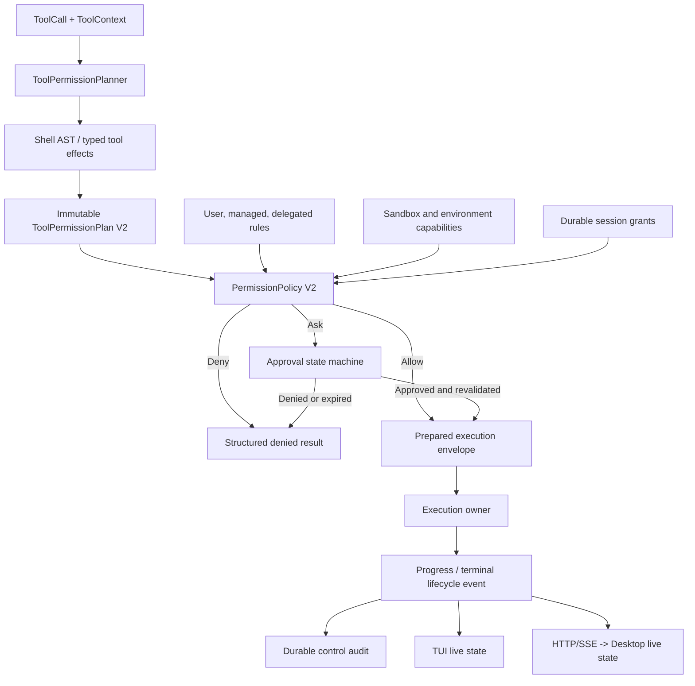
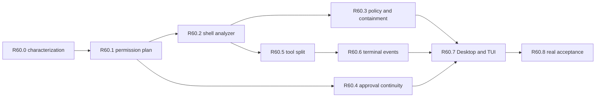

# RFC-0060 Structured Shell Risk, Approval Continuity and Terminal Execution V2

状态：implementation complete / local deterministic and source-built acceptance complete / external platform, provider-cost and release gates pending

> RFC-0071 implementation note (2026-08-25): shell and terminal execution now consume the current-schema permission/resource binding and typed sandbox admission. Backend selection, temporary roots and enforcement receipts are no longer inferred from cwd or ambient environment; the R71.8 candidate supplies the cross-platform qualification boundary.

创建日期：2026-08-01

依赖：

- [Rust agent core technical solution](../sigil-rust-agent-core-technical-solution.md)
- [RFC-0001 Durable Event Stream and Event Taxonomy](0001-durable-event-stream-and-event-taxonomy.md)
- [RFC-0002 Crash-consistent Mutation Protocol](0002-crash-consistent-mutation-protocol.md)
- [RFC-0003 Verification Contract and Workspace Snapshot](0003-verification-contract-and-workspace-snapshot.md)
- [RFC-0005 Execution Backend](0005-execution-backend.md)
- [RFC-0011 Crash Resume and Job Reconciliation](0011-crash-resume-and-job-reconciliation.md)
- [RFC-0012 Protocol/App-server Boundary](0012-protocol-app-server-boundary.md)
- [RFC-0013 Eval Harness](0013-eval-harness.md)
- [RFC-0035 TUI Orchestration Boundary Hardening V1](0035-tui-orchestration-boundary-hardening-v1.md)
- [RFC-0045 Desktop UI/UX Foundation V1](0045-desktop-ui-ux-foundation-v1.md)
- [RFC-0052 Desktop Conversation Continuity and Control V1](0052-desktop-conversation-continuity-and-control-v1.md)
- [RFC-0058 Event-driven Worker and Incremental Durable Session Projection V1](0058-event-driven-worker-and-incremental-durable-session-projection-v1.md)
- [RFC-0059 Durable Tool-result Artifacts V1](0059-durable-tool-result-artifacts-typed-retrieval-and-cache-stable-aging-v1.md)

## 1. Summary

Sigil 当前已经具备 Tree-sitter Bash parser、`PermissionPolicy`、路径 trust zone、会话级授权、
append-only approval/execution audit、macOS Seatbelt、Linux Bubblewrap、persistent terminal manager 和
event-driven worker。问题不在于缺少这些底座，而在于它们尚未形成一条统一、可解释、可恢复的执行链路：

1. Shell 首先被压缩成单一 `CommandFamily`。多个本可分别判断的子命令只要通过 `&&`、`||` 或 `;`
   组合，通常整体退化成 `Unknown`，继而被标记为 `HIGH / execute_unknown_command`。
2. `PermissionRisk` 同时承担安全解释和审批触发的角色，没有完整表达“命令本身可能做什么”与“当前
   sandbox 实际能限制什么”的差异。
3. `bash` 与 `terminal_start(mode=foreground)` 都能执行一次性命令；`terminal_start` 还会根据命令
   字符串猜测是否后台运行，模型容易选择 background 后重复读取状态。
4. approval command 已有 stale guard 和幂等 envelope，但 Desktop 对 command receipt 不做本地状态收敛，
   主要等待后续 live event；任一 event gap、竞态或 driver 延迟都可能让已经批准的卡片继续显示为等待。
5. terminal child 自身能够知道退出，但 TUI 仍用 deadline 触发 `terminal_read` 进行状态刷新；模型也没有
   一个“等待状态变化”的阻塞式工具，只能手动轮询。
6. session grant 仍以 tool、operation 和 subjects 为主，无法稳定表达“同一类 workspace validation、
   同一沙箱能力、同一路径域”的语义授权，因此有时只能批准一次，有时又可能过度依赖原始命令文本。

本 RFC 把这些问题收敛为同一条 V2 执行控制链：

```text
Tool call
  -> one immutable ToolPermissionPlan
  -> shell AST / tool-declared effects
  -> semantic effects + subjects + required containment
  -> monotone policy decision
  -> optional approval command state machine
  -> execution under the bound backend/profile/environment
  -> event-driven progress and terminal settlement
  -> durable audit + bounded Desktop/TUI projection
```

核心结论是：**风险标签不是审批决定，命令名不是安全边界，模型判断不是 enforcement。** 是否直接执行
必须由结构化副作用、目标资源、显式策略、session grant 和可证明的 OS containment 共同决定。

### 1.1 Implementation and validation status

截至 2026-08-01，R60.0-R60.8 的生产代码、测试、Desktop/TUI 产品表面、OpenAPI 和文档切换均已完成：

| Slice | 状态 | 已完成证据 |
| --- | --- | --- |
| R60.0 | complete | Shell bypass corpus、risk/decision matrix、approval/terminal characterization |
| R60.1 | complete | immutable `ToolPermissionPlanV2`、canonical hash、执行前精确重验、durable audit |
| R60.2 | complete | Tree-sitter Bash 递归分析、wrapper/redirection/dynamic facts、资源预算与 corpus |
| R60.3 | complete | effect/containment policy、hard safety overlay、session grant V2、headless fail-closed |
| R60.4 | complete | requested -> decision accepted -> resolved -> execution 的 durable/UI 收敛链 |
| R60.5 | complete | `bash` finite-only；`terminal_start` persistent-only；`terminal_wait` 与 generation guard |
| R60.6 | complete | terminal owner 主动发布 lifecycle；TUI steady-state terminal poll 已删除 |
| R60.7 | complete | Desktop/TUI 结构化 effects、exact approval receipt、恢复与终态一致性 |
| R60.8 | local acceptance complete; external release gates pending | source-built Desktop、real-binary TUI PTY、deterministic eval、macOS Seatbelt、full local gate、docs/site 已通过；Linux Bubblewrap 目标平台验收、付费 provider-backed model eval 和 beta 发布尚未执行 |

当前验证证据：

- `./scripts/check-touched.sh --tier full` 在最终工作区通过，其中包含
  `git diff --check`、Desktop full check、Rust check/test 和 clippy；
- `cargo fmt --all --check`、`cargo test -q` 和 `cargo clippy --all-targets -- -D warnings`
  在最终工作区全量通过；
- `pnpm --dir apps/desktop check` 通过 Desktop contract drift、UI system、TypeScript、269 个
  Vitest 用例和 production build；
- 当前源码构建的 Desktop + 真实 `sigil serve` Gherkin E2E 通过 59/59，不使用已安装旧包；其中覆盖
  persistent terminal ready、foreground final 后继续运行、旧 run task 与 successor 并存、renderer reload
  恢复、停止旧 task 和 later exit 收敛；
- TUI stateful PTY acceptance 和 orchestration PTY acceptance 均通过，二者都使用当前 `target/debug/sigil`
  与隔离的本地 fixture；
- `sigil-kernel` 1434 passed / 6 ignored、`sigil-tools-builtin` 234 passed / 1 ignored、
  `sigil-http` 193 passed、`sigil-runtime` 958 passed / 3 ignored、`sigil-tui` 1549 passed / 3 ignored；
- deterministic eval 产物写入 `.repo-local-dev/evals/rfc0060-final-refresh`；`check-docs.sh` 和
  `check-pages-site.sh` 通过；
- macOS Seatbelt 真实文件系统约束 conformance 通过；Shell permission-plan fuzz target 先通过
  `cargo check --locked --manifest-path fuzz/Cargo.toml --bin shell_permission_plan`，随后使用
  `cargo +nightly fuzz run shell_permission_plan -- -max_total_time=60 -timeout=5` 完成 61 秒限时变异：
  149,132 runs、0 crash、0 timeout，最终 `cov: 4274 / ft: 12359`；
- real-process loopback provider fixtures 在 macOS 上显式处理 accepted socket 的 blocking 状态和
  `Interrupted/WouldBlock/TimedOut`；两个曾经暴露 `os error 35` 的路径各连续 20 次通过，
  并重新纳入 full tier；
- 安全复核后补齐了执行前 canonical subject/trust-zone 重解析、有限 `bash` 对后台/持久语法的拒绝、approval
  V2 phase matrix，以及 terminal metadata 原子替换、generation CAS 和 durable-before-live lifecycle 发布；
- 产品复核后补齐了 Desktop typed terminal lifecycle/card/cancel/follower、Tauri allowlist、HTTP durable terminal
  cancel 去重、foreground-final 后的 SSE continuation，以及 provider-neutral output hash 规范化；
- 最终独立复核确认 `ToolPermissionPlanV2.effects` 是不可降级的风险与硬安全下限：删除副作用至少标记为
  destructive，动态执行、网络、进程、权限与远程副作用至少标记为 high，凭据访问始终 protected/deny；
  工具声明的弱标签和 MCP hint 不能降低 risk、snapshot 或 hard deny。2026-08-04 的产品语义收口明确：
  Manual/AutoEdit 继续把相应 effect floor 提升为 Ask，DangerFullAccess 将最终 local/network/source/external
  Ask facet 归一化为 Allow，但不能覆盖 managed/explicit Deny、disabled external-directory Deny、protected target
  或 circuit breaker；
- exact network session grant 已贯通到真实 tool execution context：首次审批可授权同一会话内的同一规范化网络
  subject，后续匹配调用不会再次弹窗，同时 executor 仍收到显式网络授权；不同 subject、scope 或 generation
  不复用授权；
- Desktop/HTTP approval lifecycle snapshot 现在保留 exact request identity 以及 resolving、decision accepted、
  resolved、execution-started 和 terminal 状态；renderer reload 或 live-event gap 后能够从权威快照关闭等待卡片，
  不再把“命令已接受”误显示为“仍等待批准”；
- Desktop follower 将 durable stream 中按协议脱敏为 kind-only 的 `tool_execution` control 视为合法通用
  control event，而不是 typed payload 损坏；仍对实际存在但 malformed 的 typed payload fail closed，因此不会再因
  正常脱敏事件反复重连并阻断后续 approval resolution、tool result 或 run terminal replay；
- Desktop continuity 只有在权威 foreground-owner 证明确立 exact `A -> B` successor 关系时，才允许新 run
  替换仍在等待终态结算的旧 run；旧 run 的迟到 terminal/approval 事件继续收敛，任意无接力证据的跨 run
  terminal fact 仍进入 `terminal_conflict`。E2E composer readiness 同时等待 continuity lifecycle 真正进入
  `idle/live`，不再把“输入框可编辑但 submit 被 continuity guard 忽略”误判为可发送；
- Desktop terminal 投影只淘汰有终态的历史卡片，任意数量的 active terminal 均保留；TUI terminal cancel 绑定
  `session_scope_id + run_id + task_id + expected_generation` 和进程内 live owner，即使已有 successor run，仍能
  精确取消旧 task，且不会依赖 summary 或轮询重建 owner；
- permission policy 将 Sigil-owned、generation-bound 且执行时重验 session owner 的 terminal cancel/resize
  限定为 Medium/Allow safety floor；任意 OS process control、terminal input、persistent start 仍保持 High/Ask。
  该边界由真实 TUI orchestration PTY 暴露并通过 kernel policy test 与 PTY 重跑验证，避免清理 Sigil 自己创建
  的终端任务再次触发无意义审批，同时不放宽任意进程控制；
- HTTP 的 public run event sequence 由一个串行 durable allocator 统一分配；approval routing 在事件发布前注册，
  不在 event-bus publication lock 内反向获取 registry lock，因此 foreground、approval 与 terminal lifecycle
  并发时既不会复用 sequence，也不会形成锁顺序反转；
- SSE 使用单一有序 `Event | StreamClosed` broadcast；terminal event 与 close marker 在同一 publication lock
  内按序发布，close 不得越过已排队 event。durable terminal reconciliation 失败保持 retryable，并由 production
  helper bounded retry，而不是把“live 已发布、durable 未落盘”错误伪装成完成；
- SSE bus 对大型 protocol event 使用间接存储，避免 close marker 等小型控制消息按最大 event variant 分配；
  Desktop stop/status 始终读取 exact lifecycle generation，而不是可能滞后的 summary generation；
- 真实 TUI 首次配置 acceptance 等待主界面 `sigil ready.` 后再发送后续按键，避免配置文件已落盘但 model
  picker 尚未关闭时产生输入竞态；planner discovery 的测试 deadline 仅作为 deadlock guard，不作为产品延迟
  断言，是否“无轮询恢复”由 provider turn 与 durable lifecycle 断言证明；
- 未在 macOS 本机伪造 Linux Bubblewrap 结果；必须由 `.github/workflows/sandbox-conformance.yml`
  在兼容 Linux host 上运行 ignored real-conformance test；
- 未执行会消耗真实账号额度的 provider-backed model eval；该项、目标平台验收和
  beta 发布仍是显式 release gate，不能由 mock、fixture、本机跨平台推断或已安装包替代。

## 2. Scope

### 2.1 Included

- POSIX Shell AST 解析、复合命令递归分类、重定向和 wrapper 处理；
- generic tool effect / containment contract；
- command semantic registry 和已知命令族；
- `Allow / Ask / Deny` 决策顺序、risk explanation 和 hard safety overlay；
- 当前 permission mode、command rule、external-directory、delegated policy 和 session grant 的 V2 收敛；
- approval request、command acknowledgement、resolution、execution-start 和 UI 状态闭环；
- `bash` 与 `terminal_start` 的职责拆分；
- background/interactive terminal 的 event-driven lifecycle、readiness 和 wait；
- TUI、Desktop、HTTP/OpenAPI 和 durable control log 的一致语义；
- macOS/Linux/Windows 的 fail-closed 能力矩阵；
- deterministic、property、fuzz、contract、Desktop interaction、TUI 和真实二进制验收。

### 2.2 Explicitly not included

- provider/model 在同一会话切换；
- session 删除、catalog、continuity、compaction 或 tool-result artifact 的其他问题；
- 用 LLM 替代 deterministic policy engine；
- 在首版引入 Cedar、OPA 或一个常驻策略服务；
- 把 MCP server、plugin、remote execution 宣称为受本地 shell sandbox 保护；
- 自动重放 crash 前未完成的 shell/terminal side effect；
- 原生 Windows Shell 的宽松自动放行；在完成独立 parser/enforcement 前保持保守策略；
- 兼容旧 permission/session schema 的 migration、alias 或 fallback reader。

## 3. Current baseline and confirmed failures

### 3.1 Shell classification collapses a command tree into one family

当前 `crates/sigil-tools-builtin/src/shell.rs` 的 `classify_shell_command_family` 会先用 token helper 按
`&&`、`||`、`;` 拆段。除 `ListRead && echo EXIT=$?` 特例外，只要 segment 数不是 1 就返回
`CommandFamily::Unknown`。

因此下面这条验证链：

```bash
set -o pipefail
cargo fmt --all --check &&
cargo check &&
cargo test &&
cargo clippy --all-targets -- -D warnings
```

不会形成四个可独立判断的 command node，而是整体变成：

```text
ToolAccess::Execute
ToolOperation::ExecuteUnknownCommand
PermissionRisk::High
```

其中 `cargo clippy` 甚至不在现有 `CommandFamily` 中。Tree-sitter 当前只用于判断一部分“是否具备受支持
的只读结构”，还不是分类与 subject/effect 提取的 canonical source。

### 3.2 Permission metadata is computed through multiple parsing calls

`Tool` 当前分别暴露 `permission_subjects`、`permission_access`、`permission_operation` 和 network/default
mode 查询。Shell tool 在一次调用的准备与审批重验中可能多次解析同一命令，各次 helper 还可能选择不同
的降级分支。

V2 必须一次产生 immutable permission plan。policy、preview、approval hash、execution audit 和执行前重验
只能消费同一个 plan 或重新生成并比较 plan hash，不能各自重新猜测。

### 3.3 Risk and approval are coupled too tightly

当前 `derive_permission_risk_with_network_effect` 大致按以下顺序处理：

- protected path write -> `Protected`；
- delete/mutating/destructive -> `Destructive`；
- unknown command / terminal input -> `High`；
- workspace check -> `Medium`；
- 其余按 Read/Write/Execute 得到 Low/Medium/High。

这个标签适合 UI，但不足以单独回答是否应审批：

- `cargo test` 是中风险，因为它能运行 `build.rs`、proc macro、test binary 和仓库代码；
- 在最小环境、禁止网络且只能写 workspace build/scratch 的强制沙箱中，它可以无需逐次询问；
- 在当前 macOS backend 无法证明 network isolation 时，同一命令不能仅凭名称自动放行；
- `cat` 通常低风险，但读取 credential zone 仍必须被拒绝或询问。

### 3.4 Execution tool responsibilities overlap

当前：

- `bash` 执行 non-interactive、foreground、有总 timeout 的命令；
- `terminal_start` 支持 foreground、background 和 interactive；
- `terminal_start` 在 mode 缺省时根据 `watch`、`tail -f`、dev server、package-manager script 等字符串
  猜测 background；
- foreground terminal 与 `bash` 的功能重叠；background 返回 handle 后，模型通常需要继续调用
  `terminal_read` 才知道状态变化。

这种表面让模型需要同时选择“运行什么”和“内部生命周期实现”，容易把有限验证任务放到后台，再用多轮
tool call 轮询，增加时延、token 和审批噪音。

### 3.5 Approval transport acknowledgement is not a complete UI transition

HTTP registry 已有：

- `approval_request_id`；
- `tool_call_hash`；
- `policy_version`；
- `expires_at_ms`（当前交互式工具审批使用 no-expiry sentinel，仅保留 V2 wire 兼容）；
- command envelope 幂等和 stale protection；
- pending -> in-flight -> resolved 的 server-side route。

但 Desktop `decideApproval` 当前只等待 `bridge.resolveApproval(...)` 成功，不消费 receipt 来关闭 exact
pending approval；它主要依赖后续 SSE `approval_resolved`。如果 resolution event 到达延迟、丢失、与
reconnect/refresh 竞争，页面仍可能显示旧的 waiting card。TUI 的 local channel 也缺少统一的 command
acknowledgement projection。

### 3.6 Terminal settlement still has polling edges

terminal manager 内部 worker 在 child exit 时已经更新 `TerminalTaskEntry`，但 TUI scheduler 仍在达到
`next_terminal_task_refresh_at` 后调用 `terminal_read` 刷新 active task。RFC-0058 删除了通用 50ms 热轮询，
但 terminal completion 仍是 timer-triggered status discovery，而不是由 task owner 主动发布 lifecycle event。

这和模型侧重复调用 `terminal_read` 是同一个抽象缺口：消费者只能“反复问”，没有 generation-aware 的
“等到发生变化”。

## 4. Competitor research and adopted conclusions

### 4.1 OpenAI Codex

Codex 把 Shell 结构解析、安全命令识别、显式 exec policy、approval policy 和 OS sandbox 分开。
复合命令只有在每个可解析子命令都满足策略时才能整体放行；Git、`find`、`rg` 等会对危险参数做专门处理。
官方文档也明确把 sandbox 定义为“技术上最多能做什么”，把 approval 定义为“什么时候必须询问”，并在
默认本地模式下限制 workspace write 和 network。

参考：

- [OpenAI Codex Agent approvals and security](https://developers.openai.com/codex/agent-approvals-security)
- [openai/codex shell-command](https://github.com/openai/codex/tree/main/codex-rs/shell-command)
- [openai/codex execpolicy](https://github.com/openai/codex/tree/main/codex-rs/execpolicy)

采用：结构解析、策略、沙箱三层分离；compound 取最严格结果；显式 deny 和 protected path 不被普通
auto-allow 覆盖。

不采用：把 Codex 内部 crate 直接作为 Sigil dependency。其类型和 release cadence 与 Sigil kernel
边界耦合，复制设计与测试 corpus 比直接依赖更稳定。

### 4.2 Claude Code

Claude Code 识别 `&&`、`||`、`;`、pipeline、background 和 newline，每个子命令独立匹配。它还剥离
固定 wrapper，对 `find -exec/-delete`、可能执行 pager 的 Git 选项和 glob/flag ambiguity 做额外处理。
启用 sandbox auto-allow 时，受 containment 约束的 Bash 可以不询问，但显式 ask/deny 和关键删除保护
继续生效。

参考：

- [Claude Code permissions](https://code.claude.com/docs/en/permissions)
- [Claude Code sandboxing](https://code.claude.com/docs/en/sandboxing)

采用：wrapper 递归分析、每个 compound node 独立决定、session grant 保存子命令语义、sandbox 只能替代
mode default ask，不能覆盖显式 ask/deny。

不采用：把宽泛 raw wildcard 当作可靠的 URL、远端资源或动态 shell 安全边界。

### 4.3 Gemini CLI

Gemini CLI 的 policy engine 提供 `allow / deny / ask_user`、优先级、policy tier、mode 条件和 Shell rule
shorthand；无交互场景中的 `ask_user` 等价于 deny。它的强项是显式策略和来源优先级，而不是通用 Shell
副作用推断。

参考：

- [Gemini CLI policy engine](https://geminicli.com/docs/reference/policy-engine/)
- [Gemini CLI shell tool](https://geminicli.com/docs/tools/shell/)

采用：来源明确的规则优先级、headless ask -> deny、解析失败 fail closed、同一计划中最严格决定获胜。

不采用：仅通过 command prefix/regex 决定安全性。

### 4.4 OpenCode, Goose and Crush

OpenCode 的 tool/pattern permission 与 session `always` UX 简单，但安全边界较依赖配置和 best-effort
command pattern。Goose 会利用 MCP annotations，并可用 LLM 判断未知工具是否 read-only；Crush 主要以
tool/action/path 保存 session grant。

参考：

- [OpenCode permissions](https://opencode.ai/docs/permissions)

采用：简单的 Allow once / Allow session / Deny 产品表面；未知 MCP annotation 可以作为输入信号。

不采用：默认全部允许、tool-name 级 LLM 判断缓存、raw command text 作为唯一 grant identity。LLM reviewer
只能降低一部分用户审批噪音，不能覆盖 deterministic deny 或 sandbox failure。

### 4.5 Research snapshot and evidence boundary

互联网资料以 2026-08-01 可访问的官方文档为准；本地竞品代码使用
`/Users/jimmydaddy/study/sigil-competitor-repos` 中的固定快照复核实现细节：

| Product | Local commit | Reviewed implementation evidence |
| --- | --- | --- |
| OpenAI Codex | `4808c162eeb7` | `codex-rs/shell-command` safe/dangerous corpus、`codex-rs/execpolicy` decision |
| Claude Code | `01f1617f1445` | 公共仓库不含完整 runtime；compound/wrapper/sandbox 结论以官方 permissions/sandboxing 文档为主 |
| OpenCode | `884c25603395` | permission asked/reply/always lifecycle、agent permission inheritance 与 raw resource matching |
| Goose | `fe7f16b727fa` | MCP annotation、`permission_judge.rs` 的 LLM read-only detector 与 fail-conservative 路径 |
| Gemini CLI | `ae0a3aa7b928` | policy tier、priority、interactive/headless decision 和 shell rule plumbing |
| Crush | `d8fc48a03c36` | `internal/permission` 的 one-shot/persistent grant、race-safe resolve 和 session key |

这些产品采用的抽象并不等价：Codex/Claude Code 更强调 sandbox 与 approval 分层，Gemini CLI 更强调规则
优先级，OpenCode/Crush 更偏 tool/action/resource grant，Goose 还允许模型辅助判断未知工具。RFC 只吸收能由
Sigil deterministic plan、OS containment receipt 和 durable lifecycle 共同证明的部分；竞品 UX 或 heuristic
不自动成为本项目的安全事实。

## 5. Design principles and invariants

1. **Parse before policy**：Shell text 不直接进入 allow/ask/deny matcher。
2. **One plan per call**：subjects、effects、preview、hash、approval 和 execution audit 来自同一 immutable
   plan。
3. **Effects before labels**：先保存可验证的 effect facts，再派生 Low/Medium/High/Destructive/Protected。
4. **Containment is evidence**：只有 backend receipt 能证明的 capability 才参与自动放行。
5. **Deny is monotone**：hard safety、managed deny、delegated deny、explicit deny 不能被 session grant、
   auto mode 或 LLM reviewer 放宽。
6. **Explicit ask remains ask**：sandbox substitution 只能替代 permission mode 的默认 whole-shell Ask；不能
   覆盖针对 `git push`、外部路径、network 或特定 command family 的显式 Ask。
7. **Unknown is not destructive**：未知命令默认 Ask，而不是错误地标为 Destructive；headless 中 Ask -> Deny。
8. **Dynamic is not safe**：parse error、unsupported dialect、无法解析的 expansion/wrapper/target 不能进入
   builtin safe allow。
9. **Compound uses a lattice**：所有 node 的 effects 求并集，decision 取最严格结果，不因 segment 数量
   自动变 Unknown。
10. **Approval authority is exact**：request id、plan hash、policy version、sandbox profile、environment
    profile、expiry 任一变化都使旧批准失效。
11. **Session grant is semantic and bounded**：不保存“允许 bash”或“允许 cargo *”。
12. **Foreground by default**：预计会退出的任务同步等待一个结果；background 必须是显式持久/交互意图。
13. **No polling as workflow**：模型等待 task change 使用一次 `terminal_wait`；产品 runtime 使用 lifecycle
    event，不反复调用 status tool。
14. **One terminal owner**：spawn、input、resize、wait、cancel、cleanup 和 terminal event 都归同一个 task
    owner，不能创建 detached worker。
15. **UI follows authority**：active approval/tool/terminal 使用 live registry/event truth，不使用 SQLite
    catalog 或可能滞后的历史 projection 作决定。
16. **No secret/raw command telemetry**：产品 telemetry 只记录 family、decision reason、capability 和 bounded
    counters；原始 command/path 只在本地受保护 audit 中保存 policy-safe 表示。

## 6. Target architecture



crate ownership：

| Layer | Responsibility |
| --- | --- |
| `sigil-kernel` | generic effects、permission plan、decision reason、grant identity、approval/execution lifecycle |
| `sigil-tools-builtin` | POSIX AST、command semantic registry、Shell/terminal tool planning、terminal process event source |
| `sigil-process` / execution backend | process-tree ownership、environment shaping、sandbox capability 和 receipt |
| `sigil-runtime` | tool registry planner 调用、backend/profile 装配、terminal lifecycle observer、cross-surface helper |
| `sigil-http` | guarded approval command、live run state、SSE/OpenAPI、gap recovery |
| `sigil-tui` | worker inbox、approval command receipt、terminal event、TUI projection |
| `sigil-desktop` / Tauri | typed local client 和 allowlisted IPC；不获得 shell/process/path authority |
| `apps/desktop` | exact live reducer、approval/composer/tool/terminal presentation |

## 7. Core permission plan

### 7.1 Generic kernel types

新增 provider-neutral plan；Shell AST 自身不进入 kernel：

```rust
pub struct ToolPermissionPlanV2 {
    pub schema_version: u32,
    pub tool_name: String,
    pub access: ToolAccess,
    pub operation: ToolOperation,
    pub effects: BTreeSet<ToolEffect>,
    pub subjects: Vec<ToolSubject>,
    pub analysis: ToolAnalysisStatus,
    pub containment: ExecutionContainmentRequest,
    pub semantic_scope: Option<ToolSemanticScope>,
    pub plan_hash: String,
    pub safe_summary: ToolPermissionSummary,
}

pub enum ToolEffect {
    FileRead,
    FileWrite,
    FileDelete,
    ExecuteTrustedBinary,
    ExecuteWorkspaceCode,
    ExecuteDynamicCode,
    NetworkRead,
    NetworkMutate,
    NetworkUnknown,
    AgentLifecycle,
    ProcessControl,
    PrivilegeEscalation,
    PersistenceChange,
    RemoteMutation,
    CredentialAccess,
    ExternalApplicationControl,
    Unknown,
}

pub enum ToolAnalysisStatus {
    Complete,
    Conservative { reasons: Vec<ToolAnalysisReason> },
    Unsupported { reason: ToolAnalysisReason },
    Invalid { reason: ToolAnalysisReason },
}

pub struct ExecutionContainmentRequest {
    pub filesystem: FilesystemContainment,
    pub network: NetworkContainment,
    pub process: ProcessContainment,
    pub environment: EnvironmentContainment,
    pub persistent_process: bool,
}
```

`ToolEffect` 是工具通用概念，不能包含 Cargo、Git、Bash 或 provider 专属字段。Shell-specific family 和
flag facts 留在 `sigil-tools-builtin`，只通过 `semantic_scope` 的稳定中立 label 和 generic effects 投影。

### 7.2 One registry call

`Tool` 增加：

```rust
fn permission_plan(&self, ctx: &ToolContext, call: &ToolCall)
    -> Result<ToolPermissionPlanV2>;
```

过渡实现可以由默认 adapter 调用旧四个 permission method，但 Shell、terminal、MCP 和 mutation tool 必须
直接产生 V2 plan。R60 clean cutover 后删除旧的多 method decision path，避免同一 call 多次分析漂移。

执行前生成 `PreparedToolExecution`：

```rust
pub struct PreparedToolExecution {
    pub call: ToolCall,
    pub plan: ToolPermissionPlanV2,
    pub policy_fingerprint: String,
    pub backend_binding: ExecutionBackendBinding,
    pub approval_binding: Option<ApprovalBinding>,
}
```

它按值消费，只能执行一次。call args、plan hash、policy、backend/profile 或 environment binding 漂移时，在
首个 forward effect 前 fail closed。

### 7.3 Hash contract

`plan_hash` 至少绑定：

- tool name 和 canonical args；
- shell dialect；
- normalized AST；
- command semantic spec version；
- effects、subjects、zones、overlays；
- semantic scope；
- requested containment；
- workspace identity/revision 中与目标解析相关的部分；
- resolved shell program identity；
- policy-safe environment binding names，不包含 secret value。

hash 使用 deterministic canonical encoding。UI 不自行计算。

## 8. Shell AST and semantic analysis

### 8.1 Canonical parser

POSIX V1 继续使用仓库已有的 `tree-sitter = 0.26.9` 和 `tree-sitter-bash = 0.25.1`。不引入第二个 Bash
parser。parser 必须完整遍历 root，并拒绝带 error/missing node 的 AST 进入 Complete。

内部 IR：

```rust
enum ShellNode {
    Sequence { operator: SequenceOperator, children: Vec<ShellNode> },
    Pipeline { children: Vec<ShellNode> },
    Simple(SimpleCommand),
    Subshell(Box<ShellNode>),
    Background(Box<ShellNode>),
    Dynamic(DynamicShellConstruct),
}

struct SimpleCommand {
    assignments: Vec<ShellAssignment>,
    words: Vec<ShellWord>,
    redirects: Vec<ShellRedirect>,
}
```

`&&`、`||`、`;`、newline、pipeline 只表达控制关系；它们本身不使计划变 Unknown。background operator
增加 `persistent_process=true` 和 lifecycle effect。

### 8.2 Static and dynamic words

静态 literal、quoted literal 可以进入 command semantic analyzer。以下情况标记 Conservative 或
Unsupported，并默认 Ask：

- command substitution、backtick；
- process substitution；
- `eval`；
- 影响 command name/flag/target 的普通环境变量展开；
- arithmetic expansion；
- function definition/call；
- unresolved alias；
- glob 可能扩展为 option；
- nested shell 无法取得静态 `-c` payload；
- unsupported heredoc expansion；
- parser error 或 AST node budget 超限。

允许少量 runtime symbolic value：

| Symbol | Resolved subject |
| --- | --- |
| `$PWD` | current canonical workspace cwd |
| `$SIGIL_SCRATCH_DIR` | runtime-provided bounded scratch zone |
| sandbox-owned `$TMPDIR` | current sandbox scratch zone |

其他变量不能靠字符串猜测路径。

### 8.3 Redirections

redirection 必须作为 effect，不再被 token helper 忽略：

| Form | Effect |
| --- | --- |
| `< file` | FileRead(target) |
| `> file`, `>> file`, `>| file` | FileWrite(target) |
| `2>&1` | fd topology only |
| heredoc | static input or Dynamic |
| here-string | static input or Dynamic |

重定向 target 按 canonical path、symlink chain 和 trust zone 分类。命令主体只读不代表带输出重定向后仍
只读。

### 8.4 Wrapper recursion

内置 wrapper registry 首版覆盖：

- `command`、`builtin`；
- `env` 与 leading assignments；
- `timeout`、`time`、`nice`、`nohup`、`stdbuf`；
- `sh -c`、`bash -c`、`zsh -c` 的静态 payload 递归解析；
- `sudo`、`doas` 直接增加 PrivilegeEscalation；
- `xargs`、`find -exec` 只在 inner command 完整可解析时递归，否则 Ask；
- `watch`、`setsid`、`flock` 等增加 lifecycle/process effect，不通过 prefix 自动放行。

wrapper depth、AST node 数、command byte 和 recursion 均有 hard cap。超限返回 structured
`analysis_limit_exceeded`，不得 panic 或部分放行。

## 9. Command semantic registry

### 9.1 Registry contract

AST 只能说明 Shell 结构，不能知道 `git -c core.pager=... diff`、`find -delete` 或 `rg --pre` 的业务
含义。新增 versioned `CommandSemanticRegistry`：

```rust
trait CommandSemanticAnalyzer {
    fn analyze(&self, command: &ResolvedSimpleCommand)
        -> CommandSemanticResult;
}
```

每个 analyzer 声明：

- program identity / accepted aliases；
- subcommand grammar；
- flag 的 effect 和 operand role；
- path operand 的 base/canonicalization 规则；
- 是否会执行 workspace code；
- network/remote/process/persistence 影响；
- semantic scope 和 session-grant shape；
- allowed redirection/glob behavior；
- positive、mutating、dynamic 和 bypass regression corpus。

未知 program 不按名称猜测 read-only，产生 `Unknown` effect 和 Ask。

### 9.2 Initial analyzers

首个 cutover 必须覆盖：

| Family | Required distinctions |
| --- | --- |
| basic read | `ls/cat/head/tail/wc/stat/du/file/readlink/realpath/basename/dirname/diff/cmp/pwd` |
| search | `grep/rg/find`；识别 `rg --pre/-z`、`find -exec/-delete/-fprint` 等 |
| Git read | `status/log/diff/show/branch --list`；识别 pager/ext-diff/textconv/config/remote mutation |
| Cargo validation | `fmt --check` 与 `check/test/clippy` 分开；后者标记 ExecuteWorkspaceCode |
| repo validation | `scripts/check-touched.sh --tier quick|standard|full`，绑定 script digest/revision |
| package manager | install/update/publish、lifecycle script、network 和 workspace script |
| filesystem mutation | `mkdir/touch/cp/mv/rm/rmdir/install/chmod/chown` |
| network transfer | `curl/wget/ssh/scp/rsync`，URL/host 不靠 raw wildcard 证明 |
| remote control | `git push`、`gh` mutation、`kubectl`、`terraform`、cloud CLI |
| containers | Docker/Podman daemon target、mount、privileged、remote context |
| process control | `kill/pkill/killall/launchctl/systemctl` |
| external app | `open/osascript/xdg-open/start` |

### 9.3 Workspace validation is not read-only

固定分类：

- `cargo fmt --check`：不执行 workspace build/test code，通常 Low；
- `cargo check/test/clippy`：`ExecuteWorkspaceCode`，至少 Medium；
- `npm test`、`pnpm test`、`make test`、repo-local check script：同样是 workspace code execution；
- package install：network + supply-chain + lifecycle script，High；
- test command 是否自动执行由 containment 决定，不能把它伪装成 Read。

复合 validation chain 产生一个 parent plan 和多个 child facts。parent risk 取最大值，approval preview 展示
“4 个步骤，其中 3 个执行项目代码”，而不是 `execute_unknown_command`。

### 9.4 Built-in, MCP, skill and plugin tools

同一 generic plan 也约束非 Shell tool：

- typed built-in tool 直接声明 effects 和 subjects，不经过命令字符串识别；
- MCP `readOnlyHint`、`destructiveHint`、`idempotentHint` 和 `openWorldHint` 只是 server-provided hint；只有
  trust policy 允许时才作为 analyzer input，不能单独产生 Allow；
- annotation 缺失、矛盾或来自 untrusted server 时使用 MCP trust/default policy，并对副作用未知的调用 Ask；
- skill/agent 只是编排来源，不能改变其内部每个 tool call 的 permission plan；
- plugin hook、external MCP process 和 remote service 使用各自 execution coverage，不能继承 local shell
  sandbox 的 containment receipt；
- delegated agent policy 只能缩窄 parent policy，不能通过换 tool name 或 source agent 绕过 Deny/Ask。

因此 R60 首个完整实现以 Shell 为重点，但不会再建立一套只能由 `bash` 消费、其他工具无法复用的风险
模型。

## 10. Effects, risk and decision lattice

### 10.1 Risk is presentation

风险标签从 facts 派生：

| Risk | Typical facts |
| --- | --- |
| Low | bounded workspace read、static harmless metadata |
| Medium | workspace write、workspace code execution under requested containment |
| High | dynamic code、network、external path、process control、remote mutation、uncontained execution |
| Destructive | delete/overwrite/irreversible local or remote mutation |
| Protected | credential、Sigil runtime state、Git control metadata、home/system critical target |

不得把多个数值相加得到安全决定。一个 Protected facet 必须单独保留，不能被其他低风险项平均掉。

### 10.2 Decision sources

每个 decision 保存来源：

```rust
pub enum PermissionDecisionSource {
    HardSafety,
    ManagedRule,
    DelegatedRule,
    UserRule,
    SessionGrant,
    SandboxSubstitution,
    PermissionModeDefault,
    ToolDefault,
}
```

最终输出：

```rust
pub struct PermissionDecisionV2 {
    pub action: ApprovalMode,
    pub risk: PermissionRisk,
    pub reasons: Vec<PermissionDecisionReason>,
    pub matched_rules: Vec<PermissionRuleMatch>,
    pub effective_containment: ExecutionContainmentReceipt,
    pub session_grant_offer: Option<SessionGrantOffer>,
}
```

### 10.3 Evaluation order

严格顺序：

1. args/schema、AST、path canonicalization 和 semantic plan validation；
2. root/home/system destructive circuit breaker 和 protected target hard safety；
3. managed、parent/delegated 和 explicit deny；
4. explicit content/path/network Ask；
5. exact user allow 和 still-valid session grant；
6. sandbox substitution：仅当 requested containment 被 backend/profile/environment 全部证明；
7. permission mode default；
8. tool default；
9. local、network、source、external-directory facets 按 `Deny > Ask > Allow` 合并；
10. interactive 返回 Ask，headless 将 Ask 映射为 Deny。

plan 是 Conservative/Unsupported 时，builtin heuristic、raw wildcard 和 sandbox substitution 不能产生
Allow；只有显式的 exact semantic user/managed rule 可授权，并仍受 hard deny 与 backend capability 限制。

### 10.4 Default matrix

| Operation | Complete analysis + sufficient containment | Uncontained / insufficient capability |
| --- | --- | --- |
| workspace read | Allow | Allow，除非 sensitive/protected |
| Git read-only | Allow | Allow，危险 flag 则 Ask |
| `cargo fmt --check` | Allow | Allow/Ask 由 mode；不伪装 network safe |
| workspace validation | AutoEdit 下 Allow | Ask；session semantic grant 可减少重复询问 |
| workspace edit via typed tool | AutoEdit 下 Allow | Manual Ask，ReadOnly Deny |
| workspace mutating shell | Ask；未来可限定 semantic allow | Ask |
| package install/network | explicit policy/domain 后才 Allow | Ask |
| `git commit` | Manual Ask；可 bounded session grant | Ask |
| push/deploy/remote mutation | Ask per target | Ask，headless Deny |
| generated/scratch delete | policy 可 Allow | Ask |
| exact Sigil-owned terminal cancel/resize | Allow；重验 scope/run/task/generation owner | Deny/typed stale，不降级为任意进程控制 |
| arbitrary OS process control / terminal input | Ask | Ask，headless Deny |
| source/external delete | Ask + snapshot/type confirmation | Ask |
| credential/system/Sigil state mutation | Deny | Deny |
| dynamic/parse failure | explicit exact rule，否则 Ask | Ask/Deny |
| `sudo`/`eval`/`curl \| sh` | exact one-time Ask 或 Deny | Ask/Deny |

`DangerFullAccess` 可以跳过普通 Ask，但不能覆盖 hard safety 和 managed deny。若未来需要真正绕过 circuit
breaker，必须是独立、非模型可发起的启动参数，不复用普通 permission mode。

## 11. Sandbox and execution environment binding

### 11.1 Required capability proof

自动批准一个可能执行 workspace code 的命令，至少要求：

- filesystem isolation：写入只限 workspace allowed zones 和 Sigil scratch；
- process isolation / process-tree ownership；
- network policy 与 plan 一致；untrusted workspace code 默认要求 proven network deny；
- bounded stdout/stderr、time、memory、process count；
- restricted environment，不向项目代码暴露不必要 credential；
- backend/profile identity 写入 plan、approval 和 execution receipt。

当前 RFC-0005 已明确 macOS Seatbelt backend 不声明 `network_isolation`。R60 不能靠命令 family 绕过该
事实。在 network deny 可被证明前，macOS 上的 `cargo test/check/clippy` 仍需显式用户/session authority，
或者选择满足 `build_offline` 的 backend。减少审批不能通过虚报 containment 实现。

### 11.2 Environment profiles

新增：

```rust
pub enum ExecutionEnvironmentProfile {
    ReadOnlyInspection,
    WorkspaceValidation,
    WorkspaceDevelopment,
    UserInherited,
}
```

自动路径只使用前三种受控 profile：

- non-login shell；
- 清理 `BASH_ENV`、`ENV`、`PROMPT_COMMAND`、function export、危险 Git pager/config 等注入面；
- PATH 使用 runtime 解析后的 bounded dev-tool path，记录 executable identity；
- 只注入允许的 locale、toolchain、workspace 和 scratch 变量；
- credential 名称和值不进入 workspace code profile；
- `$SIGIL_SCRATCH_DIR` 和 sandbox `$TMPDIR` 明确绑定。

需要完整用户环境的命令使用 `UserInherited`，自动提升为 Ask，approval preview 显示“继承用户环境”。

### 11.3 Sandbox failure

- requested sandbox 创建失败：fail closed；
- 允许 `fallback=prompt` 时，产生新的 unsandboxed approval request，不能复用 sandboxed approval；
- backend/profile/environment hash 改变：旧 approval/session grant 不匹配；
- sandbox denial 不自动解释成工具失败；结构化返回 missing capability 和修复路径；
- 任何 automatic unsandboxed retry 禁止。

## 12. Permission rules and session grants

### 12.1 Raw command patterns

现有 `permission.commands.allow/ask/deny` wildcard 不能继续作为完整安全语义。V2 中：

- raw pattern 可以作为 user intent rule；
- deny/ask 可以对任意 matching command 收紧；
- allow 只有在 AST Complete、semantic analyzer recognized、subjects resolved 且 containment satisfied 时才
  能放行；
- raw allow 不能授权 dynamic shell、protected target、privilege escalation 或 unknown remote target；
- UI/doctor 明确显示 pattern 只是一条 policy rule，不是 sandbox。

后续可增加 structural TOML rule，但不为首版引入 Cedar/OPA：

```toml
[[permission.command_rules]]
id = "workspace-validation"
family = "workspace_validation"
decision = "allow"
path_scope = "workspace"
sandbox_profile = "build_offline"
network = "deny"
```

### 12.2 Semantic grant identity

`Allow session` 保存：

当前 `workspace_validation` 使用 semantic scope version 2：其 durable identity 绑定可执行的
validation core 与参数，忽略 `tail` / `head` / `grep` 等纯展示管道；version 1 的 exact-AST grant
不会被静默扩大，升级后最多重新批准一次以生成新 scope。

```rust
pub struct ToolApprovalSessionGrantV2 {
    pub grant_id: String,
    pub source_call_id: String,
    pub tool_name: String,
    pub semantic_scope: ToolSemanticScope,
    pub effect_ceiling: BTreeSet<ToolEffect>,
    pub subject_scope: SessionGrantSubjectScope,
    pub containment_binding: ExecutionContainmentBinding,
    pub policy_version: String,
    pub expires: ToolApprovalSessionGrantExpiry,
    pub granted_at_ms: u64,
}
```

允许的 scope 示例：

- `workspace_read_only_shell`；
- `workspace_validation:cargo_check`；
- `workspace_validation:cargo_test`；
- `workspace_validation:cargo_clippy`；
- `workspace_script:scripts/check-touched.sh:tier=standard:digest=...`；
- `exact_command_ast:<hash>`。

可识别 workspace validation 的 grant identity 绑定 primary validation segments 和真实 validation
arguments，但不把 `tail`、`head`、`grep` 等只读输出 filter 或安全 fd redirection 计入复用 key；完整
Shell AST 与原始参数仍进入每次 concrete permission plan hash，并在 forward effect 前重新校验。因此
`cargo check | tail -60` 与 `cargo check | tail -80` 可在同一 durable session 复用 grant，而
`cargo check --workspace` 与 `cargo check --all-targets` 不复用。

### 12.3 Grant availability

可以提供 Allow session：

- Complete、recognized plan；
- Low/Medium；
- workspace/read-only external subjects；
- stable semantic scope；
- containment binding 可重验；
- 无 type-path/type-phrase confirmation；
- 无 remote mutation、privilege escalation、credential access 或 dynamic code。

只提供 Allow once：

- exact High risk，但用户可以合法执行；
- external write/delete；
- network mutation；
- remote target；
- inherited user environment；
- unknown command 的 exact AST/text hash。

直接不提供批准：

- hard safety/protected deny；
- stale plan；
- invalid/expired approval；
- backend 不能满足不可降级的 required containment。

compound command 的 session grant 按 child semantic scope 保存，最多 bounded 数量；不能保存整个任意原始
字符串前缀。后续 chain 只有全部 child 都命中 grant 才直接执行。

## 13. Tool surface convergence

### 13.1 `bash`: finite foreground execution

保留 model-visible 名称 `bash`，避免在本 RFC 同时进行无收益的全仓 tool rename；产品展示统一为 Shell，
metadata 显示实际 dialect/program。

`bash` V2 contract：

- 只执行预计会退出的 non-interactive command；
- 返回一个最终 `ToolResult`；
- timeout、cancel、resource limit 和 output artifact 走现有 execution backend；
- 可以产生 bounded progress event，但模型只收到最终结果；
- 不接受 `background=true` 或 PTY input；
- finite test/build/check 一律使用它；
- provider tool description 明确禁止用 `terminal_start` 替代一次性验证。

### 13.2 `terminal_start`: persistent or interactive task only

删除 `mode=foreground`，删除“根据命令名自动猜 background”的分支。新 schema 要求：

```json
{
  "command": "pnpm dev",
  "mode": "background",
  "readiness": {
    "kind": "output_contains",
    "value": "ready",
    "timeout_secs": 30
  }
}
```

支持：

- `mode=background`：long-lived service/watch/follow；
- `mode=interactive`：必须 `pty=true`；
- optional readiness：`output_contains`、`output_regex`（bounded safe regex）或 `none`；
- early exit 在 readiness 前发生时直接返回 structured failure；
- start 返回 task id、generation、status、backend/profile 和 bounded preview；
- 不让模型通过省略 mode 意外获得后台任务。

为防止模型把有限命令换一种 Shell 写法塞进 background，`terminal_start` 在审批与 spawn 前使用同一 AST
事实做 tri-state 证明：

- `KnownFinite`：所有 executable node 都是已知有限命令，直接拒绝并提示使用 `bash`；
- `FiniteSupport`：只有 `set`、`echo`、`tail -n` 等有限辅助/read-filter node，不能让 chain/pipeline 变成
  persistent；
- `Persistent`：存在 `tail -f`、watch/dev-server、明确持久 wrapper 或 interactive 事实，允许进入 terminal；
- `Unknown`：无法证明有限也无法证明持久，保守保留 terminal path，但仍走完整 permission plan/approval。

`Persistent` 证据优先于相邻有限 node；因此 `echo ready && tail -f log` 可运行，而
`echo start && cargo build`、`set -o pipefail; pnpm test`、`pnpm test 2>&1 | tail -20` 必须在执行前拒绝。

### 13.3 `terminal_wait`: one event-driven wait

新增只读 lifecycle tool：

```json
{
  "task_id": "terminal-1",
  "after_generation": 3,
  "until": "status_change",
  "timeout_secs": 60
}
```

`until` 首版：

- `status_change`；
- `exit`；
- `output_contains`；
- `output_regex`。

它订阅 task owner 的 generation event；没有变化时阻塞，不做固定间隔 status call。timeout 是正常 typed
outcome，不产生工具错误或 busy loop。

### 13.4 `terminal_read` is inspection, not polling

- 必须使用 offset/page；
- 返回 task generation；
- 同一 run 对同一 task/generation 重复读取且没有新 bytes 时返回 `no_change` + `use_terminal_wait` hint；
- model loop guard 对连续 no-change read 生效；
- TUI/Desktop 用户显式展开日志不受 model loop guard 影响；
- `terminal_input`、`resize`、`cancel` 继续绑定 exact task owner 和权限 plan；其中 cancel/resize 在
  generation-bound owner 重验成立时属于 `AgentLifecycle`/受限 `ProcessControl`，不得被归并为任意 OS
  process control，terminal input 与 owner 不明的控制仍为 High/Ask。

## 14. Event-driven terminal lifecycle

### 14.1 Event source

`TerminalProcessManager` 创建 task 时同时注册一个 lifecycle observer。child worker 在以下变化后发布：

```rust
pub struct TerminalLifecycleEvent {
    pub task_id: TerminalTaskId,
    pub generation: u64,
    pub status: TerminalTaskStatus,
    pub total_output_bytes: u64,
    pub emitted_at_ms: u64,
}
```

事件只有 bounded facts，不携带 stdout body、absolute path 或 command。先更新 owner summary，再发送 event；
消费者根据 `(task_id, generation)` 去重。

`TerminalLifecycleOwner` 的 generation 是 task 状态的唯一并发版本；worker cache/summary 只能作为 payload
缓存，不能作为 `status`/`cancel` 的 authority。`status()`、`cancel()` 和 Desktop control receipt 必须先取得
由 summary 与 lifecycle 合并后的 exact snapshot，且取消后的返回值再次读取最新 snapshot。这样 foreground
tool call 已结束、worker summary 尚未被下一次投影覆盖时，也不会用旧 generation 拒绝一个合法 stop。

### 14.2 Runtime routing

- TUI：发布到 RFC-0058 `WorkerEvent` inbox，标记 exact terminal task ready；
- HTTP/server：发布到 run/session live event bus；
- durable session：single-writer boundary 读取 exact owner summary 后追加 `TerminalTask` terminal entry；
- Desktop：SSE/Tauri 投影 typed lifecycle；
- model：只有当前 tool call 正在 `terminal_wait` 时才被唤醒并得到一个结果。

HTTP live bus 使用同一个 ordered message stream：

```rust
enum HttpLiveBusMessage {
    Event(RunEvent),
    StreamClosed { final_sequence: u64 },
}
```

terminal event 与 `StreamClosed` 在同一个 publication lock 中按 durable sequence 发布。listener 必须先订阅
再 replay；只有 replay 已追上 latest sequence 才能接受 initial close，后续 close marker 也必须排在其前面的
backlog event 之后。禁止用独立 close channel，因为两个 channel 之间不存在顺序保证，close 可能越过 terminal
event，导致 Desktop 永远停在 running。

background task exit 不自动创建新 provider turn，也不向已结束会话偷偷续跑。产品表面只更新 task 状态并可
提示用户；需要 agent continuation 必须由显式等待或用户 follow-up 发起。

### 14.3 Lost wake and recovery

event 是 wake，不是 authority：

- generation gap 时读取 exact task summary；
- observer 必须在 spawn 前注册，避免 fast-exit race；
- channel disconnect 表示 owner shutting down，不通过轮询补救；
- process restart 对未完成 task 按 RFC-0011 追加 Interrupted/unknown cleanup，不自动重放；
- one-shot restart reconciliation 允许，production steady state 不保留 periodic terminal poll；
- deadline 只用于 wait/readiness/cleanup timeout，不作为发现所有任务变化的统一时钟。

terminal durable reconciliation 失败时不得把 task 标记为已完成；registry 保持 retryable，production helper
执行 bounded retry，仍失败则暴露 typed reconciliation failure。Desktop continuity snapshot 在 bounded 16 项
内先投影所有 active retained terminal owners，再用 recent histories 填满；renderer reload、successor run 和
旧 run task control 都使用 `(session_id, run_id, task_id, generation)` 精确路由，不使用“当前 run”快捷判断。

## 15. Approval state machine V2

### 15.1 Identity

approval identity：

```text
(session_id, run_id, call_id, approval_request_id, plan_hash, policy_version, expires_at_ms)
```

`tool_call_hash` 被 `plan_hash` 包含但仍可保留为 wire-level debugging guard。request、command、receipt、
resolution event 和 durable audit 都携带 `approval_request_id`，不再只凭 call id 关联。当前新建的交互式
工具审批把 `expires_at_ms` 设为 no-expiry sentinel；TUI channel、HTTP broker 与 subagent aggregation
均不创建 300 秒 deadline，只由用户决定、显式取消、route/presenter 失败或 run/session shutdown 收口。

### 15.2 States

```text
PolicyEvaluated
  -> ApprovalPending
  -> DecisionSubmitting
  -> DecisionAccepted
  -> ApprovalResolved
  -> ExecutionStarting
  -> ExecutionRunning
  -> Completed | Failed | Cancelled | Interrupted
```

拒绝/取消：

```text
ApprovalPending -> Denied | Cancelled | Stale
```

`Expired` 只保留用于读取旧日志或外部 adapter 明确提供的有界请求，不是当前交互式工具审批的自动终态。

`DecisionAccepted` 是 control route 已接收并绑定 exact request，不等于工具已经开始。它允许 UI 立即关闭
审批操作区并显示“已批准，正在恢复执行”。只有 `ToolExecutionStarted` 才显示“正在执行”。

### 15.3 Approval command receipt

扩展 receipt：

```rust
pub struct ApprovalCommandReceiptV2 {
    pub command_id: String,
    pub approval_request_id: String,
    pub run_id: String,
    pub call_id: String,
    pub decision: ToolApprovalUserDecision,
    pub route_state: ApprovalRouteState,
    pub stream_sequence: u64,
    pub replayed: bool,
}
```

route transaction：

1. 校验 envelope、session/run、expected stream sequence、no-expiry sentinel、plan/policy hash；
2. pending -> in-flight reservation；
3. deliver driver；
4. driver 拒绝则原子恢复 pending；
5. driver 接受则返回 `DecisionAccepted` receipt 并推进 stream sequence；
6. kernel append durable Resolved，发 exact resolution event；
7. execution start 前重验 prepared envelope；
8. append `ToolExecutionStarted` 后才产生 process/file/network forward effect。

### 15.4 Invariants that prevent stale waiting UI

1. `run.status == WaitingForApproval` 当且仅当 pending 或 in-flight approval 非空；
2. exact receipt 被客户端接受后，matching pending card 立即进入 accepted tombstone，不能继续显示按钮；
3. resolution event、run snapshot 或 replayed receipt 可以幂等覆盖 accepted tombstone；
4. 旧 request/event 不得覆盖较新 request 的 pending 状态；
5. SSE sequence gap 触发一次 canonical run snapshot refresh，不靠 UI 猜测；
6. command response 丢失时，客户端以同一 command id 重试，server 返回 replayed receipt；
7. delivery uncertain 时显示“批准状态待确认”，提供重新连接/取消，不显示虚假的 waiting approval；
8. run terminal 时强制关闭所有该 run 的 pending/in-flight presentation，并保存 resolved/closed tombstone；
9. 当前 interactive approval 没有 wall-clock expiry；前端不得仅凭 `Date.now()` 禁用按钮，取消或
   route/run/session 终态必须产生 live state change；
10. approval accepted 后若 execution 迟迟未开始，server 状态必须能区分 resolving、execution uncertain 和
    terminal failure。

### 15.5 TUI route

TUI 不再只向 `ApprovalSignal` channel fire-and-forget。worker command 增加 exact envelope 和 oneshot ack：

```text
AppAction
  -> WorkerCommand::ResolveApproval(envelope)
  -> worker validates and delivers
  -> WorkerMessage::ApprovalCommandReceipt
  -> AppState pending -> accepted
  -> RunEvent::ToolApprovalResolved
  -> AppState accepted -> resolved
```

TUI 和 HTTP 共用 runtime helper、identity 和 transition tests，不各自手写一套批准语义。

## 16. Desktop and TUI product behavior

### 16.1 Approval content

默认展示：

- 要执行的 bounded command/operation；
- 为什么询问：effect + target + missing containment + matching rule；
- 风险标签；
- sandbox/profile/environment 事实；
- snapshot/rollback 能力；
- expiry；
- `Allow session` 不可用时的短原因。

不再展示内部枚举如 `execute_unknown_command` 作为主要用户文案。示例：

```text
需要批准：该命令会运行项目中的测试代码。
限制：只能写入工作区和临时目录；当前后端不能证明网络已关闭。
```

### 16.2 Actions

- `拒绝`；
- `仅批准一次`；
- `本会话允许`，只有 V2 grant offer 存在时显示；
- 不增加全局“永远允许”主按钮；长期规则通过设置/配置管理；
- destructive/protected/remote/dynamic 不显示 session grant；
- 点击后按钮立即禁用，卡片进入 accepted/submitting 状态，不允许重复提交。

### 16.3 Layout

Desktop approval surface 与 conversation/composer content column 对齐，使用 bounded max inline size；长命令
内部横向滚动，不能把整页撑宽。信息顺序：原因 -> command -> effects/targets -> actions。低频字段折叠到
详情。320px、200% zoom、keyboard、screen reader、forced-colors 和 focus restore 必须覆盖。

TUI modal 使用同一 ViewModel，保持 compact summary、details toggle、键位提示和 hit area 一致。批准后焦点
回 composer；不能保留挡住输入的幽灵 modal。

### 16.4 Running and terminal UX

- foreground Shell：一个 tool card 内显示 running/progress/final；
- background task：独立 task card，显示 task id、status、backend、readiness、log bytes 和 stop；
- waiting approval、resuming、running、background ready、exited 是互斥且可解释的状态；
- model 或 UI 读取日志不产生新的普通 timeline message；
- Desktop/TUI 均不显示“任务正在执行”与“等待批准”同时指向同一个 call。

## 17. Durable audit, live truth and projection

### 17.1 Durable entries

V2 control log 至少记录：

- `ToolPermissionPlannedV2`：plan hash、effects、subjects、semantic scope、analysis status、containment request；
- `ToolApprovalV2`：PolicyEvaluated/Requested/Resolved/Expired/Stale；
- `ToolApprovalSessionGrantV2`；
- `ToolExecutionV2`：Started/Completed/Failed/Cancelled/Interrupted；
- `TerminalTaskV2`：generation、status、backend/profile、cleanup/termination receipt。

原始 artifact body、完整 unredacted environment、secret、absolute path 不进入 entry。command 使用现有
policy-safe persistence 和 hard cap。

### 17.2 Live authority

- active approval：run registry + approval router；
- active tool execution：runtime owner；
- active terminal：TerminalProcessManager owner；
- UI：live event + canonical run snapshot；
- JSONL：audit/recovery truth；
- RFC-0058 active projection：scheduler/read model；
- SQLite catalog：历史发现，不参与 live 决策。

### 17.3 Recovery

- Requested 无 Resolved：append Expired/Interrupted，不自动批准；
- Resolved approved 无 ExecutionStarted：标记 Interrupted before execution，可安全重试需新 tool call/plan；
- Started 无 terminal：按 RFC-0002/0011 记录 Interrupted 和 unknown mutation，绝不重放；
- active terminal handle 进程丢失：Interrupted/cleanup unknown；
- old schema：unsupported，不迁移；必须仍可从会话管理删除或隔离。

## 18. Cross-platform policy

| Platform/dialect | V1 analysis | Auto-allow boundary |
| --- | --- | --- |
| macOS POSIX | full Tree-sitter + semantic registry | 仅使用 backend 实际声明的 filesystem/process/network facts |
| Linux POSIX | full Tree-sitter + semantic registry | Bubblewrap/seccomp capability 与 profile receipt |
| Windows PowerShell | Unsupported/Conservative，默认 Ask | 完成 PowerShell AST adapter 和 native/WSL enforcement 前不宽松放行 |
| Windows cmd | conservative token/target facts，默认 Ask | 无完整 parser 时仅 explicit exact rule |

PowerShell 后续优先使用真实 PowerShell AST adapter，必须 canonicalize alias 并逐 pipeline/statement 分析。
不能把 POSIX parser 结果套用到 PowerShell/CMD。unsupported dialect 在 Desktop/TUI 清楚显示原因和设置/doctor
路径，而不是笼统“无法启动运行”。

## 19. Existing tools and dependency decision

### 19.1 Use now

- [Tree-sitter](https://tree-sitter.github.io/) / [tree-sitter-bash](https://github.com/tree-sitter/tree-sitter-bash)：
  已在 workspace 中，作为 POSIX structural parser；
- 现有 `PermissionPolicy`：升级为 plan consumer，不替换；
- 现有 Seatbelt/Bubblewrap/Docker backend：继续作为 enforcement 和 receipt 来源；
- 现有 append-only session、HTTP command envelope、RFC-0058 worker inbox、RFC-0059 artifact：全部复用。

### 19.2 Do not add in V1

- `conch-parser`：与现有 parser 重叠，活跃度和集成收益不足；
- Cedar：适合未来 managed ABAC，但不能解析 Shell；
- OPA/Rego：策略服务和 Wasm runtime 对本地 Desktop/TUI 首版过重；
- LLM command judge：可以未来作为 Ask 后的可选 reviewer，不能决定 hard safety；
- 另一个 raw command blacklist crate：不能解决 path、redirection、wrapper、sandbox 和 lifecycle。

不存在值得直接接入的“通用危险命令识别器”。正确复用单位是 parser、policy evaluator 和 OS sandbox，而
不是一张声称覆盖所有 CLI 的黑名单。

## 20. Security threat model and mandatory corpus

实现和测试必须覆盖：

### 20.1 Shell syntax bypass

- quoted/unquoted separator；
- newline、pipeline、background operator；
- command/backtick/process substitution；
- heredoc/here-string；
- leading env assignment、`BASH_ENV`/`ENV`；
- nested `sh -c`；
- `eval`、function、alias；
- Unicode whitespace/confusable；
- glob expansion into `-delete`/other flags；
- redirection to symlink/parent traversal/external path；
- command length/node/depth/resource exhaustion。

### 20.2 Program-specific bypass

- `find -exec/-delete/-fprint`；
- `rg --pre/--pre-glob/-z`；
- Git `-c`、`--config-env`、pager、ext-diff、textconv、remote helper；
- package-manager lifecycle scripts；
- Docker remote context/socket/privileged/mount；
- `kubectl` context/namespace/exec/apply/delete/port-forward；
- `curl` redirect、proxy、file output、pipe-to-shell；
- `xargs` dynamic inner command；
- `sudo`/`doas` wrapper；
- `open`/AppleScript/external application escape。

### 20.3 State and race bypass

- approval after args/plan/policy/backend changes；
- expired request；
- duplicate command id with different payload；
- fast approval resolution before UI sees request；
- SSE gap/reconnect/replay out of order；
- terminal event backlog 与 stream close 竞争，close 不得越过前序 event；
- foreground `RunFinished` 与 terminal final lifecycle 以任意顺序到达；
- terminal live publish 成功但 durable reconciliation 首次失败，后续 retry 必须收敛；
- approval accepted vs run cancel；
- terminal fast exit before observer registration；
- task id reuse/generation rollback；
- foreground final 后 worker summary generation 落后于 lifecycle generation，status/cancel 仍使用 exact
  lifecycle snapshot；
- successor run 已成为 current run 时，旧 run 的 active terminal 仍可观察、停止和收敛；
- renderer reload 后 retained terminal owner 从 continuity snapshot 恢复；
- sandbox creation failure and forbidden fallback；
- session grant matched against different workspace/profile/environment。

## 21. Performance and privacy budgets

- Shell command input hard cap；
- AST node/depth/wrapper recursion hard cap；
- 每个 tool call canonical analysis 一次，approval-time changes 才重新 plan；
- semantic analyzer 不执行 command、不访问网络、不读取 command target body；
- path canonicalization bounded，symlink loop 返回 structured error；
- regex 使用 linear-time engine 和 bounded pattern/input；
- event 只携带 task/call identity、generation 和 bounded facts；
- approval preview/output 使用 RFC-0059 bounded display/artifact；
- telemetry 不记录 raw command、prompt、output、absolute path、credential or environment values。

建议 metrics：

- `permission_plan_complete_total{family}`；
- `permission_plan_fallback_total{reason}`；
- `approval_total{risk,reason,decision}`；
- `approval_session_grant_offer/hit/reject_total`；
- `approval_decision_to_execution_start_ms`；
- `approval_stale_pending_repaired_total`；
- `terminal_wait_total{outcome}`；
- `terminal_read_no_change_total`；
- `terminal_periodic_poll_total`，完成后必须恒为 0；
- `sandbox_substitution_total{backend,profile}`。

## 22. Implementation plan

### R60.0 Characterization and contract freeze

目标：在改类型前固定当前失败和安全反例。

- 增加复合 Cargo gate 被错误分类为 Unknown 的 characterization；
- 记录 Desktop 已批准仍 pending、TUI approval ack、terminal poll 行为；
- 建立 Shell bypass corpus 和 risk/decision golden matrix；
- 确认 OpenAPI、session schema 和 tool catalog 将发生 intentional breaking change；
- 产物：测试、fixture、decision table，不改变 runtime 行为。

### R60.1 Generic `ToolPermissionPlanV2`

目标：一次计划、所有消费者复用。

- kernel types、canonical hash、decision reason；
- Tool/ToolRegistry single-plan API；
- default adapter 仅用于切片过渡；
- prepared execution 绑定 plan/policy/backend；
- approval/execution audit V2；
- unit/property tests。

### R60.2 POSIX AST and command semantic registry

目标：复合命令不再整体 Unknown。

- full Tree-sitter traversal；
- redirect、wrapper、dynamic construct；
- initial analyzer table；
- Cargo chain、Git/find/rg bypass；
- semantic scope 和 safe summary；
- fuzz target、node/byte/depth budgets。

### R60.3 Policy, grants and containment

目标：把 risk 与 approval 解耦。

- PermissionPolicy V2 evaluation order；
- explicit rule source/priority；
- sandbox substitution；
- environment profiles；
- session grant V2；
- hard safety overlay；
- headless fail-closed；
- current macOS network-isolation gap 的 truthful remediation。

### R60.4 Approval continuity

目标：批准后状态确定性收敛。

- approval identity 增加 plan hash/request id；
- receipt V2 和 route state；
- registry invariants/repair；
- shared runtime approval helper；
- TUI ack；
- Desktop reducer receipt action、gap refresh 和 tombstone；
- accepted -> resolved -> execution-start UI；
- expire/stale/cancel/race tests。

### R60.5 Shell/terminal tool split

目标：删除重复 foreground path。

- `bash` finite-only；
- `terminal_start` 删除 foreground 和 mode heuristic，mode 必填；
- readiness contract；
- `terminal_wait`；
- `terminal_read` generation/no-change guard；
- tool descriptions/catalog/docs 更新；
- model/provider tool schema contract tests。

### R60.6 Event-driven terminal lifecycle

目标：runtime 和模型都不轮询。

- manager observer/generation；
- observer-before-spawn fast-exit safety；
- TUI WorkerEvent、HTTP live bus、durable terminal append；
- ordered `Event | StreamClosed` transport 与 close-after-backlog invariant；
- wait/readiness condition；
- exact lifecycle snapshot、generation-aware status/cancel 与 retryable reconciliation；
- restart/reload reconciliation；
- 删除 steady-state `TERMINAL_TASK_REFRESH_INTERVAL` 路径；
- zero-poll assertion。

### R60.7 Desktop/TUI product surface

目标：两个表面同等可用。

- shared ViewModel facts/reasons/actions；
- Desktop bounded ApprovalDock 和 exact focus behavior；
- TUI compact modal/details/hit area；
- Shell/terminal cards；
- accepted/resuming/starting/running/terminal 状态；
- retained terminal continuity、旧 run control 与 successor-run coexistence；
- localization、accessibility、320px/200% zoom/forced-colors；
- live real-run interaction coverage。

### R60.8 Eval, real acceptance, docs and release gate

目标：证明能用，而非只证明单测通过。

- deterministic eval risk matrix；
- POSIX fuzz/property；
- macOS Seatbelt、Linux Bubblewrap real conformance；
- TUI PTY real model/task/approval/terminal flow；
- Desktop dev build + real `sigil serve` + real model flow；
- run Cargo validation chain，预期零错误 high-risk approval；
- destructive/remote/dynamic approval negative flow；
- approval click 后可见 execution progress；
- background dev server readiness、一次 wait、cancel/exit；
- foreground-final-before-terminal、close/backlog、renderer reload 和 stale-summary cancel race acceptance；
- README、EN/ZH docs、site/demo/release notes 同步；
- beta package 仅在 full gate 和人工验收后发布。

### 22.1 Dependency graph



R60.2 与 R60.4 可在 R60.1 后并行；R60.3 与 R60.5 依赖 analyzer contract，但可分别实施。每个 slice
单独提交、单独通过 relevant gate，不把整个改造压成一个不可 review 的 commit。

## 23. Testing and validation

### 23.1 Kernel and tool tests

- plan canonical hash stability；
- effect union / decision lattice property；
- Deny monotonicity；
- session grant containment and invalidation；
- AST positive/negative tables；
- compound command child aggregation；
- redirection/path/symlink；
- wrapper/dynamic/parser failure；
- command analyzer flag corpus；
- approval stale/expiry/hash/policy/backend drift；
- terminal generation/wait/readiness/fast exit/cancel。

### 23.2 HTTP/Desktop contract

- OpenAPI generated snapshot；
- resolve approval receipt closes exact pending card without waiting for SSE；
- later SSE resolution is idempotent；
- older resolution cannot close newer request；
- sequence gap canonical refresh；
- driver reject restores pending；
- decision accepted then cancel/terminal failure；
- ordered stream close cannot overtake replay/live backlog；
- durable lifecycle reconciliation retries after a transient append failure；
- active retained terminal owners win bounded continuity projection over recent inactive history；
- ApprovalDock width/focus/keyboard/zoom；
- real dev desktop execution, not installed package。

### 23.3 TUI

- approval command ack -> accepted -> resolved -> started；
- session grant button availability and reason；
- compact/wide modal hit areas；
- terminal start/readiness/wait/cancel；
- foreground final 后旧 run terminal 的 successor/reload/cancel；
- foreground validation command produces one final tool result；
- no periodic terminal refresh in idle worker；
- real PTY smoke and Gherkin/eval scenario。

### 23.4 Required scenarios

```gherkin
Scenario: A compound workspace validation chain runs as one contained foreground task
  Given POSIX shell analysis is available
  And a sandbox profile satisfies the requested containment
  When the agent runs fmt check, check, test and clippy joined by shell operators
  Then every child command is classified separately
  And the aggregate operation is workspace validation rather than unknown command
  And no approval is requested by the AutoEdit default
  And one final tool result is produced

Scenario: Approval acknowledgement removes the waiting card before the next SSE event
  Given an exact pending approval
  When the user approves it once
  And the server accepts the approval command
  Then the approval actions disappear immediately
  And the UI shows that execution is resuming
  And a later resolution event is applied idempotently

Scenario: A background terminal task becomes ready without polling
  Given the agent starts a dev server with an output readiness condition
  When the child emits the readiness marker
  Then the terminal owner publishes one generation event
  And terminal_start returns ready
  And the agent does not call terminal_read repeatedly

Scenario: A retained terminal remains controllable after foreground completion and reload
  Given a persistent terminal is ready and its foreground answer has completed
  When a successor run becomes current
  And the Desktop renderer reloads
  Then continuity restores the older terminal with its exact generation
  When the user stops that retained terminal
  Then cancel targets the older run owner
  And the task settles as cancelled without waiting for natural exit

Scenario: Stream close cannot overtake a queued terminal lifecycle event
  Given a terminal event is durably appended before the run stream closes
  And a listener still has an event backlog
  When the server publishes the terminal event and close marker
  Then the listener observes the terminal event first
  And it closes only after the final durable sequence is caught up

Scenario: A protected destructive command cannot be widened by a session grant
  Given a command targets a protected credential or runtime-state path
  When any user or project allow pattern matches the command text
  Then the hard safety decision remains deny
  And no session approval action is offered
```

### 23.5 Gates

每个 slice 至少运行 affected crate tests 和：

```bash
cargo fmt --all --check
cargo check
./scripts/check-touched.sh --tier standard
./scripts/generate-desktop-contract.sh --check
./scripts/check-docs.sh
git diff --check
```

R60.8/release candidate：

```bash
./scripts/check-touched.sh --tier full
cargo clippy --all-targets -- -D warnings
```

再加真实 macOS Desktop dev build、TUI PTY、provider-backed validation/approval/terminal scenario。不能用已安装
旧包替代 dev binary。

## 24. Cutover, compatibility and rollback

### 24.1 Clean cutover

按项目当前 schema policy：

- 新 approval/permission/terminal durable entry 使用当前 V2 schema；
- 旧 schema session 直接标记 unsupported，不读取、不迁移、不推断；
- 旧 session 仍必须可在会话管理中删除或隔离；
- 不保留旧 `terminal_start mode=foreground` alias；
- 不保留省略 mode 的 background heuristic；
- 不保留旧多 permission method 作为 production fallback；
- 旧 raw config 字段如果被替换，配置校验给出字段级修复说明，但不自动迁移；
- docs、examples、demo、generated OpenAPI 与 binary 在同一版本切换。

### 24.2 Rollout controls

实现期间可以使用 compile-time/dev-only flag 比较 V1/V2 classification，但 release binary 不能长期维护双
engine。shadow result 只能进入测试/diagnostic，不得影响执行，也不得记录 raw command telemetry。

### 24.3 Rollback

- 每个 slice 可源码回滚；
- R60.1/R60.4/R60.6 写入新 schema 后，旧 binary 不保证读取；
- beta 发布说明明确数据边界；
- rollback 不自动重放或修复进行中的 tool/terminal；
- rollback 前必须停止 active run/task，并用当前 binary 完成 terminal cleanup/reconciliation。

## 25. Acceptance criteria

### Correct classification

1. `cargo fmt --check && cargo check && cargo test && cargo clippy` 不再整体标记 Unknown/High。
2. 每个 compound/wrapper/pipeline/redirection node 都有独立 facts，aggregate 取最严格决定。
3. `find -exec/-delete`、Git pager/ext-diff、`rg --pre`、dynamic shell 和 protected targets 不会被误放行。
4. risk label 与 approval action 可不同，且 UI 能解释差异。

### Approval usability and safety

5. contained low-risk operations直接执行；contained workspace validation 在允许的 mode/backend 中直接执行。
6. session grant 对稳定 workspace validation 生效，不要求重复批准相同语义步骤。
7. destructive、remote、privileged、dynamic 和 external write 不获得宽泛 session grant。
8. 用户批准后 Desktop/TUI 在 command receipt 到达时立即退出 waiting UI。
9. approval resolved、execution started、failed/cancelled/expired/stale 均有唯一终态和可恢复 audit。
10. duplicate、stale、changed-args、changed-policy、changed-backend approval 全部 fail closed。

### Execution lifecycle

11. 一次性命令只通过 `bash` foreground path；`terminal_start` 不再接受 foreground 或隐式 mode。
12. long-lived/interactive task 使用 explicit terminal task contract。
13. model 使用一次 `terminal_wait` 等待变化，不通过 repeated `terminal_read` 轮询。
14. worker steady state 不存在 terminal periodic status poll。
15. fast exit、readiness、timeout、cancel、restart interruption 和 cleanup 都有测试和 typed receipt。
16. terminal event 与 stream close 有唯一有序传输，close 不得越过 backlog 中的 lifecycle event。
17. foreground final、successor run 或 renderer reload 后，retained terminal 仍按 exact lifecycle generation
    被观察和停止。

### Product parity

18. Desktop 与 TUI 使用同一 approval/effect ViewModel 和 actions。
19. Desktop approval 不再横跨无关宽度，长 command 不造成 document horizontal scroll。
20. TUI approval hit area、focus、keyboard 和详情与渲染一致。
21. Desktop dev real run 和 TUI real PTY 均验证 approval -> execution -> terminal progress。
22. README、docs、site/demo、release notes 和 tool descriptions 与新 contract 同步。

### Security truthfulness

23. 当前 backend 无法证明的 network/process/filesystem capability 不参与 auto-allow。
24. LLM reviewer、raw wildcard、MCP annotation 和 command family 均不被宣称为 enforcement。
25. hard safety、managed deny 和 protected path 不被 DangerFullAccess 之外的任何普通 rule/grant 覆盖；
    DangerFullAccess 仍不覆盖 circuit breaker。
26. headless Ask 一律 Deny，不挂起等待不存在的用户。
27. old schema 不兼容但可删除/隔离，不产生永久不可处理的列表项。

## 26. Frozen decisions

本 RFC 冻结以下决定，实施时不再重新引入已否决方向：

1. 不做单一“危险命令黑名单”。
2. 不使用数值 risk score 直接决定审批。
3. 不让 LLM reviewer 覆盖 deterministic deny。
4. 不因为命令是 `cargo test/check/clippy` 就声称只读。
5. 不因为 command text 匹配 allow wildcard 就忽略 AST、target 和 sandbox。
6. 不保留 `terminal_start` foreground 与隐式 background heuristic。
7. 不让模型通过 status tool 轮询 long-running task。
8. 不让 Desktop/TUI 只等待 SSE 才关闭已接受的 approval。
9. 不用 SQLite/catalog projection 决定 active approval/tool/terminal 状态。
10. 不引入 Cedar/OPA 作为首版前置条件。
11. 不维护旧 permission/terminal/session schema migration。
12. 不在真实 Desktop/TUI/provider-backed 验收前发布该改造版本。
13. 不用独立 close signal 绕过有序 run event stream。
14. 不用 worker cache generation 代替 terminal lifecycle owner generation。

## 27. Expected outcome

完成后，用户看到的不再是“所有 Shell 都危险”或“批准后仍卡住”，而是：

- 普通读取直接完成；
- 受沙箱约束的验证任务自动运行；
- 真正需要权限的操作明确说明副作用、目标和缺失的 containment；
- 可以安全复用的操作提供本会话授权；
- destructive/remote/dynamic 操作保持一次性强确认或拒绝；
- 前台任务在一个 tool call 内返回；
- 后台任务由 event 驱动更新，模型一次等待，不反复轮询；
- Desktop 与 TUI 对批准、恢复执行、进度和终态保持同一事实。
