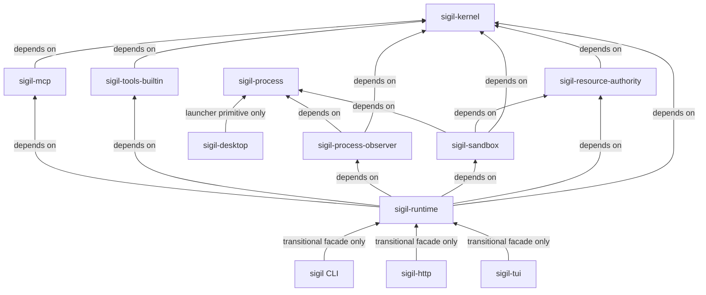
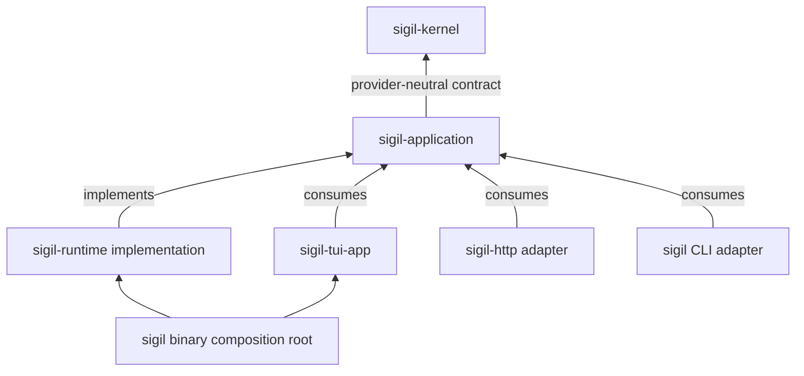
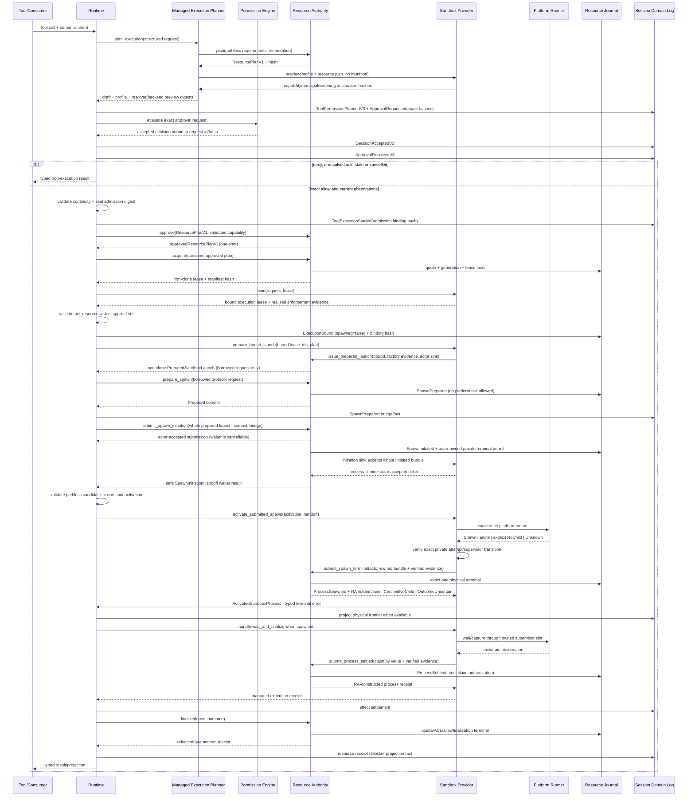

# RFC-0071：Unified Resource Authority, Execution Sandbox and Lifecycle Recovery V1

状态：Gated / Partial / Not Frozen（2026-08-26；第三十五轮真实 plan-review session 暴露 borrowed file subject onboarding 与 child artifact resource bundle 未闭合，重新进入 implementation）

> 当前审查覆盖、逐项回应与历史 exact-SHA evidence 见 `.repo-local-dev/review/rfc-0071-implementation-completeness-review-2026-08-25.md`。第三十三轮曾在 `441243dfdffaaba27ea5a59225d64c6f4405387c` 冻结；第三十四轮真实用户 journal 又暴露 pending source-bound grant rollover、sequence-only broker proof 重用、legacy marker alias 与多 composer snapshot 覆盖缺陷。第三十五轮 session `70c1896d-02a8-4c62-b273-3e43aeeb95aa` 进一步证明：shipping composition 创建空 borrowed-subject registry，却没有 production workspace registration/onboarding；plan-review child/finalizer 也没有 authority-managed ArtifactStaging/ArtifactStore resource bundle。现有 full gate 使用忽略真实 `ToolContext` 的 inspection fixture，无法证明实际 `ls/grep/read_file` 产品链。第三十四轮 qualification candidate 判定和更早 freeze 均被本段 supersede；完成 R71.9 implementation、真实 current-schema E2E 与新 clean exact-SHA full/five-platform qualification 前不得恢复 Candidate/Frozen，也不得启动或继续 RFC-0070 implementation。

创建日期：2026-08-23

修订日期：2026-08-26

依赖：

- [Sigil Rust Agent Core Technical Solution](../sigil-rust-agent-core-technical-solution.md)
- [RFC-0001：Durable Event Stream and Event Taxonomy](0001-durable-event-stream-and-event-taxonomy.md)
- [RFC-0002：Crash-consistent Mutation Protocol](0002-crash-consistent-mutation-protocol.md)
- [RFC-0005：Execution Backend](0005-execution-backend.md)
- [RFC-0027：Local Session Lifecycle V1](0027-local-session-lifecycle-v1.md)
- [RFC-0060：Structured Shell Risk, Approval Continuity and Terminal Execution V2](0060-structured-shell-risk-approval-and-terminal-execution-v2.md)
- [RFC-0062：Harness-owned Tool-output Spooling and Result Conformance V1](0062-harness-owned-tool-output-spooling-and-result-conformance-v1.md)
- [RFC-0068：Durable Recovery Spine and Effect-Scoped Retry V1](0068-durable-recovery-spine-and-effect-scoped-retry-v1.md)
- [RFC-0069：Recoverability Boundaries, Plan Direct Execution and Workspace Concurrency V1](0069-recoverability-boundaries-plan-materialization-and-workspace-concurrency-v1.md)

相关约束与先例：

- [RFC-0030：Alpha Feedback and Supportability V1](0030-alpha-feedback-and-supportability-v1.md)
- [RFC-0041：Windows Restricted Execution Backend V1](0041-windows-restricted-execution-backend-v1.md)
- [RFC-0059：Durable Tool-result Artifacts, Typed Retrieval and Cache-stable Aging V1](0059-durable-tool-result-artifacts-typed-retrieval-and-cache-stable-aging-v1.md)
- [RFC-0070：Independent Publishable TUI Framework, Presented-Frame Interaction and Application Adapter V1](0070-independent-publishable-tui-framework-and-application-adapter-v1.md)：其目标 application boundary 是本 RFC 的下游兼容约束；本 RFC 不依赖任何 R70 implementation slice。

---

## 1. 摘要

本 RFC 将文件、目录、临时空间、运行时状态、缓存、artifact staging 与外部路径从 tool/runtime 的零散实现中提升为独立领域对象，并作出以下架构决策：

1. 新增 `sigil-resource-authority`，作为本地资源 identity、allocation、owner-only hardening、quota、lease、generation、journal、cleanup、quarantine 与 typed recovery 的唯一 authority。
2. 新增 `sigil-sandbox`，承接当前位于 `sigil-tools-builtin` 的 Local、Seatbelt、Bubblewrap、Docker 与 Windows restricted backend；它只消费 Resource Authority 已实现的精确 grant，不得从 cwd、环境变量或工具名反推权限。
3. `sigil-kernel` 只保留 pathless、provider-neutral 的 resource intent、grant、receipt、recovery 与 requested-versus-effective enforcement contract；本机 `PathBuf`、目录句柄、ACL、mount/profile 只存在于 authority/sandbox 实现层。
4. 将当前混用的临时目录拆成：
   - `ExecutionTemp`：每次物理执行 attempt 独立；persistent terminal 使用 `TerminalTask` lifetime；默认提供给受限子进程；终态后回收或 quarantine。
   - `SessionScratch`：只承载通过 `SIGIL_SCRATCH_DIR` 明确使用的跨 tool-call 临时数据；不再充当 `TMPDIR`。
5. 受限执行默认将 `TMPDIR/TMP/TEMP/HOME/XDG_*_HOME/SIGIL_*_HOME` 映射到 `ExecutionTemp` 内的隔离布局，禁止因为缺少 HOME/XDG 而向 workspace 写 `.sigil-state` 或 `.sigil-cache`；`SIGIL_SCRATCH_DIR` 只在 requirement 明确包含 SessionScratch 时注入。
6. descendant symlink 是不跟随的 leaf entry，不得毒化整个 namespace；只有 resource root identity、owner 或 generation binding 本身失效，才 quarantine 对应 generation。
7. permission allow、physical resource realization、sandbox profile、spawn 与 execution receipt 必须绑定同一份 resource requirement/lease hash。requested containment 不能冒充 effective enforcement。
8. cleanup、journal 或 projector 失败不得把已发生的执行重新分类为可安全重放；所有恢复动作必须 typed、generation-bound、可审计。

目标执行链为：

```text
Tool Call
  -> ResourceRequirementSetV1 (pathless)
  -> ToolPermissionPlanV3 / ToolPermissionDecisionV3
  -> Resource Authority prepare + acquire
  -> Sandbox Provider bind + spawn
  -> Execution / Mutation / Resource Effect Receipt
  -> Lifecycle finalizer
  -> Released | Quarantined | CleanupIncomplete
```

本 RFC 不是一次 `chmod` 修补，也不是只移动 `scratch_namespace.rs`。它解决的是 permission、resource、sandbox、mutation、lifecycle 与 recovery 之间没有单一事实来源，导致每次局部修复后在另一入口重新失效的问题。

---

## 2. 事故证据与直接结论

### 2.1 Session `5ff39a6d-5225-4533-8c1f-b64c0c81abb7`

事故链可以由 durable session event 与源码完整还原：

| Event sequence | 事实 | 结论 |
|---|---|---|
| `646` | 发起 `cargo test -p sigil-tui 2>&1 \| tail -15` | 第一次完整 TUI 测试是污染来源 |
| `648` | requested containment 为 `workspace_and_scratch + network deny + owned_tree + restricted` | permission plan 已生成 |
| `649` | `policy_decision=allow`，`external_directory_required=false` | 不是 external-directory 拒绝 |
| `650` | tool execution 已进入 `started` | 第一次命令实际 spawn |
| `651` | workspace observation 发现大量 crate-local `.sigil-state` 产物 | 缺 HOME/XDG 时 runtime path fallback 污染 workspace |
| `652` | pipeline exit code 为 `0` | `tail` 掩盖上游 `cargo test` failure |
| `676` | `failed to provision cache/tmp: scratch namespace contains a symlink ...`，`retryable=false` | 后续命令在 spawn 前被资源 provisioning 拒绝 |

第一次测试执行了 `feedback_export_failure_stays_in_modal_and_can_be_cancelled`。测试 storage root 来自 `std::env::temp_dir()`，而 restricted Bash 把整个 session scratch 同时注入为 `SIGIL_SCRATCH_DIR` 与 `TMPDIR`。因此测试在 session scratch 内创建并遗留了：

```text
sigil-tui-test-storage-95792-23/cache/support-bundles -> .../external-support
```

对应源码：

- test temp root：[common.rs](../../../crates/sigil-tui/src/app/tests/common.rs)
- symlink fixture：[feedback_flow_tests.rs](../../../crates/sigil-tui/src/app/tests/feedback_flow_tests.rs)
- `TMPDIR = scratch_root`：[shell.rs](../../../crates/sigil-tools-builtin/src/shell.rs)
- symlink 立即使 walk 失败：[scratch_namespace.rs](../../../crates/sigil-tools-builtin/src/scratch_namespace.rs)

物理目录为当前用户所有，session root 具备 owner-only 权限；没有 EACCES、wrong owner 或 chmod 失败证据。直接原因是：一个安全的、仍位于 namespace 内的 descendant symlink 被策略判定为整个 scratch namespace 腐坏。

### 2.2 Blast radius 实际是 workspace 级

当前 `measure_scratch_usage` 会扫描 workspace 下所有 session namespace。任一 session 出现 symlink 后：

1. 当前 session 的每次 Bash/terminal spawn 前重新 provision/measure；
2. sibling session 的 provisioning 也会扫描到同一 invalid namespace；
3. TTL GC 遇到 invalid namespace 只记录 `skipped_invalid`，不会 quarantine 或回收；
4. `retryable=false` 后没有 durable active-blocker admission gate；模型随后发起的多个新 tool call 被当作独立尝试，再次命中同一 provisioning failure，形成无进展循环。这不是同一个 host retry future 自动重跑，而是等价新 attempt 未被同一 blocker 拦截。

因此单个测试 fixture 可以长期阻止同一 workspace 内所有新 shell/terminal 执行。

### 2.3 不是“附带目录没赋权”，而是资源从未被完整建模

当前系统只对显式 tool subject 做 permission planning。child process 隐式使用的以下资源没有进入同一份 plan、binding 与 receipt：

- `std::env::temp_dir()`；
- `HOME` 与 XDG state/cache；
- Sigil 自己的 state/cache fallback；
- compiler、package manager、test harness 与 MCP/plugin child 创建的附带目录；
- sandbox backend 实际 mount/profile 的 writable root；
- cleanup、quarantine 与残留资源状态。

“附带文件/文件夹是否被统一管理并赋予合适权限”的答案是：当前没有。它们可能碰巧落进可写目录，但不是 permission/resource/sandbox 三方共同承诺并审计的资源。

### 2.4 为什么局部修复会反复失效

当前 ownership 被拆散在多个模块：

| 责任 | 当前 owner/行为 | 缺陷 |
|---|---|---|
| path fallback | `sigil-runtime::paths` | HOME/XDG 缺失时回落到 cwd 下 `.sigil-*` |
| scratch allocation/quota/GC | `sigil-tools-builtin::scratch_namespace` | 通用资源 authority 反向归属于具体工具 crate |
| permission subject | `sigil-kernel` + 各入口手工组装 | 只覆盖显式 path，不覆盖隐式 child resources |
| Bash env | `sigil-tools-builtin::shell` | SessionScratch 与 TMPDIR 混用 |
| terminal env | `sigil-tools-builtin::terminal_tools` | 与 Bash 的 temp 语义不一致 |
| sandbox mounts | 各 backend 自行从 cwd/env 推导 | Seatbelt、bwrap、Docker 对同一请求行为不同 |
| session delete/GC | runtime/TUI 直接持有 tools-builtin control | lifecycle 与工具实现强耦合 |
| workspace mutation | kernel/runtime 多套 scan | 资源副作用与 `changed_files`、cleanup receipt 脱节 |
| recovery | string metadata | `reset_scratch_storage` 没有 typed handler 或 durable receipt |

具体耦合点包括：

- [paths.rs](../../../crates/sigil-runtime/src/paths.rs) 反向调用 tools-builtin 推导 session scratch；
- [application_run.rs](../../../crates/sigil-runtime/src/application_run.rs) 与 [session_lifecycle.rs](../../../crates/sigil-runtime/src/session_lifecycle.rs) 直接持有 `ScratchNamespaceControl`；
- [scheduler.rs](../../../crates/sigil-tui/src/runner/worker_loop/scheduler.rs) 直接启动 tools-builtin GC；
- [execution_backends](../../../crates/sigil-tools-builtin/src/execution_backends) 位于具体 tool crate；
- [mcp_registry.rs](../../../crates/sigil-runtime/src/mcp_registry.rs)、[plugins.rs](../../../crates/sigil-runtime/src/plugins.rs) 与 [sigil-mcp process.rs](../../../crates/sigil-mcp/src/process.rs) 各自构造 process launch。

这不是一个条件判断写错，而是缺少独立资源层后形成的结构性重复实现。

### 2.5 Session `70c1896d-02a8-4c62-b273-3e43aeeb95aa`：permission allow 后 authority 拒绝真实 file tool

该 session 的用户目标是“收尾当前工作区所有变更确保工作区 clean”。root conversation 因 `high_impact + scope_uncertain` 按 RFC-0063 正常进入 `review_first -> plan_review`；plan-review child 最终提交了 typed draft，root durable frontier 停在 `PlanReviewAttemptStatus::DraftReady`。日志中没有 `PlanDecisionRecorded` 或 Task admission，因此尚未进入测试、修复、commit 或 push。这个 plan approval 边界本身是预期行为，不得通过 R71.9 改成自动接受高影响计划。

真正的 RFC-0071 故障发生在 plan-review research 的真实 in-process file tools：

| durable fact | 现场证据 | 判定 |
|---|---|---|
| `ls`、两次 `grep` 的 `ToolPermissionDecisionV2` | `policy_decision=allow`、`local_policy_decision=allow`、`external_directory_required=false`、`subject_zone=workspace_source` | 不是 arbitrary external-directory denial，也不是用户未授权 workspace read |
| 同一 call 随后的 tool result | `managed file access refused: file access adjudication failed: operation not permitted for this binding` | permission 后的 Resource Authority composition/onboarding failure |
| plan-review child 的 7 个 ToolResultRecordedV3 | 7/7 `initial_availability=unavailable`，reason=`session has no durable artifact store`；其中 4 个 tool outcome 本身 success | child runtime resource bundle 未接入 managed artifact storage；小 inline preview 只是偶然避免本次 draft 丢失 |
| child run terminal | `completed/final_answer`，typed draft 已提交 | file error 没有阻止 draft，却削弱了研究证据；任务未执行是后续 plan decision 尚不存在 |

物理 workspace、session JSONL 与 attachment 文件均为当前用户所有；失败发生在 file tool 第一次 `fs::metadata/read_dir/open` 之前。该事故与 2.1 的 SessionScratch descendant-symlink provisioning 故障不是同一问题，也与 ExecutionTemp/SystemTemp 默认权限无关。

源码链证明这不是一次偶发 drift：

1. shipping authority composition 构造新的空 `BorrowedSubjectRegistryV1`，并把它注入 `AuthorityManagedFileAccessServiceV1`；
2. production runtime/kernel 没有 workspace activation 或 permission planning 对应的 `observe/observe_with_identity` 调用；现有 composition test 只证明未注册 subject 会 fail closed，却用注释假定“surface bootstrap 会注册”；
3. builtin file tool 自行把 normalized host path 写入 `OpaquePermissionSubjectRef`，自行构造 `authority_generation=0`、zero resolver proof 与 zero file plan hash；V2→V3 bridge原样复制该 ref，没有由 RA planner seal exact local plan；
4. kernel facade对同一operation生成token/request后，RA查询空registry并返回`OperationNotPermitted`；即使绕过该拒绝，实际`fs::*`仍由`sigil-tools-builtin`执行，而不是RFC §8.5要求的RA-private descriptor/executor；
5. `build_plan_review_child_session`与finalizer只attach URL capability store，没有从boot composition为child scope取得paired ArtifactStaging/ArtifactStore lease；
6. plan-review测试用返回固定文本且忽略`ToolContext`的fake inspection tool，TUI handoff测试也没有运行shipping `ls/grep/read_file`，所以workspace full与five-platform gate可以false-green。

因此本事故不是“fail closed 太严格”，而是 permission plan、borrowed subject registration、RA-private file plan、file I/O executor与artifact capture lifecycle没有形成同一原子resource admission。安全规则应继续fail closed；实现必须在`ToolExecutionStarted`之前证明这些前置条件已ready，并用typed resource-precondition failure区分“policy deny”与“authority composition unavailable”。

### 2.6 第三十五轮直接结论

- RFC §8.5已经规定`BorrowedSubjectRegistrationServiceV1`、RA-owned planner/private plan table与RA-owned file execution；当前shipping实现只落地token/adjudication的过渡子集，属于**实现不完整且与RFC不一致**，不得以给空registry增加宽泛默认allow修补。
- current-schema child session不是“换一个JSONL路径的普通Session”；plan-review、plan finalizer、Task role、agent child与任何future child都必须由同一application composition按child scope原子 provision session writer、artifact staging/store、tool authority与所需managed storage/resource handles。
- qualification不能再用category看似为File、实际忽略`ToolContext`的fixture替代shipping tool。至少一条required E2E必须从真实TUI/current-schema boot开始，经automatic plan-review调用真实`ls/grep/read_file`，再由用户接受typed plan并进入Task execution；artifact availability、file receipt与task admission均需durable断言。
- 第三十四轮“仅剩新exact-SHA qualification”的判定失效。R71.9代码、测试、inventory/negative gate、execution ledger与新qualification全部闭合前，RFC保持`Gated / Partial / Not Frozen`，RFC-0070不得开始或继续implementation。

---

## 3. 与现有 RFC 的关系

### 3.1 Supersede RFC-0062 的部分语义

RFC-0062 关于 private artifact spool、opaque artifact ref、owner-only staging、retention 与 model-visible/session-private 分离仍然有效。

RFC-0062 的 R62.5 落地后，当前实现形成了以下行为；其中全 workspace 扫描、invalid GC 永久 skip 与进程内 `BTreeSet<SessionId>` 是实现事实，并非 RFC-0062 要求长期保留的规范。本 RFC supersede 这些现行行为：

- `TMPDIR` 指向整个 SessionScratch；
- descendant symlink 使整份 session namespace invalid；
- 每次 spawn 前对 workspace 下所有 session scratch 做全域合法性扫描；
- invalid namespace 被 GC 永久跳过；
- in-process `BTreeSet<SessionId>` 作为完整 lease ownership。

新的规范是：`ExecutionTemp` 与 `SessionScratch` 分离；walker 永不 follow descendant symlink；故障被限制在 resource generation；GC 必须 quarantine 或产生 cleanup-incomplete receipt。

### 3.2 Extend RFC-0060

RFC-0060 的 permission plan、semantic analysis、containment request、environment binding，以及 exact approval continuity state machine 全部保留。本 RFC 只 clean-cutover schema envelope，不替换 `approval requested -> decision accepted -> resolved -> ToolExecutionStarted` 的 durable 顺序，也不弱化 stale/expiry/cancel/reload、argv/policy/backend drift fail-closed。V3 plan、decision、draft、requirement 与 backend preview hash 必须进入同一个 approval request/resolution/start binding。

RFC-0060 中 `$TMPDIR` 的资源语义调整为 `ExecutionTemp`，`$SIGIL_SCRATCH_DIR` 保持 `SessionScratch`。两者不得指向同一 physical generation。

### 3.3 Preserve RFC-0005 语义，supersede direct backend port

RFC-0005 的 capability probe、permission/enforcement 分离、requested-versus-effective truth 与 execution receipt 语义保持有效。当前 kernel `ExecutionBackend` 让 consumer 直接构造包含 cwd/env 的 local request，无法安全携带 authority-private lease；本 RFC clean-cutover 为：

- kernel 新增 pathless、object-safe `ManagedExecutionServiceV1` consumer port；
- in-process filesystem tool另走pathless `ManagedFileAccessServiceV1`，不因“没有spawn”绕过borrowed resource lease；
- runtime 实现该 port，并在闭包内持有 Resource Authority 与 Sandbox Provider；
- non-serialized physical lease 只在 runtime implementation 与 `sigil-sandbox` 之间流动；
- concrete Local/Seatbelt/Bubblewrap/Docker/Windows implementation 从 tools-builtin 移入 `sigil-sandbox`；
- tools/MCP只持有kernel managed execution/file-access port与unforgeable admission token，不能导入authority/sandbox local type；
- receipt 增加逐资源 requested/effective enforcement 与 cleanup linkage；
- restricted request 在 backend 不可用时禁止静默回退 Local。

因此 supersede 的是 direct local trait shape，不是 RFC-0005 的安全不变量。

### 3.4 Extend RFC-0001、0002、0068、0069

- append-only session stream 保存公共 resource/effect/recovery fact；
- private resource journal 保存本机 allocation/generation/cleanup fact；
- workspace mutation 继续由 RFC-0002 定义，不能被 resource receipt 取代；
- cleanup 失败、receipt append 失败与 projector 失败使用 RFC-0068/0069 的 effect settlement 与 forward recovery，禁止盲重放。

### 3.5 与 RFC-0070 严格串行，禁止形成实现环

两份 RFC 的冻结实施顺序是：**先完整实施并资格化 R71.0-R71.9，再以该稳定结果作为 R70.0 的新基线实施 R70.0-R70.8**。RFC-0071 不等待 `sigil-application`、TUI package 拆分或 `CommittedPresentation`；RFC-0070 则必须消费 RFC-0071 已冻结的 `ToolPermissionPlanV3/ToolPermissionDecisionV3`、`RecoveryBlockerV2`、resource/effect receipt、ManagedStorage/ManagedFileAccess/ManagedExecution 与 resource-recovery surface contract，不能重新定义第二份物理资源 authority、durable schema 或 recovery state machine。

严格串行还表示：

1. R71 implementation branch/release candidate 中不得启动任何 R70 slice，包括看似独立的 R70.0/R70.1；普通缺陷修复只有在不声称推进 R70、且不改变本节冻结边界时才可独立进入；
2. R71.6-R71.8 是同一未发布 candidate，期间不得混入 public TUI package split、preview publish、runner relocation 或 `sigil-application` crate cutover；
3. R71 完成时允许现有产品 crate 暂时通过 runtime facade 消费 application-facing resource/recovery contract，但该 edge 是明确的过渡实现，不是长期 product dependency；
4. R70.0 必须重新采集 post-R71 baseline，R70.4 只能机械包裹或适配该 contract，R70.6 只能移走剩余 application/runner wiring，不能把 physical resource ownership 从 Resource Authority/Sandbox 搬回 application/runtime。

因此不存在循环依赖：RFC-0071 只承担 authority、sandbox、durable resource/recovery contract 与当前表面兼容 facade；RFC-0070 在其完成后承担 transport-neutral application facade 与 TUI framework/package 边界。

---

## 4. 目标、非目标与威胁模型

### 4.1 目标

1. 让所有model/workspace/extension-config influenced local execution consumer共享同一套resource、sandbox与lifecycle contract，并对trusted host operation做穷举分类而非暗中绕行。
2. temp dir默认可用，且始终由Sigil authority创建、owner-only并纳入lifecycle；required confinement下还必须由sandbox enforce，explicit unconfined/Local则truthful报告无OS containment。
3. 消除 session scratch 自毒化、workspace 级连带阻断与 invalid namespace 永久残留。
4. 消除缺 HOME/XDG 导致的 repo-local `.sigil-state/.sigil-cache` 污染。
5. 使 permission requested、实际 allocation、OS enforcement 与 receipt 可逐资源对账。
6. 使 success/failure/cancel/timeout/crash 都有唯一、可恢复的资源终态。
7. 在 TUI、Desktop、CLI、HTTP 上投影相同 reason code、retry disposition 与 recovery action。
8. 将模块依赖调整为 kernel contract 向下、resource/sandbox implementation 向上消费，去除 runtime/TUI 对 tools-builtin concrete control 的依赖。

### 4.2 非目标

1. 不把 `sigil-kernel` 变成本地 filesystem library。
2. 不允许模型直接管理 absolute runtime path、ACL、UID/SID、mount 或 sandbox profile。
3. 不为所有内部 temp/cache 资源增加逐次用户审批；它们是 host-owned execution prerequisite，但必须进入 plan hash 与 receipt。
4. 不把 Local backend 描述为 sandbox。
5. 不承诺 Windows 当前具备与 Seatbelt/bwrap 相同的 full enforcement；capability 不足必须 truthful `partial`/`unsupported`。
6. 不用递归 chmod 修正任意 child 创建的所有内容；owner-only ancestor、umask 与 sandbox 才是边界。
7. 不把 workspace mutation、resource mutation、artifact retention 混成一个含糊的 `changed_files`。
8. 本 RFC 不直接实现代码；Proposed 阶段不改变现有产品行为。
9. 不把desktop sidecar launcher、signed updater等trusted product authority耦合进agent runtime；它们必须inventory化、typed、owner-only且永不消费agent resource grant。

### 4.3 威胁模型

必须处理：

- child 在 temp/scratch 内创建 symlink、hard link、FIFO、socket、broken symlink 或异常权限；
- permission 后、spawn 前 path 被替换、重命名或通过 alias 指向不同对象；
- 并发 tool/terminal、跨进程 Sigil instance、GC 与 session delete 竞争；
- crash 发生于 reserve、mkdir、hardening、journal append、sandbox bind、spawn、exit、cleanup 任一点；
- child 覆盖 `TMPDIR/HOME` 或使用绝对 `/tmp`、host HOME；
- backend 宣称已限制但实际 writable root 与 grant 不一致；
- Windows reparse point、UNC/case alias、open handle 与 ACL inheritance；
- disk full、quota exceeded、journal fsync failure；
- projection failure 导致 UI 看不到恢复状态。

不在本 RFC 的绝对安全承诺内：

- kernel/OS sandbox 自身的零日漏洞；
- `danger-full-access` 下阻止用户明确授权的 host write；
- 远程执行 provider 的物理 filesystem 实现。远程 provider 仍必须返回同一 provider-neutral receipt。

---

## 5. 竞品与当前业界设计结论

调研以用户提供的 sibling `sigil-competitor-repos` checkout 为源码基线，并用官方文档复核当前公开语义。快照 commit：

| 项目 | 本地审查 commit | 可借鉴点 | 不直接照搬的点 |
|---|---|---|---|
| OpenAI Codex | `4808c162eeb767b389f13b7cb2730f32c8563dba` | approval 与 sandbox 是不同控制；spawned command 继承 sandbox；writable roots 是显式 policy input | 默认放开 host `/tmp`/`TMPDIR` 的范围大于本 RFC 目标 |
| Claude Code | `01f1617f14452ac78bf319cef2236d87c0fe05cb` | permission precheck 与 OS enforcement 分层；cwd/session temp 默认可写；外部 write root 显式配置 | 产品设置模型不等于 durable resource lifecycle |
| Gemini CLI | `ae0a3aa7b928cc73bb09604bb9c2c020e6b647db` | bwrap 使用 fresh writable tmpfs `/tmp`；sandbox implementation 与 tool 分离 | container/Seatbelt profile 仍需 Sigil 自己的 receipt/recovery contract |
| DeepSeek Harness | `47f943859bef60e4160492346772ded9b24f765a` | 独立 sandbox seam；policy per call；enforcement 明确 `full/partial` | 资源 taxonomy、durable cleanup 与 mutation ledger 仍需本 RFC补齐 |
| OpenCode | `3a31c4ea801915c0b050df4b3842997ea62b6e93` | resource-oriented permission UX 与 external-directory 匹配清晰 | 官方明确 shell 拥有 host authority且 path analysis best-effort，不可作为 enforcement 参考 |

官方与源码依据：

- [Codex sandbox 文档](https://learn.chatgpt.com/docs/sandboxing) 将 approval policy 与 technical sandbox boundary 分开；[writable root 源码](https://github.com/openai/codex/blob/4808c162eeb767b389f13b7cb2730f32c8563dba/codex-rs/protocol/src/protocol.rs#L1011-L1029) 显式表达 cwd、additional roots 与 TMPDIR。
- [Claude Code sandbox 文档](https://code.claude.com/docs/en/sandboxing) 说明 cwd 与 session temp 默认可写，并区分 permission decision 与 OS enforcement。
- [Gemini bwrap builder](https://github.com/google-gemini/gemini-cli/blob/ae0a3aa7b928cc73bb09604bb9c2c020e6b647db/packages/core/src/sandbox/linux/bwrapArgsBuilder.ts#L45-L65) 为每个 sandbox 构造 isolated writable `/tmp`。
- [DeepSeek Harness sandbox seam](https://github.com/deepseek-ai/deepseek-harness/blob/47f943859bef60e4160492346772ded9b24f765a/docs/subsystems/sandbox.md#L1-L64) 将 platform runner 与 consumer 解耦，并把 enforcement completeness 作为事实。
- [OpenCode permissions](https://opencode.ai/v2/docs/permissions) 适合参考 resource UX，但其 shell authority 警告说明 best-effort scanner 不能替代 sandbox。

调研后的设计原则不是“照抄某一家默认路径”，而是组合三项成熟做法：

1. permission 与 sandbox 独立；
2. temp 是 execution-owned writable root；
3. effective enforcement 必须由 backend 回执，而不是由请求方自报。

Sigil 额外要求 durable session、effect-scoped retry、cross-surface recovery，因此必须再增加 Resource Authority 与 resource journal。

---

## 6. 统一不变量

### I71.1 单一 writable authority

任一agent-runtime physical execution/file/storage attempt只能有一份active`ResourceLeaseManifestV1`或同源admission lease。tool、runtime、sandbox、MCP、plugin与UI不得创建第二套writable-root authority。desktop sidecar launcher、signed updater等不接收model/workspace resource grant的trusted product operation属于独立least-privilege trust plane，必须进入inventory且永不能复用agent lease；这不是agent authority的例外入口。

### I71.2 Plan pathless，allow 后才 realize

permission planning 只生成稳定、可 hash 的 logical requirement。随机目录、ACL、mount 与绝对路径只能在 decision allow 后创建。

### I71.3 同一 lease 贯穿 approval、bind、spawn 与 receipt

以下 digest 必须构成唯一 execution binding：

```text
execution_binding_hash = H(
  permission_plan_hash,
  resource_requirement_set_hash,
  realized_lease_manifest_hash,
  sandbox_backend_identity_hash,
  sandbox_profile_hash,
  environment_binding_hash
)
```

任一部分在 spawn 前漂移都必须 fail closed。

### I71.4 Temp 默认可用不等于 SystemTemp 默认获权

默认 writable temp 是 `ExecutionTemp`。host `/tmp`、user TMPDIR 与其他 `SystemTemp` 默认不进入 child grant。

### I71.5 SessionScratch 不是 TMPDIR

`SessionScratch` 只为显式跨调用数据提供稳定入口。compiler/test/library 的隐式 temp 必须落入 `ExecutionTemp`。

### I71.6 Descendant symlink 不得扩大 failure scope

accounting、cleanup 与 inventory 使用 `lstat`/`symlink_metadata`，把 symlink 作为 leaf；永不 follow target。只有 root identity/owner/generation 失效才 quarantine 整个 generation。

### I71.7 Requested 不等于 effective

permission plan 表示请求；sandbox receipt 表示实际 enforcement。restricted request 缺少可用 backend 时不得回退 Local 并继续声称受限。

### I71.8 Cleanup failure 不得触发 command replay

只要 process 已 spawn，后续 cleanup、journal 或 projection failure 都必须保留 effect settlement，并进入 reconciliation；不得自动重放 tool call。

### I71.9 Recovery 必须复用 durable blocker spine

resource failure 必须扩展 RFC-0069 的 `RecoveryBlocker` lifecycle，而不是新建第二套 retry taxonomy。active exact-resource blocker 未被 durable resolve/supersede 前，逻辑等价的新 tool call、terminal start 或 extension restart 都必须在 admission 前返回同一 blocker；`retryable` bool 只能作为 legacy diagnostic，不能授权 retry。automatic recovery 只允许作用于尚未 spawn 的 owned resource，或创建新 generation；不得隐式 reset SessionScratch。

### I71.10 Public contract 不泄露 host path

session event、HTTP、Desktop DTO、TUI state 与 model-visible error 只包含 safe label、opaque resource id、generation、reason code 与 digest。绝对路径、UID/SID、TMP value、raw profile 留在 private diagnostics。

### I71.11 Active process 固定 execution generation；recovery observer 只沿verified lineage接班

进程启动后不得切换allocator、binder、execution backend或normal physical provider generation；升级、feature flag 与rollback只影响尚未acquire的attempt。唯一例外是old provider quiescent/unavailable后的recovery observer：它可沿same `provider_recovery_lineage_id + attempt_ledger_binding_hash`的durable、factory-attested Successor chain使用新observing generation读取原attempt ledger。该例外只授权recovery evidence/settlement，不改变原sandbox binding、process lifetime或为新execution复活旧registration；normal path仍要求origin=observing registration exact相同。

### I71.12 资源副作用与 workspace mutation 分账

临时文件、resource journal 与 cleanup 不进入 workspace `changed_files`。workspace mutation、managed-resource delta、artifact retention 三套事实可关联但不得互相替代。

### I71.13 Physical fact producer authority 必须独立于 coordinator

runtime只拥有Prepared/bridge/Initiated与pre-Initiated abort的ordering authority；它不得提交NoChild布尔值、Spawned observation、holder或settlement receipt来写physical terminal。Spawned/CertifiedNoChild/normal OutcomeUncertain/ProcessSettled只能由sandbox private platform-attempt/supervisor state经exact registered verifier认证后，由Resource Authority生成journal commit、holder与claim。唯一RA-only例外是closed `ProviderUnavailableConservativeAuthorizationV1`：它必须绑定durable provider unavailable chain、no-successor frontier、old-owner quiescence、current Initiated authorization与pre-reserved terminal slot，且只可CAS写OutcomeUncertain，绝不能写Spawned/NoChild/Settled。public DTO、MAC bytes或“table中未找到process”本身都不是authorization。

### I71.14 Resource journal 必须独立重建完整spawn binding

durable spawn record必须自包含或通过同一validated hash chain完整引用attempt、intent、pending、launch、sandbox binding、lifetime、provider registration lifecycle/activation、recovery lineage/attempt ledger、Prepared/bridge/Initiated ordering、两类claim authorization/quiescence、process birth identity、RA holder/claim、physical verifier/evidence与settlement receipt。reconciler不得依赖runtime side table、caller重交DTO、PID existence、目录扫描或UI projection发明physical frontier。

### I71.15 Application-facing resource/recovery contract 必须 renderer-neutral 且可机械迁移

`sigil-kernel`拥有 versioned、pathless、provider-neutral 的 resource/recovery surface contract：至少包括 shared blocker projection、resource/effect receipt view、available-action token、command/event correlation 与 stable frontier/binding。它不得包含 TUI/Ratatui、Desktop/HTTP transport、`PathBuf`、descriptor、ACL/profile、Resource Authority/Sandbox concrete type或runtime-private handle。

R71 阶段可由 current runtime facade 实现并向 TUI/HTTP/CLI 暴露这份 contract，Desktop 继续经 generated wire schema 消费同一投影；但 facade 只能做 lossless mechanical projection/dispatch，不能成为新的 durable truth 或 physical authority。未来 RFC-0070 的 `sigil-application` 必须复用或无损包裹同一 contract，使产品 adapter 的 dependency edge 可从 runtime facade 机械替换为 application port，而无需改写 permission V3、resource journal、receipt、blocker/action token 或 recovery schema。任何表面直接导入 `sigil-resource-authority`/`sigil-sandbox` concrete type，或因迁移而出现第二份 canonical hash/状态机，都违反本不变量。

### I71.16 Permission allow 不得领先于 resource readiness

`ToolPermissionDecisionV3=Allow`只证明policy允许，不证明borrowed subject已经注册、RA-private file plan已经seal、artifact capture lease已经取得或physical executor已经ready。对in-process file tool，workspace/borrowed subject observation、exact authority generation/resolver proof/file plan、tool authority与required artifact capture binding必须在`ToolExecutionStarted`前形成同一prepared resource context；任一缺失均以typed `ResourcePreconditionUnavailable`或更窄closed error在首个filesystem effect前fail closed。不得先向用户显示permission allow、再用通用`OperationNotPermitted`掩盖composition缺口。

### I71.17 Child session 必须从 application composition provision resource bundle

plan-review、plan finalizer、Task role、agent child与future child session不能只从parent JSONL路径派生新store，也不能静默缺省artifact backend。每个child scope必须通过同一application authority composition取得独立、scope-bound的SessionLog attachment、ArtifactStaging/ArtifactStore paired lease、tool authority、managed storage handles及其lifetime finalizer；parent只能传递opaque lineage与provisioning authority，不能共享raw root、未分区store或隐式fallback。bundle acquisition失败时child在provider/tool执行前进入typed blocked terminal，不能以`session has no durable artifact store`继续best-effort运行。

### I71.18 Qualification 必须覆盖 shipping composition 和真实 tool

category/access看似等价但忽略`ToolContext`、不声明managed file plan或直接返回固定字符串的fixture，只能证明coordinator控制流，不能证明RFC-0071 consumer onboarding。required conformance至少使用一次shipping registry、真实`ls/grep/read_file`、真实authority composition与managed artifact backend；negative case必须证明unregistered/cross-generation subject在filesystem effect前zero-I/O拒绝，positive case必须证明permission decision、registration receipt、file access receipt、artifact descriptor与child scope可逐项对账。

---

## 7. 资源分类、访问与生命周期

### 7.1 ResourceKindV1

| Kind | Owner | 默认 child access | 默认 lease lifetime / physical retention | Model visibility | 用户审批 |
|---|---|---|---|---|---|
| `Workspace` | user/workspace | 由 permission plan 决定 | `Application` lease / borrowed，不回收 | cwd 与 tool path | 依现有 policy |
| `ExecutionTemp` | Sigil | `Read/Write/Create/DeleteManaged` | `ToolCall`或`TerminalTask` / settlement后释放或quarantine | 仅通过保留 env；不显示 host path | 内部 prerequisite，不逐次询问 |
| `SessionScratch` | Sigil/session | 显式声明后 `Read/Write/Create/DeleteManaged` | `Session` / session retention policy | `SIGIL_SCRATCH_DIR` | 内部 resource，grant 进入 plan |
| `RuntimeState` | Sigil | 默认无 child access | `Application` lease / durable state policy，app退出不删除 | 不可见 | 不适用 |
| `RuntimeCache` | Sigil | 默认无 child access | `Application` lease / cache semantic TTL | 不可见 | 不适用 |
| `ArtifactStaging` | Sigil/publish transaction | 仅专用 writer | `PublishTransaction` / publish或abort后清理；发布物归ArtifactStore | opaque artifact ref | 不适用 |
| `ArtifactStore` | Sigil | child默认无access；typed artifact reader | `Application` lease / RFC-0059/0062 semantic retention | opaque artifact ref | 不适用 |
| `IsolatedWorkspace` | Sigil/run + user Git repository transaction | 由permission plan决定 | `Run` lease / RFC-0069 retain-or-cleanup | safe isolated-workspace label | 依workspace mutation policy |
| `ToolchainStore` | user/system，borrowed | `Read/Execute`，不得默认 write | `Application`/`Workspace` lease / 不回收 | safe toolchain label | audited resolver/operator policy |
| `ToolCache` | Sigil/workspace | exact tool family `Read/Write/Create/DeleteManaged` | `Workspace` lease / tool-cache TTL | 不可见 | 内部 prerequisite，进入 plan |
| `UserConfig` | user，borrowed | 默认 none；只读 safe projection 或显式 grant | `ToolCall`/`ExtensionProcess` lease / borrowed不回收；safe projection继承ExecutionTemp lifetime | safe config label | secret-capable配置必须显式 policy |
| `ExternalUserPath` | user | 默认 none | `ToolCall`/`Session` lease / borrowed不回收 | safe label | 必须走 external policy |
| `SystemTemp` | OS/user | 默认无 write/create/delete；read 取决于 sandbox profile | OS-owned / 不回收 | 不可见 | 默认不授予 writable root |

`ExecutionTemp` 是通用名字，不使用 `CallTemp` 作为 enum 名，因为 persistent terminal、long-running MCP stdio process 的 lifetime 不是单个 synchronous tool call。物理 scope 仍必须是一 attempt/terminal-task 一 generation。

### 7.2 ResourceLeaseLifetimeV1 与 retention

```rust
pub enum ResourceLeaseLifetimeV1 {
    ToolCall,
    TerminalTask,
    ExtensionProcess,
    Run,
    Session,
    Workspace,
    Application,
    PublishTransaction,
}

pub enum ResourceRetentionPolicyV1 {
    ReleaseOnSettlement,
    SessionPolicy,
    WorkspaceCachePolicy,
    DurableSemanticOwnerPolicy(OpaqueRetentionPolicyId),
    BorrowedNoCleanup,
}
```

lease lifetime只决定谁在多久内持有access/admission，不能推导physical retention。`RuntimeState`即使application lease结束仍按session/control writer的durable policy保留；`ArtifactStaging`只活到publish transaction，成功发布后的ArtifactStore ref与retention继续归RFC-0059/0062；borrowed resource永不因lease结束被authority删除。kind、lease lifetime与retention policy必须分开进入requirement/hash，禁止用目录名或lease结束推断删除。

### 7.3 ResourceAccessV1

```rust
pub enum ResourceAccessV1 {
    Read,
    Write,
    Create,
    DeleteManaged,
    DeleteExactSubject,
    DeleteSubjectSubtree,
    RenameWithinGrant,
    Execute,
}

pub enum ResourcePurposeV1 {
    ExecutionPrerequisite,
    PersistentScratch,
    SemanticRuntimeState,
    RebuildableCache,
    ExecutionCapture,
    ArtifactPublish,
    IsolatedWorkspace,
    ToolchainResolution,
    ToolCache,
    SafeConfigurationProjection,
    BorrowedFileOperation,
    ResourceRecovery,
    HostDiagnostic,
}

pub enum ResourceVisibilityV1 {
    HostOnly,
    ExactChildGrant,
    SafeLabelOnly,
    OpaqueArtifactReference,
    SanitizedProjection,
}

pub enum ResourceQuotaClassV1 {
    AttemptEphemeral,
    SessionScratch,
    RuntimeState,
    RuntimeCache,
    ArtifactStaging,
    ArtifactStore,
    IsolatedWorkspace,
    ToolCache,
    BorrowedAccountingOnly,
    Quarantine,
}

pub struct ResourceQuotaProfileV1 {
    pub class: ResourceQuotaClassV1,
    pub max_bytes: u64,
    pub max_entries: u64,
    pub max_open_holders: u32,
    pub max_age_ms: Option<u64>,
    pub hard_runtime_enforcement_required: bool,
    pub profile_hash: CanonicalHash,
}

pub enum ResourceCleanupPolicyV1 {
    ReleaseExactGenerationOnSettlement,
    RetainBySemanticOwner,
    QuarantineExactGenerationOnFailure,
    RetainUntilSessionLifecycle,
    RetainUntilWorkspaceCachePolicy,
    BorrowedNoCleanup,
}

pub enum ResourceCleanupStatusV1 {
    NotStarted,
    Released,
    RetainedByPolicy,
    Quarantined { quarantine_ref: OpaqueQuarantineRefV1 },
    CleanupIncomplete { evidence_digest: CanonicalHash },
    NotApplicableBorrowed,
}

pub enum EnvironmentProfileClassV1 {
    FreshIsolatedHome,
    FreshIsolatedHomeWithToolchain,
    WorkspaceBound,
    PersistentTerminal,
    ExtensionProcess,
    ExplicitUnconfined,
}

pub enum ToolchainBindingClassV1 {
    Rust,
    Node,
    Git,
    GenericExecutable,
}

pub enum SandboxBackendClassV1 {
    MacOsSeatbelt,
    LinuxBubblewrap,
    Docker,
    WindowsRestricted,
    LocalUnconfined,
}

pub enum EnforcementRequirementClassV1 {
    RequiredExact,
    RequiredDeclaredSuperset { declaration_hash: CanonicalHash },
    Preferred,
    ExplicitUnconfined,
}

pub struct RequestedEnforcementV1 {
    pub requirement: EnforcementRequirementClassV1,
    pub deny_ambient_system_temp_write: bool,
    pub deny_ambient_home_write: bool,
    pub deny_ungranted_workspace_write: bool,
    pub require_process_tree_ownership: bool,
    pub require_network_policy: bool,
    pub requested_capability_set_hash: CanonicalHash,
    pub profile_hash: CanonicalHash,
}

pub enum EnforcementCompletenessV1 { Exact, Partial, None }

pub struct EffectiveEnforcementV1 {
    pub backend: SandboxBackendClassV1,
    pub completeness: EnforcementCompletenessV1,
    pub effective_capability_set_hash: CanonicalHash,
    pub access_widening_set_hash: CanonicalHash,
    pub functional_probe_hash: CanonicalHash,
    pub proof_set_hash: CanonicalHash,
}

pub enum ManagedArenaClassV1 {
    State,
    Cache,
    ExecutionTemp,
    Artifact,
    IsolatedWorkspace,
    ToolCache,
}

pub enum HolderKindV1 {
    ExecutionAttempt,
    ProcessTree,
    SemanticOwner,
    StoragePrimitive,
    BlobWriter,
    ProjectionConnection,
    WorkspaceMutationLease,
    SessionWriterAttachment,
    ResourceMaintenance,
    StartupReconciler,
}

pub enum ResourceEvidenceClassV1 {
    BootstrapRoot,
    Identity,
    OwnerOrAcl,
    Quota,
    Journal,
    Sandbox,
    AliasContainment,
    Storage,
    ProcessFrontier,
    Cleanup,
}
```

`DeleteManaged`只允许删除managed lease generation内由authority管理的entry。borrowed Workspace/ExternalUserPath已有对象的删除必须使用subject-bound`DeleteExactSubject`或更高风险`DeleteSubjectSubtree`；rename/atomic replace使用`RenameWithinGrant`且source/destination subject binding同时进入plan/hash/receipt。它们不能从`Write`或`DeleteManaged`隐式推导。subtree delete需要现有high-risk confirmation；managed file-access与sandbox provider必须报告实际delete/rename widening。

owner scope 也是 pathless：

```rust
pub enum ResourceOwnerScopeV1 {
    Application,
    Workspace(OpaqueWorkspaceId),
    Session(OpaqueSessionId),
    Run(OpaqueRunId),
    PhysicalAttempt(PhysicalAttemptId),
    TerminalTask(OpaqueTerminalTaskId),
    ExtensionProcess {
        extension_kind: ExtensionKindV1,
        extension_id: OpaqueExtensionId,
        generation: u64,
    },
    PublishTransaction(OpaquePublishTransactionId),
    Artifact(OpaqueArtifactId),
}
```

### 7.4 ExecutionTemp 标准布局

每个 physical attempt 的 root 由 authority 创建；logical layout 固定但 host absolute path 随 generation 变化：

```text
ExecutionTemp/<attempt-id>/<generation>/
  tmp/          -> TMPDIR, TMP, TEMP
  home/         -> HOME
  state/        -> XDG_STATE_HOME
  cache/        -> XDG_CACHE_HOME
  sigil-state/  -> SIGIL_STATE_HOME
  sigil-cache/  -> SIGIL_CACHE_HOME
  config/       -> sanitized config views；不映射raw user config
```

当且仅当 approved requirement 包含 SessionScratch 时，`SIGIL_SCRATCH_DIR` 才指向另一份 `SessionScratch/<session-id>/<generation>/data`；否则该变量不注入。两类资源绝不 alias。

host-private diagnostics不得放在child获grant的ExecutionTemp root下；它使用独立`ArtifactStaging` writer lease和sibling generation，sandbox manifest中不存在该binding。backend若只能whole-root mount，仍不能借此暴露diagnostics；R71.3 conformance要验证child不可enumerate/open该host-private sibling。

### 7.5 默认 mode 与 ACL

Unix：

- authority-owned directory：`0700`；
- authority-created file/journal：`0600`；
- descendant entry 可以保留 child 产生的 mode；`0700` ancestor 已阻止其他用户 traversal；
- V1 不为所有 shell 强制全局 `umask 077`，因为它会同时改变 workspace artifact mode；任何 umask override 必须是显式 `ChildUmaskPolicyV1`，并进入 environment binding/receipt。

Windows：

- root 使用 owner-only、protected、inheritable DACL；
- 禁止继承 ambient broad write ACE；
- reparse point 与 final path identity 在 acquire/bind/spawn 前检查；
- open handle 导致 cleanup 失败时 quarantine generation，不复用。

ancestor owner-only boundary 足以保护 child 创建的内部 entry，不要求事后递归 chmod arbitrary content。

### 7.6 Managed 与 borrowed resource

Resource Authority 对两类资源承担不同责任：

- managed：`ExecutionTemp/SessionScratch/RuntimeState/RuntimeCache/ArtifactStaging/ArtifactStore/IsolatedWorkspace/ToolCache`。authority创建、harden、lease、quota、finalize、quarantine；
- borrowed：`Workspace/ToolchainStore/UserConfig/ExternalUserPath/SystemTemp`。authority 只做canonical identity、approved access/handle lease与enforcement receipt，不删除、不永久chmod或宣称拥有内容；仅允许§11.3定义的显式、可逆、durable、CAS恢复temporary enforcement metadata binding。

borrowed resource 的 generation 表示一次 identity observation/admission generation，不表示 Sigil 可以回收该目录。SystemTemp 在 V1 只作为 deny/read-boundary fact，不成为默认 writable grant。

---

## 8. Kernel provider-neutral contract

### 8.1 Resource requirement

```rust
pub struct ResourceRefV1 {
    pub resource_id: OpaqueResourceId,
    pub kind: ResourceKindV1,
    pub owner_scope: ResourceOwnerScopeV1,
    pub journal_scope: ResourceJournalScopeV1,
    pub generation: u64,
}

pub struct ResourceRequirementV1 {
    pub requirement_id: OpaqueRequirementId,
    pub physical_owner_scope: ResourceOwnerScopeV1,
    pub stable_key: ResourceRequirementKeyV1,
    pub kind: ResourceKindV1,
    pub lease_lifetime: ResourceLeaseLifetimeV1,
    pub access: BTreeSet<ResourceAccessV1>,
    pub purpose: ResourcePurposeV1,
    pub visibility: ResourceVisibilityV1,
    pub quota_profile: ResourceQuotaProfileV1,
    pub retention_policy: ResourceRetentionPolicyV1,
    pub cleanup_policy: ResourceCleanupPolicyV1,
    pub implicit: bool,
}

pub struct ResourceRequirementKeyV1 {
    pub blocker_scope: ResourceBlockerScopeV1,
    pub kind: ResourceKindV1,
    pub purpose: ResourcePurposeV1,
    pub access: BTreeSet<ResourceAccessV1>,
    pub lease_lifetime: ResourceLeaseLifetimeV1,
    pub quota_profile: ResourceQuotaProfileV1,
    pub retention_policy: ResourceRetentionPolicyV1,
    pub cleanup_policy: ResourceCleanupPolicyV1,
    pub environment_class: EnvironmentProfileClassV1,
    pub toolchain_class: Option<ToolchainBindingClassV1>,
    pub subject_binding_hash: Option<CanonicalHash>,
    pub canonical_hash: CanonicalHash,
}

pub enum ResourceBlockerScopeV1 {
    Application,
    Workspace(OpaqueWorkspaceId),
    Session(OpaqueSessionId),
    Run(OpaqueRunId),
    TerminalTask(OpaqueTerminalTaskId),
    Extension {
        extension_kind: ExtensionKindV1,
        extension_id: OpaqueExtensionId,
        config_generation: u64,
    },
    PublishTransaction(OpaquePublishTransactionId),
    Artifact(OpaqueArtifactId),
}

pub struct ResourceRequirementSetV1 {
    pub schema_version: u32,
    pub requirements: Vec<ResourceRequirementV1>,
    pub canonical_hash: CanonicalHash,
}
```

规则：

- 不包含 `PathBuf`、mount target、SID、mode bit 或 backend 名称；
- stable sort、alias collapse 与 overlap rejection 在 hash 前完成；
- `requirement_id` 与 `physical_owner_scope` 只关联一次 plan/attempt及其物理 ownership；`stable_key` 才是跨 call 的逻辑需求 identity，按上述 bounded、pathless 字段 canonicalize，不能包含 call id、physical attempt id、absolute path 或随机 nonce；
- per-attempt `ExecutionTemp` 的 `physical_owner_scope` 可以是新的 `PhysicalAttempt`，但 `blocker_scope` 必须提升到最近的稳定 session/run/workspace scope；terminal/extension restart则使用稳定task或config generation，避免新attempt绕过同一pre-provision blocker；lease lifetime与retention policy的真实变化都必须改变stable key；
- `implicit=true` 表示 host execution prerequisite，不表示可以从 permission hash 中省略；
- external path identity 继续由现有 permission subject 表达；requirement 不包含 raw path，但 `subject_binding_hash` 必须绑定 stable-sorted opaque subject id + canonical identity/access digest，并同时进入 permission plan、stable blocker key与execution binding，避免两个不同 ExternalUserPath 被错误 dedupe。

上述enum/struct都是current-schema closed contract：unknown discriminant、缺字段、重复access或unsorted set在分配/哈希前拒绝。quota单位固定为bytes、entry count、holder count与milliseconds，`u64/u32`使用canonical big-endian unsigned encoding；`BorrowedAccountingOnly`必须`hard_runtime_enforcement_required=false`且cleanup为`BorrowedNoCleanup`，managed writable kind不得使用该profile。`RequestedEnforcementV1.profile_hash`与quota `profile_hash`均canonicalize schema version和除自身外全部字段；effective receipt只能来自backend observation/probe，不能复制requested fields填充。

本 RFC 的 Rust 片段为 contract pseudocode。为保持可读性，少数位置写作 `Vec<T>`；所有 durable/public/request/result collection 在实现中都必须落为带 schema 常量上限的 `BoundedVec<T, MAX_*>`，decode、canonical hash 与 projection 在分配前执行同一上限检查。不得把这里的 `Vec` 解释为无界输入。

### 8.2 ToolPermissionPlanV3

新增 `tool_permission_planned_v3` / `tool_permission_decision_v3`，将下列字段纳入 canonical plan hash：

```rust
pub struct ManagedExecutionPlanDraftRefV1 {
    pub draft_id: OpaqueExecutionPlanDraftId,
    pub draft_hash: CanonicalHash,
    pub resource_plan_hash: CanonicalHash,
    pub attempt_journal_scope_hash: CanonicalHash,
}

pub struct ManagedStoragePlanRefV1 {
    pub plan_id: OpaqueManagedStoragePlanId,
    pub storage_operation_attempt_id: OpaqueStorageOperationAttemptId,
    pub semantic_owner: ManagedStorageSemanticOwnerV1,
    pub capability_family: ManagedStorageCapabilityFamilyV1,
    pub requirement_set_hash: CanonicalHash,
    pub operation_digest: CanonicalHash,
    pub journal_scope_hash: CanonicalHash,
    pub plan_hash: CanonicalHash,
}

pub struct ManagedFileAccessPlanDraftRefV1 {
    pub plan_id: OpaqueManagedFileAccessPlanId,
    pub subject_ref: OpaquePermissionSubjectRef,
    pub subject_binding_hash: CanonicalHash,
    pub operation_digest: CanonicalHash,
    pub authority_generation: AuthorityGeneration,
    pub resolver_proof_digest: CanonicalHash,
    pub plan_hash: CanonicalHash,
}

pub struct ToolPermissionPlanV3 {
    pub core: ToolPermissionPlanCoreV3,
    pub resource_requirements: ResourceRequirementSetV1,
    pub execution_plan_drafts: Vec<ManagedExecutionPlanDraftRefV1>,
    pub managed_storage_plans: Vec<ManagedStoragePlanRefV1>,
    pub managed_file_access_plan: Option<ManagedFileAccessPlanDraftRefV1>,
    pub attempt_journal_scope: ResourceJournalScopeV1,
    pub attempt_journal_scope_hash: CanonicalHash,
    pub requested_enforcement: RequestedEnforcementV1,
    pub plan_hash: CanonicalHash,
}

pub struct ToolPermissionDecisionV3 {
    pub schema_version: u32,
    pub decision_id: OpaquePermissionDecisionId,
    pub approval_request_id: OpaqueApprovalRequestId,
    pub approval_request_hash: CanonicalHash,
    pub call_id: OpaqueToolCallId,
    pub tool_name: BoundedToolName,
    pub plan_hash: CanonicalHash,
    pub requirement_set_hash: CanonicalHash,
    pub execution_draft_hashes: Vec<CanonicalHash>,
    pub managed_storage_plan_hashes: Vec<CanonicalHash>,
    pub managed_file_access_plan_hash: Option<CanonicalHash>,
    pub attempt_journal_scope_hash: CanonicalHash,
    pub subject_binding_hash: CanonicalHash,
    pub requested_enforcement_hash: CanonicalHash,
    pub policy_version: BoundedPolicyVersion,
    pub policy_decision: ApprovalMode,
    pub policy_facets: ToolPermissionPolicyFacetsV3,
    pub confirmation: Option<PermissionConfirmationV3>,
    pub grant_ref: Option<OpaqueSessionGrantRef>,
    pub prepared_intent_digest: Option<CanonicalHash>,
    pub decision_hash: CanonicalHash,
}
```

V3 是新的 current schema，不嵌套 V2 compatibility payload。R71.1-R71.5 只在 non-production shadow/isolated current-schema qualification harness 中验证，不向用户 session dual-write；R71.6 才以 application/session-global clean cutover 启用 V3：非当前 schema session 直接标记 unavailable，不读取、不迁移、不追加 V3。所有可执行 consumer 从新 session 第一条 tool/extension admission 起只写 V3。

V3 validator必须从exact plan与durable approval request重算并逐项比较`approval_request_id/approval_request_hash/plan_hash/requirement_set_hash/execution_draft_hashes/managed_storage_plan_hashes/managed_file_access_plan_hash/attempt_journal_scope_hash/subject_binding_hash/requested_enforcement_hash`及存在时的`prepared_intent_digest`，并验证每个`ManagedExecutionPlanDraftRefV1`的exact `draft_hash -> resource_plan_hash -> journal_scope_hash`映射、每个`ManagedStoragePlanRefV1`的operation attempt/owner/family/requirement/operation/scope映射、optional `ManagedFileAccessPlanDraftRefV1`的subject/operation/resolver/generation映射、bounded collections、policy facets、confirmation/grant scope与canonical`decision_hash`。不能拿另一个side-effect-free ResourcePlan或storage plan替换已批准引用。V1只允许四种closed envelope：① pure process tool使用execution draft且storage plans为空、file plan=None；② pure in-process storage tool使用至少一个storage plan、execution drafts为空、file plan=None；③普通read-only in-process file tool的execution/storage plans均空且file plan=Some(exact one)；④RFC-0002 mutating file tool作为唯一file+storage组合，execution drafts为空、file plan=Some(exact one)，storage plans恰含`WorkspaceMutationState × SemanticLeaseLedger`，若`SnapshotCoverage::Captured`再恰含ArtifactStaging与ArtifactStore两项，若NoPriorState/SensitiveOmitted则不得出现artifact plan且理由进入prepared intent。`prepared_intent_digest=None`表示operation没有RFC-0002 mutation intent，不用sentinel hash伪造；mutating file tool必须`Some`并绑定exact operation/batch/before-content/retention plan。decoder/golden固定variant count=4，不靠集合形状猜category。decision只记录**requested** enforcement和side-effect-free preview；它不得出现effective backend/access/quota字段，后者只能来自allow后realized binding/receipt。

RFC-0060 continuity 通过 runtime-private `PermissionContinuityProofV3`冻结：它绑定 exact `approval_request_id + request_event_hash + decision_event_hash + resolved_event_hash + admission_binding_hash`，其中admission binding包含execution draft、managed storage plan hash集合与optional exact file-plan hash。issuer先验证requested/accepted/resolved durable顺序、file resolver proof/generation仍current与未过期状态，再生成sealed admission digest；session writer随后append引用该digest的`ToolExecutionStarted`，issuer验证event hash后才激活token/capability。file plan cache miss/restart重算digest漂移与stale/cancel/reload/argv/operation/policy/backend preview漂移一样必须重新plan/request/resolve，禁止allow后替换subject plan或“补一个allow event”续接旧plan。

只有`policy_decision=allow`、continuity validator通过且exact logical start已durable时，kernel capability broker才可从sealed proof签发已激活的`OneShotExecutionAdmissionTokenV1`/`TerminalExecutionAdmissionTokenV1`、`ToolFileAccessAdmissionTokenV1`、ToolDecision-backed `ValidatedStorageAdmissionCapabilityV1`，或原子签发`WorkspaceMutationAdmissionBundleV1`；它们绑定`decision_id + decision_hash + approval continuity proof + plan_hash + requirement + exact draft/storage-plan/subject hashes`，deny/ask、cache drift或任一hash变化都不能签发。mutation bundle内file/semantic-lease/staging/store sibling entry共享bundle id/hash并分别one-shot，只有broker按值split；跨bundle token/plan/store/staging/batch/content/retention替换或部分duplicate claim均在workspace/artifact I/O前失败。session grant复用也必须逐hash一致，不能只匹配tool name/path字符串。V3 golden必须覆盖allow/deny/confirmation/grant、stale/expiry/cancel/reload、one-shot/persistent execution、in-process file/storage access、mutation bundle三种shape、storage-plan substitution、Tool/SessionExport file-binding substitution与Execution/InProcessStorage交叉拒绝，并证明preview不能被投影为effective enforcement。

private字段不能靠“runtime-private issuer”文字跨Rust crate构造。kernel新增sealed capability broker：durable permission/extension/storage/recovery validator先返回不可构造的proof handle，runtime只能把proof交给issuer；issuer与authority-side verifier共享kernel-private bounded table/signer。具体capability/token只保存opaque handle + authenticator或由broker私有构造，均不公开constructor：

```rust
pub struct SealedExecutionAdmissionProofV1 {
    handle_id: OpaqueKernelProofHandleId,
    authenticator: OpaqueKernelProofAuthenticatorV1,
}

pub struct SealedFileAccessAdmissionProofV1 {
    handle_id: OpaqueKernelProofHandleId,
    authenticator: OpaqueKernelProofAuthenticatorV1,
}

pub struct SealedBorrowedSubjectRegistrationProofV1 {
    handle_id: OpaqueKernelProofHandleId,
    authenticator: OpaqueKernelProofAuthenticatorV1,
}

pub struct BorrowedSubjectRegistrationCapsuleV1 {
    pub capsule_id: OpaqueRegistrationCapsuleId,
    pub selection_nonce: OpaqueSelectionNonce,
    pub server_instance_id: OpaqueServerInstanceId,
    pub authority_generation: AuthorityGeneration,
    pub requested_access: BTreeSet<ResourceAccessV1>,
    pub context: BorrowedSubjectRegistrationContextV1,
    pub expires_at_ms: u64,
    pub capsule_hash: CanonicalHash,
    authenticator: OpaqueKernelCapabilityAuthenticatorV1,
}

pub struct VerifiedBorrowedSubjectRegistrationAdmissionV1 {
    pub capsule_id: OpaqueRegistrationCapsuleId,
    pub selection_nonce: OpaqueSelectionNonce,
    pub server_instance_id: OpaqueServerInstanceId,
    pub authority_generation: AuthorityGeneration,
    pub requested_access: BTreeSet<ResourceAccessV1>,
    pub context_hash: CanonicalHash,
    pub expires_at_ms: u64,
    pub capsule_hash: CanonicalHash,
}

pub struct SealedStorageAdmissionProofV1 {
    handle_id: OpaqueKernelProofHandleId,
    authenticator: OpaqueKernelProofAuthenticatorV1,
}

pub struct SealedRecoveryAdmissionProofV1 {
    handle_id: OpaqueKernelProofHandleId,
    authenticator: OpaqueKernelProofAuthenticatorV1,
}

pub struct PendingRecoveryActivationV1 {
    handle_id: OpaqueKernelProofHandleId,
    authenticator: OpaqueKernelProofAuthenticatorV1,
}

pub struct RecoveryOperationPreparedJournalPayloadV1 {
    pub recovery_operation_id: OpaqueRecoveryOperationId,
    pub resolution_started_event_hash: CanonicalHash,
    pub resolution_started_frontier_hash: CanonicalHash,
    pub authorized_operation: AuthorizedManagedResourceOperationV1,
    pub recovery_authorization: ResourceRecoveryAuthorizationV1,
    pub payload_hash: CanonicalHash,
}

pub struct RecoveryPreparationBundleV1 {
    pub journal_payload: RecoveryOperationPreparedJournalPayloadV1,
    pending_activation: PendingRecoveryActivationV1,
}

pub struct RecoveryOperationPreparedCommitV1 {
    pub journal_scope_hash: CanonicalHash,
    pub record_sequence: ResourceJournalSequence,
    pub record_hash: CanonicalHash,
    pub payload_hash: CanonicalHash,
    pub committed_frontier_hash: CanonicalHash,
    pub journal_instance_hash: CanonicalHash,
    pub journal_authenticator: OpaqueAuthorityJournalCommitAuthenticatorV1,
}

pub struct AuthorityRecoveryPreparedReplayEvidenceV1 {
    pub journal_scope_hash: CanonicalHash,
    pub journal_instance_hash: CanonicalHash,
    pub prepared_record_hash: CanonicalHash,
    pub verified_hash_chain_frontier: CanonicalHash,
    pub no_settled_through_sequence: ResourceJournalSequence,
    pub target_cas_state_digest: CanonicalHash,
    pub observed_at_ms: u64,
    pub evidence_hash: CanonicalHash,
    pub authenticator: OpaqueAuthorityJournalReplayAuthenticatorV1,
}

pub struct VerifiedRecoveryPreparedCommitV1 {
    pub prepared_record_hash: CanonicalHash,
    pub payload_hash: CanonicalHash,
    pub committed_frontier_hash: CanonicalHash,
    pub journal_instance_hash: CanonicalHash,
}

pub struct VerifiedRecoveryPreparedReplayEvidenceV1 {
    pub prepared_record_hash: CanonicalHash,
    pub verified_hash_chain_frontier: CanonicalHash,
    pub target_cas_state_digest: CanonicalHash,
    pub no_settled_through_sequence: ResourceJournalSequence,
    pub evidence_hash: CanonicalHash,
}

pub struct RecoveryOperationSettledCommitV1 {
    pub receipt: ResourceRecoveryReceiptV1,
    pub expected_prepared_record_hash: CanonicalHash,
    pub record_sequence: ResourceJournalSequence,
    pub settled_record_hash: CanonicalHash,
    pub settled_frontier_hash: CanonicalHash,
    pub journal_instance_hash: CanonicalHash,
    pub journal_generation: u64,
    pub commit_hash: CanonicalHash,
    pub authenticator: OpaqueAuthorityJournalCommitAuthenticatorV1,
}

pub struct VerifiedRecoveryOperationSettledCommitV1 {
    pub receipt: ResourceRecoveryReceiptV1,
    pub expected_prepared_record_hash: CanonicalHash,
    pub settled_record_hash: CanonicalHash,
    pub settled_frontier_hash: CanonicalHash,
    pub journal_instance_hash: CanonicalHash,
    pub journal_generation: u64,
    pub verifier_instance_hash: CanonicalHash,
    pub verified_commit_hash: CanonicalHash,
}

pub trait RecoveryJournalEvidenceVerifierV1: Send + Sync {
    fn verifier_instance_hash(&self) -> CanonicalHash;
    fn journal_generation(&self) -> u64;

    fn verify_prepared_commit(
        &self,
        payload: &RecoveryOperationPreparedJournalPayloadV1,
        committed: &RecoveryOperationPreparedCommitV1,
    ) -> Result<VerifiedRecoveryPreparedCommitV1, CapabilityVerifyErrorV1>;

    fn verify_prepared_replay_evidence(
        &self,
        replay: &RecoveryOperationPreparedReplayV1,
        evidence: AuthorityRecoveryPreparedReplayEvidenceV1,
    ) -> Result<VerifiedRecoveryPreparedReplayEvidenceV1, CapabilityVerifyErrorV1>;

    fn verify_settled_commit(
        &self,
        committed: &RecoveryOperationSettledCommitV1,
    ) -> Result<VerifiedRecoveryOperationSettledCommitV1, CapabilityVerifyErrorV1>;
}

pub struct RecoveryOperationPreparedReplayV1 {
    pub journal_payload: RecoveryOperationPreparedJournalPayloadV1,
    pub committed: RecoveryOperationPreparedCommitV1,
    pub expected_active_blocker_frontier_hash: CanonicalHash,
    pub expected_recovery_target_frontier_hash: CanonicalHash,
    pub replay_hash: CanonicalHash,
}

pub struct SealedRecoveryReactivationProofV1 {
    handle_id: OpaqueKernelProofHandleId,
    authenticator: OpaqueKernelProofAuthenticatorV1,
}

pub trait RecoveryReactivationValidatorV1: Send + Sync {
    fn validate_prepared_replay(
        &self,
        replay: &RecoveryOperationPreparedReplayV1,
        authority_evidence: AuthorityRecoveryPreparedReplayEvidenceV1,
    ) -> Result<SealedRecoveryReactivationProofV1, CapabilityVerifyErrorV1>;
}

pub struct SealedMaintenanceAdmissionProofV1 {
    handle_id: OpaqueKernelProofHandleId,
    authenticator: OpaqueKernelProofAuthenticatorV1,
}

pub struct SealedWorkspaceMutationAdmissionProofV1 {
    handle_id: OpaqueKernelProofHandleId,
    authenticator: OpaqueKernelProofAuthenticatorV1,
}

pub enum IssuedExecutionAdmissionBundleV1 {
    OneShot {
        consumer_token: OneShotExecutionAdmissionTokenV1,
        resource_capability: ValidatedResourceAdmissionCapabilityV1,
    },
    Terminal {
        consumer_token: TerminalExecutionAdmissionTokenV1,
        resource_capability: ValidatedResourceAdmissionCapabilityV1,
    },
    Extension {
        consumer_token: ExtensionExecutionAdmissionTokenV1,
        resource_capability: ValidatedResourceAdmissionCapabilityV1,
    },
}

pub struct VerifiedExecutionResourceAdmissionV1 {
    pub authority_generation: AuthorityGeneration,
    pub physical_attempt_id: PhysicalAttemptId,
    pub attempt_journal_scope_hash: CanonicalHash,
    pub resource_plan_hash: CanonicalHash,
    pub requirement_set_hash: CanonicalHash,
    pub subject_binding_hash: CanonicalHash,
    pub requested_enforcement_hash: CanonicalHash,
    pub resolver_proof_digest: CanonicalHash,
    pub source: ExecutionResourceAdmissionSourceV1,
    pub source_hash: CanonicalHash,
}

pub enum VerifiedIssuedExecutionAdmissionBundleV1 {
    OneShot {
        consumer: ApprovedExecutionAdmissionV1,
        resource_capability: ValidatedResourceAdmissionCapabilityV1,
    },
    Terminal {
        consumer: ApprovedExecutionAdmissionV1,
        resource_capability: ValidatedResourceAdmissionCapabilityV1,
    },
    Extension {
        consumer: ExtensionProcessAdmissionV1,
        resource_capability: ValidatedResourceAdmissionCapabilityV1,
    },
}

pub struct VerifiedStorageAdmissionV1 {
    pub source: StorageAdmissionSourceV1,
    pub source_hash: CanonicalHash,
    pub authority_generation: AuthorityGeneration,
}

pub enum VerifiedFileAccessAdmissionSourceV1 {
    Tool {
        binding_hash: CanonicalHash,
        permission_plan_hash: CanonicalHash,
        decision_hash: CanonicalHash,
        tool_start_event_digest: CanonicalHash,
        file_access_plan_hash: CanonicalHash,
        file_resolver_proof_digest: CanonicalHash,
        workspace_mutation_activation_hash: Option<CanonicalHash>,
    },
    SessionExport {
        admission_hash: CanonicalHash,
        planned_event_hash: CanonicalHash,
        create_intent_hash: CanonicalHash,
        prepared_event_hash: CanonicalHash,
        initiated_event_hash: CanonicalHash,
        recovery_subject_bound_event_hash: Option<CanonicalHash>,
        activation_frontier_hash: CanonicalHash,
    },
    SessionExportReconcile {
        recovery_admission_hash: CanonicalHash,
        planned_event_hash: CanonicalHash,
        expected_content_digest: CanonicalHash,
        recovery_started_event_hash: CanonicalHash,
        recovery_subject_bound_event_hash: CanonicalHash,
        recovery_started_frontier_hash: CanonicalHash,
    },
}

pub struct VerifiedFileAccessAdmissionV1 {
    pub source: VerifiedFileAccessAdmissionSourceV1,
    pub subject_binding_hash: CanonicalHash,
    pub operation_digest: CanonicalHash,
    pub authority_generation: AuthorityGeneration,
}

pub struct VerifiedResourceRecoveryAdmissionV1 {
    pub blocker_id: OpaqueBlockerId,
    pub resolution_attempt_id: OpaqueResolutionAttemptId,
    pub recovery_operation_id: OpaqueRecoveryOperationId,
    pub action: RecoveryActionV1,
    pub operation: ManagedResourceRecoveryOperationV1,
    pub operation_digest: CanonicalHash,
    pub expected_evidence_digest: CanonicalHash,
    pub resolution_started_event_hash: CanonicalHash,
    pub resolution_started_frontier_hash: CanonicalHash,
    pub prepared_record_hash: CanonicalHash,
    pub authorization_hash: CanonicalHash,
}

pub struct ValidatedResourceMaintenanceCapabilityV1 {
    handle_id: OpaqueKernelCapabilityHandleId,
    authenticator: OpaqueKernelCapabilityAuthenticatorV1,
}

pub struct VerifiedResourceMaintenanceAdmissionV1 {
    pub source: ResourceMaintenanceAuthorizationSourceV1,
    pub plan_hash: CanonicalHash,
    pub selected_resource_refs_hash: CanonicalHash,
    pub expected_authority_generation: AuthorityGeneration,
    pub source_proof_hash: CanonicalHash,
}

pub struct VerifiedWorkspaceSnapshotReadAdmissionV1 {
    pub admission_bundle_hash: CanonicalHash,
    pub workspace_binding_hash: CanonicalHash,
    pub operation_id: OpaqueMutationOperationId,
    pub batch_id: Option<OpaqueMutationBatchId>,
    pub prepared_intent_digest: CanonicalHash,
    pub subject_binding_hash: CanonicalHash,
    pub snapshot_coverage: SnapshotCoverageV1,
    pub artifact_admission_hash: Option<CanonicalHash>,
    pub authority_generation: AuthorityGeneration,
}

pub struct VerifiedWorkspaceMutationLeaseTerminalV1 {
    pub workspace_binding_hash: CanonicalHash,
    pub operation_id: OpaqueMutationOperationId,
    pub batch_id: Option<OpaqueMutationBatchId>,
    pub lease_holder_id: HolderId,
    pub acquired_epoch: u64,
    pub next_epoch: u64,
    pub source_binding_hash: CanonicalHash,
    pub evidence: WorkspaceMutationLeaseTerminalEvidenceV1,
    pub evidence_hash: CanonicalHash,
}

pub struct WorkspaceMutationAdmissionPartsV1 {
    pub bundle_hash: CanonicalHash,
    pub pending_file_activation: PendingWorkspaceMutationFileActivationV1,
    pub snapshot_read_authorization: WorkspaceMutationSnapshotReadAuthorizationV1,
    pub mutation_lease_capability: ValidatedStorageAdmissionCapabilityV1,
    pub artifact_capabilities: Option<WorkspaceMutationArtifactCapabilitiesV1>,
}

pub struct StorageNamespaceRealizationEvidenceV1 {
    pub grant: StorageAdmissionGrantV1,
    pub storage_namespace_admitted_record_hash: CanonicalHash,
    pub resource_journal_frontier_hash: CanonicalHash,
    pub authority_handle_table_entry_hash: CanonicalHash,
    pub authority_journal_instance_hash: CanonicalHash,
    pub authority_journal_authenticator: OpaqueAuthorityJournalCommitAuthenticatorV1,
    pub evidence_hash: CanonicalHash,
}

pub struct SealedStorageNamespaceHandleProofV1 {
    handle_id: OpaqueKernelProofHandleId,
    authenticator: OpaqueKernelProofAuthenticatorV1,
}

pub struct StorageLogicalKeyRegistrationEvidenceV1 {
    pub key_id: OpaqueStorageKeyIdV1,
    pub grant_id: OpaqueStorageGrantId,
    pub grant_hash: CanonicalHash,
    pub namespace_hash: CanonicalHash,
    pub semantic_schema: OpaqueSemanticSchemaId,
    pub key_kind: StorageLogicalKeyKindV1,
    pub descriptor_hash: CanonicalHash,
    pub encoded_safe_component_hash: CanonicalHash,
    pub authority_generation: AuthorityGeneration,
    pub authority_key_table_entry_hash: CanonicalHash,
    pub registration_record_hash: CanonicalHash,
    pub registration_frontier_hash: CanonicalHash,
    pub evidence_hash: CanonicalHash,
}

pub enum StorageLogicalKeyKindV1 { Object, Stream }

pub struct SealedStorageLogicalKeyProofV1 {
    handle_id: OpaqueKernelProofHandleId,
    authenticator: OpaqueKernelProofAuthenticatorV1,
}

pub struct ArtifactPublishPreparedActivationEvidenceV1 {
    pub publish_operation_id: OpaquePublishOperationId,
    pub prepared_record_hash: CanonicalHash,
    pub prepared_frontier_hash: CanonicalHash,
    pub staging_grant_hash: CanonicalHash,
    pub store_grant_hash: CanonicalHash,
    pub writer_id: OpaqueBlobWriterId,
    pub staged_blob_ref: OpaqueStagedBlobRef,
    pub writer_seal_hash: CanonicalHash,
    pub content_digest: CanonicalHash,
    pub byte_length: u64,
    pub object_key_hash: CanonicalHash,
    pub authority_journal_instance_hash: CanonicalHash,
    pub authority_journal_authenticator: OpaqueAuthorityJournalCommitAuthenticatorV1,
    pub evidence_hash: CanonicalHash,
}

pub struct SealedArtifactPublishTokenProofV1 {
    handle_id: OpaqueKernelProofHandleId,
    authenticator: OpaqueKernelProofAuthenticatorV1,
}

pub struct SessionCatalogSourceSnapshotEvidenceV1 {
    pub workspace_id: OpaqueWorkspaceId,
    pub workspace_generation: u64,
    pub lifecycle_log_frontier_hash: CanonicalHash,
    pub source_count: u64,
    pub source_set_hash: CanonicalHash,
    pub source_index_commit_hash: CanonicalHash,
    pub evidence_hash: CanonicalHash,
}

pub struct SealedSessionCatalogSourceSnapshotProofV1 {
    handle_id: OpaqueKernelProofHandleId,
    authenticator: OpaqueKernelProofAuthenticatorV1,
}

pub struct VerifiedStorageNamespaceHandleV1 {
    pub grant_id: OpaqueStorageGrantId,
    pub grant_hash: CanonicalHash,
    pub namespace_hash: CanonicalHash,
    pub semantic_owner: ManagedStorageSemanticOwnerV1,
    pub semantic_schema: OpaqueSemanticSchemaId,
    pub capability_family: ManagedStorageCapabilityFamilyV1,
    pub resource_ref: ResourceRefV1,
    pub resource_binding_digest: CanonicalHash,
    pub authority_generation: AuthorityGeneration,
    pub authority_handle_table_entry_hash: CanonicalHash,
}

pub struct VerifiedStorageLogicalKeyV1 {
    pub grant_id: OpaqueStorageGrantId,
    pub namespace_hash: CanonicalHash,
    pub semantic_schema: OpaqueSemanticSchemaId,
    pub key_kind: StorageLogicalKeyKindV1,
    pub descriptor_hash: CanonicalHash,
    pub authority_key_table_entry_hash: CanonicalHash,
    pub registration_record_hash: CanonicalHash,
}

pub struct VerifiedArtifactPublishTokenV1 {
    pub publish_operation_id: OpaquePublishOperationId,
    pub prepared_record_hash: CanonicalHash,
    pub staging_grant_hash: CanonicalHash,
    pub store_grant_hash: CanonicalHash,
    pub writer_id: OpaqueBlobWriterId,
    pub staged_blob_ref: OpaqueStagedBlobRef,
    pub writer_seal_hash: CanonicalHash,
    pub content_digest: CanonicalHash,
    pub byte_length: u64,
    pub object_key_hash: CanonicalHash,
}

pub struct VerifiedSessionCatalogSourceSnapshotV1 {
    pub workspace_id: OpaqueWorkspaceId,
    pub workspace_generation: u64,
    pub lifecycle_log_frontier_hash: CanonicalHash,
    pub source_count: u64,
    pub source_set_hash: CanonicalHash,
    pub source_index_commit_hash: CanonicalHash,
}

pub struct VerifiedStorageNamespaceRealizationEvidenceV1 {
    pub grant_hash: CanonicalHash,
    pub storage_namespace_admitted_record_hash: CanonicalHash,
    pub resource_journal_frontier_hash: CanonicalHash,
    pub authority_handle_table_entry_hash: CanonicalHash,
    pub verifier_instance_hash: CanonicalHash,
    pub verified_evidence_hash: CanonicalHash,
}

pub struct VerifiedStorageLogicalKeyRegistrationEvidenceV1 {
    pub key_id: OpaqueStorageKeyIdV1,
    pub grant_hash: CanonicalHash,
    pub namespace_hash: CanonicalHash,
    pub semantic_schema: OpaqueSemanticSchemaId,
    pub key_kind: StorageLogicalKeyKindV1,
    pub descriptor_hash: CanonicalHash,
    pub encoded_safe_component_hash: CanonicalHash,
    pub authority_generation: AuthorityGeneration,
    pub authority_key_table_entry_hash: CanonicalHash,
    pub registration_record_hash: CanonicalHash,
    pub verifier_instance_hash: CanonicalHash,
    pub verified_evidence_hash: CanonicalHash,
}

pub struct PersistedStorageLogicalKeyVerificationRequestV1 {
    pub key_id: OpaqueStorageKeyIdV1,
    pub namespace_hash: CanonicalHash,
    pub semantic_schema: OpaqueSemanticSchemaId,
    pub key_kind: StorageLogicalKeyKindV1,
    pub descriptor_hash: CanonicalHash,
    pub registration_record_hash: CanonicalHash,
    pub authority_generation: AuthorityGeneration,
    pub request_hash: CanonicalHash,
}

pub struct VerifiedArtifactPublishPreparedEvidenceV1 {
    pub publish_operation_id: OpaquePublishOperationId,
    pub prepared_record_hash: CanonicalHash,
    pub prepared_frontier_hash: CanonicalHash,
    pub writer_seal_hash: CanonicalHash,
    pub object_key_hash: CanonicalHash,
    pub verifier_instance_hash: CanonicalHash,
    pub verified_evidence_hash: CanonicalHash,
}

pub struct VerifiedSessionCatalogSourceIndexEvidenceV1 {
    pub workspace_id: OpaqueWorkspaceId,
    pub workspace_generation: u64,
    pub lifecycle_log_frontier_hash: CanonicalHash,
    pub source_count: u64,
    pub source_set_hash: CanonicalHash,
    pub source_index_commit_hash: CanonicalHash,
    pub verifier_instance_hash: CanonicalHash,
    pub verified_evidence_hash: CanonicalHash,
}

pub trait StorageCapabilityActivationEvidenceVerifierV1: Send + Sync {
    fn verifier_instance_hash(&self) -> CanonicalHash;

    fn verify_namespace_realization_evidence(
        &self,
        evidence: StorageNamespaceRealizationEvidenceV1,
    ) -> Result<VerifiedStorageNamespaceRealizationEvidenceV1, CapabilityVerifyErrorV1>;

    fn verify_logical_key_registration_evidence(
        &self,
        evidence: StorageLogicalKeyRegistrationEvidenceV1,
    ) -> Result<VerifiedStorageLogicalKeyRegistrationEvidenceV1, CapabilityVerifyErrorV1>;

    fn verify_persisted_logical_key(
        &self,
        request: PersistedStorageLogicalKeyVerificationRequestV1,
    ) -> Result<VerifiedStorageLogicalKeyRegistrationEvidenceV1, CapabilityVerifyErrorV1>;

    fn verify_artifact_publish_prepared_evidence(
        &self,
        evidence: ArtifactPublishPreparedActivationEvidenceV1,
    ) -> Result<VerifiedArtifactPublishPreparedEvidenceV1, CapabilityVerifyErrorV1>;
}

pub trait SessionCatalogSourceIndexEvidenceVerifierV1: Send + Sync {
    fn verifier_instance_hash(&self) -> CanonicalHash;

    fn verify_catalog_source_index_evidence(
        &self,
        evidence: SessionCatalogSourceSnapshotEvidenceV1,
    ) -> Result<VerifiedSessionCatalogSourceIndexEvidenceV1, CapabilityVerifyErrorV1>;
}

pub trait StorageCapabilityActivationValidatorV1: Send + Sync {
    fn validate_namespace_realization(
        &self,
        evidence: StorageNamespaceRealizationEvidenceV1,
    ) -> Result<SealedStorageNamespaceHandleProofV1, CapabilityVerifyErrorV1>;

    fn validate_logical_key_registration(
        &self,
        handle: &ManagedStorageNamespaceHandleV1,
        descriptor: &StorageLogicalKeyDescriptorV1,
        evidence: StorageLogicalKeyRegistrationEvidenceV1,
    ) -> Result<SealedStorageLogicalKeyProofV1, CapabilityVerifyErrorV1>;

    fn validate_artifact_publish_prepared(
        &self,
        evidence: ArtifactPublishPreparedActivationEvidenceV1,
    ) -> Result<SealedArtifactPublishTokenProofV1, CapabilityVerifyErrorV1>;

    fn validate_catalog_source_snapshot(
        &self,
        evidence: SessionCatalogSourceSnapshotEvidenceV1,
    ) -> Result<SealedSessionCatalogSourceSnapshotProofV1, CapabilityVerifyErrorV1>;
}

// Narrow issuer facet: only the RA-owned storage service and the exact
// lifecycle/semantic-owner broker selected by the composition manifest receive it.
pub trait KernelStorageCapabilityIssuerV1: Send + Sync {
    fn issue_storage_namespace_handle(
        &self,
        proof: SealedStorageNamespaceHandleProofV1,
    ) -> Result<ManagedStorageNamespaceHandleV1, CapabilityIssueErrorV1>;

    fn issue_storage_object_key(
        &self,
        proof: SealedStorageLogicalKeyProofV1,
    ) -> Result<OpaqueStorageObjectKeyV1, CapabilityIssueErrorV1>;

    fn issue_storage_stream_key(
        &self,
        proof: SealedStorageLogicalKeyProofV1,
    ) -> Result<OpaqueStorageStreamKeyV1, CapabilityIssueErrorV1>;

    fn issue_artifact_publish_token(
        &self,
        proof: SealedArtifactPublishTokenProofV1,
    ) -> Result<ArtifactPublishTokenV1, CapabilityIssueErrorV1>;

    fn issue_session_catalog_source_snapshot(
        &self,
        proof: SealedSessionCatalogSourceSnapshotProofV1,
    ) -> Result<SessionCatalogSourceSnapshotV1, CapabilityIssueErrorV1>;

    fn issue_workspace_mutation_lease_acquisition(
        &self,
        proof: SealedWorkspaceMutationLeaseAcquisitionProofV1,
    ) -> Result<WorkspaceMutationLeaseAcquisitionProofV1, CapabilityIssueErrorV1>;

    fn issue_workspace_mutation_snapshot_preparation(
        &self,
        proof: SealedWorkspaceMutationSnapshotPreparationProofV1,
    ) -> Result<WorkspaceMutationSnapshotPreparationReceiptV1, CapabilityIssueErrorV1>;

    fn issue_semantic_retire_token(
        &self,
        proof: SealedSemanticRetireProofV1,
    ) -> Result<SemanticRetireTokenV1, CapabilityIssueErrorV1>;
}

pub trait KernelCapabilityIssuerV1: Send + Sync {
    fn issue_execution(
        &self,
        proof: SealedExecutionAdmissionProofV1,
    ) -> Result<IssuedExecutionAdmissionBundleV1, CapabilityIssueErrorV1>;

    fn issue_file_access(
        &self,
        proof: SealedFileAccessAdmissionProofV1,
    ) -> Result<ManagedFileAccessAdmissionTokenV1, CapabilityIssueErrorV1>;

    fn issue_borrowed_subject_registration(
        &self,
        proof: SealedBorrowedSubjectRegistrationProofV1,
    ) -> Result<BorrowedSubjectRegistrationCapsuleV1, CapabilityIssueErrorV1>;

    fn issue_storage(
        &self,
        proof: SealedStorageAdmissionProofV1,
    ) -> Result<ValidatedStorageAdmissionCapabilityV1, CapabilityIssueErrorV1>;

    fn prepare_recovery(
        &self,
        proof: SealedRecoveryAdmissionProofV1,
    ) -> Result<RecoveryPreparationBundleV1, CapabilityIssueErrorV1>;

    fn activate_recovery(
        &self,
        preparation: RecoveryPreparationBundleV1,
        committed: RecoveryOperationPreparedCommitV1,
    ) -> Result<ValidatedResourceRecoveryCapabilityV1, CapabilityIssueErrorV1>;

    fn rehydrate_recovery_activation(
        &self,
        proof: SealedRecoveryReactivationProofV1,
        replay: RecoveryOperationPreparedReplayV1,
    ) -> Result<ValidatedResourceRecoveryCapabilityV1, CapabilityIssueErrorV1>;

    fn issue_maintenance(
        &self,
        proof: SealedMaintenanceAdmissionProofV1,
    ) -> Result<ValidatedResourceMaintenanceCapabilityV1, CapabilityIssueErrorV1>;

    fn issue_workspace_mutation(
        &self,
        proof: SealedWorkspaceMutationAdmissionProofV1,
    ) -> Result<WorkspaceMutationAdmissionBundleV1, CapabilityIssueErrorV1>;

    fn issue_spawn_activation(
        &self,
        proof: SealedSpawnActivationProofV1,
    ) -> Result<ActivatedSpawnAdmissionV1, CapabilityIssueErrorV1>;

    fn split_workspace_mutation_bundle(
        &self,
        bundle: WorkspaceMutationAdmissionBundleV1,
    ) -> Result<WorkspaceMutationAdmissionPartsV1, CapabilityIssueErrorV1>;

    fn activate_workspace_mutation_file(
        &self,
        pending: PendingWorkspaceMutationFileActivationV1,
        proof: SealedWorkspaceMutationFileActivationProofV1,
    ) -> Result<ToolFileAccessAdmissionTokenV1, CapabilityIssueErrorV1>;
}

pub trait KernelCapabilityVerifierV1: Send + Sync {
    fn consume_execution_bundle(
        &self,
        bundle: IssuedExecutionAdmissionBundleV1,
    ) -> Result<VerifiedIssuedExecutionAdmissionBundleV1, CapabilityVerifyErrorV1>;

    fn consume_execution_resource(
        &self,
        capability: ValidatedResourceAdmissionCapabilityV1,
    ) -> Result<VerifiedExecutionResourceAdmissionV1, CapabilityVerifyErrorV1>;

    fn consume_file_access(
        &self,
        token: ManagedFileAccessAdmissionTokenV1,
    ) -> Result<VerifiedFileAccessAdmissionV1, CapabilityVerifyErrorV1>;

    fn consume_borrowed_subject_registration(
        &self,
        capsule: BorrowedSubjectRegistrationCapsuleV1,
    ) -> Result<VerifiedBorrowedSubjectRegistrationAdmissionV1, CapabilityVerifyErrorV1>;

    fn consume_storage(
        &self,
        capability: ValidatedStorageAdmissionCapabilityV1,
    ) -> Result<VerifiedStorageAdmissionV1, CapabilityVerifyErrorV1>;

    fn verify_storage_namespace_handle(
        &self,
        handle: &ManagedStorageNamespaceHandleV1,
    ) -> Result<VerifiedStorageNamespaceHandleV1, CapabilityVerifyErrorV1>;

    fn verify_storage_object_key(
        &self,
        handle: &ManagedStorageNamespaceHandleV1,
        key: &OpaqueStorageObjectKeyV1,
    ) -> Result<VerifiedStorageLogicalKeyV1, CapabilityVerifyErrorV1>;

    fn verify_storage_stream_key(
        &self,
        handle: &ManagedStorageNamespaceHandleV1,
        key: &OpaqueStorageStreamKeyV1,
    ) -> Result<VerifiedStorageLogicalKeyV1, CapabilityVerifyErrorV1>;

    fn consume_artifact_publish_token(
        &self,
        token: ArtifactPublishTokenV1,
    ) -> Result<VerifiedArtifactPublishTokenV1, CapabilityVerifyErrorV1>;

    fn verify_session_catalog_source_snapshot(
        &self,
        snapshot: &SessionCatalogSourceSnapshotV1,
    ) -> Result<VerifiedSessionCatalogSourceSnapshotV1, CapabilityVerifyErrorV1>;

    fn verify_workspace_mutation_lease_acquisition(
        &self,
        proof: &WorkspaceMutationLeaseAcquisitionProofV1,
    ) -> Result<VerifiedWorkspaceMutationLeaseAcquisitionV1, CapabilityVerifyErrorV1>;

    fn verify_workspace_mutation_snapshot_preparation(
        &self,
        receipt: &WorkspaceMutationSnapshotPreparationReceiptV1,
    ) -> Result<VerifiedWorkspaceMutationSnapshotPreparationV1, CapabilityVerifyErrorV1>;

    fn consume_semantic_retire_token(
        &self,
        token: SemanticRetireTokenV1,
    ) -> Result<VerifiedSemanticRetireAdmissionV1, CapabilityVerifyErrorV1>;

    fn consume_session_writer_attachment_terminal(
        &self,
        proof: SealedSessionWriterAttachmentTerminalProofV1,
    ) -> Result<VerifiedSessionWriterAttachmentTerminalV1, CapabilityVerifyErrorV1>;

    fn consume_recovery(
        &self,
        capability: ValidatedResourceRecoveryCapabilityV1,
    ) -> Result<VerifiedResourceRecoveryAdmissionV1, CapabilityVerifyErrorV1>;

    fn consume_maintenance(
        &self,
        capability: ValidatedResourceMaintenanceCapabilityV1,
    ) -> Result<VerifiedResourceMaintenanceAdmissionV1, CapabilityVerifyErrorV1>;

    fn consume_workspace_snapshot_read(
        &self,
        authorization: WorkspaceMutationSnapshotReadAuthorizationV1,
    ) -> Result<VerifiedWorkspaceSnapshotReadAdmissionV1, CapabilityVerifyErrorV1>;

    fn consume_workspace_mutation_lease_terminal(
        &self,
        proof: SealedWorkspaceMutationLeaseTerminalProofV1,
    ) -> Result<VerifiedWorkspaceMutationLeaseTerminalV1, CapabilityVerifyErrorV1>;

    fn consume_spawn_activation(
        &self,
        activation: ActivatedSpawnAdmissionV1,
    ) -> Result<VerifiedSpawnActivationV1, CapabilityVerifyErrorV1>;

}
```

`crates/sigil-kernel/src/capability_issuer.rs`拥有唯一factory、private entry table与constructor；runtime composition只拿通用`KernelCapabilityIssuerV1`，ManagedExecution/File/Resource Authority adapters只拿verifier facet，tool/provider/renderer两者都拿不到。storage namespace/key/publish/catalog/mutation/retire constructors被进一步拆成`KernelStorageCapabilityIssuerV1`：它只注入RA-owned storage service、matching SessionLifecycle source broker及manifest冻结的semantic-owner broker，runtime和普通semantic consumer不得持有，也不能通过通用issuer向下转型取得。proof只能由kernel-owned exact continuity/source/recovery state-machine validator产生，不能用public DTO构造；issuer按值消费proof，verifier按值消费token/capability。execution bundle的consumer token与resource capability拥有同一bundle id/binding但独立one-shot claim；ManagedExecution adapter必须先consume consumer token，再把matching sibling capability交给authority，任一半来自另一bundle即失败。entry/table generation、purpose/source与authenticator不匹配、duplicate issue/consume、cross-broker或restart-stale handle都fail closed。verified view只是consume后的bounded hash/source view，不可再签capability；每个physical/storage/recovery mutation只能消费一次。

跨crate opaque storage值统一走同一broker，不靠Rust private字段的文字约定。application composition先把唯一RA实例实现的`StorageCapabilityActivationEvidenceVerifierV1`与唯一SessionLifecycle source-index实例实现的`SessionCatalogSourceIndexEvidenceVerifierV1`注入kernel activation validator；两个verifier instance hash、authority/application generation与bootstrap composition epoch一并冻结，其他crate拿不到替换入口。RA-owned service在namespace admission、key table registration或publish Prepared已经durable后，把evidence交给validator；validator必须先调用matching verifier，让实现方直接查自己的private journal/table/source index并返回bounded `Verified*EvidenceV1`，再比较verifier instance、真实record/hash-chain/generation/closed matrix后产生sealed proof，limited storage issuer才构造`ManagedStorageNamespaceHandleV1`、object/stream key或one-shot publish token。RA service随后只能通过kernel verifier把这些值还原为bounded verified view并与自己的private table逐hash对账。SessionLifecycle-owned source service同样必须先提交已durable source-index commit evidence，经source-index verifier与limited storage issuer构造带private authenticator的`SessionCatalogSourceSnapshotV1`，分页/读取前逐次verify。这样kernel不依赖RA，RA/runtime也不需要构造kernel private struct；public evidence字段、MAC bytes或自算正确hash都不能绕过对真实private state的查询。forged DTO、valid hash但不存在的journal/table/source-index record、wrong verifier instance、cross-composition verifier substitution、object/stream proof互换与snapshot replay均在返回handle/key/token/snapshot或physical operation前失败；broker restart使namespace handle、snapshot与one-shot token stale，只有§8.6明确journal-backed的logical key能按exact registration record lazy rehydrate，不存在通用stale-handle复活。

recovery使用显式两阶段broker：`prepare_recovery`按值消费sealed validator proof，返回可直接作为`RecoveryOperationPrepared` event payload的bounded `RecoveryOperationPreparedJournalPayloadV1`与内部不可构造的pending activation；runtime只能借用public journal payload做canonical encode/append，不能读取private operation字段或取出pending。resource journal成功append后由RA-owned journal writer签带journal-instance MAC的`RecoveryOperationPreparedCommitV1`；runtime把**整个**`RecoveryPreparationBundleV1`与commit按值交给`activate_recovery`。broker必须先调用注入的`RecoveryJournalEvidenceVerifierV1::verify_prepared_commit`验证真实record/hash-chain/scope/frontier，再取pending逐hash匹配并登记one-shot capability；公开字段只是canonical evidence，不是authorization。没有真实record、forged MAC、wrong journal/scope/record/payload/frontier、commit replay或duplicate activation一律不能得到capability。

进程若在Prepared durable后、`activate_recovery`前崩溃，ephemeral pending不会被假装成可恢复状态。authority journal reader先验证完整hash chain、exact Prepared payload/commit、同operation尚无Settled，以及target CAS marker仍为同一最远frontier，并签`AuthorityRecoveryPreparedReplayEvidenceV1`；kernel recovery validator通过注入的journal-evidence verifier消费该MAC evidence，同时验证对应blocker/resolution attempt仍active且Started frontier一致，才把事实封成`SealedRecoveryReactivationProofV1`。issuer的`rehydrate_recovery_activation`逐hash比较proof与`RecoveryOperationPreparedReplayV1`后，只为原`recovery_operation_id`重建一次claim；runtime自造replay字段、wrong journal/scope/record/payload/blocker/target frontier、已有Settled、另一个operation id或duplicate rehydrate全部在authority mutation前失败。`VerifiedResourceRecoveryAdmissionV1`故意展开为authority执行CAS所需的closed operation与exact durable hashes；它只能由verifier按值消费已激活opaque capability后返回，不能反向构造capability，也不暴露broker authenticator或private entry。

### 8.3 Grant 与 local binding 分离

Kernel/public：

```rust
pub struct ExecutionResourceGrantV1 {
    pub resource_ref: ResourceRefV1,
    pub granted_access: BTreeSet<ResourceAccessV1>,
    pub safe_label: SafeResourceLabel,
    pub binding_digest: CanonicalHash,
}

pub struct ResourceLeaseManifestV1 {
    pub authority_generation: AuthorityGeneration,
    pub physical_attempt_id: PhysicalAttemptId,
    pub journal_scope: ResourceJournalScopeV1,
    pub journal_scope_hash: CanonicalHash,
    pub requirement_set_hash: CanonicalHash,
    pub arena_binding_set_hash: CanonicalHash,
    pub journal_admission_frontier: ResourceJournalSequence,
    pub grants: Vec<ExecutionResourceGrantV1>,
    pub manifest_hash: CanonicalHash,
}
```

`sigil-resource-authority` private implementation与对sandbox的sealed seam：

```rust
struct LocalResourceBinding {
    resource_ref: ResourceRefV1,
    root_handle: OwnedDirectoryHandle,
    canonical_identity: CanonicalLocalIdentity,
    absolute_path: PathBuf,
    access: BTreeSet<ResourceAccessV1>,
}

pub struct ExecutionResourceLease {
    manifest: ResourceLeaseManifestV1,
    bindings: Vec<LocalResourceBinding>,
    sandbox_binder_registration_hash: CanonicalHash,
    sandbox_provider_generation: u64,
    holder_token: NonCloneLeaseOwner,
}

pub struct SandboxLocalBindingViewV1<'lease> {
    binding: &'lease LocalResourceBinding,
}

impl<'lease> SandboxLocalBindingViewV1<'lease> {
    pub fn resource_ref(&self) -> &ResourceRefV1;
    pub fn canonical_identity_digest(&self) -> CanonicalHash;
    pub fn granted_access(&self) -> &BTreeSet<ResourceAccessV1>;
    pub fn with_local_path<R>(&self, visitor: impl FnOnce(&Path) -> R) -> R;
    pub fn with_borrowed_directory_handle<R>(
        &self,
        visitor: impl FnOnce(SandboxBorrowedDirectoryHandleV1<'_>) -> R,
    ) -> R;
}

pub struct SandboxBorrowedDirectoryHandleV1<'lease> {
    handle: &'lease OwnedDirectoryHandle,
}

pub struct SandboxBinderRegistrationRefV1 {
    binder_id: OpaqueSandboxBinderId,
    lease_binder_instance_hash: CanonicalHash,
    lease_binder_component_binding_hash: CanonicalHash,
    provider_instance_hash: CanonicalHash,
    provider_generation: u64,
    provider_recovery_lineage_id: OpaqueSandboxProviderRecoveryLineageId,
    attempt_ledger_binding_hash: CanonicalHash,
    physical_verifier_instance_hash: CanonicalHash,
    launch_supervisor_instance_hash: CanonicalHash,
    launch_supervisor_component_binding_hash: CanonicalHash,
    pending_activation_verifier_registration_hash: CanonicalHash,
    terminal_service_instance_hash: CanonicalHash,
    registration_hash: CanonicalHash,
    provider_activation_record_hash: CanonicalHash,
    authenticator: OpaqueSandboxBinderRegistrationAuthenticatorV1,
}

pub struct SandboxBinderRegistrationRequestV1 {
    pub binder_id: OpaqueSandboxBinderId,
    pub lease_binder_instance_hash: CanonicalHash,
    pub lease_binder_component_binding_hash: CanonicalHash,
    pub provider_instance_hash: CanonicalHash,
    pub provider_generation: u64,
    pub provider_recovery_lineage_id: OpaqueSandboxProviderRecoveryLineageId,
    pub attempt_ledger_binding_hash: CanonicalHash,
    pub recovery_continuity: SandboxProviderRecoveryContinuityV1,
    pub backend_class: SandboxBackendClassV1,
    pub capability_manifest_hash: CanonicalHash,
    pub physical_verifier_instance_hash: CanonicalHash,
    pub physical_verifier_component_binding_hash: CanonicalHash,
    pub launch_supervisor_instance_hash: CanonicalHash,
    pub launch_supervisor_component_binding_hash: CanonicalHash,
    pub terminal_installer_instance_hash: CanonicalHash,
    pub terminal_installer_component_binding_hash: CanonicalHash,
    pub provider_factory_attestation_key_hash: CanonicalHash,
    pub application_composition_epoch: u64,
    pub request_hash: CanonicalHash,
}

pub enum SandboxProviderRecoveryContinuityV1 {
    Genesis {
        lineage_id: OpaqueSandboxProviderRecoveryLineageId,
        attempt_ledger_generation: u64,
        attempt_ledger_binding_hash: CanonicalHash,
        initial_ledger_frontier_hash: CanonicalHash,
        continuity_hash: CanonicalHash,
        factory_attestation: OpaqueSandboxProviderFactoryAttestationV1,
    },
    Successor {
        lineage_id: OpaqueSandboxProviderRecoveryLineageId,
        attempt_ledger_generation: u64,
        attempt_ledger_binding_hash: CanonicalHash,
        predecessor_registration_hash: CanonicalHash,
        predecessor_provider_instance_hash: CanonicalHash,
        predecessor_provider_generation: u64,
        predecessor_ledger_frontier_hash: CanonicalHash,
        successor_provider_instance_hash: CanonicalHash,
        successor_provider_generation: u64,
        takeover_evidence_hash: CanonicalHash,
        continuity_hash: CanonicalHash,
        factory_attestation: OpaqueSandboxProviderFactoryAttestationV1,
    },
}

pub enum SandboxProviderComponentRoleV1 {
    LeaseBinder,
    PhysicalEvidenceVerifier,
    LaunchSupervisor,
    JournalTerminalInstaller,
}

pub struct SandboxProviderComponentBindingV1 {
    pub provider_instance_hash: CanonicalHash,
    pub provider_generation: u64,
    pub provider_recovery_lineage_id: OpaqueSandboxProviderRecoveryLineageId,
    pub attempt_ledger_binding_hash: CanonicalHash,
    pub backend_class: SandboxBackendClassV1,
    pub capability_manifest_hash: CanonicalHash,
    pub application_composition_epoch: u64,
    pub component_role: SandboxProviderComponentRoleV1,
    pub component_instance_hash: CanonicalHash,
    pub binding_hash: CanonicalHash,
    pub factory_attestation: OpaqueSandboxProviderFactoryAttestationV1,
}

pub struct SandboxBinderRegistrationCapsuleV1 {
    request: SandboxBinderRegistrationRequestV1,
    challenge_id: OpaqueSandboxBinderChallengeId,
    expires_at_ms: u64,
    authenticator: OpaqueSandboxBinderRegistrationAuthenticatorV1,
    claim: NonCloneOneShotClaim,
}

pub struct SandboxJournalTerminalInstalledReceiptV1 {
    pub provider_instance_hash: CanonicalHash,
    pub provider_generation: u64,
    pub installer_instance_hash: CanonicalHash,
    pub terminal_service_instance_hash: CanonicalHash,
    pub dormant_registration_hash: CanonicalHash,
    pub provider_registration_request_hash: CanonicalHash,
    pub installation_binding_hash: CanonicalHash,
    pub receipt_hash: CanonicalHash,
    pub factory_attestation: OpaqueSandboxProviderFactoryAttestationV1,
}

pub struct PendingSpawnActivationVerifierRegistrationReceiptV1 {
    pub launch_supervisor_instance_hash: CanonicalHash,
    pub launch_supervisor_component_binding_hash: CanonicalHash,
    pub dormant_registration_hash: CanonicalHash,
    pub provider_registration_request_hash: CanonicalHash,
    pub verifier_registry_instance_hash: CanonicalHash,
    pub composition_epoch: u64,
    pub registration_hash: CanonicalHash,
    pub authenticator: OpaqueKernelProofAuthenticatorV1,
}

pub struct SandboxProviderRegistrationDormantPayloadV1 {
    pub request: SandboxBinderRegistrationRequestV1,
    pub lease_binder_binding: SandboxProviderComponentBindingV1,
    pub physical_verifier_binding: SandboxProviderComponentBindingV1,
    pub launch_supervisor_binding: SandboxProviderComponentBindingV1,
    pub terminal_installer_binding: SandboxProviderComponentBindingV1,
    pub terminal_service_instance_hash: CanonicalHash,
    pub dormant_registration_hash: CanonicalHash,
    pub attempt_ledger_frontier_hash: CanonicalHash,
    pub payload_hash: CanonicalHash,
}

pub struct SandboxProviderRegistrationActivatedPayloadV1 {
    pub dormant_record_hash: CanonicalHash,
    pub request_hash: CanonicalHash,
    pub installed_receipt: SandboxJournalTerminalInstalledReceiptV1,
    pub pending_activation_verifier_receipt: PendingSpawnActivationVerifierRegistrationReceiptV1,
    pub provider_registration_hash: CanonicalHash,
    pub provider_recovery_lineage_id: OpaqueSandboxProviderRecoveryLineageId,
    pub attempt_ledger_binding_hash: CanonicalHash,
    pub activation_binding_hash: CanonicalHash,
    pub payload_hash: CanonicalHash,
}

pub enum SandboxProviderRegistrationUnavailableReasonV1 {
    ExplicitShutdown,
    HostProcessQuiesced,
    ComponentIntegrityFailure,
    AttemptLedgerUnavailable,
    SuccessorTakeoverCommitted,
}

pub enum SandboxProviderUnavailablePredecessorV1 {
    Dormant {
        dormant_record_hash: CanonicalHash,
        dormant_registration_hash: CanonicalHash,
        provider_registration_request_hash: CanonicalHash,
    },
    Activated {
        activated_record_hash: CanonicalHash,
        provider_registration_hash: CanonicalHash,
        activation_binding_hash: CanonicalHash,
    },
}

pub struct SandboxProviderRegistrationRevokedOrUnavailablePayloadV1 {
    pub predecessor: SandboxProviderUnavailablePredecessorV1,
    pub provider_instance_hash: CanonicalHash,
    pub provider_generation: u64,
    pub provider_recovery_lineage_id: OpaqueSandboxProviderRecoveryLineageId,
    pub attempt_ledger_binding_hash: CanonicalHash,
    pub last_verified_attempt_ledger_frontier_hash: CanonicalHash,
    pub reason: SandboxProviderRegistrationUnavailableReasonV1,
    pub evidence_hash: CanonicalHash,
    pub payload_hash: CanonicalHash,
}

pub struct SandboxProviderRegistrationUnavailableCommitV1 {
    pub payload: SandboxProviderRegistrationRevokedOrUnavailablePayloadV1,
    pub unavailable_record_hash: CanonicalHash,
    pub unavailable_frontier_hash: CanonicalHash,
    pub journal_instance_hash: CanonicalHash,
    pub journal_generation: u64,
    pub authenticator: OpaqueAuthorityJournalCommitAuthenticatorV1,
}

pub struct DormantSandboxJournalTerminalInstallationV1 {
    terminal_service: Arc<dyn SandboxResourceJournalTerminalServiceV1>,
    provider_instance_hash: CanonicalHash,
    provider_generation: u64,
    installer_instance_hash: CanonicalHash,
    terminal_service_instance_hash: CanonicalHash,
    dormant_registration_hash: CanonicalHash,
    provider_registration_request_hash: CanonicalHash,
    installation_binding_hash: CanonicalHash,
    authenticator: OpaqueAuthorityTerminalInstallationAuthenticatorV1,
    claim: NonCloneOneShotClaim,
}

impl DormantSandboxJournalTerminalInstallationV1 {
    pub fn provider_instance_hash(&self) -> CanonicalHash;
    pub fn provider_generation(&self) -> u64;
    pub fn installer_instance_hash(&self) -> CanonicalHash;
    pub fn terminal_service_instance_hash(&self) -> CanonicalHash;
    pub fn dormant_registration_hash(&self) -> CanonicalHash;
    pub fn provider_registration_request_hash(&self) -> CanonicalHash;
    pub fn installation_binding_hash(&self) -> CanonicalHash;

    pub fn install_into(
        self,
        sink: impl FnOnce(
            Arc<dyn SandboxResourceJournalTerminalServiceV1>,
        ) -> Result<(), ResourceLeaseSandboxBindErrorV1>,
    ) -> Result<SandboxJournalTerminalInstallationReceiptMaterialV1, ResourceLeaseSandboxBindErrorV1>;
}

pub struct SandboxJournalTerminalInstallationReceiptMaterialV1 {
    pub provider_instance_hash: CanonicalHash,
    pub provider_generation: u64,
    pub installer_instance_hash: CanonicalHash,
    pub terminal_service_instance_hash: CanonicalHash,
    pub dormant_registration_hash: CanonicalHash,
    pub provider_registration_request_hash: CanonicalHash,
    pub installation_binding_hash: CanonicalHash,
}

pub trait SandboxJournalTerminalInstallerV1: Send {
    fn component_binding(&self) -> &SandboxProviderComponentBindingV1;

    fn install_dormant_terminal_service(
        self: Box<Self>,
        installation: DormantSandboxJournalTerminalInstallationV1,
    ) -> Result<SandboxJournalTerminalInstalledReceiptV1, ResourceLeaseSandboxBindErrorV1>;
}

pub struct SandboxBindingObservationV1 {
    pub resource_ref: ResourceRefV1,
    pub requested_access_hash: CanonicalHash,
    pub observed_identity_hash: CanonicalHash,
    pub backend_fragment_hash: CanonicalHash,
    pub observation_hash: CanonicalHash,
}

pub struct SandboxBoundExecutionLeaseV1 {
    lease: ExecutionResourceLease,
    binder_id: OpaqueSandboxBinderId,
    provider_registration_hash: CanonicalHash,
    launch_plan_hash: CanonicalHash,
    observation_set_hash: CanonicalHash,
}

pub struct SandboxPendingLaunchFactoryEvidenceV1 {
    pub physical_attempt_id: PhysicalAttemptId,
    pub spawn_intent_id: OpaqueSpawnIntentId,
    pub launch_plan_hash: CanonicalHash,
    pub pending_actor_binding_hash: CanonicalHash,
    pub origin_terminal_owner: SpawnTerminalOwnerIdentityV1,
    pub process_lifetime: ResourceLifetimeV1,
    pub provider_registration_hash: CanonicalHash,
    pub provider_activation_record_hash: CanonicalHash,
    pub provider_recovery_lineage_id: OpaqueSandboxProviderRecoveryLineageId,
    pub attempt_ledger_binding_hash: CanonicalHash,
    pub launch_supervisor_instance_hash: CanonicalHash,
    pub launch_supervisor_component_binding_hash: CanonicalHash,
    pub evidence_hash: CanonicalHash,
    pub factory_attestation: OpaqueSandboxProviderFactoryAttestationV1,
}

pub struct PendingSandboxLaunchV1 {
    bound_lease: SandboxBoundExecutionLeaseV1,
    physical_attempt_id: PhysicalAttemptId,
    spawn_intent_id: OpaqueSpawnIntentId,
    pending_actor_binding_hash: CanonicalHash,
    launch_plan_hash: CanonicalHash,
    sandbox_binding_hash: CanonicalHash,
    provider_registration_hash: CanonicalHash,
    provider_activation_record_hash: CanonicalHash,
    provider_recovery_lineage_id: OpaqueSandboxProviderRecoveryLineageId,
    attempt_ledger_binding_hash: CanonicalHash,
    launch_supervisor_instance_hash: CanonicalHash,
    launch_supervisor_component_binding_hash: CanonicalHash,
    origin_terminal_owner: SpawnTerminalOwnerIdentityV1,
    process_lifetime: ResourceLifetimeV1,
    pending_hash: CanonicalHash,
}

pub struct PreparedSandboxLaunchV1 {
    pending: PendingSandboxLaunchV1,
    protocol_request: ResourceSpawnProtocolRequestV1,
    initiation_sink: Box<dyn SandboxInitiatedSpawnBundleSinkV1>,
}

impl PreparedSandboxLaunchV1 {
    pub fn protocol_request(&self) -> &ResourceSpawnProtocolRequestV1;
}

impl SandboxBoundExecutionLeaseV1 {
    // Implemented in sigil-resource-authority. This is the only constructor for
    // PreparedSandboxLaunchV1; the factory attestation is checked against the
    // activated provider registry before the pending actor/sink become usable.
    pub fn issue_prepared_launch(
        self,
        evidence: SandboxPendingLaunchFactoryEvidenceV1,
        initiation_sink: Box<dyn SandboxInitiatedSpawnBundleSinkV1>,
    ) -> Result<PreparedSandboxLaunchV1, SandboxLaunchErrorV1>;
}

pub trait SandboxInitiatedSpawnBundleSinkV1: Send {
    // The process-lifetime supervisor reservation already owns a matching pending view.
    // All fallible binding/capacity checks happened before Prepared was issued. This
    // synchronous, non-unwinding operation first moves the whole bundle into the
    // reserved root mailbox and therefore has no rejected/ambiguous ownership branch.
    fn accept_initiated_bundle(
        self: Box<Self>,
        initiated: InitiatedSpawnJournalBundleV1,
    ) -> SpawnSupervisorAcceptedTicketV1;
}

pub struct ResourceSpawnPreparedCommitV1 {
    pub physical_attempt_id: PhysicalAttemptId,
    pub spawn_intent_id: OpaqueSpawnIntentId,
    pub pending_launch_hash: CanonicalHash,
    pub pending_actor_binding_hash: CanonicalHash,
    pub launch_plan_hash: CanonicalHash,
    pub sandbox_binding_hash: CanonicalHash,
    pub provider_registration_hash: CanonicalHash,
    pub provider_activation_record_hash: CanonicalHash,
    pub provider_recovery_lineage_id: OpaqueSandboxProviderRecoveryLineageId,
    pub attempt_ledger_binding_hash: CanonicalHash,
    pub origin_terminal_owner: SpawnTerminalOwnerIdentityV1,
    pub process_lifetime: ResourceLifetimeV1,
    pub resource_record_hash: CanonicalHash,
    pub resource_frontier_hash: CanonicalHash,
    pub journal_instance_hash: CanonicalHash,
    pub authenticator: OpaqueAuthorityJournalCommitAuthenticatorV1,
}

pub struct DomainSpawnPreparedBridgeCommitV1 {
    pub physical_attempt_id: PhysicalAttemptId,
    pub spawn_intent_id: OpaqueSpawnIntentId,
    pub resource_prepared_record_hash: CanonicalHash,
    pub domain_event_hash: CanonicalHash,
    pub domain_frontier_hash: CanonicalHash,
    pub authenticator: OpaqueDomainCommitAuthenticatorV1,
}

pub enum SpawnTerminalOwnerKindV1 {
    ProcessLifetimeSpawnSupervisor,
    ProcessLifetimeRecoverySupervisor,
}

pub struct SpawnTerminalOwnerIdentityV1 {
    pub owner_kind: SpawnTerminalOwnerKindV1,
    pub owner_instance_hash: CanonicalHash,
    pub owner_process_ref: OpaqueHostProcessRefV1,
    pub owner_process_birth_identity_hash: CanonicalHash,
    pub process_service_instance_hash: CanonicalHash,
    pub process_service_generation: u64,
    pub owner_context_hash: CanonicalHash,
    pub application_composition_epoch: u64,
    pub registration_hash: CanonicalHash,
    pub identity_hash: CanonicalHash,
    pub authenticator: OpaqueHostProcessObservationAuthenticatorV1,
}

pub enum CurrentSpawnTerminalAuthorizationV1 {
    Origin {
        initiated_record_hash: CanonicalHash,
    },
    Recovered {
        initiated_record_hash: CanonicalHash,
        recovery_claim_record_hash: CanonicalHash,
        recovery_generation: u64,
    },
}

pub enum SpawnOutcomeUncertainAuthorizationV1 {
    Active(CurrentSpawnTerminalAuthorizationV1),
    ProviderUnavailableConservative {
        current: CurrentSpawnTerminalAuthorizationV1,
        provider_unavailable_record_hash: CanonicalHash,
        previous_owner_quiescence_proof_hash: CanonicalHash,
        no_successor_frontier_hash: CanonicalHash,
        reserved_terminal_slot_hash: CanonicalHash,
        authorization_hash: CanonicalHash,
    },
}

pub enum SupervisorClaimAuthorizationV1 {
    Origin {
        spawned_record_hash: CanonicalHash,
    },
    Recovered {
        spawned_record_hash: CanonicalHash,
        supervisor_recovery_claim_record_hash: CanonicalHash,
        claim_generation: u64,
    },
}

pub struct ResourceSpawnInitiatedCommitV1 {
    pub physical_attempt_id: PhysicalAttemptId,
    pub spawn_intent_id: OpaqueSpawnIntentId,
    pub terminal_work_id: OpaqueSpawnTerminalWorkId,
    pub terminal_permit_binding_hash: CanonicalHash,
    pub origin_terminal_owner: SpawnTerminalOwnerIdentityV1,
    pub pending_launch_hash: CanonicalHash,
    pub pending_actor_binding_hash: CanonicalHash,
    pub launch_plan_hash: CanonicalHash,
    pub sandbox_binding_hash: CanonicalHash,
    pub provider_registration_hash: CanonicalHash,
    pub provider_activation_record_hash: CanonicalHash,
    pub provider_recovery_lineage_id: OpaqueSandboxProviderRecoveryLineageId,
    pub attempt_ledger_binding_hash: CanonicalHash,
    pub process_lifetime: ResourceLifetimeV1,
    pub prepared_record_hash: CanonicalHash,
    pub domain_bridge_event_hash: CanonicalHash,
    pub initiated_record_hash: CanonicalHash,
    pub initiated_frontier_hash: CanonicalHash,
    pub journal_instance_hash: CanonicalHash,
    pub journal_generation: u64,
    pub authenticator: OpaqueAuthorityJournalCommitAuthenticatorV1,
}

pub struct SandboxJournalTerminalPermitV1 {
    handle_id: OpaqueSandboxJournalTerminalHandleId,
    physical_attempt_id: PhysicalAttemptId,
    spawn_intent_id: OpaqueSpawnIntentId,
    terminal_work_id: OpaqueSpawnTerminalWorkId,
    terminal_permit_binding_hash: CanonicalHash,
    origin_terminal_owner: SpawnTerminalOwnerIdentityV1,
    pending_launch_hash: CanonicalHash,
    pending_actor_binding_hash: CanonicalHash,
    launch_plan_hash: CanonicalHash,
    sandbox_binding_hash: CanonicalHash,
    provider_registration_hash: CanonicalHash,
    provider_activation_record_hash: CanonicalHash,
    provider_recovery_lineage_id: OpaqueSandboxProviderRecoveryLineageId,
    attempt_ledger_binding_hash: CanonicalHash,
    process_lifetime: ResourceLifetimeV1,
    prepared_record_hash: CanonicalHash,
    domain_bridge_event_hash: CanonicalHash,
    initiated_record_hash: CanonicalHash,
    journal_instance_hash: CanonicalHash,
    journal_generation: u64,
    authenticator: OpaqueSandboxJournalTerminalAuthenticatorV1,
    claim: NonCloneOneShotClaim,
}

pub struct InitiatedSpawnJournalBundleV1 {
    prepared: ResourceSpawnPreparedCommitV1,
    domain_bridge: DomainSpawnPreparedBridgeCommitV1,
    initiated: ResourceSpawnInitiatedCommitV1,
    terminal_permit: SandboxJournalTerminalPermitV1,
}

pub struct SpawnInitiationHandoffV1 {
    prepared: ResourceSpawnPreparedCommitV1,
    domain_bridge: DomainSpawnPreparedBridgeCommitV1,
    initiated: ResourceSpawnInitiatedCommitV1,
    actor_accepted: SpawnSupervisorAcceptedTicketV1,
    activation_handle_id: OpaqueSpawnActivationHandleId,
    handoff_hash: CanonicalHash,
    authenticator: OpaqueAuthorityJournalCommitAuthenticatorV1,
}

pub struct SpawnActivationCandidateV1 {
    pub physical_attempt_id: PhysicalAttemptId,
    pub spawn_intent_id: OpaqueSpawnIntentId,
    pub terminal_work_id: OpaqueSpawnTerminalWorkId,
    pub terminal_permit_binding_hash: CanonicalHash,
    pub origin_terminal_owner_identity_hash: CanonicalHash,
    pub pending_launch_hash: CanonicalHash,
    pub pending_actor_binding_hash: CanonicalHash,
    pub launch_plan_hash: CanonicalHash,
    pub sandbox_binding_hash: CanonicalHash,
    pub provider_registration_hash: CanonicalHash,
    pub provider_activation_record_hash: CanonicalHash,
    pub provider_recovery_lineage_id: OpaqueSandboxProviderRecoveryLineageId,
    pub attempt_ledger_binding_hash: CanonicalHash,
    pub process_lifetime: ResourceLifetimeV1,
    pub prepared_record_hash: CanonicalHash,
    pub domain_bridge_event_hash: CanonicalHash,
    pub initiated_record_hash: CanonicalHash,
    pub actor_accepted_hash: CanonicalHash,
    pub handoff_hash: CanonicalHash,
    pub candidate_hash: CanonicalHash,
}

pub struct SpawnInitiationCoordinatorAcceptedV1 {
    pub physical_attempt_id: PhysicalAttemptId,
    pub spawn_intent_id: OpaqueSpawnIntentId,
    pub prepared_record_hash: CanonicalHash,
    pub domain_bridge_event_hash: CanonicalHash,
    pub initiation_actor_instance_hash: CanonicalHash,
    pub accepted_sequence: u64,
    pub accepted_hash: CanonicalHash,
    pub authenticator: OpaqueAuthorityJournalCommitAuthenticatorV1,
}

#[async_trait]
pub trait SpawnInitiationHandoffWaiterV1: Send {
    async fn await_handoff(
        self: Box<Self>,
    ) -> Result<SpawnInitiationHandoffV1, ResourceJournalProtocolErrorV1>;
}

pub struct SpawnInitiationSubmissionV1 {
    accepted: SpawnInitiationCoordinatorAcceptedV1,
    waiter: Box<dyn SpawnInitiationHandoffWaiterV1>,
}

impl SpawnInitiationSubmissionV1 {
    pub fn accepted(&self) -> &SpawnInitiationCoordinatorAcceptedV1;
    // Cancelling this waiter cannot cancel the actor-owned append -> sink handoff.
    pub async fn await_handoff(self) -> Result<SpawnInitiationHandoffV1, ResourceJournalProtocolErrorV1>;
}

impl SpawnInitiationHandoffV1 {
    pub fn activation_evidence(&self) -> SpawnActivationEvidenceV1<'_>;
    pub fn initiated_commit(&self) -> &ResourceSpawnInitiatedCommitV1;
    pub fn actor_accepted(&self) -> &SpawnSupervisorAcceptedTicketV1;
    pub fn activation_candidate(&self) -> SpawnActivationCandidateV1;
}

impl InitiatedSpawnJournalBundleV1 {
    pub fn activation_evidence(&self) -> SpawnActivationEvidenceV1<'_>;
    pub fn initiated_commit(&self) -> &ResourceSpawnInitiatedCommitV1;
}

pub struct SpawnActivationEvidenceV1<'e> {
    pub pending_launch_hash: CanonicalHash,
    pub pending_actor_binding_hash: CanonicalHash,
    pub resource_prepared: &'e ResourceSpawnPreparedCommitV1,
    pub domain_bridge: &'e DomainSpawnPreparedBridgeCommitV1,
    pub resource_initiated: &'e ResourceSpawnInitiatedCommitV1,
    pub evidence_hash: CanonicalHash,
}

pub struct VerifiedSpawnResourceJournalEvidenceV1 {
    pub physical_attempt_id: PhysicalAttemptId,
    pub spawn_intent_id: OpaqueSpawnIntentId,
    pub terminal_work_id: OpaqueSpawnTerminalWorkId,
    pub terminal_permit_binding_hash: CanonicalHash,
    pub origin_terminal_owner_identity_hash: CanonicalHash,
    pub pending_launch_hash: CanonicalHash,
    pub pending_actor_binding_hash: CanonicalHash,
    pub launch_plan_hash: CanonicalHash,
    pub sandbox_binding_hash: CanonicalHash,
    pub provider_registration_hash: CanonicalHash,
    pub provider_activation_record_hash: CanonicalHash,
    pub provider_recovery_lineage_id: OpaqueSandboxProviderRecoveryLineageId,
    pub attempt_ledger_binding_hash: CanonicalHash,
    pub process_lifetime: ResourceLifetimeV1,
    pub prepared_record_hash: CanonicalHash,
    pub prepared_frontier_hash: CanonicalHash,
    pub initiated_record_hash: CanonicalHash,
    pub initiated_frontier_hash: CanonicalHash,
    pub journal_instance_hash: CanonicalHash,
    pub journal_generation: u64,
    pub verifier_instance_hash: CanonicalHash,
    pub verified_evidence_hash: CanonicalHash,
}

pub struct VerifiedSpawnDomainBridgeEvidenceV1 {
    pub physical_attempt_id: PhysicalAttemptId,
    pub spawn_intent_id: OpaqueSpawnIntentId,
    pub resource_prepared_record_hash: CanonicalHash,
    pub domain_event_hash: CanonicalHash,
    pub domain_frontier_hash: CanonicalHash,
    pub domain_writer_instance_hash: CanonicalHash,
    pub domain_writer_generation: u64,
    pub verifier_instance_hash: CanonicalHash,
    pub verified_evidence_hash: CanonicalHash,
}

pub trait SpawnResourceJournalEvidenceVerifierV1: Send + Sync {
    fn verifier_instance_hash(&self) -> CanonicalHash;
    fn journal_generation(&self) -> u64;

    fn verify_spawn_resource_frontier(
        &self,
        prepared: &ResourceSpawnPreparedCommitV1,
        initiated: &ResourceSpawnInitiatedCommitV1,
    ) -> Result<VerifiedSpawnResourceJournalEvidenceV1, CapabilityVerifyErrorV1>;

    fn verify_spawn_activation_candidate(
        &self,
        candidate: &SpawnActivationCandidateV1,
    ) -> Result<VerifiedSpawnResourceJournalEvidenceV1, CapabilityVerifyErrorV1>;
}

pub trait SpawnDomainCommitEvidenceVerifierV1: Send + Sync {
    fn verifier_instance_hash(&self) -> CanonicalHash;
    fn domain_writer_generation(&self) -> u64;

    fn verify_spawn_domain_bridge(
        &self,
        bridge: &DomainSpawnPreparedBridgeCommitV1,
    ) -> Result<VerifiedSpawnDomainBridgeEvidenceV1, CapabilityVerifyErrorV1>;

    fn verify_spawn_domain_candidate(
        &self,
        candidate: &SpawnActivationCandidateV1,
    ) -> Result<VerifiedSpawnDomainBridgeEvidenceV1, CapabilityVerifyErrorV1>;
}

pub struct VerifiedPendingSpawnActivationV1 {
    pub physical_attempt_id: PhysicalAttemptId,
    pub spawn_intent_id: OpaqueSpawnIntentId,
    pub terminal_work_id: OpaqueSpawnTerminalWorkId,
    pub terminal_permit_binding_hash: CanonicalHash,
    pub pending_launch_hash: CanonicalHash,
    pub pending_actor_binding_hash: CanonicalHash,
    pub launch_plan_hash: CanonicalHash,
    pub sandbox_binding_hash: CanonicalHash,
    pub provider_registration_hash: CanonicalHash,
    pub provider_activation_record_hash: CanonicalHash,
    pub provider_recovery_lineage_id: OpaqueSandboxProviderRecoveryLineageId,
    pub attempt_ledger_binding_hash: CanonicalHash,
    pub process_lifetime: ResourceLifetimeV1,
    pub supervisor_owner_identity_hash: CanonicalHash,
    pub actor_accepted_hash: CanonicalHash,
    pub verifier_instance_hash: CanonicalHash,
    pub verified_evidence_hash: CanonicalHash,
}

pub trait PendingSpawnActivationEvidenceVerifierV1: Send + Sync {
    fn verifier_instance_hash(&self) -> CanonicalHash;
    fn verify_pending_spawn_candidate(
        &self,
        candidate: &SpawnActivationCandidateV1,
    ) -> Result<VerifiedPendingSpawnActivationV1, CapabilityVerifyErrorV1>;
}

pub struct PendingSpawnActivationVerifierRegistrationRequestV1 {
    pub provider_instance_hash: CanonicalHash,
    pub provider_generation: u64,
    pub provider_registration_request_hash: CanonicalHash,
    pub dormant_registration_hash: CanonicalHash,
    pub launch_supervisor_instance_hash: CanonicalHash,
    pub launch_supervisor_component_binding_hash: CanonicalHash,
    pub composition_epoch: u64,
    pub request_hash: CanonicalHash,
}

pub struct ActivePendingSpawnActivationVerifierRefV1 {
    handle_id: OpaqueKernelProofHandleId,
    registration_hash: CanonicalHash,
    activated_record_hash: CanonicalHash,
    activation_binding_hash: CanonicalHash,
    authenticator: OpaqueKernelProofAuthenticatorV1,
}

pub struct FrozenPendingSpawnActivationVerifierRegistryV1 {
    pub registry_instance_hash: CanonicalHash,
    pub composition_epoch: u64,
    pub active_registration_set_hash: CanonicalHash,
    pub active_registration_count: u16,
    pub frozen_hash: CanonicalHash,
    pub authenticator: OpaqueKernelProofAuthenticatorV1,
}

// Kernel-broker owned. The one-shot builder is injected only into the RA
// provider registry during trusted bootstrap and is consumed before execution
// runtime is published.
pub trait PendingSpawnActivationVerifierRegistryBuilderV1: Send {
    fn register_dormant(
        &mut self,
        request: PendingSpawnActivationVerifierRegistrationRequestV1,
        verifier: Arc<dyn PendingSpawnActivationEvidenceVerifierV1>,
    ) -> Result<PendingSpawnActivationVerifierRegistrationReceiptV1, CapabilityVerifyErrorV1>;

    fn activate_registration(
        &mut self,
        receipt: &PendingSpawnActivationVerifierRegistrationReceiptV1,
        activated_record_hash: CanonicalHash,
        activation_binding_hash: CanonicalHash,
    ) -> Result<ActivePendingSpawnActivationVerifierRefV1, CapabilityVerifyErrorV1>;

    fn freeze(
        self: Box<Self>,
        expected_active_registration_set_hash: CanonicalHash,
    ) -> Result<FrozenPendingSpawnActivationVerifierRegistryV1, CapabilityVerifyErrorV1>;
}

pub trait FrozenPendingSpawnActivationVerifierRegistryLookupV1: Send + Sync {
    fn resolve_exact(
        &self,
        frozen: &FrozenPendingSpawnActivationVerifierRegistryV1,
        active: &ActivePendingSpawnActivationVerifierRefV1,
    ) -> Result<Arc<dyn PendingSpawnActivationEvidenceVerifierV1>, CapabilityVerifyErrorV1>;
}

pub struct SealedSpawnActivationProofV1 {
    handle_id: OpaqueKernelProofHandleId,
    authenticator: OpaqueKernelProofAuthenticatorV1,
}

pub struct ActivatedSpawnAdmissionV1 {
    handle_id: OpaqueKernelCapabilityHandleId,
    authenticator: OpaqueKernelCapabilityAuthenticatorV1,
    claim: NonCloneOneShotClaim,
}

pub struct VerifiedSpawnActivationV1 {
    pub physical_attempt_id: PhysicalAttemptId,
    pub spawn_intent_id: OpaqueSpawnIntentId,
    pub terminal_work_id: OpaqueSpawnTerminalWorkId,
    pub terminal_permit_binding_hash: CanonicalHash,
    pub origin_terminal_owner_identity_hash: CanonicalHash,
    pub pending_launch_hash: CanonicalHash,
    pub pending_actor_binding_hash: CanonicalHash,
    pub launch_plan_hash: CanonicalHash,
    pub sandbox_binding_hash: CanonicalHash,
    pub provider_registration_hash: CanonicalHash,
    pub provider_activation_record_hash: CanonicalHash,
    pub provider_recovery_lineage_id: OpaqueSandboxProviderRecoveryLineageId,
    pub attempt_ledger_binding_hash: CanonicalHash,
    pub process_lifetime: ResourceLifetimeV1,
    pub prepared_record_hash: CanonicalHash,
    pub domain_bridge_event_hash: CanonicalHash,
    pub initiated_record_hash: CanonicalHash,
    pub initiated_frontier_hash: CanonicalHash,
}

pub struct ResourceProcessSpawnedObservationV1 {
    pub physical_attempt_id: PhysicalAttemptId,
    pub spawn_intent_id: OpaqueSpawnIntentId,
    pub terminal_work_id: OpaqueSpawnTerminalWorkId,
    pub terminal_authorization: CurrentSpawnTerminalAuthorizationV1,
    pub initiated_record_hash: CanonicalHash,
    pub spawned_record_hash: CanonicalHash,
    pub process_ref: OpaqueProcessRef,
    pub process_lifetime: ResourceLifetimeV1,
    pub process_birth_identity_hash: CanonicalHash,
    pub supervisor_holder_id: HolderId,
    pub supervisor_slot_hash: CanonicalHash,
    pub supervisor_owner_identity_hash: CanonicalHash,
    pub supervisor_claim_binding_hash: CanonicalHash,
    pub physical_verifier_instance_hash: CanonicalHash,
    pub provider_instance_hash: CanonicalHash,
    pub provider_generation: u64,
    pub observing_provider_registration_hash: CanonicalHash,
    pub provider_recovery_lineage_id: OpaqueSandboxProviderRecoveryLineageId,
    pub attempt_ledger_binding_hash: CanonicalHash,
    pub process_frontier_hash: CanonicalHash,
    pub verified_physical_evidence_hash: CanonicalHash,
    pub journal_instance_hash: CanonicalHash,
    pub effect_settlement: EffectSettlementV1,
    pub fact_hash: CanonicalHash,
    pub authenticator: OpaqueAuthorityJournalCommitAuthenticatorV1,
}

pub enum SpawnFailureCodeV1 {
    PreInitiatedCancelled,
    PreInitiatedDomainBridgeUnavailable,
    PreInitiatedActivationSuperseded,
    PreInitiatedHostShutdown,
    CertifiedExecutableNotFound,
    CertifiedPlatformCreateRejected,
    CertifiedProviderRejectedBeforeChild,
    CertifiedResourceLimitSetupRejectedBeforeChild,
    InitiatedPlatformCreateOutcomeAmbiguous,
    InitiatedProviderCrashedDuringCreate,
    InitiatedPhysicalObservationUnavailable,
    InitiatedTerminalJournalUnavailable,
}

pub enum SpawnFailureSettlementClassV1 {
    PreInitiatedProtocolAbort,
    CertifiedBackendNoChild,
    InitiatedOutcomeUncertain,
}

pub enum SpawnOutcomeUncertainEvidenceV1 {
    SandboxPhysicalObserver {
        physical_verifier_instance_hash: CanonicalHash,
        provider_instance_hash: CanonicalHash,
        provider_generation: u64,
        observing_provider_registration_hash: CanonicalHash,
        provider_recovery_lineage_id: OpaqueSandboxProviderRecoveryLineageId,
        attempt_ledger_binding_hash: CanonicalHash,
        verified_backend_observation_hash: CanonicalHash,
    },
    ProviderRecoveryUnavailable {
        authorization_hash: CanonicalHash,
        provider_unavailable: SandboxProviderRegistrationUnavailableCommitV1,
        previous_owner_quiescence: SpawnTerminalOwnerQuiescenceProofV1,
        no_successor_frontier_hash: CanonicalHash,
        reserved_terminal_slot_hash: CanonicalHash,
        evidence_hash: CanonicalHash,
    },
}

impl SpawnFailureCodeV1 {
    pub fn settlement_class(&self) -> SpawnFailureSettlementClassV1;
}

pub enum SandboxPhysicalSpawnTerminalObservationV1 {
    Spawned {
        process_ref: OpaqueProcessRef,
        process_birth_identity_hash: CanonicalHash,
        supervisor_slot_hash: CanonicalHash,
        backend_spawn_proof_hash: CanonicalHash,
    },
    CertifiedNoChild {
        failure_code: SpawnFailureCodeV1,
        backend_no_child_proof_hash: CanonicalHash,
    },
    OutcomeUncertain {
        failure_code: SpawnFailureCodeV1,
        backend_observation_hash: CanonicalHash,
    },
}

pub struct SandboxPhysicalSpawnTerminalEvidenceV1 {
    pub physical_attempt_id: PhysicalAttemptId,
    pub spawn_intent_id: OpaqueSpawnIntentId,
    pub terminal_work_id: OpaqueSpawnTerminalWorkId,
    pub terminal_permit_binding_hash: CanonicalHash,
    pub pending_launch_hash: CanonicalHash,
    pub pending_actor_binding_hash: CanonicalHash,
    pub launch_plan_hash: CanonicalHash,
    pub sandbox_binding_hash: CanonicalHash,
    pub origin_provider_registration_hash: CanonicalHash,
    pub observing_provider_registration_hash: CanonicalHash,
    pub process_lifetime: ResourceLifetimeV1,
    pub provider_instance_hash: CanonicalHash,
    pub provider_generation: u64,
    pub provider_recovery_lineage_id: OpaqueSandboxProviderRecoveryLineageId,
    pub attempt_ledger_binding_hash: CanonicalHash,
    pub supervisor_observation_sequence: u64,
    pub terminal: SandboxPhysicalSpawnTerminalObservationV1,
    pub evidence_hash: CanonicalHash,
    pub authenticator: OpaqueSandboxPhysicalEvidenceAuthenticatorV1,
}

pub struct SandboxPhysicalProcessSettlementEvidenceV1 {
    pub physical_attempt_id: PhysicalAttemptId,
    pub spawn_intent_id: OpaqueSpawnIntentId,
    pub process_ref: OpaqueProcessRef,
    pub process_birth_identity_hash: CanonicalHash,
    pub supervisor_slot_hash: CanonicalHash,
    pub supervisor_observation_sequence: u64,
    pub provider_instance_hash: CanonicalHash,
    pub provider_generation: u64,
    pub observing_provider_registration_hash: CanonicalHash,
    pub provider_recovery_lineage_id: OpaqueSandboxProviderRecoveryLineageId,
    pub attempt_ledger_binding_hash: CanonicalHash,
    pub termination: ProcessTerminationV1,
    pub stdout_summary: BoundedOutputSummaryV1,
    pub stderr_summary: BoundedOutputSummaryV1,
    pub effect_settlement: EffectSettlementV1,
    pub evidence_hash: CanonicalHash,
    pub authenticator: OpaqueSandboxPhysicalEvidenceAuthenticatorV1,
}

pub struct SpawnTerminalOwnerQuiescenceProofV1 {
    pub previous_owner: SpawnTerminalOwnerIdentityV1,
    pub journal_instance_hash: CanonicalHash,
    pub journal_generation: u64,
    pub terminal_work_id: OpaqueSpawnTerminalWorkId,
    pub observed_quiescent_at_ms: u64,
    pub process_observer_instance_hash: CanonicalHash,
    pub process_observer_generation: u64,
    pub verified_observation_hash: CanonicalHash,
    pub proof_hash: CanonicalHash,
    pub authenticator: OpaqueAuthoritySpawnRecoveryAuthenticatorV1,
}

pub struct SandboxSpawnRecoveryBatchRequestV1 {
    pub batch_request_id: OpaqueSandboxSpawnRecoveryBatchRequestId,
    pub recovery_driver: SpawnTerminalOwnerIdentityV1,
    pub cursor: Option<OpaqueSandboxSpawnRecoveryCursorV1>,
    pub expected_snapshot_frontier_hash: Option<CanonicalHash>,
    pub max_items: u16,
    pub request_hash: CanonicalHash,
    pub factory_attestation: OpaqueSandboxProviderFactoryAttestationV1,
}

pub struct OutstandingInitiatedSpawnRecoveryWorkV1 {
    pub batch_claim_id: OpaqueSandboxSpawnRecoveryBatchClaimId,
    pub work_item_hash: CanonicalHash,
    pub physical_attempt_id: PhysicalAttemptId,
    pub spawn_intent_id: OpaqueSpawnIntentId,
    pub terminal_work_id: OpaqueSpawnTerminalWorkId,
    pub terminal_permit_binding_hash: CanonicalHash,
    pub pending_launch_hash: CanonicalHash,
    pub pending_actor_binding_hash: CanonicalHash,
    pub launch_plan_hash: CanonicalHash,
    pub sandbox_binding_hash: CanonicalHash,
    pub provider_registration_hash: CanonicalHash,
    pub provider_activation_record_hash: CanonicalHash,
    pub provider_recovery_lineage_id: OpaqueSandboxProviderRecoveryLineageId,
    pub attempt_ledger_binding_hash: CanonicalHash,
    pub process_lifetime: ResourceLifetimeV1,
    pub prepared_record_hash: CanonicalHash,
    pub domain_bridge_event_hash: CanonicalHash,
    pub initiated_record_hash: CanonicalHash,
    pub initiated_frontier_hash: CanonicalHash,
    pub current_terminal_owner: SpawnTerminalOwnerIdentityV1,
    pub current_terminal_authorization: CurrentSpawnTerminalAuthorizationV1,
    pub journal_instance_hash: CanonicalHash,
    pub journal_generation: u64,
    pub snapshot_frontier_hash: CanonicalHash,
    pub authenticator: OpaqueAuthoritySpawnRecoveryWorkAuthenticatorV1,
}

pub struct OutstandingSpawnedProcessRecoveryWorkV1 {
    pub batch_claim_id: OpaqueSandboxSpawnRecoveryBatchClaimId,
    pub work_item_hash: CanonicalHash,
    pub spawn_observation: ResourceProcessSpawnedObservationV1,
    pub current_supervisor_owner: SpawnTerminalOwnerIdentityV1,
    pub current_claim_authorization: SupervisorClaimAuthorizationV1,
    pub journal_instance_hash: CanonicalHash,
    pub journal_generation: u64,
    pub snapshot_frontier_hash: CanonicalHash,
    pub authenticator: OpaqueAuthoritySpawnRecoveryWorkAuthenticatorV1,
}

pub enum SandboxSpawnRecoveryWorkV1 {
    InitiatedWithoutTerminal(OutstandingInitiatedSpawnRecoveryWorkV1),
    SpawnedWithoutSettlement(OutstandingSpawnedProcessRecoveryWorkV1),
}

pub struct SandboxSpawnRecoveryClaimedBatchV1 {
    pub batch_claim_id: OpaqueSandboxSpawnRecoveryBatchClaimId,
    pub recovery_driver_identity_hash: CanonicalHash,
    pub journal_instance_hash: CanonicalHash,
    pub journal_generation: u64,
    pub snapshot_frontier_hash: CanonicalHash,
    pub items: BoundedVec<SandboxSpawnRecoveryWorkV1, MAX_SANDBOX_SPAWN_RECOVERY_BATCH>,
    pub next_cursor: Option<OpaqueSandboxSpawnRecoveryCursorV1>,
    pub end_of_snapshot: bool,
    pub lease_expires_at_ms: u64,
    pub batch_hash: CanonicalHash,
    pub authenticator: OpaqueAuthoritySpawnRecoveryBatchAuthenticatorV1,
}

pub struct SandboxSpawnRecoveryBatchReclaimChallengeV1 {
    pub previous_batch_claim_id: OpaqueSandboxSpawnRecoveryBatchClaimId,
    pub previous_driver: SpawnTerminalOwnerIdentityV1,
    pub snapshot_frontier_hash: CanonicalHash,
    pub cursor: Option<OpaqueSandboxSpawnRecoveryCursorV1>,
    pub journal_instance_hash: CanonicalHash,
    pub journal_generation: u64,
    pub lease_expired_at_ms: u64,
    pub challenge_hash: CanonicalHash,
    pub authenticator: OpaqueAuthoritySpawnRecoveryBatchAuthenticatorV1,
}

pub enum SandboxSpawnRecoveryBatchClaimOutcomeV1 {
    Claimed(SandboxSpawnRecoveryClaimedBatchV1),
    ReclaimRequired(SandboxSpawnRecoveryBatchReclaimChallengeV1),
}

pub struct SandboxSpawnRecoveryBatchReclaimRequestV1 {
    pub challenge: SandboxSpawnRecoveryBatchReclaimChallengeV1,
    pub recovery_driver: SpawnTerminalOwnerIdentityV1,
    pub request_hash: CanonicalHash,
    pub factory_attestation: OpaqueSandboxProviderFactoryAttestationV1,
}

pub struct SandboxSpawnRecoveryBatchCompletionV1 {
    pub batch_claim_id: OpaqueSandboxSpawnRecoveryBatchClaimId,
    pub recovery_driver_identity_hash: CanonicalHash,
    pub observed_snapshot_frontier_hash: CanonicalHash,
    pub completed_work_item_hashes:
        BoundedVec<CanonicalHash, MAX_SANDBOX_SPAWN_RECOVERY_BATCH>,
    pub completion_hash: CanonicalHash,
    pub factory_attestation: OpaqueSandboxProviderFactoryAttestationV1,
}

pub struct SandboxSpawnRecoveryBatchSettlementV1 {
    pub batch_claim_id: OpaqueSandboxSpawnRecoveryBatchClaimId,
    pub settled_item_set_hash: CanonicalHash,
    pub remaining_item_count: u16,
    pub next_cursor: Option<OpaqueSandboxSpawnRecoveryCursorV1>,
    pub end_of_snapshot: bool,
    pub settlement_hash: CanonicalHash,
    pub authenticator: OpaqueAuthoritySpawnRecoveryBatchAuthenticatorV1,
}

pub enum SandboxCurrentOwnerDeliveryTargetV1 {
    InitiationHandoff {
        terminal_work_id: OpaqueSpawnTerminalWorkId,
        actor_accepted_hash: CanonicalHash,
        origin_owner_identity_hash: CanonicalHash,
    },
    SpawnRecoveryBatch {
        batch_request_id: OpaqueSandboxSpawnRecoveryBatchRequestId,
    },
    RecoveredInitiatedPermit {
        terminal_work_id: OpaqueSpawnTerminalWorkId,
        recovery_owner_identity_hash: CanonicalHash,
    },
    SupervisorClaim {
        terminal_work_id: OpaqueSpawnTerminalWorkId,
        supervisor_owner_identity_hash: CanonicalHash,
    },
}

pub struct SandboxCurrentOwnerDeliveryResumeRequestV1 {
    pub target: SandboxCurrentOwnerDeliveryTargetV1,
    pub current_owner: SpawnTerminalOwnerIdentityV1,
    pub delivery_nonce: OpaqueSandboxRecoveryDeliveryNonceV1,
    pub request_hash: CanonicalHash,
    pub factory_attestation: OpaqueSandboxProviderFactoryAttestationV1,
}

pub enum SandboxCurrentOwnerRecoveredDeliveryV1 {
    InitiationHandoff(SpawnInitiationHandoffV1),
    SpawnRecoveryBatch(SandboxSpawnRecoveryClaimedBatchV1),
    InitiatedPermit(RecoveredInitiatedSpawnJournalPermitV1),
    SupervisorClaim(SandboxSupervisorJournalClaimV1),
}

pub struct RecoveredInitiatedSpawnJournalPermitV1 {
    handle_id: OpaqueSandboxJournalTerminalHandleId,
    work: OutstandingInitiatedSpawnRecoveryWorkV1,
    recovery_owner: SpawnTerminalOwnerIdentityV1,
    recovery_claim: ResourceInitiatedSpawnRecoveryClaimCommitV1,
    authenticator: OpaqueSandboxJournalTerminalAuthenticatorV1,
    claim: NonCloneOneShotClaim,
}

pub struct ProviderUnavailableConservativeAuthorizationV1 {
    handle_id: OpaqueProviderUnavailableConservativeAuthorizationIdV1,
    work: OutstandingInitiatedSpawnRecoveryWorkV1,
    current_terminal_authorization: CurrentSpawnTerminalAuthorizationV1,
    provider_unavailable: SandboxProviderRegistrationUnavailableCommitV1,
    previous_owner_quiescence: SpawnTerminalOwnerQuiescenceProofV1,
    no_successor_frontier_hash: CanonicalHash,
    reserved_terminal_slot_hash: CanonicalHash,
    authorization_hash: CanonicalHash,
    authenticator: OpaqueAuthoritySpawnRecoveryAuthenticatorV1,
    claim: NonCloneOneShotClaim,
}

pub enum SandboxSupervisorRecoveryObservationV1 {
    ReattachedLive {
        process_birth_identity_hash: CanonicalHash,
        supervisor_slot_hash: CanonicalHash,
        reattach_proof_hash: CanonicalHash,
    },
    TerminalObserved {
        process_birth_identity_hash: CanonicalHash,
        supervisor_slot_hash: CanonicalHash,
        terminal_observation_hash: CanonicalHash,
    },
    OutcomeUncertain {
        observation_hash: CanonicalHash,
    },
}

pub struct SandboxSupervisorClaimRecoveryExpectationV1 {
    pub batch_claim_id: OpaqueSandboxSpawnRecoveryBatchClaimId,
    pub work_item_hash: CanonicalHash,
    pub physical_attempt_id: PhysicalAttemptId,
    pub spawn_intent_id: OpaqueSpawnIntentId,
    pub spawned_record_hash: CanonicalHash,
    pub process_ref: OpaqueProcessRef,
    pub expected_journal_instance_hash: CanonicalHash,
    pub expected_journal_generation: u64,
    pub previous_owner_quiescence_proof_hash: CanonicalHash,
    pub recovery_driver_identity_hash: CanonicalHash,
    pub expectation_hash: CanonicalHash,
}

pub struct SandboxSupervisorClaimRecoveryEvidenceV1 {
    pub batch_claim_id: OpaqueSandboxSpawnRecoveryBatchClaimId,
    pub work_item_hash: CanonicalHash,
    pub physical_attempt_id: PhysicalAttemptId,
    pub spawn_intent_id: OpaqueSpawnIntentId,
    pub spawned_record_hash: CanonicalHash,
    pub process_ref: OpaqueProcessRef,
    pub provider_instance_hash: CanonicalHash,
    pub provider_generation: u64,
    pub observing_provider_registration_hash: CanonicalHash,
    pub provider_recovery_lineage_id: OpaqueSandboxProviderRecoveryLineageId,
    pub attempt_ledger_binding_hash: CanonicalHash,
    pub supervisor_observation_sequence: u64,
    pub observation: SandboxSupervisorRecoveryObservationV1,
    pub evidence_hash: CanonicalHash,
    pub authenticator: OpaqueSandboxPhysicalEvidenceAuthenticatorV1,
}

pub struct VerifiedSandboxPhysicalSpawnTerminalV1 {
    pub physical_attempt_id: PhysicalAttemptId,
    pub spawn_intent_id: OpaqueSpawnIntentId,
    pub terminal_work_id: OpaqueSpawnTerminalWorkId,
    pub terminal_permit_binding_hash: CanonicalHash,
    pub pending_launch_hash: CanonicalHash,
    pub pending_actor_binding_hash: CanonicalHash,
    pub launch_plan_hash: CanonicalHash,
    pub sandbox_binding_hash: CanonicalHash,
    pub origin_provider_registration_hash: CanonicalHash,
    pub observing_provider_registration_hash: CanonicalHash,
    pub process_lifetime: ResourceLifetimeV1,
    pub provider_instance_hash: CanonicalHash,
    pub provider_generation: u64,
    pub provider_recovery_lineage_id: OpaqueSandboxProviderRecoveryLineageId,
    pub attempt_ledger_binding_hash: CanonicalHash,
    pub supervisor_observation_sequence: u64,
    pub terminal: SandboxPhysicalSpawnTerminalObservationV1,
    pub verified_evidence_hash: CanonicalHash,
}

pub struct VerifiedSandboxPhysicalProcessSettlementV1 {
    pub physical_attempt_id: PhysicalAttemptId,
    pub spawn_intent_id: OpaqueSpawnIntentId,
    pub process_ref: OpaqueProcessRef,
    pub process_birth_identity_hash: CanonicalHash,
    pub supervisor_slot_hash: CanonicalHash,
    pub supervisor_observation_sequence: u64,
    pub observing_provider_registration_hash: CanonicalHash,
    pub provider_instance_hash: CanonicalHash,
    pub provider_generation: u64,
    pub provider_recovery_lineage_id: OpaqueSandboxProviderRecoveryLineageId,
    pub attempt_ledger_binding_hash: CanonicalHash,
    pub termination: ProcessTerminationV1,
    pub stdout_summary: BoundedOutputSummaryV1,
    pub stderr_summary: BoundedOutputSummaryV1,
    pub effect_settlement: EffectSettlementV1,
    pub verified_evidence_hash: CanonicalHash,
}

pub enum SandboxSupervisorTakeoverObservationV1 {
    ReattachedLive {
        process_birth_identity_hash: CanonicalHash,
        supervisor_slot_hash: CanonicalHash,
        reattach_proof_hash: CanonicalHash,
    },
    TerminalObserved {
        process_birth_identity_hash: CanonicalHash,
        supervisor_slot_hash: CanonicalHash,
        terminal_observation_hash: CanonicalHash,
    },
}

pub struct VerifiedSandboxSupervisorTakeoverV1 {
    pub batch_claim_id: OpaqueSandboxSpawnRecoveryBatchClaimId,
    pub work_item_hash: CanonicalHash,
    pub physical_attempt_id: PhysicalAttemptId,
    pub spawn_intent_id: OpaqueSpawnIntentId,
    pub spawned_record_hash: CanonicalHash,
    pub process_ref: OpaqueProcessRef,
    pub provider_instance_hash: CanonicalHash,
    pub provider_generation: u64,
    pub observing_provider_registration_hash: CanonicalHash,
    pub provider_recovery_lineage_id: OpaqueSandboxProviderRecoveryLineageId,
    pub attempt_ledger_binding_hash: CanonicalHash,
    pub physical_verifier_instance_hash: CanonicalHash,
    pub supervisor_observation_sequence: u64,
    pub observation: SandboxSupervisorTakeoverObservationV1,
    pub verified_evidence_hash: CanonicalHash,
}

pub struct VerifiedSandboxSupervisorRecoveryUncertainV1 {
    pub batch_claim_id: OpaqueSandboxSpawnRecoveryBatchClaimId,
    pub work_item_hash: CanonicalHash,
    pub physical_attempt_id: PhysicalAttemptId,
    pub spawn_intent_id: OpaqueSpawnIntentId,
    pub spawned_record_hash: CanonicalHash,
    pub provider_instance_hash: CanonicalHash,
    pub provider_generation: u64,
    pub observing_provider_registration_hash: CanonicalHash,
    pub provider_recovery_lineage_id: OpaqueSandboxProviderRecoveryLineageId,
    pub attempt_ledger_binding_hash: CanonicalHash,
    pub physical_verifier_instance_hash: CanonicalHash,
    pub supervisor_observation_sequence: u64,
    pub observation_hash: CanonicalHash,
    pub verified_evidence_hash: CanonicalHash,
}

pub enum VerifiedSandboxSupervisorRecoveryResultV1 {
    Takeover(VerifiedSandboxSupervisorTakeoverV1),
    RemainsOutcomeUncertain(VerifiedSandboxSupervisorRecoveryUncertainV1),
}

pub trait SandboxPhysicalSpawnEvidenceVerifierV1: Send + Sync {
    fn component_binding(&self) -> &SandboxProviderComponentBindingV1;
    fn verifier_instance_hash(&self) -> CanonicalHash;
    fn provider_instance_hash(&self) -> CanonicalHash;
    fn provider_generation(&self) -> u64;

    fn verify_spawn_terminal(
        &self,
        expected: &ResourceSpawnInitiatedCommitV1,
        evidence: &SandboxPhysicalSpawnTerminalEvidenceV1,
    ) -> Result<VerifiedSandboxPhysicalSpawnTerminalV1, CapabilityVerifyErrorV1>;

    fn verify_recovered_spawn_terminal(
        &self,
        expected: &OutstandingInitiatedSpawnRecoveryWorkV1,
        recovery_claim: &ResourceInitiatedSpawnRecoveryClaimCommitV1,
        evidence: &SandboxPhysicalSpawnTerminalEvidenceV1,
    ) -> Result<VerifiedSandboxPhysicalSpawnTerminalV1, CapabilityVerifyErrorV1>;

    fn verify_process_settlement(
        &self,
        claim: &SandboxSupervisorJournalClaimViewV1<'_>,
        evidence: &SandboxPhysicalProcessSettlementEvidenceV1,
    ) -> Result<VerifiedSandboxPhysicalProcessSettlementV1, CapabilityVerifyErrorV1>;

    fn verify_supervisor_claim_recovery(
        &self,
        expected: &SandboxSupervisorClaimRecoveryExpectationV1,
        evidence: &SandboxSupervisorClaimRecoveryEvidenceV1,
    ) -> Result<VerifiedSandboxSupervisorRecoveryResultV1, CapabilityVerifyErrorV1>;
}

pub struct SandboxSupervisorJournalClaimV1 {
    terminal_work_id: OpaqueSpawnTerminalWorkId,
    terminal_authorization_hash: CanonicalHash,
    supervisor_claim_authorization: SupervisorClaimAuthorizationV1,
    holder_id: HolderId,
    process_ref: OpaqueProcessRef,
    process_birth_identity_hash: CanonicalHash,
    supervisor_slot_hash: CanonicalHash,
    spawned_record_hash: CanonicalHash,
    claim_binding_hash: CanonicalHash,
    physical_verifier_instance_hash: CanonicalHash,
    verified_spawn_evidence_hash: CanonicalHash,
    provider_instance_hash: CanonicalHash,
    provider_generation: u64,
    observing_provider_registration_hash: CanonicalHash,
    provider_recovery_lineage_id: OpaqueSandboxProviderRecoveryLineageId,
    attempt_ledger_binding_hash: CanonicalHash,
    journal_instance_hash: CanonicalHash,
    supervisor_owner: SpawnTerminalOwnerIdentityV1,
    claim_generation: u64,
    previous_owner_quiescence_proof_hash: Option<CanonicalHash>,
    rehydrated_from_evidence_hash: Option<CanonicalHash>,
    authenticator: OpaqueSandboxSupervisorClaimAuthenticatorV1,
    claim: NonCloneOneShotClaim,
}

pub struct SandboxSupervisorJournalClaimViewV1<'claim> {
    claim: &'claim SandboxSupervisorJournalClaimV1,
}

impl SandboxSupervisorJournalClaimViewV1<'_> {
    pub fn terminal_work_id(&self) -> OpaqueSpawnTerminalWorkId;
    pub fn holder_id(&self) -> HolderId;
    pub fn process_ref(&self) -> &OpaqueProcessRef;
    pub fn process_birth_identity_hash(&self) -> CanonicalHash;
    pub fn supervisor_slot_hash(&self) -> CanonicalHash;
    pub fn spawned_record_hash(&self) -> CanonicalHash;
    pub fn supervisor_owner(&self) -> &SpawnTerminalOwnerIdentityV1;
    pub fn supervisor_claim_authorization(&self) -> &SupervisorClaimAuthorizationV1;
    pub fn claim_generation(&self) -> u64;
    pub fn provider_instance_hash(&self) -> CanonicalHash;
    pub fn provider_generation(&self) -> u64;
    pub fn observing_provider_registration_hash(&self) -> CanonicalHash;
    pub fn provider_recovery_lineage_id(&self) -> OpaqueSandboxProviderRecoveryLineageId;
    pub fn attempt_ledger_binding_hash(&self) -> CanonicalHash;
}

pub struct ActivatedSandboxProcessV1 {
    spawn_fact: ResourceProcessSpawnedObservationV1,
    supervisor: Box<dyn ManagedProcessHandleV1>,
}

pub struct SpawnSupervisorAcceptedTicketV1 {
    pub physical_attempt_id: PhysicalAttemptId,
    pub terminal_work_id: OpaqueSpawnTerminalWorkId,
    pub supervisor_owner_identity_hash: CanonicalHash,
    pub provider_recovery_lineage_id: OpaqueSandboxProviderRecoveryLineageId,
    pub attempt_ledger_binding_hash: CanonicalHash,
    pub accepted_sequence: u64,
    pub accepted_hash: CanonicalHash,
    pub authenticator: OpaqueSandboxPhysicalEvidenceAuthenticatorV1,
}

#[async_trait]
pub trait SandboxSpawnTerminalWaiterV1: Send {
    async fn await_terminal(
        self: Box<Self>,
    ) -> Result<ActivatedSandboxProcessV1, SandboxLaunchErrorV1>;
}

pub struct SandboxSpawnSubmissionV1 {
    accepted: SpawnSupervisorAcceptedTicketV1,
    waiter: Box<dyn SandboxSpawnTerminalWaiterV1>,
}

impl SandboxSpawnSubmissionV1 {
    pub fn accepted(&self) -> &SpawnSupervisorAcceptedTicketV1;
    // Dropping/cancelling this waiter never cancels the supervisor-owned spawn work.
    pub async fn await_terminal(self) -> Result<ActivatedSandboxProcessV1, SandboxLaunchErrorV1>;
}

impl ActivatedSandboxProcessV1 {
    pub fn spawn_fact(&self) -> &ResourceProcessSpawnedObservationV1;
    pub fn into_parts(self) -> (ResourceProcessSpawnedObservationV1, Box<dyn ManagedProcessHandleV1>);
}

pub enum SandboxLaunchErrorV1 {
    InvalidPendingLaunch,
    InvalidActivation,
    ActivationAlreadyConsumed,
    ProviderRegistrationMismatch,
    ResourceIdentityDrift,
    EffectiveEnforcementInsufficient,
    SpawnFailedCertifiedNoChild,
    SpawnOutcomeUncertain,
    JournalUnavailable,
}

pub trait SpawnActivationValidatorV1: Send + Sync {
    fn validate_spawn_activation(
        &self,
        candidate: &SpawnActivationCandidateV1,
    ) -> Result<SealedSpawnActivationProofV1, CapabilityVerifyErrorV1>;
}

pub trait SandboxLaunchServiceV1: PendingSpawnActivationEvidenceVerifierV1 + Send + Sync {
    fn component_binding(&self) -> &SandboxProviderComponentBindingV1;

    fn prepare_bound_launch(
        &self,
        bound: SandboxBoundExecutionLeaseV1,
        physical_attempt_id: PhysicalAttemptId,
        spawn_intent_id: OpaqueSpawnIntentId,
        launch_plan_hash: CanonicalHash,
    ) -> Result<PreparedSandboxLaunchV1, SandboxLaunchErrorV1>;

    fn activate_submitted_spawn(
        &self,
        activation: ActivatedSpawnAdmissionV1,
        handoff: SpawnInitiationHandoffV1,
    ) -> Result<SandboxSpawnSubmissionV1, SandboxLaunchErrorV1>;
}

// Constructed only by the RA registry after Dormant -> Activated is durable.
// It delegates launch calls but deliberately does not expose the inherited
// PendingSpawnActivationEvidenceVerifierV1 facet to execution runtime.
pub struct ActivatedSandboxRuntimeProviderV1 {
    registration: SandboxBinderRegistrationRefV1,
    launch_service: Arc<dyn SandboxLaunchServiceV1>,
    active_pending_verifier_ref: ActivePendingSpawnActivationVerifierRefV1,
    activation_record_hash: CanonicalHash,
    activation_binding_hash: CanonicalHash,
}

impl ActivatedSandboxRuntimeProviderV1 {
    pub fn registration(&self) -> &SandboxBinderRegistrationRefV1;

    pub fn prepare_bound_launch(
        &self,
        bound: SandboxBoundExecutionLeaseV1,
        physical_attempt_id: PhysicalAttemptId,
        spawn_intent_id: OpaqueSpawnIntentId,
        launch_plan_hash: CanonicalHash,
    ) -> Result<PreparedSandboxLaunchV1, SandboxLaunchErrorV1>;

    pub fn activate_submitted_spawn(
        &self,
        activation: ActivatedSpawnAdmissionV1,
        handoff: SpawnInitiationHandoffV1,
    ) -> Result<SandboxSpawnSubmissionV1, SandboxLaunchErrorV1>;
}

pub enum ResourceLeaseSandboxBindErrorV1 {
    InvalidBinderCapability,
    BinderGenerationMismatch,
    PhysicalVerifierMismatch,
    LaunchSupervisorMismatch,
    PendingActivationVerifierRegistrationMismatch,
    TerminalInstallationMismatch,
    TerminalActivationFailed,
    ProviderClosureReserveUnavailable,
    PartialProviderRegistration,
    IdentityDrift,
    AccessMismatch,
    BackendRejected,
}

pub trait SandboxLeaseBinderV1: Send + Sync {
    fn component_binding(&self) -> &SandboxProviderComponentBindingV1;
    fn binder_id(&self) -> OpaqueSandboxBinderId;
    fn bind_local_resource(
        &self,
        view: SandboxLocalBindingViewV1<'_>,
        requested_access: &BTreeSet<ResourceAccessV1>,
    ) -> Result<SandboxBindingObservationV1, ResourceLeaseSandboxBindErrorV1>;
}

// Private RA call frame. A sealer borrows it for exactly one synchronous
// register_provider callback, so the sealer cannot be stored as 'static or
// moved across callback completion.
struct SandboxProviderRegistrationCallFrameV1 {
    registration_call_id: OpaqueSandboxProviderRegistrationCallIdV1,
    expected_composition_epoch: u64,
    frame_hash: CanonicalHash,
}

// Constructed only inside sigil-resource-authority. Public because the external
// sigil-sandbox implementation must receive it, but non-Clone/non-Serialize and
// lifetime-bound to the private RA call frame.
pub struct SandboxProviderRegistrationSealerV1<'registration> {
    frame: &'registration mut SandboxProviderRegistrationCallFrameV1,
    sealer_instance_hash: CanonicalHash,
    composition_epoch: u64,
    claim: NonCloneOneShotClaim,
}

impl SandboxProviderRegistrationSealerV1<'_> {
    pub fn seal_components(
        self,
        request: SandboxBinderRegistrationRequestV1,
        binder: Box<dyn SandboxLeaseBinderV1>,
        physical_verifier: Box<dyn SandboxPhysicalSpawnEvidenceVerifierV1>,
        launch_supervisor: Box<dyn SandboxLaunchServiceV1>,
        terminal_installer: Box<dyn SandboxJournalTerminalInstallerV1>,
        factory_instance_hash: CanonicalHash,
        factory_attestation: OpaqueSandboxProviderFactoryAttestationV1,
    ) -> Result<SealedSandboxProviderRegistrationSubmissionV1, ResourceLeaseSandboxBindErrorV1>;
}

// Opaque, non-Clone and non-Serialize. Its fields have no public getter or
// `into_parts`; the RA sealer constructs it and the RA registry alone destructures it.
pub struct SealedSandboxProviderRegistrationSubmissionV1 {
    registration_call_id: OpaqueSandboxProviderRegistrationCallIdV1,
    sealer_instance_hash: CanonicalHash,
    capsule: SandboxBinderRegistrationCapsuleV1,
    binder: Box<dyn SandboxLeaseBinderV1>,
    physical_verifier: Box<dyn SandboxPhysicalSpawnEvidenceVerifierV1>,
    launch_supervisor: Box<dyn SandboxLaunchServiceV1>,
    terminal_installer: Box<dyn SandboxJournalTerminalInstallerV1>,
    factory_instance_hash: CanonicalHash,
    submission_hash: CanonicalHash,
    factory_attestation: OpaqueSandboxProviderFactoryAttestationV1,
}

// Implemented by sigil-sandbox as one non-Clone bootstrap object. The RA
// registry invokes it with an authority-created sealer; application composition
// only moves the factory into the registry and never sees sealer, submission or parts.
pub trait OneShotSandboxProviderRegistrationFactoryV1: Send {
    fn seal_registration<'registration>(
        self: Box<Self>,
        sealer: SandboxProviderRegistrationSealerV1<'registration>,
    ) -> Result<SealedSandboxProviderRegistrationSubmissionV1, ResourceLeaseSandboxBindErrorV1>;
}

pub trait SandboxBinderRegistryV1: Send + Sync {
    fn register_provider(
        &self,
        factory: Box<dyn OneShotSandboxProviderRegistrationFactoryV1>,
    ) -> Result<ActivatedSandboxRuntimeProviderV1, ResourceLeaseSandboxBindErrorV1>;
}

impl ExecutionResourceLease {
    pub fn consume_for_sandbox_binding(
        self,
        registration: &SandboxBinderRegistrationRefV1,
        launch_plan_hash: CanonicalHash,
    ) -> Result<SandboxBoundExecutionLeaseV1, ResourceLeaseSandboxBindErrorV1>;
}
```

`ExecutionResourceLease`、provider registration/capsule、sealed submission与bound lease均不实现`Clone/Serialize`。`SandboxLocalBindingViewV1`字段/constructor私有，只在`consume_for_sandbox_binding`的同步callback lifetime内存在；冻结的getter只返回resource ref、identity digest、borrowed access，并通过closure借用`&Path`或lifetime-bound directory-handle view。不得返回/clone/dup/to_owned/store path或handle，external sandbox compile fixture必须能生成profile/mount observation但不能让view/descriptor逃逸callback；AST gate拒绝sandbox binder中的path/handle persistence helper。

production application composition只可从`ResourceAuthorityServiceFactoryV1::sandbox_binder_registry`取得唯一RA-owned registry，并从`sigil-sandbox`取得一个non-clone `Box<dyn OneShotSandboxProviderRegistrationFactoryV1>`；正常bootstrap只调用`register_provider(factory)`，从未接收四个raw component、capsule、sealer或submission。registry在调用栈内部创建private `SandboxProviderRegistrationCallFrameV1`和借用该frame的non-clone `SandboxProviderRegistrationSealerV1<'registration>`，随后立即调用factory的`seal_registration(sealer)`；sandbox one-shot factory内部原子产生non-clone boxed binder、physical verifier、same-instance launch supervisor/pending verifier与terminal installer，再通过`sealer.seal_components(...)`同时消费factory-owned components、request与RA one-shot claim。该RA方法验证request/component attestation、生成single-use capsule并在RA模块内部构造字段私有、无getter/`into_parts`的`SealedSandboxProviderRegistrationSubmissionV1`，同时写入current `registration_call_id + sealer_instance_hash`，返回到同一registry调用栈后立即被拆包接管。sandbox因字段私有不需要也不能用struct literal构造submission；sealer因borrowed frame不是`'static`，不能被factory保存到全局/actor或跨callback返回，旧submission也因call/sealer binding不能在下一次registration重放。只有RA在ownership transfer成功后才能把binder/verifier/launch转换为内部shared object。每个组件都返回由bootstrap-pinned factory key签发的`SandboxProviderComponentBindingV1`。launch supervisor是同一instance的`SandboxLaunchServiceV1 + PendingSpawnActivationEvidenceVerifierV1`。registration request/capsule/submission冻结provider instance/generation/backend/manifest、exact `lease_binder_instance_hash`、四组件instance与component-binding hash、factory key与composition epoch；RA逐字段验签并要求roles分别为`LeaseBinder/PhysicalEvidenceVerifier/LaunchSupervisor/JournalTerminalInstaller`。`binder_id`不是component identity，复用/碰撞该id不能替代exact binder instance。只比较caller自报hash、公开四个独立参数或把独立trait object同时塞进map都不算same-provider/ownership证明；cross-call/sealer/binder/verifier/launch-supervisor/installer/provider/backend/manifest任一组合拒绝。

`register_provider`在自己的同步调用栈中创建sealer、驱动factory并原子接管sealed submission，且不把binder、physical/terminal facet或pending-verifier facet返回execution runtime。factory/sealer失败发生在Dormant前且不产生registration；sealed submission接管后的任一步失败都由RA持有全部components并走下述fixed-forward。kernel broker为该registration先向RA registry私有注入one-shot `PendingSpawnActivationVerifierRegistryBuilderV1`，runtime/semantic consumer拿不到builder。RA先预留request-bound provider closure slot，再在application-scope authority journal append完整`SandboxProviderRegistrationDormant`，payload保存request、四份factory-attested component binding、terminal service/dormant id与attempt-ledger frontier；outer record hash成为唯一dormant truth。随后RA创建绑定该record的installation descriptor，在方法内部按值把完整`DormantSandboxJournalTerminalInstallationV1`交给installer；descriptor的borrowed getters与`install_into`提供构造receipt所需的exact service-instance/dormant/request/binding值，同时一次性消费service与claim。RA还把**同一个已登记launch supervisor instance**通过builder的`register_dormant`装入kernel registry；builder校验trait报告的instance与RA给定request，签发完整绑定launch component、Dormant/request、registry instance与composition epoch的receipt。sandbox用receipt material签完整terminal installed receipt后，RA append `SandboxProviderRegistrationActivated`，内嵌两份receipt、continuity/lineage/ledger与activation binding；outer record durable后RA调用`activate_registration`绑定exact outer hash，再以expected active-set hash（V1每个provider validator set恰为1）consume builder执行`freeze`。只有freeze成功才commit live registry、激活两个endpoint并构造字段私有的`ActivatedSandboxRuntimeProviderV1`及其private active-verifier ref；任一步失败都不可把wrapper交给runtime。该wrapper只委托prepare/activate，不暴露inherited verifier facet；其registration getter包含`provider_activation_record_hash`与verifier registration hash。receipt、active ref与frozen registry均只能由kernel broker签，解决“有receipt但无人可签/查”的悬空contract。

install/activation任一步失败或crash只能从Dormant record fixed-forward为同一Activated或`SandboxProviderRegistrationRevokedOrUnavailable`。Unavailable payload不用sentinel伪造不存在的Activated hash，而以closed predecessor区分`Dormant { dormant record/registration/request }`与`Activated { activated record/provider registration/activation binding }`，并完整保存provider generation/lineage/ledger/last ledger frontier/reason/evidence。Dormant predecessor只能关闭未激活registration，不能授权任何Initiated terminal；`ProviderUnavailableConservativeAuthorizationV1`只接受Activated predecessor且必须证明目标Initiated确实引用该activation record。未激活endpoint拒绝调用，registry也不暴露半注册ref。restart successor必须从该durable chain而非hash反推payload验证predecessor、backend/manifest/components/continuity；no-successor conservative uncertain也必须引用真实Activated→Unavailable outer record。runtime因此既不能取得、clone、retain或调用terminal trait object、pending verifier或unwrapped launch supervisor，也不存在public component `into_parts`旁路；steady-state只持`ActivatedSandboxRuntimeProviderV1`。wrong service instance、Dormant/Activated record、request、verifier-registration或installation-binding hash的receipt在activation前失败。

predecessor×reason同样是closed matrix：Dormant只允许`ComponentIntegrityFailure/AttemptLedgerUnavailable/HostProcessQuiesced`，Activated允许全部closed reason；unknown或cross-stage reason拒绝。conservative terminal还拒绝`SuccessorTakeoverCommitted` predecessor，因为该事实声明已有successor authority；必须由该successor继续recovery，或先形成successor自身的Activated→Unavailable chain后再基于后者判断no-successor。这样不能把一次正常takeover伪装成physical evidence永久丢失。

side-effect-free execution draft、permission decision与acquired lease都绑定registration hash/provider/verifier generation。每次execution只按同步lifetime借用`&SandboxBinderRegistrationRefV1`，RA从private registry取出matching binder并逐binding callback；registration本身不被首个lease consume，第二次及并发bind仍逐次验证同一generation。runtime拿不到view、binder/physical-verifier/pending-verifier/installer capability、physical evidence或terminal claim。wrong provider/backend/generation/verifier/launch-supervisor/installer/manifest/composition epoch、expired/duplicate capsule、partial registration、registration替换、duplicate lease claim或view泄漏在profile/mount前拒绝。这里明确分开两种保证：Rust类型保证sealer无public constructor、不可clone/serialize、受private call-frame lifetime约束而不能逃逸，submission不可拆且绑定current call；由于RA不能反向依赖sandbox concrete type，public factory trait本身不宣称sealed。production ownership由Cargo dependency rule + AST architectural gate固定只有`sigil-sandbox`可实现one-shot factory/四组件trait或引用`SandboxLocalBindingViewV1`，composition bootstrap只能把该factory直接移入registry，任何其他production impl、wrapper或中转存储都阻止合入。只有`sigil-resource-authority`可构造sealer、sealed submission、view/registry/capsule/terminal service与`PreparedSandboxLaunchV1`或拆开submission。compile-positive mock证明外部`sigil-sandbox`实现能在factory callback内调用RA sealer完成注册；compile-negative fixture只证明sealer无法构造/clone/序列化/逃逸callback、sealed submission无法拆取，AST-negative fixture另证明runtime/composition新增factory impl/wrapper失败。functional fixture证明runtime只能移动opaque execution lease并借用长期registration ref，连续及并发两次bind都成功，且任何runtime API都不返回terminal/pending-verifier facet。application composition是bootstrap TCB；若有人蓄意修改它绕过AST gate，最多能让registration失败，不能在没有bootstrap-pinned四组件attestation、current call/sealer binding和完整receipt chain时取得active wrapper。long-lived consumer只能取得受控、ref-counted`ActiveLeaseHandle`并记录holder id；cleanup不放在async`Drop`中。

ephemeral `SandboxBinderRegistrationRefV1`在restart后仍然stale，不能直接复活；但outstanding spawn不能因此永久失联。provider factory另为backend attempt ledger建立authority-epoch-stable `provider_recovery_lineage_id + attempt_ledger_binding_hash`。首代registration提交`Genesis` attestation；restart successor提交factory-signed `Successor` attestation，逐项绑定predecessor registration/provider generation、same lineage/ledger generation/backend/capability manifest、predecessor ledger frontier、successor instance与takeover evidence。RA验证journal中确有该predecessor且ledger identity/manifest未漂移后，才允许新terminal facet领取旧lineage work并让current physical verifier读取同一attempt ledger；这只授权recovery，不使旧binder ref对新execution有效。cross-lineage、换backend/manifest、ledger reset/truncation、伪predecessor/frontier、无factory attestation或两个successor竞争全部拒绝。

如果没有可验证successor，RA private startup reconciler仍不能让旧Initiated永远悬空：在process observer证明old terminal owner quiescent、old registration已durably revoked/unavailable、journal仍无terminal且没有可用continuity attestation时，它只能写closed `SpawnOutcomeUncertain(InitiatedPhysicalObservationUnavailable)`。该conservative path不接受runtime/UI输入、不能写Spawned或CertifiedNoChild，也不声称查看过provider table；它只是把“无法再取得physical evidence”durable化并保持禁止replay。这样best-effort successor可恢复精确terminal，最坏也有安全的uncertain终态。

`SandboxLaunchServiceV1`由`sigil-sandbox`实现，但`PreparedSandboxLaunchV1`本体及唯一constructor属于`sigil-resource-authority`：sandbox supervisor先预留actor slot、注册origin owner并签`SandboxPendingLaunchFactoryEvidenceV1`，然后只能按值调用`SandboxBoundExecutionLeaseV1::issue_prepared_launch`；RA从bound lease/private registry重算provider activation、launch component、actor/owner、lineage/ledger与plan，成功后才构造字段私有aggregate。这样`sandbox -> RA -> kernel`依赖方向可直接编译，RA不命名sandbox concrete type，runtime也不能自行构造或把另一个sink/request交叉配对。字段私有的`ActivatedSandboxProcessV1`则属于`sigil-sandbox` host-private API；`ResourceProcessSpawnedObservationV1`和`ManagedProcessHandleV1`才是kernel contract。只有sandbox crate可构造该process aggregate，runtime只能调用`spawn_fact()`并最终按值`into_parts()`，不能丢掉fact后从process ref重建handle。external compile mock同时冻结RA-issued prepared capsule与sandbox-issued activated process两条constructor/ownership边界。

### 8.4 Managed execution port、request 与 receipt

kernel 新增 pre-permission planner port 与 post-decision execution port；tools/MCP 不再直接拿 cwd/env 构造 local backend request：

```rust
pub struct ManagedExecutionPlanRequestV1 {
    pub argv: Vec<OsString>,
    pub cwd_subject_ref: OpaquePermissionSubjectRef,
    pub purpose: ExecutionPurposeV1,
    pub structured_command_digest: CanonicalHash,
    pub owner_scope: ResourceOwnerScopeV1,
    pub capture: ExecutionCapturePolicy,
    pub limits: ExecutionResourceLimits,
}

pub struct ManagedExecutionPlanDraftV1 {
    pub draft_id: OpaqueExecutionPlanDraftId,
    pub argv_digest: CanonicalHash,
    pub structured_command_digest: CanonicalHash,
    pub cwd_subject_binding_hash: CanonicalHash,
    pub attempt_journal_scope: ResourceJournalScopeV1,
    pub attempt_journal_scope_hash: CanonicalHash,
    pub resource_plan_hash: CanonicalHash,
    pub resource_requirements: ResourceRequirementSetV1,
    pub environment_profile: EnvironmentProfileRefV1,
    pub toolchain_plan_hash: CanonicalHash,
    pub resolver_proof_digest: CanonicalHash,
    pub sandbox_preview_hash: CanonicalHash,
    pub sandbox_binder_registration_hash: CanonicalHash,
    pub sandbox_provider_generation: u64,
    pub capture_policy_hash: CanonicalHash,
    pub resource_limits_hash: CanonicalHash,
    pub draft_hash: CanonicalHash,
}

#[async_trait]
pub trait ManagedExecutionPlannerV1: Send + Sync {
    async fn plan_execution(
        &self,
        request: ManagedExecutionPlanRequestV1,
    ) -> Result<ManagedExecutionPlanDraftV1, ManagedExecutionPlanErrorV1>;
}

pub struct ApprovedExecutionAdmissionV1 {
    pub admission_id: OpaqueAdmissionId,
    pub physical_attempt_id: PhysicalAttemptId,
    pub authority_generation: AuthorityGeneration,
    pub resource_plan_hash: CanonicalHash,
    pub execution_plan_draft_hash: CanonicalHash,
    pub argv_digest: CanonicalHash,
    pub structured_command_digest: CanonicalHash,
    pub cwd_subject_binding_hash: CanonicalHash,
    pub attempt_journal_scope: ResourceJournalScopeV1,
    pub attempt_journal_scope_hash: CanonicalHash,
    pub permission_plan_hash: CanonicalHash,
    pub decision_digest: CanonicalHash,
    pub approval_continuity_hash: CanonicalHash,
    pub execution_start_event_digest: CanonicalHash,
    pub requirement_set_hash: CanonicalHash,
    pub subject_binding_hash: CanonicalHash,
    pub requested_enforcement_hash: CanonicalHash,
    pub resolver_proof_digest: CanonicalHash,
    pub sandbox_preview_hash: CanonicalHash,
    pub sandbox_binder_registration_hash: CanonicalHash,
    pub sandbox_provider_generation: u64,
    pub capture_policy_hash: CanonicalHash,
    pub resource_limits_hash: CanonicalHash,
    pub resource_requirements: ResourceRequirementSetV1,
    pub requested_enforcement: RequestedEnforcementV1,
    pub admission_hash: CanonicalHash,
}

pub struct ManagedExecutionRequestV1 {
    pub argv: Vec<OsString>,
    pub cwd_subject_ref: OpaquePermissionSubjectRef,
    pub structured_command_digest: CanonicalHash,
    pub admission_ref: OpaqueAdmissionId,
    pub execution_plan_draft_hash: CanonicalHash,
    pub environment_profile: EnvironmentProfileRefV1,
    pub capture: ExecutionCapturePolicy,
    pub limits: ExecutionResourceLimits,
}

pub enum ManagedProcessOutputChannelV1 {
    Stdout,
    Stderr,
    Pty,
}

pub struct BoundedProcessOutputFrameV1 {
    pub channel: ManagedProcessOutputChannelV1,
    pub sequence: u64,
    pub payload: BoundedBytesV1,
    pub end_of_stream: bool,
    pub truncated: bool,
}

pub struct TerminalExecutionAdmissionTokenV1 {
    admission: ApprovedExecutionAdmissionV1,
    claim: NonCloneOneShotClaim,
}

pub struct OneShotExecutionAdmissionTokenV1 {
    admission: ApprovedExecutionAdmissionV1,
    claim: NonCloneOneShotClaim,
}

#[async_trait]
pub trait ManagedProcessOutputStreamV1: Send {
    async fn next_frame(
        &mut self,
    ) -> Result<Option<BoundedProcessOutputFrameV1>, ManagedProcessControlErrorV1>;
}

#[async_trait]
pub trait ManagedProcessHandleV1: Send {
    fn process_ref(&self) -> OpaqueProcessRef;
    fn physical_attempt_id(&self) -> PhysicalAttemptId;

    fn take_output_stream(
        &mut self,
    ) -> Result<Box<dyn ManagedProcessOutputStreamV1>, ManagedProcessControlErrorV1>;

    async fn write_stdin(
        &mut self,
        input: BoundedProcessInputV1,
    ) -> Result<ProcessControlReceiptV1, ManagedProcessControlErrorV1>;

    async fn resize_pty(
        &mut self,
        size: BoundedPtySizeV1,
    ) -> Result<ProcessControlReceiptV1, ManagedProcessControlErrorV1>;

    async fn close_stdin(
        &mut self,
    ) -> Result<ProcessControlReceiptV1, ManagedProcessControlErrorV1>;

    async fn cancel(
        &mut self,
        reason: ProcessCancelReasonV1,
    ) -> Result<ProcessControlReceiptV1, ManagedProcessControlErrorV1>;

    async fn wait_and_finalize(
        self: Box<Self>,
    ) -> Result<ManagedExecutionReceiptV1, ManagedExecutionErrorV1>;
}

#[async_trait]
pub trait ManagedExecutionServiceV1: Send + Sync {
    async fn execute_once(
        &self,
        bundle: IssuedExecutionAdmissionBundleV1,
        request: ManagedExecutionRequestV1,
    ) -> Result<ManagedExecutionReceiptV1, ManagedExecutionErrorV1>;

    async fn start_persistent(
        &self,
        bundle: IssuedExecutionAdmissionBundleV1,
        request: ManagedExecutionRequestV1,
    ) -> Result<Box<dyn ManagedProcessHandleV1>, ManagedExecutionErrorV1>;
}
```

runtime 实现 `ManagedExecutionPlannerV1`：在 permission plan 前做只读 executable/toolchain/config resolution，调用 authority 的 side-effect-free `plan`，返回 pathless draft，并在 private bounded cache 中保存 local resolver proof。`ToolPermissionPlanV3` 必须绑定 `draft_hash`；cache miss/restart 时可以只读重算，但 digest 不一致必须重新 plan/decision，不能补写 approved requirement。

`ApprovedExecutionAdmissionV1`不是consumer可构造DTO。kernel continuity validator验证exact durable `ToolPermissionDecisionV3`、§8.2 approval continuity、logical start event、frozen ResourcePlan、resolver observation与sandbox preview后生成sealed proof；capability broker据此构造`IssuedExecutionAdmissionBundleV1`，并把`bundle id -> approved consumer admission + sibling resource capability`放入bounded private table。三个bundle variant都不可serialize/clone，ManagedExecution public method只能按值接收整个bundle，不能分别接token后依赖runtime side table。`consume_execution_bundle`原子验证variant/lifetime、same bundle id与两份claim，返回verified consumer view和matching sibling capability；missing sibling、两个bundle交叉拼接、重复consume、authority/provider generation drift、plan cache miss或任一hash漂移都在physical mutation前失败。runtime 的 `RuntimeManagedExecutionService`取得verified bundle后把sibling capability按值交给authority `approve/acquire`并取得opaque physical lease，随后只能把lease按值交给sandbox launch protocol；settlement后把opaque lease terminal交回authority finalize。runtime始终看不到binding/path/descriptor。non-serialized `ExecutionResourceLease`从不穿过kernel consumer port，也不进入tools/MCP。

sandbox bind结果也不能直接spawn。RA消费lease与registered binder后产生`SandboxBoundExecutionLeaseV1`；activated launch wrapper调用sandbox supervisor预留process-lifetime actor root mailbox、注册origin owner并签factory evidence，再把bound lease、`SandboxPendingLaunchFactoryEvidenceV1`与one-shot `SandboxInitiatedSpawnBundleSinkV1`按值交给RA-owned `issue_prepared_launch`。RA在此时完成全部fallible binding/capacity/actor-slot检查，才原子返回non-clone `PreparedSandboxLaunchV1`；它只提供borrowed `protocol_request()`，字段私有且没有`into_parts`，所以runtime不能拆散non-spawnable pending、matching request与sink，也不能提取/猜测owner、lineage、ledger binding或terminal permit。runtime用borrowed request取得resource journal `SpawnPrepared`和matching domain bridge，再调用同步`submit_spawn_initiation(prepared_launch, prepared, bridge)`：提交返回前，RA process-lifetime initiation actor已按值拥有整个aggregate。actor append Initiated、构造`InitiatedSpawnJournalBundleV1`并调用**不可失败、不可unwind**的sink acceptance；该调用第一步就把整个bundle/permit移入预留root mailbox并返回accepted ticket，不存在消耗输入却返回Err的ownership分支。随后waiter才交付non-clone `SpawnInitiationHandoffV1` safe evidence。caller waiter取消、RA worker panic、append durable/pre-return或accepted-ticket/handoff delivery丢失均按Initiated record + sandbox accepted registry走`InitiationHandoff` same-owner resume，不把aggregate/bundle再还给caller。

kernel-owned `SpawnActivationValidatorV1`不命名RA/sandbox host-private pending或handoff concrete type。handoff只向runtime投影provider-neutral、pathless `SpawnActivationCandidateV1`；RA registration把factory-attested launch supervisor的**同一instance verifier facet**先装入composition-epoch pinned registry并把receipt写进Activated record，application composition再把该registered `PendingSpawnActivationEvidenceVerifierV1`、RA factory返回的exact `SpawnResourceJournalEvidenceVerifierV1`与selected domain-writer factory返回的exact `SpawnDomainCommitEvidenceVerifierV1`注入validator，冻结三者instance/generation、activation record、authority/domain scope与composition epoch。runtime只拿不暴露verifier的`ActivatedSandboxRuntimeProviderV1`，不能替换第一项。validator分别查询actor pending/accepted registry、真实Prepared→Initiated hash-chain/order与真实bridge event/frontier，再逐hash比较same attempt/intent/terminal-work/owner/pending/launch/binding/lifetime/provider activation/lineage/ledger及exact chain，最后才构造kernel-private `SealedSpawnActivationProofV1`并由broker签one-shot `ActivatedSpawnAdmissionV1`。这样crate DAG保持`kernel`只见candidate + verifier traits，RA只见factory-attested port且不反向依赖sandbox concrete type；public candidate/commit DTO或MAC bytes本身不是authorization。不存在record、forged authenticator、cross-journal/domain/verifier/launch-supervisor instance、restart-stale generation、frontier swap、缺Prepared/bridge/Initiated/actor ack、cross-attempt/intent/work/owner/lease/launch/lifetime、duplicate activation、candidate/handoff swap或另一个actor pending均在platform call前失败。

唯一OS process creation入口是process-lifetime `SandboxSpawnSupervisor` actor；runtime可调用的同步入口是`ActivatedSandboxRuntimeProviderV1::activate_submitted_spawn(activation, handoff)`，此时pending、bundle与normal permit早已由`submit_spawn_initiation -> initiation_sink`移交actor。该方法只consume activation与matching handoff，唤醒actor开始exact work并返回`SandboxSpawnSubmissionV1` waiter。runtime在Initiated返回后、activation前panic/drop时，actor仍持有bundle，并在bounded activation deadline后依据private ledger的`PlatformCreateNotYetEntered`生成verified CertifiedNoChild terminal；不会卡到整个host退出。随后`await_terminal`只是可取消waiter，drop future/task panic/UI cancel不会取消actor-owned work或丢失permit。

actor先在provider-private attempt ledger按exact work id durable或backend-verifiable地登记`PlatformCreateNotYetEntered`，再允许exact一次platform-create transition。它以该transition生成physical terminal evidence，再由内部持有的sandbox-only journal facet按值消费bundle：Spawned分支由RA写`ProcessSpawned`、分配supervisor holder与settlement claim；明确NoChild分支写closed certification；其余分支写OutcomeUncertain。actor用panic fence把backend worker panic转换为closed uncertain observation；actor registry本身与host process同寿命，不能在host仍Live时silent drop mailbox/claim。root shutdown必须先停止admission并drain/terminalize或让host退出；V1不支持未journal化的in-process owner replacement。

只有Spawned record durable且claim已绑定同一supervisor slot后waiter才收到non-clone `ActivatedSandboxProcessV1`。其中`Box<dyn ManagedProcessHandleV1>`是actor control proxy，不拥有可因caller drop而消失的OS handle/claim；process-lifetime actor持有physical process、PTY drain、terminal facet与journal claim，proxy drop只detach consumer并触发explicit lifetime policy。`execute_once`消费proxy的`wait_and_finalize`，`start_persistent`在domain projection durable后按值转交proxy，runtime绝不从裸process ref或side table重新claim platform handle。submit后waiter取消、spawn返回前、fact投影前或proxy交付前crash均由actor + journal terminal work/Initiated/ProcessSpawned/holder frontier与provider attempt ledger接管，sandbox recovery actor只能fixed-forward写一个terminal，不能再spawn。这样`SpawnPrepared`后且Initiated前仍可由RA stage-CAS证明NoEffect，而Initiated后无verified certified terminal统一OutcomeUncertain；runtime无法凭拿到bound lease或journal coordinator越序spawn/终结。Cargo/AST inventory拒绝`sigil-sandbox`之外的OS spawn、从process ref构造handle、physical verifier实现以及任何绕过submit→actor路径的backend入口。

argv、structured command、cwd subject、capture policy与resource limits都是approval input，不是allow后的自由参数。planner将它们canonicalize进draft/permission/admission hash；service对`ManagedExecutionRequestV1`的argv/structured digest/cwd identity/capture/limits全部重算并逐hash比较，任何args、subject、cap、rate、timeout、PTY/capture mode漂移都重新plan/approval。`IssuedExecutionAdmissionBundleV1::OneShot`只能用于`ToolCall` lifetime的一次性process；`Terminal`只能由current ToolPermission V3 continuity与`ToolExecutionStarted`签发并要求`TerminalTask` lifetime；`Extension`只能由§11.6的extension continuity签发并要求`ExtensionProcess` lifetime。三种private bundle均不可clone/serialize，one-shot/persistent variant、purpose/lifetime/draft/resource-plan或start digest交叉使用在首次journal mutation前拒绝。

`ManagedProcessHandleV1`同样non-clone/non-serialize，仅由successful persistent spawn返回；它的字段私有实现独占同一supervisor claim与sandbox terminal facet。所有stdin/resize/close/cancel写bounded typed control fact；`wait_and_finalize`按值消费handle，从private supervisor slot取得verified settlement evidence，由terminal facet durable写`ProcessSettled`并返回RA构造的process receipt，然后才完成capture drain、lease finalize与combined receipt。caller不能把自造`ProcessExecutionReceiptV1`回传journal。`take_output_stream`只能成功一次；sequence在每个process内单调，exactly one terminal EOF，channel与truncated不得由consumer猜测。sandbox supervisor从唯一OS drain做bounded fan-out：protocol/MCP订阅不得丢帧，持续backpressure触发typed protocol/process failure；TUI显示可以使用独立lossy projection，但不能阻塞supervisor drain或artifact capture。output stream被drop或consumer过慢时supervisor仍继续bounded drain/settle，`wait_and_finalize`不等待无人持有的UI receiver，且必须在protocol terminal、capture settlement与journal process terminal完成后才释放holder。调用方drop/host crash不能把async Drop当cleanup，startup reconciler根据journal holder/process tree继续settle；TUI/MCP/plugin只经各自higher-level owner task持有handle/typed output，MCP在其adapter内从Stdout frame做bounded JSON-RPC framing，任何consumer都不能取得platform child/PTY fd、settlement claim或resource lease。

receipt：

```rust
pub enum AccessWideningPolicyV1 {
    Exact,
    AllowDeclaredSuperset { declaration_hash: CanonicalHash },
    ExplicitUnconfined,
}

pub struct AccessWideningReceiptV1 {
    pub requested: BTreeSet<ResourceAccessV1>,
    pub effective: BTreeSet<ResourceAccessV1>,
    pub unavoidable_widening: BTreeSet<ResourceAccessV1>,
    pub proof_digest: CanonicalHash,
}

pub enum AccessPolicySatisfactionV1 {
    Exact,
    DeclaredSuperset { declaration_hash: CanonicalHash },
    ExplicitUnconfined,
}

pub struct ResourceEnforcementReceiptV1 {
    pub resource_ref: ResourceRefV1,
    pub access: AccessWideningReceiptV1,
    pub requested_policy: AccessWideningPolicyV1,
    pub policy_satisfaction: AccessPolicySatisfactionV1,
    pub enforcement: EnforcementCompletenessV1,
    pub proof_digest: CanonicalHash,
}

pub struct ExecutionResourceReceiptV1 {
    pub physical_attempt_id: PhysicalAttemptId,
    pub manifest_hash: CanonicalHash,
    pub sandbox_binding_hash: CanonicalHash,
    pub requested_enforcement: RequestedEnforcementV1,
    pub effective_enforcement: EffectiveEnforcementV1,
    pub resources: Vec<ResourceEnforcementReceiptV1>,
    pub enforcement_proof_set_hash: CanonicalHash,
    pub environment_binding_hash: CanonicalHash,
    pub cleanup_status: ResourceCleanupStatusV1,
    pub effect_settlement: EffectSettlementV1,
}

pub struct ManagedExecutionReceiptV1 {
    pub physical_attempt_id: PhysicalAttemptId,
    pub process: ProcessExecutionReceiptV1,
    pub resources: ExecutionResourceReceiptV1,
    pub check: Option<ExecutionCheckReceiptV1>,
}
```

所有跨crate或进入durable event/journal的receipt使用下列current-schema bounded contract；它们不是省略的implementation alias：

```rust
pub enum ProcessControlActionV1 { WriteStdin, ResizePty, Cancel, Terminate }

pub enum ProcessTerminationV1 {
    NotSpawned,
    Exited { code: i32 },
    Signaled { signal: u32 },
    Cancelled,
    TimedOut,
    OutcomeUncertain { evidence_digest: CanonicalHash },
}

pub struct BoundedOutputSummaryV1 {
    pub observed_bytes: u64,
    pub retained_bytes: u64,
    pub content_digest: CanonicalHash,
    pub truncated: bool,
    pub artifact_ref: Option<OpaqueArtifactRefV1>,
}

pub struct ResourceUsageV1 {
    pub logical_bytes: u64,
    pub physical_bytes: u64,
    pub entry_count: u64,
    pub open_holder_count: u64,
}

pub enum AliasContainmentPhaseV1 { Preflight, Settlement }

pub enum AliasContainmentResultV1 {
    Contained,
    CopyUpContained { replacement_identity: CanonicalHash },
    RejectedExternalAlias,
    OutcomeUncertain,
}

pub enum ResourceRecoveryResultV1 {
    Applied,
    AlreadyAppliedSameOperation,
    ConfirmedNoEffect,
    Superseded { successor_blocker_id: OpaqueBlockerId },
    OutcomeUncertain,
}

pub struct ProcessControlReceiptV1 {
    pub process_ref: OpaqueProcessRef,
    pub action: ProcessControlActionV1,
    pub request_digest: CanonicalHash,
    pub observed_process_frontier_hash: CanonicalHash,
    pub effect_settlement: EffectSettlementV1,
    pub receipt_hash: CanonicalHash,
}

pub struct ProcessExecutionReceiptV1 {
    pub physical_attempt_id: PhysicalAttemptId,
    pub spawn_intent_id: OpaqueSpawnIntentId,
    pub process_ref: Option<OpaqueProcessRef>,
    pub process_frontier_hash: CanonicalHash,
    pub termination: ProcessTerminationV1,
    pub stdout_summary: BoundedOutputSummaryV1,
    pub stderr_summary: BoundedOutputSummaryV1,
    pub effect_settlement: EffectSettlementV1,
    pub receipt_hash: CanonicalHash,
}

pub struct BorrowedResourceAccessReceiptV1 {
    pub subject_ref: OpaquePermissionSubjectRef,
    pub subject_binding_hash: CanonicalHash,
    pub operation_digest: CanonicalHash,
    pub granted_access_hash: CanonicalHash,
    pub identity_before: Option<CanonicalHash>,
    pub identity_after: Option<CanonicalHash>,
    pub borrowed_effect_frontier_hash: CanonicalHash,
    pub effect_settlement: EffectSettlementV1,
    pub receipt_hash: CanonicalHash,
}

pub struct ManagedStorageResourceReceiptV1 {
    pub grant_id: OpaqueStorageGrantId,
    pub grant_hash: CanonicalHash,
    pub semantic_owner: ManagedStorageSemanticOwnerV1,
    pub capability_family: ManagedStorageCapabilityFamilyV1,
    pub resource_ref: ResourceRefV1,
    pub expected_binding_digest: CanonicalHash,
    pub operation_digest: CanonicalHash,
    pub committed_sequence_or_version: Option<u64>,
    pub committed_frontier_hash: CanonicalHash,
    pub usage_delta: ResourceUsageV1,
    pub holder_settlement: StorageHolderSettlementV1,
    pub effect_settlement: EffectSettlementV1,
    pub cleanup_status: ResourceCleanupStatusV1,
    pub receipt_hash: CanonicalHash,
}

pub enum StorageHolderSettlementV1 {
    Ordinary,
    SessionWriterAttachment {
        controller_instance_id: OpaqueSessionControllerInstanceIdV1,
        controller_process_identity_hash: CanonicalHash,
        attachment_generation: u64,
        attached_tail_hash: CanonicalHash,
        terminal_tail_hash: CanonicalHash,
        release_evidence_hash: CanonicalHash,
    },
}

pub struct AliasContainmentReceiptV1 {
    pub phase: AliasContainmentPhaseV1,
    pub resource_ref: ResourceRefV1,
    pub expected_identity: CanonicalHash,
    pub observed_link_count: u64,
    pub approved_alias_set_hash: CanonicalHash,
    pub external_alias_evidence_hash: Option<CanonicalHash>,
    pub containment_result: AliasContainmentResultV1,
    pub receipt_hash: CanonicalHash,
}

pub struct ResourceFinalizeReceiptV1 {
    pub physical_attempt_id: PhysicalAttemptId,
    pub manifest_hash: CanonicalHash,
    pub finalized_holder_set_hash: CanonicalHash,
    pub usage: ResourceUsageV1,
    pub alias_settlement_hash: CanonicalHash,
    pub cleanup_status: ResourceCleanupStatusV1,
    pub effect_settlement: EffectSettlementV1,
    pub final_resource_frontier_hash: CanonicalHash,
    pub receipt_hash: CanonicalHash,
}

pub struct ResourceMaintenanceReceiptV1 {
    pub plan_hash: CanonicalHash,
    pub authorization_hash: CanonicalHash,
    pub selected_resource_refs_hash: CanonicalHash,
    pub selected_count: u64,
    pub result_set_hash: CanonicalHash,
    pub cleanup_status: ResourceCleanupStatusV1,
    pub effect_settlement: EffectSettlementV1,
    pub final_resource_frontier_hash: CanonicalHash,
    pub receipt_hash: CanonicalHash,
}

pub struct ResourceRecoveryReceiptV1 {
    pub recovery_operation_id: OpaqueRecoveryOperationId,
    pub blocker_id: OpaqueBlockerId,
    pub resolution_attempt_id: OpaqueResolutionAttemptId,
    pub operation_digest: CanonicalHash,
    pub prepared_record_hash: CanonicalHash,
    pub authorization_hash: CanonicalHash,
    pub resource_before: Option<ResourceRefV1>,
    pub binding_before: Option<CanonicalHash>,
    pub resource_after: Option<ResourceRefV1>,
    pub binding_after: Option<CanonicalHash>,
    pub authority_generation_before: AuthorityGeneration,
    pub authority_generation_after: AuthorityGeneration,
    pub cleanup_status: ResourceCleanupStatusV1,
    pub effect_settlement: EffectSettlementV1,
    pub result: ResourceRecoveryResultV1,
    pub final_resource_frontier_hash: CanonicalHash,
    pub receipt_hash: CanonicalHash,
}

pub struct AuthorityBootstrapRecoveryReceiptV1 {
    pub operation_hash: CanonicalHash,
    pub authorization_id: OpaqueBootstrapRecoveryAuthorizationId,
    pub failed_evidence_set_hash: CanonicalHash,
    pub quiescence_proof_hash: Option<CanonicalHash>,
    pub new_authority_epoch: Option<AuthorityGeneration>,
    pub new_anchor_identity_hash: Option<CanonicalHash>,
    pub recovery_intent_record_hash: CanonicalHash,
    pub completed_manifest_hash: Option<CanonicalHash>,
    pub effect_settlement: EffectSettlementV1,
    pub receipt_hash: CanonicalHash,
}

pub struct ExecutionEffectReceiptV1 {
    pub physical_attempt_id: PhysicalAttemptId,
    pub process_frontier_hash: CanonicalHash,
    pub process_receipt_hash: CanonicalHash,
    pub resource_receipt_hash: CanonicalHash,
    pub workspace_mutation_receipt_hash: Option<CanonicalHash>,
    pub effect_settlement: EffectSettlementV1,
    pub receipt_hash: CanonicalHash,
}
```

每个receipt的`receipt_hash`canonicalize schema version与其余全部字段并排除自身；collection一律bounded/sorted，未知enum/缺字段拒绝。receipt不含host path、raw descriptor、process output正文或用户文件内容。R71.1冻结各receipt positive/unknown-version/field-substitution golden；resource/session bridge必须嵌完整bounded receipt或可重放event envelope，不能只存hash后依赖side table或目录扫描。

sandbox receipt validator逐resource从sealed manifest重算requested set，从provider evidence重算effective/widening与`proof_digest`，再机器判定`Exact`、exact declared superset或explicit unconfined。未声明的扩大、proof缺失、resource漏项/重复项、manifest/binding/proof-set hash不一致均使bind失败，不能产生“通过”receipt；provider禁止自行复制requested set作为effective evidence。

physical execution frontier 必须使用独立 durable facts，避免现有 logical `tool_execution started` 被误读为 process 已 spawn：

```rust
pub enum PhysicalExecutionFactV1 {
    ExecutionAttemptAdmitted { attempt_id: PhysicalAttemptId },
    ResourceLeaseAcquired { attempt_id: PhysicalAttemptId, manifest_hash: CanonicalHash },
    ExecutionBound { attempt_id: PhysicalAttemptId, binding_hash: CanonicalHash },
    SpawnPrepared {
        attempt_id: PhysicalAttemptId,
        spawn_intent_id: OpaqueSpawnIntentId,
        pending_launch_hash: CanonicalHash,
        pending_actor_binding_hash: CanonicalHash,
        launch_plan_hash: CanonicalHash,
        sandbox_binding_hash: CanonicalHash,
        provider_registration_hash: CanonicalHash,
        provider_activation_record_hash: CanonicalHash,
        provider_recovery_lineage_id: OpaqueSandboxProviderRecoveryLineageId,
        attempt_ledger_binding_hash: CanonicalHash,
        origin_terminal_owner: SpawnTerminalOwnerIdentityV1,
        process_lifetime: ResourceLifetimeV1,
    },
    SpawnInitiated {
        attempt_id: PhysicalAttemptId,
        spawn_intent_id: OpaqueSpawnIntentId,
        terminal_work_id: OpaqueSpawnTerminalWorkId,
        terminal_permit_binding_hash: CanonicalHash,
        origin_terminal_owner: SpawnTerminalOwnerIdentityV1,
        pending_launch_hash: CanonicalHash,
        pending_actor_binding_hash: CanonicalHash,
        prepared_record_hash: CanonicalHash,
        domain_bridge_event_hash: CanonicalHash,
        provider_registration_hash: CanonicalHash,
        provider_activation_record_hash: CanonicalHash,
        provider_recovery_lineage_id: OpaqueSandboxProviderRecoveryLineageId,
        attempt_ledger_binding_hash: CanonicalHash,
    },
    InitiatedSpawnRecoveryClaimed {
        attempt_id: PhysicalAttemptId,
        spawn_intent_id: OpaqueSpawnIntentId,
        terminal_work_id: OpaqueSpawnTerminalWorkId,
        initiated_record_hash: CanonicalHash,
        previous_terminal_authorization: CurrentSpawnTerminalAuthorizationV1,
        previous_terminal_owner_identity_hash: CanonicalHash,
        previous_owner_quiescence_proof_hash: CanonicalHash,
        recovery_owner: SpawnTerminalOwnerIdentityV1,
        recovery_generation: u64,
        provider_registration_hash: CanonicalHash,
        provider_activation_record_hash: CanonicalHash,
        provider_recovery_lineage_id: OpaqueSandboxProviderRecoveryLineageId,
        attempt_ledger_binding_hash: CanonicalHash,
    },
    ProcessSpawned {
        attempt_id: PhysicalAttemptId,
        spawn_intent_id: OpaqueSpawnIntentId,
        terminal_work_id: OpaqueSpawnTerminalWorkId,
        terminal_authorization: CurrentSpawnTerminalAuthorizationV1,
        initiated_record_hash: CanonicalHash,
        spawned_record_hash: CanonicalHash,
        process_ref: OpaqueProcessRef,
        process_lifetime: ResourceLifetimeV1,
        process_birth_identity_hash: CanonicalHash,
        supervisor_holder_id: HolderId,
        supervisor_slot_hash: CanonicalHash,
        supervisor_owner_identity_hash: CanonicalHash,
        supervisor_claim_binding_hash: CanonicalHash,
        physical_verifier_instance_hash: CanonicalHash,
        provider_instance_hash: CanonicalHash,
        provider_generation: u64,
        observing_provider_registration_hash: CanonicalHash,
        provider_recovery_lineage_id: OpaqueSandboxProviderRecoveryLineageId,
        attempt_ledger_binding_hash: CanonicalHash,
        verified_physical_evidence_hash: CanonicalHash,
    },
    SupervisorClaimRecoveryClaimed {
        attempt_id: PhysicalAttemptId,
        spawn_intent_id: OpaqueSpawnIntentId,
        terminal_work_id: OpaqueSpawnTerminalWorkId,
        spawned_record_hash: CanonicalHash,
        previous_claim_authorization: SupervisorClaimAuthorizationV1,
        previous_supervisor_owner_identity_hash: CanonicalHash,
        previous_owner_quiescence_proof_hash: CanonicalHash,
        batch_claim_id: OpaqueSandboxSpawnRecoveryBatchClaimId,
        work_item_hash: CanonicalHash,
        recovery_owner: SpawnTerminalOwnerIdentityV1,
        recovery_claim_generation: u64,
        provider_recovery_lineage_id: OpaqueSandboxProviderRecoveryLineageId,
        attempt_ledger_binding_hash: CanonicalHash,
        verified_observation: VerifiedSandboxSupervisorTakeoverV1,
    },
    PreInitiatedSpawnAborted {
        attempt_id: PhysicalAttemptId,
        reason: SpawnFailureCodeV1,
        verified_pre_initiated_tail_hash: CanonicalHash,
    },
    SpawnFailedCertifiedNoChild {
        attempt_id: PhysicalAttemptId,
        terminal_work_id: OpaqueSpawnTerminalWorkId,
        terminal_authorization: CurrentSpawnTerminalAuthorizationV1,
        provider_recovery_lineage_id: OpaqueSandboxProviderRecoveryLineageId,
        attempt_ledger_binding_hash: CanonicalHash,
        observing_provider_registration_hash: CanonicalHash,
        reason: SpawnFailureCodeV1,
        verified_backend_evidence_hash: CanonicalHash,
    },
    SpawnOutcomeUncertain {
        attempt_id: PhysicalAttemptId,
        terminal_work_id: OpaqueSpawnTerminalWorkId,
        terminal_authorization: SpawnOutcomeUncertainAuthorizationV1,
        reason: SpawnFailureCodeV1,
        evidence: SpawnOutcomeUncertainEvidenceV1,
    },
    ProcessSettled {
        attempt_id: PhysicalAttemptId,
        terminal_work_id: OpaqueSpawnTerminalWorkId,
        supervisor_claim_authorization: SupervisorClaimAuthorizationV1,
        provider_recovery_lineage_id: OpaqueSandboxProviderRecoveryLineageId,
        attempt_ledger_binding_hash: CanonicalHash,
        observing_provider_registration_hash: CanonicalHash,
        process_ref: OpaqueProcessRef,
        process_birth_identity_hash: CanonicalHash,
        spawned_record_hash: CanonicalHash,
        supervisor_holder_id: HolderId,
        verified_settlement_evidence_hash: CanonicalHash,
        settlement: EffectSettlementV1,
    },
}
```

`SpawnPrepared`只表示sealed launch intent已写resource journal，随后才写matching domain bridge；在`SpawnInitiated`前协议始终禁止platform call，因此RA可用current-stage CAS写`PreInitiatedSpawnAborted`并证明NoEffect。bridge完成后resource journal紧邻OS call append`SpawnInitiated`；这是唯一“platform call可能已经发生”的frontier。RA在append前生成opaque `terminal_work_id`与不含`initiated_record_hash`的`terminal_permit_binding_hash`，后者canonical绑定attempt/intent/pending/launch/binding/lifetime、Prepared、domain bridge、provider、journal instance/generation与origin terminal owner，避免record hash自引用；outer Initiated record hash随后再进入normal permit。sandbox必须先以work id在provider-private attempt ledger登记`PlatformCreateNotYetEntered`，再进入exact platform create transition。

`ProcessSpawned`证明frontier已越过；Initiated后只有sandbox verifier确认exact platform-create terminal transition为`SpawnFailedCertifiedNoChild`才能证明没有process effect，table miss或caller布尔值都无效。若origin coordinator在Initiated后丢失normal permit，sandbox-only recovery driver从installed terminal facet领取provider-filtered、bounded、RA-authenticated work batch；runtime、UI与generic startup scanner看不到该cursor。RA只有在journal仍是exact Initiated-without-terminal、matching provider registration、normal/recovered permit registry CAS成功且process observer证明当前terminal owner的**process birth identity**已经quiescent后，才append`InitiatedSpawnRecoveryClaimed`并签one-shot recovered permit。normal permit与任一recovered permit、两个recovery generation只能一个terminal append成功；claim后再次crash由下一generation对previous recovery owner重复同一quiescence协议，不靠内存table猜测。

recovery verifier用`terminal_work_id`查询exact provider attempt ledger：可证明child及birth identity时写`ProcessSpawned`；只有sealed `PlatformCreateNeverEntered`或backend明确的pre-child rejection才能写`SpawnFailedCertifiedNoChild`；已进入调用但返回边界、provider crash、ledger丢失、table miss或观察不可用一律写`SpawnOutcomeUncertain`。因此crash before call、during call、after OS result but before journal terminal都有唯一forward recovery路径，但**没有证据时仍是OutcomeUncertain，不是NoChild**。支持suspended-create的平台可以create suspended、durable append`ProcessSpawned`后resume，但不能把该优化当作跨平台前提。

successful terminal facet返回的`ResourceProcessSpawnedObservationV1`是完整、RA-authenticated、pathless的safe projection envelope，其字段与`PhysicalExecutionFactV1::ProcessSpawned`一一对应，并明确保存terminal work/normal-or-recovered authorization与supervisor owner identity binding。runtime在persistent handle转交前只能从该envelope逐字段投影，并由selected domain writer的exact resource-journal verifier查询真实`ProcessSpawned` record；pending与Initiated bundle即使已按值交入sandbox也不需要runtime side table重建attempt/intent/birth identity/holder。field substitution、删字段、自造fact或另一spawn observation在domain append前失败。

### 8.5 In-process managed file access port

`read_file/write_file/edit/list/glob/grep`等in-process filesystem tool不会spawn，因此不能被`ManagedExecutionServiceV1`覆盖；但它们同样不得绕过borrowed Workspace/ExternalUserPath identity lease。kernel新增object-safe、pathless post-decision port：

```rust
pub struct ManagedFileAccessRequestV1 {
    pub subject_ref: OpaquePermissionSubjectRef,
    pub operation: ManagedFileOperationV1,
    pub operation_digest: CanonicalHash,
    pub admission_binding: ManagedFileAdmissionBindingV1,
    pub admission_binding_hash: CanonicalHash,
}

pub struct WorkspaceMutationFileActivationBindingV1 {
    pub admission_bundle_hash: CanonicalHash,
    pub lease_holder_id: HolderId,
    pub lease_acquisition_proof_hash: CanonicalHash,
    pub acquired_lease_epoch: u64,
    pub snapshot_preparation_receipt_hash: CanonicalHash,
    pub mutation_prepared_event_hash: CanonicalHash,
    pub mutation_prepared_frontier_hash: CanonicalHash,
    pub activation_hash: CanonicalHash,
}

pub enum ManagedFileAdmissionBindingV1 {
    ToolPermissionPlan {
        permission_plan_hash: CanonicalHash,
        decision_hash: CanonicalHash,
        approval_continuity_hash: CanonicalHash,
        tool_start_event_digest: CanonicalHash,
        file_access_plan_hash: CanonicalHash,
        file_subject_binding_hash: CanonicalHash,
        file_resolver_proof_digest: CanonicalHash,
        file_authority_generation: AuthorityGeneration,
        workspace_mutation_activation: Option<WorkspaceMutationFileActivationBindingV1>,
    },
    SessionExport {
        admission_hash: CanonicalHash,
        export_planned_event_hash: CanonicalHash,
        create_intent_hash: CanonicalHash,
        create_prepared_event_hash: CanonicalHash,
        create_initiated_event_hash: CanonicalHash,
        recovery_subject_bound_event_hash: Option<CanonicalHash>,
        activation_frontier_hash: CanonicalHash,
    },
    SessionExportReconcile {
        recovery_admission_hash: CanonicalHash,
        export_planned_event_hash: CanonicalHash,
        expected_content_digest: CanonicalHash,
        recovery_started_event_hash: CanonicalHash,
        recovery_subject_bound_event_hash: CanonicalHash,
        recovery_started_frontier_hash: CanonicalHash,
    },
}

pub enum ManagedFileAccessAdmissionTokenV1 {
    Tool(ToolFileAccessAdmissionTokenV1),
    SessionExport(SessionExportFileAdmissionTokenV1),
    SessionExportReconcile(SessionExportReconcileAdmissionTokenV1),
}

pub struct ToolFileAccessAdmissionTokenV1 {
    binding: ManagedFileAdmissionBindingV1,
    subject_binding_hash: CanonicalHash,
    operation_digest: CanonicalHash,
    claim: NonCloneOneShotClaim,
}

pub struct SessionExportExternalSelectionIntentV1 {
    pub export_id: OpaqueSessionExportId,
    pub selection_nonce: OpaqueSelectionNonce,
    pub requested_access: BTreeSet<ResourceAccessV1>,
    pub user_confirmation_hash: CanonicalHash,
    pub intent_hash: CanonicalHash,
}

pub struct SessionExportCreateIntentV1 {
    pub export_id: OpaqueSessionExportId,
    pub export_planned_event_hash: CanonicalHash,
    pub selection_intent_hash: CanonicalHash,
    pub destination_subject_ref: OpaquePermissionSubjectRef,
    pub destination_binding_hash: CanonicalHash,
    pub registration_receipt_hash: CanonicalHash,
    pub expected_parent_identity: CanonicalHash,
    pub leaf_name_digest: CanonicalHash,
    pub create_new_operation_digest: CanonicalHash,
    pub content_digest: CanonicalHash,
    pub byte_length: u64,
    pub user_confirmation_hash: CanonicalHash,
    pub intent_hash: CanonicalHash,
}

pub struct SessionExportFileAdmissionV1 {
    pub export_id: OpaqueSessionExportId,
    pub export_planned_event_id: OpaqueDomainEventId,
    pub export_planned_event_hash: CanonicalHash,
    pub session_source_frontier_hash: CanonicalHash,
    pub create_intent_hash: CanonicalHash,
    pub destination_subject_ref: OpaquePermissionSubjectRef,
    pub destination_binding_hash: CanonicalHash,
    pub create_new_operation_digest: CanonicalHash,
    pub user_confirmation_hash: CanonicalHash,
    pub create_prepared_event_id: OpaqueDomainEventId,
    pub create_prepared_event_hash: CanonicalHash,
    pub create_initiated_event_id: OpaqueDomainEventId,
    pub create_initiated_event_hash: CanonicalHash,
    pub activation_frontier_hash: CanonicalHash,
    pub recovery_started_event_hash: Option<CanonicalHash>,
    pub recovery_subject_bound_event_hash: Option<CanonicalHash>,
    pub admission_hash: CanonicalHash,
}

pub struct SessionExportFileAdmissionTokenV1 {
    admission: SessionExportFileAdmissionV1,
    claim: NonCloneOneShotClaim,
}

pub struct SessionExportReconcileAdmissionV1 {
    pub export_id: OpaqueSessionExportId,
    pub export_planned_event_id: OpaqueDomainEventId,
    pub export_planned_event_hash: CanonicalHash,
    pub destination_subject_ref: OpaquePermissionSubjectRef,
    pub destination_binding_hash: CanonicalHash,
    pub expected_content_digest: CanonicalHash,
    pub expected_byte_length: u64,
    pub expected_destination_identity: CanonicalHash,
    pub blocker_id: OpaqueBlockerId,
    pub resolution_attempt_id: OpaqueResolutionAttemptId,
    pub recovery_action_token_hash: CanonicalHash,
    pub recovery_operation: SessionExportRecoveryOperationV1,
    pub recovery_operation_digest: CanonicalHash,
    pub exact_confirmation_hash: CanonicalHash,
    pub recovery_started_event_id: OpaqueDomainEventId,
    pub recovery_started_event_hash: CanonicalHash,
    pub recovery_started_frontier_hash: CanonicalHash,
    pub recovery_subject_bound_event_id: OpaqueDomainEventId,
    pub recovery_subject_bound_event_hash: CanonicalHash,
    pub recovery_subject_bound_frontier_hash: CanonicalHash,
    pub registration_receipt_hash: CanonicalHash,
    pub recovery_admission_hash: CanonicalHash,
}

pub struct SessionExportReconcileAdmissionTokenV1 {
    admission: SessionExportReconcileAdmissionV1,
    claim: NonCloneOneShotClaim,
}

pub enum SessionExportRecoveryOperationV1 {
    ResumeCreateAtReselectedAbsentDestination {
        export_id: OpaqueSessionExportId,
        planned_event_hash: CanonicalHash,
        create_intent_hash: CanonicalHash,
        prepared_event_hash: CanonicalHash,
        prior_initiated_event_hash: Option<CanonicalHash>,
        expected_destination_binding_hash: CanonicalHash,
        expected_parent_identity: CanonicalHash,
        expected_leaf_name_digest: CanonicalHash,
        expected_content_digest: CanonicalHash,
        expected_byte_length: u64,
    },
    ReconcileExistingFile {
        export_id: OpaqueSessionExportId,
        planned_event_hash: CanonicalHash,
        create_intent_hash: CanonicalHash,
        initiated_event_hash: CanonicalHash,
        expected_destination_binding_hash: CanonicalHash,
        expected_content_digest: CanonicalHash,
        expected_byte_length: u64,
    },
    Supersede {
        export_id: OpaqueSessionExportId,
        planned_event_hash: CanonicalHash,
        expected_uncertain_frontier_hash: CanonicalHash,
    },
}

pub struct SessionExportRecoveryActionTokenV1 {
    pub token_id: OpaqueRecoveryActionTokenId,
    pub blocker_id: OpaqueBlockerId,
    pub export_id: OpaqueSessionExportId,
    pub planned_event_hash: CanonicalHash,
    pub operation_digest: CanonicalHash,
    pub expected_uncertain_frontier_hash: CanonicalHash,
    pub confirmation_challenge_hash: CanonicalHash,
    pub expires_at_ms: u64,
    pub token_hash: CanonicalHash,
    pub authenticator: OpaqueActionTokenAuthenticatorV1,
}

pub struct SessionExportRecoveryStartedV1 {
    pub blocker_id: OpaqueBlockerId,
    pub resolution_attempt_id: OpaqueResolutionAttemptId,
    pub export_id: OpaqueSessionExportId,
    pub planned_event_hash: CanonicalHash,
    pub action_token_hash: CanonicalHash,
    pub operation: SessionExportRecoveryOperationV1,
    pub operation_digest: CanonicalHash,
    pub exact_confirmation_hash: CanonicalHash,
    pub expected_uncertain_frontier_hash: CanonicalHash,
}

pub enum SessionExportRecoverySubjectObservationV1 {
    Absent {
        expected_parent_identity: CanonicalHash,
        leaf_name_digest: CanonicalHash,
        absence_proof_hash: CanonicalHash,
    },
    Existing {
        destination_identity: CanonicalHash,
        metadata_proof_hash: CanonicalHash,
    },
}

pub struct SessionExportRecoverySubjectBoundV1 {
    pub blocker_id: OpaqueBlockerId,
    pub resolution_attempt_id: OpaqueResolutionAttemptId,
    pub export_id: OpaqueSessionExportId,
    pub recovery_started_event_hash: CanonicalHash,
    pub destination_subject_ref: OpaquePermissionSubjectRef,
    pub destination_binding_hash: CanonicalHash,
    pub registration_receipt_hash: CanonicalHash,
    pub observation: SessionExportRecoverySubjectObservationV1,
}

pub enum SessionExportExternalCommitEvidenceV1 {
    DirectCreate {
        file_access_receipt: ManagedFileAccessReceiptV1,
    },
    ReconciledExisting {
        prior_initiated_event_hash: CanonicalHash,
        recovery_started_event_hash: CanonicalHash,
        recovery_subject_bound_event_hash: CanonicalHash,
        bounded_read_receipt: ManagedFileAccessReceiptV1,
    },
    ResumedCreate {
        recovery_started_event_hash: CanonicalHash,
        recovery_subject_bound_event_hash: CanonicalHash,
        file_access_receipt: ManagedFileAccessReceiptV1,
    },
}

pub struct SessionExportExternalCommitReceiptV1 {
    pub export_id: OpaqueSessionExportId,
    pub planned_event_hash: CanonicalHash,
    pub create_intent_hash: CanonicalHash,
    pub initiated_event_hash: CanonicalHash,
    pub destination_subject_ref: OpaquePermissionSubjectRef,
    pub destination_binding_hash: CanonicalHash,
    pub destination_identity_hash: CanonicalHash,
    pub content_digest: CanonicalHash,
    pub byte_length: u64,
    pub evidence: SessionExportExternalCommitEvidenceV1,
    pub effect_settlement: EffectSettlementV1,
    pub receipt_hash: CanonicalHash,
}

pub enum SessionExportRecoveryMismatchExpectationV1 {
    DestinationAbsent {
        expected_parent_identity: CanonicalHash,
        expected_leaf_name_digest: CanonicalHash,
    },
    ExistingFile {
        expected_destination_identity: CanonicalHash,
        expected_content_digest: CanonicalHash,
        expected_byte_length: u64,
    },
}

pub enum SessionExportRecoveryResultV1 {
    ResumedCreateCommitted {
        commit_receipt: SessionExportExternalCommitReceiptV1,
    },
    ExistingFileReconciled {
        commit_receipt: SessionExportExternalCommitReceiptV1,
    },
    Superseded {
        expected_uncertain_frontier_hash: CanonicalHash,
        action_token_hash: CanonicalHash,
    },
    MismatchStillBlocked {
        recovery_subject_bound_event_hash: CanonicalHash,
        expected: SessionExportRecoveryMismatchExpectationV1,
        observed: SessionExportRecoverySubjectObservationV1,
        mismatch_evidence_hash: CanonicalHash,
    },
}

pub struct SessionExportRecoveryReceiptV1 {
    pub blocker_id: OpaqueBlockerId,
    pub resolution_attempt_id: OpaqueResolutionAttemptId,
    pub export_id: OpaqueSessionExportId,
    pub recovery_started_event_hash: CanonicalHash,
    pub operation_digest: CanonicalHash,
    pub result: SessionExportRecoveryResultV1,
    pub effect_settlement: EffectSettlementV1,
    pub receipt_hash: CanonicalHash,
}

pub struct SessionExportRecoverySettledV1 {
    pub blocker_id: OpaqueBlockerId,
    pub resolution_attempt_id: OpaqueResolutionAttemptId,
    pub export_id: OpaqueSessionExportId,
    pub recovery_started_event_hash: CanonicalHash,
    pub recovery_receipt: SessionExportRecoveryReceiptV1,
}

pub enum SessionExportDestinationClassV1 {
    ArtifactStore,
    ExternalUserPath {
        selection_intent: SessionExportExternalSelectionIntentV1,
    },
}

pub struct SessionExportPlannedV1 {
    pub export_id: OpaqueSessionExportId,
    pub session_id: OpaqueSessionId,
    pub session_generation: u64,
    pub session_source_frontier_hash: CanonicalHash,
    pub export_format: SessionExportFormatV1,
    pub content_plan_hash: CanonicalHash,
    pub expected_content_digest: CanonicalHash,
    pub expected_byte_length: u64,
    pub destination: SessionExportDestinationClassV1,
    pub operation_digest: CanonicalHash,
}

pub enum SessionExportCompletionV1 {
    Artifact {
        artifact_ref: OpaqueArtifactRefV1,
        publish_receipt_hash: CanonicalHash,
    },
    ExternalFileDirect {
        create_committed_event_hash: CanonicalHash,
        destination_identity_hash: CanonicalHash,
    },
    ExternalFileRecovered {
        create_committed_event_hash: CanonicalHash,
        recovery_settled_event_hash: CanonicalHash,
        destination_identity_hash: CanonicalHash,
    },
}

pub struct SessionExportCompletedV1 {
    pub export_id: OpaqueSessionExportId,
    pub planned_event_hash: CanonicalHash,
    pub content_digest: CanonicalHash,
    pub byte_length: u64,
    pub completion: SessionExportCompletionV1,
}

pub enum ExternalSessionExportPhysicalFactV1 {
    CreatePrepared {
        export_id: OpaqueSessionExportId,
        planned_event_hash: CanonicalHash,
        create_intent: SessionExportCreateIntentV1,
    },
    CreateInitiated {
        export_id: OpaqueSessionExportId,
        prepared_event_hash: CanonicalHash,
        recovery_started_event_hash: Option<CanonicalHash>,
        recovery_subject_bound_event_hash: Option<CanonicalHash>,
    },
    CreateCommitted {
        export_id: OpaqueSessionExportId,
        initiated_event_hash: CanonicalHash,
        receipt: SessionExportExternalCommitReceiptV1,
    },
    CreateFailed {
        export_id: OpaqueSessionExportId,
        initiated_event_hash: Option<CanonicalHash>,
        no_file_created: bool,
        failure_code: ManagedFileFailureCodeV1,
    },
}

pub enum SessionExportLifecyclePayloadV1 {
    Planned(SessionExportPlannedV1),
    ExternalPhysical(ExternalSessionExportPhysicalFactV1),
    RecoveryStarted(SessionExportRecoveryStartedV1),
    RecoverySubjectBound(SessionExportRecoverySubjectBoundV1),
    RecoverySettled(SessionExportRecoverySettledV1),
    Completed(SessionExportCompletedV1),
    Superseded {
        export_id: OpaqueSessionExportId,
        planned_event_hash: CanonicalHash,
        recovery_resolution_hash: CanonicalHash,
    },
}

pub struct SessionExportEventEnvelopeV1 {
    pub event_id: OpaqueDomainEventId,
    pub session_id: OpaqueSessionId,
    pub session_generation: u64,
    pub expected_previous_tail_hash: CanonicalHash,
    pub payload: SessionExportLifecyclePayloadV1,
    pub payload_hash: CanonicalHash,
    pub event_hash: CanonicalHash,
    pub committed_frontier_hash: CanonicalHash,
}

pub struct ManagedFileAccessPlanRequestV1 {
    pub subject_ref: OpaquePermissionSubjectRef,
    pub requested_access: BTreeSet<ResourceAccessV1>,
    pub operation_digest: CanonicalHash,
    pub source_scope_hash: CanonicalHash,
}

pub struct ManagedFileAccessPlanDraftV1 {
    pub subject_ref: OpaquePermissionSubjectRef,
    pub subject_binding_hash: CanonicalHash,
    pub operation_digest: CanonicalHash,
    pub authority_generation: AuthorityGeneration,
    pub resolver_proof_digest: CanonicalHash,
    pub plan_hash: CanonicalHash,
}

pub trait ManagedFileAccessPlannerV1: Send + Sync {
    fn plan_file_access(
        &self,
        request: ManagedFileAccessPlanRequestV1,
    ) -> Result<ManagedFileAccessPlanDraftV1, ManagedFileAccessErrorV1>;
}

#[async_trait]
pub trait ManagedFileAccessServiceV1: Send + Sync {
    async fn execute(
        &self,
        token: ManagedFileAccessAdmissionTokenV1,
        request: ManagedFileAccessRequestV1,
    ) -> Result<ManagedFileAccessOutcomeV1, ManagedFileAccessErrorV1>;
}

pub enum ManagedFileOperationV1 {
    Read { relative_subject: OpaqueRelativeSubjectRef, max_bytes: u64 },
    List { relative_subject: OpaqueRelativeSubjectRef, max_entries: u64 },
    Search { spec: BoundedFileSearchSpecV1 },
    Write { relative_subject: OpaqueRelativeSubjectRef, content: BoundedContentRefV1, precondition: FileIdentityPreconditionV1 },
    ApplyPatch { patch_ref: OpaquePatchArtifactRef, preconditions_hash: CanonicalHash },
    CreateNewAtomic {
        relative_subject: OpaqueRelativeSubjectRef,
        content: BoundedContentRefV1,
        expected_parent_identity: CanonicalHash,
        no_overwrite: bool,
    },
    CreateDirectory { relative_subject: OpaqueRelativeSubjectRef },
    Delete { relative_subject: OpaqueRelativeSubjectRef, precondition: FileIdentityPreconditionV1 },
}

pub enum BorrowedEntryKindV1 {
    RegularFile,
    Directory,
    SymlinkLeaf,
    OtherSpecial,
}

pub struct SafeRelativeEntryV1 {
    pub safe_label: BoundedSafeRelativeLabelV1,
    pub entry_kind: BorrowedEntryKindV1,
    pub identity_digest: CanonicalHash,
    pub display_hash: CanonicalHash,
}

pub enum ManagedFileResultV1 {
    Read { content: BoundedInlineOrArtifactV1, content_digest: CanonicalHash, truncated: bool },
    Entries { entries: BoundedVec<SafeRelativeEntryV1, MAX_FILE_RESULT_ENTRIES>, truncated: bool },
    Matches { matches: BoundedVec<BoundedFileMatchV1, MAX_FILE_RESULT_MATCHES>, overflow_artifact: Option<OpaqueArtifactRefV1> },
    Mutation { semantic_result: FileMutationResultV1 },
}

pub struct ManagedFileAccessOutcomeV1 {
    pub result: ManagedFileResultV1,
    pub receipt: ManagedFileAccessReceiptV1,
}

pub struct ManagedFileAccessReceiptV1 {
    pub subject_ref: OpaquePermissionSubjectRef,
    pub binding_digest: CanonicalHash,
    pub granted_access: BTreeSet<ResourceAccessV1>,
    pub effect_settlement: EffectSettlementV1,
    pub workspace_mutation_batch: Option<OpaqueMutationBatchRef>,
    pub resource_receipt: BorrowedResourceAccessReceiptV1,
}
```

所有request/result variant都有显式bytes/entries/matches bound；大内容只能转owner-controlled opaque artifact，公共entry/match只含safe relative label，不含host absolute path。request可以携带relative subject component、content/artifact ref或patch digest，但不能携带unapproved absolute`PathBuf`。authority-owned service按token variant重算closed `ManagedFileAdmissionBindingV1`，验证exact V3 decision或exact session-export Planned/create-intent/recovery events与stable subject binding，acquire borrowed identity lease，使用descriptor/handle-relative operation revalidate alias，再把write effect交给RFC-0002 mutation authority，最后释放lease。runtime只注入trait object和协调semantic DTO，不持有Resource Authority private binding。authority不把workspace content变成managed cleanup对象。request不得用sentinel `plan_hash`兼容非tool调用；Tool/SessionExport/SessionExportReconcile token与binding任一交叉，以及decision/continuity/start/planned-event/create-intent/subject-bound/admission/content hash substitution都必须在I/O前拒绝。

file tool只持有kernel port与unforgeable`ToolFileAccessAdmissionTokenV1`；不能获得root path、directory handle或`LocalResourceBinding`，也不能通过side channel自行read结果。tools-builtin仍拥有tool-specific schema、formatting与model-visible semantic projection，但只根据`ManagedFileResultV1`渲染，不能重做filesystem I/O。read/list失败通常`NotStarted/ConfirmedNoEffect`；write/edit/delete沿用RFC-0002 effect frontier，unknown mutation禁止replay。active ManagedResource blocker gate同样在new file-tool call admission前生效。external policy仍决定是否allow，authority只负责让实际object identity/access与decision一致。

非tool的session export不能伪造ToolPermission。`SessionExportPlannedV1`/`CompletedV1`是current `SessionLifecycleLog`中`SessionExportEventEnvelopeV1`的bounded payload；`payload_hash`只canonicalize payload，`event_hash`canonicalize schema/event/session/expected-tail/payload-hash且排除自身与committed frontier，payload不得包含自己的event hash，因此不存在canonical preimage自引用。session lifecycle先append Planned，绑定session source frontier、format、content plan、预先序列化得到的expected content digest/length与destination class。外部destination此时只保存无path/subject的`SessionExportExternalSelectionIntentV1`；default/portable destination使用SemanticTransaction source写ArtifactStaging，按sealed publish进入ArtifactStore，resource journal内嵌完整artifact ref/publish receipt后append`SessionExportCompletedV1::Artifact`，不再直接写workspace-state `session-exports/`。

用户通过TUI/Desktop/CLI明确选择外部destination时使用无环的两阶段continuity：先append只含external selection intent的Planned；native backend/CLI再以exact Planned hash、selection intent与confirmation把raw path提交private registration，authority side-effect-free解析subject/parent/leaf并返回opaque plan facts；session lifecycle把Planned、registration receipt、subject/binding、parent/leaf、content/operation/confirmation组成不含未来event hash的`SessionExportCreateIntentV1`，并在`CreatePrepared`内嵌完整intent。Prepared envelope durable后才append`CreateInitiated`；只有两条envelope都durable后kernel capability broker才构造最终`SessionExportFileAdmissionV1`并签one-shot token。final admission hash绑定create-intent、Prepared、Initiated、current activation frontier以及optional recovery subject-bound event，CreatePrepared绝不保存未来admission hash。ManagedFileAccess/authority只接受该activated token；仅有Planned/registration/Prepared、wrong frontier或事件hash替换均在open/create前拒绝。service只在verified parent handle下执行platform atomic create-new/no-replace，symlink/reparse/identity drift、existing target或不支持原子no-replace都fail closed；不会把export destination纳入managed cleanup。

crash ordering是`ExportPlanned -> artifact publish或External register -> CreatePrepared(intent) -> CreateInitiated -> activated create token -> CreateCommitted|CreateFailed -> ExportCompleted`。registration没有文件effect；`CreatePrepared` durable前禁止I/O，它之后但`CreateInitiated`前可证明`ConfirmedNoEffect`。`CreateInitiated`是紧邻OS create-new call的唯一possible-effect frontier；缺少`CreateCommitted`或`CreateFailed(no_file_created=true)`时一律`OutcomeUncertain`，即便crash恰好发生在token签发前也保守处理。durable `CreateCommitted`内嵌完整`SessionExportExternalCommitReceiptV1`，逐项绑定subject/binding/destination identity、operation、content digest/length、effect settlement与direct/resumed/reconciled file-access evidence；故Completed缺失时可只从current lifecycle log补Completed，无需side table或重开path。direct completion使用`ExternalFileDirect`且只引用CreateCommitted event；经过recovery的completion使用`ExternalFileRecovered`并同时引用CreateCommitted与RecoverySettled event，二者没有optional非法组合，也不复制receipt。default artifact transaction同样从Committed/Settled内嵌的opaque artifact ref与完整publish receipt补Completed，而不是从hash反推。

external destination没有可从opaque hash反推出的durable host path，resource/session journal也禁止保存absolute path；因此**任何external export crash后都不得从hash自动重开目标**。Planned/Prepared后但Initiated前虽可证明NoEffect，用户仍须在TUI/Desktop/CLI重新选择同一仍-absent destination。为避免reselect preimage cycle，kernel先从original create-intent/Prepared/frontier与action token构造不含new subject的`ResumeCreateAtReselectedAbsentDestination`并append exact `RecoveryStarted`；native registration再绑定该Started hash并解析新选择，session lifecycle随后append`RecoverySubjectBound(Absent)`。validator比较new parent/leaf/binding与original create-intent后，才append引用original Prepared、Started与SubjectBound的新`CreateInitiated`并签activated create token。目标已存在、identity/parent/leaf不匹配时不得resume，只能选择existing-file reconcile（若已有prior Initiated）或Supersede。

Initiated后terminal缺失时，用户重新选择目标：session-lifecycle-owned `ReconcileExistingFile` action先append不含new subject/identity的`SessionExportRecoveryStartedV1`，private registration绑定Started后再append`RecoverySubjectBound(Existing)`；只有这两个frontier durable后才可签`SessionExportReconcileAdmissionTokenV1`做bounded read。admission绑定blocker/resolution attempt、Planned/create-intent/prior Initiated、new exact subject/binding/identity、registration receipt、expected content/length、confirmation、Started与SubjectBound event/frontier。service重算内容和identity完全匹配后才append内嵌`ReconciledExisting`完整read receipt的synthetic `CreateCommitted`、result为`ExistingFileReconciled { commit_receipt }`的完整`RecoverySettled`及只引用两者event hash的`ExternalFileRecovered` completion；若目标仍absent，可走同样durable-started + subject-bound的ResumeCreate operation，并使用`ResumedCreateCommitted { commit_receipt }`。不匹配保持blocker并把closed `MismatchStillBlocked { ...evidence }`写入RecoverySettled，不伪造Committed。`Supersede`不需要重新选择path，但必须消费matching action token、appendStarted与closed `Superseded { frontier, token }` result的Settled，再让`Superseded.recovery_resolution_hash`引用Settled event；系统不覆盖、不改名、不自动选择新path。result sum type使committed result必含receipt而Superseded/Mismatch不可能携带commit receipt；unknown/非法pairing在decode时拒绝并有golden。token variant交叉、event/session/destination/confirmation/operation/content digest/start/subject-bound frontier漂移在I/O前拒绝。`ManagedFileAccessReceiptV1`对external export返回borrowed mutation/read receipt，workspace batch为None；public receipt不泄露absolute path，只显示用户已知safe label。EXP fixtures删除全部volatile side table后只凭current lifecycle envelopes仍须重建同一commit/recovery receipt与Completed projection。

`ManagedFileAccessServiceV1`不能靠一个未声明的RA side channel取得descriptor。borrowed planner/executor实现整体落在`sigil-resource-authority` crate；kernel/tool/runtime只见上面的pathless consumer port与factory返回的trait object，local plan/descriptor/lease均不跨crate公开：

```rust
enum BorrowedFileAdmissionSourceV1 {
    Tool {
        binding: ManagedFileAdmissionBindingV1,
        subject_binding_hash: CanonicalHash,
        operation_digest: CanonicalHash,
    },
    SessionExport {
        admission_hash: CanonicalHash,
        planned_event_hash: CanonicalHash,
        operation_digest: CanonicalHash,
    },
    SessionExportReconcile {
        recovery_admission_hash: CanonicalHash,
        planned_event_hash: CanonicalHash,
        operation_digest: CanonicalHash,
    },
}

struct BorrowedFileAccessPlanV1 {
    authority_generation: AuthorityGeneration,
    subject_ref: OpaquePermissionSubjectRef,
    subject_binding_hash: CanonicalHash,
    operation_digest: CanonicalHash,
    plan_hash: CanonicalHash,
}

struct BorrowedFileAccessLeaseV1 {
    plan_hash: CanonicalHash,
    descriptor: VerifiedBorrowedDirectoryHandle,
    identity: CanonicalLocalIdentity,
    holder: NonCloneBorrowedFileHolder,
}

#[async_trait]
trait LocalBorrowedFileExecutorV1: Send + Sync {
    fn plan_borrowed_access(
        &self,
        subject: &ResolvedBorrowedSubjectV1,
        operation_digest: CanonicalHash,
    ) -> Result<BorrowedFileAccessPlanV1, BorrowedFileAccessErrorV1>;

    async fn acquire_borrowed_access(
        &self,
        token: ManagedFileAccessAdmissionTokenV1,
        plan: BorrowedFileAccessPlanV1,
    ) -> Result<BorrowedFileAccessLeaseV1, BorrowedFileAccessErrorV1>;

    async fn execute_borrowed_operation(
        &self,
        lease: BorrowedFileAccessLeaseV1,
        operation: ManagedFileOperationV1,
    ) -> Result<BorrowedFileAccessOutcomeV1, BorrowedFileAccessErrorV1>;
}

pub struct ResourceJournalProtocolContextV1 {
    pub journal_scope: ResourceJournalScopeV1,
    pub journal_scope_hash: CanonicalHash,
    pub authority_generation: AuthorityGeneration,
    pub journal_instance_hash: CanonicalHash,
    pub expected_tail_sequence: ResourceJournalSequence,
    pub expected_tail_record_hash: CanonicalHash,
    pub application_composition_epoch: u64,
    pub context_hash: CanonicalHash,
}

pub struct ResourceSpawnProtocolRequestV1 {
    pub physical_attempt_id: PhysicalAttemptId,
    pub spawn_intent_id: OpaqueSpawnIntentId,
    pub pending_launch_hash: CanonicalHash,
    pub pending_actor_binding_hash: CanonicalHash,
    pub launch_plan_hash: CanonicalHash,
    pub sandbox_binding_hash: CanonicalHash,
    pub provider_registration_hash: CanonicalHash,
    pub provider_activation_record_hash: CanonicalHash,
    pub provider_recovery_lineage_id: OpaqueSandboxProviderRecoveryLineageId,
    pub attempt_ledger_binding_hash: CanonicalHash,
    pub origin_terminal_owner: SpawnTerminalOwnerIdentityV1,
    pub process_lifetime: ResourceLifetimeV1,
    pub request_hash: CanonicalHash,
}

pub struct ResourceInitiatedSpawnRecoveryClaimCommitV1 {
    pub physical_attempt_id: PhysicalAttemptId,
    pub spawn_intent_id: OpaqueSpawnIntentId,
    pub terminal_work_id: OpaqueSpawnTerminalWorkId,
    pub initiated_record_hash: CanonicalHash,
    pub previous_terminal_authorization: CurrentSpawnTerminalAuthorizationV1,
    pub previous_terminal_owner_identity_hash: CanonicalHash,
    pub previous_owner_quiescence: SpawnTerminalOwnerQuiescenceProofV1,
    pub recovery_owner: SpawnTerminalOwnerIdentityV1,
    pub recovery_generation: u64,
    pub provider_registration_hash: CanonicalHash,
    pub provider_activation_record_hash: CanonicalHash,
    pub provider_recovery_lineage_id: OpaqueSandboxProviderRecoveryLineageId,
    pub attempt_ledger_binding_hash: CanonicalHash,
    pub recovery_claim_record_hash: CanonicalHash,
    pub recovery_claim_frontier_hash: CanonicalHash,
    pub journal_instance_hash: CanonicalHash,
    pub journal_generation: u64,
    pub authenticator: OpaqueAuthorityJournalCommitAuthenticatorV1,
}

pub struct ResourceProcessSpawnedCommitV1 {
    pub physical_attempt_id: PhysicalAttemptId,
    pub spawn_intent_id: OpaqueSpawnIntentId,
    pub terminal_work_id: OpaqueSpawnTerminalWorkId,
    pub terminal_authorization: CurrentSpawnTerminalAuthorizationV1,
    pub initiated_record_hash: CanonicalHash,
    pub process_ref: OpaqueProcessRef,
    pub process_lifetime: ResourceLifetimeV1,
    pub process_birth_identity_hash: CanonicalHash,
    pub supervisor_holder_id: HolderId,
    pub supervisor_slot_hash: CanonicalHash,
    pub supervisor_owner: SpawnTerminalOwnerIdentityV1,
    pub supervisor_claim_binding_hash: CanonicalHash,
    pub physical_verifier_instance_hash: CanonicalHash,
    pub provider_instance_hash: CanonicalHash,
    pub provider_generation: u64,
    pub observing_provider_registration_hash: CanonicalHash,
    pub provider_recovery_lineage_id: OpaqueSandboxProviderRecoveryLineageId,
    pub attempt_ledger_binding_hash: CanonicalHash,
    pub verified_physical_evidence_hash: CanonicalHash,
    pub spawned_record_hash: CanonicalHash,
    pub spawned_frontier_hash: CanonicalHash,
    pub journal_instance_hash: CanonicalHash,
    pub authenticator: OpaqueAuthorityJournalCommitAuthenticatorV1,
}

pub struct ResourcePreInitiatedSpawnAbortedCommitV1 {
    pub physical_attempt_id: PhysicalAttemptId,
    pub spawn_intent_id: OpaqueSpawnIntentId,
    pub prepared_record_hash: CanonicalHash,
    pub failure_code: SpawnFailureCodeV1,
    pub verified_pre_initiated_tail_hash: CanonicalHash,
    pub aborted_record_hash: CanonicalHash,
    pub aborted_frontier_hash: CanonicalHash,
    pub journal_instance_hash: CanonicalHash,
    pub authenticator: OpaqueAuthorityJournalCommitAuthenticatorV1,
}

pub struct SandboxBackendNoChildCertificationV1 {
    pub initiated_record_hash: CanonicalHash,
    pub provider_instance_hash: CanonicalHash,
    pub provider_generation: u64,
    pub observing_provider_registration_hash: CanonicalHash,
    pub provider_recovery_lineage_id: OpaqueSandboxProviderRecoveryLineageId,
    pub attempt_ledger_binding_hash: CanonicalHash,
    pub physical_verifier_instance_hash: CanonicalHash,
    pub verified_backend_evidence_hash: CanonicalHash,
    pub certification_hash: CanonicalHash,
}

pub struct ResourceSpawnFailedCertifiedNoChildCommitV1 {
    pub physical_attempt_id: PhysicalAttemptId,
    pub spawn_intent_id: OpaqueSpawnIntentId,
    pub terminal_work_id: OpaqueSpawnTerminalWorkId,
    pub terminal_authorization: CurrentSpawnTerminalAuthorizationV1,
    pub failure_code: SpawnFailureCodeV1,
    pub certification: SandboxBackendNoChildCertificationV1,
    pub failed_record_hash: CanonicalHash,
    pub failed_frontier_hash: CanonicalHash,
    pub journal_instance_hash: CanonicalHash,
    pub authenticator: OpaqueAuthorityJournalCommitAuthenticatorV1,
}

pub struct ResourceSpawnOutcomeUncertainCommitV1 {
    pub physical_attempt_id: PhysicalAttemptId,
    pub spawn_intent_id: OpaqueSpawnIntentId,
    pub terminal_work_id: OpaqueSpawnTerminalWorkId,
    pub terminal_authorization: SpawnOutcomeUncertainAuthorizationV1,
    pub initiated_record_hash: CanonicalHash,
    pub failure_code: SpawnFailureCodeV1,
    pub evidence: SpawnOutcomeUncertainEvidenceV1,
    pub uncertain_record_hash: CanonicalHash,
    pub uncertain_frontier_hash: CanonicalHash,
    pub journal_instance_hash: CanonicalHash,
    pub authenticator: OpaqueAuthorityJournalCommitAuthenticatorV1,
}

pub struct ResourceProcessSettledCommitV1 {
    pub physical_attempt_id: PhysicalAttemptId,
    pub spawn_intent_id: OpaqueSpawnIntentId,
    pub terminal_work_id: OpaqueSpawnTerminalWorkId,
    pub spawned_record_hash: CanonicalHash,
    pub supervisor_claim_authorization: SupervisorClaimAuthorizationV1,
    pub process_ref: OpaqueProcessRef,
    pub process_birth_identity_hash: CanonicalHash,
    pub supervisor_holder_id: HolderId,
    pub physical_verifier_instance_hash: CanonicalHash,
    pub provider_instance_hash: CanonicalHash,
    pub provider_generation: u64,
    pub observing_provider_registration_hash: CanonicalHash,
    pub provider_recovery_lineage_id: OpaqueSandboxProviderRecoveryLineageId,
    pub attempt_ledger_binding_hash: CanonicalHash,
    pub verified_settlement_evidence_hash: CanonicalHash,
    pub process_settlement: EffectSettlementV1,
    pub process_receipt_hash: CanonicalHash,
    pub settled_record_hash: CanonicalHash,
    pub settled_frontier_hash: CanonicalHash,
    pub journal_instance_hash: CanonicalHash,
    pub authenticator: OpaqueAuthorityJournalCommitAuthenticatorV1,
}

pub struct ResourceSupervisorClaimRecoveryCommitV1 {
    pub physical_attempt_id: PhysicalAttemptId,
    pub spawn_intent_id: OpaqueSpawnIntentId,
    pub terminal_work_id: OpaqueSpawnTerminalWorkId,
    pub spawned_record_hash: CanonicalHash,
    pub previous_claim_authorization: SupervisorClaimAuthorizationV1,
    pub previous_supervisor_owner_identity_hash: CanonicalHash,
    pub previous_owner_quiescence: SpawnTerminalOwnerQuiescenceProofV1,
    pub batch_claim_id: OpaqueSandboxSpawnRecoveryBatchClaimId,
    pub work_item_hash: CanonicalHash,
    pub recovery_owner: SpawnTerminalOwnerIdentityV1,
    pub recovery_claim_generation: u64,
    pub verified_observation: VerifiedSandboxSupervisorTakeoverV1,
    pub recovery_claim_record_hash: CanonicalHash,
    pub recovery_claim_frontier_hash: CanonicalHash,
    pub journal_instance_hash: CanonicalHash,
    pub journal_generation: u64,
    pub authenticator: OpaqueAuthorityJournalCommitAuthenticatorV1,
}

pub struct RecordedSandboxSpawnV1 {
    spawned_commit: ResourceProcessSpawnedCommitV1,
    spawn_observation: ResourceProcessSpawnedObservationV1,
    supervisor_claim: SandboxSupervisorJournalClaimV1,
}

impl RecordedSandboxSpawnV1 {
    pub fn into_parts(
        self,
    ) -> (
        ResourceProcessSpawnedCommitV1,
        ResourceProcessSpawnedObservationV1,
        SandboxSupervisorJournalClaimV1,
    );
}

pub enum SandboxSpawnTerminalRecordV1 {
    Spawned(RecordedSandboxSpawnV1),
    CertifiedNoChild(ResourceSpawnFailedCertifiedNoChildCommitV1),
    OutcomeUncertain(ResourceSpawnOutcomeUncertainCommitV1),
}

pub struct RecordedSandboxProcessSettlementV1 {
    pub commit: ResourceProcessSettledCommitV1,
    pub receipt: ProcessExecutionReceiptV1,
}

pub struct SandboxProcessSettlementSubmissionRejectedV1 {
    error: ResourceJournalProtocolErrorV1,
    claim: SandboxSupervisorJournalClaimV1,
}

impl SandboxProcessSettlementSubmissionRejectedV1 {
    pub fn error(&self) -> &ResourceJournalProtocolErrorV1;
    pub fn into_claim(self) -> SandboxSupervisorJournalClaimV1;
}

pub enum SandboxSupervisorClaimRecoveryOutcomeV1 {
    Recovered {
        commit: ResourceSupervisorClaimRecoveryCommitV1,
        claim: SandboxSupervisorJournalClaimV1,
        observation: VerifiedSandboxSupervisorTakeoverV1,
    },
    RemainsOutcomeUncertain {
        diagnostic: VerifiedSandboxSupervisorRecoveryUncertainV1,
    },
}

pub struct DomainStorageFailureObservationRequestV1 {
    pub bridge_id: OpaqueDomainStorageFailureBridgeId,
    pub storage_key: StorageRequirementKeyV1,
    pub failed_domain_frontier_hash: CanonicalHash,
    pub raised_event: ReplayableDomainEventEnvelopeV2,
    pub request_hash: CanonicalHash,
}

pub struct DomainStorageResolutionStartedShadowRequestV1 {
    pub bridge_id: OpaqueDomainStorageFailureBridgeId,
    pub observed_record_hash: CanonicalHash,
    pub action_token_hash: CanonicalHash,
    pub resolution_started_event: ReplayableDomainEventEnvelopeV2,
    pub request_hash: CanonicalHash,
}

pub struct DomainStorageResolutionPreparedCommitV1 {
    pub bridge_id: OpaqueDomainStorageFailureBridgeId,
    pub started_shadow_record_hash: CanonicalHash,
    pub recovery_prepared_record_hash: CanonicalHash,
    pub bridge_prepared_record_hash: CanonicalHash,
    pub bridge_prepared_frontier_hash: CanonicalHash,
    pub journal_instance_hash: CanonicalHash,
    pub authenticator: OpaqueAuthorityJournalCommitAuthenticatorV1,
}

// Runtime-visible coordinator port. It has no physical-fact producer methods and no
// append(event/bytes) escape hatch.
#[async_trait]
pub trait ResourceJournalCoordinatorProtocolServiceV1: Send + Sync {
    async fn prepare_spawn(
        &self,
        context: ResourceJournalProtocolContextV1,
        request: &ResourceSpawnProtocolRequestV1,
    ) -> Result<ResourceSpawnPreparedCommitV1, ResourceJournalProtocolErrorV1>;

    fn submit_spawn_initiation(
        &self,
        context: ResourceJournalProtocolContextV1,
        prepared_launch: PreparedSandboxLaunchV1,
        prepared: ResourceSpawnPreparedCommitV1,
        domain_bridge: DomainSpawnPreparedBridgeCommitV1,
    ) -> Result<SpawnInitiationSubmissionV1, ResourceJournalProtocolErrorV1>;

    async fn abort_pre_initiated_spawn(
        &self,
        context: ResourceJournalProtocolContextV1,
        prepared: ResourceSpawnPreparedCommitV1,
        failure_code: SpawnFailureCodeV1,
    ) -> Result<ResourcePreInitiatedSpawnAbortedCommitV1, ResourceJournalProtocolErrorV1>;

    async fn append_recovery_prepared(
        &self,
        context: ResourceJournalProtocolContextV1,
        payload: &RecoveryOperationPreparedJournalPayloadV1,
    ) -> Result<RecoveryOperationPreparedCommitV1, ResourceJournalProtocolErrorV1>;

    async fn observe_domain_storage_failure(
        &self,
        context: ResourceJournalProtocolContextV1,
        request: DomainStorageFailureObservationRequestV1,
    ) -> Result<DomainStorageFailureObservedEvidenceV1, ResourceJournalProtocolErrorV1>;

    async fn append_domain_storage_resolution_started_shadow(
        &self,
        context: ResourceJournalProtocolContextV1,
        observed: &DomainStorageFailureObservedEvidenceV1,
        request: DomainStorageResolutionStartedShadowRequestV1,
    ) -> Result<DomainStorageResolutionStartedShadowEvidenceV1, ResourceJournalProtocolErrorV1>;

    async fn append_domain_storage_resolution_prepared(
        &self,
        context: ResourceJournalProtocolContextV1,
        started: &DomainStorageResolutionStartedShadowEvidenceV1,
        recovery_prepared: &RecoveryOperationPreparedCommitV1,
    ) -> Result<DomainStorageResolutionPreparedCommitV1, ResourceJournalProtocolErrorV1>;

    async fn append_domain_storage_resolution_settled(
        &self,
        context: ResourceJournalProtocolContextV1,
        bridge_prepared: &DomainStorageResolutionPreparedCommitV1,
        recovery_settled: RecoveryOperationSettledCommitV1,
        recovery_receipt_event: ReplayableDomainEventEnvelopeV2,
        terminal_or_successor_event: ReplayableDomainEventEnvelopeV2,
    ) -> Result<DomainStorageSettledBridgeEvidenceV1, ResourceJournalProtocolErrorV1>;

    async fn append_domain_blocker_projected(
        &self,
        context: ResourceJournalProtocolContextV1,
        settled: &DomainStorageSettledBridgeEvidenceV1,
        projection: &DomainStorageProjectionCommitEvidenceV1,
    ) -> Result<DomainStorageBridgeProjectionOutcomeV1, ResourceJournalProtocolErrorV1>;
}

pub struct AuthorityActorOperationAcceptedV1 {
    pub operation_id: OpaqueAuthorityActorOperationIdV1,
    pub operation_kind: AuthorityActorOperationKindV1,
    pub owner_identity_hash: CanonicalHash,
    pub accepted_sequence: u64,
    pub request_hash: CanonicalHash,
    pub accepted_hash: CanonicalHash,
    pub authenticator: OpaqueAuthorityJournalCommitAuthenticatorV1,
}

pub enum AuthorityActorOperationKindV1 {
    ResumeCurrentOwnerDelivery,
    ClaimNextSpawnRecoveryBatch,
    ReclaimSpawnRecoveryBatch,
    ClaimInitiatedSpawnRecovery,
    RecordOriginSpawnTerminal,
    RecordRecoveredSpawnTerminal,
    RecordProcessSettled,
    RehydrateSupervisorClaim,
    SettleSpawnRecoveryBatch,
    CloseProviderUnavailableInitiated,
}

#[async_trait]
pub trait AuthorityActorResultWaiterV1<T>: Send {
    async fn await_result(
        self: Box<Self>,
    ) -> Result<T, ResourceJournalProtocolErrorV1>;
}

pub struct AuthorityActorSubmissionV1<T> {
    accepted: AuthorityActorOperationAcceptedV1,
    waiter: Box<dyn AuthorityActorResultWaiterV1<T>>,
}

impl<T> AuthorityActorSubmissionV1<T> {
    pub fn accepted(&self) -> &AuthorityActorOperationAcceptedV1;
    pub async fn await_result(self) -> Result<T, ResourceJournalProtocolErrorV1>;
}

// Sandbox-only terminal facet. Every submit method synchronously transfers all
// non-clone inputs into the RA process-lifetime journal actor before it returns.
// The returned waiter is cancellable; the accepted operation is not.
pub trait SandboxResourceJournalTerminalServiceV1: Send + Sync {
    fn submit_resume_current_owner_delivery(
        &self,
        request: SandboxCurrentOwnerDeliveryResumeRequestV1,
    ) -> Result<AuthorityActorSubmissionV1<SandboxCurrentOwnerRecoveredDeliveryV1>, ResourceJournalProtocolErrorV1>;

    fn submit_claim_next_spawn_recovery_batch(
        &self,
        request: SandboxSpawnRecoveryBatchRequestV1,
    ) -> Result<AuthorityActorSubmissionV1<SandboxSpawnRecoveryBatchClaimOutcomeV1>, ResourceJournalProtocolErrorV1>;

    fn submit_reclaim_spawn_recovery_batch(
        &self,
        request: SandboxSpawnRecoveryBatchReclaimRequestV1,
    ) -> Result<AuthorityActorSubmissionV1<SandboxSpawnRecoveryClaimedBatchV1>, ResourceJournalProtocolErrorV1>;

    fn submit_claim_initiated_spawn_recovery(
        &self,
        work: OutstandingInitiatedSpawnRecoveryWorkV1,
    ) -> Result<AuthorityActorSubmissionV1<RecoveredInitiatedSpawnJournalPermitV1>, ResourceJournalProtocolErrorV1>;

    fn submit_spawn_terminal(
        &self,
        initiated: InitiatedSpawnJournalBundleV1,
        evidence: SandboxPhysicalSpawnTerminalEvidenceV1,
    ) -> Result<AuthorityActorSubmissionV1<SandboxSpawnTerminalRecordV1>, ResourceJournalProtocolErrorV1>;

    fn submit_recovered_spawn_terminal(
        &self,
        permit: RecoveredInitiatedSpawnJournalPermitV1,
        evidence: SandboxPhysicalSpawnTerminalEvidenceV1,
    ) -> Result<AuthorityActorSubmissionV1<SandboxSpawnTerminalRecordV1>, ResourceJournalProtocolErrorV1>;

    fn submit_process_settled(
        &self,
        claim: SandboxSupervisorJournalClaimV1,
        evidence: SandboxPhysicalProcessSettlementEvidenceV1,
    ) -> Result<
        AuthorityActorSubmissionV1<RecordedSandboxProcessSettlementV1>,
        SandboxProcessSettlementSubmissionRejectedV1,
    >;

    fn submit_rehydrate_supervisor_claim(
        &self,
        work: OutstandingSpawnedProcessRecoveryWorkV1,
        evidence: SandboxSupervisorClaimRecoveryEvidenceV1,
    ) -> Result<AuthorityActorSubmissionV1<SandboxSupervisorClaimRecoveryOutcomeV1>, ResourceJournalProtocolErrorV1>;

    fn submit_settle_spawn_recovery_batch(
        &self,
        completion: SandboxSpawnRecoveryBatchCompletionV1,
    ) -> Result<AuthorityActorSubmissionV1<SandboxSpawnRecoveryBatchSettlementV1>, ResourceJournalProtocolErrorV1>;
}

// RA startup-actor private; never returned by ResourceAuthorityServiceFactoryV1.
// The implementation verifies the durable unavailable chain, current terminal
// authorization, no-successor snapshot, old-owner quiescence and reserve slot, then
// constructs+consumes ProviderUnavailableConservativeAuthorizationV1 in one actor turn.
pub(crate) trait AuthorityPrivateConservativeSpawnRecoveryServiceV1: Send + Sync {
    fn submit_close_provider_unavailable_initiated_as_uncertain(
        &self,
        work: OutstandingInitiatedSpawnRecoveryWorkV1,
    ) -> Result<AuthorityActorSubmissionV1<ResourceSpawnOutcomeUncertainCommitV1>, ResourceJournalProtocolErrorV1>;
}

pub enum ResourceJournalProtocolErrorV1 {
    InvalidHeaderOrInstance,
    ScopeOrGenerationMismatch,
    TailPreconditionFailed,
    InvalidStageTransition,
    InvalidOrConsumedTerminalPermit,
    RecoveryBatchClaimedOrStale,
    RecoveryCursorOrSnapshotMismatch,
    PreviousSpawnOwnerNotQuiescent,
    RecoveredTerminalPermitConflict,
    CurrentOwnerDeliveryTargetMismatch,
    CurrentOwnerDeliverySuperseded,
    AuthorityActorOperationNotAccepted,
    AuthorityActorOperationConflict,
    ProviderRegistrationLifecycleMismatch,
    ProviderClosureReserveUnavailable,
    SandboxVerifierRegistrationMismatch,
    SandboxPhysicalEvidenceRejected,
    SupervisorClaimMismatch,
    SupervisorClaimAlreadyActive,
    SupervisorRecoveryEvidenceRejected,
    CrossAttemptOrBridge,
    DomainCommitInvalid,
    DuplicateOrConflictingCommit,
    JournalUnavailable,
}

pub trait ResourceAuthorityServiceFactoryV1: Send + Sync {
    fn sandbox_binder_registry(&self) -> Arc<dyn SandboxBinderRegistryV1>;
    fn borrowed_subject_registration_service(&self) -> Arc<dyn BorrowedSubjectRegistrationServiceV1>;
    fn managed_file_access_service(&self) -> Arc<dyn ManagedFileAccessServiceV1>;
    fn managed_file_access_planner(&self) -> Arc<dyn ManagedFileAccessPlannerV1>;
    fn managed_storage_service(&self) -> Arc<dyn ManagedStorageServiceV1>;
    fn managed_projection_service(&self) -> Arc<dyn ManagedProjectionServiceV1>;
    fn resource_journal_coordinator_protocol_service(
        &self,
    ) -> Arc<dyn ResourceJournalCoordinatorProtocolServiceV1>;
    fn storage_activation_evidence_verifier(
        &self,
    ) -> Arc<dyn StorageCapabilityActivationEvidenceVerifierV1>;
    fn spawn_resource_journal_evidence_verifier(
        &self,
    ) -> Arc<dyn SpawnResourceJournalEvidenceVerifierV1>;
    fn workspace_mutation_authority_evidence_verifier(
        &self,
    ) -> Arc<dyn WorkspaceMutationAuthorityEvidenceVerifierV1>;
    fn domain_storage_shadow_evidence_verifier(
        &self,
    ) -> Arc<dyn DomainStorageShadowEvidenceVerifierV1>;
    fn recovery_journal_evidence_verifier(
        &self,
    ) -> Arc<dyn RecoveryJournalEvidenceVerifierV1>;
}
```

journal producer authority必须按physical fact来源拆开，不能因为接口“没有generic append”就把所有typed producer视为同一权限。`ResourceJournalCoordinatorProtocolServiceV1`是runtime唯一可见的journal协议面：它只能推进`SpawnPrepared -> SpawnInitiated`、在RA确认tail仍停留于Prepared且从未出现Initiated时执行`abort_pre_initiated_spawn`，以及消费其他协议已经认证的recovery/domain commit。该abort不接收`no_child_created`布尔值，返回独立`ResourcePreInitiatedSpawnAbortedCommitV1`；它不含尚不存在的terminal work、authorization或Initiated hash，并与`submit_spawn_initiation`对same expected tail做CAS，二者只能一个成功。Initiated后的verified NoChild使用互不兼容的`ResourceSpawnFailedCertifiedNoChildCommitV1 + SandboxBackendNoChildCertificationV1`；两阶段不能用optional/sentinel或伪Initiated互相构造。`submit_spawn_initiation`在同步返回accepted ticket前把整个non-clone `PreparedSandboxLaunchV1 + Prepared commit + bridge`移入RA process-lifetime initiation actor；caller随后只await可取消waiter。actor构造non-clone/non-serialize `InitiatedSpawnJournalBundleV1`并在handoff完成前通过prevalidated、infallible、non-unwinding one-shot sink移入sandbox process-lifetime root mailbox；runtime只取得`SpawnInitiationHandoffV1` borrowed activation evidence，从未持有private terminal permit。permit绑定attempt/intent/pending/launch/binding/lifetime/Prepared+bridge+Initiated/journal/provider/actor reservation；caller cancel、worker panic、accepted-ticket/handoff delivery loss或journal append outcome unknown都由accepted actor operation按最远durable frontier及`InitiationHandoff` same-owner resume恢复，不能把aggregate/bundle退回caller、伪造terminal或重复交付。

`SpawnFailureCodeV1`是versioned closed durable enum，不是free-form string。`PreInitiated*`只允许进入RA stage-CAS abort，`Certified*`只允许进入exact sandbox verifier证明的NoChild terminal，`Initiated*`只允许进入OutcomeUncertain；任何cross-class code在append前拒绝。unknown enum decode、future variant或错误class不能降级为retryable/default。R71.1 golden冻结每个variant的canonical bytes/class matrix与unknown-negative，resource journal emergency reserve用全部closed terminal envelope中的最大编码尺寸计算。

`SandboxResourceJournalTerminalServiceV1`只通过provider factory-attested installer注入`sigil-sandbox`，绝不由`ResourceAuthorityServiceFactoryV1`或registry return value交给runtime。sandbox provider/supervisor原子生成binder、physical verifier、non-clone same-instance launch supervisor/pending verifier与one-shot terminal installer，并在RA sealer callback内把四者按值交给authority；RA当场封入单一non-clone `SealedSandboxProviderRegistrationSubmissionV1`，application composition从未接收四个独立参数、sealer或submission。RA用single-use registration capsule冻结四组件/provider instance、generation、backend、capability manifest与composition epoch，在`register_provider`内部按值接管整个sealed submission并完成Dormant append、terminal install、pending-verifier registration、Activated append与endpoint activation后只返回`ActivatedSandboxRuntimeProviderV1`，不能出现caller保留任何raw component或“binder已注册、launch verifier/terminal尚未安装”的可用半状态。RA不是把裸`Arc<terminal service>`交给installer，而是按值构造non-clone `DormantSandboxJournalTerminalInstallationV1`：它同时携带service、RA生成的service instance、dormant registration、provider registration request与installation binding。installer只能通过`install_into`一次性把service移入sandbox-owned sink，并用返回的RA-authenticated receipt material签installed receipt；因此它无需猜hash，也不能把另一个dormant endpoint、service instance或registration拼成诚实receipt。RA逐字段验证terminal receipt、pending-verifier receipt与四组件factory attestation后才activate。该physical integration contract及`PreparedSandboxLaunchV1`唯一constructor位于`sigil-resource-authority`的host-private module，`sigil-sandbox -> sigil-resource-authority -> sigil-kernel`，RA只依赖ports不依赖sandbox concrete type，因此不形成crate cycle。registration替换、第二verifier/launch supervisor/installer、restart-stale generation、cross-provider component、service/dormant/request/binding hash swap与factory seal后重注册均fail closed。

terminal facet的所有`submit_*`与RA-private conservative submit都遵守同一actor边界：方法是同步accept入口，只有当完整non-clone request/capability/evidence已经进入process-lifetime RA journal actor mailbox并生成`AuthorityActorOperationAcceptedV1(operation_id, kind, owner, request hash)`后才返回submission；之后的`await_result`只是可取消delivery waiter。caller future取消、response丢失或worker panic不能撤销accepted operation。RA root actor以panic fence重启worker并按operation id、expected tail和durable record hash判定“未append可继续 / exact append已durable可重建结果 / conflicting tail fail closed”，永不再次消费另一个permit。唯一带现存volatile claim的`submit_process_settled`按值接收claim；同步未accept的typed rejection按值返还same claim，accepted后claim只归RA actor，不能跨await保留caller `&mut`。durable claim产生后delivery丢失则走`submit_resume_current_owner_delivery`轮换同generation delivery，不以owner-death recovery代替。compile fixture拒绝任一async direct terminal method、borrowed non-clone input或caller-owned sole capability future。

sandbox terminal DTO同样不是authority：registered verifier必须查询exact provider的private supervisor/backend attempt ledger、birth identity与单调observation sequence，验证physical state确实为`Spawned`、exact platform-create attempt已sealed为明确`CertifiedNoChild`，或只能判定`OutcomeUncertain`，再返回verified observation。**private table里暂时查不到process绝不构成NoChild证明**；Initiated后crash、table miss、verifier unavailable、ambiguous backend error一律OutcomeUncertain。RA根据verified spawned fact自行分配`supervisor_holder_id`并生成non-clone `SandboxSupervisorJournalClaimV1`；caller无任何holder参数。sandbox只有在把该claim绑定回同一private supervisor slot后才可构造`ActivatedSandboxProcessV1`，append成功但bind/return前crash由durable holder + provider slot reconciliation接管。backend不能证明没有child时只能写`ResourceSpawnOutcomeUncertainCommitV1`，没有布尔降级路径。

startup discovery也必须遵守同一producer authority。RA private startup scan只识别journal frontier，不能直接调用sandbox backend；sandbox只持provider table，不能扫描RA journal。因此activated terminal facet提供唯一sandbox-only recovery cursor：`submit_claim_next_spawn_recovery_batch`在installed provider registration或verified successor lineage内过滤provider，返回accepted actor submission，其waiter产出closed `InitiatedWithoutTerminal | SpawnedWithoutSettlement` work item，固定`MAX_SANDBOX_SPAWN_RECOVERY_BATCH`、snapshot frontier、opaque cursor、lease expiry与single-claimant CAS。batch在任何可取消await前同步移交process-lifetime RA actor，delivery后又同步移交`SandboxRecoverySupervisor` actor；task/future/UI取消只detach waiter，actors继续逐item fixed-forward并显式`submit_settle_spawn_recovery_batch`。actor registry与host process同寿命、用panic fence把worker失败变成typed retry/uncertain；host仍Live时不得以普通task abort声称owner quiescent。empty/many-page、cursor replay、skip/duplicate/reorder、snapshot drift、waiter cancel、worker panic、driver crash/expiry与EOF都可测试。batch lease失联时claim waiter返回RA-authenticated `ReclaimRequired` challenge，只有`submit_reclaim_spawn_recovery_batch`的actor operation内部probe证明旧actor birth identity quiescent才能转移；backpressure停止领取新batch，不丢弃已领item。runtime、Desktop/TUI/CLI/HTTP、generic journal scanner与RA callback均无该facet或work DTO的构造能力。

所有“durable CAS或actor acceptance成功后返回non-clone capability/safe handoff”的response-loss窗口使用同一个**same-owner delivery resume**，不错误升级为owner-death recovery。normal Initiated handoff由exact terminal work + accepted ticket + origin actor恢复；batch request预先生成stable `batch_request_id`；exact same owner/request重试`submit_claim_next_spawn_recovery_batch`返回同一active claim的delivery。若InitiationHandoff、batch、Initiated recovery claim、ProcessSpawned claim或SupervisorClaimRecoveryClaimed已经durable/active，但response在actor slot或waiter delivery前丢失，process-lifetime actor用`submit_resume_current_owner_delivery`按对应closed target恢复同一durable generation的volatile delivery。RA逐次原子轮换ephemeral delivery nonce/authenticator并废止上一delivery，绝不append新claim、不重做spawn、不要求same live host变quiescent；stale delivery即使稍后到达也因delivery generation失效。append-durable/pre-return、response cancel、actor waiter panic与resume response再次丢失均可重复同一路径直至target actor slot/consumer handoff安装。cross-owner/work/batch/accepted-ticket/authorization、terminal已存在、claim已被successor generation消费或factory attestation不匹配全部拒绝。

process-lifetime supervisor actor内部独占supervisor claim与terminal facet；`ManagedProcessHandleV1::wait_and_finalize`只是向actor发送control request。actor从同一private supervisor slot取得settlement evidence，再把claim与evidence都按值交给`submit_process_settled`；同步accepted返回前RA actor已经拥有两者，随后自行调用exact verifier并构造`ProcessExecutionReceiptV1`和settled commit。若同步拒绝且operation从未accepted，typed rejection按值返还same claim给原supervisor actor；一旦accepted，waiter cancel/response loss/worker panic都不能把claim交回caller，RA actor必须按operation id与journal frontier继续或交给startup recovery。runtime不能提交receipt、termination、process ref或holder来写terminal。claim使用closed `SupervisorClaimAuthorizationV1`：normal绑定outer ProcessSpawned record，recovered绑定latest `SupervisorClaimRecoveryClaimed` record + generation；`ProcessSettled`必须完整保存并以journal-tail CAS消费latest authorization，不能只引用最初spawned hash。claim只有在terminal durable后才consume；append outcome unknown由同一actor/reconciler查exact operation与tail，禁止caller重试写第二terminal。这样physical producer authority由实际观察者持有，而coordinator只持有protocol ordering authority。

normal `SandboxSupervisorJournalClaimV1`是进程内one-shot capability，不假装能靠序列化跨crash幸存。为使`ProcessSpawned` durable后、claim bind/handle return或supervisor restart的恢复可执行，`ProcessSpawned` envelope必须保存完整bounded pre-record claim binding：attempt/intent/terminal work与authorization/Initiated record、process ref + birth identity、supervisor slot与owner identity、RA holder、claim-binding hash、provider/verifier instance+generation与verified spawn evidence；outer `ResourceJournalRecordV1`随后提供Spawned record hash，避免把尚未计算的record hash循环纳入event中的claim hash。startup时sandbox recovery driver只能从RA-authenticated `SpawnedWithoutSettlement` batch item调用`submit_rehydrate_supervisor_claim`，不能自行拼request：terminal facet actor内部先验证batch/snapshot/current tail并取得previous-owner quiescence，确认same holder仍active且尚无ProcessSettled/另一current claim，再让registered verifier以birth identity而非PID existence查询/reattach exact private provider slot或证明terminal observation。

`ReattachedLive`/`TerminalObserved`不会只更新RA内存表。RA必须先以journal-tail CAS append self-contained `SupervisorClaimRecoveryClaimed`，保存spawned record、previous claim authorization/owner/generation、quiescence proof、batch/work、new recovery owner/generation，以及完整bounded verified observation（observation class/sequence、physical verifier、provider instance/generation、recovery lineage/attempt-ledger binding与evidence hash）；outer record hash随后成为新claim authorization。只有该record durable后才签non-clone recovered claim，normal claim与recovered claim、两个recovered generation由durable authorization chain互斥。第一次recovered claim签发/绑定后再次crash，下一轮work item从latest claim record重建current owner/generation/provider continuity，证明previous recovery owner quiescent后再append下一generation，不能回看原ProcessSpawned owner或volatile provider table。table miss、slot无法重建、old process identity不明或verifier unavailable返回`RemainsOutcomeUncertain`，不签claim、不释放holder、不respawn。terminal-observed recovery随后仍使用该recovered claim + normal settlement verifier写唯一ProcessSettled；任何caller不能从durable字段自行构造claim。

RA-owned planner在permission/export plan阶段通过同crate的platform subject registry只读解析subject并缓存exact local plan，向runtime仅返回opaque plan/binding hashes；workspace activation、native picker与CLI external-selection adapter只能向该registry提交kernel broker签发、RA service验证的single-purpose registration capsule，不能取得registry/descriptor。`ManagedFileAccessServiceV1::execute`把closed token与pathless request按值交给同crate implementation，implementation通过注入的kernel capability verifier验证并consume token，而不是让runtime跨crate构造第二个private capability。verifier只返回kernel-owned、provider-neutral `VerifiedFileAccessAdmissionSourceV1` hashes/ids；RA内部把它转换成private `BorrowedFileAdmissionSourceV1`并查询private plan table，使用verified descriptor做I/O并直接settle holder；runtime无法命名private trait/plan/lease，也不能取得path/descriptor。plan miss、token/plan/source/subject/operation/generation cross-swap或duplicate claim在descriptor mutation/read前失败。workspace mutation仍要求operation携带RFC-0002 prepared batch binding，authority receipt回交mutation authority结算；borrowed lease永不进入managed cleanup。compile gate用外部mock证明runtime只需`Arc<dyn ManagedFileAccessServiceV1>`即可composition，并拒绝任何其他crate引用`LocalBorrowedFileExecutorV1/BorrowedFileAccessPlanV1/BorrowedFileAccessLeaseV1/VerifiedBorrowedDirectoryHandle`。

Desktop-to-sidecar registration使用host-private wire schema；它不进入public OpenAPI或kernel contract：

```rust
pub enum BorrowedSubjectRegistrationContextV1 {
    SessionExportCreate {
        export_planned_event_hash: CanonicalHash,
        selection_intent_hash: CanonicalHash,
        confirmation_challenge_hash: CanonicalHash,
    },
    SessionExportReselect {
        export_planned_event_hash: CanonicalHash,
        recovery_started_event_hash: CanonicalHash,
        recovery_operation_digest: CanonicalHash,
        confirmation_challenge_hash: CanonicalHash,
    },
}

pub struct PrivateBorrowedSubjectRegistrationRequestV1 {
    pub capsule: BorrowedSubjectRegistrationCapsuleV1,
    pub raw_path: HostPathBuf, // host-private decoder only
    pub request_hash: CanonicalHash,
}

pub enum BorrowedSubjectRegistrationObservationV1 {
    Absent {
        expected_parent_identity: CanonicalHash,
        leaf_name_digest: CanonicalHash,
        absence_proof_hash: CanonicalHash,
    },
    Existing {
        destination_identity: CanonicalHash,
        metadata_proof_hash: CanonicalHash,
    },
}

pub enum BorrowedSubjectRegistrationErrorV1 {
    InvalidCapsule,
    CapsuleExpired,
    CapsuleAlreadyConsumed,
    ServerInstanceMismatch,
    ContextOrFrontierMismatch,
    RequestedAccessWidening,
    ParentIdentityDrift,
    UnexpectedDestinationState,
    InvalidResponseAuthenticator,
    ResponseAlreadyConsumed,
    RegistrationTableUnavailable,
}

pub struct PrivateBorrowedSubjectRegistrationResponseV1 {
    pub subject_ref: OpaquePermissionSubjectRef,
    pub destination_binding_hash: CanonicalHash,
    pub safe_label: SafeResourceLabel,
    pub observation: BorrowedSubjectRegistrationObservationV1,
    pub registration_receipt_hash: CanonicalHash,
    pub authority_generation: AuthorityGeneration,
    pub expires_at_ms: u64,
    pub response_hash: CanonicalHash,
    authenticator: OpaqueBorrowedSubjectRegistrationAuthenticatorV1,
}

pub enum BorrowedSubjectRegistrationExpectedFrontierV1 {
    Create {
        export_planned_event_hash: CanonicalHash,
        selection_intent_hash: CanonicalHash,
    },
    Reselect {
        export_planned_event_hash: CanonicalHash,
        recovery_started_event_hash: CanonicalHash,
        recovery_operation_digest: CanonicalHash,
    },
}

pub struct VerifiedBorrowedSubjectRegistrationResultV1 {
    pub subject_ref: OpaquePermissionSubjectRef,
    pub destination_binding_hash: CanonicalHash,
    pub observation: BorrowedSubjectRegistrationObservationV1,
    pub registration_receipt_hash: CanonicalHash,
    pub response_hash: CanonicalHash,
    pub proof_hash: CanonicalHash,
    pub authenticator: OpaqueBorrowedSubjectRegistrationResultAuthenticatorV1,
}

#[async_trait]
pub trait BorrowedSubjectRegistrationServiceV1: Send + Sync {
    async fn register_subject(
        &self,
        request: PrivateBorrowedSubjectRegistrationRequestV1,
    ) -> Result<PrivateBorrowedSubjectRegistrationResponseV1, BorrowedSubjectRegistrationErrorV1>;

    fn consume_registration_response(
        &self,
        response: PrivateBorrowedSubjectRegistrationResponseV1,
        expected: BorrowedSubjectRegistrationExpectedFrontierV1,
    ) -> Result<VerifiedBorrowedSubjectRegistrationResultV1, BorrowedSubjectRegistrationErrorV1>;
}
```

Desktop native picker运行在Tauri Rust backend，而RA在sidecar，不能靠renderer/public HTTP传path。session-lifecycle validator先验证exact Planned或RecoveryStarted、confirmation、requested access、server instance/generation/nonce/TTL并产生sealed proof；kernel broker据此签host-private wire MAC envelope `BorrowedSubjectRegistrationCapsuleV1`。capsule不含进程内`NonCloneOneShotClaim`，其one-shot语义由sidecar broker的`capsule_id -> Unused|Consumed` volatile CAS table保证；encode/decode保持全部bounded fields与MAC，server restart使旧server-instance capsule失效而不是恢复claim。sidecar新增private-loopback、bearer-protected、typed endpoint `POST /v1/private/resource-subjects/register`，只允许`sigil-desktop`生成client调用；request只携带该capsule、raw `HostPathBuf`与request hash，endpoint原样交给factory返回的`BorrowedSubjectRegistrationServiceV1`。service先通过kernel verifier原子claim capsule并比较request hash，再no-follow解析parent/leaf/identity；raw path只存在native backend stack与sidecar volatile registration table，不进入renderer、public OpenAPI/session/resource journal或telemetry。response除opaque subject/binding/safe label外，还必须携带RA-authenticated closed observation：create只能返回`Absent(parent identity, leaf digest, absence proof)`，reselect按真实状态返回`Absent`或`Existing(identity, metadata proof)`；observation、generation/expiry与全部字段进入registration receipt/response hash与authenticator。

Desktop返回response后，session-lifecycle必须在append前调用`consume_registration_response(response, expected Planned|Started frontier)`；service原子验证response MAC/table/context并返回字段与proof hash绑定的`VerifiedBorrowedSubjectRegistrationResultV1`。CreateIntent/RecoverySubjectBound writer只接受该verified result并按值consume proof，逐字段复制subject/binding/observation/receipt；不存在接受raw response或caller自行组payload的append API。field substitution、另一个response、response replay或expected frontier漂移在domain append前失败，因此durable lifecycle不会先写入伪造observation。bearer本身不授权access；nonce/purpose/generation/event/confirmation/access/TTL任一漂移、access widening、cross-purpose、observation/context mismatch、capsule replay或duplicate nonce不同payload均拒绝。sidecar restart清空table和unconsumed capsule，用户必须重新picker；session-export create/reselect均复用该协议。private endpoint另有生成contract与allowlist，Desktop real-sidecar fixture与encode/decode golden证明renderer抓不到raw path、错误bearer/capsule/nonce/purpose/recovery event、response substitution/replay与old-server capsule失败。R71.7 support-bundle native save 的实际实现采用同一 host-private sidecar boundary，但 registration capsule 由当前 typed request 直接携带 bounded content/hash，authority 返回不含 path 的 closed receipt；CLI在同进程调用同一factory service，不经HTTP。

#### 8.5.1 Workspace borrowed-subject onboarding 与 RA-private file plan

Workspace不是因为进程持有cwd就自动成为registered borrowed subject。`WorkspaceActivated`之后、任何file-tool permission planning之前，application composition必须通过`BorrowedSubjectRegistrationServiceV1`提交host-private workspace activation capsule；RA在private platform registry中no-follow解析并观察exact workspace root identity，返回opaque workspace subject ref、registration receipt、authority generation与resolver binding。runtime只能持有这些opaque结果，不能取得registry或private descriptor。

每个file tool只声明bounded workspace-relative selector、closed operation与semantic scope，不得把normalized absolute path塞进`OpaquePermissionSubjectRef`，也不得构造zero generation、zero resolver proof或zero plan hash。`ManagedFileAccessPlannerV1`以registered workspace root + relative selector在RA内部完成canonical containment、symlink/external classification与identity observation，缓存one-shot private `BorrowedFileAccessPlanV1`，向kernel/runtime只返回完整非零的`ManagedFileAccessPlanDraftRefV1` hashes/generation。plan hash必须覆盖registration receipt、root identity、relative selector、operation、resolver proof、authority generation与expected pre-effect identity；任一zero/sentinel或caller-computed替代值在permission plan seal前拒绝。

permission通过后，kernel broker签发的one-shot file token绑定exact V3 plan、decision、approval continuity、tool-start digest、registration receipt、file plan、subject、operation与authority generation。`ManagedFileAccessServiceV1::execute`在RA内部consume token、查询private plan/descriptor、重验identity并执行read/list/glob/grep或mutation-bound write/edit/delete，再返回bounded data/opaque stream handle与borrowed-access receipt。`sigil-tools-builtin`只负责参数schema、preview/model-view mapping和RFC-0002 mutation coordination；shipping path不得在adjudication receipt之后自行调用`std::fs`完成同一file effect。

`BorrowedSubjectRegistryV1`保持RA-private。shipping composition可以先构造空private table，但在对应workspace registration receipt durable/active前，workspace surface readiness必须为blocked；不能用“registry对象存在”或“unregistered subject会fail closed”作为positive readiness。workspace deactivate、authority generation replacement或root identity drift必须撤销该registration及其未消费private plans；旧ref/token不能跨workspace、child scope或generation复用。

#### 8.5.2 Current-schema child session resource bundle

runtime必须提供唯一`CurrentSchemaChildSessionResourceProvisionerV1`（名称可在实现时按现有命名收敛，但职责不可拆散到各coordinator）：输入parent session lineage、host-owned child `SessionRef`、child purpose与application composition generation；输出non-serializable、scope-bound的child runtime bundle。bundle至少原子持有：

- authority-admitted child SessionLog attachment及其writer/finalizer；
- paired ArtifactStaging/ArtifactStore leases与child-scoped opaque `ToolArtifactStore` facade；
- application-global `KernelToolAuthorityV1`的child binding，以及workspace registration/authority generation reference；
- child purpose允许的managed storage、execution/extension与recovery ports；
- cancellation、terminal settlement、lease finalize与crash reconciliation owner。

plan-review research与submit-only finalizer必须各自取得bundle；需要在两个child间转交证据时只传递durable opaque artifact refs和typed evidence，不共享raw artifact root或未分区parent store。`Session::load_from_store`加URL capability不是current-schema child onboarding。bundle acquisition任一mandatory channel失败时，coordinator在provider physical attempt与tool execution前写typed blocked/failed terminal并向parent投影stable recovery code；不得创建一个没有durable artifact store却继续运行的child。

artifact backend在首个tool call前必须ready。工具已经发生effect后出现真实disk-full/backpressure仍按现有single-drain规则将artifact标记`Unavailable`且不重放effect；但“coordinator从未provision store”属于zero-effect composition blocker，不能伪装成每个ToolResultRecordedV3各自的capture failure。child natural terminal、cancel、provider failure、parent detach与process crash均按bundle owner完成settlement或typed reconciliation，不能依赖`Drop`猜测已释放。

#### 8.5.3 Prepared resource context 与错误分类

runtime在append `ToolExecutionStarted`前必须对当前call建立不可变prepared resource context，至少逐hash绑定permission V3 plan/decision、workspace registration、RA file plan、artifact capture binding、child session scope与authority generation。prepare只验证/取得已经声明的prerequisite，不执行file effect；prepared context一经seal，任一plan/subject/operation/scope/generation/artifact lease drift都要求重新plan/authorization，不能在execute内补注册或换store。

错误面至少区分：

- `PolicyDenied`：permission或external-directory policy拒绝；
- `ResourcePreconditionUnavailable`：registration service、workspace activation、child resource bundle或mandatory artifact backend未ready；
- `SubjectIdentityDrift`：registered observation与pre-effect identity不一致；
- `AdmissionMismatch`：plan/decision/token/operation/scope/generation cross-swap或replay；
- `ArtifactCaptureFailedAfterEffect`：prepared backend存在，但execution/capture期间发生真实storage failure。

只有第一类可向用户解释为权限策略拒绝。第二类必须指向composition/recovery action且保持同一stable blocker；不得降级为泛化`OperationNotPermitted`、建议chmod、启用external-directory或重试同一call。positive receipt与negative error都不得包含host absolute path。

### 8.6 Host-owned managed storage port

session/control/plan/catalog、provider/cache与artifact semantic owner同样不能import`sigil-resource-authority` concrete type或接收root`PathBuf`。kernel提供object-safe、logical storage primitive port，由runtime闭包组合authority并注入各writer：

```rust
pub struct ManagedStorageNamespaceV1 {
    pub namespace_id: OpaqueStorageNamespaceId,
    pub resource_kind: ResourceKindV1,
    pub owner_scope: ResourceOwnerScopeV1,
    pub semantic_schema: OpaqueSemanticSchemaId,
    pub retention_policy: ResourceRetentionPolicyV1,
    pub capability_family: ManagedStorageCapabilityFamilyV1,
}

pub enum ManagedStorageCapabilityFamilyV1 {
    AppendLog,
    AtomicObject,
    JournaledAtomicProjection,
    StreamingArtifact,
    ArtifactStore,
    RebuildableDatabaseProjection,
    SemanticLeaseLedger,
}

pub enum AdapterDurableStateClassV1 {
    ProtocolReplay,
    EgressDisclosure,
    IdempotencyLedger,
}

pub enum CacheOwnerClassV1 {
    ProviderCatalog,
    TokenizerProfile,
    ModelMetadata,
    CodeIntelligence,
}

pub enum MemoryScopeClassV1 {
    UserPreference,
    ProjectFact,
}

pub enum ManagedStorageSemanticOwnerV1 {
    SessionLog,
    SessionLifecycleLog,
    InteractiveInputHistory,
    DurableMemory(MemoryScopeClassV1),
    WorkspaceMutationState,
    ApplicationControlLog,
    PlanStore,
    SessionCatalog,
    ProviderConnectionState,
    AdapterDurableState(AdapterDurableStateClassV1),
    RuntimeCache(CacheOwnerClassV1),
    ArtifactStaging,
    ArtifactStore,
}

pub enum ToolStorageAdmissionBindingV1 {
    Execution {
        physical_attempt_id: PhysicalAttemptId,
        execution_plan_draft_hash: CanonicalHash,
        resource_plan_hash: CanonicalHash,
    },
    InProcessStorage {
        storage_operation_attempt_id: OpaqueStorageOperationAttemptId,
        storage_plan_hash: CanonicalHash,
        requirement_set_hash: CanonicalHash,
        operation_digest: CanonicalHash,
    },
}

pub enum StorageLifecycleBootstrapEventV1 {
    WorkspaceActivated {
        workspace_id: OpaqueWorkspaceId,
        workspace_generation: u64,
        cutover_manifest_hash: CanonicalHash,
        idempotency_key_hash: CanonicalHash,
    },
    SessionCreated {
        session_id: OpaqueSessionId,
        session_generation: u64,
        workspace_id: OpaqueWorkspaceId,
        workspace_generation: u64,
        workspace_activation_event_hash: CanonicalHash,
        cutover_manifest_hash: CanonicalHash,
        idempotency_key_hash: CanonicalHash,
    },
}

pub struct StorageLifecycleBootstrapEventEnvelopeV1 {
    pub event_id: OpaqueDomainEventId,
    pub lifecycle_log_grant_hash: CanonicalHash,
    pub expected_previous_tail_hash: CanonicalHash,
    pub event: StorageLifecycleBootstrapEventV1,
    pub event_hash: CanonicalHash,
    pub committed_frontier_hash: CanonicalHash,
}

pub enum StorageAdmissionSourceV1 {
    ApplicationCutoverRoot {
        cutover_manifest_hash: CanonicalHash,
        application_generation: u64,
    },
    ApplicationControlReady {
        cutover_manifest_hash: CanonicalHash,
        application_generation: u64,
        control_grant_hash: CanonicalHash,
        control_admission_frontier_hash: CanonicalHash,
    },
    ApplicationLifecycleReady {
        cutover_manifest_hash: CanonicalHash,
        application_generation: u64,
        control_grant_hash: CanonicalHash,
        control_frontier_hash: CanonicalHash,
        lifecycle_grant_hash: CanonicalHash,
        lifecycle_admission_frontier_hash: CanonicalHash,
    },
    SessionLifecycle {
        session_scope: OpaqueSessionId,
        session_generation: u64,
        workspace_scope: OpaqueWorkspaceId,
        lifecycle_event_id: OpaqueDomainEventId,
        lifecycle_event_digest: CanonicalHash,
        lifecycle_log_grant_hash: CanonicalHash,
        lifecycle_frontier_hash: CanonicalHash,
    },
    WorkspaceLifecycle {
        workspace_scope: OpaqueWorkspaceId,
        workspace_generation: u64,
        lifecycle_event_id: OpaqueDomainEventId,
        lifecycle_event_digest: CanonicalHash,
        lifecycle_log_grant_hash: CanonicalHash,
        lifecycle_frontier_hash: CanonicalHash,
    },
    ToolDecision {
        decision_id: OpaquePermissionDecisionId,
        decision_hash: CanonicalHash,
        permission_plan_hash: CanonicalHash,
        approval_continuity_hash: CanonicalHash,
        tool_start_event_digest: CanonicalHash,
        decision_journal_scope: ResourceJournalScopeV1,
        decision_journal_scope_hash: CanonicalHash,
        storage_binding: ToolStorageAdmissionBindingV1,
    },
    ExtensionDecision {
        decision_id: OpaqueExtensionDecisionId,
        decision_hash: CanonicalHash,
        durable_scope_hash: CanonicalHash,
        execution_plan_draft_hash: CanonicalHash,
        resource_plan_hash: CanonicalHash,
        extension_plan_hash: CanonicalHash,
        extension_admission_hash: CanonicalHash,
        extension_start_event_digest: CanonicalHash,
        physical_attempt_id: PhysicalAttemptId,
    },
    SemanticTransaction {
        transaction_id: OpaqueSemanticTransactionId,
        semantic_owner: ManagedStorageSemanticOwnerV1,
        durable_scope_hash: CanonicalHash,
        prepared_event_digest: CanonicalHash,
        policy_hash: CanonicalHash,
    },
    RecoveryAction {
        blocker_id: OpaqueBlockerId,
        resolution_attempt_id: OpaqueResolutionAttemptId,
        resolution_started_event_hash: CanonicalHash,
        recovery_action_hash: CanonicalHash,
        durable_scope_hash: CanonicalHash,
    },
}

pub struct ValidatedStorageAdmissionCapabilityV1 {
    handle_id: OpaqueKernelCapabilityHandleId,
    authenticator: OpaqueKernelCapabilityAuthenticatorV1,
}

pub enum ManagedStoragePhysicalBindingV1 {
    AllocateManagedGeneration {
        requirement_key: ResourceRequirementKeyV1,
        allocation_intent_hash: CanonicalHash,
    },
    LinkExecutionLease {
        manifest_hash: CanonicalHash,
        execution_grant_hash: CanonicalHash,
        resource_ref: ResourceRefV1,
        expected_binding_digest: CanonicalHash,
        source_journal_frontier_hash: CanonicalHash,
    },
    LinkSharedGeneration {
        resource_ref: ResourceRefV1,
        expected_binding_digest: CanonicalHash,
        source_journal_scope: ResourceJournalScopeV1,
        source_journal_frontier_hash: CanonicalHash,
        link_policy_hash: CanonicalHash,
    },
}

pub enum HostProcessObservationStateV1 { Live, Quiescent }

pub enum HostProcessObservationPurposeV1 {
    SessionWriterAttachmentAcquire {
        session_id: OpaqueSessionId,
        session_generation: u64,
        controller_instance_id: OpaqueSessionControllerInstanceIdV1,
        attachment_intent_hash: CanonicalHash,
    },
    SessionWriterAttachmentDetach {
        holder_id: HolderId,
        acquired_record_hash: CanonicalHash,
        controller_instance_id: OpaqueSessionControllerInstanceIdV1,
        expected_terminal_tail_hash: CanonicalHash,
        controller_terminal_event_hash: CanonicalHash,
    },
    SessionWriterAttachmentRecovery {
        holder_id: HolderId,
        acquired_record_hash: CanonicalHash,
        recovery_operation_prepared_hash: CanonicalHash,
        recovery_started_event_hash: CanonicalHash,
    },
    SpawnTerminalOwnerQuiescence {
        terminal_work_id: OpaqueSpawnTerminalWorkId,
        terminal_authorization_record_hash: CanonicalHash,
        journal_instance_hash: CanonicalHash,
        journal_generation: u64,
        previous_owner_identity_hash: CanonicalHash,
        recovery_owner_identity_hash: CanonicalHash,
        batch_claim_id: OpaqueSandboxSpawnRecoveryBatchClaimId,
    },
    SpawnRecoveryBatchReclaim {
        batch_claim_id: OpaqueSandboxSpawnRecoveryBatchClaimId,
        snapshot_frontier_hash: CanonicalHash,
        journal_instance_hash: CanonicalHash,
        journal_generation: u64,
        previous_driver_identity_hash: CanonicalHash,
        recovery_driver_identity_hash: CanonicalHash,
    },
}

pub struct ControllerProcessObservationRegistrationRequestV1 {
    pub controller_instance_id: OpaqueSessionControllerInstanceIdV1,
    pub application_composition_epoch: u64,
    pub registration_nonce: OpaqueControllerProcessRegistrationNonceV1,
    pub request_hash: CanonicalHash,
}

pub struct SpawnTerminalOwnerObservationRegistrationRequestV1 {
    pub owner_kind: SpawnTerminalOwnerKindV1,
    pub owner_instance_hash: CanonicalHash,
    pub application_composition_epoch: u64,
    pub registration_nonce: OpaqueSpawnTerminalOwnerRegistrationNonceV1,
    pub owner_context_hash: CanonicalHash,
    pub request_hash: CanonicalHash,
}

pub struct ControllerProcessObservationCapabilityV1 {
    handle_id: OpaqueHostProcessObservationCapabilityIdV1,
    authenticator: OpaqueHostProcessObservationAuthenticatorV1,
    claim: NonClonePersistentClaim,
}

pub struct HostProcessIdentityObservationEvidenceV1 {
    pub process_ref: OpaqueHostProcessRefV1,
    pub process_birth_identity_hash: CanonicalHash,
    pub observed_state: HostProcessObservationStateV1,
    pub purpose: HostProcessObservationPurposeV1,
    pub purpose_hash: CanonicalHash,
    pub process_service_instance_hash: CanonicalHash,
    pub process_service_generation: u64,
    pub observed_monotonic_ms: u64,
    pub expires_at_monotonic_ms: u64,
    pub observation_hash: CanonicalHash,
    pub authenticator: OpaqueHostProcessObservationAuthenticatorV1,
}

pub struct VerifiedHostProcessIdentityObservationV1 {
    pub process_ref: OpaqueHostProcessRefV1,
    pub process_birth_identity_hash: CanonicalHash,
    pub observed_state: HostProcessObservationStateV1,
    pub purpose_hash: CanonicalHash,
    pub process_service_instance_hash: CanonicalHash,
    pub process_service_generation: u64,
    pub expires_at_monotonic_ms: u64,
    pub verifier_instance_hash: CanonicalHash,
    pub verified_observation_hash: CanonicalHash,
}

pub struct VerifiedSpawnTerminalOwnerIdentityV1 {
    pub owner_kind: SpawnTerminalOwnerKindV1,
    pub owner_instance_hash: CanonicalHash,
    pub owner_process_ref: OpaqueHostProcessRefV1,
    pub owner_process_birth_identity_hash: CanonicalHash,
    pub process_service_instance_hash: CanonicalHash,
    pub process_service_generation: u64,
    pub owner_context_hash: CanonicalHash,
    pub application_composition_epoch: u64,
    pub registration_hash: CanonicalHash,
    pub identity_hash: CanonicalHash,
    pub verifier_instance_hash: CanonicalHash,
    pub verified_identity_hash: CanonicalHash,
}

pub trait HostProcessIdentityObservationServiceV1: Send + Sync {
    // The implementation introspects its own host process; no caller-supplied process_ref.
    fn register_current_controller_process(
        &self,
        request: ControllerProcessObservationRegistrationRequestV1,
    ) -> Result<ControllerProcessObservationCapabilityV1, CapabilityVerifyErrorV1>;

    // The service introspects the current host process and signs the opaque process ref,
    // birth identity, service instance/generation and factory-attested owner binding.
    fn register_current_spawn_terminal_owner(
        &self,
        request: SpawnTerminalOwnerObservationRegistrationRequestV1,
    ) -> Result<SpawnTerminalOwnerIdentityV1, CapabilityVerifyErrorV1>;

    fn observe_current_controller_process(
        &self,
        capability: &ControllerProcessObservationCapabilityV1,
        purpose: HostProcessObservationPurposeV1,
        max_evidence_age_ms: u64,
    ) -> Result<HostProcessIdentityObservationEvidenceV1, CapabilityVerifyErrorV1>;

    // The subject comes only from the authenticated acquired record being recovered.
    fn observe_acquired_controller_for_recovery(
        &self,
        acquired: &SessionWriterAttachmentAcquiredCommitV1,
        purpose: HostProcessObservationPurposeV1,
        max_evidence_age_ms: u64,
    ) -> Result<HostProcessIdentityObservationEvidenceV1, CapabilityVerifyErrorV1>;

}

// Composition-only low-level probe. It does not interpret or authenticate an RA journal
// record; the RA validates its durable subject before the call and exact-checks the result.
// This facet is injected once into RA and is never returned to runtime or UI adapters.
pub trait HostProcessIdentityRecoveryProbeServiceV1: Send + Sync {
    fn observe_process_identity_for_authority_recovery(
        &self,
        process_ref: OpaqueHostProcessRefV1,
        process_birth_identity_hash: CanonicalHash,
        purpose: HostProcessObservationPurposeV1,
        max_evidence_age_ms: u64,
    ) -> Result<HostProcessIdentityObservationEvidenceV1, CapabilityVerifyErrorV1>;
}

pub trait HostProcessIdentityObservationEvidenceVerifierV1: Send + Sync {
    fn verifier_instance_hash(&self) -> CanonicalHash;
    fn process_service_generation(&self) -> u64;

    fn verify_observation(
        &self,
        evidence: &HostProcessIdentityObservationEvidenceV1,
        expected_purpose: &HostProcessObservationPurposeV1,
        expected_state: HostProcessObservationStateV1,
    ) -> Result<VerifiedHostProcessIdentityObservationV1, CapabilityVerifyErrorV1>;

    fn verify_spawn_terminal_owner_identity(
        &self,
        identity: &SpawnTerminalOwnerIdentityV1,
        expected_kind: SpawnTerminalOwnerKindV1,
        expected_owner_context_hash: CanonicalHash,
        expected_composition_epoch: u64,
    ) -> Result<VerifiedSpawnTerminalOwnerIdentityV1, CapabilityVerifyErrorV1>;
}

pub trait HostProcessIdentityObservationServiceFactoryV1: Send + Sync {
    fn observation_service(&self) -> Arc<dyn HostProcessIdentityObservationServiceV1>;
    fn authority_recovery_probe_service(
        &self,
    ) -> Arc<dyn HostProcessIdentityRecoveryProbeServiceV1>;
    fn observation_evidence_verifier(
        &self,
    ) -> Arc<dyn HostProcessIdentityObservationEvidenceVerifierV1>;
}

pub struct SessionControllerAttachmentBindingV1 {
    pub session_id: OpaqueSessionId,
    pub session_generation: u64,
    pub controller_instance_id: OpaqueSessionControllerInstanceIdV1,
    pub attachment_intent_hash: CanonicalHash,
    pub acquisition_process_observation: HostProcessIdentityObservationEvidenceV1,
    pub session_created_event_hash: CanonicalHash,
    pub expected_session_log_grant_hash: CanonicalHash,
    pub expected_session_log_tail_hash: CanonicalHash,
    pub expected_previous_attachment_generation: u64,
    pub attachment_request_hash: CanonicalHash,
}

pub struct SessionWriterAttachmentAcquiredPayloadV1 {
    pub holder_id: HolderId,
    pub resource_ref: ResourceRefV1,
    pub resource_binding_digest: CanonicalHash,
    pub grant_id: OpaqueStorageGrantId,
    pub grant_hash: CanonicalHash,
    pub binding: SessionControllerAttachmentBindingV1,
    pub attachment_generation: u64,
    pub payload_hash: CanonicalHash,
}

pub struct SessionWriterAttachmentAcquiredCommitV1 {
    pub payload: SessionWriterAttachmentAcquiredPayloadV1,
    pub acquired_record_hash: CanonicalHash,
    pub acquired_frontier_hash: CanonicalHash,
    pub journal_instance_hash: CanonicalHash,
    pub authenticator: OpaqueAuthorityJournalCommitAuthenticatorV1,
}

pub enum SessionWriterAttachmentTerminalEvidenceV1 {
    ControllerDetached {
        expected_terminal_tail_hash: CanonicalHash,
        controller_terminal_event_hash: CanonicalHash,
        live_process_observation: HostProcessIdentityObservationEvidenceV1,
    },
    ControllerProcessQuiesced {
        expected_terminal_tail_hash: CanonicalHash,
        quiescent_process_observation: HostProcessIdentityObservationEvidenceV1,
        recovery_operation_prepared_hash: CanonicalHash,
        recovery_started_event_hash: CanonicalHash,
    },
}

pub struct VerifiedSessionWriterAttachmentAdmissionV1 {
    pub session_id: OpaqueSessionId,
    pub session_generation: u64,
    pub controller_instance_id: OpaqueSessionControllerInstanceIdV1,
    pub process_ref: OpaqueHostProcessRefV1,
    pub process_birth_identity_hash: CanonicalHash,
    pub process_observation_hash: CanonicalHash,
    pub expected_session_log_grant_hash: CanonicalHash,
    pub expected_session_log_tail_hash: CanonicalHash,
    pub expected_previous_attachment_generation: u64,
    pub binding_hash: CanonicalHash,
}

pub struct SealedSessionWriterAttachmentTerminalProofV1 {
    handle_id: OpaqueKernelProofHandleId,
    authenticator: OpaqueKernelProofAuthenticatorV1,
}

pub struct VerifiedSessionWriterAttachmentTerminalV1 {
    pub holder_id: HolderId,
    pub acquired_record_hash: CanonicalHash,
    pub controller_instance_id: OpaqueSessionControllerInstanceIdV1,
    pub process_birth_identity_hash: CanonicalHash,
    pub attachment_generation: u64,
    pub next_attachment_generation: u64,
    pub expected_terminal_tail_hash: CanonicalHash,
    pub terminal_evidence_hash: CanonicalHash,
    pub process_observation_hash: CanonicalHash,
}

pub trait SessionWriterAttachmentValidatorV1: Send + Sync {
    fn validate_attachment_admission(
        &self,
        binding: &SessionControllerAttachmentBindingV1,
    ) -> Result<VerifiedSessionWriterAttachmentAdmissionV1, CapabilityVerifyErrorV1>;

    fn validate_attachment_terminal(
        &self,
        acquired: &SessionWriterAttachmentAcquiredCommitV1,
        evidence: SessionWriterAttachmentTerminalEvidenceV1,
    ) -> Result<SealedSessionWriterAttachmentTerminalProofV1, CapabilityVerifyErrorV1>;
}

pub struct SessionWriterAttachmentTerminalJournalPayloadV1 {
    pub holder_id: HolderId,
    pub resource_ref: ResourceRefV1,
    pub resource_binding_digest: CanonicalHash,
    pub grant_id: OpaqueStorageGrantId,
    pub grant_hash: CanonicalHash,
    pub binding_hash: CanonicalHash,
    pub attachment_generation: u64,
    pub terminal_evidence: SessionWriterAttachmentTerminalEvidenceV1,
    pub next_attachment_generation: u64,
    pub receipt: ManagedStorageResourceReceiptV1,
    pub payload_hash: CanonicalHash,
}

pub enum ManagedStorageAdmissionPurposeV1 {
    OwnerService,
    ControllerAttachment(SessionControllerAttachmentBindingV1),
    BootstrapAllocationOnly,
    PerOperation,
    ExecutionCapture,
    ArtifactTransaction,
    ProjectionRebuild,
}

pub struct ManagedStorageAdmissionV1 {
    pub admission_id: OpaqueStorageAdmissionId,
    pub semantic_owner: ManagedStorageSemanticOwnerV1,
    pub namespace: ManagedStorageNamespaceV1,
    pub namespace_hash: CanonicalHash,
    pub purpose: ManagedStorageAdmissionPurposeV1,
    pub physical_binding: ManagedStoragePhysicalBindingV1,
    pub physical_binding_hash: CanonicalHash,
    pub journal_scope: ResourceJournalScopeV1,
    pub journal_scope_hash: CanonicalHash,
    pub quota_profile: ResourceQuotaProfileV1,
    pub authority_generation: AuthorityGeneration,
    pub bootstrap_manifest_hash: CanonicalHash,
    pub admission_source_hash: CanonicalHash,
    pub admission_hash: CanonicalHash,
}

pub struct StorageAdmissionGrantV1 {
    pub grant_id: OpaqueStorageGrantId,
    pub admission_hash: CanonicalHash,
    pub semantic_owner: ManagedStorageSemanticOwnerV1,
    pub purpose: ManagedStorageAdmissionPurposeV1,
    pub purpose_hash: CanonicalHash,
    pub namespace_hash: CanonicalHash,
    pub journal_scope: ResourceJournalScopeV1,
    pub journal_scope_hash: CanonicalHash,
    pub resource_ref: ResourceRefV1,
    pub resource_binding_digest: CanonicalHash,
    pub physical_binding_hash: CanonicalHash,
    pub resource_kind: ResourceKindV1,
    pub owner_scope: ResourceOwnerScopeV1,
    pub capability_family: ManagedStorageCapabilityFamilyV1,
    pub retention_policy: ResourceRetentionPolicyV1,
    pub quota_profile: ResourceQuotaProfileV1,
    pub semantic_schema: OpaqueSemanticSchemaId,
    pub authority_generation: AuthorityGeneration,
    pub journal_admission_sequence: ResourceJournalSequence,
    pub grant_hash: CanonicalHash,
}

pub struct ManagedStorageNamespaceHandleV1 {
    handle_id: OpaqueManagedStorageHandleId,
    namespace_hash: CanonicalHash,
    capability_family: ManagedStorageCapabilityFamilyV1,
    capability_proof: OpaqueCapabilityAuthenticatorV1,
}

pub enum StorageLogicalKeyAtomV1 {
    StableLabel(BoundedStorageLogicalLabelV1),
    StableId(OpaqueSemanticObjectIdV1),
    Digest(CanonicalHash),
    Unsigned(u64),
}

pub struct StorageLogicalKeyDescriptorV1 {
    pub semantic_schema: OpaqueSemanticSchemaId,
    pub atoms: BoundedVec<StorageLogicalKeyAtomV1, MAX_STORAGE_LOGICAL_KEY_ATOMS>,
    pub descriptor_hash: CanonicalHash,
}

pub struct OpaqueStorageObjectKeyV1 {
    key_id: OpaqueStorageKeyIdV1,
    namespace_hash: CanonicalHash,
    semantic_schema: OpaqueSemanticSchemaId,
    descriptor_hash: CanonicalHash,
    registration_record_hash: CanonicalHash,
    authenticator: OpaqueStorageKeyAuthenticatorV1,
}

pub struct OpaqueStorageStreamKeyV1 {
    key_id: OpaqueStorageKeyIdV1,
    namespace_hash: CanonicalHash,
    semantic_schema: OpaqueSemanticSchemaId,
    descriptor_hash: CanonicalHash,
    registration_record_hash: CanonicalHash,
    authenticator: OpaqueStorageKeyAuthenticatorV1,
}

pub struct StorageLogicalKeyRegisteredPayloadV1 {
    pub key_id: OpaqueStorageKeyIdV1,
    pub grant_id: OpaqueStorageGrantId,
    pub grant_hash: CanonicalHash,
    pub namespace_hash: CanonicalHash,
    pub semantic_schema: OpaqueSemanticSchemaId,
    pub key_kind: StorageLogicalKeyKindV1,
    pub descriptor_hash: CanonicalHash,
    pub encoded_safe_component_hash: CanonicalHash,
    pub authority_generation: AuthorityGeneration,
    pub payload_hash: CanonicalHash,
}

pub struct AuthorityStorageAdmissionTokenV1 {
    grant: StorageAdmissionGrantV1,
    holder: NonCloneStorageHolder,
}

pub struct ArtifactPublishAdmissionV1 {
    pub transaction_id: OpaquePublishTransactionId,
    pub writer_id: OpaqueBlobWriterId,
    pub staged_blob_ref: OpaqueStagedBlobRef,
    pub writer_seal_hash: CanonicalHash,
    pub expected_content_digest: CanonicalHash,
    pub expected_byte_length: u64,
    pub artifact_object_key: OpaqueStorageObjectKeyV1,
    pub artifact_object_key_hash: CanonicalHash,
    pub authority_generation: AuthorityGeneration,
    pub publish_journal_scope: ResourceJournalScopeV1,
    pub publish_journal_scope_hash: CanonicalHash,
    pub staging_grant_id: OpaqueStorageGrantId,
    pub staging_grant_hash: CanonicalHash,
    pub staging_frontier_hash: CanonicalHash,
    pub store_grant_id: OpaqueStorageGrantId,
    pub store_grant_hash: CanonicalHash,
    pub store_frontier_hash: CanonicalHash,
    pub semantic_schema: OpaqueSemanticSchemaId,
    pub publish_policy_hash: CanonicalHash,
    pub retention_eligibility_hash: CanonicalHash,
    pub admission_hash: CanonicalHash,
}

pub struct OpaqueArtifactRefV1 {
    pub artifact_id: OpaqueArtifactId,
    pub store_resource_ref: ResourceRefV1,
    pub store_generation: u64,
    pub object_key: OpaqueStorageObjectKeyV1,
    pub object_identity_hash: CanonicalHash,
    pub content_digest: CanonicalHash,
    pub byte_length: u64,
    pub authority_generation: AuthorityGeneration,
    pub ref_hash: CanonicalHash,
}

pub struct ArtifactPublishTargetMarkerV1 {
    pub publish_operation_id: OpaquePublishOperationId,
    pub transaction_id: OpaquePublishTransactionId,
    pub writer_id: OpaqueBlobWriterId,
    pub object_key: OpaqueStorageObjectKeyV1,
    pub content_digest: CanonicalHash,
    pub byte_length: u64,
    pub authority_generation: AuthorityGeneration,
    pub marker_hash: CanonicalHash,
}

pub struct PublishBlobRequestV1 {
    pub publish_operation_id: OpaquePublishOperationId,
    pub prepared_record_hash: CanonicalHash,
    pub writer_seal_hash: CanonicalHash,
    pub target_marker: ArtifactPublishTargetMarkerV1,
    pub request_hash: CanonicalHash,
}

pub struct ArtifactPublishReceiptV1 {
    pub publish_operation_id: OpaquePublishOperationId,
    pub transaction_id: OpaquePublishTransactionId,
    pub writer_id: OpaqueBlobWriterId,
    pub staged_blob_ref: OpaqueStagedBlobRef,
    pub writer_seal_hash: CanonicalHash,
    pub prepared_record_hash: CanonicalHash,
    pub target_marker: ArtifactPublishTargetMarkerV1,
    pub artifact_ref: OpaqueArtifactRefV1,
    pub staging_grant_hash: CanonicalHash,
    pub store_grant_hash: CanonicalHash,
    pub effect_settlement: EffectSettlementV1,
    pub receipt_hash: CanonicalHash,
}

pub struct PublishBlobOutcomeV1 {
    pub artifact_ref: OpaqueArtifactRefV1,
    pub receipt: ArtifactPublishReceiptV1,
}

pub struct ArtifactPublishTokenV1 {
    publish_handle_id: OpaqueArtifactPublishHandleId,
    writer_id: OpaqueBlobWriterId,
    staged_blob_ref: OpaqueStagedBlobRef,
    writer_seal_hash: CanonicalHash,
    expected_content_digest: CanonicalHash,
    expected_byte_length: u64,
    artifact_object_key: OpaqueStorageObjectKeyV1,
    artifact_object_key_hash: CanonicalHash,
    admission_hash: CanonicalHash,
    capability_proof: OpaqueCapabilityAuthenticatorV1,
    claim: NonCloneOneShotClaim,
}

pub enum BoundedStoragePayloadV1 {
    Inline(BoundedBytesV1),
    Artifact(OpaqueArtifactRefV1),
}

pub const MAX_STORAGE_INLINE_BYTES: u64 = 64 * 1024;
pub const MAX_STORAGE_READ_RECORDS: usize = 256;
pub const MAX_PROJECTION_PARAMETERS: usize = 64;
pub const MAX_PROJECTION_COLUMNS: usize = 64;
pub const MAX_PROJECTION_ROWS: usize = 1024;

pub enum ManagedStorageDurabilityV1 {
    Data,
    DataAndMetadata,
    JournalDataAndParentBarrier,
}

pub enum AppendTailPreconditionV1 {
    Empty {
        canonical_genesis_hash: CanonicalHash,
    },
    Existing {
        sequence: u64,
        tail_hash: CanonicalHash,
    },
}

pub enum ObjectPreconditionV1 {
    Absent,
    Existing {
        version: u64,
        identity: CanonicalHash,
    },
}

pub struct AppendRecordRequestV1 {
    pub stream_key: OpaqueStorageStreamKeyV1,
    pub precondition: AppendTailPreconditionV1,
    pub record: BoundedStoragePayloadV1,
    pub record_digest: CanonicalHash,
    pub durability: ManagedStorageDurabilityV1,
    pub operation_digest: CanonicalHash,
    pub request_hash: CanonicalHash,
}

pub struct AppendRecordOutcomeV1 {
    pub committed_sequence: u64,
    pub committed_record_digest: CanonicalHash,
    pub committed_tail_hash: CanonicalHash,
    pub resource_receipt: ManagedStorageResourceReceiptV1,
}

pub struct AtomicPutRequestV1 {
    pub object_key: OpaqueStorageObjectKeyV1,
    pub precondition: ObjectPreconditionV1,
    pub payload: BoundedStoragePayloadV1,
    pub content_digest: CanonicalHash,
    pub durability: ManagedStorageDurabilityV1,
    pub operation_digest: CanonicalHash,
    pub request_hash: CanonicalHash,
}

pub struct AtomicPutOutcomeV1 {
    pub committed_object_version: u64,
    pub committed_object_identity: CanonicalHash,
    pub content_digest: CanonicalHash,
    pub resource_receipt: ManagedStorageResourceReceiptV1,
}

pub enum BoundedStorageReadTargetV1 {
    AppendRange {
        stream_key: OpaqueStorageStreamKeyV1,
        from_sequence_inclusive: u64,
        max_records: u32,
    },
    Object {
        object_key: OpaqueStorageObjectKeyV1,
        expected_version: Option<u64>,
    },
    ArtifactMetadata {
        artifact_ref: OpaqueArtifactRefV1,
    },
}

pub struct BoundedStorageReadRequestV1 {
    pub target: BoundedStorageReadTargetV1,
    pub max_inline_bytes: u64,
    pub max_records: u32,
    pub expected_frontier_hash: CanonicalHash,
    pub operation_digest: CanonicalHash,
    pub request_hash: CanonicalHash,
}

pub struct BoundedStorageReadOutcomeV1 {
    pub payloads: BoundedVec<BoundedStoragePayloadV1, MAX_STORAGE_READ_RECORDS>,
    pub observed_version_or_sequence: Option<u64>,
    pub observed_frontier_hash: CanonicalHash,
    pub truncated: bool,
    pub resource_receipt: ManagedStorageResourceReceiptV1,
}

pub struct OpenBlobWriterRequestV1 {
    pub transaction_id: OpaquePublishTransactionId,
    pub writer_id: OpaqueBlobWriterId,
    pub target_object_key: OpaqueStorageObjectKeyV1,
    pub expected_max_bytes: u64,
    pub content_type: OpaqueArtifactContentTypeV1,
    pub semantic_schema: OpaqueSemanticSchemaId,
    pub operation_digest: CanonicalHash,
    pub request_hash: CanonicalHash,
}

pub struct BlobWriteProgressV1 {
    pub writer_id: OpaqueBlobWriterId,
    pub accepted_chunk_bytes: u64,
    pub accumulated_bytes: u64,
    pub rolling_content_digest: CanonicalHash,
    pub progress_frontier_hash: CanonicalHash,
}

pub enum ProjectionConnectionModeV1 { ReadOnly, RebuildWriter }

pub struct OpenProjectionConnectionRequestV1 {
    pub mode: ProjectionConnectionModeV1,
    pub expected_schema_hash: CanonicalHash,
    pub authoritative_source_frontier_hash: CanonicalHash,
    pub rebuild_authorization_hash: Option<CanonicalHash>,
    pub operation_digest: CanonicalHash,
    pub request_hash: CanonicalHash,
}

pub enum ProjectionValueV1 {
    Null,
    Bool(bool),
    Signed(i64),
    Unsigned(u64),
    Utf8(BoundedUtf8V1),
    Bytes(BoundedBytesV1),
    Digest(CanonicalHash),
}

pub struct BoundedProjectionRowV1 {
    pub columns: BoundedVec<ProjectionValueV1, MAX_PROJECTION_COLUMNS>,
    pub row_hash: CanonicalHash,
}

pub struct BoundedProjectionResultV1 {
    pub rows: BoundedVec<BoundedProjectionRowV1, MAX_PROJECTION_ROWS>,
    pub affected_rows: u64,
    pub truncated: bool,
    pub result_hash: CanonicalHash,
}

pub enum SemanticRetireTargetV1 {
    Object(OpaqueStorageObjectKeyV1),
    Artifact(OpaqueArtifactRefV1),
    StagedBlob(OpaqueStagedBlobRef),
}

pub enum SemanticRetireReasonV1 {
    RetentionExpired,
    SupersededStaging,
    WorkspaceMutationOrphan,
    OwnerAuthorizedCompaction,
}

pub struct SemanticRetireRequestV1 {
    pub target: SemanticRetireTargetV1,
    pub expected_identity_or_frontier_hash: CanonicalHash,
    pub retention_policy_hash: CanonicalHash,
    pub operation_digest: CanonicalHash,
    pub request_hash: CanonicalHash,
}

pub struct SemanticRetireEligibilityEvidenceV1 {
    pub semantic_owner: ManagedStorageSemanticOwnerV1,
    pub owner_scope_hash: CanonicalHash,
    pub origin_grant_id: OpaqueStorageGrantId,
    pub origin_grant_hash: CanonicalHash,
    pub target: SemanticRetireTargetV1,
    pub target_hash: CanonicalHash,
    pub expected_identity_or_frontier_hash: CanonicalHash,
    pub retention_policy_hash: CanonicalHash,
    pub eligibility_event_id: OpaqueDomainEventId,
    pub eligibility_frontier_hash: CanonicalHash,
    pub reason: SemanticRetireReasonV1,
    pub expires_at_unix_ms: u64,
    pub evidence_hash: CanonicalHash,
    pub authenticator: OpaqueSemanticRetireEvidenceAuthenticatorV1,
}

pub struct VerifiedSemanticRetireEligibilityEvidenceV1 {
    pub semantic_owner: ManagedStorageSemanticOwnerV1,
    pub owner_scope_hash: CanonicalHash,
    pub origin_grant_hash: CanonicalHash,
    pub target_hash: CanonicalHash,
    pub expected_identity_or_frontier_hash: CanonicalHash,
    pub retention_policy_hash: CanonicalHash,
    pub eligibility_frontier_hash: CanonicalHash,
    pub reason: SemanticRetireReasonV1,
    pub expires_at_unix_ms: u64,
    pub verifier_instance_hash: CanonicalHash,
    pub verifier_generation: u64,
    pub verified_evidence_hash: CanonicalHash,
}

pub trait SemanticRetireEligibilityEvidenceVerifierV1: Send + Sync {
    fn semantic_owner(&self) -> ManagedStorageSemanticOwnerV1;
    fn verifier_instance_hash(&self) -> CanonicalHash;
    fn verifier_generation(&self) -> u64;

    fn verify_retire_eligibility(
        &self,
        evidence: &SemanticRetireEligibilityEvidenceV1,
    ) -> Result<VerifiedSemanticRetireEligibilityEvidenceV1, CapabilityVerifyErrorV1>;
}

pub struct SemanticRetireVerifierManifestEntryV1 {
    pub semantic_owner: ManagedStorageSemanticOwnerV1,
    pub allowed_owner_scope_class_hash: CanonicalHash,
    pub allowed_target_reason_matrix_hash: CanonicalHash,
    pub semantic_schema_hash: CanonicalHash,
    pub semantic_owner_factory_instance_hash: CanonicalHash,
    pub verifier_instance_hash: CanonicalHash,
    pub verifier_generation: u64,
    pub application_composition_epoch: u64,
    pub entry_hash: CanonicalHash,
}

pub struct SealedSemanticRetireVerifierRegistrationV1 {
    handle_id: OpaqueKernelProofHandleId,
    authenticator: OpaqueKernelProofAuthenticatorV1,
}

pub trait SemanticRetireVerifierRegistryBuilderV1: Send {
    fn register_manifest_verifier(
        &mut self,
        registration: SealedSemanticRetireVerifierRegistrationV1,
        verifier: Arc<dyn SemanticRetireEligibilityEvidenceVerifierV1>,
    ) -> Result<(), CapabilityIssueErrorV1>;

    fn freeze(
        self: Box<Self>,
        expected_entry_count: u32,
        expected_entry_set_hash: CanonicalHash,
    ) -> Result<Arc<dyn SemanticRetireVerifierRegistryV1>, CapabilityIssueErrorV1>;
}

pub trait SemanticRetireVerifierRegistryV1: Send + Sync {
    fn manifest_hash(&self) -> CanonicalHash;

    fn verify_for_owner(
        &self,
        evidence: &SemanticRetireEligibilityEvidenceV1,
    ) -> Result<VerifiedSemanticRetireEligibilityEvidenceV1, CapabilityVerifyErrorV1>;
}

pub struct SealedSemanticRetireProofV1 {
    handle_id: OpaqueKernelProofHandleId,
    authenticator: OpaqueKernelProofAuthenticatorV1,
}

pub struct SemanticRetireTokenV1 {
    handle_id: OpaqueKernelCapabilityHandleId,
    authenticator: OpaqueKernelCapabilityAuthenticatorV1,
    claim: NonCloneOneShotClaim,
}

pub struct VerifiedSemanticRetireAdmissionV1 {
    pub semantic_owner: ManagedStorageSemanticOwnerV1,
    pub owner_scope_hash: CanonicalHash,
    pub origin_grant_hash: CanonicalHash,
    pub target_hash: CanonicalHash,
    pub expected_identity_or_frontier_hash: CanonicalHash,
    pub retention_policy_hash: CanonicalHash,
    pub eligibility_frontier_hash: CanonicalHash,
    pub reason: SemanticRetireReasonV1,
    pub request_hash: CanonicalHash,
}

pub trait SemanticRetireEligibilityValidatorV1: Send + Sync {
    fn validate_semantic_retire(
        &self,
        handle: &ManagedStorageNamespaceHandleV1,
        request: &SemanticRetireRequestV1,
        evidence: &SemanticRetireEligibilityEvidenceV1,
    ) -> Result<SealedSemanticRetireProofV1, CapabilityVerifyErrorV1>;
}

pub struct SemanticRetireOutcomeV1 {
    pub retired_target_hash: CanonicalHash,
    pub effect_settlement: EffectSettlementV1,
    pub resource_receipt: ManagedStorageResourceReceiptV1,
}

pub enum StorageGrantFinalizationReasonV1 {
    OwnerShutdown,
    OperationSettled,
    SourceRevoked,
    RecoverySuperseded,
}

pub enum BlobAbortReasonV1 {
    OwnerCancelled,
    QuotaExceeded,
    SinkUnavailable,
    PublishRejected,
    StartupReconciliation,
}

pub enum ProjectionAbortReasonV1 {
    OwnerCancelled,
    SourceFrontierDrift,
    SchemaMismatch,
    StorageFailure,
}

pub enum ManagedStorageAdmissionErrorV1 {
    InvalidCapability,
    SourceNotCurrent,
    MatrixMismatch,
    AuthorityGenerationMismatch,
    JournalUnavailable,
    QuotaUnavailable,
    DuplicateAdmission,
}

pub enum ManagedStorageErrorV1 {
    InvalidHandle,
    HandleSuspended,
    CapabilityFamilyMismatch,
    OwnerOrScopeMismatch,
    ExpectedFrontierMismatch,
    ExpectedVersionMismatch,
    PreconditionVariantMismatch,
    IdentityMismatch,
    BoundsExceeded,
    QuotaExceeded,
    DurabilityUnsupported,
    PolicyRejected,
    StorageUnavailable,
    OutcomeUncertain,
}

pub enum AtomicProjectionMutationV1 {
    Put {
        object_key: OpaqueStorageObjectKeyV1,
        payload: BoundedStoragePayloadV1,
        content_digest: CanonicalHash,
    },
    Tombstone {
        object_key: OpaqueStorageObjectKeyV1,
        tombstone_digest: CanonicalHash,
    },
}

pub struct JournaledAtomicProjectionRequestV1 {
    pub semantic_transaction_id: OpaqueSemanticTransactionId,
    pub append_precondition: AppendTailPreconditionV1,
    pub object_precondition: ObjectPreconditionV1,
    pub authoritative_event: BoundedStoragePayloadV1,
    pub authoritative_event_digest: CanonicalHash,
    pub projection: AtomicProjectionMutationV1,
    pub semantic_policy_hash: CanonicalHash,
    pub request_hash: CanonicalHash,
}

pub struct JournaledAtomicProjectionOutcomeV1 {
    pub committed_append_tail_hash: CanonicalHash,
    pub projection_version: u64,
    pub semantic_transaction_hash: CanonicalHash,
    pub resource_receipt: ManagedStorageResourceReceiptV1,
}

pub enum WorkspaceMutationLeaseAdmissionSourceV1 {
    ToolFileAccess {
        decision_hash: CanonicalHash,
        file_access_binding_hash: CanonicalHash,
        tool_start_event_digest: CanonicalHash,
        admission_bundle_hash: CanonicalHash,
    },
    RecoveryAction {
        blocker_id: OpaqueBlockerId,
        resolution_attempt_id: OpaqueResolutionAttemptId,
        resolution_started_event_hash: CanonicalHash,
        resolution_started_frontier_hash: CanonicalHash,
        recovery_operation_digest: CanonicalHash,
        expected_evidence_digest: CanonicalHash,
        confirmation_digest: Option<CanonicalHash>,
        recovery_authorization_hash: CanonicalHash,
        recovery_operation_prepared_record_hash: CanonicalHash,
    },
}

pub struct WorkspaceMutationLeaseRequestV1 {
    pub workspace_id: OpaqueWorkspaceId,
    pub workspace_generation: u64,
    pub workspace_binding_hash: CanonicalHash,
    pub operation_id: OpaqueMutationOperationId,
    pub batch_id: Option<OpaqueMutationBatchId>,
    pub prepared_intent_digest: CanonicalHash,
    pub expected_lease_epoch: u64,
    pub source: WorkspaceMutationLeaseAdmissionSourceV1,
    pub source_hash: CanonicalHash,
    pub request_hash: CanonicalHash,
}

pub struct WorkspaceMutationLeaseAcquisitionEvidenceV1 {
    pub workspace_binding_hash: CanonicalHash,
    pub operation_id: OpaqueMutationOperationId,
    pub batch_id: Option<OpaqueMutationBatchId>,
    pub acquired_epoch: u64,
    pub lease_holder_id: HolderId,
    pub source: WorkspaceMutationLeaseAdmissionSourceV1,
    pub source_binding_hash: CanonicalHash,
    pub resource_journal_record_hash: CanonicalHash,
    pub committed_frontier_hash: CanonicalHash,
    pub authority_lock_table_entry_hash: CanonicalHash,
    pub authority_journal_instance_hash: CanonicalHash,
    pub evidence_hash: CanonicalHash,
    pub authenticator: OpaqueAuthorityJournalCommitAuthenticatorV1,
}

pub struct VerifiedWorkspaceMutationLeaseAcquisitionEvidenceV1 {
    pub workspace_binding_hash: CanonicalHash,
    pub operation_id: OpaqueMutationOperationId,
    pub batch_id: Option<OpaqueMutationBatchId>,
    pub acquired_epoch: u64,
    pub lease_holder_id: HolderId,
    pub source_binding_hash: CanonicalHash,
    pub resource_journal_record_hash: CanonicalHash,
    pub committed_frontier_hash: CanonicalHash,
    pub authority_lock_table_entry_hash: CanonicalHash,
    pub verifier_instance_hash: CanonicalHash,
    pub verifier_generation: u64,
    pub verified_evidence_hash: CanonicalHash,
}

pub struct SealedWorkspaceMutationLeaseAcquisitionProofV1 {
    handle_id: OpaqueKernelProofHandleId,
    authenticator: OpaqueKernelProofAuthenticatorV1,
}

pub struct WorkspaceMutationLeaseAcquisitionProofV1 {
    pub workspace_binding_hash: CanonicalHash,
    pub operation_id: OpaqueMutationOperationId,
    pub batch_id: Option<OpaqueMutationBatchId>,
    pub acquired_epoch: u64,
    pub lease_holder_id: HolderId,
    pub source: WorkspaceMutationLeaseAdmissionSourceV1,
    pub source_binding_hash: CanonicalHash,
    pub resource_journal_record_hash: CanonicalHash,
    pub committed_frontier_hash: CanonicalHash,
    pub proof_hash: CanonicalHash,
    authenticator: OpaqueKernelCapabilityAuthenticatorV1,
}

pub struct VerifiedWorkspaceMutationLeaseAcquisitionV1 {
    pub workspace_binding_hash: CanonicalHash,
    pub operation_id: OpaqueMutationOperationId,
    pub batch_id: Option<OpaqueMutationBatchId>,
    pub acquired_epoch: u64,
    pub lease_holder_id: HolderId,
    pub source_binding_hash: CanonicalHash,
    pub resource_journal_record_hash: CanonicalHash,
    pub committed_frontier_hash: CanonicalHash,
}

pub struct WorkspaceMutationLeaseAcquisitionV1 {
    pub lease: Box<dyn WorkspaceMutationLeaseV1>,
    pub proof: WorkspaceMutationLeaseAcquisitionProofV1,
}

#[async_trait]
pub trait WorkspaceMutationLeaseV1: Send {
    fn acquisition_proof(&self) -> &WorkspaceMutationLeaseAcquisitionProofV1;

    async fn complete(
        self: Box<Self>,
        proof: SealedWorkspaceMutationLeaseTerminalProofV1,
    ) -> Result<ManagedStorageResourceReceiptV1, ManagedStorageErrorV1>;
}

pub struct WorkspaceMutationLeaseSettlementV1 {
    pub operation_id: OpaqueMutationOperationId,
    pub batch_id: Option<OpaqueMutationBatchId>,
    pub acquired_epoch: u64,
    pub committed_epoch: u64,
    pub terminal_mutation_event_hash: CanonicalHash,
    pub effect_settlement: EffectSettlementV1,
    pub settlement_hash: CanonicalHash,
}

pub struct WorkspaceMutationLeasePrePreparedAbortV1 {
    pub operation_id: OpaqueMutationOperationId,
    pub batch_id: Option<OpaqueMutationBatchId>,
    pub acquired_epoch: u64,
    pub last_domain_frontier_hash: CanonicalHash,
    pub no_workspace_effect_proof_hash: CanonicalHash,
    pub failure_code: WorkspaceMutationPreparationFailureCodeV1,
    pub abort_hash: CanonicalHash,
}

pub enum WorkspaceMutationLeaseTerminalEvidenceV1 {
    MutationTerminal(WorkspaceMutationLeaseSettlementV1),
    PrePreparedAborted(WorkspaceMutationLeasePrePreparedAbortV1),
}

pub struct WorkspaceMutationLeaseTerminalJournalPayloadV1 {
    pub acquisition_record_hash: CanonicalHash,
    pub workspace_binding_hash: CanonicalHash,
    pub operation_id: OpaqueMutationOperationId,
    pub batch_id: Option<OpaqueMutationBatchId>,
    pub lease_holder_id: HolderId,
    pub acquired_epoch: u64,
    pub next_epoch: u64,
    pub source: WorkspaceMutationLeaseAdmissionSourceV1,
    pub source_binding_hash: CanonicalHash,
    pub terminal: WorkspaceMutationLeaseTerminalEvidenceV1,
    pub terminal_evidence_hash: CanonicalHash,
    pub payload_hash: CanonicalHash,
}

pub struct SealedWorkspaceMutationLeaseTerminalProofV1 {
    handle_id: OpaqueKernelProofHandleId,
    authenticator: OpaqueKernelProofAuthenticatorV1,
}

pub struct WorkspaceMutationArtifactAdmissionV1 {
    pub workspace_id: OpaqueWorkspaceId,
    pub operation_id: OpaqueMutationOperationId,
    pub batch_id: Option<OpaqueMutationBatchId>,
    pub prepared_intent_digest: CanonicalHash,
    pub file_access_binding_hash: CanonicalHash,
    pub subject_binding_hash: CanonicalHash,
    pub before_content_digest: CanonicalHash,
    pub byte_length: u64,
    pub semantic_schema_hash: CanonicalHash,
    pub retention_policy_hash: CanonicalHash,
    pub staging_plan_hash: CanonicalHash,
    pub store_plan_hash: CanonicalHash,
    pub admission_hash: CanonicalHash,
}

pub struct WorkspaceMutationArtifactCaptureReceiptV1 {
    pub admission_hash: CanonicalHash,
    pub staged_seal_hash: CanonicalHash,
    pub publish_receipt_hash: CanonicalHash,
    pub artifact_ref: OpaqueArtifactRefV1,
    pub before_content_digest: CanonicalHash,
    pub byte_length: u64,
    pub source_subject_binding_hash: CanonicalHash,
    pub source_file_identity_hash: CanonicalHash,
    pub borrowed_read_receipt_hash: CanonicalHash,
    pub receipt_hash: CanonicalHash,
}

pub struct WorkspaceMutationSnapshotReadAuthorizationV1 {
    handle_id: OpaqueKernelCapabilityHandleId,
    admission_bundle_hash: CanonicalHash,
    authenticator: OpaqueKernelCapabilityAuthenticatorV1,
    claim: NonCloneOneShotClaim,
}

pub struct WorkspaceMutationSnapshotPreparationRequestV1 {
    pub admission_bundle_hash: CanonicalHash,
    pub lease_acquisition_proof_hash: CanonicalHash,
    pub subject_ref: OpaquePermissionSubjectRef,
    pub subject_binding_hash: CanonicalHash,
    pub expected_file_identity: Option<CanonicalHash>,
    pub expected_before_content_digest: Option<CanonicalHash>,
    pub expected_byte_length: Option<u64>,
    pub snapshot_coverage: SnapshotCoverageV1,
    pub omission_policy_hash: Option<CanonicalHash>,
    pub request_hash: CanonicalHash,
}

pub enum WorkspaceMutationSnapshotPreparationV1 {
    Captured(WorkspaceMutationArtifactCaptureReceiptV1),
    NoPriorState {
        subject_binding_hash: CanonicalHash,
        absence_proof_hash: CanonicalHash,
        borrowed_read_receipt_hash: CanonicalHash,
    },
    SensitiveOmitted {
        subject_binding_hash: CanonicalHash,
        observed_identity_hash: CanonicalHash,
        omission_policy_hash: CanonicalHash,
        borrowed_metadata_receipt_hash: CanonicalHash,
    },
}

pub struct WorkspaceMutationSnapshotPreparationEvidenceV1 {
    pub admission_bundle_hash: CanonicalHash,
    pub lease_acquisition_proof_hash: CanonicalHash,
    pub preparation: WorkspaceMutationSnapshotPreparationV1,
    pub preparation_hash: CanonicalHash,
    pub authority_receipt_table_entry_hash: CanonicalHash,
    pub authority_journal_frontier_hash: CanonicalHash,
    pub evidence_hash: CanonicalHash,
    pub authenticator: OpaqueStorageReceiptAuthenticatorV1,
}

pub struct VerifiedWorkspaceMutationSnapshotPreparationEvidenceV1 {
    pub admission_bundle_hash: CanonicalHash,
    pub lease_acquisition_proof_hash: CanonicalHash,
    pub preparation_hash: CanonicalHash,
    pub authority_receipt_table_entry_hash: CanonicalHash,
    pub authority_journal_frontier_hash: CanonicalHash,
    pub verifier_instance_hash: CanonicalHash,
    pub verifier_generation: u64,
    pub verified_evidence_hash: CanonicalHash,
}

pub struct SealedWorkspaceMutationSnapshotPreparationProofV1 {
    handle_id: OpaqueKernelProofHandleId,
    authenticator: OpaqueKernelProofAuthenticatorV1,
}

pub struct WorkspaceMutationSnapshotPreparationReceiptV1 {
    pub admission_bundle_hash: CanonicalHash,
    pub lease_acquisition_proof_hash: CanonicalHash,
    pub preparation: WorkspaceMutationSnapshotPreparationV1,
    pub preparation_hash: CanonicalHash,
    pub receipt_hash: CanonicalHash,
    authenticator: OpaqueKernelCapabilityAuthenticatorV1,
}

pub struct VerifiedWorkspaceMutationSnapshotPreparationV1 {
    pub admission_bundle_hash: CanonicalHash,
    pub lease_acquisition_proof_hash: CanonicalHash,
    pub preparation_hash: CanonicalHash,
    pub receipt_hash: CanonicalHash,
}

pub struct WorkspaceMutationPreparedCommitEvidenceV1 {
    pub operation_id: OpaqueMutationOperationId,
    pub batch_id: Option<OpaqueMutationBatchId>,
    pub prepared_intent_digest: CanonicalHash,
    pub mutation_prepared_event_hash: CanonicalHash,
    pub mutation_prepared_frontier_hash: CanonicalHash,
    pub domain_writer_instance_hash: CanonicalHash,
    pub domain_writer_generation: u64,
    pub evidence_hash: CanonicalHash,
    pub authenticator: OpaqueDomainCommitAuthenticatorV1,
}

pub struct VerifiedWorkspaceMutationPreparedCommitV1 {
    pub operation_id: OpaqueMutationOperationId,
    pub batch_id: Option<OpaqueMutationBatchId>,
    pub prepared_intent_digest: CanonicalHash,
    pub mutation_prepared_event_hash: CanonicalHash,
    pub mutation_prepared_frontier_hash: CanonicalHash,
    pub verifier_instance_hash: CanonicalHash,
    pub verifier_generation: u64,
    pub verified_evidence_hash: CanonicalHash,
}

pub struct PendingWorkspaceMutationFileActivationV1 {
    handle_id: OpaqueKernelProofHandleId,
    authenticator: OpaqueKernelProofAuthenticatorV1,
}

pub struct WorkspaceMutationFileActivationEvidenceV1 {
    pub admission_bundle_hash: CanonicalHash,
    pub lease_acquisition: WorkspaceMutationLeaseAcquisitionProofV1,
    pub snapshot_preparation: WorkspaceMutationSnapshotPreparationReceiptV1,
    pub mutation_prepared: WorkspaceMutationPreparedCommitEvidenceV1,
    pub activation_hash: CanonicalHash,
}

pub struct SealedWorkspaceMutationFileActivationProofV1 {
    handle_id: OpaqueKernelProofHandleId,
    authenticator: OpaqueKernelProofAuthenticatorV1,
}

pub trait WorkspaceMutationAuthorityEvidenceVerifierV1: Send + Sync {
    fn verifier_instance_hash(&self) -> CanonicalHash;
    fn verifier_generation(&self) -> u64;

    fn verify_lease_acquisition(
        &self,
        evidence: &WorkspaceMutationLeaseAcquisitionEvidenceV1,
    ) -> Result<VerifiedWorkspaceMutationLeaseAcquisitionEvidenceV1, CapabilityVerifyErrorV1>;

    fn verify_snapshot_preparation(
        &self,
        evidence: &WorkspaceMutationSnapshotPreparationEvidenceV1,
    ) -> Result<VerifiedWorkspaceMutationSnapshotPreparationEvidenceV1, CapabilityVerifyErrorV1>;
}

pub trait WorkspaceMutationDomainEvidenceVerifierV1: Send + Sync {
    fn verifier_instance_hash(&self) -> CanonicalHash;
    fn verifier_generation(&self) -> u64;

    fn verify_mutation_prepared(
        &self,
        evidence: &WorkspaceMutationPreparedCommitEvidenceV1,
    ) -> Result<VerifiedWorkspaceMutationPreparedCommitV1, CapabilityVerifyErrorV1>;

    fn verify_mutation_terminal(
        &self,
        evidence: &WorkspaceMutationLeaseTerminalEvidenceV1,
    ) -> Result<CanonicalHash, CapabilityVerifyErrorV1>;
}

pub trait WorkspaceMutationEvidenceValidatorV1: Send + Sync {
    fn validate_lease_acquisition(
        &self,
        evidence: &WorkspaceMutationLeaseAcquisitionEvidenceV1,
    ) -> Result<SealedWorkspaceMutationLeaseAcquisitionProofV1, CapabilityVerifyErrorV1>;

    fn validate_snapshot_preparation(
        &self,
        lease: &WorkspaceMutationLeaseAcquisitionProofV1,
        evidence: &WorkspaceMutationSnapshotPreparationEvidenceV1,
    ) -> Result<SealedWorkspaceMutationSnapshotPreparationProofV1, CapabilityVerifyErrorV1>;
}

pub trait WorkspaceMutationActivationValidatorV1: Send + Sync {
    fn validate_file_activation(
        &self,
        pending: &PendingWorkspaceMutationFileActivationV1,
        evidence: WorkspaceMutationFileActivationEvidenceV1,
    ) -> Result<SealedWorkspaceMutationFileActivationProofV1, CapabilityVerifyErrorV1>;

    fn validate_lease_terminal(
        &self,
        lease_proof: &WorkspaceMutationLeaseAcquisitionProofV1,
        evidence: WorkspaceMutationLeaseTerminalEvidenceV1,
    ) -> Result<SealedWorkspaceMutationLeaseTerminalProofV1, CapabilityVerifyErrorV1>;
}

pub struct WorkspaceMutationAdmissionBundleV1 {
    bundle_id: OpaqueWorkspaceMutationAdmissionBundleId,
    bundle_hash: CanonicalHash,
    pending_file_activation: PendingWorkspaceMutationFileActivationV1,
    snapshot_read_authorization: WorkspaceMutationSnapshotReadAuthorizationV1,
    mutation_lease_capability: ValidatedStorageAdmissionCapabilityV1,
    artifact_capabilities: Option<WorkspaceMutationArtifactCapabilitiesV1>,
    claim: NonCloneOneShotClaim,
}

pub struct WorkspaceMutationArtifactCapabilitiesV1 {
    staging: ValidatedStorageAdmissionCapabilityV1,
    store: ValidatedStorageAdmissionCapabilityV1,
    artifact_admission_hash: CanonicalHash,
}

pub struct BlobWriterSealReceiptV1 {
    pub transaction_id: OpaquePublishTransactionId,
    pub writer_id: OpaqueBlobWriterId,
    pub staged_blob_ref: OpaqueStagedBlobRef,
    pub content_digest: CanonicalHash,
    pub byte_length: u64,
    pub artifact_object_key: OpaqueStorageObjectKeyV1,
    pub artifact_object_key_hash: CanonicalHash,
    pub seal_hash: CanonicalHash,
}

// Host-private high-level facade; raw descriptor/primitive lease stays RA-local.
pub enum AuthorityStoragePrimitiveRequestV1 {
    Append(AppendRecordRequestV1),
    AtomicPut(AtomicPutRequestV1),
    JournaledAtomicProjection(JournaledAtomicProjectionRequestV1),
    ReadBounded(BoundedStorageReadRequestV1),
    Retire {
        request: SemanticRetireRequestV1,
        verified: VerifiedSemanticRetireAdmissionV1,
    },
}

pub enum AuthorityStoragePrimitiveOutcomeV1 {
    Append(AppendRecordOutcomeV1),
    AtomicPut(AtomicPutOutcomeV1),
    JournaledAtomicProjection(JournaledAtomicProjectionOutcomeV1),
    ReadBounded(BoundedStorageReadOutcomeV1),
    Retire(SemanticRetireOutcomeV1),
}

pub enum SessionCatalogStatementIdV1 {
    UpsertSessionProjection,
    TombstoneSessionProjection,
    GetSessionProjection,
    ListRecentSessionProjections,
}

pub struct SessionCatalogSourceEntryV1 {
    pub session_id: OpaqueSessionId,
    pub session_generation: u64,
    pub session_log_namespace_ref: OpaqueStorageNamespaceRefV1,
    pub source_frontier_hash: CanonicalHash,
    pub source_digest: CanonicalHash,
    pub entry_hash: CanonicalHash,
}

pub struct SessionCatalogSourceSnapshotV1 {
    pub workspace_id: OpaqueWorkspaceId,
    pub workspace_generation: u64,
    pub lifecycle_log_frontier_hash: CanonicalHash,
    pub source_count: u64,
    pub source_set_hash: CanonicalHash,
    pub snapshot_hash: CanonicalHash,
    authenticator: OpaqueSessionCatalogSourceSnapshotAuthenticatorV1,
}

pub struct SessionCatalogSourcePageRequestV1 {
    pub snapshot_hash: CanonicalHash,
    pub cursor: Option<OpaqueCatalogSourceCursorV1>,
    pub max_sources: u32,
    pub request_hash: CanonicalHash,
}

pub struct SessionCatalogSourcePageV1 {
    pub snapshot_hash: CanonicalHash,
    pub start_ordinal: u64,
    pub sources: BoundedVec<SessionCatalogSourceEntryV1, MAX_CATALOG_SOURCE_PAGE>,
    pub next_cursor: Option<OpaqueCatalogSourceCursorV1>,
    pub observed_source_count: u64,
    pub observed_source_set_hash: CanonicalHash,
    pub page_hash: CanonicalHash,
}

pub struct SessionCatalogSourceReadRequestV1 {
    pub snapshot_hash: CanonicalHash,
    pub session_log_namespace_ref: OpaqueStorageNamespaceRefV1,
    pub expected_source_frontier_hash: CanonicalHash,
    pub expected_source_digest: CanonicalHash,
    pub cursor: Option<OpaqueBoundedReadCursorV1>,
    pub max_records: u32,
    pub request_hash: CanonicalHash,
}

pub struct SessionCatalogSourceRecordV1 {
    pub event_id: OpaqueDomainEventId,
    pub sequence: u64,
    pub event_digest: CanonicalHash,
    pub bounded_projection_input: BoundedBytesV1,
    pub record_hash: CanonicalHash,
}

pub struct SessionCatalogSourceReadOutcomeV1 {
    pub records: BoundedVec<SessionCatalogSourceRecordV1, MAX_CATALOG_SOURCE_BATCH_RECORDS>,
    pub next_cursor: Option<OpaqueBoundedReadCursorV1>,
    pub observed_source_frontier_hash: CanonicalHash,
    pub observed_source_digest: CanonicalHash,
    pub outcome_hash: CanonicalHash,
}

#[async_trait]
pub trait SessionCatalogSourceServiceV1: Send + Sync {
    fn snapshot_workspace_sources(
        &self,
        workspace_id: OpaqueWorkspaceId,
        workspace_generation: u64,
        expected_lifecycle_frontier_hash: CanonicalHash,
    ) -> Result<SessionCatalogSourceSnapshotV1, SessionCatalogSourceErrorV1>;

    fn list_snapshot_sources(
        &self,
        snapshot: &SessionCatalogSourceSnapshotV1,
        request: SessionCatalogSourcePageRequestV1,
    ) -> Result<SessionCatalogSourcePageV1, SessionCatalogSourceErrorV1>;

    async fn read_snapshot_source(
        &self,
        snapshot: &SessionCatalogSourceSnapshotV1,
        request: SessionCatalogSourceReadRequestV1,
    ) -> Result<SessionCatalogSourceReadOutcomeV1, SessionCatalogSourceErrorV1>;
}

pub trait SessionCatalogSourceServiceFactoryV1: Send + Sync {
    fn source_service(&self) -> Arc<dyn SessionCatalogSourceServiceV1>;
    fn source_index_evidence_verifier(
        &self,
    ) -> Arc<dyn SessionCatalogSourceIndexEvidenceVerifierV1>;
}

pub trait DurableDomainEvidenceVerifierFactoryV1: Send + Sync {
    fn durable_scope_hash(&self) -> CanonicalHash;
    fn domain_writer_instance_hash(&self) -> CanonicalHash;
    fn domain_writer_generation(&self) -> u64;
    fn spawn_domain_commit_evidence_verifier(
        &self,
    ) -> Arc<dyn SpawnDomainCommitEvidenceVerifierV1>;
    fn workspace_mutation_domain_evidence_verifier(
        &self,
    ) -> Arc<dyn WorkspaceMutationDomainEvidenceVerifierV1>;
    fn domain_storage_projection_commit_evidence_verifier(
        &self,
    ) -> Arc<dyn DomainStorageProjectionCommitEvidenceVerifierV1>;
}

pub trait SemanticStorageOwnerEvidenceFactoryV1: Send + Sync {
    fn semantic_owner(&self) -> ManagedStorageSemanticOwnerV1;
    fn semantic_owner_factory_instance_hash(&self) -> CanonicalHash;
    fn semantic_retire_evidence_verifier(
        &self,
    ) -> Arc<dyn SemanticRetireEligibilityEvidenceVerifierV1>;
}

pub enum SessionCatalogSourceErrorV1 {
    LifecycleFrontierDrift,
    SourceSetDrift,
    SourceFrontierDrift,
    SourceTruncatedOrCorrupt,
    UnknownSourceReference,
    SnapshotAuthenticatorInvalid,
    CursorInvalidOrReplayed,
    SourcePageGapDuplicateOrReorder,
    BoundsExceeded,
    StorageUnavailable,
}

pub enum CodeIntelligenceStatementIdV1 {
    ReplaceFileSymbols,
    TombstoneFileSymbols,
    QuerySymbolsByFile,
    QuerySymbolsByPrefix,
}

pub enum ProjectionPreparedStatementIdV1 {
    SessionCatalog(SessionCatalogStatementIdV1),
    CodeIntelligence(CodeIntelligenceStatementIdV1),
}

pub enum ProjectionParameterV1 {
    Null,
    Bool(bool),
    Signed(i64),
    Unsigned(u64),
    Utf8(BoundedUtf8V1),
    Bytes(BoundedBytesV1),
    Digest(CanonicalHash),
}

pub struct ProjectionStatementV1 {
    pub statement_id: ProjectionPreparedStatementIdV1,
    pub parameters: BoundedVec<ProjectionParameterV1, MAX_PROJECTION_PARAMETERS>,
    pub expected_schema_hash: CanonicalHash,
    pub operation_digest: CanonicalHash,
}

#[async_trait]
pub trait ManagedProjectionConnectionV1: Send {
    async fn execute(
        &mut self,
        statement: ProjectionStatementV1,
    ) -> Result<BoundedProjectionResultV1, ManagedStorageErrorV1>;

    async fn checkpoint(self: Box<Self>)
        -> Result<ManagedStorageResourceReceiptV1, ManagedStorageErrorV1>;

    async fn abort(self: Box<Self>, reason: ProjectionAbortReasonV1)
        -> Result<ManagedStorageResourceReceiptV1, ManagedStorageErrorV1>;
}

#[async_trait]
pub trait ManagedProjectionServiceV1: Send + Sync {
    async fn open_rebuildable_projection(
        &self,
        handle: &ManagedStorageNamespaceHandleV1,
        request: OpenProjectionConnectionRequestV1,
    ) -> Result<Box<dyn ManagedProjectionConnectionV1>, ManagedStorageErrorV1>;
}

pub struct AuthorityArtifactPublishPermitV1 {
    admission: ArtifactPublishAdmissionV1,
    staging_holder: NonCloneStorageHolder,
    store_holder: NonCloneStorageHolder,
    claim: NonCloneOneShotClaim,
}

struct AuthorityWorkspaceMutationLeaseV1 {
    acquisition_proof: WorkspaceMutationLeaseAcquisitionProofV1,
    physical_lock: NonClonePlatformLockHolder,
    storage_holder: NonCloneStorageHolder,
}

#[async_trait]
trait StorageResourceAuthorityV1: Send + Sync {
    async fn admit_namespace(
        &self,
        capability: ValidatedStorageAdmissionCapabilityV1,
        admission: ManagedStorageAdmissionV1,
    ) -> Result<AuthorityStorageAdmissionTokenV1, ManagedStorageAdmissionErrorV1>;

    async fn execute_primitive(
        &self,
        token: &AuthorityStorageAdmissionTokenV1,
        request: AuthorityStoragePrimitiveRequestV1,
    ) -> Result<AuthorityStoragePrimitiveOutcomeV1, ManagedStorageErrorV1>;

    async fn open_blob_writer(
        &self,
        token: &AuthorityStorageAdmissionTokenV1,
        request: OpenBlobWriterRequestV1,
    ) -> Result<Box<dyn ManagedBlobWriterV1>, ManagedStorageErrorV1>;

    async fn open_projection_connection(
        &self,
        token: &AuthorityStorageAdmissionTokenV1,
        request: OpenProjectionConnectionRequestV1,
    ) -> Result<Box<dyn ManagedProjectionConnectionV1>, ManagedStorageErrorV1>;

    async fn acquire_semantic_lease(
        &self,
        token: &AuthorityStorageAdmissionTokenV1,
        request: WorkspaceMutationLeaseRequestV1,
    ) -> Result<AuthorityWorkspaceMutationLeaseV1, ManagedStorageErrorV1>;

    async fn settle_semantic_lease(
        &self,
        lease: AuthorityWorkspaceMutationLeaseV1,
        proof: SealedWorkspaceMutationLeaseTerminalProofV1,
    ) -> Result<ManagedStorageResourceReceiptV1, ManagedStorageErrorV1>;

    async fn prepare_artifact_publish(
        &self,
        staging: &AuthorityStorageAdmissionTokenV1,
        store: &AuthorityStorageAdmissionTokenV1,
        admission: ArtifactPublishAdmissionV1,
    ) -> Result<AuthorityArtifactPublishPermitV1, ManagedStorageErrorV1>;

    async fn commit_artifact_publish(
        &self,
        permit: AuthorityArtifactPublishPermitV1,
        request: PublishBlobRequestV1,
    ) -> Result<PublishBlobOutcomeV1, ManagedStorageErrorV1>;

    async fn finalize_storage_grant(
        &self,
        token: AuthorityStorageAdmissionTokenV1,
        reason: StorageGrantFinalizationReasonV1,
    ) -> Result<ManagedStorageResourceReceiptV1, ManagedStorageErrorV1>;
}

#[async_trait]
pub trait ManagedStorageServiceV1: Send + Sync {
    async fn admit_namespace(
        &self,
        capability: ValidatedStorageAdmissionCapabilityV1,
        admission: ManagedStorageAdmissionV1,
    ) -> Result<ManagedStorageNamespaceHandleV1, ManagedStorageAdmissionErrorV1>;

    fn issue_object_key(
        &self,
        handle: &ManagedStorageNamespaceHandleV1,
        descriptor: StorageLogicalKeyDescriptorV1,
    ) -> Result<OpaqueStorageObjectKeyV1, ManagedStorageErrorV1>;

    fn issue_stream_key(
        &self,
        handle: &ManagedStorageNamespaceHandleV1,
        descriptor: StorageLogicalKeyDescriptorV1,
    ) -> Result<OpaqueStorageStreamKeyV1, ManagedStorageErrorV1>;

    async fn authorize_artifact_publish(
        &self,
        staging: &ManagedStorageNamespaceHandleV1,
        store: &ManagedStorageNamespaceHandleV1,
        admission: ArtifactPublishAdmissionV1,
    ) -> Result<ArtifactPublishTokenV1, ManagedStorageErrorV1>;

    async fn append_record(
        &self,
        handle: &ManagedStorageNamespaceHandleV1,
        request: AppendRecordRequestV1,
    ) -> Result<AppendRecordOutcomeV1, ManagedStorageErrorV1>;

    async fn atomic_put(
        &self,
        handle: &ManagedStorageNamespaceHandleV1,
        request: AtomicPutRequestV1,
    ) -> Result<AtomicPutOutcomeV1, ManagedStorageErrorV1>;

    async fn commit_journaled_atomic_projection(
        &self,
        handle: &ManagedStorageNamespaceHandleV1,
        request: JournaledAtomicProjectionRequestV1,
    ) -> Result<JournaledAtomicProjectionOutcomeV1, ManagedStorageErrorV1>;

    async fn acquire_workspace_mutation_lease(
        &self,
        handle: &ManagedStorageNamespaceHandleV1,
        request: WorkspaceMutationLeaseRequestV1,
    ) -> Result<WorkspaceMutationLeaseAcquisitionV1, ManagedStorageErrorV1>;

    async fn prepare_workspace_before_image(
        &self,
        read_authorization: WorkspaceMutationSnapshotReadAuthorizationV1,
        artifact_capabilities: Option<WorkspaceMutationArtifactCapabilitiesV1>,
        artifact_admission: Option<WorkspaceMutationArtifactAdmissionV1>,
        lease_proof: &WorkspaceMutationLeaseAcquisitionProofV1,
        request: WorkspaceMutationSnapshotPreparationRequestV1,
    ) -> Result<WorkspaceMutationSnapshotPreparationReceiptV1, ManagedStorageErrorV1>;

    async fn read_bounded(
        &self,
        handle: &ManagedStorageNamespaceHandleV1,
        request: BoundedStorageReadRequestV1,
    ) -> Result<BoundedStorageReadOutcomeV1, ManagedStorageErrorV1>;

    async fn open_blob_writer(
        &self,
        handle: &ManagedStorageNamespaceHandleV1,
        request: OpenBlobWriterRequestV1,
    ) -> Result<Box<dyn ManagedBlobWriterV1>, ManagedStorageErrorV1>;

    async fn retire(
        &self,
        handle: &ManagedStorageNamespaceHandleV1,
        token: SemanticRetireTokenV1,
        request: SemanticRetireRequestV1,
    ) -> Result<SemanticRetireOutcomeV1, ManagedStorageErrorV1>;

    async fn finalize_namespace(
        &self,
        handle: ManagedStorageNamespaceHandleV1,
        reason: StorageGrantFinalizationReasonV1,
    ) -> Result<ManagedStorageResourceReceiptV1, ManagedStorageErrorV1>;

    async fn settle_session_writer_attachment(
        &self,
        handle: ManagedStorageNamespaceHandleV1,
        proof: SealedSessionWriterAttachmentTerminalProofV1,
    ) -> Result<ManagedStorageResourceReceiptV1, ManagedStorageErrorV1>;
}

#[async_trait]
pub trait ManagedBlobWriterV1: Send {
    async fn write_chunk(&mut self, chunk: BoundedBytesV1) -> Result<BlobWriteProgressV1, ManagedStorageErrorV1>;
    async fn seal(self: Box<Self>) -> Result<Box<dyn SealedManagedBlobV1>, ManagedStorageErrorV1>;
    async fn abort(self: Box<Self>, reason: BlobAbortReasonV1) -> Result<ManagedStorageResourceReceiptV1, ManagedStorageErrorV1>;
}

#[async_trait]
pub trait SealedManagedBlobV1: Send {
    fn seal_receipt(&self) -> &BlobWriterSealReceiptV1;
    async fn finalize(
        self: Box<Self>,
        token: ArtifactPublishTokenV1,
    ) -> Result<PublishBlobOutcomeV1, ManagedStorageErrorV1>;
    async fn abort(
        self: Box<Self>,
        reason: BlobAbortReasonV1,
    ) -> Result<ManagedStorageResourceReceiptV1, ManagedStorageErrorV1>;
}
```

所有request使用namespace/object/stream/blob opaque key、bounded inline bytes或opaque artifact ref、expected sequence/version/content digest与durability class；不接受absolute/relative host path。append实现single-writer expected-tail CAS与fsync；atomic put使用same-arena staging/fsync/rename；publish把ArtifactStaging transaction变为ArtifactStore opaque ref。retire不接受裸eligibility hash：semantic owner先提交完整`SemanticRetireEligibilityEvidenceV1`，kernel validator按owner从已冻结的`SemanticRetireVerifierRegistryV1`选择exact verifier，验证真实semantic retention log/frontier后由limited storage issuer签one-shot `SemanticRetireTokenV1`；RA按值consume token并将verified owner/scope/grant/target/identity/frontier/policy/reason/request与private handle/key table逐项CAS后才执行physical operation。

V1 retire matrix是closed且deny-by-default：`InteractiveInputHistory × Object × (RetentionExpired|OwnerAuthorizedCompaction)`、`DurableMemory(*) × Object × (RetentionExpired|OwnerAuthorizedCompaction)`、`RuntimeCache(*) × Object × (RetentionExpired|OwnerAuthorizedCompaction)`、`ArtifactStaging × StagedBlob × (SupersededStaging|WorkspaceMutationOrphan)`、`ArtifactStore × Artifact × (RetentionExpired|OwnerAuthorizedCompaction)`为允许项；其他owner、target或reason组合只能走namespace finalization、typed recovery或另行RFC。application cutover manifest为每个允许owner/scope class冻结唯一semantic-owner factory、verifier instance/generation/schema与matrix hash；kernel只向manifest exact entry签`SealedSemanticRetireVerifierRegistrationV1`，builder拒绝missing、duplicate、cross-owner、cross-scope或runtime临时替换并在startup前freeze。validator只持frozen registry，semantic consumer和runtime都拿不到builder或limited storage issuer。forged evidence、正确hash但不存在的eligibility event、cross-owner/target/grant/policy、expired/stale verifier、broker restart、duplicate/cross-request token全部在unlink/retire marker前失败。

fresh state不使用`0`、zero hash或`None`作隐式sentinel。`AppendTailPreconditionV1::Empty`的genesis hash canonicalize `schema_version + namespace_hash + stream_key descriptor hash + semantic schema`，首次成功append固定`committed_sequence=1`；`Existing`要求sequence至少1且hash逐项匹配。`ObjectPreconditionV1::Absent`要求no-follow证明对象不存在，首次成功put固定`committed_object_version=1`；`Existing`要求version至少1且identity匹配。`JournaledAtomicProjectionRequestV1`同时携带两个closed precondition，authority必须先原子验证二者再写authoritative append，随后forward-materialize object；Empty/Absent与Existing交叉、伪genesis、sequence/version 0、append成功后仍传Empty、object存在仍传Absent都在mutation前拒绝。genesis、empty-to-existing与crash replay golden覆盖ApplicationControl/SessionLifecycle首append、input history首object及DurableMemory首次remember/forget。

object/stream key不是把relative path换一个类型名。semantic writer只能提交`StorageLogicalKeyDescriptorV1`；`BoundedStorageLogicalLabelV1`的canonical constructor只接受Unicode NFC后的bounded logical identifier，拒绝空值、`.`/`..`、任何platform separator、NUL/control、drive/UNC/absolute prefix、trailing dot/space与canonical case-fold collision。authority-owned service逐handle验证namespace/schema，在private table预留key id与固定编码component，先append不含未来record hash的`StorageLogicalKeyRegisteredPayloadV1`；journal commit hash再进入activation evidence，kernel broker才签不可构造、不可跨namespace使用的opaque key。physical component是`key_id + descriptor hash`的versioned fixed encoding，journal保存其hash，RA重启可确定性重建private mapping；物理mapper从不解释caller文本为host relative path。`SafeManagedPathComponentV1`只能由RA private mapper构造；file/list返回的`SafeRelativeEntryV1`只是bounded display/result DTO，不能转换或回送为storage key、borrowed subject或maintenance target。

logical key与namespace handle/publish token的lifetime不同：handle和one-shot token在broker restart后stale；已进入`StorageLogicalKeyRegistered`且被durable ArtifactRef/publish/storage record引用的object/stream key是authority-generation-stable journal-backed reference。startup按journal重建RA key table，kernel verifier收到durable key时调用`verify_persisted_logical_key`核对exact registration record、origin grant、namespace/schema/kind/descriptor/component hash与current authority generation，再lazy登记新的broker verification entry；无需consumer重交descriptor，也不把旧ephemeral claim复活。origin grant holder正常finalize不销毁key；后续matching namespace handle可使用同一key。只有namespace/resource generation已retire/quarantine、authority generation切换或active blocker禁止访问时key不可用，且永不能重签到另一namespace。这样PublishPrepared后crash仍能用exact key找target marker，既有ArtifactRef重启后仍可读。key forgery、object/stream互换、namespace/schema/key-kind交换、separator/traversal/Unicode/case alias、registration record substitution与key-table restart缺口在任何filesystem/SQLite operation前拒绝，并进入R71.1 golden与R71.5 fault campaign。

semantic owner继续负责payload schema、redaction、cache key/invalidation、artifact visibility/retention与session append protocol；`sigil-resource-authority`内部实现kernel-owned`ManagedStorageServiceV1`并由`ResourceAuthorityServiceFactoryV1`返回trait object。implementation验证semantic request/token并调用同crate private`StorageResourceAuthorityV1::execute_primitive/open_blob_writer/open_projection_connection/acquire_semantic_lease`；raw descriptor、lock、authority token与primitive lease全部留在authority内部，runtime/semantic writer拿不到它们，也不解析业务内容。outcome同时返回semantic result与`ManagedStorageResourceReceiptV1`，大read/blob必须artifact-backed。resource journal自身与bootstrap manifest不经consumer storage port，避免递归；runtime先bootstrap authority factory，再取得storage/file service objects并构造session/application-control writer。semantic writer从不直接拿private storage authority facet。

TUI input history不是TrustedProductState逃生项。`InteractiveInputHistory`使用workspace-scoped `WorkspaceLifecycle` source、RuntimeState + `AtomicObject` capability与semantic retention/redaction policy；TUI只提交bounded history DTO/opaque object key，runtime完成same-arena staging/fsync/rename。prompt内容不进入resource journal/public receipt，child无grant；`crates/sigil-tui/src/app/input_history.rs`现有direct `create_dir_all/.tmp/rename`在R71.4迁移后删除。

fresh workspace/session不能伪造一个不存在的lifecycle event。`StorageLifecycleBootstrapEventV1`是R71 current-schema加入application-scoped SessionLifecycleLog的bounded semantic event；writer owner是RFC-0027 session lifecycle，resource journal仍只存grant/hash、不存业务payload。application bootstrap顺序由closed source而不只是runtime调用习惯强制：authority/resource journal -> `ApplicationCutoverRoot`只可admit `ApplicationControlLog` -> matching control grant/resource-journal frontier形成`ApplicationControlReady`且只可admit `SessionLifecycleLog` -> matching lifecycle grant/resource-journal frontier与control frontier共同形成`ApplicationLifecycleReady`，之后才可admit其他application initial owner。lifecycle writer再以expected-tail CAS和`workspace id + generation + cutover`幂等key append完整`WorkspaceActivated` envelope -> runtime逐项验证event variant/scope/generation/cutover/grant/frontier后签`WorkspaceLifecycle` capability -> admit InteractiveInputHistory及其他workspace-lifecycle namespace -> 创建session时再以`session id + generation + workspace activation hash + cutover`幂等append完整`SessionCreated` -> 验证同样字段后签`SessionLifecycle` capability -> 在matching workspace resource journal先admit不可写的SessionLog base generation，再取得ControllerAttachment shared handle，只有attachment acquired后才可first append。

ApplicationControlLog admission本身在handle建立前失败时只有typed bootstrap diagnostic，不声称已存在durable blocker；若resource journal仍可写则保留exact failed admission evidence，恢复后重试同一步。handle建立后的自身first append失败可走resource-journal shadow bridge。**从ApplicationControlLog ready开始，它是后续bootstrap admission failure的唯一chosen domain sink**：SessionLifecycleLog在handle建立前的plan/provision/admission失败、handle建立后的first append失败、`WorkspaceActivated`后任一workspace-lifecycle namespace admission失败，以及`SessionCreated`后SessionLog base admission、ControllerAttachment acquire或first append失败，都必须在ApplicationControl scope写matching Storage blocker，绑定目标owner/scope/source/admission hash与最远resource frontier；不能因目标writer尚不存在而只返回ephemeral error。只有chosen ApplicationControl writer本身同时不可写时才走其resource-journal self-failure shadow；resource journal/reserve也不可写时才降级为application-wide bootstrap diagnostic/fail closed。

crash在任一步都比较ApplicationControl、lifecycle log与resource journal最远frontier/idempotency key后只补下一步；duplicate key不同payload、wrong bootstrap phase/event variant/scope/generation/cutover/grant/frontier全部fail closed。kernel storage validator与RA compatibility matrix必须拒绝用Root source提前admit lifecycle/其他owner、用ControlReady跳过lifecycle或用LifecycleReady冒充control root；cross-phase/source/grant/frontier substitution在`StorageNamespaceAdmitted`前失败。修复后resolution先在chosen sink settled，再重试exact target admission，成功后supersede/resolve原blocker；不得并行签第二个target handle。在`WorkspaceActivated` durable前history handle不存在，在`SessionCreated` durable前SessionLog base handle不存在，在ControllerAttachment acquired前SessionLog不可append；TUI/runtime保持typed unavailable且不回退direct file或内存session，因此不存在domain storage给自己循环签权。

`crates/sigil-runtime/src/writable_memory.rs`同样不是cache或TrustedProductState。`DurableMemory(UserPreference|ProjectFact)`使用RuntimeState + `JournaledAtomicProjection`：request绑定semantic transaction id、expected append tail、expected object version、memory scope、opaque entry key、authoritative bounded append-event digest/bytes或artifact ref、projection mutation/tombstone digest。service先durable append可完整重放的remember/forget event，再atomic materialize JSON projection并写settled frontier；crash在append后由log forward-rebuild object，绝不通过object反推日志。Application/Workspace bootstrap可allocate并私有持有base generation，但bootstrap handle绝不注入memory tool/writer；每次model-triggered remember/forget都必须由exact ToolDecision + InProcessStorage plan签一个per-operation linked handle，commit后立即finalize。UserPreference的application journal与workspace tool attempt用`LinkSharedGeneration`跨journal链接，ProjectFact使用matching workspace scope；scope/source/decision/start drift在首次mutation前拒绝。memory semantic owner继续拥有schema、redaction、retention与forget/tombstone资格；resource journal/public receipt不保存memory content。

RFC-0002 workspace mutation的cross-process lease不是kernel可自行创建的`.lock`文件。`WorkspaceMutationState × SemanticLeaseLedger`使用workspace-lifecycle base generation保存单调epoch与RA-private platform lock；每个mutation operation由exact ToolDecisionInProcessStorage或typed RecoveryAction取得per-operation shared namespace handle，再以`WorkspaceMutationLeaseRequestV1`按值取得non-clone lease。authority在descriptor-relative lock acquisition后写resource-journal lease fact与private lock-table entry，但它只构造public `WorkspaceMutationLeaseAcquisitionEvidenceV1`；kernel-owned evidence validator必须调用RA factory返回的`WorkspaceMutationAuthorityEvidenceVerifierV1`查询真实record/lock/table/frontier，再由limited storage issuer构造带kernel authenticator的`WorkspaceMutationLeaseAcquisitionProofV1`。因此RA无需实例化kernel private字段，caller自造holder/epoch/MAC也不能取得proof。activated file token绑定该holder，authority-owned file executor在每次workspace I/O前对共享lease table做CAS，只有same bundle/epoch holder仍Active才可consume；settle/token并发只能一方成功。terminal由kernel validator通过domain evidence verifier查验真实domain terminal/file receipt或pre-Prepared confirmed-no-effect frontier后签`SealedWorkspaceMutationLeaseTerminalProofV1`，RA再经kernel verifier取得bounded verified view并与private record/table对账，才推进epoch并释放holder；runtime可构造DTO、Drop、session temp root或进程内mutex均不能充当cross-process truth。snapshot/absence/Prepared失败使用`PrePreparedAborted`，不要求不存在的mutation terminal但必须有verified no-workspace-effect evidence与resource-journal release receipt。两个process即使使用不同session/temp root，对同一`workspace binding + epoch`也只能一个进入；wrong workspace/batch/epoch/bundle、settle-before-I/O、settle/token race、duplicate claim及crash-before/after settlement由R71.5固定fixture验证。

normal mutation file activation是closed special case：`WorkspaceMutationActivationValidatorV1::validate_file_activation`先通过kernel verifier取得issued lease/snapshot的bounded views，再调用selected domain-writer factory返回的`WorkspaceMutationDomainEvidenceVerifierV1`查询真实`MutationPrepared` record/frontier；它只接受`lease_acquisition.source=ToolFileAccess`，并要求其`admission_bundle_hash`与pending activation、snapshot receipt、MutationPrepared及file binding逐hash相同。若lease source为`RecoveryAction`，validator必须拒绝normal activation，不能签`ToolFileAccessAdmissionTokenV1`；recovery只能由§12.4 exact Prepared/rehydrated recovery capability驱动authority recovery executor，并用同一recovery operation/evidence/confirmation/start/prepared hashes取得和结算lease。这样recovery不会借normal tool token扩大subject或跳过blocker。两个process即使使用不同session/temp root，对同一`workspace binding + epoch`也只能一个进入；forged/nonexistent record、RA/domain verifier substitution、restart-stale generation、wrong workspace/batch/epoch/source/bundle、recovery/normal source cross-swap、settle-before-I/O、settle/token race、duplicate claim及crash-before/after settlement由R71.5固定fixture验证。

RFC-0002 before-image snapshot也不得由`crates/sigil-kernel/src/mutation/artifacts.rs`解析HOME/XDG/cwd并direct write。coordinator从issuer facet按值split exact`WorkspaceMutationAdmissionBundleV1`后只得到pending file activation、single-purpose snapshot-read authorization、mutation lease capability与optional artifact capability pair。取得lease后，它把read authorization、kernel-issued lease proof、opaque subject/binding、coverage request与optional artifact pair整体交给authority-owned`prepare_workspace_before_image`；service必须先通过`KernelCapabilityVerifierV1::consume_workspace_snapshot_read`与`verify_workspace_mutation_lease_acquisition`取得bounded views，逐项比较verified bundle/workspace/operation/batch/intent/subject/coverage/artifact admission与active lease，才能descriptor-relative重开approved subject、重验current identity/digest。Captured直接stream到sealed staging并dual-grant publish，NoPriorState写absence proof，SensitiveOmitted只写identity/omission-policy proof；三种分支先形成完整public `WorkspaceMutationSnapshotPreparationEvidenceV1`，外层RA authenticator覆盖整个canonical nested preparation，内层Captured receipt不含无法由RA构造的kernel-private字段。RA evidence verifier查询真实borrowed receipt、publish marker/private table与journal frontier后，limited storage issuer才构造统一`WorkspaceMutationSnapshotPreparationReceiptV1`。runtime不能提供任意bytes或pre-plan旧内容。随后domain writer append exact`MutationPrepared`并返回public commit evidence；activation validator经domain verifier确认真实event/frontier，逐项lookup issued lease、preparation/publish，验证bundle/operation/batch/before digest/retention后才返回sealed activation proof，通用issuer消费pending + proof才签file token。file verifier binding包含active holder/proof/epoch、preparation receipt与MutationPrepared event/frontier，任一缺失/交换均零workspace I/O。

lease terminal同样不能信任opaque proof外壳：`WorkspaceMutationActivationValidatorV1::validate_lease_terminal`先验证kernel-issued acquisition proof，再让exact domain verifier查询真实`MutationTerminal`，或查询pre-Prepared no-workspace-effect/source frontier；之后才签sealed terminal proof。`WorkspaceMutationLeaseV1::complete`通过`consume_workspace_mutation_lease_terminal`按值消费proof，取得closed verified source/holder/acquired-next epoch/evidence，再与private physical lock/table entry及journal acquisition record逐hash比较，匹配后才append`WorkspaceMutationLeaseTerminated { payload }`并释放lock/推进epoch。payload内嵌`MutationTerminal`或`PrePreparedAborted`原始closed evidence；两者共享next epoch但不伪造彼此不存在的committed epoch/domain terminal，不使用sentinel hash。caller receipt由durable journal envelope与payload确定性投影，重启可区分已提交mutation与confirmed-zero-workspace-effect abort。duplicate terminal、cross-bundle/cross-lease/cross-source/epoch/receipt substitution都在release前失败。publish成功但Prepared缺失时artifact按bundle/retention成为可reconcile orphan。`mutation/artifacts.rs`只保留semantic DTO/hash/retention policy，`mutation/retention.rs`只通过semantic retire token回收；旧HOME/XDG/cwd fallback与direct filesystem writer全部删除并由AST gate禁止。

RuntimeCache owner同样是closed、provider-neutral mapping，不能由producer临时填写字符串：

| Cache owner | Scope / initial source | Capability | Semantic rebuild authority |
|---|---|---|---|
| `ProviderCatalog` | Application / ApplicationLifecycleReady | `AtomicObject` | provider registry以config generation + response digest重新获取/重建 |
| `TokenizerProfile` | Application / ApplicationLifecycleReady | `AtomicObject` | provider adapter只提供generic tokenizer/model fingerprint与bounded profile，不把provider专名写进kernel |
| `ModelMetadata` | Application / ApplicationLifecycleReady | `AtomicObject` | provider registry按model catalog frontier重建 |
| `CodeIntelligence` | Workspace / exact WorkspaceLifecycle | `RebuildableDatabaseProjection`或声明的AtomicObject | code-intel owner按workspace identity/index frontier重建 |

refresh/invalidation若发生在initial handle后，semantic owner先写prepared `SemanticTransaction`并用其source签per-refresh handle；config/workspace/model fingerprint drift suspend旧handle。`crates/sigil-runtime/src/provider_connections/catalog_cache.rs`映射ProviderCatalog，provider tokenizer/compaction profile cache映射TokenizerProfile，code-intel producer映射CodeIntelligence；owner enum不出现DeepSeek等provider私有术语。cache content不authoritative，typed recovery只可在source frontier/proof完整时重建新generation。

owner、resource kind、capability、source、purpose与physical binding必须通过下列**穷举**compatibility matrix，不能任意笛卡尔组合。表中`Allocate/Execution/Shared`分别表示`AllocateManagedGeneration/LinkExecutionLease/LinkSharedGeneration`；一行列出多个source时，只有同位置purpose/binding组合可用，不能交叉配对：

| Semantic owner | Kind | Capability | Allowed source -> purpose -> physical binding |
|---|---|---|---|
| `SessionLog` | RuntimeState | AppendLog | SessionLifecycle -> BootstrapAllocationOnly -> Allocate；SessionLifecycle -> ControllerAttachment -> Shared |
| `SessionLifecycleLog` | RuntimeState | AppendLog | ApplicationControlReady -> OwnerService -> Allocate |
| `InteractiveInputHistory` | RuntimeState | AtomicObject | WorkspaceLifecycle -> OwnerService -> Allocate |
| `DurableMemory(UserPreference)` | RuntimeState | JournaledAtomicProjection | ApplicationLifecycleReady -> BootstrapAllocationOnly -> Allocate；ToolDecisionInProcessStorage -> PerOperation -> Shared |
| `DurableMemory(ProjectFact)` | RuntimeState | JournaledAtomicProjection | WorkspaceLifecycle -> BootstrapAllocationOnly -> Allocate；ToolDecisionInProcessStorage -> PerOperation -> Shared |
| `WorkspaceMutationState` | RuntimeState | SemanticLeaseLedger | WorkspaceLifecycle -> BootstrapAllocationOnly -> Allocate；ToolDecisionInProcessStorage -> PerOperation -> Shared；RecoveryAction -> PerOperation -> Shared |
| `ApplicationControlLog` | RuntimeState | AppendLog | ApplicationCutoverRoot -> OwnerService -> Allocate |
| `PlanStore` | RuntimeState | AppendLog | SessionLifecycle -> OwnerService -> Allocate |
| `SessionCatalog` | RuntimeState | RebuildableDatabaseProjection | WorkspaceLifecycle -> OwnerService -> Allocate；SemanticTransaction -> ProjectionRebuild -> Allocate |
| `ProviderConnectionState` | RuntimeState | AtomicObject | ApplicationLifecycleReady -> OwnerService -> Allocate；SemanticTransaction -> PerOperation -> Shared |
| `AdapterDurableState(ProtocolReplay)` | RuntimeState | AppendLog | ApplicationLifecycleReady或WorkspaceLifecycle（由entry scope二选一） -> OwnerService -> Allocate |
| `AdapterDurableState(EgressDisclosure)` | RuntimeState | AppendLog | ApplicationLifecycleReady或WorkspaceLifecycle（由entry scope二选一） -> OwnerService -> Allocate |
| `AdapterDurableState(IdempotencyLedger)` | RuntimeState | JournaledAtomicProjection | ApplicationLifecycleReady或WorkspaceLifecycle（由entry scope二选一） -> OwnerService -> Allocate |
| `RuntimeCache(ProviderCatalog)` | RuntimeCache | AtomicObject | ApplicationLifecycleReady -> OwnerService -> Allocate；SemanticTransaction -> PerOperation -> Shared |
| `RuntimeCache(TokenizerProfile)` | RuntimeCache | AtomicObject | ApplicationLifecycleReady -> OwnerService -> Allocate；SemanticTransaction -> PerOperation -> Shared |
| `RuntimeCache(ModelMetadata)` | RuntimeCache | AtomicObject | ApplicationLifecycleReady -> OwnerService -> Allocate；SemanticTransaction -> PerOperation -> Shared |
| `RuntimeCache(CodeIntelligence)` | RuntimeCache | AtomicObject | WorkspaceLifecycle -> OwnerService -> Allocate；SemanticTransaction -> PerOperation -> Shared |
| `RuntimeCache(CodeIntelligence)` | RuntimeCache | RebuildableDatabaseProjection | WorkspaceLifecycle -> OwnerService -> Allocate；SemanticTransaction -> ProjectionRebuild -> Allocate |
| `ArtifactStaging` | ArtifactStaging | StreamingArtifact | ToolDecisionExecution或ExtensionDecision -> ExecutionCapture -> Execution；ToolDecisionInProcessStorage或SemanticTransaction -> ArtifactTransaction -> Allocate |
| `ArtifactStore` | ArtifactStore | ArtifactStore | ApplicationLifecycleReady -> OwnerService -> Allocate；ToolDecisionExecution、ToolDecisionInProcessStorage、ExtensionDecision或SemanticTransaction -> ArtifactTransaction -> Shared |

矩阵是total function：每个`ManagedStorageSemanticOwnerV1`及其nested closed variant必须恰好命中一行或一组明确overload；unknown owner/source/purpose/physical variant、wrong resource kind、`SessionLog × ArtifactStore`、`ArtifactStaging × AtomicObject`等在decode/admit前失败。`RebuildableDatabaseProjection`仅允许`SessionCatalog`与`RuntimeCache(CodeIntelligence)`两类exact行：前者由matching workspace的current SessionLifecycleLog维护的session-source index与其认证`SessionCatalogSourceSnapshotV1`重建，后者由workspace/index frontier重建；不存在泛化projection owner。SessionCatalog不能依赖尚未发生的`SessionCreated`，也不能扫描session目录来发现自己的source。

SessionCreated后首先以`BootstrapAllocationOnly -> Allocate`建立SessionLog base generation；该handle按通用规则拒绝append/read/mutation，只能inspect/finalize，因此不是第二writer。`ControllerAttachment(binding)`是SessionLog唯一可append route，只允许matching SessionLifecycle source链接existing generation。每个controller process启动时先让`sigil-process-observer` introspect**当前host process**并以controller id/composition epoch注册non-clone `ControllerProcessObservationCapabilityV1`；registration API不接受process ref，故runtime不能把PID 1或另一个长期进程指定为controller。acquire/detach只能用该capability取得purpose-bound fresh `Live` birth-identity observation；recovery API则不接受capability或caller process ref，只从待结算的authenticated `SessionWriterAttachmentAcquiredCommitV1`读取exact process ref + birth identity并探测其`Quiescent`状态。`SessionControllerAttachmentBindingV1`保存完整evidence而不是caller提供的identity/proof hash。kernel storage admission validator在`purpose=ControllerAttachment`分支内部调用`SessionWriterAttachmentValidatorV1::validate_attachment_admission`，后者再调用同factory、同instance/generation的observation verifier并返回bounded verified admission；storage validator直接把该view封入自己的`SealedStorageAdmissionProofV1`，不会把一个独立dead proof交给runtime。缺Live observation、unrelated process、controller capability cross-swap、purpose/session/controller/intent替换、expired evidence、PID reuse、cross-process-service instance/generation或forged MAC都不能得到`ValidatedStorageAdmissionCapabilityV1`。

`ManagedStorageAdmissionV1.purpose`与`StorageAdmissionGrantV1`内嵌完整bounded binding，故`StorageNamespaceAdmitted`可重放verified controller process ref/birth identity、session id/generation、SessionCreated event、base log grant、tail与expected attachment generation；随后authority在返回handle前原子写不含自身record/frontier hash的`SessionWriterAttachmentAcquiredPayloadV1`，journal append返回带MAC的`SessionWriterAttachmentAcquiredCommitV1`供validator/table使用，同时取得跨进程exclusive lock与`SessionWriterAttachment` holder。已有active acquired而无matching terminal时第二controller必拒绝。所有`append_record`先验证handle purpose恰为matching active ControllerAttachment；OwnerService、BootstrapAllocationOnly、普通Shared或失活attachment一律拒绝。

正常detach必须由同一current-controller capability提交fresh `Live` observation，purpose绑定holder/acquired record/controller/terminal tail/event；controller crash recovery只能调用acquired-record recovery probe取得fresh `Quiescent` observation，purpose绑定同一holder/acquired record与§12 durable recovery Prepared/Started。terminal validator用冻结的observation verifier逐项验证service instance/generation、birth identity、state、purpose、expiry与acquired binding，签terminal proof；RA再通过kernel verifier取得`VerifiedSessionWriterAttachmentTerminalV1`并与private holder/table/record CAS后，append内嵌完整receipt的`SessionWriterAttachmentTerminated`，才递增attachment generation和允许reacquire。generic `finalize_namespace`对ControllerAttachment handle拒绝，normal detach不能伪装process-death，quiescence也不能用PID不存在、无关已死process或caller hash猜测。terminal payload内receipt的`committed_frontier_hash`固定指向terminal record之前已经durable的holder/session-log effect frontier；caller-visible terminal frontier由append返回的terminal record hash另行组合，receipt不得包含承载自己的terminal record/frontier。重启仅从grant/acquired/terminal records重建exclusive table，不依赖in-memory map、`Drop`、`.attachment-lock`或`.attachment-generation`。live process、unrelated live/quiescent process、controller capability cross-swap、PID reuse、stale/cross-instance observation、identity/session/log grant/resource binding/tail/epoch任一交换均在holder release或append前拒绝。

spawn terminal owner复用**同一个factory instance**的host-process observation service/verifier，但使用互不兼容的registration与purpose。该kernel/process-observer contract保持provider-neutral：request里的`owner_context_hash`只是被process evidence完整性保护的opaque correlation，process-observer既不导入RA/sandbox attestation type，也不解释provider/backend，更不把caller hash视为authorization。`register_current_spawn_terminal_owner`不接受process ref/PID，只introspect当前host process，并把opaque process ref、birth identity、service instance/generation、owner kind/instance、owner context与composition epoch签进`SpawnTerminalOwnerIdentityV1`。RA在`issue_prepared_launch/prepare_spawn`内先调用same-factory `verify_spawn_terminal_owner_identity`，再用private provider/actor registry逐项验证verified context确实绑定已激活registration、actor instance、recovery lineage与composition epoch，匹配后才durable Prepared；因此不需要一个无人签发的sealed context。该完整authenticated identity从`PendingSandboxLaunchV1`进入`ResourceSpawnProtocolRequestV1`并在`SpawnPrepared` durable；`submit_spawn_initiation`的actor必须逐字段与Prepared比较，不能在Prepared→Initiated之间替换owner。forged identity、context/epoch/kind swap、cross-observer generation或registry miss都在Prepared前失败。

Initiated或ProcessSpawned recovery时RA不能自行判断进程已死。terminal facet先在RA内部重放并认证journal work/current owner，再调用composition-time只注入RA的`HostProcessIdentityRecoveryProbeServiceV1`，把durable owner中的opaque process ref + birth identity与exact purpose交给current observer；该低层probe不解释或验签RA record，且runtime/UI拿不到它。RA随后用current pinned verifier exact检查返回证据的`Quiescent`、birth identity、purpose、terminal work、current authorization record、journal instance/generation、batch与next owner，并在journal tail CAS仍current时内部封装`SpawnTerminalOwnerQuiescenceProofV1`。这样process-observer保持provider/journal-neutral，也不存在需要它验证RA authenticator的crate cycle。arbitrary process ref、Live、PID reuse、cross-purpose/session-attachment evidence、cross-factory evidence、expired evidence、owner/authorization/work/batch swap全部在recovery claim append前拒绝；旧owner observer generation与current generation不同本身不是拒绝理由，durable subject不一致才是。batch lease reclaim通过`ReclaimRequired` challenge与`submit_reclaim_spawn_recovery_batch` actor operation走同一`SpawnRecoveryBatchReclaim` probe，不以wall-clock expiry单独转移claim。

`BootstrapAllocationOnly` handle只能reserve/inspect/finalize，`execute_primitive/open_blob_writer/open_projection_connection`全部拒绝；DurableMemory只能用ToolDecision-backed`PerOperation` linked handle mutation。execution capture必须LinkExecution，不能Allocate第二份staging；ArtifactStore publish必须Shared，不能拿staging token代替。R71.1从矩阵生成每行positive golden和每个轴的cross-swap negative golden，R71.4 inventory entry必须引用同一row id，§19.4检查case count与matrix hash。

kernel consumer contract只暴露`ManagedStorageNamespaceHandleV1`，不会反向依赖authority token。`AuthorityStorageAdmissionTokenV1`只存在authority service private handle table；factory返回的authority-owned `ManagedStorageServiceV1::admit_namespace`按值消费kernel签发的`ValidatedStorageAdmissionCapabilityV1`，由注入的kernel verifier取得bounded source view并先写完整`StorageNamespaceAdmitted` grant。RA再登记private table entry、提交authenticated realization evidence，经kernel `StorageCapabilityActivationValidatorV1 -> KernelCapabilityIssuerV1`构造opaque handle；若broker issuance失败，journal/table保留reconcilable revoked grant，不能把未签handle返回consumer。这里不存在第二个runtime/RA-local storage issuer。handle不实现`Clone/Serialize/Deserialize`，semantic writer无法构造或把session handle改成cache/artifact handle；每个operation都先经kernel verifier得到bounded handle/key view，再与RA table的semantic owner、namespace/capability family、owner scope、retention/quota、authority generation与grant hash逐项匹配。owner shutdown调用consumer port的`finalize_namespace(handle, reason)`，authority service先suspend handle、等待primitive/blob/database/semantic-lease holder归零，再移除table entry并按值finalize storage grant；host crash由journal重建holder/handle suspension状态。

tool-call storage source共同绑定exact ToolPermissionDecision、permission continuity、logical tool start与journal scope，再通过closed`ToolStorageAdmissionBindingV1`区分：process output capture的ArtifactStaging/Store必须是`Execution { physical_attempt, draft, resource_plan }`；RFC-0002 mutation snapshot的WorkspaceMutationState/ArtifactStaging/Store必须是`InProcessStorage { storage_operation_attempt, storage_plan, requirement_set, operation }`且共享exact mutation bundle；remember/forget等其他无process storage tool也用InProcessStorage并按matrix限制owner。execution capture与mutation snapshot、两种binding variant、bundle内owner互换均拒绝。eager extension使用exact ExtensionDecision、extension admission/resource plan/durable scope/start event；support bundle、image/attachment与其他非tool writer使用已durable prepared的`SemanticTransaction` source；application state/cache绑定application cutover generation。kernel storage-source validator在admit首次resource-journal mutation前逐hash重验source仍current并签sealed proof，再由capability broker签handle；cancelled/stale allow、logical start未durable或任一draft/plan/start/config/schema/authority generation漂移都不materialize namespace。source drift或后续semantic drift立即suspend并revoke既有handle，不能复用旧entry。

`ManagedStoragePhysicalBindingV1`冻结“新建还是复用”而不是让storage adapter猜目录。普通RuntimeState/Cache namespace可使用`AllocateManagedGeneration`；execution capture的ArtifactStaging必须使用`LinkExecutionLease`，其manifest grant/resource ref/binding/source frontier与`ApprovedExecutionAdmissionV1`逐hash一致，authority只追加holder/link fact，绝不再次`GenerationReserved`或创建第二个staging generation。shared ArtifactStore/RuntimeState handle使用`LinkSharedGeneration`，source journal先durable holder mutation，再向consumer journal写cross-journal link；binding/frontier drift失败。finalize storage holder只减本holder，不能提前cleanup仍被execution/shared lease持有的generation。

storage bootstrap不得让domain writer给自己签权。authority bootstrap验证完成并打开private resource journal后，runtime把cutover manifest/session lifecycle/tool/extension/semantic transaction exact source交给kernel validator，取得sealed proof并经broker签`ValidatedStorageAdmissionCapabilityV1`，再把capability与pathless admission交给factory返回的ManagedStorage service。service内部调用private`StorageResourceAuthorityV1::admit_namespace`，通过verifier按值consume capability，然后在**不经过ManagedStorageService业务数据操作**的exact`journal_scope` resource journal写入bounded`StorageNamespaceAdmitted { grant }`，其中只有capability/hash/quota/retention与realized`resource_ref + binding_digest`、没有业务payload；outer record scope、grant scope、resource scope及各自hash必须一致，否则append拒绝。service把private authority token登记后才返回opaque namespace handle供runtime注入session/application-control writer。domain log随后只投影/引用`grant_id + grant_hash + journal_scope_hash + journal_admission_sequence`，因此sequence不会跨application/workspace shard歧义。resource journal或reserve无法durable append时application fail closed，只暴露typed bootstrap diagnostic，不声称已有durable blocker或退回cwd。

active storage blocker的稳定key使用`semantic owner + stable owner scope + resource kind + capability family + semantic namespace key hash + quota/retention class`，不含随机`grant_id`、operation id或journal sequence。每次append/atomic/read/open-writer/publish/retire/projection/semantic-lease都必须在进入authority high-level facade前以该key查询active blocker；首次失败原子suspend handle并raise一次，后续同handle operation直接返回同一blocker ref，不重复physical I/O或raise。只有resource-journal emergency/recovery-critical lane可绕过普通storage blocker；durable resolution与新frontier CAS完成后才能resume或签replacement handle。因此new append仍被同一blocker拦截，而不同namespace/capability不能误拦。所有internal prerequisite都有resource-journal audit但不制造逐append用户审批。

session/application-control writer本身也是ManagedStorage consumer；当它的append/atomic primitive失败时，不能要求它把自己的`RecoveryBlockerRaisedV2`先写进同一个坏namespace。runtime先在resource journal的emergency lane写唯一`DomainStorageFailureObserved`，保存完整、bounded、current-schema `RecoveryBlockerRaisedV2` canonical envelope（含stable key、correlation/detail、recoverability、settlement、available actions与预分配event/blocker id），并立即以该stable storage key suspend handle、fail closed admission。该record只是“domain blocker待投影”的durable shadow和runtime gate，不是第二套public blocker lifecycle；hash只做校验，不能替代可重放payload。

若要在domain writer不可用时修复namespace，runtime先验证normal recovery action/confirmation并在resource journal写只含完整`ResolutionStartedV2` envelope的`DomainStorageResolutionStartedShadow`；该record durable后validator才生成authorization，runtime再依次写通用`RecoveryOperationPrepared`和只引用前两条record hash的`DomainStorageResolutionPrepared`，authority才可CAS repair或resume同一exact generation。authoritative SessionLog/ApplicationControlLog/PlanStore/ArtifactStore不得通过generic recovery静默换generation或丢历史；只有普通RuntimeCache generation以及closed `SessionCatalog × RebuildableDatabaseProjection` / `RuntimeCache(CodeIntelligence) × RebuildableDatabaseProjection` pair可在semantic owner提供authoritative source frontier与rebuild authorization后走`RebuildRebuildableStorageGeneration`，ArtifactStaging失败则abort原transaction并由新SemanticTransaction重新admit。operation完成后先写通用`RecoveryOperationSettled`，再写`DomainStorageResolutionSettled`保存完整receipt-event与Resolved/Superseded terminal envelope；每一步引用前一步record hash，任何prefix都可幂等续走，不能倒序生成authorization。

writer恢复后，reconciler从三个shadow record的canonical bytes以current-schema bounded decoder逐项验证type/id/hash/expected-previous frontier，再幂等append exact四事件集合：`RecoveryBlockerRaisedV2 -> ResolutionStartedV2 -> receipt projection -> ResolvedV2/SupersededV2`，最后写含event ids/count/set hash/final frontier的`DomainBlockerProjected`。任何crash point都从resource shadow和domain frontier的最远一致前缀继续，不能只补Raised、不能让已修复namespace留下active blocker，也不能重复authority operation；未知schema、decode失败、event set/count/hash不一致均authority corruption fail closed。若resource journal及reserve也不可写，不得声称已有durable blocker，只能application-wide fail closed并进入doctor的fresh-authority-epoch路径。

Artifact publish不是“用staging token假装store token”。writer open时先把`transaction_id + writer_id + staged_blob_ref + exact opaque target object key/hash`durable绑定；stream结束后按值调用`ManagedBlobWriterV1::seal`，它先durable append`BlobWriterSealed`再返回non-clone `SealedManagedBlobV1`与pathless seal receipt。unsealed writer没有finalize方法，sealed handle没有write方法；拿到exact content digest/length、object key与seal hash后才能构造admission并调用`authorize_artifact_publish`。authorization同时验证该sealed writer、exact ArtifactStaging与ArtifactStore handle、same authority generation、source frontiers、PublishTransaction owner、semantic/retention policy及same-filesystem commit能力；publish scope/hash必须与coordinator `ResourceJournalRecordV1` outer scope一致。authority-owned ManagedStorage service调用private`prepare_artifact_publish`，分配stable `publish_operation_id`并写包含exact opaque target key的唯一`ArtifactPublishPrepared`；随后把private permit映射为绑定operation/writer/blob/seal/content/object-key的one-shot`ArtifactPublishTokenV1`。

`SealedManagedBlobV1::finalize(self, token)`是唯一consumer-visible publish terminal；runtime只把sealed handle与token按值交回authority-owned service，service内部构造并重算`PublishBlobRequestV1`，再调用private authority commit。physical target在变为可见时必须带同一`ArtifactPublishTargetMarkerV1(operation/transaction/writer/object-key/content/generation)`的CAS identity；成功后journal的`BlobPublished/ArtifactPublishCommitted/Settled`都保存安全的完整`OpaqueArtifactRefV1 + ArtifactPublishReceiptV1` bounded payload，而不是不可反推的hash。consumer port不再提供旁路`publish_blob`，因此sealed holder只能按值选择finalize或abort一个终点。token不能用于同grant下另一个writer/blob，两个writer token互换、seal后追加、content/object key/grant/identity/policy drift都abort/quarantine staging。sealed handle/token被drop不是terminal：holder/permit继续留在journal/private table，由in-process owner或startup reconciler按exact writer/blob处理；不能靠async Drop释放。

crash在Prepared后不能一律假设“尚未publish”：reconciler仅用journal中exact opaque object key通过RA-private store handle读取target marker。target absent才可appendAborted并quarantine staging；target存在且marker的operation/content/identity完全匹配时appendsynthetic `BlobPublished/ArtifactPublishCommitted/Settled`并返回同一artifact ref；target存在但marker缺失/不同则raise storage blocker，既不覆盖/删除target，也不重复publish。Committed或Settled durable而session/domain completion缺失时，replayer直接使用内嵌artifact ref/receipt补projection。crash由`BlobWriterOpened/Sealed`与`ArtifactPublishPrepared/Committed/Settled`的same operation/transaction/writer/blob/target-marker chain恢复，不会重复publish或让单一namespace handle跨权。

stdout/stderr等大输出不能先落到未建模path再绕过sealed writer终点。runtime在spawn前用ArtifactStaging lease打开non-clone`ManagedBlobWriterV1`，sandbox supervisor/`ExecutionCaptureHandle`只持有该sink并以bounded chunk/backpressure写入；seal + finalize在同authority内发布ArtifactStore opaque ref，abort/timeout/crash写receipt并release/quarantine staging。writer不暴露PathBuf/file handle；total bytes/entries受§10.9 reservation与运行时monitor约束。

必须保留RFC-0062的capture settlement边界：artifact cap/policy/quota、disk full、writer backpressure或storage sink crash只停止持久化，supervisor原子切换到bounded non-persistent discard-drain sink并继续读取stdout/stderr，artifact结果标记`Unavailable/Truncated`并产生storage blocker，**不得仅因storage failure终止process**。只有observed-byte/rate/time等已声明`ExecutionResourceLimits`真正越界，或独立cancel/timeout，才可按typed execution limit终止process tree。required implementation若不能在sink失败后继续drain则conformance失败，不允许把杀进程伪装成storage recovery；任一capture失败都不能改写既有process frontier或触发command重放。

SQLite等数据库不能通过append/atomic blob假装迁移。`RebuildableDatabaseProjection` capability使用runtime-private `sigil-runtime::storage::sqlite` semantic adapter；adapter只持有semantic owner为`SessionCatalog`或`RuntimeCache(CodeIntelligence)`且family为`RebuildableDatabaseProjection`的exact `ManagedStorageNamespaceHandleV1`，并通过`ResourceAuthorityServiceFactoryV1`返回的pathless`ManagedProjectionServiceV1`请求connection。authority-owned implementation在private table解析token、通过active blocker/owner-family matrix gate，再调用同crate private`StorageResourceAuthorityV1::open_projection_connection`取得non-clone、pathless`Box<dyn ManagedProjectionConnectionV1>`；runtime从不命名private facet、authority token、descriptor或raw lease。`ProjectionStatementV1`中的statement不是bounded raw SQL，而是由semantic adapter选择的closed prepared-statement id/typed AST；RA connection同时安装SQLite authorizer，拒绝`ATTACH/DETACH`、extension loading、`VACUUM INTO`、path-bearing PRAGMA、任意temp-store重定向及未登记virtual table/filesystem function，WAL/SHM/temp/backup强制留在同managed generation。connection只返回bounded rows/receipt；runtime adapter仍拥有schema/query/rebuild语义，但只能在connection存活期操作。其他runtime模块、kernel/provider/tool只消费typed projection API且拿不到`PathBuf`、directory handle或raw lease。

SessionCatalog的authoritative source不是projection目录，也不是“当前session”。SessionLifecycleLog在每个`SessionCreated`及session-log retirement frontier维护workspace-scoped、可重放的opaque source index；`SessionCatalogSourceServiceV1`从matching `WorkspaceActivated`/lifecycle frontier经kernel broker签发只含`source_count + source_set_hash`的snapshot header，再用`list_snapshot_sources`按opaque cursor返回有ordinal的bounded source page，最后仅按page中的opaque namespace ref与exact source frontier/digest流式读取projection input。catalog rebuild admission绑定`workspace id/generation + lifecycle frontier + source_count/set hash + projection schema + target generation`；empty workspace合法生成count=0 snapshot，many-session必须从ordinal 0连续读到source_count且最终cursor=None。每页observed count/set hash必须与header一致；skip、duplicate、reorder、cursor replay、提前None、超出count或page来自另snapshot都失败，不能用单个session-record cursor假装source分页。source set/frontier在rebuild期间漂移、source truncated/corrupt、snapshot replay或跨workspace source ref全部CAS失败并重启新SemanticTransaction。production runtime禁止枚举`session_dir`、从catalog target反向发现source，或直接以`JsonlSessionStore`/`FileProjectionStore`读取host path；cold start与corrupt catalog都只从lifecycle source index和ManagedStorage bounded reader重建。

V1只允许可由上述current-schema session-source snapshot或declared workspace index frontier重建的projection database；corruption时quarantine generation并从authoritative source重建。任何authoritative database需要另行RFC。dependency/AST与functional gate覆盖所有capability family的compile mock、owner-family cross-swap、handle/source mismatch、same-handle blocker suspension、WAL crash、writer lock、backup/rebuild、cleanup/open-handle quarantine，SessionCatalog empty/many/source-set drift/truncation/cold-start，以及恶意`ATTACH/VACUUM INTO/load_extension/path PRAGMA/temp`尝试零external file。

### 8.7 Pipeline outcome

事故命令使用 POSIX `sh -c`，`cargo test` failure 被尾部 `tail` 的 exit code 0 掩盖。RFC-0071 不要求 host 用自然语言或 regex 猜 pipeline 意图，但要求 execution contract 对 shell dialect 诚实：

```rust
pub enum PipelineOutcomeV1 {
    NotPipeline,
    AllStagesObserved { stage_statuses_digest: CanonicalHash },
    FinalStageOnly { final_exit_code: i32 },
}

pub enum VerificationEvidenceV1 {
    Sufficient,
    Insufficient { reason: VerificationEvidenceReasonV1 },
}

pub struct ExecutionCheckReceiptV1 {
    pub pipeline_outcome: PipelineOutcomeV1,
    pub verification_evidence: VerificationEvidenceV1,
    pub shell_profile_hash: CanonicalHash,
}
```

- tool permission plan 记录 normalized AST 已识别 pipeline；
- `EnvironmentProfileV1`/shell dialect 明确是否支持 `pipefail`；
- workspace validation purpose若使用无法证明upstream status的lossy pipeline，kernel-owned execution/check receipt标记`VerificationEvidenceV1::Insufficient`；
- 产品不得把 `exit_code=0` 自动升级为“完整 workspace check 已通过”；
- 推荐验证命令由 runtime 以支持 pipefail 的 shell profile执行，或不使用掩盖 upstream status 的 pipeline。

这解决 false-green，不通过关键词猜测用户意图。

R71.1交付contract/golden，R71.4由verification adapter填充，R71.6 readiness和四表面不得把`Insufficient`投影为check passed。普通interactive shell仍可忠实返回final-stage exit code，但不能升级为repository verification证据。

---

## 9. Target crate architecture

### 9.1 依赖方向

下图是 **R71.9 完成、RFC-0070 尚未启动** 时允许存在的 Cargo graph。箭头明确表示 Cargo `depends on`，不是调用或数据流；三条 product-to-runtime edge 都是有删除条件的 transitional edge：



这些 transitional edge 只能消费 I71.15 定义的 renderer-neutral resource/recovery DTO、action token 与 application-facing facade；不得暴露 physical authority/sandbox type，也不得被写入新的 durable contract。RFC-0070 后续完成后，Cargo `depends on` 的相关部分必须变为：



第二张图是 RFC-0070 的下游 compatibility target，不是 R71 要提前创建 `sigil-application` 或拆 TUI package 的授权。R70 只允许机械替换 consumer edge；RA/Sandbox 的 authority、permission/receipt/blocker schema 与 durable writer ownership保持不变。

实际 Cargo 方向：

- `sigil-resource-authority -> sigil-kernel`；
- `sigil-sandbox -> sigil-kernel + sigil-resource-authority + sigil-process`；
- `sigil-process-observer -> sigil-kernel + sigil-process`；该窄adapter用`sigil-process`的birth-identity/quiescence probe实现kernel observation service/verifier pair，避免让`sigil-process`反向依赖kernel，也不把probe信任交给runtime；
- gate-conforming production bootstrap composition只移动sandbox提供的one-shot registration factory，永不接收sealer、sealed submission、独立binder、physical verifier、launch-supervisor/pending-verifier或terminal installer；RA在registry→factory→sealer同步callback内构造并接管submission，原子登记并把sandbox-only terminal facet一次性移交sandbox supervisor、把pending verifier装入kernel validator registry，最终只向execution runtime返回`ActivatedSandboxRuntimeProviderV1`。execution runtime此后只持该wrapper与`ResourceJournalCoordinatorProtocolServiceV1`，不能取得physical/pending verifier或写physical terminal。`ManagedFileAccessServiceV1`、`ManagedStorageServiceV1`与`ManagedProjectionServiceV1`均由authority crate内部实现并经`ResourceAuthorityServiceFactoryV1`返回trait object，runtime只注入这些pathless ports和semantic adapters；只有sandbox registry持有binder/verifier capability，只有authority-owned service可调用private storage/journal commit facet，consumer不依赖runtime/authority concrete type；
- `sigil-kernel` 不依赖任何 local implementation；runtime只从`sigil-process-observer` factory取得同instance observation service/verifier并注入kernel attachment validator，不能实现或替换verifier；
- `sigil-mcp`不再直接依赖`sigil-process`；wait/cancel/stdio只通过opaque`ManagedProcessHandleV1`，避免绕过sandbox settle/finalize ordering；
- runtime 不再 re-export tools-builtin scratch 类型；
- TUI/HTTP-server/CLI在R71完成态可暂时依赖runtime的renderer-neutral facade，但不得依赖authority/sandbox concrete或physical type；该edge由RFC-0070 R70.4/R70.6删除，不得被新增产品能力继续扩大；
- `sigil-desktop`与`apps/desktop`不依赖kernel/runtime/HTTP internals：desktop Rust backend只保留sidecar launcher、private bearer与typed local HTTP client，并通过generated wire contract消费同一public projection；renderer仍只走allowlist command/event。图中的desktop -> `sigil-process`仅是launcher primitive Cargo dependency，不是agent loop/resource authority入口。

### 9.2 `sigil-resource-authority` 负责

- canonical logical resource identity；
- platform root resolution；
- allocation/reservation 与 owner-only hardening；
- quota/accounting 与 no-follow inventory；
- generation 与 holder-refcount lease；
- private durable journal；
- runtime coordinator与sandbox terminal两个least-privilege journal protocol facet；
- 验证sandbox physical evidence后生成ProcessSpawned/CertifiedNoChild/OutcomeUncertain、supervisor holder/claim与ProcessSettled commit；
- host-private storage namespace admission与primitive lease；
- finalize、quarantine、GC、session delete 与 startup reconciliation；
- typed recovery command execution；
- managed-resource delta receipt。

它不负责：

- shell/tool 语义；
- approval policy；
- Seatbelt/bwrap/Docker profile；
- UI 文案；
- workspace content mutation protocol。

### 9.3 `sigil-sandbox` 负责

- Local、Seatbelt、Bubblewrap、Docker、Windows restricted provider；
- non-interactive、PTY、stdio long-lived process 的统一 launch plan；
- bounded stdout/stderr drain、timeout/cancel、process-tree supervision、resource-limit receipt；
- provider-private exact platform-attempt/supervisor state、birth identity与单调observation sequence；
- 实现registered physical evidence verifier，只认证真实Spawned、明确backend NoChild或settlement transition，不以table miss作证明；
- 实现factory-attested launch supervisor与同instance pending-activation verifier；预留process-lifetime actor并签pending evidence，但只能调用RA-owned issuer构造不可拆分prepared capsule；
- 内部持有sandbox-only journal terminal facet与RA settlement claim，`wait_and_finalize`完成verified terminal；
- Docker cidfile lifecycle与Windows helper/ACL binding/restore journal bridge；
- 以registered `SandboxLeaseBinderV1`消费opaque execution lease，在同步borrow scope内把private local binding转换成backend-specific mount/profile/ACL fragment；
- bind 前/紧邻 spawn 的 identity revalidation；
- reserved environment construction；
- requested-versus-effective capability/逐资源 receipt；
- denial 与 runner failure 的 typed classification。

它不得：

- 创建或回收 authority resource；
- 从 `SIGIL_SCRATCH_DIR`、cwd 或 arbitrary env 猜 writable root；
- 在 required confinement 不满足时静默回退 Local；
- 持久化绝对路径到 public event。
- 把physical evidence、terminal permit、holder或settlement claim暴露给runtime/consumer。

### 9.4 `sigil-runtime` 负责

- 根据 session/tool/verification purpose 组装 `ResourceRequirementSetV1`；
- 调用 permission engine；
- allow 后通过coordinator协调authority acquire、sandbox bind、borrowed Prepared request与domain bridge，再同步提交整个prepared aggregate给RA initiation actor；runtime只接收safe handoff并验证pathless activation candidate，永不持有pending/Initiated bundle/terminal permit，也不生产physical terminal；
- 实现 kernel-owned `ManagedExecutionServiceV1`，闭包持有 authority/sandbox，并注入 tools/MCP，避免 consumer -> runtime 依赖环；
- 从authority factory取得kernel-owned`ManagedFileAccessPlannerV1/ServiceV1` trait object并注入consumer；runtime只协调token/event/mutation receipt，不实现或命名borrowed descriptor/lease；
- 从authority factory取得kernel-owned`ManagedStorageServiceV1`，向session/control/memory/input-history/cache/artifact等semantic writer注入该pathless service；runtime只实现业务schema adapter与事务协调，不实现storage authority、handle signer或physical primitive；
- 实现 I71.15 的 application-facing resource/recovery facade，把同一 recovery/blocker、resource/effect receipt 与 exact action binding 无损投影给 TUI/Desktop/CLI/HTTP；facade不拥有第二份durable状态、canonical hash或recovery policy；
- composition-time 选择 provider generation；
- bootstrap composition只按值提交sandbox one-shot factory；RA在registration callback内部生成sealer，由factory把factory-attested binder + physical verifier + same-instance launch supervisor/pending verifier + terminal installer按值交给sealer，RA构造并拆取sealed submission后完成Dormant/两类install receipt/Activated并把endpoint直接装入sandbox，execution runtime从未取得任何raw component、terminal或pending-verifier facet；
- 不持有 raw GC loop 或 tools-builtin concrete control。

R71 中上述 facade 可暂居 `sigil-runtime`，但 contract DTO/enum/hash 归 `sigil-kernel` 的 provider-neutral public contract 所有。runtime API不得要求consumer命名RA/Sandbox concrete type或physical handle。RFC-0070实施时，`sigil-application`接管高层query/command/event/projection facade，runtime改为其implementation；这个迁移不得改变任何R71 durable bytes、authority generation、receipt或blocker/action binding。

### 9.5 Subsystem ownership 与 onboarding matrix

“统一管理”不表示 Resource Authority 接管所有文件内容和业务事务。它只统一 physical directory allocation、identity、permission hardening、lease、quota reservation、lifecycle 与 cleanup；原 subsystem 继续拥有内容 schema、业务原子性、retention decision 与公共投影。每一行在其标记 slice 前都不得被宣称完成：

| Resource/subsystem | Physical authority | 保留的 semantic/policy authority | Admission/binding | Cutover 与删除 gate |
|---|---|---|---|---|
| `AuthorityBootstrapRoots` | authority bootstrap；不是 leased kind | platform path configuration/operator policy | application startup proof | R71.2；root self-journal/legacy cwd fallback 必须不存在 |
| `ExecutionTemp` | Resource Authority | execution profile resolver | every physical attempt/terminal/extension lease | R71.2 foundation，R71.6 global activation；所有 private temp helper 删除 |
| `SessionScratch` | Resource Authority | session lifecycle 只决定 retain/reset intent | explicit requirement；不映射 TMPDIR | R71.2/5；tools-builtin GC/control 删除 |
| `RuntimeState` | Resource Authority 管目录、ACL、quota 与 lease | session log、session-lifecycle log（export/delete/pin/title/retention）、interactive input history、durable memory、application control、plan/catalog、provider-connection与adapter durable-state writer继续拥有schema、redaction、append/atomic/transaction/reconciliation | host service lease，child 默认无 grant | R71.4 adapters + R71.5 fault qualification；direct `create_dir_all`/cwd fallback 删除 |
| `RuntimeCache` | Resource Authority | closed ProviderCatalog/TokenizerProfile/ModelMetadata/CodeIntelligence owner决定key、内容有效性、source frontier、rebuild与semantic eviction | ApplicationLifecycleReady/WorkspaceLifecycle initial handle；refresh用prepared SemanticTransaction；child默认无grant | R71.4/5；私有cache root allocator删除 |
| `ArtifactStaging` | Resource Authority | RFC-0059/0062 artifact writer、RFC-0030 support bundle 与 image/attachment writer继续拥有 content、redaction、publish、retention | dedicated writer lease；model只见 opaque ref | R71.4/5；所有独立 staging/temp allocator 删除 |
| `ArtifactStore` | Resource Authority | RFC-0059/0062拥有artifact schema、retrieval、continuation payload、terminal/changeset artifact与retention | typed writer/reader lease；model只见opaque ref | R71.4/5；direct artifact root/temp allocator删除 |
| Session export | 默认/portable由ArtifactStaging + ArtifactStore管理；用户明确选择的外部目标是borrowed ExternalUserPath | RFC-0027 session lifecycle拥有redaction、format、completeness、Planned/Completed与retention | default=`SemanticTransaction` + sealed artifact publish；external=`SessionExportFileAdmissionTokenV1` + one-shot create-new/no-overwrite | R71.4/5；workspace-state `session-exports/` allocator与direct writer删除 |
| `IsolatedWorkspace` | Resource Authority拥有worktree target generation；不直接修改Git common-dir metadata | RFC-0069 isolated-workspace transaction + RFC-0002 workspace mutation拥有Git worktree add/remove、retain/merge/rebase语义 | exact run lease + borrowed source workspace/Git identity | R71.4/5；runtime isolated_workspace direct mkdir/rm/spawn删除 |
| `ToolCache` | Resource Authority | toolchain resolver 决定 family/binding/materialization semantics | exact toolchain-class writable lease | R71.2/3；host cache writable alias/hard link 禁止 |
| `Workspace` | borrowed identity lease；不删除/不永久改permission | permission engine + RFC-0002 workspace mutation authority | exact existing subject/access；Windows仅可逆temporary binding | R71.3/6；process与in-process file receipt都必须逐grant证明 |
| `ToolchainStore` | borrowed identity lease；只读/执行 | environment/toolchain resolver 与 operator policy | exact resolved binaries/stores | R71.2/3；不得 broad-mount HOME |
| `UserConfig` | borrowed identity lease或 sanitized managed projection | permission/secret policy + config resolver | safe projection默认；raw config显式 grant | R71.2/3；secret-bearing broad config默认不可见 |
| `ExternalUserPath` | borrowed identity lease；不 chmod/delete | external-directory permission policy；内容 mutation仍归对应 tool/effect authority | exact approved subject、access与stable identity | R71.3/6；不得被 internal temp grant隐式扩大 |
| `SystemTemp` | 无 managed ownership | OS | deny/read-boundary fact；默认无 write | R71.3；所有 backend deny-write probe通过 |
| Trusted product state | 各product-plane owner；不归agent Resource Authority | DesktopProductState、ProductUpdaterState及两个borrowed-mutation journal owner分别拥有closed schema | `ProductStateOwnerAdmission`，永不消费agent/tool/session grant | R71.4/5；SignedUpdaterCache必须由共享updater owner管理，Desktop/CLI/TUI不得各自写cache |
| MCP/plugin process lifetime | 上述 resource lease 的组合 | extension config/restart policy | `ExtensionProcessAdmissionV1` | R71.4/5；所有裸 stdio/hook spawn 删除 |

禁止同一物理目录既由 Resource Authority cleanup，又由原 subsystem 独立 cleanup。原 writer 若需要目录、staging file 或 cache generation，只能请求 authority handle/opaque writer capability；不能再接收 root `PathBuf` 后自行创建 sibling namespace。workspace 内由获批工具产生的用户内容不是 managed resource，继续走 permission + workspace mutation protocol。

§9.5中所有host-owned semantic writer都必须经§8.6 factory返回的`ManagedStorageServiceV1`取得logical namespace capability；只有authority-owned implementation能持有private authority token、primitive/connection lease与local binding。runtime只持pathless service trait object和semantic adapter；provider/tool/kernel crate均不得import`sigil-resource-authority`或自行拼接managed root。

`IsolatedWorkspace`是跨authority、external-creator special allocation，不能套普通“authority先mkdir leaf”流程，因为`git worktree add`通常要求target leaf不存在：

1. authority创建/harden verified parent arena、原子reserve quota与**absent exact leaf name**，journal记录parent identity + reserved name，leaf此时必须不存在；
2. RFC-0069 owner写durable worktree-prepared/mutation intent，再以borrowed source workspace/Git-common-dir identity调用managed Git，让Git创建target leaf与common-dir metadata；
3. Git返回后authority立即从原parent handle no-follow open该exact leaf，验证不是symlink/reparse、owner/ACL与reservation一致，必要时仅harden这个新root，capture identity并写`ExternalCreatorRootAdopted`后才publish lease；
4. crash若发生在Git建leaf但authority未adopt，reconciler联合检查exact leaf identity与Git administration ref；Git metadata已写但checkout未完成时由RFC-0069决定finish/remove，authority不得把未知leaf当普通orphan直接rm；
5. cleanup先由RFC-0069执行/结算`git worktree remove`和common-dir metadata mutation，再由authority对已adopt target identity做release/quarantine。禁止直接递归删除`.git/worktrees`或把worktree content误算为ExecutionTemp。

R71.0还必须生成versioned `local-resource-producer-inventory-v1.toml`，枚举全仓production `create_dir_all/create_dir/tempfile/OpenOptions/fs::write/cache/store/spool/worktree/database`及其Rust/JS/TS wrapper site。分类不是自由字符串，而是下列closed schema；manifest decoder遇到unknown variant立即失败：

```rust
pub enum ResourceProducerClassV1 {
    AuthorityBootstrapInternal(AuthorityBootstrapObjectClassV1),
    Managed(ResourceKindV1),
    BorrowedUserContent(BorrowedUserContentClassV1),
    TrustedProductState(TrustedProductStateClassV1),
    BuildOrTestOnly(BuildOrTestEligibilityV1),
}

pub enum AuthorityBootstrapObjectClassV1 {
    StateAnchor,
    CacheAnchor,
    ExecutionTempAnchor,
    BootstrapManifest,
    WriterLock,
    ResourceJournalShard,
    EmergencyReserve,
}

pub enum BorrowedUserContentClassV1 {
    WorkspaceMutation,
    UserManagedConfiguration,
    UserSelectedSupportExport,
    SessionExportExternal,
    ReleaseEvaluationOutput,
}

pub enum TrustedProductStateClassV1 {
    DesktopAppearance,
    DesktopRecentWorkspaces,
    DesktopWindowState,
    DesktopStartupDiagnostic,
    DesktopUpdateCheckState,
    SignedUpdaterCache,
    NativeSaveMutationJournal,
    ConfigurationMutationJournal,
}

pub enum BuildOrTestEligibilityV1 {
    CfgTestModule,
    CargoTestTarget,
    BuildScriptOutDir,
    NonShippingReleaseToolTarget,
}

pub enum ResourceProducerRootSourceV1 {
    ConfiguredPlatformBootstrapLocation,
    VerifiedSystemTempParent,
    AuthorityBootstrapAnchor,
    ApprovedBorrowedSubject,
    PlatformProductStateAnchor,
    InjectedIsolatedTestRoot,
    CargoBuildOutDir,
}

pub enum FilesystemProducerConstructorV1 {
    CreateDirectory,
    TemporaryDirectory,
    TemporaryFile,
    CreateOrOpenFile,
    DirectWriteOrAtomicReplace,
    DatabaseOrSidecar,
    WorktreeOrCheckout,
    RegisteredWrapper(StableInventorySiteId),
}

pub enum ResourceProducerOwnerV1 {
    AuthorityBootstrap,
    ResourceAuthority,
    ManagedStorage(ManagedStorageSemanticOwnerV1),
    WorkspaceMutationAuthority,
    ConfigurationAuthority,
    SessionLifecycle,
    NativeSupportSaveAuthority,
    NativeSupportSaveJournalOwner,
    ConfigurationJournalOwner,
    DesktopProductState(TrustedProductStateClassV1),
    ProductUpdaterState,
    ReleaseEvaluationOwner,
    BuildOrTestHarness,
}

pub enum ResourceProducerInputTaintV1 {
    None,
    Model,
    Workspace,
    ExtensionConfiguration,
    UserConfiguration,
    UserSelectedDestination,
    ReleaseOwnerInput,
    TestFixture,
}

pub enum ChildResourceAccessClassV1 {
    None,
    ExactManagedGrant,
    ExactBorrowedGrant,
    ExactHarnessGrant,
    ReadOnlyProjection,
}

pub enum StorageAdmissionSourceClassV1 {
    ApplicationCutoverRoot,
    ApplicationControlReady,
    ApplicationLifecycleReady,
    SessionLifecycle,
    WorkspaceLifecycle,
    ToolDecisionExecution,
    ToolDecisionInProcessStorage,
    ExtensionDecision,
    SemanticTransaction,
    RecoveryAction,
}

pub enum ExecutionAdmissionSourceClassV1 {
    ToolOneShot,
    ToolTerminal,
    ExtensionProcess,
}

pub enum BorrowedMutationAdmissionClassV1 {
    ToolPermission,
    SessionExportCreate,
    SessionExportReconcile,
    NativeSaveDialog,
    ConfigurationAuthority,
    ReleaseOwnerExplicitOutput,
}

pub enum BorrowedMutationOperationClassV1 {
    BoundedRead,
    CreateNewAtomicNoOverwrite,
    CreateNewBoundedTree,
    BootstrapConfigurationRoot,
    VersionedAtomicReplace,
    WorkspaceMutationBatch,
}

pub enum ResourceProducerAdmissionContractV1 {
    AuthorityBootstrapAdmission,
    ManagedExecutionLease {
        source: ExecutionAdmissionSourceClassV1,
    },
    ManagedStorageNamespace {
        semantic_owner: ManagedStorageSemanticOwnerV1,
        capability_family: ManagedStorageCapabilityFamilyV1,
        source: StorageAdmissionSourceClassV1,
        purpose: ManagedStorageAdmissionPurposeV1,
    },
    ResourceMaintenanceToken,
    BorrowedMutation {
        source: BorrowedMutationAdmissionClassV1,
        operation: BorrowedMutationOperationClassV1,
    },
    ProductStateOwnerAdmission,
    BuildOrTestHarnessAdmission,
}

pub enum ResourceProducerResourceContractV1 {
    AuthorityBootstrapObject(AuthorityBootstrapObjectClassV1),
    ManagedGeneration(ResourceKindV1),
    BorrowedIdentity(BorrowedUserContentClassV1),
    ProductStateObject(TrustedProductStateClassV1),
    EphemeralHarnessRoot(BuildOrTestEligibilityV1),
}

pub enum ResourceProducerLifecycleContractV1 {
    AuthorityBootstrapLifecycle,
    AuthorityLeaseAndJournal,
    BorrowedNoOwnership,
    ProductOwnerAtomicLifecycle,
    HarnessRaiiCleanup,
}

pub enum ResourceProducerReceiptContractV1 {
    AuthorityBootstrapReceipt,
    ManagedResourceReceipt,
    BorrowedMutationReceipt {
        source: BorrowedMutationAdmissionClassV1,
        effect_frontier_required: bool,
    },
    ProductStateReceipt,
    HarnessCleanupAssertion,
}

pub struct ResourceProducerInventoryEntryV1 {
    pub site_id: StableInventorySiteId,
    pub crate_name: BoundedCrateName,
    pub module: BoundedModulePath,
    pub constructor: FilesystemProducerConstructorV1,
    pub class: ResourceProducerClassV1,
    pub semantic_owner: ResourceProducerOwnerV1,
    pub root_source: ResourceProducerRootSourceV1,
    pub input_taint: ResourceProducerInputTaintV1,
    pub child_access: ChildResourceAccessClassV1,
    pub admission_contract: ResourceProducerAdmissionContractV1,
    pub resource_contract: ResourceProducerResourceContractV1,
    pub lifecycle_contract: ResourceProducerLifecycleContractV1,
    pub receipt_contract: ResourceProducerReceiptContractV1,
    pub reachability_proof_digest: CanonicalHash,
    pub test_case_ids: Vec<ConformanceCaseId>,
    pub exception_rfc: Option<BoundedRfcId>,
}
```

五类eligibility固定如下：

0. `AuthorityBootstrapInternal(class)`只允许`crates/sigil-resource-authority/src/{bootstrap,journal}.rs`的exact site，owner=`AuthorityBootstrap`、child access=`None`、admission/lifecycle/receipt分别是三个AuthorityBootstrap variant。`StateAnchor/CacheAnchor`的root source必须是`ConfiguredPlatformBootstrapLocation`，`ExecutionTempAnchor`必须是`VerifiedSystemTempParent`，只有manifest/lock/journal/reserve children可使用已验证的`AuthorityBootstrapAnchor`；anchor不能以自身作为root proof。它覆盖自举特例，不是`ResourceKindV1`、不接受agent input、不能被其他crate或普通managed producer复用。
1. `Managed(kind)`必须指向§8.4 execution、§8.6 storage或§10.2 maintenance的exact admission/lease/receipt，且`kind`、owner、root、lifecycle能逐项对账；不能只因路径位于Sigil目录下就标Managed。
2. `BorrowedUserContent(class)`必须绑定opaque approved subject、对应用户/permission/config/release authority、descriptor-relative mutation与receipt；Resource Authority不拥有、不chmod、不GC内容。`ReleaseEvaluationOutput`只允许release-owner显式提供的output path，`UserSelectedSupportExport`/`SessionExportExternal`只允许native/CLI明确确认的exact destination；它们都不得顺便授权parent sibling。
3. `TrustedProductState(class)`只允许上述closed exact variant与下表site family：固定product-plane crate/owner；root只能来自Tauri/platform product config/cache/log anchor；object key/relative location不能来自model、workspace、extension或user config；不接收/复用agent grant；child manifest不可访问；各owner有owner-only allocation、bounded payload、atomic/lifecycle与receipt。`SignedUpdaterCache`由transport-neutral `ProductUpdaterState`拥有，因为同一producer同时被CLI、TUI与Desktop调用，不能冒充Desktop私有状态；它仍属于独立product trust plane，不能消费agent Resource Authority grant。新增的`NativeSaveMutationJournal`与`ConfigurationMutationJournal`只存§9.6 borrowed mutation的bounded hash-chain envelope，不能保存destination path或用户内容。session/control/plan/provider state、writable memory、input history、cache、artifact/staging、support/session export、workspace派生helper一律禁止分类为TrustedProductState。新增variant必须修改本RFC/治理schema并经架构评审，不能由manifest作者自行加字符串。
4. `BuildOrTestOnly(proof)`必须由Cargo/AST reachability证明site只存在于`cfg(test)` module、Cargo test target、build script的exact `OUT_DIR`，或不会进入任何shipping artifact的独立release-tool target；`hide=true`、debug command、feature默认关闭、`publish=false`、调用约定或文件名含test单独都不是proof。此类temp仍必须使用caller-injected RAII-owned isolated root，禁止继承active SessionScratch/TMPDIR或写cwd。

checker使用下列class compatibility matrix做total match；验证轴固定为`class × owner × root × constructor/site family × input_taint × child_access × admission × resource_contract × lifecycle × receipt`，任一字段不在对应cell即fail，不能靠`exception_rfc`跳过。`constructor=exact site map`表示必须命中versioned `dev/governance/resource-producer-site-families-v1.toml`中的单一`site_id + crate + module + constructor + class` row；它不是wildcard。该manifest还按managed kind冻结允许的constructor family，wrapper必须展开所有caller并取更强分类。

| Class | Exact owner / root | Constructor/site | Input taint | Child access | Exact admission | Exact resource / lifecycle / receipt |
|---|---|---|---|---|---|---|
| `AuthorityBootstrapInternal(StateAnchor|CacheAnchor)` | `AuthorityBootstrap / ConfiguredPlatformBootstrapLocation` | exact bootstrap site map；anchor不能引用自身 | `None`或显式root时`UserConfiguration` | `None` | `AuthorityBootstrapAdmission` | matching `AuthorityBootstrapObject(class) / AuthorityBootstrapLifecycle / AuthorityBootstrapReceipt` |
| `AuthorityBootstrapInternal(ExecutionTempAnchor)` | `AuthorityBootstrap / VerifiedSystemTempParent` | exact bootstrap site map | `None` | `None` | `AuthorityBootstrapAdmission` | matching `AuthorityBootstrapObject(ExecutionTempAnchor) / AuthorityBootstrapLifecycle / AuthorityBootstrapReceipt` |
| `AuthorityBootstrapInternal(BootstrapManifest|WriterLock|ResourceJournalShard|EmergencyReserve)` | `AuthorityBootstrap / AuthorityBootstrapAnchor` | exact bootstrap/journal site map | `None` | `None` | `AuthorityBootstrapAdmission` | matching `AuthorityBootstrapObject(class) / AuthorityBootstrapLifecycle / AuthorityBootstrapReceipt` |
| `Managed(kind)` via execution | `ResourceAuthority / AuthorityBootstrapAnchor` | exact kind/site map | `None`（content taint不等于location taint） | manifest有matching child grant时`ExactManagedGrant`，否则`None` | `ManagedExecutionLease { source }`且source/lifetime exact | `ManagedGeneration(same kind) / AuthorityLeaseAndJournal / ManagedResourceReceipt` |
| `Managed(kind)` via storage | `ManagedStorage(owner) / AuthorityBootstrapAnchor` | exact owner/kind/site map | `None` | `None` | `ManagedStorageNamespace { same owner, allowed family/source/purpose }` | `ManagedGeneration(same kind) / AuthorityLeaseAndJournal / ManagedResourceReceipt` |
| `Managed(kind)` via maintenance | `ResourceAuthority / AuthorityBootstrapAnchor` | exact maintenance site map | `None` | `None` | `ResourceMaintenanceToken` | `ManagedGeneration(same kind) / AuthorityLeaseAndJournal / ManagedResourceReceipt` |
| `BorrowedUserContent(WorkspaceMutation)` | `WorkspaceMutationAuthority / ApprovedBorrowedSubject` | exact workspace mutation site map | `Workspace` | process plan=`ExactBorrowedGrant`；in-process=`None` | `BorrowedMutation { ToolPermission, WorkspaceMutationBatch }` | `BorrowedIdentity(WorkspaceMutation) / BorrowedNoOwnership / BorrowedMutationReceipt { ToolPermission, true }` |
| `BorrowedUserContent(UserManagedConfiguration)` | `ConfigurationAuthority / ApprovedBorrowedSubject` | exact configuration site map | `UserConfiguration` | `None` | first-run `BorrowedMutation { ConfigurationAuthority, BootstrapConfigurationRoot }`；随后`VersionedAtomicReplace` | `BorrowedIdentity(UserManagedConfiguration) / BorrowedNoOwnership / BorrowedMutationReceipt { ConfigurationAuthority, true }` |
| `BorrowedUserContent(UserSelectedSupportExport)` | `NativeSupportSaveAuthority / ApprovedBorrowedSubject` | exact native save site map | `UserSelectedDestination` | `None` | `BorrowedMutation { NativeSaveDialog, CreateNewAtomicNoOverwrite }` | `BorrowedIdentity(UserSelectedSupportExport) / BorrowedNoOwnership / BorrowedMutationReceipt { NativeSaveDialog, true }` |
| `BorrowedUserContent(SessionExportExternal)` | `SessionLifecycle / ApprovedBorrowedSubject` | exact session export site map | `UserSelectedDestination` | `None` | `SessionExportCreate + CreateNewAtomicNoOverwrite`或`SessionExportReconcile + BoundedRead` | `BorrowedIdentity(SessionExportExternal) / BorrowedNoOwnership / matching BorrowedMutationReceipt(source, true)` |
| `BorrowedUserContent(ReleaseEvaluationOutput)` | `ReleaseEvaluationOwner / ApprovedBorrowedSubject` | exact release output site map | `ReleaseOwnerInput` | `None` | `BorrowedMutation { ReleaseOwnerExplicitOutput, CreateNewAtomicNoOverwrite|CreateNewBoundedTree }` | `BorrowedIdentity(ReleaseEvaluationOutput) / BorrowedNoOwnership / BorrowedMutationReceipt { ReleaseOwnerExplicitOutput, true }` |
| `TrustedProductState(DesktopAppearance|DesktopRecentWorkspaces|DesktopWindowState|DesktopStartupDiagnostic|DesktopUpdateCheckState)` | `DesktopProductState(same class) / PlatformProductStateAnchor` | exact Desktop owner site map | `None` | `None` | `ProductStateOwnerAdmission` | `ProductStateObject(same class) / ProductOwnerAtomicLifecycle / ProductStateReceipt` |
| `TrustedProductState(SignedUpdaterCache)` | `ProductUpdaterState / PlatformProductStateAnchor` | exact `sigil-updater` signed-cache site family；CLI/TUI/Desktop caller reachability必须全部展开 | `None` | `None` | `ProductStateOwnerAdmission` | `ProductStateObject(SignedUpdaterCache) / ProductOwnerAtomicLifecycle / ProductStateReceipt` |
| `TrustedProductState(NativeSaveMutationJournal)` | `NativeSupportSaveJournalOwner / PlatformProductStateAnchor` | exact native journal site map | `None` | `None` | `ProductStateOwnerAdmission` | `ProductStateObject(NativeSaveMutationJournal) / ProductOwnerAtomicLifecycle / ProductStateReceipt` |
| `TrustedProductState(ConfigurationMutationJournal)` | `ConfigurationJournalOwner / PlatformProductStateAnchor` | exact configuration journal site map | `None` | `None` | `ProductStateOwnerAdmission` | `ProductStateObject(ConfigurationMutationJournal) / ProductOwnerAtomicLifecycle / ProductStateReceipt` |
| `BuildOrTestOnly(CfgTestModule|CargoTestTarget)` | `BuildOrTestHarness / InjectedIsolatedTestRoot` | exact test site map | `TestFixture` | `None`或matching child时`ExactHarnessGrant` | `BuildOrTestHarnessAdmission` | matching `EphemeralHarnessRoot(proof) / HarnessRaiiCleanup / HarnessCleanupAssertion` |
| `BuildOrTestOnly(BuildScriptOutDir)` | `BuildOrTestHarness / CargoBuildOutDir` | exact build-script site map | `None` | `None` | `BuildOrTestHarnessAdmission` | `EphemeralHarnessRoot(BuildScriptOutDir) / HarnessRaiiCleanup / HarnessCleanupAssertion` |
| `BuildOrTestOnly(NonShippingReleaseToolTarget)` | `BuildOrTestHarness / InjectedIsolatedTestRoot` | exact nonshipping release site map + shipping reachability proof | `ReleaseOwnerInput` | `None`或matching child时`ExactHarnessGrant` | `BuildOrTestHarnessAdmission` | `EphemeralHarnessRoot(NonShippingReleaseToolTarget) / HarnessRaiiCleanup / HarnessCleanupAssertion` |

matrix compiler必须对所有closed variants做exhaustiveness检查，并把两个manifest、allowed row count与canonical matrix hash写进golden。每个轴至少生成一组cross-swap negative：constructor、taint、child grant、resource contract也与owner/root/admission/lifecycle/receipt同等验证；例如Managed+`TestFixture`、Borrowed+`ExactManagedGrant`、Trusted+`UserConfiguration`、bootstrap explicit root+`None`/`UserConfiguration`之外的taint及class/resource mismatch均必须拒绝。`exception_rfc`只能记录已冻结的设计来源，validator永不读取它来放行。

非tool borrowed writer使用owner-specific、sealed且one-shot的contract，不能选Tool/Session token凑字段：

```rust
pub enum NativeSavePurposeV1 {
    SupportBundle,
}

pub enum ConfigurationScopeV1 {
    UserGlobal,
    Workspace(OpaqueWorkspaceId),
}

pub enum PlatformConfigAnchorClassV1 {
    ExplicitSigilConfigHome,
    PlatformUserConfigDirectory,
}

pub enum OwnerOnlyPermissionProfileV1 {
    PosixDirectory0700File0600,
    WindowsProtectedCurrentUserDacl,
}

pub enum FileDurabilityClassV1 {
    DataAndMetadataThenParentEntry,
    DataMetadataAndReplaceBarrier,
}

pub enum TreeDurabilityClassV1 {
    EachEntryThenDirectoryChain,
    AggregateEntriesThenDirectoryChain,
}

pub struct CreateNewAtomicNoOverwriteV1 {
    pub require_absent_leaf: bool, // V1 must be true
    pub durability: FileDurabilityClassV1,
    pub operation_digest: CanonicalHash,
}

pub struct VersionedAtomicReplaceV1 {
    pub expected_object_version: u64,
    pub expected_identity: Option<CanonicalHash>,
    pub same_arena_replace_required: bool, // V1 must be true
    pub durability: FileDurabilityClassV1,
    pub operation_digest: CanonicalHash,
}

pub struct BootstrapConfigurationRootV1 {
    pub missing_component_plan_hash: CanonicalHash,
    pub max_missing_components: u32,
    pub no_follow_each_component: bool, // V1 must be true
    pub permission_profile: OwnerOnlyPermissionProfileV1,
    pub operation_digest: CanonicalHash,
}

pub struct CreateNewBoundedTreeV1 {
    pub require_absent_root: bool, // V1 must be true
    pub allowed_relative_entry_plan_hash: CanonicalHash,
    pub max_entries: u64,
    pub max_total_bytes: u64,
    pub no_follow_each_component: bool, // V1 must be true
    pub durability: TreeDurabilityClassV1,
    pub operation_digest: CanonicalHash,
}

pub struct NativeSaveDialogAdmissionV1 {
    pub dialog_selection_id: OpaqueNativeDialogSelectionId,
    pub save_purpose: NativeSavePurposeV1, // V1 only SupportBundle
    pub destination_subject_ref: OpaqueBorrowedFileSubjectRef,
    pub destination_binding_hash: CanonicalHash,
    pub expected_parent_identity: CanonicalHash,
    pub leaf_name_digest: CanonicalHash,
    pub content_digest: CanonicalHash,
    pub byte_length: u64,
    pub operation: CreateNewAtomicNoOverwriteV1,
    pub admission_hash: CanonicalHash,
}

pub struct ConfigurationMutationAdmissionV1 {
    pub configuration_scope: ConfigurationScopeV1,
    pub destination_subject_ref: OpaqueBorrowedFileSubjectRef,
    pub expected_identity: Option<CanonicalHash>,
    pub expected_version: u64,
    pub schema_hash: CanonicalHash,
    pub content_digest: CanonicalHash,
    pub operation: VersionedAtomicReplaceV1,
    pub admission_hash: CanonicalHash,
}

pub struct ConfigurationRootBootstrapAdmissionV1 {
    pub configuration_scope: ConfigurationScopeV1,
    pub platform_config_anchor_class: PlatformConfigAnchorClassV1,
    pub nearest_existing_parent_subject_ref: OpaqueBorrowedFileSubjectRef,
    pub nearest_existing_parent_identity: CanonicalHash,
    pub missing_relative_component_plan_hash: CanonicalHash,
    pub missing_component_count: u32,
    pub owner_only_permission_profile: OwnerOnlyPermissionProfileV1,
    pub operation: BootstrapConfigurationRootV1,
    pub admission_hash: CanonicalHash,
}

pub struct ReleaseFileOutputAdmissionV1 {
    pub invocation_id: OpaqueReleaseToolInvocationId,
    pub invocation_hash: CanonicalHash,
    pub candidate_sha: CanonicalGitObjectId,
    pub destination_subject_ref: OpaqueBorrowedFileSubjectRef,
    pub destination_binding_hash: CanonicalHash,
    pub expected_parent_identity: CanonicalHash,
    pub leaf_name_digest: CanonicalHash,
    pub content_digest: CanonicalHash,
    pub byte_length: u64,
    pub operation: CreateNewAtomicNoOverwriteV1,
    pub admission_hash: CanonicalHash,
}

pub struct ReleaseOutputTreeAdmissionV1 {
    pub invocation_id: OpaqueReleaseToolInvocationId,
    pub invocation_hash: CanonicalHash,
    pub candidate_sha: CanonicalGitObjectId,
    pub parent_subject_ref: OpaqueBorrowedFileSubjectRef,
    pub parent_binding_hash: CanonicalHash,
    pub expected_parent_identity: CanonicalHash,
    pub absent_root_leaf_digest: CanonicalHash,
    pub tree_plan_hash: CanonicalHash,
    pub allowed_relative_entry_plan_hash: CanonicalHash,
    pub max_entries: u64,
    pub max_total_bytes: u64,
    pub retention_disclosure_hash: CanonicalHash,
    pub operation: CreateNewBoundedTreeV1,
    pub admission_hash: CanonicalHash,
}

pub enum ReleaseOutputAdmissionV1 {
    File(ReleaseFileOutputAdmissionV1),
    Tree(ReleaseOutputTreeAdmissionV1),
}

pub struct NativeSaveDialogAdmissionTokenV1 {
    admission: NativeSaveDialogAdmissionV1,
    claim: NonCloneOneShotClaim,
}

pub struct ConfigurationRootBootstrapTokenV1 {
    admission: ConfigurationRootBootstrapAdmissionV1,
    claim: NonCloneOneShotClaim,
}

pub struct ConfigurationMutationTokenV1 {
    admission: ConfigurationMutationAdmissionV1,
    claim: NonCloneOneShotClaim,
}

pub struct ReleaseOutputAdmissionTokenV1 {
    admission: ReleaseOutputAdmissionV1,
    claim: NonCloneOneShotClaim,
}

pub enum BorrowedOutputPhysicalFactV1 {
    Prepared {
        admission_hash: CanonicalHash,
        subject_binding_hash: CanonicalHash,
        operation_digest: CanonicalHash,
        tree_plan_hash: Option<CanonicalHash>,
    },
    Initiated {
        prepared_fact_hash: CanonicalHash,
    },
    DirectoryComponentCommitted {
        initiated_fact_hash: CanonicalHash,
        relative_component_digest: CanonicalHash,
        expected_parent_identity: CanonicalHash,
        created_component_identity: CanonicalHash,
        owner_permission_proof_hash: CanonicalHash,
        parent_frontier_hash: CanonicalHash,
    },
    DirectoryRootHardened {
        initiated_fact_hash: CanonicalHash,
        created_component_set_hash: CanonicalHash,
        created_component_count: u32,
        root_identity: CanonicalHash,
        root_object_version: u64,
        owner_permission_proof_set_hash: CanonicalHash,
        directory_chain_durability_proof_hash: CanonicalHash,
    },
    EntryCommitted {
        initiated_fact_hash: CanonicalHash,
        relative_entry_digest: CanonicalHash,
        content_digest: CanonicalHash,
        byte_length: u64,
    },
    Committed {
        initiated_fact_hash: CanonicalHash,
        terminal_receipt: BorrowedHostMutationTerminalReceiptV1,
    },
    Failed {
        initiated_fact_hash: Option<CanonicalHash>,
        failure_receipt: BorrowedHostMutationFailureReceiptV1,
    },
    RecoveryStarted {
        recovery_attempt_id: OpaqueBorrowedMutationRecoveryAttemptId,
        admission_hash: CanonicalHash,
        expected_uncertain_frontier_hash: CanonicalHash,
        operation_digest: CanonicalHash,
        subject_resolution_hash: CanonicalHash,
        expected_evidence_digest: CanonicalHash,
        exact_confirmation_hash: CanonicalHash,
    },
    RecoverySettled {
        recovery_attempt_id: OpaqueBorrowedMutationRecoveryAttemptId,
        recovery_started_event_hash: CanonicalHash,
        recovery_receipt: BorrowedHostMutationRecoveryReceiptV1,
    },
}

pub struct BorrowedHostFileMutationReceiptV1 {
    pub admission_hash: CanonicalHash,
    pub subject_binding_hash: CanonicalHash,
    pub operation_digest: CanonicalHash,
    pub effect_settlement: EffectSettlementV1,
    pub content_digest: CanonicalHash,
    pub byte_length: u64,
    pub receipt_hash: CanonicalHash,
}

pub enum BorrowedHostMutationJournalOwnerV1 {
    DesktopNativeSave,
    RuntimeConfiguration,
    ReleaseToolInvocation,
}

pub enum BorrowedHostMutationScopeV1 {
    DesktopApplication {
        application_instance_id: OpaqueApplicationInstanceId,
    },
    Configuration {
        configuration_scope: ConfigurationScopeV1,
        configuration_authority_epoch: u64,
    },
    ReleaseInvocation {
        invocation_id: OpaqueReleaseToolInvocationId,
        candidate_sha: CanonicalGitObjectId,
    },
}

pub struct BorrowedHostMutationEventEnvelopeV1 {
    pub schema_version: u32,
    pub event_id: OpaqueBorrowedMutationEventId,
    pub journal_owner: BorrowedHostMutationJournalOwnerV1,
    pub scope: BorrowedHostMutationScopeV1,
    pub scope_hash: CanonicalHash,
    pub sequence: u64,
    pub previous_event_hash: CanonicalHash,
    pub admission_hash: CanonicalHash,
    pub payload: BorrowedOutputPhysicalFactV1,
    pub payload_hash: CanonicalHash,
    pub event_hash: CanonicalHash,
    pub committed_frontier_hash: CanonicalHash,
}

pub struct NativeSaveMutationReceiptV1 {
    pub base: BorrowedHostFileMutationReceiptV1,
    pub created_file_identity: CanonicalHash,
    pub no_overwrite_proof_hash: CanonicalHash,
    pub durability_proof_hash: CanonicalHash,
    pub receipt_hash: CanonicalHash,
}

pub struct ConfigurationRootBootstrapReceiptV1 {
    pub admission_hash: CanonicalHash,
    pub nearest_existing_parent_identity: CanonicalHash,
    pub created_relative_component_set_hash: CanonicalHash,
    pub created_component_count: u32,
    pub new_root_identity: CanonicalHash,
    pub new_root_object_version: u64,
    pub owner_permission_proof_hash: CanonicalHash,
    pub effect_settlement: EffectSettlementV1,
    pub receipt_hash: CanonicalHash,
}

pub struct ConfigurationMutationReceiptV1 {
    pub base: BorrowedHostFileMutationReceiptV1,
    pub previous_identity: Option<CanonicalHash>,
    pub previous_object_version: u64,
    pub committed_identity: CanonicalHash,
    pub committed_object_version: u64,
    pub atomic_replace_durability_proof_hash: CanonicalHash,
    pub receipt_hash: CanonicalHash,
}

pub struct ReleaseFileOutputReceiptV1 {
    pub base: BorrowedHostFileMutationReceiptV1,
    pub created_file_identity: CanonicalHash,
    pub no_overwrite_proof_hash: CanonicalHash,
    pub durability_proof_hash: CanonicalHash,
    pub receipt_hash: CanonicalHash,
}

pub struct ReleaseOutputTreeReceiptV1 {
    pub admission_hash: CanonicalHash,
    pub tree_plan_hash: CanonicalHash,
    pub created_root_identity: CanonicalHash,
    pub committed_entry_set_hash: CanonicalHash,
    pub committed_entry_count: u64,
    pub committed_total_bytes: u64,
    pub terminal_or_partial_entry_set_hash: CanonicalHash,
    pub effect_settlement: EffectSettlementV1,
    pub durability_proof_hash: Option<CanonicalHash>,
    pub receipt_hash: CanonicalHash,
}

pub enum BorrowedHostMutationTerminalReceiptV1 {
    NativeSave(NativeSaveMutationReceiptV1),
    ConfigurationRootBootstrap(ConfigurationRootBootstrapReceiptV1),
    ConfigurationMutation(ConfigurationMutationReceiptV1),
    ReleaseFile(ReleaseFileOutputReceiptV1),
    ReleaseTree(ReleaseOutputTreeReceiptV1),
}

pub enum BorrowedHostMutationFailureReceiptV1 {
    ConfirmedNoEffect {
        admission_hash: CanonicalHash,
        operation_digest: CanonicalHash,
        last_safe_frontier_hash: CanonicalHash,
        no_effect_proof_hash: CanonicalHash,
        receipt_hash: CanonicalHash,
    },
    FileOutcomeUncertain {
        admission_hash: CanonicalHash,
        subject_binding_hash: CanonicalHash,
        expected_content_digest: CanonicalHash,
        expected_byte_length: u64,
        observed_identity: Option<CanonicalHash>,
        observation_proof_hash: CanonicalHash,
        receipt_hash: CanonicalHash,
    },
    ConfigurationRootPartial {
        admission_hash: CanonicalHash,
        nearest_existing_parent_identity: CanonicalHash,
        created_component_set_hash: CanonicalHash,
        created_component_count: u32,
        last_created_component_identity: Option<CanonicalHash>,
        owner_permission_proof_set_hash: CanonicalHash,
        receipt_hash: CanonicalHash,
    },
    ReleaseTreePartial {
        admission_hash: CanonicalHash,
        created_root_identity: CanonicalHash,
        committed_entry_set_hash: CanonicalHash,
        committed_entry_count: u64,
        committed_total_bytes: u64,
        receipt_hash: CanonicalHash,
    },
}

pub enum BorrowedHostMutationRecoveryOperationV1 {
    ReconcileNativeCreate {
        admission_hash: CanonicalHash,
        expected_identity: CanonicalHash,
        expected_content_digest: CanonicalHash,
        expected_byte_length: u64,
    },
    ReconcileConfigurationRootBootstrap {
        admission_hash: CanonicalHash,
        expected_created_component_set_hash: CanonicalHash,
        expected_component_count: u32,
    },
    ReconcileConfigurationReplace {
        admission_hash: CanonicalHash,
        expected_previous_version: u64,
        expected_content_digest: CanonicalHash,
    },
    ReconcileReleaseFileCreate {
        admission_hash: CanonicalHash,
        expected_content_digest: CanonicalHash,
        expected_byte_length: u64,
    },
    ReconcileReleaseTree {
        admission_hash: CanonicalHash,
        receipt_proven_entry_set_hash: CanonicalHash,
        receipt_proven_entry_count: u64,
        receipt_proven_total_bytes: u64,
    },
    SupersedeUncertainMutation {
        admission_hash: CanonicalHash,
        expected_uncertain_frontier_hash: CanonicalHash,
    },
}

pub enum BorrowedRecoverySubjectResolutionV1 {
    ReselectedExternalSubject {
        subject_ref: OpaqueBorrowedFileSubjectRef,
        subject_binding_hash: CanonicalHash,
        expected_parent_identity: CanonicalHash,
        leaf_name_digest: CanonicalHash,
        observed_destination_identity: Option<CanonicalHash>,
        registration_receipt_hash: CanonicalHash,
    },
    ReprovidedReleaseSubject {
        subject_ref: OpaqueBorrowedFileSubjectRef,
        subject_binding_hash: CanonicalHash,
        invocation_id: OpaqueReleaseToolInvocationId,
        invocation_hash: CanonicalHash,
        expected_parent_identity: CanonicalHash,
        leaf_or_tree_root_digest: CanonicalHash,
    },
    ConfigurationAnchor {
        configuration_scope: ConfigurationScopeV1,
        platform_config_anchor_class: PlatformConfigAnchorClassV1,
        nearest_existing_parent_subject_ref: OpaqueBorrowedFileSubjectRef,
        nearest_existing_parent_identity: CanonicalHash,
        current_object_identity: Option<CanonicalHash>,
        current_object_version: Option<u64>,
        resolution_proof_hash: CanonicalHash,
    },
}

pub struct BorrowedHostMutationRecoveryReceiptV1 {
    pub recovery_attempt_id: OpaqueBorrowedMutationRecoveryAttemptId,
    pub journal_owner: BorrowedHostMutationJournalOwnerV1,
    pub scope_hash: CanonicalHash,
    pub admission_hash: CanonicalHash,
    pub recovery_started_event_hash: CanonicalHash,
    pub operation_digest: CanonicalHash,
    pub subject_resolution_hash: CanonicalHash,
    pub terminal_receipt: Option<BorrowedHostMutationTerminalReceiptV1>,
    pub effect_settlement: EffectSettlementV1,
    pub result: BorrowedHostMutationRecoveryResultV1,
    pub receipt_hash: CanonicalHash,
}

pub enum BorrowedHostMutationRecoveryResultV1 {
    ReconciledExistingEffect,
    ResumedAndCommitted,
    ConfirmedNoEffect,
    Superseded,
    OutcomeUncertain,
}

pub struct BorrowedHostMutationRecoveryAdmissionV1 {
    pub recovery_attempt_id: OpaqueBorrowedMutationRecoveryAttemptId,
    pub journal_owner: BorrowedHostMutationJournalOwnerV1,
    pub scope_hash: CanonicalHash,
    pub admission_hash: CanonicalHash,
    pub expected_uncertain_frontier_hash: CanonicalHash,
    pub expected_evidence_digest: CanonicalHash,
    pub operation: BorrowedHostMutationRecoveryOperationV1,
    pub operation_digest: CanonicalHash,
    pub subject_resolution: BorrowedRecoverySubjectResolutionV1,
    pub subject_resolution_hash: CanonicalHash,
    pub exact_confirmation_hash: CanonicalHash,
    pub started_event_hash: CanonicalHash,
    pub started_frontier_hash: CanonicalHash,
    pub authorization_hash: CanonicalHash,
}

pub struct BorrowedHostMutationRecoveryTokenV1 {
    admission: BorrowedHostMutationRecoveryAdmissionV1,
    authenticator: OpaqueBorrowedMutationRecoveryAuthenticatorV1,
    claim: NonCloneOneShotClaim,
}
```

durability不是opaque label。`DataAndMetadataThenParentEntry`要求新文件内容与必要metadata durable后再使parent entry durable；`DataMetadataAndReplaceBarrier`还要求same-arena replacement与old/new entry切换barrier，平台不能证明等价语义时operation不admit。`EachEntryThenDirectoryChain`要求每个tree entry及其parent frontier逐项durable后才能写`EntryCommitted`；`AggregateEntriesThenDirectoryChain`只允许release owner在所有entry仍由exclusive absent-root reservation持有时批量flush，并在`Committed`前durable整个目录链。Windows实现用handle flush与目录/rename等价保证；若平台API不能保证声明的class，receipt必须`Unsupported`而不是降级。canonical encoding固定variant discriminant、operation字段顺序和平台无关整数表示；R71.1为两个file与两个tree variant各生成positive golden、unknown discriminant与class/operation cross-swap negative，并把durability class纳入admission/receipt hash。

三种owner service都使用descriptor-relative/no-follow primitive，并在各自owner-local append-only journal写closed durable frontier：普通file/tree为`Prepared -> Initiated -> EntryCommitted* -> Committed|Failed`，configuration-root为`Prepared -> Initiated -> DirectoryComponentCommitted* -> DirectoryRootHardened -> Committed|Failed`，恢复为`RecoveryStarted -> RecoverySettled`。只有`BorrowedHostMutationEventEnvelopeV1.committed_frontier_hash`返回后才可做下一次I/O，`Initiated`缺terminal一律OutcomeUncertain。不得用`EntryCommitted(content_digest=empty, byte_length=0)`伪装目录component。envelope canonical hash覆盖owner/scope/sequence/previous/admission/payload，禁止raw path和unbounded content，duplicate event id相同payload幂等、不同payload corruption fail closed。Desktop native-save journal是strict `TrustedProductState(NativeSaveMutationJournal)`，由`apps/desktop` owner写入platform product-state anchor；configuration journal是strict `TrustedProductState(ConfigurationMutationJournal)`，由runtime configuration adapter写入与用户配置root不同的platform product-state anchor，因此first-run不循环依赖待创建目录；release journal是`BuildOrTestOnly(NonShippingReleaseToolTarget)`，写入runner注入且跨被测process crash保留到invocation结算的isolated qualification root，settled后由harness RAII清理。三个sink均只保存bounded schema/hash/identity/frontier，不保存用户内容或absolute path。

`Committed`必须内嵌exact owner-specific `BorrowedHostMutationTerminalReceiptV1`，不能只保存receipt hash；`Failed`同样内嵌可验证的`ConfirmedNoEffect/FileOutcomeUncertain/ConfigurationRootPartial/ReleaseTreePartial` closed receipt。terminal receipt自身不含将要产生的envelope event hash，避免canonical自引用；caller-visible outcome由`terminal envelope event_hash + embedded receipt`组成。crash在Committed durable后、caller收到结果或domain projection前，只能从owner journal重放同一完整receipt并补projection，不能重开path、扫描目录或重新执行write。owner/type/admission/content/version/identity/entry-set与receipt variant不匹配视为journal corruption。

每个owner提供sealed issuer + executor + journal writer；issuer只有在matching Prepared已durable后才签normal one-shot token，recovery issuer只有在matching owner-specific `RecoveryStarted` envelope durable后才签`BorrowedHostMutationRecoveryTokenV1`。配置first run不允许`create_dir_all`：issuer从platform config anchor解析nearest existing verified parent，签`ConfigurationRootBootstrapAdmissionV1`；executor按bounded missing-component plan逐component no-follow create/harden，每个成功component立即append含created identity/parent frontier/permission proof的`DirectoryComponentCommitted`，完整chain durable后再append`DirectoryRootHardened`与内嵌`ConfigurationRootBootstrapReceiptV1`的Committed。重启只reconcile journal已证明的exact component；目录存在但没有matching identity/proof不得adopt或递归chmod。任一existing component identity/owner/type/mode漂移fail closed。bootstrap settled后才可基于新root identity/version签`ConfigurationMutationAdmissionV1`做same-arena atomic replace，并写带old/new identity/version与durability proof的receipt；配置内容仍是borrowed user content，root bootstrap不赋予GC/delete权。

release campaign tree必须在exact absent root reservation后create root，以safe relative entry plan逐项写`EntryCommitted`，最后写内嵌aggregate `ReleaseOutputTreeReceiptV1`的`Committed`；entry数/总bytes/relative-name/duplicate/alias超界在下一次I/O前拒绝。root或部分entry已经产生但没有tree terminal时投影partial/OutcomeUncertain，因其是borrowed user output，不自动递归删除、覆盖、续写未知entry或扫描后扩张receipt；用户/owner显式确认后只能对journal/receipt证明的exact entries做typed read/reconcile，或把该attempt标记Superseded。

owner journal不保存raw path，所以restart recovery必须先取得closed `BorrowedRecoverySubjectResolutionV1`：native save由用户重新picker same parent/leaf；release file/tree由nonshipping invocation重新提供并no-follow解析same input subject；configuration只允许从declared platform anchor重新解析same scope/version/component chain。resolution的subject/binding/identity/registration或anchor proof进入`RecoveryStarted`，其event durable后recovery issuer才签token；`RecoverySettled`内嵌完整`BorrowedHostMutationRecoveryReceiptV1`与可选recovered terminal receipt。native/config/file/tree recovery token的owner/scope/admission/frontier/subject-resolution/evidence/operation/confirmation任一cross-swap、duplicate或restart-stale都在I/O前拒绝；没有generic recursive delete recovery。route-contract/rollout output使用File variant，model-eval campaign使用Tree variant。

这些schema是`local-resource-producer-inventory`及contract golden共享的治理contract，**不是**要求三个owner依赖同一个runtime union：`NativeSaveDialogAdmissionTokenV1`只在`apps/desktop` native save owner内构造/消费；两个configuration token由kernel pathless configuration policy + runtime local adapter分工持有；`ReleaseOutputAdmissionTokenV1`只在nonshipping release-tool target内构造/消费。三个owner各自实现同构但owner-local的`append_event/issue/execute/reconcile` service，shared governance crate只提供pathless envelope/receipt schema与golden，不提供能跨owner执行的union dispatcher。它们分别sealed/non-clone/one-shot，共享的是no-follow、descriptor-relative、frontier与receipt规范及golden，不共享authority实例，也不引入Desktop -> kernel/runtime/agent Resource Authority依赖。各owner token/purpose/subject/content/tree plan/operation交换在本owner I/O前拒绝；inventory checker还验证不存在跨owner token type的Cargo dependency。R71.4删除desktop support-save的direct `OpenOptions(create+truncate)`、kernel config direct writer及release-output file/tree direct writer，分别落到`apps/desktop` owner-local native save service、runtime configuration mutation adapter与release-tool file/tree service，并删除旧owner-local direct journal/writer旁路；workspace/session tool仍走§8.5，三者不获得agent resource lease或cleanup权。

初始closed mapping必须至少冻结：

| 当前producer family | 冻结class | Admission/lifecycle迁移 |
|---|---|---|
| changeset/terminal/tool/continuation artifact、support/image/attachment staging | `Managed(ArtifactStaging|ArtifactStore)` | exact ManagedStorage source、sealed publish与resource receipt |
| code-intel/provider catalog/tokenizer/model metadata cache | `Managed(RuntimeCache)` | matching closed cache owner/source；不得generic owner |
| provider connection、session/control/plan/catalog、input history、DurableMemory | `Managed(RuntimeState)` | exact ManagedStorage owner/source/capability |
| `interactive_session_attachment.rs`的`.attachment-lock/.attachment-generation` | `Managed(RuntimeState)` | 删除sidecar；由`SessionLog × AppendLog × ControllerAttachment × LinkSharedGeneration`的authority-owned exclusive holder、process-quiescence recovery与resource receipt替代 |
| kernel `FileProjectionStore/new(path)/write_atomic` | R71.0 migration blocker；实施后不存在production producer | 删除production filesystem store与re-export；pure reducer测试改为`cfg(test)` + injected isolated root或ManagedStorage mock |
| `mutation/recorder.rs` workspace lease root、epoch与`.lock` | `Managed(RuntimeState)` | `ManagedStorage(WorkspaceMutationState) × SemanticLeaseLedger`；kernel raw root/fs2 writer删除 |
| RFC-0002 before-image snapshot blob/metadata/temp | `Managed(ArtifactStaging|ArtifactStore)` | ToolDecisionInProcessStorage mutation bundle + sealed dual-grant publish；kernel HOME/XDG/cwd fallback删除 |
| isolated Git worktree | `Managed(IsolatedWorkspace)` | RFC-0069 joint transaction + external-creator adoption |
| default/portable session export | `Managed(ArtifactStaging|ArtifactStore)` | `SessionExportPlannedV1 -> sealed publish -> CompletedV1::Artifact` |
| child-agent final report `.final.md` | `Managed(ArtifactStaging|ArtifactStore)` | SemanticTransaction绑定child session/thread/run terminal frontier；write→seal→publish receipt→domain terminal，不再从session path拼文件名 |
| explicit external session export | `BorrowedUserContent(SessionExportExternal)` | exact user-confirmed subject + one-shot create-new/no-overwrite receipt |
| `apps/desktop/src-tauri/src/{appearance,recent,window_state,startup,update}.rs` | matching Desktop `TrustedProductStateClassV1` | 独立desktop product-state owner；不进入agent authority或child grant |
| `crates/sigil-updater/src/cache.rs` signed updater cache（CLI/TUI/Desktop共享调用） | `TrustedProductState(SignedUpdaterCache)` | transport-neutral `ProductUpdaterState` owner-local atomic cache service；不进入agent authority或child grant |
| native support-save dialog destination | `BorrowedUserContent(UserSelectedSupportExport)` | exact selected destination；create-new/no-overwrite，bounded content receipt |
| provider/user configuration保存 | `BorrowedUserContent(UserManagedConfiguration)` | config authority + exact borrowed mutation receipt |
| workspace file tool与用户要求的workspace output | `BorrowedUserContent(WorkspaceMutation)` | ToolPermission + RFC-0002 mutation batch |
| `model-eval` campaign output directory | `BorrowedUserContent(ReleaseEvaluationOutput)` | release-owner exact parent + `CreateNewBoundedTree`、entry/byte bounds、partial/tree receipt；不自动清理未知树 |
| rollout/route-contract single-file output | `BorrowedUserContent(ReleaseEvaluationOutput)` | release-owner exact input subject + create-new/no-overwrite receipt |
| `model-eval`、`model-eval-route-contract`、`model-eval-rollout-manifest`及route-contract internal temp | R71.0只登记migration blocker；R71.4完成后internal temp为`BuildOrTestOnly(NonShippingReleaseToolTarget)`，outputs仍为borrowed release output | R71.4把三个release-owner command移到exact package `sigil-release-tools`的三个bins；显式isolated RAII temp与typed file/tree output；shipping `sigil` command/dispatch/dependency/symbol必须消失 |

`dev/governance/shipping-targets-v1.toml`是nonshipping proof的第二个authoritative manifest：shipping roots至少固定Cargo package/bin `sigil/sigil`、Desktop package `sigil-desktop-app`及其bundled sidecar `sigil`、npm package/archive与release workflow artifact；release-only target固定为workspace package `sigil-release-tools`、bins `sigil-model-eval`、`sigil-model-eval-route-contract`、`sigil-model-eval-rollout-manifest`、`publish=false`，且package/bins不得是任一shipping root的normal/build/dev dependency、Tauri `externalBin`、npm packlist或release artifact input。`scripts/check-shipping-targets.sh`以Cargo metadata reverse-reachability、CLI command AST、Tauri config、npm packlist和release workflow AST做双向验证，并对built shipping binary检查这三个command/dispatch/schema symbol都不存在；`publish=false`本身不算证明。R71.0只生成当前baseline并将仍位于shipping `sigil`的三个release-owner command标为blocker，不移动代码；R71.4执行迁移并同步所有release/eval scripts调用新bins，R71.6 readiness要求blocker=0，R71.7 enforce/R71.8 distribution gate持续验证。

inventory checker必须从Cargo metadata/target graph和Rust/JS/TS AST生成site集合，再与两个manifest做双向exact join；验证crate/module/constructor、closed class、root taint、admission/receipt/lifecycle、shipping reachability与test case。wrapper、macro或helper的caller集合必须全部可分类；一个wrapper被production与test共用时按更强production class治理，不能标BuildOrTestOnly。unclassified site、dead manifest row、一个site多class、closed owner/class不兼容、Trusted allowlist越界、nonshipping proof缺失或新增production producer都阻止R71.6 cutover与R71.7删除；文本`rg`只用于诊断。

---

## 10. Resource Authority 详细设计

### 10.1 Root resolution

`SigilPaths` 的职责迁入 authority bootstrap，并遵守：

1. explicit `SIGIL_STATE_HOME/SIGIL_CACHE_HOME` 优先；
2. 其次使用平台稳定 application state/cache API；
3. test 通过 dependency injection 提供 isolated roots；
4. durable state root 无法解析时返回 `state_root_unavailable`，不得回落 cwd，也不得把 durable session 写入 system temp；
5. execution temp 可以在 OS temp parent 下创建 owner-only private root，但只把 exact child generation grant 给子进程，不授权 parent/SystemTemp；
6. cache 可降级为 authority-owned ephemeral cache，但必须在 receipt 标记 `ephemeral`，不得伪装 durable；
7. root 本身若是 symlink/reparse point、wrong owner 或 permission hardening 失败，fail before spawn。

这里必须打断自举循环：`state/cache/temp arena` 的顶层 anchor 不是普通 `ResourceKindV1`，也不由其内部 resource journal 给自己发 lease。实现层私有的 `AuthorityBootstrapRoots` 负责一次性平台解析、create-new、owner-only hardening、no-follow identity capture、writer lock 与每次启动 revalidation：

```rust
struct AuthorityBootstrapRoots {
    state_anchor: VerifiedArenaAnchor,
    cache_anchor: VerifiedArenaAnchor,
    execution_temp_anchor: VerifiedArenaAnchor,
    bootstrap_manifest_hash: CanonicalHash,
}
```

bootstrap manifest 使用 current `authority-bootstrap-v1` schema，在 state anchor 内 atomic replace 并 fsync parent；它只记录 platform root class、opaque anchor id、identity digest与 mode/DACL proof，不记录 session/resource child。manifest 自身损坏、owner/identity 漂移或 writer lock 冲突时 authority 整体 fail closed，不能借普通 journal “修复自己”。只有 bootstrap roots 验证成功后，authority 才能创建 journal，并把其下的 `RuntimeState/RuntimeCache/ExecutionTemp arena/ArtifactStaging/...` 当普通 managed generation 管理。

### 10.2 API

```rust
pub struct ResourcePlanV1 {
    pub plan_id: OpaqueResourcePlanId,
    pub authority_generation: AuthorityGeneration,
    pub attempt_journal_scope: ResourceJournalScopeV1,
    pub attempt_journal_scope_hash: CanonicalHash,
    pub requirement_set_hash: CanonicalHash,
    pub subject_binding_hash: CanonicalHash,
    pub requested_enforcement_hash: CanonicalHash,
    pub resolver_proof_digest: CanonicalHash,
    pub sandbox_binder_registration_hash: CanonicalHash,
    pub sandbox_provider_generation: u64,
    pub plan_hash: CanonicalHash,
}

pub struct ApprovedResourcePlanV1 {
    binding: ApprovedResourcePlanBindingV1,
    claim: NonCloneOneShotClaim,
}

pub enum ToolExecutionPurposeV1 {
    OneShot,
    Terminal,
}

pub enum ExecutionResourceAdmissionSourceV1 {
    Tool {
        purpose: ToolExecutionPurposeV1, // OneShot | Terminal
        permission_plan_hash: CanonicalHash,
        execution_draft_hash: CanonicalHash,
        decision_hash: CanonicalHash,
        approval_continuity_hash: CanonicalHash,
        execution_start_event_digest: CanonicalHash,
    },
    Extension {
        extension_plan_hash: CanonicalHash,
        execution_draft_hash: CanonicalHash,
        extension_decision_hash: CanonicalHash,
        durable_config_grant_hash: CanonicalHash,
        durable_scope_hash: CanonicalHash,
        extension_start_event_digest: CanonicalHash,
    },
}

pub struct ValidatedResourceAdmissionCapabilityV1 {
    handle_id: OpaqueKernelCapabilityHandleId,
    authenticator: OpaqueKernelCapabilityAuthenticatorV1,
}

struct ApprovedResourcePlanBindingV1 {
    authority_generation: AuthorityGeneration,
    physical_attempt_id: PhysicalAttemptId,
    attempt_journal_scope: ResourceJournalScopeV1,
    attempt_journal_scope_hash: CanonicalHash,
    resource_plan_hash: CanonicalHash,
    requirement_set_hash: CanonicalHash,
    admission_source: ExecutionResourceAdmissionSourceV1,
    admission_source_hash: CanonicalHash,
    subject_binding_hash: CanonicalHash,
    requested_enforcement_hash: CanonicalHash,
    resolver_proof_digest: CanonicalHash,
    sandbox_binder_registration_hash: CanonicalHash,
    sandbox_provider_generation: u64,
    approved_binding_hash: CanonicalHash,
}

#[async_trait]
pub trait ExecutionResourceAuthorityV1: Send + Sync {
    fn plan(
        &self,
        context: &ResourcePlanContextV1,
        intents: &[ResourceRequirementV1],
    ) -> Result<ResourcePlanV1, ResourcePlanErrorV1>;

    fn approve(
        &self,
        plan: ResourcePlanV1,
        capability: ValidatedResourceAdmissionCapabilityV1,
    ) -> Result<ApprovedResourcePlanV1, ResourceApprovalErrorV1>;

    async fn acquire(
        &self,
        plan: ApprovedResourcePlanV1,
    ) -> Result<ExecutionResourceLease, ResourceAcquireErrorV1>;

    async fn finalize(
        &self,
        lease: ExecutionResourceLease,
        outcome: &ExecutionOutcomeV1,
    ) -> Result<ResourceFinalizeReceiptV1, ResourceFinalizeErrorV1>;

}

pub enum ResourceMaintenanceIntentV1 {
    OwnerLifecycleTerminal {
        owner_scope: ResourceOwnerScopeV1,
        lifecycle_event_digest: CanonicalHash,
    },
    RetentionSweep {
        journal_scope: ResourceJournalScopeV1,
        policy_digest: CanonicalHash,
        eligibility_frontier: u64,
    },
    ReconcileIncomplete {
        blocker_ref: OpaqueRecoveryBlockerRef,
        expected_generation: AuthorityGeneration,
    },
}

pub struct ResourceMaintenancePlanV1 {
    pub intent_hash: CanonicalHash,
    pub selected_resource_refs_hash: CanonicalHash,
    pub selected_count: u64,
    pub selected_bytes: u64,
    pub authority_generation: AuthorityGeneration,
    pub plan_hash: CanonicalHash,
}

pub enum ResourceMaintenanceAuthorizationSourceV1 {
    OwnerLifecycleTerminal {
        owner_scope: ResourceOwnerScopeV1,
        lifecycle_event_digest: CanonicalHash,
    },
    RetentionEligibility {
        policy_digest: CanonicalHash,
        evaluated_frontier: u64,
        eligibility_proof_digest: CanonicalHash,
    },
    RecoveryAction {
        blocker_ref: OpaqueRecoveryBlockerRef,
        action_token_hash: CanonicalHash,
        confirmation_digest: Option<CanonicalHash>,
    },
}

pub struct ResourceMaintenanceAuthorizationProofV1 {
    source: ResourceMaintenanceAuthorizationSourceV1,
    plan_hash: CanonicalHash,
    expected_authority_generation: AuthorityGeneration,
    proof_hash: CanonicalHash,
}

pub struct ResourceMaintenanceTokenV1 {
    plan: ResourceMaintenancePlanV1,
    authorization_proof: ResourceMaintenanceAuthorizationProofV1,
    claim: NonCloneOneShotClaim,
}

#[async_trait]
pub trait ResourceMaintenanceServiceV1: Send + Sync {
    fn plan_maintenance(
        &self,
        intent: &ResourceMaintenanceIntentV1,
    ) -> Result<ResourceMaintenancePlanV1, ResourceMaintenanceErrorV1>;

    fn authorize_maintenance(
        &self,
        plan: ResourceMaintenancePlanV1,
        capability: ValidatedResourceMaintenanceCapabilityV1,
    ) -> Result<ResourceMaintenanceTokenV1, ResourceMaintenanceErrorV1>;

    async fn execute_maintenance(
        &self,
        token: ResourceMaintenanceTokenV1,
    ) -> Result<ResourceMaintenanceReceiptV1, ResourceMaintenanceErrorV1>;

    async fn recover(
        &self,
        capability: ValidatedResourceRecoveryCapabilityV1,
    ) -> Result<RecoveryOperationSettledCommitV1, ResourceRecoveryErrorV1>;
}

pub trait ResourceAuthority:
    ExecutionResourceAuthorityV1
    + ResourceMaintenanceServiceV1
{
}
```

`ValidatedResourceAdmissionCapabilityV1`由§8.2 kernel broker在exact durable tool continuity或§11.6 extension continuity完成后签发，opaque、non-clone、non-serialize；其broker entry的closed source只允许Tool(one-shot/terminal)与Extension，并绑定上述plan/draft/decision/requirement/subject/enforcement/resolver/start digest。§8.5 file access走自己的closed token与borrowed-identity service，不伪装execution capability。authority的`approve`必须**按值**把capability交给注入的verifier，取得one-shot verified view，再与同generation、仍存在于bounded plan table的exact `ResourcePlanV1`逐hash比较并构造字段私有的`ApprovedResourcePlanV1`；consumer、tool与provider均不能构造。`approve`或`acquire`重复claim、Tool/Extension/purpose交叉、cross-plan或generation/attempt漂移都在首次journal mutation前失败。

`ResourceAuthority`是execution/maintenance core的host-private aggregate，不表示所有consumer都得到全部方法：tool/process只拿ManagedExecution/FileAccess port，semantic writer只拿factory返回的namespace-scoped ManagedStorage/Projection port，session lifecycle只拿ResourceMaintenance port。private `StorageResourceAuthorityV1`与borrowed-file primitives都不是cross-crate supertrait；`sigil-resource-authority`内部以同一concrete core实现它们，并通过factory只返回kernel-owned `ManagedFileAccessServiceV1/ManagedStorageServiceV1/ManagedProjectionServiceV1` trait object。只有host composition持有core aggregate；semantic writer不能直连authority。具体authority实现内部共享同一bootstrap、journal、identity、quota、generation与lease registry；不得用三个互不知情的allocator实现这些facet。

`plan` 无 filesystem mutation；`approve`无filesystem mutation但冻结permission-to-physical boundary；`acquire`只能接受 exact approved binding；`finalize` 对 success/failure/cancel/timeout 都是 mandatory。maintenance plan只选择journal中已知的managed resource ref，不返回host path；kernel lifecycle/retention/recovery validator仅可由exact owner lifecycle terminal、deterministic retention eligibility或typed recovery authorization生成`SealedMaintenanceAdmissionProofV1`，broker再签opaque one-shot `ValidatedResourceMaintenanceCapabilityV1`。`authorize_maintenance`按值consume capability，经verifier取得public bounded source view，比较exact plan/source/selection/generation后才在authority内构造`ResourceMaintenanceAuthorizationProofV1`与private token；stale/empty selection、cross-source/selection/generation、duplicate claim或proof source不匹配都在delete/quarantine前失败。session delete/TTL/GC通过该token执行，borrowed resource永不进入selection；user-confirmed purge仍走`recover`并带expected generation/binding CAS。active holder或proof mismatch全部fail closed。

### 10.3 Lifecycle

```text
Planned
  -> Provisioning
  -> Ready
  -> Bound
  -> Active
  -> Finalizing
       -> Released
       -> Quarantined
       -> CleanupIncomplete
```

非法转移必须拒绝并记录 reason code。特别是：

- `Planned` 不得直接 `Active`；
- `Ready` 未绑定 permission/lease hash 不得 spawn；
- `Active` 后任何错误都必须先 settlement，再讨论 retry；
- `Quarantined` generation 永不重新激活；
- `CleanupIncomplete` 只能 forward-reconcile。

### 10.4 Private journal

resource journal按application与workspace scope分片，均owner-only、single-writer；physical arena可位于state、cache或OS temp filesystem：

```text
<state-root>/workspaces/<workspace-id>/resources/
  resource-leases-v1.jsonl
  resource-leases-v1.writer-lock
  .resource-journal-emergency.reserve

<state-root>/application-resources/
  resource-leases-v1.jsonl
  resource-leases-v1.writer-lock
  .resource-journal-emergency.reserve

<managed-arena>/.sigil-resource-v1/
  staging/
  active/
  quarantine/
```

workspace/session/run scope写workspace journal；`Application` owner及`ApplicationControl { workspace_id: None }`的extension写application journal。带workspace id的extension必须写对应workspace journal，不能同时写两份。每个`physical_attempt_id`在`ResourcePlanContextV1`中显式选择唯一`ResourceJournalScopeV1`；scope与hash贯穿ResourcePlan、draft、permission request/decision、approved admission、ApprovedResourcePlan、manifest与bridge，不能从owner enum临时猜测。planner拒绝同一attempt中需要在另一shard新建/改变physical ownership的requirement；既有shared resource只能以identity-bound borrowed/link grant引用，其holder mutation在source journal先durable，再把source frontier hash桥接到attempt journal。storage/publish transaction使用自己的storage grant/joint protocol，不偷渡进execution attempt。startup先reconcile application journal，再逐workspace journal，最后启动application/workspace extension。application-global resource不能借workspace quota或cleanup逃逸。

`<managed-arena>`对ExecutionTemp是OS temp parent下Sigil创建的owner-only private arena，对SessionScratch/RuntimeCache/ToolCache是cache arena，对RuntimeState/ArtifactStaging/ArtifactStore/IsolatedWorkspace是state arena；若IsolatedWorkspace因Git/platform约束选择另一verified arena，target的active/quarantine仍必须同filesystem。quarantine必须与active generation同filesystem，保证rename不退化为跨设备copy/delete；Git common-dir metadata不属于该arena，按§9.5 joint transaction处理。journal只保存arena id与相对路径。

resource journal 不记录 `AuthorityBootstrapRoots` 本身；它的第一条可写事实只允许引用已经验证的 `bootstrap_manifest_hash`。因此 bootstrap proof 与 managed-resource journal 是两层 trust anchor，不存在 journal 先记录其自身目录 allocation 的递归依赖。

journal 是 append-only，本机私有；至少包含：

```rust
pub enum ResourceJournalScopeV1 {
    Application,
    Workspace(OpaqueWorkspaceId),
}

struct SafeManagedPathComponentV1 {
    encoded_component: BoundedAuthorityPathComponentV1,
    source_key_hash: CanonicalHash,
    canonical_collision_domain_hash: CanonicalHash,
}

pub struct ManagedRelativeLocationV1 {
    pub components: BoundedVec<SafeManagedPathComponentV1, MAX_MANAGED_PATH_DEPTH>,
    pub location_hash: CanonicalHash,
}

pub struct ResourceJournalHeaderV1 {
    pub schema_version: u32,
    pub journal_scope: ResourceJournalScopeV1,
    pub authority_generation: AuthorityGeneration,
    pub bootstrap_manifest_hash: CanonicalHash,
    pub journal_instance_id: OpaqueResourceJournalInstanceIdV1,
    pub journal_instance_hash: CanonicalHash,
    pub created_at_unix_ms: u64,
    pub header_hash: CanonicalHash,
    pub authenticator: OpaqueAuthorityJournalHeaderAuthenticatorV1,
}

pub enum ResourceJournalAppendPreconditionV1 {
    Empty {
        expected_header_hash: CanonicalHash,
        expected_journal_instance_hash: CanonicalHash,
    },
    Existing {
        expected_sequence: u64,
        expected_record_hash: CanonicalHash,
        expected_journal_instance_hash: CanonicalHash,
    },
}

pub struct ResourceJournalRecordV1 {
    pub schema_version: u32,
    pub journal_scope: ResourceJournalScopeV1,
    pub authority_generation: AuthorityGeneration,
    pub journal_instance_hash: CanonicalHash,
    pub sequence: u64,
    pub previous_record_hash: CanonicalHash,
    pub physical_attempt_id: Option<PhysicalAttemptId>,
    pub resource_ref: Option<ResourceRefV1>,
    pub timestamp_ms: u64,
    pub event: ResourceJournalEventV1,
    pub record_hash: CanonicalHash,
}

pub struct ReplayableDomainEventEnvelopeV2 {
    pub domain_event_id: OpaqueDomainEventId,
    pub durable_scope: DurableAdmissionScopeV1,
    pub schema_version: u32,
    pub expected_previous_event_hash: CanonicalHash,
    pub canonical_event_bytes: BoundedBytesV1,
    pub event_hash: CanonicalHash,
}

enum ResourceJournalEventV1 {
    BootstrapBound { bootstrap_manifest_hash: CanonicalHash },
    StorageNamespaceAdmitted { grant: StorageAdmissionGrantV1 },
    StorageLogicalKeyRegistered { payload: StorageLogicalKeyRegisteredPayloadV1 },
    StorageGrantRevoked { grant_id: OpaqueStorageGrantId, expected_grant_hash: CanonicalHash },
    StorageGrantFinalized { grant_id: OpaqueStorageGrantId, expected_grant_hash: CanonicalHash },
    DomainStorageFailureObserved {
        bridge_id: OpaqueDomainStorageFailureBridgeId,
        storage_key: StorageRequirementKeyV1,
        failed_domain_frontier_hash: CanonicalHash,
        raised_event: ReplayableDomainEventEnvelopeV2,
    },
    DomainStorageResolutionStartedShadow {
        bridge_id: OpaqueDomainStorageFailureBridgeId,
        observed_record_hash: CanonicalHash,
        resolution_started_event: ReplayableDomainEventEnvelopeV2,
    },
    RecoveryOperationPrepared {
        payload: RecoveryOperationPreparedJournalPayloadV1,
    },
    DomainStorageResolutionPrepared {
        bridge_id: OpaqueDomainStorageFailureBridgeId,
        resolution_started_shadow_record_hash: CanonicalHash,
        recovery_operation_prepared_record_hash: CanonicalHash,
    },
    RecoveryOperationSettled {
        recovery_operation_id: OpaqueRecoveryOperationId,
        expected_prepared_record_hash: CanonicalHash,
        receipt: ResourceRecoveryReceiptV1,
    },
    DomainStorageResolutionSettled {
        bridge_id: OpaqueDomainStorageFailureBridgeId,
        domain_storage_resolution_prepared_record_hash: CanonicalHash,
        recovery_operation_settled_record_hash: CanonicalHash,
        recovery_receipt_event: ReplayableDomainEventEnvelopeV2,
        terminal_or_successor_event: ReplayableDomainEventEnvelopeV2,
    },
    DomainBlockerProjected {
        bridge_id: OpaqueDomainStorageFailureBridgeId,
        domain_storage_resolution_settled_record_hash: CanonicalHash,
        projected_event_ids: Vec<OpaqueDomainEventId>,
        projected_event_set_hash: CanonicalHash,
        projected_event_count: u8,
        final_domain_frontier_hash: CanonicalHash,
    },
    QuotaReserved { reservation: QuotaReservationV1 },
    GenerationReserved {
        resource: ResourceRefV1,
        arena_ref: OpaqueManagedArenaRef,
        relative_location: ManagedRelativeLocationV1,
        expected_parent_identity: CanonicalHash,
    },
    ExternalCreatorLeafReserved { parent_identity: CanonicalHash, leaf_name_hash: CanonicalHash },
    RootCreated { identity_digest: CanonicalHash },
    ExternalCreatorRootAdopted { identity_digest: CanonicalHash, semantic_transaction_ref: CanonicalHash },
    PermissionsHardened { proof_digest: CanonicalHash },
    LeaseAcquired { manifest_hash: CanonicalHash },
    HolderAdded { holder_id: HolderId, holder_kind: HolderKindV1 },
    HolderReleased { holder_id: HolderId },
    SessionWriterAttachmentAcquired {
        payload: SessionWriterAttachmentAcquiredPayloadV1,
    },
    SessionWriterAttachmentTerminated {
        payload: SessionWriterAttachmentTerminalJournalPayloadV1,
    },
    CrossJournalLeaseLinked {
        holder_id: HolderId,
        source_scope: ResourceJournalScopeV1,
        source_frontier_hash: CanonicalHash,
    },
    CrossJournalLeaseUnlinked { holder_id: HolderId, source_frontier_hash: CanonicalHash },
    WorkspaceMutationLeaseAcquired {
        workspace_binding_hash: CanonicalHash,
        operation_id: OpaqueMutationOperationId,
        batch_id: Option<OpaqueMutationBatchId>,
        acquired_epoch: u64,
        source: WorkspaceMutationLeaseAdmissionSourceV1,
        source_binding_hash: CanonicalHash,
    },
    WorkspaceMutationLeaseTerminated {
        payload: WorkspaceMutationLeaseTerminalJournalPayloadV1,
    },
    BlobWriterOpened {
        transaction_id: OpaquePublishTransactionId,
        writer_id: OpaqueBlobWriterId,
        staging_ref: ResourceRefV1,
        staged_blob_ref: OpaqueStagedBlobRef,
        artifact_object_key_hash: CanonicalHash,
    },
    BlobWriterSealed {
        transaction_id: OpaquePublishTransactionId,
        writer_id: OpaqueBlobWriterId,
        staged_blob_ref: OpaqueStagedBlobRef,
        content_digest: CanonicalHash,
        byte_length: u64,
        seal_hash: CanonicalHash,
    },
    BlobPublished {
        publish_operation_id: OpaquePublishOperationId,
        writer_id: OpaqueBlobWriterId,
        artifact_ref: OpaqueArtifactRefV1,
        publish_receipt: ArtifactPublishReceiptV1,
    },
    BlobAborted { writer_id: OpaqueBlobWriterId, reason: BlobAbortReasonV1 },
    ArtifactPublishPrepared {
        publish_operation_id: OpaquePublishOperationId,
        transaction_id: OpaquePublishTransactionId,
        writer_id: OpaqueBlobWriterId,
        staged_blob_ref: OpaqueStagedBlobRef,
        writer_seal_hash: CanonicalHash,
        expected_content_digest: CanonicalHash,
        expected_byte_length: u64,
        artifact_object_key: OpaqueStorageObjectKeyV1,
        artifact_object_key_hash: CanonicalHash,
        admission_hash: CanonicalHash,
        staging_frontier_hash: CanonicalHash,
        store_frontier_hash: CanonicalHash,
    },
    ArtifactPublishCommitted {
        publish_receipt: ArtifactPublishReceiptV1,
    },
    ArtifactPublishSettled {
        publish_operation_id: OpaquePublishOperationId,
        committed_record_hash: CanonicalHash,
        artifact_ref: OpaqueArtifactRefV1,
        publish_receipt: ArtifactPublishReceiptV1,
    },
    ArtifactPublishAborted {
        transaction_id: OpaquePublishTransactionId,
        writer_id: OpaqueBlobWriterId,
        staged_blob_ref: OpaqueStagedBlobRef,
        reason: BlobAbortReasonV1,
    },
    DatabaseLeaseOpened { database_ref: ResourceRefV1, projection_source_hash: CanonicalHash },
    DatabaseLeaseClosed { database_ref: ResourceRefV1, checkpoint_hash: CanonicalHash },
    DatabaseRebuildStarted { database_ref: ResourceRefV1, source_frontier: CanonicalHash },
    DatabaseRebuildCompleted { database_ref: ResourceRefV1, source_frontier: CanonicalHash },
    AliasPreflightRecorded { receipt: AliasContainmentReceiptV1 },
    SandboxBound { binding_hash: CanonicalHash },
    EnforcementMetadataBound { binding_lease_hash: CanonicalHash },
    SandboxProviderRegistrationDormant {
        payload: SandboxProviderRegistrationDormantPayloadV1,
    },
    SandboxProviderRegistrationActivated {
        payload: SandboxProviderRegistrationActivatedPayloadV1,
    },
    SandboxProviderRegistrationRevokedOrUnavailable {
        payload: SandboxProviderRegistrationRevokedOrUnavailablePayloadV1,
    },
    SpawnPrepared {
        physical_attempt_id: PhysicalAttemptId,
        spawn_intent_id: OpaqueSpawnIntentId,
        pending_launch_hash: CanonicalHash,
        pending_actor_binding_hash: CanonicalHash,
        launch_plan_hash: CanonicalHash,
        sandbox_binding_hash: CanonicalHash,
        provider_registration_hash: CanonicalHash,
        provider_activation_record_hash: CanonicalHash,
        provider_recovery_lineage_id: OpaqueSandboxProviderRecoveryLineageId,
        attempt_ledger_binding_hash: CanonicalHash,
        origin_terminal_owner: SpawnTerminalOwnerIdentityV1,
        process_lifetime: ResourceLifetimeV1,
        request_hash: CanonicalHash,
    },
    SpawnInitiated {
        physical_attempt_id: PhysicalAttemptId,
        spawn_intent_id: OpaqueSpawnIntentId,
        terminal_work_id: OpaqueSpawnTerminalWorkId,
        terminal_permit_binding_hash: CanonicalHash,
        origin_terminal_owner: SpawnTerminalOwnerIdentityV1,
        pending_launch_hash: CanonicalHash,
        pending_actor_binding_hash: CanonicalHash,
        launch_plan_hash: CanonicalHash,
        sandbox_binding_hash: CanonicalHash,
        process_lifetime: ResourceLifetimeV1,
        prepared_record_hash: CanonicalHash,
        domain_bridge_event_hash: CanonicalHash,
        provider_registration_hash: CanonicalHash,
        provider_activation_record_hash: CanonicalHash,
        provider_recovery_lineage_id: OpaqueSandboxProviderRecoveryLineageId,
        attempt_ledger_binding_hash: CanonicalHash,
    },
    InitiatedSpawnRecoveryClaimed {
        physical_attempt_id: PhysicalAttemptId,
        spawn_intent_id: OpaqueSpawnIntentId,
        terminal_work_id: OpaqueSpawnTerminalWorkId,
        initiated_record_hash: CanonicalHash,
        previous_terminal_authorization: CurrentSpawnTerminalAuthorizationV1,
        previous_terminal_owner_identity_hash: CanonicalHash,
        previous_owner_quiescence: SpawnTerminalOwnerQuiescenceProofV1,
        recovery_owner: SpawnTerminalOwnerIdentityV1,
        recovery_generation: u64,
        provider_registration_hash: CanonicalHash,
        provider_activation_record_hash: CanonicalHash,
        provider_recovery_lineage_id: OpaqueSandboxProviderRecoveryLineageId,
        attempt_ledger_binding_hash: CanonicalHash,
    },
    ProcessSpawned {
        physical_attempt_id: PhysicalAttemptId,
        spawn_intent_id: OpaqueSpawnIntentId,
        terminal_work_id: OpaqueSpawnTerminalWorkId,
        terminal_authorization: CurrentSpawnTerminalAuthorizationV1,
        initiated_record_hash: CanonicalHash,
        process_ref: OpaqueProcessRef,
        process_lifetime: ResourceLifetimeV1,
        process_birth_identity_hash: CanonicalHash,
        supervisor_holder_id: HolderId,
        supervisor_slot_hash: CanonicalHash,
        supervisor_owner: SpawnTerminalOwnerIdentityV1,
        supervisor_claim_binding_hash: CanonicalHash,
        physical_verifier_instance_hash: CanonicalHash,
        provider_instance_hash: CanonicalHash,
        provider_generation: u64,
        observing_provider_registration_hash: CanonicalHash,
        provider_recovery_lineage_id: OpaqueSandboxProviderRecoveryLineageId,
        attempt_ledger_binding_hash: CanonicalHash,
        verified_physical_evidence_hash: CanonicalHash,
    },
    SupervisorClaimRecoveryClaimed {
        physical_attempt_id: PhysicalAttemptId,
        spawn_intent_id: OpaqueSpawnIntentId,
        terminal_work_id: OpaqueSpawnTerminalWorkId,
        spawned_record_hash: CanonicalHash,
        previous_claim_authorization: SupervisorClaimAuthorizationV1,
        previous_supervisor_owner_identity_hash: CanonicalHash,
        previous_owner_quiescence: SpawnTerminalOwnerQuiescenceProofV1,
        batch_claim_id: OpaqueSandboxSpawnRecoveryBatchClaimId,
        work_item_hash: CanonicalHash,
        recovery_owner: SpawnTerminalOwnerIdentityV1,
        recovery_claim_generation: u64,
        provider_recovery_lineage_id: OpaqueSandboxProviderRecoveryLineageId,
        attempt_ledger_binding_hash: CanonicalHash,
        verified_observation: VerifiedSandboxSupervisorTakeoverV1,
    },
    PreInitiatedSpawnAborted {
        physical_attempt_id: PhysicalAttemptId,
        spawn_intent_id: OpaqueSpawnIntentId,
        prepared_record_hash: CanonicalHash,
        reason: SpawnFailureCodeV1,
        verified_pre_initiated_tail_hash: CanonicalHash,
    },
    SpawnFailedCertifiedNoChild {
        physical_attempt_id: PhysicalAttemptId,
        spawn_intent_id: OpaqueSpawnIntentId,
        terminal_work_id: OpaqueSpawnTerminalWorkId,
        terminal_authorization: CurrentSpawnTerminalAuthorizationV1,
        initiated_record_hash: CanonicalHash,
        reason: SpawnFailureCodeV1,
        physical_verifier_instance_hash: CanonicalHash,
        provider_instance_hash: CanonicalHash,
        provider_generation: u64,
        observing_provider_registration_hash: CanonicalHash,
        provider_recovery_lineage_id: OpaqueSandboxProviderRecoveryLineageId,
        attempt_ledger_binding_hash: CanonicalHash,
        verified_backend_evidence_hash: CanonicalHash,
    },
    SpawnOutcomeUncertain {
        physical_attempt_id: PhysicalAttemptId,
        spawn_intent_id: OpaqueSpawnIntentId,
        terminal_work_id: OpaqueSpawnTerminalWorkId,
        terminal_authorization: SpawnOutcomeUncertainAuthorizationV1,
        initiated_record_hash: CanonicalHash,
        reason: SpawnFailureCodeV1,
        evidence: SpawnOutcomeUncertainEvidenceV1,
    },
    ProcessSettled {
        physical_attempt_id: PhysicalAttemptId,
        spawn_intent_id: OpaqueSpawnIntentId,
        terminal_work_id: OpaqueSpawnTerminalWorkId,
        supervisor_claim_authorization: SupervisorClaimAuthorizationV1,
        spawned_record_hash: CanonicalHash,
        process_ref: OpaqueProcessRef,
        process_birth_identity_hash: CanonicalHash,
        supervisor_holder_id: HolderId,
        physical_verifier_instance_hash: CanonicalHash,
        provider_instance_hash: CanonicalHash,
        provider_generation: u64,
        observing_provider_registration_hash: CanonicalHash,
        provider_recovery_lineage_id: OpaqueSandboxProviderRecoveryLineageId,
        attempt_ledger_binding_hash: CanonicalHash,
        verified_settlement_evidence_hash: CanonicalHash,
        process_receipt: ProcessExecutionReceiptV1,
        settlement: EffectSettlementV1,
    },
    OutcomeUncertain { evidence_digest: CanonicalHash },
    AliasSettlementRecorded { receipt: AliasContainmentReceiptV1 },
    FinalizationStarted,
    EnforcementMetadataRestored { receipt_hash: CanonicalHash },
    QuotaSettled { reservation_id: OpaqueQuotaReservationId, actual: ResourceUsageV1 },
    QuotaReleased { reservation_id: OpaqueQuotaReservationId },
    Released,
    Quarantined,
    CleanupIncomplete,
    Reconciled,
}
```

每个shard先以create-new staging file写完整`ResourceJournalHeaderV1`、fsync file与parent后atomic publish，再允许写record。`journal_instance_hash`是header canonical body（scope、authority generation、bootstrap manifest、instance id、schema）与header authenticator的唯一closed派生，不来自文件名、zero hash或runtime随机约定；所有commit/evidence都必须引用它。合法header-only journal使用`Empty { header_hash, instance_hash }`追加唯一首record：`sequence=1`、`previous_record_hash=canonical_resource_journal_genesis_hash(header_hash)`且event只能是matching `BootstrapBound`。后续只能用`Existing { expected_sequence>=1, expected_record_hash, instance_hash }`逐条CAS；record自身重复携带scope/generation/instance，replay逐项对header验证。header create前/写入中/rename后/首record fsync前crash分别只能清理exact staging、保留valid header并补首record，或在published header不可验证时fail closed；duplicate instance、scope/generation/bootstrap swap、首sequence非1、zero previous hash、另header的record与首event非BootstrapBound均拒绝。zero-record NoEffect proof必须先验证header和完整EOF，header缺失/损坏不能证明“没有record”。

journal 保存bounded relative managed location、opaque arena ref、resource id、generation、identity digest、holder、timestamps 与 reason code；不保存absolute path或child content。arena ref由bootstrap manifest解析并每次启动重验证；`GenerationReserved`必须在mkdir前durable，后续event通过record的`resource_ref`关联，因此journal replay无需扫描目录即可重建每个generation的arena/location/identity/lifecycle。扫描只用于reconciliation evidence，不能发明journal中不存在的ownership。public session event 只引用 safe resource receipt。

resource journal预留schema-sized emergency reserve：bootstrap提供一个完整domain-storage七事件shadow lifecycle（Observed、StartedShadow、通用Prepared、bridge Prepared、通用Settled、bridge Settled、Projected）的base slot；每次process/storage/blob/database holder及每个已durable Started的managed recovery进入active前还必须原子取得按最坏terminal envelope大小计算的dedicated recovery slot，无法预留就不admit。每次provider registration必须在append `SandboxProviderRegistrationDormant` **之前**从application-journal reserve独占一个**provider closure slot**，大小为`max(SandboxProviderRegistrationRevokedOrUnavailable outer envelope)`并绑定request hash：Dormant install/activation失败用它写`predecessor=Dormant`；Activated durable时slot所有权原子转移到activation record/registration hash，之后仅可写`predecessor=Activated`，matching Unavailable durable后才释放。successor takeover若需要关闭predecessor，消费predecessor既有slot；successor自身在其Dormant前取得新slot，二者不能共用或依赖普通capacity。spawn reserve不是“一个terminal”经验值，而是按closed schema常量机器计算：`MAX_INITIATED_SPAWN_RECOVERY_GENERATIONS_V1 × max(InitiatedSpawnRecoveryClaimed) + 1 × max(spawn terminal) + MAX_SUPERVISOR_CLAIM_RECOVERY_GENERATIONS_V1 × max(SupervisorClaimRecoveryClaimed) + 1 × max(ProcessSettled)`；V1两个generation上限均冻结为3，`MAX_SANDBOX_RECOVERY_BATCH_RECLAIMS_V1=3`。canonical sizing golden覆盖两个Unavailable predecessor最大variant、full verified observation、provider closure、successor continuity与outer record overhead，不能按平均payload估算。

logical key registration必须在普通capacity lane完成并在返回key前durable；失败不返回key，因此不消耗terminal reserve。holder/operation terminal durable后slot才可回收，因此容量由bounded active-holder与active-recovery limit机器证明。provider变为unavailable时即使普通lane已ENOSPC，也先消费其closure slot写完整`SandboxProviderRegistrationRevokedOrUnavailable`；只有该outer record可作为no-successor conservative authorization的前置事实，不能拿内存flag或activation timeout替代。Initiated recovery到达generation 3后，不再append第四claim：若latest owner已quiescent但仍无可验证provider continuity，RA在provider unavailable record durable后直接消费预留的final spawn-terminal slot写conservative OutcomeUncertain；若owner仍Live或quiescence未知则保持application blocker而不转移permit。supervisor claim recovery到达generation 3后也不签第四claim、不伪造ProcessSettled，保持holder + application blocker等待operator/process reconciliation。batch reclaim达到上限同样停止领取并保持work durable；TTL本身不释放owner。这样crash loop有限，不会耗尽reserve后再承诺一次不可能的claim。

ENOSPC进入emergency mode后立即停止新admission/allocation，只能消费对应slot追加bounded`SandboxProviderRegistrationRevokedOrUnavailable/PreInitiatedSpawnAborted/InitiatedSpawnRecoveryClaimed/SupervisorClaimRecoveryClaimed/SpawnFailedCertifiedNoChild/SpawnOutcomeUncertain/ProcessSettled/BlobAborted/ArtifactPublishAborted/ArtifactPublishCommitted/ArtifactPublishSettled/DatabaseLeaseClosed/StorageGrantRevoked/StorageGrantFinalized/SessionWriterAttachmentTerminated/DomainStorageFailureObserved/DomainStorageResolutionStartedShadow/RecoveryOperationPrepared/DomainStorageResolutionPrepared/RecoveryOperationSettled/DomainStorageResolutionSettled/DomainBlockerProjected/QuotaSettled/QuotaReleased/EnforcementMetadataRestored/CleanupIncomplete/OutcomeUncertain` recovery-critical fact，也不能用reserve掩盖完整journal失败。provider closure event只能消费matching request/current lifecycle predecessor绑定的slot：Dormant failure写Dormant predecessor，Activated provider closure写Activated predecessor；只有后者可进入conservative terminal authorization。spawn claims/terminal不能借用closure slot，反之亦然。journal replay必须能单独重建storage admission/revocation、`StorageLogicalKeyRegistered` mapping、SessionWriterAttachment acquired/terminal、pending domain-blocker完整raise/resolution envelopes、普通与self-failure recovery的exact Prepared/Settled状态、artifact joint publish、quota debit、holder/process-tree/blob/database frontier、temporary ACL restore obligation与finalization状态；spawn replay必须仅凭durable record重验attempt/intent/terminal work/owner/pending/launch/binding/lifetime/provider registration+recovery lineage+attempt ledger/Prepared+bridge+Initiated ordering、两类recovery authorization chain、process birth identity、RA holder/claim、physical verifier/evidence与settlement，不靠caller DTO、hash反推payload、扫描目录或session UI projection猜测。

### 10.5 Lease 与并发

当前 `BTreeSet<SessionId>` 无引用计数，同 session 两个并发 holder 中任一 drop 都会使 namespace 看起来 unleased。本 RFC要求：

```rust
struct LeaseRecord {
    resource_ref: ResourceRefV1,
    generation: u64,
    holder_count: NonZeroUsize,
    holders: BTreeMap<HolderId, HolderKindV1>,
    process_tree_state: ProcessTreeStateV1,
}
```

- in-process refcount 只是缓存；durable journal + OS lock/handle 才是 cross-process truth；
- GC/session delete 必须同时证明 holder_count=0、无 active process tree、generation CAS 一致；
- terminal cancel 先终止并确认 process tree，再 release lease；
- resource lease owner 不通过 `Drop` 执行 async delete。

### 10.6 Allocation 原子性

每个 generation 使用 create-new/reserve -> harden -> identity capture -> journal -> publish：

1. 在已验证 parent directory handle 下 `mkdirat`/等价 Windows API；
2. 禁止 overwrite existing entry；
3. harden permissions；
4. reopen/no-follow 并捕获 canonical identity；
5. append `PermissionsHardened`；
6. 在同一 managed arena 内原子 publish 到 generation name；
7. 生成 manifest digest。

失败时仅清理由本 attempt 创建且 identity 匹配的 entry；不得递归删除由 path string 重新解析出的未知对象。

### 10.7 Symlink、hard link 与特殊文件

| 场景 | 行为 |
|---|---|
| resource root 是 symlink/reparse point | acquire 失败，quarantine/typed blocker |
| descendant symlink/broken symlink | 当 leaf 计数；不 follow；不毒化 generation |
| descendant symlink target 在 root 外 | restricted/full backend必须阻止访问；cleanup只unlink link；Local只报unconfined，不作 containment 承诺 |
| writable regular file `link_count > 1` / Windows hard-link alias | bind preflight copy-up或拒绝/quarantine；未证明 alias containment 时不得报 full |
| FIFO/socket/device | inventory/cleanup当leaf且不open内容；required execution exposure必须拒绝/quarantine或提供不含该entry的sanitized view |
| wrong owner/ACL on root | generation invalid；不递归“修好”未知 root |
| quota exceeded | 按 §10.9 最窄超限 scope 阻塞；generation/session quota局部化，workspace-arena/quarantine hard cap 可以合法阻塞共享该 arena 的新 reservation |

现行 [code-standards.md](../../governance/code-standards.md) 对 scratch measurement 的“发现 symlink 即拒绝”约束与本 RFC冲突。R71 实施冻结时必须同步修订为 root fail-closed、descendant leaf/no-follow，避免后来按旧规范重新引入全域 poisoning。

hard link 不能按“另一个 leaf path”草率处理：path-based sandbox 即使不 follow symlink，managed root 内的 hard link仍可能修改 root 外同一 inode。required-confinement bind 必须对所有 writable existing regular entry做 bounded、descriptor-relative alias preflight：

1. fresh authority generation 在 publish 时记录 hard-link-free provenance；persistent generation 用 file id/inode + link count inventory；超出 inventory bound时 fail closed，不降级抽样；
2. 若 `link_count > 1`，只有 entry 属于 authority-owned managed generation、open handle 与 journal identity一致、且可在同一 parent安全 atomic replace时，才能 copy-up到新 inode；copy-up必须保留所需内容/metadata、fsync、CAS revalidate，禁止用 writable hard link实现 copy；
3. 不能证明 ownership/identity、copy-up失败或 entry属于 borrowed resource时，quarantine/fail blocker，绝不 chmod、unlink target或继续以 full enforcement启动；
4. backend要声明是否阻止从 readable borrowed root向 writable managed/workspace root创建 `link/linkat`/Windows hard link。不能证明时，对同时具有跨root read + write的required profile报 `partial/unsupported`；Local始终为 `none`；
5. settle/finalize再次检查 alias delta并写 `AliasContainmentReceiptV1`。发现未知 alias时保留已发生的 process settlement，进入 reconcile/quarantine，不能声称外部 inode未被修改，也不能重放命令。

symlink、reparse point与hard-link结论都必须是逐 backend effective receipt，而不是 Resource Authority仅凭 path inventory作出的OS enforcement承诺。

FIFO/socket/device的no-follow cleanup安全性不代表可以暴露给child。persistent SessionScratch可能由先前Local/unconfined或并发process留下Unix socket/FIFO，后续child可借已grant path跨attempt IPC，绕过network/process isolation；device node风险更高。因此required profile在bind前必须：拒绝并quarantine对应generation，或由authority materialize只含允许regular file/directory/symlink leaf的sanitized view。backend还必须证明child不能在可被后续attempt复用的shared root中新建跨attempt IPC entry；无法证明时SessionScratch write grant的effective enforcement只能报`partial/unsupported`并按required policy fail closed。Local不作隔离承诺，但finalize仍要记录special-entry delta。R71.3/R71.8必须覆盖Unix socket与FIFO跨attempt通信的deny conformance。

### 10.8 GC 与 quarantine

GC 只能对 authority-owned generation 操作：

- `ExecutionTemp`：terminalize 后立即尝试 cleanup；失败则在同一 arena 原子 rename 到 quarantine，再创建新 generation；
- `SessionScratch`：按 session delete/TTL 策略回收；异常 descendant 不阻止 quarantine；
- invalid generation 不得永久 `skip`；必须产出 `Quarantined` 或 `CleanupIncomplete`；
- GC 不跨 root、不 follow link、不删除 active holder；
- quarantine 保留期限与 quota 独立，达到上限时要求用户确认或 operator cleanup；
- SessionScratch reset 是 destructive recovery，默认保留 quarantined generation，不静默删除。

### 10.9 Hierarchical quota、reservation 与 truthful enforcement

“某个坏 symlink 不得阻塞 sibling”不等于“共享磁盘上限永不影响 sibling”。quota 必须同时满足每资源隔离与 workspace hard admission cap，且明确声明 OS 是否真的阻止了运行中写入：

```rust
pub enum QuotaScopeV1 {
    ResourceGeneration(ResourceRefV1),
    Session(OpaqueSessionId),
    WorkspaceArena {
        workspace_id: OpaqueWorkspaceId,
        arena: ManagedArenaClassV1,
    },
    ApplicationArena { arena: ManagedArenaClassV1 },
    QuarantineArena {
        owner_scope: QuotaArenaOwnerScopeV1,
        arena: ManagedArenaClassV1,
    },
}

pub enum QuotaEnforcementV1 {
    BackendHard,
    ReservedAdmission,
    ObservedAndTerminated,
}

pub struct QuotaReservationV1 {
    pub reservation_id: OpaqueQuotaReservationId,
    pub requirement_key_hash: CanonicalHash,
    pub scopes: Vec<QuotaScopeV1>,
    pub reserved_bytes: u64,
    pub reserved_entries: u64,
    pub enforcement: QuotaEnforcementV1,
    pub reservation_hash: CanonicalHash,
}
```

规则：

1. 每个managed requirement必须有bounded`ResourceQuotaProfileV1`。acquire在publish generation前，用冻结的resource-journal scope lock对workspace资源的`generation -> session(if any) -> workspace arena`或application资源的`generation -> application arena` bytes/entries一次性原子reserve；任一层会越过hard admission cap时整笔失败，不允许部分debit、跨journal transaction或overcommit。
2. active/persistent generation 按 `max(reserved, last_reconciled_usage)` 计入 aggregate；finalize/reconcile 以 identity-bound receipt settle实际 usage并释放未使用 reservation。crash 留下的 reservation必须由 startup reconciliation结算，不能悄悄归零。
3. `ReservedAdmission` 只证明启动时 aggregate 未超预算，不证明 child 运行中绝不会越界。若 filesystem/container/backend 提供强 quota，receipt 可写 `BackendHard`；否则 runner 必须 bounded monitor，超限时终止 process tree、结算 effect并 quarantine，receipt 写 `ObservedAndTerminated`。required-hard-quota profile 在缺少 hard backend 时必须 spawn 前 fail closed。
4. generation或session cap超限只建立该stable requirement/session blocker；workspace/application arena cap是共享容量事实，blocker scope必须匹配`WorkspaceArena/ApplicationArena`，因此可以暂停同arena的新allocation，但不能取消/删除sibling active lease。
5. quarantine使用与journal scope一致的独立`QuarantineArena` cap和预留emergency budget。active generation rename进入quarantine前先reserve；reserve失败产生对应workspace/application-scoped`CleanupIncomplete/AwaitResource`，保留原identity并停止新allocation，绝不为腾空间静默删除未知或未到retention的内容。
6. borrowed resource 不计入 managed byte quota；它只受 permission和sandbox access policy。ArtifactStaging/ToolCache/RuntimeCache 的 semantic retention owner仍按 §9.5 决定删除候选，authority只验证 quota、identity与执行删除。

quota receipt 必须同时输出 requested profile、各 scope reservation/settlement与 `QuotaEnforcementV1`。因此产品不能把 reservation accounting 误报为 filesystem hard quota。

---

## 11. Sandbox 与 environment binding

### 11.1 Reserved environment

受限执行的下列 key 由 sandbox service 最终写入，consumer/model command-local assignment 不得改变 grant：

```text
TMPDIR TMP TEMP
HOME
XDG_STATE_HOME XDG_CACHE_HOME
SIGIL_STATE_HOME SIGIL_CACHE_HOME
SIGIL_SCRATCH_DIR
```

前八个 key 属于每个受限 execution 的标准 profile；`SIGIL_SCRATCH_DIR` 只有在 exact approved manifest 含 SessionScratch grant 时才存在。

若 command 覆盖 key：

- environment receipt 标记 override attempt；
- sandbox 仍只允许 lease roots；
- restricted verification profile 可以直接拒绝 reserved-key override；
- danger-full-access 可允许，但 receipt 必须显示 unconfined/effective env。

### 11.2 Toolchain、cache 与 user config profile

fresh HOME 不能以破坏基础 toolchain 为代价。以本仓库为例，`~/.cargo/bin/cargo` 常是 rustup proxy；如果只把 HOME 指向空 ExecutionTemp，rustup 会找不到现有 toolchain，尝试同步/下载或直接失败。Environment Profile Resolver 在permission前只能做side-effect-free observation和logical planning；不得给尚未allow/acquire的managed ToolCache或sanitized config伪造`ResourceRefV1`：

```rust
pub struct ToolchainBindingPlanV1 {
    pub family: ToolchainFamilyV1,
    pub executable_observation: BorrowedResourceObservationV1,
    pub readonly_store_observations: Vec<BorrowedResourceObservationV1>,
    pub managed_requirement_keys: Vec<ResourceRequirementKeyV1>,
    pub user_config_source_observations: Vec<BorrowedResourceObservationV1>,
    pub environment_plan: Vec<PlannedEnvironmentVariableV1>,
    pub plan_hash: CanonicalHash,
}

pub struct SanitizedConfigViewRefV1 {
    pub view_id: OpaqueSanitizedConfigViewId,
    pub parent_execution_temp: ResourceRefV1,
    pub source_subject_binding_hash: CanonicalHash,
    pub projection_policy_hash: CanonicalHash,
    pub view_binding_hash: CanonicalHash,
}

pub struct RealizedToolchainBindingV1 {
    pub family: ToolchainFamilyV1,
    pub executable_ref: ResourceRefV1,
    pub readonly_stores: Vec<ResourceRefV1>,
    pub managed_cache_refs: Vec<ResourceRefV1>,
    pub safe_user_config_views: Vec<SanitizedConfigViewRefV1>,
    pub environment: Vec<BoundEnvironmentVariableV1>,
    pub source_plan_hash: CanonicalHash,
    pub binding_hash: CanonicalHash,
}
```

borrowed observation只持有opaque subject/safe label/identity digest，不授予access；managed requirement key合并进同一`ResourceRequirementSetV1`。sanitized config view不是新的`ResourceKindV1`：它是exact ExecutionTemp generation的`config/`子资源，quota、owner、journal scope、lifetime与cleanup全部继承parent，另外绑定raw UserConfig subject identity与projection policy hash。permission allow后authority才materializeToolCache和config view；realized binding必须CAS匹配plan hash、permission decision、parent ExecutionTemp binding与最新borrowed identity，漂移就重新plan/decision，不能spawn时临时补mount或把raw UserConfig冒充safe view：

- Rust：解析实际 cargo/rustc/toolchain executable；`ToolchainStore` 对 rustup toolchain与必要 cargo binary只读/可执行；`CARGO_HOME` 指向 workspace-scoped `ToolCache`，`RUSTUP_HOME` 指向 approved read-only store或经过 authority materialize 的 managed view；
- Node/npm/pnpm：runtime/store只读/可执行，cache/store write 指向 workspace-scoped `ToolCache`；
- Git：binary/system resources只读/可执行，workspace `.git` 服从 Workspace grant；global config 默认使用无 secret 的 sanitized projection，原始 user config 需要显式 `UserConfig` policy；
- CA bundle、compiler SDK 与动态库搜索 root 以 read-only `ToolchainStore/UserConfig` grant 建模；
- 不把whole HOME/token-bearing`.npmrc`、credential helper、cloud config或SSH key加入requested grant；只有`ReadIsolationCompletenessV1::Full`时才能进一步宣称child不可读取它们，ambient-read profile必须truthful报告潜在可见性。

ToolCache 默认按 `workspace + toolchain family + toolchain binding digest` 隔离，具备 quota、lock、generation 与 TTL。需要从 host cache 加速时只能：

1. 读取 approved ToolchainStore；
2. 使用 verified copy/reflink/clone 创建 managed cache；
3. 禁止 writable hard link 指向 host cache；
4. materialization 不可用时返回 `AwaitResource` blocker，或由用户显式授权 borrowed cache；
5. 不得为了“cargo 能跑”恢复对 host HOME 的 broad write。

R71 qualification 至少覆盖 Rust/cargo/rustup、Node/npm/pnpm 与 Git；`HOME=ExecutionTemp/home` 时常规 offline/warm-cache workspace check 仍必须可执行，且无隐式 toolchain download/network escalation。

### 11.3 Backend mapping

| Backend | Resource mapping | 必须证明 |
|---|---|---|
| Seatbelt | profile逐root grant；workspace、ExecutionTemp、SessionScratch分开；confidentiality profile禁止global `file-read*` | exact path/profile hash；ungranted write/read按requested维度被拒 |
| Bubblewrap | exact bind；leased ExecutionTemp映射sandbox `/tmp`；confidentiality profile禁止`--ro-bind / /` | mount manifest与grant一一对应，host `/tmp`/HOME不可ambient read/write |
| Docker | exact volume/mount；不只 mount cwd；显式container principal mapping | container path/access、uid/gid或userns/idmap strategy、read-only/writable truth |
| Windows restricted | owner-only DACL + restricted token/ACL enforcement receipt | ambient Everyone/hard-link gap 必须报 partial/unsupported |
| Local | 不做 filesystem confinement | 只能在明确 unconfined policy 下运行并报 `none` |

当前 bwrap 从 env 猜 scratch、Seatbelt 只给 cwd、Docker 只 mount cwd 的行为全部由 R71.3 supersede。

`ResourceAccessV1` 是requested logical access，不能原样复制到effective receipt。provider必须维护并实测access widening matrix：

| Logical access | 常见backend实际能力 | Receipt/fail-closed要求 |
|---|---|---|
| `Read` | ro mount/profile；execute有时隐含read | 报真实read/execute组合 |
| `Write`/`Create` | bwrap/Docker rw mount通常同时允许write/create/delete/rename | effective写完整超集；atomic replace所需create+rename+unlink逐项报告；required-exact遇到overgrant拒绝 |
| `DeleteManaged` | private per-attempt root可等同全root delete；shared SessionScratch通常无法按creator区分旧entry | 不能证明managed-owner predicate就报broader delete或partial；host finalizer权利与child grant分开 |
| `DeleteExactSubject/DeleteSubjectSubtree/RenameWithinGrant` | path-mount/profile常只能给整个root delete/rename | subject/source/destination binding进入proof；实际root-wide能力作为widening，required-exact不满足即拒绝 |
| `Execute` | profile/token可能同时需要read、loader与ToolchainStore access | 所有隐含read root进入manifest与receipt |

Seatbelt、bwrap、Docker、Windows都必须按§8.4产出嵌入每个`ResourceEnforcementReceiptV1`的`AccessWideningReceiptV1`；required policy只能声明`Exact`或带canonical declaration hash的`AllowDeclaredSuperset`，validator以manifest requested set、provider effective evidence和declaration逐项判定并把proof-set hash绑定到SandboxBinding/ExecutionResourceReceipt。Local的effective不是requested set，而是ambient/unconfined，只能在`ExplicitUnconfined`下报`none`。任何provider都禁止“把requested_access clone到receipt”。

read confidentiality与write containment必须分维度请求/回执，不能因“不可写”就宣称secret不可见：

```rust
pub enum ReadIsolationRequirementV1 {
    AmbientReadAllowed,
    DenyUngrantReadRequired,
}

pub enum ReadIsolationCompletenessV1 {
    Full,
    Partial { ambient_classes: BoundedVec<SafeAmbientReadClassV1> },
    None,
}
```

标准restricted profile对host HOME/UserConfig/ExternalUserPath默认请求`DenyUngrantReadRequired`；只允许manifest中的Workspace read subject、ToolchainStore、sanitized config以及经过resolver列举的loader/SDK/CA system roots。现有Seatbelt global`file-read*`或bwrap`--ro-bind / /`只能满足`AmbientReadAllowed`，receipt必须报告read widening，不能宣称raw config不可见。required confidentiality不能实现时spawn前fail closed；用户显式选择ambient read/unconfined时UI与receipt必须显示read isolation为partial/none。functional probe同时覆盖ungranted host HOME、secret-capable config与external file的read denial；safe public receipt只报告class，不泄露path/content。

Windows restricted需要显式两阶段principal/ACL handshake，不能假设owner-only root会自动对restricted SID可见：

1. sandbox在permission前side-effect-free生成`SandboxPrincipalPreviewV1`（opaque principal class/capability hash，不把SID泄漏到kernel/public event），digest进入execution draft和decision；
2. allow后authority创建managed root，再由`bind_enforcement_principal`签发non-clone `EnforcementBindingLeaseV1`。managed root只增加exact temporary ACE；borrowed Workspace/ExternalUserPath只有在permission已批准对应access与temporary enforcement metadata binding时才能临时增加ACE，authority不取得内容ownership；
3. 变更前DACL/security descriptor hash、file identity、principal digest、added ACE和restore obligation先写authority journal；spawn必须等待binding durable；process settle后按identity + expected-DACL CAS恢复，失败产生`CleanupIncomplete/ReconcileEffect`，不得覆盖用户并发ACL修改；
4. crash recovery先确认process tree，再恢复ACL；active process持有binding lease，GC不能提前恢复或删除；
5. 现有Windows helper、ACL journal与DACL restore语义迁入`sigil-sandbox`/authority handshake。若某resource无法完成或证明这套协议，Windows restricted对该profile在V1必须是`unsupported`，不能声称partial已足够满足required policy。

因此borrowed resource“authority不chmod”准确含义是：不做永久owner/permission重写、不把borrowed内容纳入cleanup；唯一例外是permission plan明确绑定、可逆、durable、CAS恢复的temporary enforcement metadata lease。该例外本身必须进入resource effect receipt。

Docker也不能假设host owner `0700`对container user可写。side-effect-free preview必须解析已存在image/config中的container UID/GID、rootless/rootful与user namespace mapping（禁止为preview隐式pull/network），形成`ContainerPrincipalBindingV1` digest并进入plan。bind只允许以下可证明策略：idmapped mount、`keep-id`/等价userns mapping，或authority journal管理的exact temporary POSIX ACL lease；禁止递归`chown`、`chmod 0777`或把whole host temp暴露给container。receipt记录container principal、host-mapped identity与strategy proof；映射漂移重新plan。无法证明non-host UID对managed root exact access且未扩大borrowed access时，Docker profile必须`unsupported`。R71.3/8需覆盖non-host UID/GID、rootless与rootful declared模式。

### 11.4 Fail-closed 与 Local

- requested confinement 为 required 且 backend unavailable/capability insufficient：spawn 前 `sandbox_unavailable`/`sandbox_capability_insufficient`；
- requested read confidentiality为required而backend仍有ambient host read：同样spawn前fail closed，不能把write-only containment标记为full sandbox；
- 不得自动 fallback Local；
- 用户明确选择 `danger-full-access` 时可以使用 Local，但 UI/receipt 必须写 `effective_enforcement=none`；
- `fallback=unconfined` 只能是显式 policy choice，不能把原 requested isolation 继续投影为 effective；
- 平台支持状态只允许 `supported`、`unsupported`、`diagnostic-only`，编译成功或 ignored test 不等于 supported。

### 11.5 Consumer coverage

任何argv/cwd/env/executable/resource受model、workspace、extension config或user task影响的child都属于`WorkspaceDerivedManaged`，必须共享authority/sandbox：

1. one-shot Bash；
2. persistent terminal/PTy；
3. MCP stdio server process；
4. plugin hook/local process；
5. verification/check job；
6. code-intel/language server；
7. isolated-workspace/git/VCS inspection、definition-file helper、agent/subagent supervisor；
8. TUI workspace-git/launcher中实际执行workspace-derived command的分支；
9. future local subagent/process capability。

tool-specific schema 仍留在各 crate，但 process launch 不得另造 env、temp、mount 或 cleanup。

此外所有in-process filesystem tools必须走§8.5的managed file-access port。它们不需要sandbox process provider，但必须acquire/revalidate Workspace/ExternalUserPath borrowed lease并产出permission/binding/mutation receipt；“没有spawn”不是绕过resource authority的理由。

不是所有OS process都应误塞进agent sandbox。仓库建立versioned `local-process-inventory-v1.toml`，每个production spawn site必须且只能分类为：

```rust
pub enum LocalProcessClassV1 {
    WorkspaceDerivedManaged,
    TrustedHostOperation,
    BuildOrTestOnly,
}
```

`TrustedHostOperation`只允许固定/签名/已验证executable，bounded typed args，不接受model/workspace拼接argv，不借用Workspace/ExternalUserPath writable grant，并有自己的owner/receipt/lifecycle。典型边界：`sigil-desktop` sidecar launcher仍由desktop crate + `sigil-process`拥有；signed updater由update authority拥有；doctor的host capability probe只读且typed，真正sandbox child probe仍走ManagedExecutionService；打开系统UI/URL也必须是bounded host operation。任一输入一旦来自workspace/model/extension config，就升级为`WorkspaceDerivedManaged`。

inventory至少记录`site_id/crate/module/class/owner/admission_contract/resource_contract/receipt/test`。R71.0先枚举当前`Command::new/tokio::process/PTY/helper`全部site；R71.4逐项迁移code-intel、isolated workspace、agent supervisor、definition-file IO、VCS/verification/TUI helpers等；R71.7的AST-aware checker拒绝未登记spawn或class/owner漂移。宽泛rg白名单不能代替这份manifest。

### 11.6 Eager MCP/extension admission

eager MCP stdio server 可能在普通 tool call 之前启动，不能伪造一个不存在的 `ToolPermissionPlanV3`。它使用独立但同构的 current-schema admission：

```rust
pub struct ExtensionProcessPlanV1 {
    pub extension_kind: ExtensionKindV1,
    pub extension_id: OpaqueExtensionId,
    pub config_generation: u64,
    pub attempt_journal_scope: ResourceJournalScopeV1,
    pub attempt_journal_scope_hash: CanonicalHash,
    pub executable_and_args_digest: CanonicalHash,
    pub config_policy_digest: CanonicalHash,
    pub permission_upper_bound_hash: CanonicalHash,
    pub execution_plan_draft_hash: CanonicalHash,
    pub resource_plan_hash: CanonicalHash,
    pub requirement_set_hash: CanonicalHash,
    pub requested_enforcement_hash: CanonicalHash,
    pub resolver_proof_digest: CanonicalHash,
    pub sandbox_preview_hash: CanonicalHash,
    pub capture_policy_hash: CanonicalHash,
    pub resource_limits_hash: CanonicalHash,
    pub restart_policy: ExtensionRestartPolicyV1,
    pub extension_plan_hash: CanonicalHash,
}

pub enum ExtensionApprovalDecisionV1 {
    AllowByDurableConfigGrant {
        grant_ref: OpaqueExtensionGrantRef,
        grant_hash: CanonicalHash,
    },
    Deny,
    AskUnsupported,
}

pub struct ExtensionProcessDecisionV1 {
    pub decision_id: OpaqueExtensionDecisionId,
    pub durable_scope: DurableAdmissionScopeV1,
    pub domain_event_id: OpaqueDomainEventId,
    pub extension_plan_hash: CanonicalHash,
    pub attempt_journal_scope_hash: CanonicalHash,
    pub policy_version: BoundedPolicyVersion,
    pub authorization: ExtensionApprovalDecisionV1,
    pub decision_hash: CanonicalHash,
}

pub struct ExtensionProcessAdmissionV1 {
    pub admission_id: OpaqueAdmissionId,
    pub physical_attempt_id: PhysicalAttemptId,
    pub extension_kind: ExtensionKindV1,
    pub extension_id: OpaqueExtensionId,
    pub config_generation: u64,
    pub authority_generation: AuthorityGeneration,
    pub attempt_journal_scope: ResourceJournalScopeV1,
    pub attempt_journal_scope_hash: CanonicalHash,
    pub executable_and_args_digest: CanonicalHash,
    pub config_policy_digest: CanonicalHash,
    pub permission_upper_bound_hash: CanonicalHash,
    pub execution_plan_draft_hash: CanonicalHash,
    pub resource_plan_hash: CanonicalHash,
    pub extension_plan_hash: CanonicalHash,
    pub decision_hash: CanonicalHash,
    pub durable_scope_hash: CanonicalHash,
    pub extension_start_event_digest: CanonicalHash,
    pub resource_requirements: ResourceRequirementSetV1,
    pub requirement_set_hash: CanonicalHash,
    pub requested_enforcement: RequestedEnforcementV1,
    pub requested_enforcement_hash: CanonicalHash,
    pub resolver_proof_digest: CanonicalHash,
    pub sandbox_preview_hash: CanonicalHash,
    pub capture_policy_hash: CanonicalHash,
    pub resource_limits_hash: CanonicalHash,
    pub restart_policy: ExtensionRestartPolicyV1,
    pub admission_hash: CanonicalHash,
}

pub struct ExtensionExecutionAdmissionTokenV1 {
    admission: ExtensionProcessAdmissionV1,
    claim: NonCloneOneShotClaim,
}
```

每次managed execution必须选择一个durable domain writer：

```rust
pub enum DurableAdmissionScopeV1 {
    Session { session_log_id: OpaqueSessionLogId },
    ApplicationControl {
        control_log_id: OpaqueApplicationControlLogId,
        workspace_id: Option<OpaqueWorkspaceId>,
    },
}
```

普通tool/terminal使用current-schema session log；sessionless eager MCP/plugin使用RuntimeState下single-writer、append-only的current-schema application control log，持久化Extension admission、`SpawnPrepared` bridge、RecoveryBlockerV2与restart/terminal fact。resource journal bridge key包含`DurableAdmissionScopeV1 + domain_event_id + physical_attempt_id`。startup reconciliation先恢复bootstrap/RuntimeState writer，再恢复extension control projection，最后才允许extension restart。

registry bootstrap必须拆为descriptor discovery与process activation两阶段；`build_tool_registry`/等价无active durable sink入口只能注册descriptor，禁止eager spawn。无法建立current-schema session或application control writer时返回`extension_domain_sink_unavailable`并fail closed，绝不启动无durable frontier的process。

extension planner使用与one-shot execution相同的side-effect-free resolver产生exact execution draft/resource plan；`extension_plan_hash`是extension policy envelope hash，`resource_plan_hash`唯一指向authority的side-effect-free `ResourcePlanV1`，两者不得互换。domain writer先durable append`ExtensionProcessPlanV1`与`ExtensionProcessDecisionV1`。V1刻意不伪造RFC-0060 interactive continuity：只有`AllowByDurableConfigGrant`且grant仍有效、scope/config/upper-bound/plan hash完全一致才可继续；`Deny`与`AskUnsupported`在TUI/Desktop/CLI/HTTP一律fail closed且不签token。未来若支持interactive extension approval，必须完整引入request/requested/accepted/resolved continuity与expiry/cancel语义，不能只补一个confirmation字段。

kernel extension validator验证config source、permission upper bound、durable config grant、decision、resolver observation与authority generation后形成sealed pre-start proof；runtime将其materialize为`ExtensionProcessAdmissionV1`并append引用`admission_hash`的`ExtensionStartAuthorized`。validator看到该exact start event后才生成final sealed proof，由capability broker原子签发non-clone/non-serialize `IssuedExecutionAdmissionBundleV1::Extension`。`start_persistent`只按值消费整个Extension bundle并用同一draft构造`ManagedExecutionRequestV1`；authority acquire使用atomically verified sibling capability并绑定exact resource plan、decision/grant/start/scope全部digest。普通terminal只能走`IssuedExecutionAdmissionBundleV1::Terminal`和ToolPermission V3 continuity，两种bundle purpose/lifetime或sibling交叉使用必须在resource mutation前失败。

约束：

- admission 来自已验证的 MCP/plugin 配置、workspace/session scope 与 permission upper bound；headless 配置不完整时 fail closed；
- acquire 使用 `ResourceLeaseLifetimeV1::ExtensionProcess` 与 exact `ResourceOwnerScopeV1::ExtensionProcess` generation；
- startup 仍走 `ManagedExecutionServiceV1::start_persistent`、Resource Authority、Sandbox Provider 与 SpawnInitiated frontier；
- crash restart 即使config未变也需要新 physical attempt、新 ExecutionTemp generation、新`ExtensionStartAuthorized`与新one-shot token；可复用的durable grant仍必须逐项重验plan/config/upper-bound hash；config、executable、requirement、enforcement、capture/limits、resolver或authority generation drift必须重新plan/decision，旧token立即revoked；
- disable/session close/application shutdown 先终止并确认 process tree，再 finalize lease；
- active extension resource blocker 未 resolve 前不得 restart storm；
- application control log与session log都遵守§22.4的`SpawnPrepared -> SpawnInitiated` precedence；
- eager process 不得使用 application-wide anonymous temp、裸 host HOME 或无 receipt 的 Local spawn。

---

## 12. Effect、mutation 与 recovery

### 12.1 三类事实

```text
ExecutionEffectReceiptV1
  |- workspace_mutation_batches[]  (RFC-0002 authority)
  |- managed_resource_receipts[]   (RFC-0071 authority)
  `- retained_artifact_refs[]      (RFC-0059/0062 authority)
```

`ToolResultMeta.changed_files` 只是 display/model summary，不是 cleanup、retry 或 recovery authority。

### 12.2 Managed resource delta

bounded、no-follow manifest 可记录：

```rust
pub struct ManagedResourceDeltaV1 {
    pub resource_ref: ResourceRefV1,
    pub created_entries: u64,
    pub written_entries: u64,
    pub deleted_entries: u64,
    pub symlink_entries: u64,
    pub special_entries: u64,
    pub byte_delta: SignedBytes,
    pub quota_state: ResourceQuotaStateV1,
    pub inventory_completeness: InventoryCompletenessV1,
}
```

不持久化 content、absolute path 或完整 filename list。需要诊断时通过 owner-only support bundle 脱敏导出。

### 12.3 Error taxonomy

resource detail 扩展现有 RFC-0069 blocker spine；不定义新的 retry disposition：

```rust
pub enum ResourceFailurePhaseV1 {
    Plan,
    Provision,
    Bind,
    Spawn,
    Active,
    Finalize,
    Reconcile,
}

pub enum ResourceReasonCodeV1 {
    StateRootUnavailable,
    RootIdentityMismatch,
    OwnerOrAclInvalid,
    QuotaExceeded,
    DiskFull,
    LeaseConflict,
    SandboxUnavailable,
    SandboxCapabilityInsufficient,
    EnvironmentBindingMismatch,
    JournalUnavailable,
    CleanupIncomplete,
    LegacyStoragePresent,
}

pub enum ResourceEnforcementContextV1 {
    NotApplicable {
        reason: HostManagedEnforcementReasonV1,
    },
    Execution {
        requested: RequestedEnforcementV1,
        effective: Option<EffectiveEnforcementV1>,
    },
}

pub enum HostManagedEnforcementReasonV1 {
    AuthorityBootstrap,
    ManagedStorage,
    ResourceMaintenance,
    ArenaQuota,
}

pub struct ManagedResourceRecoveryPolicyV1 {
    pub available_actions: BoundedVec<RecoveryActionV1, MAX_RESOURCE_RECOVERY_ACTIONS>,
    pub automatic_action_set_hash: CanonicalHash,
    pub required_confirmation_class_set_hash: CanonicalHash,
    pub policy_hash: CanonicalHash,
}

pub struct ManagedResourceBlockerDetailV1 {
    pub correlation: ManagedResourceCorrelationV1,
    pub phase: ResourceFailurePhaseV1,
    pub enforcement_context: ResourceEnforcementContextV1,
    pub cleanup_status: ResourceCleanupStatusV1,
    pub recovery_policy: ManagedResourceRecoveryPolicyV1,
}

pub struct ManagedResourceCorrelationV1 {
    pub requirement_id: Option<OpaqueRequirementId>,
    pub requirement_key: Option<ResourceRequirementKeyV1>,
    pub resource_ref: Option<ResourceRefV1>,
}

pub struct RelevantAuthorityFrontierV1 {
    pub bootstrap_manifest_hash: Option<CanonicalHash>,
    pub journal_scope: ResourceJournalScopeV1,
    pub arena_generation: Option<u64>,
    pub recovery_epoch: u64,
    pub proof_hash: CanonicalHash,
}

pub struct StorageRequirementKeyV1 {
    pub semantic_owner: ManagedStorageSemanticOwnerV1,
    pub stable_owner_scope: ResourceBlockerScopeV1,
    pub resource_kind: ResourceKindV1,
    pub capability_family: ManagedStorageCapabilityFamilyV1,
    pub semantic_namespace_key_hash: CanonicalHash,
    pub quota_retention_class_hash: CanonicalHash,
    pub canonical_hash: CanonicalHash,
}

pub enum ResourceMaintenanceIntentClassV1 {
    OwnerLifecycleTerminal,
    RetentionSweep,
    ReconcileIncomplete,
    UserAuthorizedPurge,
}

pub enum ResourceGenerationCapabilityClassV1 {
    IdentityAndContainment,
    OwnerOrAcl,
    QuotaReservation,
    SandboxBinding,
    CleanupAndRetention,
    StoragePrimitive,
    ArtifactPublish,
    ProjectionDatabase,
}

pub struct ResourceGenerationFailureKeyV1 {
    pub resource: ResourceRefV1,
    pub expected_binding: CanonicalHash,
    pub capability_class: ResourceGenerationCapabilityClassV1,
    pub canonical_hash: CanonicalHash,
}

pub enum ResourceBlockerAdmissionKeyV1 {
    Bootstrap {
        scope: ResourceBlockerScopeV1,
        frontier: RelevantAuthorityFrontierV1,
        reason_code: ResourceReasonCodeV1,
        evidence_class: ResourceEvidenceClassV1,
    },
    Requirement {
        requirement_key: ResourceRequirementKeyV1,
        frontier: RelevantAuthorityFrontierV1,
        reason_code: ResourceReasonCodeV1,
        evidence_class: ResourceEvidenceClassV1,
    },
    ArenaQuota {
        quota_scope: QuotaScopeV1,
        quota_epoch: u64,
    },
    Storage {
        storage_key: StorageRequirementKeyV1,
        frontier: RelevantAuthorityFrontierV1,
        reason_code: ResourceReasonCodeV1,
        evidence_class: ResourceEvidenceClassV1,
    },
    Maintenance {
        owner_scope: ResourceBlockerScopeV1,
        intent_class: ResourceMaintenanceIntentClassV1,
        selected_resource_refs_hash: CanonicalHash,
        expected_authority_generation: AuthorityGeneration,
        reason_code: ResourceReasonCodeV1,
    },
    RealizedGeneration {
        generation_key: ResourceGenerationFailureKeyV1,
        frontier: RelevantAuthorityFrontierV1,
        reason_code: ResourceReasonCodeV1,
        evidence_class: ResourceEvidenceClassV1,
    },
}
```

R71.6 clean-cutover 到 `RecoveryBlockerV2/RECOVERY_BLOCKER_SCHEMA_VERSION=2`；R71.1-R71.5 只能使用 isolated current-schema fixture验证。V2 保留现有 raise -> resolution-started -> resolved/superseded 状态机、evidence dedupe、`RecoverabilityV1`、`EffectSettlementV1` 与 `RecoveryActionV1`，仅作以下 current-schema 扩展：

- `RecoveryDomainV2::ManagedResource`；
- `FailureScopeV2::ManagedResource { admission_key, correlation }`；其中`admission_key: ResourceBlockerAdmissionKeyV1`是稳定scope，`correlation: ManagedResourceCorrelationV1`对bootstrap/arena/storage/maintenance blocker可全为`None`，call-local`requirement_id`、grant id与operation id不参与identity；
- blocker 明确携带 `managed_resource: Option<ManagedResourceBlockerDetailV1>`；非 resource domain 也必须显式写 `null`，不靠缺字段/default 兼容；
- `ManagedResourceBlockerDetailV1`在Raised阶段只携带可计算的closed recovery policy与available action classes；它不得携带`ResourceRecoveryAuthorizationV1`、private operation或预先消费的claim，因为这些对象只有用户/automatic policy选择action且`ResolutionStarted` durable后才存在；
- `RefreshResource`、`ReconcileEffect`、`AwaitResource`、`AwaitUser` 等沿用既有语义；
- public projection 由同一 blocker 生成，不增加平行 `ResourceBlocker` lifecycle。

### 12.4 Typed recovery

exact resource 操作是既有 `RecoveryActionV1` 下的 typed payload，不是第二套 action enum：

```rust
pub enum ManagedResourceRecoveryOperationV1 {
    AllocateFreshExecutionTemp {
        requirement_id: OpaqueRequirementId,
        requirement_key: ResourceRequirementKeyV1,
        failed_generation: Option<ResourceRefV1>,
    },
    QuarantineGeneration {
        resource: ResourceRefV1,
        expected_binding: CanonicalHash,
    },
    ReconcileOrphan {
        resource: ResourceRefV1,
        expected_binding: CanonicalHash,
    },
    ResetSessionScratch {
        resource: ResourceRefV1,
        expected_binding: CanonicalHash,
        preserve_quarantine: bool,
    },
    PurgeQuarantine {
        resources: Vec<ResourceRefV1>,
        expected_bindings_hash: CanonicalHash,
        retention_eligibility_proof: CanonicalHash,
    },
    DeleteLegacyStorage {
        legacy_ref: OpaqueLegacyStorageRefV1,
        expected_anchor_identity: CanonicalHash,
    },
    ReconcileStorageNamespace {
        storage_key: StorageRequirementKeyV1,
        expected_frontier: RelevantAuthorityFrontierV1,
        failed_grant_id: Option<OpaqueStorageGrantId>,
        failed_resource: Option<ResourceRefV1>,
    },
    ResumeStorageNamespaceGrant {
        storage_key: StorageRequirementKeyV1,
        expected_frontier: RelevantAuthorityFrontierV1,
        resource: ResourceRefV1,
        expected_resource_binding: CanonicalHash,
        expected_grant_hash: CanonicalHash,
    },
    RebuildRebuildableStorageGeneration {
        storage_key: StorageRequirementKeyV1,
        failed_resource: ResourceRefV1,
        expected_grant_hash: CanonicalHash,
        authoritative_source_frontier_hash: CanonicalHash,
        semantic_rebuild_authorization_hash: CanonicalHash,
    },
    ExecuteAuthorizedMaintenance {
        plan_hash: CanonicalHash,
        selected_resource_refs_hash: CanonicalHash,
        expected_authority_generation: AuthorityGeneration,
    },
    RevealPrivateDiagnostic {
        diagnostic_ref: OpaqueDiagnosticRef,
    },
}

pub enum RecoveryConfirmationClassV1 {
    ResetSessionScratch,
    PurgeQuarantine,
    DeleteLegacyStorage,
    RevealPrivateDiagnostic,
    RelaxContainmentOrExternalAccess,
}

pub struct DomainStorageFailureObservedEvidenceV1 {
    pub bridge_id: OpaqueDomainStorageFailureBridgeId,
    pub storage_key: StorageRequirementKeyV1,
    pub failed_domain_frontier_hash: CanonicalHash,
    pub raised_event_hash: CanonicalHash,
    pub observed_record_hash: CanonicalHash,
    pub observed_frontier_hash: CanonicalHash,
    pub journal_instance_hash: CanonicalHash,
    pub journal_generation: u64,
    pub evidence_hash: CanonicalHash,
    pub authenticator: OpaqueAuthorityJournalCommitAuthenticatorV1,
}

pub struct DomainStorageResolutionStartedShadowEvidenceV1 {
    pub bridge_id: OpaqueDomainStorageFailureBridgeId,
    pub observed_record_hash: CanonicalHash,
    pub resolution_started_event_hash: CanonicalHash,
    pub started_shadow_record_hash: CanonicalHash,
    pub started_shadow_frontier_hash: CanonicalHash,
    pub journal_instance_hash: CanonicalHash,
    pub journal_generation: u64,
    pub evidence_hash: CanonicalHash,
    pub authenticator: OpaqueAuthorityJournalCommitAuthenticatorV1,
}

pub struct VerifiedDomainStorageShadowEvidenceV1 {
    pub bridge_id: OpaqueDomainStorageFailureBridgeId,
    pub storage_key: StorageRequirementKeyV1,
    pub blocker_id: OpaqueBlockerId,
    pub failed_domain_frontier_hash: CanonicalHash,
    pub raised_event_hash: CanonicalHash,
    pub observed_record_hash: CanonicalHash,
    pub started_shadow_record_hash: Option<CanonicalHash>,
    pub resolution_started_event_hash: Option<CanonicalHash>,
    pub journal_instance_hash: CanonicalHash,
    pub journal_generation: u64,
    pub verifier_instance_hash: CanonicalHash,
    pub verified_evidence_hash: CanonicalHash,
}

pub struct DomainStorageSettledBridgeEvidenceV1 {
    pub bridge_id: OpaqueDomainStorageFailureBridgeId,
    pub observed_record_hash: CanonicalHash,
    pub started_shadow_record_hash: CanonicalHash,
    pub recovery_prepared_record_hash: CanonicalHash,
    pub bridge_prepared_record_hash: CanonicalHash,
    pub recovery_settled: RecoveryOperationSettledCommitV1,
    pub bridge_settled_record_hash: CanonicalHash,
    pub bridge_settled_frontier_hash: CanonicalHash,
    pub recovery_receipt_event: ReplayableDomainEventEnvelopeV2,
    pub terminal_or_successor_event: ReplayableDomainEventEnvelopeV2,
    pub journal_instance_hash: CanonicalHash,
    pub journal_generation: u64,
    pub evidence_hash: CanonicalHash,
    pub authenticator: OpaqueAuthorityJournalCommitAuthenticatorV1,
}

pub struct VerifiedDomainStorageSettledBridgeV1 {
    pub bridge_id: OpaqueDomainStorageFailureBridgeId,
    pub storage_key: StorageRequirementKeyV1,
    pub blocker_id: OpaqueBlockerId,
    pub observed_record_hash: CanonicalHash,
    pub started_shadow_record_hash: CanonicalHash,
    pub recovery_prepared_record_hash: CanonicalHash,
    pub bridge_prepared_record_hash: CanonicalHash,
    pub recovery_settled_record_hash: CanonicalHash,
    pub bridge_settled_record_hash: CanonicalHash,
    pub recovery_receipt: ResourceRecoveryReceiptV1,
    pub raised_event: ReplayableDomainEventEnvelopeV2,
    pub resolution_started_event: ReplayableDomainEventEnvelopeV2,
    pub recovery_receipt_event: ReplayableDomainEventEnvelopeV2,
    pub terminal_or_successor_event: ReplayableDomainEventEnvelopeV2,
    pub final_resource_frontier_hash: CanonicalHash,
    pub verifier_instance_hash: CanonicalHash,
    pub verified_evidence_hash: CanonicalHash,
}

pub trait DomainStorageShadowEvidenceVerifierV1: Send + Sync {
    fn verifier_instance_hash(&self) -> CanonicalHash;
    fn journal_generation(&self) -> u64;

    fn verify_observed(
        &self,
        evidence: &DomainStorageFailureObservedEvidenceV1,
    ) -> Result<VerifiedDomainStorageShadowEvidenceV1, CapabilityVerifyErrorV1>;

    fn verify_started_shadow(
        &self,
        observed: &DomainStorageFailureObservedEvidenceV1,
        started: &DomainStorageResolutionStartedShadowEvidenceV1,
    ) -> Result<VerifiedDomainStorageShadowEvidenceV1, CapabilityVerifyErrorV1>;

    fn verify_settled_bridge_chain(
        &self,
        evidence: &DomainStorageSettledBridgeEvidenceV1,
    ) -> Result<VerifiedDomainStorageSettledBridgeV1, CapabilityVerifyErrorV1>;
}

pub trait DomainStorageShadowRecoveryValidatorV1: Send + Sync {
    fn issue_shadow_action_token(
        &self,
        observed: &DomainStorageFailureObservedEvidenceV1,
        action: RecoveryActionV1,
    ) -> Result<ManagedResourceActionTokenV1, CapabilityIssueErrorV1>;

    fn validate_started_shadow(
        &self,
        observed: &DomainStorageFailureObservedEvidenceV1,
        started: &DomainStorageResolutionStartedShadowEvidenceV1,
        token: ManagedResourceActionTokenV1,
        confirmation_digest: Option<CanonicalHash>,
    ) -> Result<SealedRecoveryAdmissionProofV1, CapabilityVerifyErrorV1>;
}

pub struct DomainStorageBridgeProjectionRequestV1 {
    pub settled_bridge: DomainStorageSettledBridgeEvidenceV1,
    pub expected_domain_frontier_hash: CanonicalHash,
    pub request_hash: CanonicalHash,
}

pub struct DomainStorageProjectionCommitEvidenceV1 {
    pub bridge_id: OpaqueDomainStorageFailureBridgeId,
    pub projected_event_ids: BoundedVec<OpaqueDomainEventId, 4>,
    pub projected_event_count: u8,
    pub projected_event_set_hash: CanonicalHash,
    pub final_domain_frontier_hash: CanonicalHash,
    pub domain_writer_instance_hash: CanonicalHash,
    pub domain_writer_generation: u64,
    pub commit_hash: CanonicalHash,
    pub authenticator: OpaqueDomainCommitAuthenticatorV1,
}

pub struct VerifiedDomainStorageProjectionCommitV1 {
    pub bridge_id: OpaqueDomainStorageFailureBridgeId,
    pub projected_event_count: u8,
    pub projected_event_set_hash: CanonicalHash,
    pub final_domain_frontier_hash: CanonicalHash,
    pub verifier_instance_hash: CanonicalHash,
    pub verified_commit_hash: CanonicalHash,
}

pub trait DomainStorageProjectionCommitEvidenceVerifierV1: Send + Sync {
    fn verifier_instance_hash(&self) -> CanonicalHash;
    fn domain_writer_generation(&self) -> u64;

    fn verify_projection_commit(
        &self,
        evidence: &DomainStorageProjectionCommitEvidenceV1,
        settled: &VerifiedDomainStorageSettledBridgeV1,
    ) -> Result<VerifiedDomainStorageProjectionCommitV1, CapabilityVerifyErrorV1>;
}

pub struct DomainStorageBridgeProjectionOutcomeV1 {
    pub projection_commit: DomainStorageProjectionCommitEvidenceV1,
    pub domain_blocker_projected_record_hash: CanonicalHash,
    pub domain_blocker_projected_frontier_hash: CanonicalHash,
    pub outcome_hash: CanonicalHash,
}

pub trait DomainStorageBridgeProjectionReconcilerV1: Send + Sync {
    fn project_settled_bridge(
        &self,
        request: DomainStorageBridgeProjectionRequestV1,
    ) -> Result<DomainStorageBridgeProjectionOutcomeV1, CapabilityVerifyErrorV1>;
}

pub enum RecoveryConfirmationPolicyV1 {
    NotRequired {
        automatic_policy_hash: CanonicalHash,
    },
    Required {
        class: RecoveryConfirmationClassV1,
        challenge_hash: CanonicalHash,
        expires_at_unix_ms: u64,
    },
}

pub struct ManagedResourceActionTokenV1 {
    pub token_id: OpaqueRecoveryActionTokenId,
    pub blocker_id: OpaqueBlockerId,
    pub action: RecoveryActionV1,
    pub operation_digest: CanonicalHash,
    pub expected_evidence_digest: CanonicalHash,
    pub confirmation_policy: RecoveryConfirmationPolicyV1,
    pub expires_at_unix_ms: u64,
    pub issuer_generation: AuthorityGeneration,
    pub token_hash: CanonicalHash,
    pub authenticator: OpaqueActionTokenAuthenticatorV1,
}

pub struct ResourceRecoveryAuthorizationV1 {
    pub blocker_id: OpaqueBlockerId,
    pub resolution_attempt_id: OpaqueResolutionAttemptId,
    pub recovery_operation_id: OpaqueRecoveryOperationId,
    pub action_token_hash: CanonicalHash,
    pub action: RecoveryActionV1,
    pub operation_digest: CanonicalHash,
    pub expected_evidence_digest: CanonicalHash,
    pub confirmation_digest: Option<CanonicalHash>,
    pub resolution_started_event_id: OpaqueDomainEventId,
    pub resolution_started_event_hash: CanonicalHash,
    pub resolution_started_frontier_hash: CanonicalHash,
    pub authority_generation: AuthorityGeneration,
    pub authorization_hash: CanonicalHash,
}

pub struct AuthorizedManagedResourceOperationV1 {
    blocker_id: OpaqueBlockerId,
    resolution_attempt_id: OpaqueResolutionAttemptId,
    recovery_operation_id: OpaqueRecoveryOperationId,
    action: RecoveryActionV1,
    operation: ManagedResourceRecoveryOperationV1,
    operation_digest: CanonicalHash,
    expected_evidence_digest: CanonicalHash,
    authorization_hash: CanonicalHash,
}

pub struct ValidatedResourceRecoveryCapabilityV1 {
    handle_id: OpaqueKernelCapabilityHandleId,
    authenticator: OpaqueKernelCapabilityAuthenticatorV1,
}
```

`ManagedResourceActionTokenV1`是可投影但MAC/authenticator保护的bounded opaque action envelope，不包含host path或可自行扩大的selection；renderer只能原样提交token与所需confirmation，不能构造operation。kernel recovery validator验证authenticator、expiry、active blocker、action/operation/evidence/generation及confirmation policy，从durable blocker重建exact private operation，runtime随后先append `RecoveryBlockerResolutionStartedV2`。只有该exact event durable后，validator才生成`SealedRecoveryAdmissionProofV1`；broker `prepare_recovery`把proof转换为serializable `RecoveryOperationPreparedJournalPayloadV1 + PendingRecoveryActivationV1`，runtime必须原样append通用`RecoveryOperationPrepared`，再把exact commit receipt交给`activate_recovery`，后者才返回non-clone/non-serialize、one-shot`ValidatedResourceRecoveryCapabilityV1`。runtime没有可自行构造authorization/operation的API。Raised decode golden必须证明blocker不含预授权，Started前也不能生成proof、journal payload、pending activation或capability。

执行顺序固定为：public action token validation -> durable `RecoveryBlockerResolutionStartedV2` -> durable resource-journal `RecoveryOperationPrepared` -> authority按值consume private capability并做CAS operation -> **RA-owned recover service在返回前**把完整bounded `ResourceRecoveryReceiptV1`内嵌于`RecoveryOperationSettled`并durable -> 返回`RecoveryOperationSettledCommitV1` -> domain writer只在`RecoveryJournalEvidenceVerifierV1::verify_settled_commit`查询真实journal record/hash-chain后投影verified receipt -> `RecoveryBlockerResolvedV2` 或带successor的`SupersededV2`。event envelope hash在receipt外，避免自引用；journal不能只存receipt hash，caller也不能单独提供receipt。`ResourceMaintenanceServiceV1::recover`不再接受public struct或返回未durable receipt；任何持port者也不能跳过blocker、confirmation、Started、Prepared或Settled verification。duplicate/cross-action/cross-blocker/cross-generation token、operation/evidence/confirmation/start-event/frontier/prepared/settled-record substitution都在filesystem/domain terminal mutation前失败。broker table重启后只能凭RA-authenticated、未settled且hash-chain有效的exact Prepared evidence重建同一`recovery_operation_id`的one-shot claim；authority CAS目标也持久化该operation id，因而crash-after-prepare/before-operation可安全继续，crash-after-operation/before-settled只能得到`AlreadyAppliedSameOperation`并补settlement，crash-after-Settled/before-domain terminal只从verified commit重放内嵌receipt/terminal projection，不能签第二个并发operation。`RefreshResource`必须携带managed operation。

confirmation是closed compatibility而非UI自由选择：`AllocateFreshExecutionTemp/ReconcileOrphan/ResumeStorageNamespaceGrant`、具备authoritative source proof的projection rebuild，以及**仅修复同一identity/generation的capacity、lock、holder或frontier且由RA证明不删除、不替换semantic content**的`ReconcileStorageNamespace`可`NotRequired`；若无法证明identity-preserving fixed-forward，generic storage reconcile action根本不提供，必须转入owner-specific rebuild、abort、fresh-session或user-confirmed maintenance协议，不能把风险藏进一个宽泛confirmation。`QuarantineGeneration`只有authority-owned、无active holder且不丢semantic content时可automatic，否则不提供action；`ResetSessionScratch/PurgeQuarantine/DeleteLegacyStorage/RevealPrivateDiagnostic`分别必须匹配同名Required class；任何放宽containment/external access必须`RelaxContainmentOrExternalAccess`且产生新permission plan，不能由managed recovery token直接执行。`ExecuteAuthorizedMaintenance`沿用其owner/retention/recovery source的更强policy。action×operation×confirmation table由contract golden穷举；unknown或Required class交换拒绝。

唯一ordering adapter是§8.6的domain-storage self-failure：因为authoritative domain writer不可写，resource journal先写`DomainStorageFailureObserved`。该record不是第二个public blocker，但它是**同一预分配blocker id/stable key的RA-authenticated authority projection**，因此不是不可操作的日志残片。RA factory返回的`DomainStorageShadowEvidenceVerifierV1`查询private journal/hash-chain后验证完整Raised envelope、storage gate与available-actions；kernel-owned`DomainStorageShadowRecoveryValidatorV1::issue_shadow_action_token`只可从这个verified projection按closed action table签token，automatic policy与TUI都只能原样消费该token，不能从UI error或caller DTO造blocker/operation。选择action后先写只含完整Started envelope且引用Observed record的`DomainStorageResolutionStartedShadow`；validator再次验证Observed→StartedShadow真实record、same blocker/bridge/action/confirmation/frontier，才生成普通`SealedRecoveryAdmissionProofV1`。随后严格写通用`RecoveryOperationPrepared`、bridge `DomainStorageResolutionPrepared`、执行exact CAS repair、通用`RecoveryOperationSettled`、bridge `DomainStorageResolutionSettled`。bridge-specific Prepared/Settled只连接两套single-writer frontier，不替代通用记录，也绝不把尚未生成的authorization塞回首次Started record。writer恢复后必须投影完整同源历史，再以`DomainBlockerProjected`结算。它不是跳过ResolutionStarted，也不是另一套recovery state machine。

安全 automatic action：

- spawn 前重新分配 fresh `ExecutionTemp`；
- quarantine 已证明为 authority-owned 的 failed generation；
- startup reconcile orphaned `ExecutionTemp`；
- retry 尚未发生 process effect 的 acquire/bind。

必须用户确认：

- reset/delete SessionScratch；
- 清理超出 retention 的 quarantine；
- exact opaque legacy storage cleanup；
- 放宽 sandbox 或 external path access。

string-only `reset_scratch_storage` 被废弃。每个 operation 必须有 exact resource/generation/binding、confirmation policy 与 durable recovery receipt。

`PurgeQuarantine`只接受bounded、已过semantic retention且无holder/process的exact resource list，不能用“清理全部”glob；`DeleteLegacyStorage`只能引用doctor签发的opaque legacy ref并在操作前重新验证anchor identity/no-follow，不能解释旧目录内容或名称。

storage recovery同样不能越过semantic authority：`ReconcileStorageNamespace`只处理capacity/lock/holder/frontier等identity-preserving exact prerequisite，`ResumeStorageNamespaceGrant`只恢复同一`resource_ref + binding + grant`；`RebuildRebuildableStorageGeneration`只接受closed RuntimeCache owner或`SessionCatalog × RebuildableDatabaseProjection` / `RuntimeCache(CodeIntelligence) × RebuildableDatabaseProjection` exact pair，并要求semantic owner签发的source frontier/rebuild proof。authoritative append log、ArtifactStore与ArtifactStaging不允许用该operation换generation：前两者保持blocked或进入fresh authority/session策略，staging必须abort旧publish transaction并用新transaction admission。`ExecuteAuthorizedMaintenance`必须与§10.2已签one-shot plan/selection/generation一致。bridge投影不是public `ManagedResourceRecoveryOperationV1`：`DomainStorageBridgeProjectionReconcilerV1`先让RA factory的shadow verifier以`verify_settled_bridge_chain`查询真实①..⑥record/hash-chain、generic Settled commit、receipt/terminal envelopes与effect/CAS frontier，再让selected domain writer幂等写四个exact envelope并返回projection commit evidence；matching domain verifier验证event ids/count/set/final frontier后，RA才追加引用bridge Settled的`DomainBlockerProjected`。partial/nonexistent/forged/cross-instance chain或projection commit一律保持pending gate；reconciler不签action token、不信caller hash、不重做physical recovery。

bootstrap manifest/root失效时普通`ResourceAuthority`及其`ResourceMaintenanceServiceV1::recover`也不可用，因此另有最小、独立的`AuthorityBootstrapRecoveryServiceV1`，仅由doctor/operator入口调用，不注入tool/model：

```rust
pub enum AuthorityJournalFailureClassV1 {
    CorruptHashChain,
    TruncatedOrTornRecord,
    WriterLockConflict,
    UnreadableOrIdentityDrift,
    EmergencyReserveExhausted,
}

pub struct FailedAuthorityJournalEvidenceV1 {
    pub journal_scope: ResourceJournalScopeV1,
    pub expected_anchor_identity: CanonicalHash,
    pub last_verified_record_hash: Option<CanonicalHash>,
    pub observed_failure_digest: CanonicalHash,
    pub failure_class: AuthorityJournalFailureClassV1,
}

pub struct OldAuthorityEpochQuiescenceProofV1 {
    pub failed_epoch_evidence_set_hash: CanonicalHash,
    pub known_process_tree_inventory_hash: CanonicalHash,
    pub process_owner_probe_hash: CanonicalHash,
    pub terminal_or_absent_proof_hash: CanonicalHash,
    pub observed_at_ms: u64,
    pub proof_hash: CanonicalHash,
}

pub enum AuthorityBootstrapRecoveryOperationV1 {
    SelectFreshAuthorityEpoch {
        explicit_root_config: OpaqueBootstrapRootConfigRef,
        expected_failed_bootstrap_hash: Option<CanonicalHash>,
        failed_journal_evidence: Vec<FailedAuthorityJournalEvidenceV1>,
        evidence_set_hash: CanonicalHash,
        old_epoch_quiescence: OldAuthorityEpochQuiescenceProofV1,
    },
    RevealBootstrapDiagnostic { diagnostic_ref: OpaqueDiagnosticRef },
}

pub struct ExactBootstrapOperatorConfirmationV1 {
    pub challenge_id: OpaqueOperatorChallengeId,
    pub operation_hash: CanonicalHash,
    pub evidence_set_hash: CanonicalHash,
    pub quiescence_proof_hash: Option<CanonicalHash>,
    pub fresh_root_selection_hash: Option<CanonicalHash>,
    pub confirmed_at_ms: u64,
    pub confirmation_hash: CanonicalHash,
}

pub struct AuthorityBootstrapRecoveryAuthorizationV1 {
    pub authorization_id: OpaqueBootstrapRecoveryAuthorizationId,
    pub operation_hash: CanonicalHash,
    pub evidence_set_hash: CanonicalHash,
    pub quiescence_proof_hash: Option<CanonicalHash>,
    pub operator_confirmation_hash: CanonicalHash,
    pub expires_at_ms: u64,
    authenticator: OpaqueBootstrapRecoveryAuthenticatorV1,
    claim: NonCloneOneShotClaim,
}

#[async_trait]
pub trait AuthorityBootstrapRecoveryServiceV1: Send + Sync {
    async fn probe_old_epoch_quiescence(
        &self,
        evidence_set_hash: CanonicalHash,
    ) -> Result<OldAuthorityEpochQuiescenceProofV1, AuthorityBootstrapRecoveryErrorV1>;

    async fn authorize(
        &self,
        operation: &AuthorityBootstrapRecoveryOperationV1,
        confirmation: ExactBootstrapOperatorConfirmationV1,
    ) -> Result<AuthorityBootstrapRecoveryAuthorizationV1, AuthorityBootstrapRecoveryErrorV1>;

    async fn execute(
        &self,
        operation: AuthorityBootstrapRecoveryOperationV1,
        authorization: AuthorityBootstrapRecoveryAuthorizationV1,
    ) -> Result<AuthorityBootstrapRecoveryReceiptV1, AuthorityBootstrapRecoveryErrorV1>;
}
```

V1不自动repair/chmod/adopt损坏或已有内容的anchor，也不猜测修复corrupt/truncated/lock-conflicted或emergency reserve耗尽的resource journal。`SelectFreshAuthorityEpoch`是唯一mutating action：operator提供全新empty roots、exact failed-bootstrap/journal evidence set与OS/process-owner生成的`OldAuthorityEpochQuiescenceProofV1`，doctor service验证所有已知old-epoch process tree已terminal或可证明不存在后，才create-new owner-only anchor、分配新authority epoch，并先在新anchor写bootstrap recovery intent、再写completed manifest。旧bootstrap、旧journal shard、旧managed generation与其token全部保持inert供人工取证；normal authority不能对自己的trust anchor/journal调用maintenance或typed recovery。

bootstrap recovery不能依赖可能已失效的normal kernel broker；`AuthorityBootstrapRecoveryServiceV1`在doctor/operator process内拥有独立sealed signer、private authorization table与exclusive operator transaction lock。`authorize`只接受exact operation引用和由当前challenge产生的confirmation：对`SelectFreshAuthorityEpoch`必须逐field重算operation/evidence/fresh-root hashes、重新probe并匹配未过期quiescence proof；对read-only diagnostic必须证明同一diagnostic ref，且不得把空quiescence当作mutating waiver。authorization按值consume，绑定service instance、operation、evidence、quiescence、fresh-root selection、confirmation与expiry；duplicate、restart-stale、cross-operation/proof/root/confirmation交换都在create-new前失败。service restart后authorization table不恢复，operator必须重新probe和确认；一旦new-root recovery intent durable，则只按该intent reconcile，绝不凭ephemeral token另建第二个epoch。R71.1冻结独立signer/table/expiry与canonical hash golden，R71.5注入authorize后crash、duplicate consume、cross-operation及old-epoch重新活跃四类fixture。

若journal在`SpawnInitiated`、active terminal/MCP/plugin或unknown process frontier时损坏且quiescence不能证明，系统保持application-wide `OutcomeUncertain/AwaitUser`，禁止新workspace execution与fresh epoch activation；operator先经process owner终止/reconcile known tree（必要时重启host）再重新probe，不能用confirmation waiver容许新旧child并发。若new-root transaction crash，下次只reconcile该exact new identity；不能回退cwd/SystemTemp。V1不做in-place tail repair，即使错误看似只有截断尾部；未来若要支持，必须另行定义可机器证明的prefix/checksum与writer-lock protocol。无法选择fresh roots或证明quiescence时系统保持`StateRootUnavailable/AwaitUser`，由operator手工修复，不谎称normal authority能自救。bootstrap recovery receipt在新state anchor与session外doctor audit中记录safe hash，不泄露raw path。

### 12.5 Active blocker admission gate

事故中的重复失败来自模型发起多个新 tool call，而非同一 host retry。runtime 在 plan/admission 前必须查询 durable active-blocker projection：

1. ordinary pre-provision blocker使用`ResourceBlockerAdmissionKeyV1::Requirement`；`physical_owner_scope/requirement_id/call_id/attempt_id`不能参与dedupe主键，否则模型换一个tool call就能绕过gate；`RelevantAuthorityFrontierV1`只包含与该root/arena/recovery相关的frontier，不能因无关sibling journal append自动变化；
2. bootstrap failure使用application/workspace stable`Bootstrap` key；workspace/application shared quota使用`ArenaQuota`，因此能阻止该arena所有新reservation而不是只拦最初触发的resource kind；
3. resource已实现后，identity/ACL/quota/cleanup/physical sandbox binding等**generation固有**失败改用`RealizedGeneration`，稳定key只含`resource_id + generation + expected binding + capability class`，不再携带access/purpose/lifetime/tool family等完整requirement字段；同一broken generation因此会同时拦截shell、terminal、file-access或storage对它的等价使用。resolution使用expected frontier/evidence digest做CAS，原始`requirement_id/requirement_key`仅留在correlation；仍取决于某一requested enforcement/access的consumer-specific failure继续使用`Requirement`，不能把不同policy误并为物理损坏；
4. requirement key对environment/toolchain/quota/retention/cleanup profile的真实变化敏感；不能把不同access、lease lifetime、toolchain binding class或external subject错误折叠；
5. exact stable scope仍有active blocker时，不创建新requirement generation、不acquire、不spawn，也不重复raise blocker；
6. 返回现有blocker public view，并把new call记为`blocked_by_existing_recovery`；
7. 只有durable resolution receipt证明资源已恢复，或successor blocker/新authority generation已建立，才允许新的physical attempt；
8. extension process restart、terminal start、in-process file/storage admission与普通tool call使用同一gate；
9. `retryable` legacy error field不参与admission decision。

R71.1 contract fixture 必须证明：两个不同 `call_id/requirement_id/physical_attempt_id` 的逻辑等价pre-provision请求命中同一个 stable blocker；改变 stable session/run scope、access、lifetime、quota、environment/toolchain class 或 external subject 后不会误命中。另一个fixture必须让shell、terminal、file access、storage在purpose/access/lifetime不同的情况下，对同一broken `resource_ref + generation + binding + capability class`命中同一`RealizedGeneration` blocker，同时证明consumer-specific enforcement失败仍不误合并。R71.5/6 integration fixture 还必须覆盖 `resource_ref=None` 的 pre-provision failure，防止在分配 resource id 前形成 admission 漏洞。

### 12.6 Effect settlement 与 retry

| 最远阶段 | 默认 settlement | 是否可自动重试 |
|---|---|---|
| plan 尚未 admission | `EffectSettlementV1::NotStarted` | 重新 plan，不复用旧 decision |
| provision/bind 已发生 managed resource mutation，但未 `SpawnInitiated` | `EffectSettlementV1::ConfirmedNoEffect`（指 tool effect） | 仅经 blocker resolution 后 retry same boundary |
| `SpawnInitiated` 无 certified terminal | `EffectSettlementV1::OutcomeUncertain` | 禁止；先 reconcile process/effect |
| sandbox verifier确认exact platform-create terminal为`SpawnFailedCertifiedNoChild` | `EffectSettlementV1::ConfirmedNoEffect` | 依 blocker recoverability |
| process 已运行且 effect 完整结算 | `EffectSettlementV1::Applied` | 禁止隐式整体重放；新的 explicit attempt仍受 active blocker/permission约束 |
| process 已产生部分 mutation | `EffectSettlementV1::PartiallyApplied` | 禁止重放，先 reconcile |
| cleanup/journal receipt 失败 | 保留 process settlement | 禁止重放 command，只 forward-repair resource |
| projector/UI 失败 | domain receipt 不变 | adapter 不得发明 retry |

---

## 13. End-to-end sequence



关键 ordering：

1. resource与sandbox preview都side-effect-free，不创建目录、不pull image、不改变ACL；
2. planner draft/profile/toolchain/resource plan/backend preview全部进入exact approval request hash；RFC-0060 requested/accepted/resolved顺序durable且current后才能seal admission；
3. `ToolExecutionStarted`必须引用sealed admission binding，只有其exact event durable后才签`ValidatedResourceAdmissionCapabilityV1`；logical started仍不是physical spawn proof；
   若host在logical start后、authority approve/acquire的首条resource record前crash，重启时只有在matching resource journal可完整验证且确认该attempt没有任何record，才能certify physical `ConfirmedNoEffect`，向domain补typed interrupted/blocked terminal并要求全新plan/decision；private token/table丢失后绝不复用。journal缺失或不可验证则按`OutcomeUncertain` fail closed；
4. authority按`approve(ResourcePlanV1, capability) -> ApprovedResourcePlanV1`冻结allow到physical plan边界，`acquire`按值消费one-shot approved plan；任何hash/generation/observation漂移回到new plan/request；
5. acquire/bind完成、逐resource widening proof验证通过且resource journal的`ExecutionBound(spawned=false)` durable后，sandbox只能借RA-owned issuer产生不可拆分`PreparedSandboxLaunchV1`；runtime借其request先append resource`SpawnPrepared`，再append domain bridge fact。bridge成功后调用同步`submit_spawn_initiation`，RA actor在返回accepted submission前按值接管整个prepared aggregate；`SpawnPrepared`阶段禁止child-creating call，bridge失败或Initiated前取消只能由RA current-stage CAS写`PreInitiatedSpawnAborted`，该CAS与Initiated append互斥；
6. RA initiation actor append`SpawnInitiated`后把non-clone terminal bundle直接移入matching sandbox actor sink，只向runtime交付safe handoff。candidate经exact三verifier验证后，`activate_submitted_spawn(activation, handoff)`只唤醒已持有pending/bundle/permit的actor；`ProcessSpawned`证明physical frontier已越过，`SpawnInitiated`无terminal不能反推未spawn，只能`OutcomeUncertain`；
7. Initiated后只有exact sandbox physical verifier从明确platform-create terminal transition认证的`SpawnFailedCertifiedNoChild`能建立`ConfirmedNoEffect`；runtime不能提交bool/fact/holder/receipt，table miss也不是NoChild；
8. spawn 后先 wait/reconcile 并确定 effect settlement，再 finalize；cleanup failure不能改写process outcome；
9. resource/session precedence与补投影遵守§22.4；adapter projection最后发生且无authority。

---

## 14. Product surfaces 与可观测性

### 14.1 Shared RecoveryBlocker projection

```rust
pub enum ManagedResourcePublicTargetV1 {
    ManagedKind(ResourceKindV1),
    AuthorityBootstrap,
    ArenaQuota {
        scope: ResourceJournalScopeV1,
        affected_kinds_hash: CanonicalHash,
    },
    Maintenance {
        scope: ResourceBlockerScopeV1,
        intent_class: ResourceMaintenanceIntentClassV1,
        affected_kinds_hash: CanonicalHash,
        selected_resource_refs_hash: CanonicalHash,
    },
}

pub struct ManagedResourcePublicDetailV1 {
    pub target: ManagedResourcePublicTargetV1,
    pub resource_scope_label: SafeResourceLabel,
    pub phase: ResourceFailurePhaseV1,
    pub reason_code: ResourceReasonCodeV1,
    pub enforcement_context: ResourceEnforcementContextV1,
    pub cleanup_status: ResourceCleanupStatusV1,
    pub action_tokens: Vec<ManagedResourceActionTokenV1>,
}
```

上述类型与`PublicRecoveryBlockerV2`、对应resource/effect receipt view、available-action envelope共同组成I71.15的`ResourceRecoverySurfaceContractV1`（规范名；实现可按kernel模块拆分，但canonical schema只能有一份）。TUI、Desktop、CLI、HTTP必须从同一contract fixture生成/消费相同schema version、reason code、frontier、binding与action token；surface adapter只允许做transport编码和显示层映射，不得复制enum、重算hash、推断retry或直接调用physical recovery service。

它作为 `PublicRecoveryBlockerV2.managed_resource` 投影；`domain/scope/recoverability/settlement/reason_code/available_actions` 继续来自同一 RFC-0069 blocker core。bootstrap、host-managed storage、maintenance与arena quota使用`NotApplicable`及exact reason，不能伪造sandbox requested/effective值；maintenance target只暴露scope、intent class与选择集hash，不暴露路径或任意“清理全部”按钮。只有execution-bound blocker使用`Execution` variant。`ManagedResourceActionTokenV1` 只把 existing `RecoveryActionV1` 绑定 exact blocker/operation/confirmation，不创建新的 recovery state machine。

### 14.2 TUI/Desktop

呈现用户级状态：

- “已为本次执行重新创建临时空间”；
- “临时空间已隔离，命令结果不会自动重试”；
- “Session 临时存储已满，需要确认清理”；
- “当前平台无法满足请求的文件隔离，命令尚未启动”；
- “命令在未隔离模式运行”。

禁止显示 raw host path、Rust type 或让 renderer 直接执行 filesystem recovery。UI 只原样提交`ResourceRecoverySurfaceContractV1`中的exact action token：R71阶段由runtime facade承接，RFC-0070完成后由`sigil-application` port承接；两阶段的canonical payload与durable effect完全相同。

### 14.3 CLI/HTTP

- machine output 与 HTTP 使用同一 enum/reason code；
- CLI/HTTP adapter只消费`ResourceRecoverySurfaceContractV1`并回传exact action envelope，不得调用RA/Sandbox API或定义transport-private recovery state machine；
- verification/check状态直接投影`ManagedExecutionReceiptV1.check.verification_evidence`；`Insufficient`只能显示“命令完成但验证证据不足”，不得归入passed/readiness success；
- headless 模式对需要确认的 recovery fail closed；
- OpenAPI、Desktop generated TypeScript 与 Tauri DTO 同步；
- active managed-resource blocker 不得被 CLI/HTTP client loop 或模型新 call 绕过；legacy `retryable=false` 仅用于诊断；
- HTTP adapter failure 不改变 domain terminal state。

### 14.4 Doctor 与 diagnostics

`sigil doctor` 增加：

- state/cache root resolution 与 owner/ACL；
- authority journal writer lock；
- orphan/quarantine 数量与 byte summary；
- sandbox backend supported/unsupported/diagnostic-only；
- per-backend temp/workspace deny-write functional probe；
- legacy cwd `.sigil-state/.sigil-cache` detection，但不自动删除。

private support bundle 可包含脱敏 manifest、reason code、generation 与 probe result；默认不包含文件内容或绝对路径。

---

## 15. Legacy namespace、schema cutover 与 rollback

### 15.1 Opaque legacy storage

新 authority 使用 versioned、物理分离的 managed arena，不接管旧 scratch path：

1. 不读取、递归 walk、解释、移动或复制旧 session namespace；
2. 不从旧目录名推断 session/resource/generation；
3. 新 current-schema session 直接创建 fresh SessionScratch generation；
4. 旧 storage 保持 inert，不进入 quota、admission 或 sandbox grant；
5. doctor 只报告 bounded `legacy_storage_present` 与 coarse size availability，不展示内容；
6. 用户确认 cleanup 时按 exact legacy root identity 做 no-follow opaque deletion，并产生 local-operation recovery receipt。

这避免 poisoned legacy root 阻断新执行，也不违反 current-schema-only 规则。需要读取旧 session 内容时必须使用匹配该旧 schema 的独立旧版本工具；当前 binary 不提供迁移分支。

### 15.2 Schema cutover

- `ToolPermissionPlanV3`、resource journal V1 与 resource receipt V1 clean cutover；
- 不 dual-write V2/V3；
- `RecoveryBlockerV2`、physical execution facts 与 extension admission 同一 release 切换为 current schema；
- 任何非 current-schema session/control log 直接标记 unavailable，不读取、不投影、不 resume、不追加；
- 新 binary 只能在全新 current-schema session 中写 V3/resource facts；
- 旧 binary 同样不得读取新 session；rollback 后这些 session 明确 unavailable；
- 不通过 missing/default field 猜旧 resource semantics。

### 15.3 Rollback boundary

- R71.1 shadow planner 未产生 durable resource fact，可关闭 composition 返回旧实现；
- R71.6 global cutover 前可整体关闭 shadow/qualification path；cutover 后不存在 per-attempt legacy allocator rollback；
- 任一 attempt 写入 `GenerationReserved/LeaseAcquired` 后必须由同一 authority generation finalize；
- process 启动后禁止切换 backend/provider；
- durable resource fact 写入后只能 fixed-forward，不能降级解释为 legacy scratch；
- legacy code 只在所有 consumer qualification 完成后删除。

### 15.4 Single authority cutover

R71.1-R71.5允许新增实现、shadow plan与isolated current-schema qualification，但已发布build/user session仍整体走旧epoch；shadow不得创建production目录、签发grant、spawn、cleanup或写用户durable V3/V2并行事实。R71.4必须先为shell、terminal、MCP、plugin、verification、RuntimeState/Cache、ArtifactStaging等全部§9.5 consumer准备好current-lease adapter；R71.5再完成journal/recovery/cross-surface fault qualification。

R71.6才在未发布release candidate的application startup选择唯一schema/authority epoch，并对**全部consumer原子切换**：新epoch只使用Resource Authority、`ManagedExecutionServiceV1`、V3 admission与RecoveryBlockerV2；旧epoch只运行旧binary/旧session，不被当前binary读取。不存在per-consumer生产开关、V2/V3 dual write、legacy allocator fallback或“先切shell、长生命周期稍后再说”。active process固定其adapter/provider generation；feature flag不允许dual execute/dual cleanup。若任何mandatory consumer adapter或recovery projector未ready，application startup fail closed，不能部分启动。R71.6/7不得独立发布；原 R71.8 evidence 在历史候选 SHA 上保留，但当前 closure 必须等待 R71.9 同一 candidate 重新通过资格门禁。

---

## 16. 完整故障与恢复矩阵

| 注入点 | 预期 domain 结果 | Process effect | Recovery |
|---|---|---|---|
| state root 不可解析 | `StateRootUnavailable` | 未 spawn | 用户配置稳定 state root |
| bootstrap manifest损坏/identity漂移 | application-wide `StateRootUnavailable/AwaitUser` | 未spawn | doctor选择fresh authority epoch/empty roots；旧root inert，不由normal authority修复 |
| resource journal corrupt/truncated、writer lock冲突或emergency reserve耗尽 | application/workspace authority epoch fail closed | 未spawn或既有effect保持unknown/settled | doctor以exact evidence选择fresh authority epoch；旧journal/generation/token inert，V1不in-place repair |
| root 是 file/symlink/read-only | typed acquire blocker | 未 spawn | quarantine/fix root，禁止递归 chmod |
| chmod/DACL 失败 | `OwnerOrAclInvalid` | 未 spawn | operator/user action |
| permission 后 path alias 被替换 | `RootIdentityMismatch` | 未 spawn | fresh generation |
| `ExecutionTemp` descendant symlink | 正常 leaf accounting | 可 spawn | cleanup 只 unlink link |
| `SessionScratch` descendant symlink | 不毒化 session/sibling | 可 spawn | TTL/quarantine 正常工作 |
| broken symlink | 正常leaf accounting | 依sandbox可spawn | descriptor-relative unlink，不触碰target |
| existing FIFO/socket/device in required shared grant | `SandboxCapabilityInsufficient`或sanitized view | 未spawn | quarantine/fresh view；Local只报unconfined |
| child新建FIFO/socket形成跨attempt IPC | effective partial/conformance failure | 已观察或unknown | terminate/reconcile/quarantine，不重放 |
| writable hard link指向未知/borrowed inode | copy-up proof或`RootIdentityMismatch` | 未spawn | exact generation quarantine/fresh binding |
| generation/session quota exceeded | 最窄stable scope blocker | 未spawn或已观察 | settle/confirmed cleanup；不影响无关sibling |
| workspace/application-arena hard admission cap | matching arena-scoped `QuotaExceeded/AwaitResource` | active sibling不变 | release/settle reservation后再admit |
| quarantine cap/emergency reserve pressure | workspace-scoped `CleanupIncomplete` | settlement retained | user/operator retention action，不silent delete |
| confirmed quarantine/legacy purge中途crash | exact operation remains active | none | typed receipt/CAS reconcile；不扩大delete target |
| disk full before spawn | `AwaitResource + ConfirmedNoEffect` | none | capacity recovery + blocker resolution后retry |
| disk full after process effect | settlement retained | observed/unknown | quarantine + forward repair，不重放 |
| blob sink disk full/backpressure/crash while draining | artifact `Unavailable/Truncated` + storage blocker，process frontier保留 | process继续active直到自然/独立终态 | switch bounded discard-drain + abort/quarantine；storage failure本身不终止process、不重放 |
| tool/extension storage source在decision后cancel、start未durable或draft/resource plan drift | storage admission拒绝 | 未spawn/无namespace mutation | new plan/decision/start；不得materialize ArtifactStaging/Store |
| storage primitive首次失败后同handle继续append/read/publish | 返回同一active storage blocker | process effect保持原值 | handle suspended；先typed reconcile/replace grant，再CAS resume |
| session/application-control writer自身append失败；crash at七resource-record任一前缀（Observed→StartedShadow→通用Prepared→bridge Prepared→通用Settled→bridge Settled→Projected）、operation effect frontier或四个domain event任一前缀 | resource journal保存完整canonical pending lifecycle，matching storage gate保持 | process frontier不被降级 | RA verifier + kernel shadow validator只从真实最远前缀签action/activation；仅凭resource journal envelope + domain最远一致前缀重放exact Raised/Started/receipt/terminal event set，再以`DomainBlockerProjected`结算；不重复repair、不残留active blocker |
| TUI input history atomic temp write/rename失败或workspace source drift | `InteractiveInputHistory` storage blocker；旧history object保持 | no process effect | same namespace atomic-object reconcile；不回退direct filesystem或泄露prompt到resource receipt |
| fresh workspace crash between lifecycle-log admission、`WorkspaceActivated`与input-history admission | input history typed unavailable until exact lifecycle frontier | no process effect | expected-tail idempotent resume next step；不伪造event、不形成storage self-sign loop |
| ApplicationControlLog admission失败或其first append失败 | pre-handle只有typed bootstrap diagnostic；post-handle走control self-bridge | no process effect | 恢复resource journal/handle或重放完整shadow；不先启动lifecycle/session writer |
| SessionLifecycleLog first `WorkspaceActivated` append失败 | Storage blocker写入已可用ApplicationControl domain | no process effect | repair/resume lifecycle namespace；control同时失败时走control self-bridge |
| crash before/after `SessionCreated`、SessionLog base allocation、ControllerAttachment acquire或wrong lifecycle event/scope/generation digest | writable SessionLog attachment absent/rejected until exact envelope/base/acquired frontier current | no process effect | expected-tail/idempotency replay；only matching SessionCreated can sign base allocation，只有active attachment可first append |
| DurableMemory remember/forget在authoritative append后、object projection/settled前crash | append frontier为真；projection stale | tool mutation按memory event settlement，禁止重放整个tool | 从exact append event forward-apply put/tombstone；UserPreference/ProjectFact scope、decision与object version CAS |
| provider catalog/tokenizer/model metadata或code-intel cache source fingerprint drift/corruption | matching closed RuntimeCache owner handle suspended | no authoritative tool effect | prepared SemanticTransaction + source frontier proof后rebuild；不同owner/scope handle不可互换 |
| domain writer失败且resource journal/reserve也不可写 | application-wide fail closed，无伪造durable blocker | unknown/settled保持 | doctor fresh authority epoch；禁止fallback cwd或内存retry |
| ArtifactStaging/ArtifactStore grant、scope、frontier或publish policy不一致 | joint publish拒绝/abort staging | process settlement不变 | exact dual-grant重新authorize；不得复用单namespace token |
| 同staging grant下两个writer交换publish token、unsealed直接finalize、seal后write/content/object key漂移 | writer/blob/seal/content exact binding拒绝 | process settlement不变 | abort exact staged blob；新writer/transaction按write→seal→authorize重新执行 |
| crash at ArtifactPublishPrepared/Committed/Settled boundary | artifact transaction按最远durable frontier恢复 | process settlement不变 | committed只补settle/projection，不重复copy/publish；prepared未commit则abort/quarantine |
| observed output bytes/rate/time超过declared execution limit | typed execution-limit settlement | 已观察 | terminate process tree + bounded drain；不与storage failure混淆、不重放 |
| SQLite WAL/open-handle/corruption | projection generation invalid | no tool effect | quarantine + rebuild from current append log；authoritative DB不在V1 |
| SessionCatalog/CodeIntelligence projection owner与DB capability cross-swap，或其他owner冒充rebuildable DB | namespace admission/primitive open拒绝 | no tool effect | 修正closed owner-family mapping；不得以泛projection owner绕过retention/source proof |
| crash after reserve | orphan reservation | none | startup reconcile/delete exact generation |
| IsolatedWorkspace leaf由Git创建但authority未adopt | joint transaction incomplete | possible Git/workspace metadata | RFC-0069 + authority reconcile exact leaf/admin ref，禁止generic rm |
| Git worktree metadata已写但checkout未完成 | `OutcomeUncertain` workspace transaction | partial | finish/remove by RFC-0069，随后adopt或release target |
| crash after logical `ToolExecutionStarted`、before first authority record | journal完整且exact attempt零record时typed interrupted + `ConfirmedNoEffect`；否则`OutcomeUncertain` | none only when zero-record proof成立 | 丢弃private token/table，必须new plan/decision；journal不可验证则fail closed |
| crash after resource `SpawnPrepared`或domain bridge、`SpawnInitiated`前 | `ConfirmedNoEffect` by protocol ordering | none | RA以current-stage CAS append `PreInitiatedSpawnAborted`并补projection |
| crash after resource `SpawnInitiated`、spawn terminal前 | `OutcomeUncertain` | unknown | process/effect reconcile，不重放 |
| crash during cleanup | `CleanupIncomplete` | settled | quarantine/reconcile |
| receipt append failure | effect settlement retained in recovery path | settled/unknown | writer recovery，不重放 |
| two holders same session，one release | resource remains leased | active | GC skip until final holder release |
| maintenance plan/proof selection drift或token重复使用 | maintenance admission拒绝 | unchanged | 重新plan/authorize；不得扩大selection或重复delete |
| terminal cancel 与 GC 并发 | process tree first, cleanup second | cancelled | exact holder/generation CAS |
| sandbox backend missing | `SandboxUnavailable` | none | fail closed或 explicit unconfined choice |
| backend capability partial | effective=`partial` | depends policy | required profile reject |
| backend access只能提供requested超集 | widening receipt | 未spawn或explicitly allowed | required-exact reject；不clone requested到effective |
| backend claims deny but probe writes outside | platform conformance failure | test only | mark unsupported |
| child overrides HOME/TMPDIR | override fact；sandbox boundary unchanged | normal | profile-specific deny/warn |
| nested Sigil tests without HOME/XDG | only managed ExecutionTemp writes | normal | no cwd `.sigil-*` |
| cargo/rustup、npm/pnpm、Git在fresh HOME | planned borrowed store + realized managed cache | normal | identity drift重新plan；禁止隐式network/secret grant |
| lossy pipeline final stage exit 0 | `VerificationEvidenceV1::Insufficient` | settled | 不标记check passed；重新用可观察profile验证 |
| projection failure | domain receipt persists | unchanged | projector replay |
| Windows open handle cleanup failure | `Quarantined` | settled | new generation + later cleanup |
| crash during Windows temporary ACL binding/restore | binding obligation retained | none/settled/unknown | process-tree reconcile + identity/DACL CAS restore |
| Unix/macOS symlink alias、Windows UNC/case alias | stable identity or reject | none if mismatch | fresh plan/acquire |
| `R71-F-EXP-001..016`：default export的Planned/open/seal/publish Prepared/target-marker/Committed/Settled/Completed，以及external的Planned/register/CreatePrepared/CreateInitiated/OS result/CreateCommitted/CreateFailed/Completed任一边界crash | 最远durable export frontier投影唯一terminal | artifact或external create effect按Initiated/marker判定 | default从完整artifact ref补Completed；external在Initiated后只reselect/reconcile或Supersede，不覆盖、不猜path |
| `R71-F-EXP-017..024`：external reselect的RecoveryStarted/SubjectBound(Absent|Existing)/read-or-resume/terminal/RecoverySettled/Completed与Supersede边界crash | active blocker与resolution attempt唯一 | bounded read/create或none | exact subject/registration/content/frontier CAS续走；mismatch保持blocked |
| `R71-F-BOR-001..018`：native save、configuration root/component/harden/versioned replace、release file/tree的Prepared/Initiated/Entry或DirectoryComponent/Committed/Failed/RecoveryStarted/RecoverySettled边界 | owner journal内嵌完整terminal receipt | no effect、partial或committed均不被hash猜测覆盖 | 仅按owner-specific subject resolution和receipt证明的entry fixed-forward；未知内容不删不覆盖 |
| `R71-F-BOOT-001..010`：ApplicationCutoverRoot、ControlReady、LifecycleReady、WorkspaceActivated、workspace handle、SessionCreated、SessionLog base/attachment/first append与phase/source cross-swap | exact chosen sink或bootstrap diagnostic | none | 从最远resource/domain frontier续下一步；base不可写、无self-sign/fallback |
| `R71-F-REC-001..010`：RecoveryStarted、通用Prepared、operation effect、Settled、domain receipt/Resolved投影及journal-MAC/restart rehydrate/cross-action | blocker保持active直到完整settle/project | exact recovery effect或unknown | 只接受authenticated prepared replay evidence与sealed reactivation proof；不伪造DTO、不重复operation |
| `R71-F-BRG-001..012`：self-failure Observed、StartedShadow、通用Prepared、bridge Prepared、operation effect、通用Settled、bridge Settled、domain Raised/Started/receipt/terminal与Projected全部前缀 | 同一logical blocker在RA shadow与domain projection间保持唯一 | exact repair effect或unknown | exact shadow verifier/token/confirmation/七记录链fixed-forward；projection-only reconciler不重做physical operation |
| `R71-F-MUT-001..022`：mutation bundle split、lease evidence/issued proof、snapshot三variant evidence/issued receipt、MutationPrepared domain evidence、file activation、workspace effect、terminal、pre-Prepared abort、forged/nonexistent/cross-verifier/restart/receipt swap及settle/token race | RFC-0002最远frontier唯一 | zero/partial/committed | active epoch/holder + exact bundle/verified evidence续走；artifact orphan按retention reconcile；不同process互斥 |
| `R71-F-CAT-001..010`：empty/many source header、source-page skip/duplicate/reorder/replay、cold start、catalog corruption、source-set/frontier drift、truncation/rebuild crash与cross-workspace ref | catalog unavailable或一致重建 | no authoritative effect | 仅从lifecycle-owned snapshot/pathless paged reader重启SemanticTransaction；不扫描session_dir |
| `R71-F-ATT-001..014`：两个controller竞争、holder建立/append/finalize边界、controller crash、Live/Quiescent purpose、PID reuse、forged/expired/cross-instance observation、process仍live、stale generation、reacquire与tail drift | 仅一个SessionLog writer attachment active | session append依最远tail | exact process-birth observation verifier后结算旧holder；不使用PID existence、sidecar/Drop或caller hash猜释放 |
| `R71-F-CHILD-001..008`：child final report writer open/write/seal/publish/domain terminal边界 | child run terminal引用完整artifact ref或明确Unavailable | child execution settlement不变 | committed publish只补terminal；prepared/unknown不重复publish、不遗留裸`.final.md` |
| `R71-F-UPD-001..006`：signed updater cache temp/write/fsync/replace/receipt及CLI/TUI/Desktop并发 | product updater owner的旧对象或完整新对象 | 不影响agent execution | owner-local CAS/atomic recovery；不借Desktop或agent grant |
| `R71-F-KEY-001..010`：logical key traversal/separator/Unicode/case collision、forgery、object-stream/namespace/schema交换、registration替换、key-table restart后的PublishPrepared reconcile与既有ArtifactRef read | 非journal-backed伪造在physical mapper前拒绝；valid durable key可恢复 | none或既有publish effect | 从`StorageLogicalKeyRegistered`重建exact mapping并lazy verify；不要求consumer重交descriptor、不解释caller文本为路径 |
| `R71-F-SPN-001..032`：001 Prepared缺失/伪造；002 bridge缺失/伪造；003 Initiated/bundle缺失或伪造；004 cross-journal verifier；005 cross-domain verifier；006 restart-stale journal/provider generation；007 pending/launch/binding/frontier swap；008 persistent/one-shot lifetime交换；009 runtime伪造NoChild；010 runtime伪造Spawned evidence；011 caller注入holder；012 caller注入settlement receipt；013 private table miss冒充NoChild；014 cross permit/evidence/verifier/provider；015 pre-Initiated abort与submit CAS竞争；016 duplicate spawn terminal；017 ProcessSpawned durable后、claim bind前crash；018 claim bind后、handle return前crash；019 duplicate/by-ref settlement claim与response loss；020 supervisor drop/restart reconcile；021同一Activated registration连续/并发两次bind成功且不consume ref；022 sandbox compile-positive sealer callback、sealer构造/clone/serialize/lifetime escape与sealed submission拆取/clone compile-negative、non-sandbox factory impl/wrapper AST-negative、public四组件参数/raw facet retain、cross-call/sealer/binder/physical-verifier/launch-supervisor/terminal-installer、Dormant/service/request/receipt，以及forged/nonexistent/cross-instance pending-verifier receipt→ActiveRef→FrozenRegistry active-set/lookup；023 RA initiation actor同步accept前后waiter cancel/worker panic；024 Initiated durable后sink accept/ack丢失；025 handoff waiter取消、activation未送达与bounded CertifiedNoChild；026 platform-create进入前/调用中/结果后且terminal前crash；027 recovery cursor empty/many-page/replay/reorder/snapshot drift/EOF与旧actor仍Live时reclaim；028 Initiated recovery claim durable后permit delivery丢失/same-owner resume；029 ProcessSpawned durable后claim delivery丢失/same-owner resume；030 SupervisorClaimRecoveryClaimed durable后delivery丢失/连续recovery generation；031 verified successor same-lineage/ledger、cross-successor/ledger drift与no-successor conservative uncertain；032 generation/reclaim上限、provider closure slot与spawn claim/terminal/settlement reserve在ENOSPC下互斥且足量 | platform call前拒绝activation伪证；accepted actor operation不因waiter消失丢capability；Initiated后只接受exact sandbox physical verifier或closed RA conservative uncertain，保持最远effect frontier | none、spawned或unknown | runtime只有coordinator与safe handoff；prepared/sink/terminal permit/evidence/holder/claim全部closed；同一sandbox supervisor handle转交或由bounded cursor、durable authorization、provider ledger与host-owner quiescencefixed-forward，绝不以table miss/TTL证NoChild或owner死亡、从process ref重建、借错reserve或respawn |
| `R71-F-RET-001..008`：retire evidence伪造/不存在、cross-owner/target/grant/policy、stale verifier/restart、duplicate/cross-request token | target保持或exact retired terminal | none或single retire effect | frozen owner registry + one-shot token；不接受裸hash、不由runtime注册任意verifier |
| `R71-F-JRN-001..008`：header create/write/rename、header-only、首BootstrapBound append/fsync、duplicate instance/scope/bootstrap swap、zero/invalid genesis与restart | shard不存在、valid header-only或唯一sequence=1首record | none | atomic header + closed Empty/Existing CAS；invalid published header fail closed，不用zero hash猜genesis |
| `R71-F-ABR-001..008`：failed-evidence probe、old-epoch quiescence、operator confirmation、authorize后crash、fresh-root commit、duplicate/cross-operation/expired authorization与old child重新出现 | 旧epoch保持inert；最多一个fresh epoch被选择 | none或既有旧effect保持 | doctor-only one-shot signer/table/expiry + quiescence recheck；任一old process re-live或evidence/root drift都拒绝fresh commit |
| `R71-F-FIL-001..012`：workspace registration positive/unavailable、zero generation/resolver proof/plan hash、cross-workspace subject swap、generation/restart stale、root identity drift、symlink external escape、token replay、shipping direct-filesystem negative proof、read/list/grep positive receipts | 只有exact registered subject + current plan/decision可进入I/O；其余均typed fail closed | invalid case零filesystem effect；positive case仅RA private executor产生effect | 撤销stale capsule/plan，重新activation/register/plan；不扩大external permission、不chmod、不execute-time late observe |
| `R71-F-CSR-001..008`：child bundle atomic provision、mandatory artifact component absent、research-child artifact publish、finalizer evidence publish、cross-scope bundle swap、cancel/failure terminalization、crash/recovery、real TUI plan-review + explicit accept到task admission | child只在exact current-schema bundle完整时启动；artifact ref可用且plan decision边界保持 | bundle缺失时零provider/tool/I/O；启动后effect与artifact/session frontier唯一 | 同lifecycle guard结算/replay；不借parent raw store、不以child final text代替artifact publish |

上述case range均为inclusive、无空洞的required manifest集合；R71.9 新 closure 共220个required case。每个ID在`r71-conformance-inventory-v1.toml`中恰好映射一个注入frontier与非零expected assertion count。runner若只实现range中的部分case、把多个frontier折成一个case或用ignored/skipped填洞即失败。

---

## 17. Code landing map

### 17.1 New crates

```text
crates/sigil-resource-authority/
  src/
    lib.rs
    contract_adapter.rs
    bootstrap.rs
    paths.rs
    arena.rs
    allocator.rs
    identity.rs
    permissions.rs
    lease.rs
    quota.rs
    alias.rs
    journal.rs
    spawn_protocol.rs
    spawn_initiation_actor.rs
    sandbox_terminal.rs
    sandbox_terminal_actor.rs
    provider_registry.rs
    provider_lifecycle.rs
    spawn_recovery_cursor.rs
    evidence.rs
    inventory.rs
    storage.rs
    storage_mutation.rs
    maintenance.rs
    finalizer.rs
    recovery.rs
    unix.rs
    windows.rs
    tests/

crates/sigil-sandbox/
  src/
    lib.rs
    provider.rs
    launch_plan.rs
    environment.rs
    receipt.rs
    supervisor.rs
    launch_supervisor.rs
    recovery_supervisor.rs
    attempt_ledger.rs
    physical_evidence.rs
    provider_registration.rs
    output.rs
    process_tree.rs
    resource_limits.rs
    local.rs
    seatbelt.rs
    bubblewrap.rs
    docker.rs
    docker_cidfile.rs
    windows_restricted.rs
    windows_helper.rs
    windows_acl_binding.rs
    conformance.rs
    tests/

crates/sigil-process-observer/
  src/
    lib.rs
    factory.rs
    observation.rs
    verifier.rs
    tests/
```

`sigil-resource-authority/src/spawn_protocol.rs`拥有`SandboxBoundExecutionLeaseV1`、`PreparedSandboxLaunchV1`及唯一`issue_prepared_launch` constructor；`sigil-sandbox`只能提交factory-attested evidence与one-shot actor sink，RA不依赖sandbox concrete type。`provider_registry.rs/provider_lifecycle.rs`拥有registration sealer/submission的唯一构造与拆包权、四组件Dormant/Activated/Unavailable chain、provider closure slot与`ActivatedSandboxRuntimeProviderV1`窄wrapper；`sigil-sandbox/src/provider_registration.rs`拥有one-shot factory并在crate内部产生四个boxed component，通过RA sealer callback按值提交，composition/runtime只移动opaque factory。`spawn_initiation_actor.rs/sandbox_terminal_actor.rs/spawn_recovery_cursor.rs`分别拥有whole-capsule handoff、所有by-value terminal operation及bounded recovery claim/cursor。`sigil-sandbox/src/launch_supervisor.rs`实现same-instance launch/pending verifier并预留root mailbox，`attempt_ledger.rs/recovery_supervisor.rs`拥有platform-create truth与fixed-forward recovery；runtime不拥有这些actor或capability。

### 17.2 Kernel

主要新增/修改：

- `crates/sigil-kernel/src/resource.rs`
- `crates/sigil-kernel/src/permission_plan.rs`
- `crates/sigil-kernel/src/execution_backend.rs`
- `crates/sigil-kernel/src/managed_file_access.rs`
- `crates/sigil-kernel/src/managed_storage.rs`
- `crates/sigil-kernel/src/capability_issuer.rs`：实现通用issuer/verifier与仅注入受信storage/lifecycle/semantic broker的`KernelStorageCapabilityIssuerV1`；
- `crates/sigil-kernel/src/evidence.rs`：实现one-shot `PendingSpawnActivationVerifierRegistryBuilderV1`的Dormant register→Activated bind→freeze/lookup，以及组合epoch冻结spawn/storage/mutation/domain-shadow/process-observation evidence verifier；builder只在trusted bootstrap注入RA provider registry，execution runtime不可见；
- `crates/sigil-kernel/src/semantic_retire.rs`：closed owner registry、matrix validator与one-shot retire token；
- `crates/sigil-kernel/src/session_writer_attachment.rs`：把process observation admission/terminal校验并入storage capability/terminal proof；
- `crates/sigil-kernel/src/recovery.rs`
- `crates/sigil-kernel/src/resource_recovery_surface.rs`：拥有I71.15的versioned、renderer-neutral `ResourceRecoverySurfaceContractV1` DTO/enum/canonical encoding；不包含transport或physical implementation type；
- public/durable event taxonomy 与 fixture
- `crates/sigil-kernel/src/projection.rs`：保留pure reducer/schema；删除production `FileProjectionStore`、`new(path)`、`path()`、`write_atomic`及其public re-export。需要真实文件的fixture移入`cfg(test)`并使用injected isolated root，production kernel不得拥有projection filesystem capability。

kernel contract 禁止 `PathBuf` 与 backend-private enum 泄漏。

### 17.3 Runtime 与 consumer

- `crates/sigil-runtime/src/paths.rs`：移除 cwd state/cache fallback，转 authority bootstrap；
- `crates/sigil-runtime/src/application_run.rs`：注入 runtime-level services；
- `crates/sigil-runtime/src/managed_execution.rs`：实现kernel execution consumer port并组合sandbox；`crates/sigil-runtime/src/resource_services.rs`只保存factory返回的FileAccess/Storage/Projection trait objects并注入semantic consumer，不实现authority service、不持private token/primitive/connection lease；
- `crates/sigil-runtime/src/resource_recovery_surface.rs`：R71阶段的transitional application-facing facade，只对kernel-owned contract做lossless projection/dispatch；不得定义第二份schema、hash或recovery authority，并必须能在RFC-0070中由`sigil-application` facade机械替换；
- `crates/sigil-runtime/src/storage/sqlite.rs`：在exact projection token/primitive lease内管理可重建SQLite连接、WAL/SHM与rebuild；
- `crates/sigil-runtime/src/session_lifecycle/projection.rs`：SessionCatalog改为workspace-scoped `SessionCatalogSourceSnapshotV1` + pathless source reader；删除`session_dir`枚举与direct `JsonlSessionStore` filesystem rebuild，warm-up不依赖首个`SessionCreated`；
- `crates/sigil-runtime/src/interactive_session_attachment.rs`：用SessionLog `ControllerAttachment` shared-generation handle与authority resource-journal holder替代`.attachment-lock/.attachment-generation`、raw chmod/fs lock与Drop-unlock；TUI/HTTP/runtime共用同一exclusive contract；
- `crates/sigil-process-observer/src/{factory,observation,verifier}.rs`：桥接`sigil-process`真实birth identity/quiescence probe与kernel evidence contract；runtime只组合factory返回的same-instance service/verifier，不实现观察或可信判定；
- `crates/sigil-runtime/src/writable_memory.rs`：user/project memory改为`DurableMemory` JournaledAtomicProjection；remember/forget只消费ToolDecision-bound handle，删除direct root/entries/journal/sidecar IO；
- `crates/sigil-runtime/src/provider_connections/catalog_cache.rs`与provider tokenizer/compaction profile cache：分别映射RuntimeCache ProviderCatalog/TokenizerProfile；code-intel cache映射CodeIntelligence；全部删除direct cache root/object construction；
- `crates/sigil-runtime/src/session_lifecycle.rs`与`session_lifecycle/journal.rs`：只使用 `ResourceMaintenanceServiceV1` pathless port与one-shot maintenance token；lifecycle semantic owner写current-schema WorkspaceActivated/SessionCreated bootstrap envelopes并通过ManagedStorage持久化；
- session export adapter：default/portable使用sealed ArtifactStaging/Store publish；external create/reselect使用Desktop/CLI private subject-registration service、`CreatePrepared/Initiated/Committed`与typed reconcile，删除workspace-state `session-exports/` allocator/writer；
- `crates/sigil-desktop`与`apps/desktop/src-tauri`：实现private-loopback subject-registration typed client/endpoint allowlist，renderer与public OpenAPI永不接触raw path；native support-save落到owner-local create-new journal/service；
- runtime configuration adapter、`sigil-release-tools`：分别落地configuration root/bootstrap/versioned-replace journal/service与release file/tree journal/service，旧direct writer不得与sealed route并存；
- `crates/sigil-updater/src/cache.rs`：落地transport-neutral `ProductUpdaterState` owner-local signed-cache atomic service，CLI/TUI/Desktop只调用typed updater API；
- `crates/sigil-runtime/src/agent_supervisor/projection.rs`：child-agent final report改用ArtifactStaging/Store SemanticTransaction，publish receipt durable后再追加child session/thread/run terminal projection；
- `crates/sigil-kernel/src/mutation/{recorder,artifacts,retention}.rs`：只保留semantic DTO/validator；workspace lease、before-image artifact与retire分别通过SemanticLeaseLedger、sealed artifact publish与semantic eligibility proof，删除root/env/fs2/direct filesystem ownership；
- `crates/sigil-tui/src/app/input_history.rs`：改为`InteractiveInputHistory` ManagedStorage atomic-object adapter，删除direct root/temp/rename ownership；
- `crates/sigil-runtime/src/mcp_registry.rs`、`plugins.rs`：迁移 sealed launch；
- `crates/sigil-tools-builtin/src/shell.rs`、`terminal_tools.rs`：只声明 resource intent/消费 launch service；
- tools-builtin file/list/search/edit/write adapters：只消费`ManagedFileAccessServiceV1`，不保留direct root `PathBuf` authority；
- kernel session/control/plan/catalog、`crates/sigil-runtime/src/session_lifecycle/journal.rs`、runtime/provider cache、artifact/support/image/continuation writers：只消费`ManagedStorageServiceV1` logical namespace；session-lifecycle journal保持独立semantic owner；
- `crates/sigil-http/src/journal.rs`、`disclosure.rs`、`command_store.rs`：分别映射`AdapterDurableState(ProtocolReplay/EgressDisclosure/IdempotencyLedger)`；HTTP术语不进入kernel公共owner enum；
- `crates/sigil-mcp/src/process.rs`：不再裸构造独立 env/temp；
- TUI/Desktop/HTTP/CLI：只消费同一`ResourceRecoverySurfaceContractV1`；R71阶段现有TUI/HTTP/CLI通过runtime transitional facade，Desktop通过generated wire contract，任何surface都不得import RA/Sandbox concrete type；
- `dev/governance/local-process-inventory-v1.toml`与`local-resource-producer-inventory-v1.toml`：全workspace production site分类；对应AST-aware check scripts。

### 17.4 Legacy 删除目标

qualification 后删除：

- `crates/sigil-tools-builtin/src/scratch_namespace.rs` 的 authority/GC ownership；
- `crates/sigil-tools-builtin/src/execution_backends/*` 的具体 backend ownership；
- tools-builtin backend中的output drain、timeout/process-tree、Docker cidfile、Windows helper/ACL journal ownership（语义迁入`sigil-sandbox`，不是删除能力）；
- runtime 对 tools-builtin scratch type 的 re-export；
- TUI/runtime 的 `ScratchNamespaceControl` threading；
- `sigil-mcp -> sigil-process` direct ownership/termination path；
- backend 从 env 猜 writable root；
- cwd `.sigil-state/.sigil-cache` fallback；
- string-only `reset_scratch_storage`；
- invalid namespace `skipped_invalid forever` 路径。
- workspace-state `session-exports/` allocator/direct writer以及external export绕过registration/create frontier的旧路径；
- `crates/sigil-runtime/src/interactive_session_attachment.rs`中的`.attachment-lock/.attachment-generation`、`create_dir_all/OpenOptions/chmod/fs2`与Drop-unlock；
- `crates/sigil-kernel/src/projection.rs`的production `FileProjectionStore/new(path)/path/write_atomic`及public re-export；
- `crates/sigil-runtime/src/agent_supervisor/projection.rs`从session path拼接并direct write `.final.md` 的路径；
- `crates/sigil-updater/src/cache.rs`的direct `create_dir_all/NamedTempFile/persist/chmod/fsync` writer；
- Desktop native support-save truncate writer、configuration `create_dir_all`/direct replace、release file/tree direct writer及其旧owner-local journal旁路；
- `crates/sigil-kernel/src/mutation/{recorder,artifacts,retention}.rs`中的raw root、HOME/XDG/cwd fallback、`OpenOptions/fs2/create_dir_all/File::create/rename/remove_file`；

---

## 18. 可执行实施切片

每个 slice 必须有独立 commit与implementation ledger记录：owner、schema状态、feature状态、targeted gate、fault evidence、rollback boundary与旧路径删除证据。R71.1-R71.5只构建shadow/isolated qualification能力；release-candidate code path的唯一切换点是R71.6。

**Release invariant**：R71.6的global cutover与R71.7的legacy删除不得作为独立用户release发布；它们必须与R71.8属于同一feature branch/release candidate，保持distribution/release gate关闭。只有R71.8全平台声明与full gate通过后才允许产出用户可安装artifact。若R71.8失败，回退整个未发布candidate，不把半迁移build交给用户。

**Cross-RFC serial invariant**：R71.0-R71.9期间不得执行、合并或宣称完成任何R70 slice，也不得创建`sigil-application`/public TUI package cutover来“顺便”完成RFC-0070。R71.9 closure必须产出post-R71 handoff manifest，冻结kernel-owned surface contract schema/hash、runtime transitional facade入口、consumer清单与待R70删除的dependency edge；只有该closure通过后，RFC-0070才能从R70.0重新取基线。

### R71.0 Characterization 与事故冻结（serial）

**Depends**：RFC review accepted。

**目标**：不改变production semantics，锁定本次事故的每条因果边、blast radius、spawn frontier与false-green。

**交付物/Owner**：第一步先把feedback/storage fixture改为显式注入、RAII-owned的isolated test root并断言no-follow cleanup完成，禁止再让`std::env::temp_dir()`继承active SessionScratch；随后在不属于production scratch scanner范围的explicit fixture root中构造descendant symlink poisoning。生成全仓`local-process-inventory-v1.toml`、`local-resource-producer-inventory-v1.toml`、`shipping-targets-v1.toml`与`r71-conformance-inventory-v1.toml` baseline，列出每个production spawn/directory/file producer、shipping/nonshipping reachability及R71.0 characterization case；同时交付`check-local-process-inventory.sh`、`check-local-resource-producer-inventory.sh`、`check-shipping-targets.sh`的AST/Cargo-aware baseline/enforce mode与`run-r71-characterization.sh`的non-zero/count-aware runner。R71.0只把三个仍在shipping binary中的release-owner command记录为migration blocker，不移动它们。现有scratch、shell、runtime paths、session lifecycle与cross-surface fixture再覆盖sibling阻断、缺HOME/XDG产生cwd `.sigil-*`、same-session双lease提前释放、`cargo test ... | tail` false-green、不同new tool call重复命中相同provision failure，以及reserve/bind/spawn/finalize/journal fault injector。

**Schema/运行边界**：无schema cutover、无production recovery改动、无目录删除。fixture必须区分logical execution started、`SpawnInitiated`、certified no-child与process spawned，不能用现有`error.retryable` bool推导replay。

**验收**：测试顺序无关；session `5ff39…`的每个causal edge至少有一条deterministic assertion；不同call id仍能复现同一failure class；成功/失败/panic后active SessionScratch均无fixture残留，characterization本身不能再次毒化当前执行环境。

**命令**：

```bash
./scripts/run-r71-characterization.sh
./scripts/check-local-process-inventory.sh --mode baseline
./scripts/check-local-resource-producer-inventory.sh --mode baseline
./scripts/check-shipping-targets.sh --mode baseline
```

`run-r71-characterization.sh`按顺序且按manifest exact case id执行原先三类cargo fixture，只有fixture isolation先通过后才运行原feedback flow suite；它必须校验test binary/name/assertion count，零test不是成功。两个inventory script与shipping checker同样按§19.5验证匹配计数；baseline允许已记录migration blocker但不得漏报或返回零case。

**退出/回滚**：characterization全绿即退出；仅测试，可直接revert，不删除旧路径。

### R71.1 Kernel contract、managed execution seam 与 shadow planner（depends R71.0）

**Depends**：R71.0。

**目标**：落地pathless contract和stable blocker identity，但不产生filesystem mutation或用户durable V3/V2 fact。

**交付物**：

- `ResourceKind/Lifetime/Access/OwnerScope/BlockerScope/RequirementKey/RequirementSet`及closed storage/cache/memory semantic owner classes；
- `ManagedExecutionPlannerV1`、`ManagedExecutionServiceV1`、one-shot/terminal/extension purpose-separated admission token、按值消费的ValidatedResource capability、typed live-output stream与mock；
- `ManagedFileAccessServiceV1`、Tool/SessionExport/SessionExportReconcile closed admission binding/token、host-private BorrowedFileAccessAuthority facet、export event/physical frontier/receipt与mock；
- `ManagedStorageServiceV1::admit_namespace`与opaque namespace handle、authority-private token/table/signer、existing-generation link、append/atomic/journaled-atomic-projection/blob/retire outcome、dual-grant artifact publish与external mock；冻结owner×kind×capability×source×purpose×physical-binding total matrix并由其生成正负golden；
- `ResourceAuthorityServiceFactoryV1`唯一返回SandboxBinderRegistry、BorrowedSubjectRegistration、ManagedFileAccess、ManagedStorage、ManagedProjection、runtime-only `ResourceJournalCoordinatorProtocolServiceV1`，以及exact五个RA-owned verifier：storage activation、spawn resource journal、workspace mutation authority、domain-storage shadow/settled-chain、recovery Prepared+Settled journal；factory明确**不返回**sandbox terminal facet；SessionCatalog source factory唯一返回source service与同instance source-index verifier，selected domain-writer factory唯一返回spawn/mutation/domain-storage-projection commit verifier；外部compile fixture冻结factory exact method/instance set并证明不存在第二个binder/registration/key/storage/projection/source/evidence issuer、runtime-owned authority或runtime physical-terminal producer；
- `KernelStorageCapabilityIssuerV1`窄facet、workspace mutation evidence/issued-value broker、semantic-retire closed owner registry/matrix/token与全部private-constructor external compile mock；runtime/普通semantic consumer无法取得limited issuer、registry builder或伪造kernel-private输出；
- host-process observation contract、purpose-bound Live/Quiescent evidence、same-instance service/verifier factory与`sigil-process-observer` compile mock；storage admission内部消费verified Live view，terminal proof消费verified Live/Quiescent view，不产生dead proof；
- Desktop registration capsule/request/response/verified-result的bounded wire encode/decode、server-instance MAC、one-shot table与replay golden；
- storage append/atomic/read/blob/projection/retire及logical object/stream key descriptor/request/outcome/error schema golden；closed Empty/Existing append precondition、Absent/Existing object precondition与首个sequence/version固定为1；separator/traversal/Unicode/case collision、key forgery与cross-namespace/schema/kind swap均为negative；
- namespace/key/publish/catalog/mutation/retire opaque value一律由kernel broker消费sealed activation proof构造；evidence verifier必须查真实journal/private table/source-index/semantic log，forged DTO、hash正确但record不存在、cross-verifier-instance/restart与private constructor compile case均为negative；
- `ApplicationCutoverRoot/ApplicationControlReady/ApplicationLifecycleReady`三阶段bootstrap source、SessionLog ControllerAttachment、workspace-scoped SessionCatalog source snapshot/reader与全部phase/source/frontier cross-swap golden；
- workspace mutation snapshot-read、lease terminal verifier、normal/recovery source分离与bundle sibling atomic split golden；
- resource-journal header/instance/closed genesis、recovery Prepared normal-commit/restart-replay evidence、journal MAC、sealed reactivation、full Settled receipt、domain-storage七记录shadow bridge，以及sandbox spawn Prepared/bridge/Initiated bundle/activation/verified physical terminal/RA holder+settlement claim transfer golden；
- contract-only `sigil-resource-authority`/`sigil-sandbox` scaffold：RA-owned `SandboxBoundExecutionLeaseV1::issue_prepared_launch`与字段私有`PreparedSandboxLaunchV1`、private-call-frame lifetime-bound RA one-shot registration sealer、sandbox-owned one-shot component factory、opaque non-clone current-call-bound sealed registration submission、factory-attested binder/physical-verifier/launch-supervisor/terminal-installer四组件registration、Dormant→Activated/Unavailable payload、pending-verifier安装receipt、`ActivatedSandboxRuntimeProviderV1`窄wrapper、RA initiation/terminal actor submission与by-value claim rejection、bounded recovery cursor/owner/authorization DTO；提供sandbox跨crate sealer compile-positive mock、sealer constructor/clone/serialize/escape与submission拆取compile-negative fixture、non-sandbox factory impl/wrapper AST-negative fixture，只提供mock actor/journal，不实现platform/filesystem；
- doctor-only `AuthorityBootstrapRecoveryServiceV1` signer/private authorization table/TTL/one-shot contract golden；fresh epoch operation、failed evidence、operator confirmation与old-epoch quiescence不可cross-swap；
- ToolPermission V3 exact file plan、SessionExport create/reconcile plan与four closed envelope shapes golden；
- `ToolPermissionPlanV3/ToolPermissionDecisionV3`、physical execution facts、resource/enforcement receipt；
- `PipelineOutcomeV1/VerificationEvidenceV1/ExecutionCheckReceiptV1`；
- `RecoveryBlockerV2`的ManagedResource domain/scope/detail及Requirement/RealizedGeneration/Storage/Maintenance stable key，public action token -> durable ResolutionStarted -> private one-shot recovery capability contract，复用`RecoverabilityV1/EffectSettlementV1/RecoveryActionV1`；
- kernel-owned `ResourceRecoverySurfaceContractV1` canonical schema/golden：冻结四表面共享projection、resource/effect receipt view、action envelope、frontier/binding与unknown-version fail-closed；compile/AST negative fixture证明contract不含renderer/transport、`PathBuf`、RA/Sandbox concrete或runtime-private type；独立`future_application_facade` compile-positive fixture只依赖kernel contract并能完整投影/回传action envelope，证明后续RFC-0070不需要依赖runtime或改写schema；
- resource producer closed class/owner/root/admission/resource/lifecycle/receipt、borrowed owner-local token与shipping-target schema golden；
- side-effect-free shadow planner、canonical golden fixture与negative dependency test；
- 扩展R71.0建立的`dev/governance/r71-conformance-inventory-v1.toml`，并交付`check-r71-contract-goldens.sh`冻结contract case id、expected count与schema hash。

**Owner**：`sigil-kernel` contract/event/recovery/evidence broker；contract-only `sigil-resource-authority`负责opaque capsule/registry/actor port，contract-only `sigil-sandbox`负责provider/actor mock；`sigil-process-observer` contract mock；runtime planner composition与contract tests。R71.1必须先把这两个新crate加入workspace但不得包含physical allocator或OS spawn，R71.2/R71.3分别填充实现。

**Schema/失败**：shadow只写bounded diagnostic comparison到test/diagnostic sink，不写session log；alias overlap、unstable ordering、unknown kind、resolver proof drift直接拒绝shadow plan。

**验收**：hash与Vec顺序/host path separator无关；resource journal header/instance/genesis在header-only/restart下唯一且首BootstrapBound sequence=1；implicit temp/home/cache或subject binding变化会改变plan hash；draft引用的exact resource plan不可替换；one-shot/terminal/extension validated capability按值consume且duplicate/cross-plan/cross-purpose失败；Tool/SessionExport/Reconcile file token与binding cross-swap失败；in-process storage ToolPermission plan允许空execution drafts但必须绑定exact storage plan/requirement/operation，Execution/InProcessStorage source互换失败；storage matrix每一allowed row有positive case、每个轴至少一组cross-swap negative且matrix hash/count固定，BootstrapAllocationOnly不能mutation；fresh append/object只能用Empty/Absent并产生sequence/version 1，zero sentinel、Empty/Existing cross-variant及replay均失败；RA factory exact coordinator + five-verifier method/instance set、domain/source/process factory pair与semantic-retire registry在一个application composition epoch内唯一，factory没有terminal producer；provider registry只接收sandbox one-shot factory，内部RA sealer跨crate回调compile-positive，sealer constructor/clone/serialize/lifetime escape和submission拆取compile-negative，non-sandbox production factory impl/wrapper由AST-negative阻止，runtime只能取得最终窄wrapper；四组件原子绑定并在Activated前安装exact pending verifier，forged/nonexistent/cross-call/sealer/instance registration receipt、ActiveRef、FrozenRegistry active-set hash或lookup全部拒绝。RA-issued prepared capsule不可由sandbox/runtime直接构造或拆分，submit接受前/后cancel语义与by-value claim reject可编译并通过external mock。registration wire replay、old-server capsule、forged/nonexistent/cross-instance/restart evidence、runtime fake no-child/spawned/holder/settlement、table miss-as-NoChild、storage logical-key伪造、bootstrap phase cross-swap、SessionCatalog source-page/set drift、SessionLog Live/Quiescent observation/generation/tail drift、workspace lease/snapshot/terminal proof替换、recovery normal/shadow/replay evidence替换与未激活sandbox launch均在I/O/spawn/delete前失败；两个不同`call_id/requirement_id/physical_attempt_id`但逻辑等价的pre-provision请求命中相同stable blocker，真实scope/access/quota/toolchain/external subject变化不误拦；同一broken generation跨shell/terminal/file/storage命中同一RealizedGeneration key；public recovery token不能直接传authority，private recovery capability按值consume且cross-action/blocker/evidence/confirmation/start frontier失败；namespace handle不可伪造/换family，private authority token不穿过kernel consumer port；producer class/bootstrap/borrowed/shipping schema无unknown/default escape；kernel无`PathBuf`和HTTP/backend-private词汇；tools/MCP不能构造physical lease、journal terminal或import runtime concrete type。

**命令**：

```bash
cargo test -p sigil-kernel resource_contract
cargo test -p sigil-kernel managed_execution_contract
cargo test -p sigil-resource-authority --test contract
cargo test -p sigil-sandbox --test contract
cargo test -p sigil-process-observer contract
cargo test -p sigil-runtime resource_shadow_planner
./scripts/check-r71-contract-goldens.sh
```

**退出/回滚/旧路径**：所有execution family shadow requirement coverage为100%且无physical side effect；关闭shadow composition即可回滚；不删旧路径。

### R71.2 Resource Authority、bootstrap 与全资源adapter foundation（depends R71.1）

**Depends**：R71.1。

**目标**：在isolated current-schema harness完成authority物理层；production consumer仍不切换。

**交付物**：

- `AuthorityBootstrapRoots`、bootstrap manifest/lock/revalidation；
- independent doctor-only `AuthorityBootstrapRecoveryServiceV1`，只支持带old-epoch quiescence proof的fresh-authority-epoch selection/reveal diagnostic；
- state/cache/temp managed arenas、same-filesystem staging/active/quarantine与emergency journal reserve；
- create-new/harden/identity/journal/generation/refcount lease/finalizer；
- `ExecutionTemp`/`SessionScratch`分离、reserved env layout及ExecutionTemp-owned sanitized config view；
- RuntimeState、RuntimeCache、ArtifactStaging、ArtifactStore、IsolatedWorkspace、ToolCache managed handle factory；Workspace、ToolchainStore、UserConfig、ExternalUserPath borrowed identity lease；SystemTemp deny fact；maintenance plan/proof/token issuer；
- hierarchical quota atomic reservation/settlement、no-follow inventory、hard-link copy-up/reject与descriptor-relative cleanup；
- IsolatedWorkspace absent-leaf reservation/external-creator adopt primitive；
- §9.5每行的adapter contract stub，禁止subsystem接收root `PathBuf`后创建sibling namespace；
- `run-r71-authority-conformance.sh`，以manifest case id运行Unix mode/Windows DACL、alias、quota、bootstrap与crash fixture。

**Owner**：新`sigil-resource-authority`、runtime path/bootstrap adapter及各subsystem contract owner；内容schema仍归§9.5 semantic owner。

**Schema/运行边界**：只对`tempdir`内isolated current-schema store写bootstrap/journal V1；不写真实user session、真实state/cache root或V3 event。legacy production allocator仍唯一生效，禁止shadow双allocate/cleanup。

**失败/恢复**：bootstrap失败整体fail closed；未spawn harness generation可fresh allocate；quarantine/reservation失败写isolated blocker并保留identity；不自动删除legacy storage。

**验收**：Unix root/file `0700/0600`、Windows protected DACL；bootstrap/journal corruption使normal authority fail closed，doctor只有在old process quiescence可证明后才可在fresh empty root完成crash-consistent authority epoch且不修改旧root；active/unknown child时保持blocked；descendant symlink leaf/no-follow且不影响sibling；hard-link alias无法冒充contained；IsolatedWorkspace leaf在Git调用前不存在且只能adopt exact reserved identity；同session two-holder直到最后release才可GC；跨进程reservation原子且workspace cap不overcommit；maintenance selection/proof drift和duplicate token均在mutation前拒绝；crash reservation可reconcile；quarantine cap不触发silent delete；cwd不出现`.sigil-*`。

**命令**：

```bash
cargo test -p sigil-resource-authority
cargo test -p sigil-resource-authority quota
cargo test -p sigil-resource-authority alias
cargo test -p sigil-runtime paths
./scripts/run-r71-authority-conformance.sh --platform current --required
```

**退出/回滚/旧路径**：§9.5所有kind可由isolated harness acquire/finalize并产生truthful receipt；删除新crate/关闭test composition即可回滚；production旧路径不删。

### R71.3 Sandbox、environment/toolchain 与 enforcement qualification（depends R71.2）

**Depends**：R71.2。

**目标**：sandbox只消费immutable lease，并在isolated harness证明逐资源effective enforcement。

**交付物**：sealed launch plan；Local/Seatbelt/bwrap/Docker/Windows provider；reserved environment builder；Rust/Node/Git toolchain resolver、ToolCache materializer与ExecutionTemp-owned sanitized config projector；bind/紧邻spawn identity revalidation；symlink/reparse/hard-link alias policy；Windows principal/ACL binding handshake；quota enforcement capability；provider-private platform-attempt/supervisor table与单调observation sequence；sandbox one-shot factory原子产出binder、physical verifier、same-instance launch-supervisor/pending-verifier、terminal installer四组件并通过RA-owned sealer callback按值提交，RA在registry内部构造并消费opaque sealed submission；RA实现Dormant terminal install + pending-verifier registration + Activated/Unavailable lifecycle和provider closure reserve；sandbox launch supervisor通过RA-owned issuer取得不可拆分prepared capsule；RA initiation actor同步接管whole capsule并直接向process-lifetime sandbox actor交付Initiated bundle；sandbox-only journal terminal facet的全部submit按值交给RA actor，RA-generated holder/settlement claim在`ManagedProcessHandleV1`内exact ownership；以及RFC-0005/0062已有bounded stdout/stderr drain、ManagedBlobWriter sink/backpressure、timeout/cancel、process-tree cleanup、resource-limit receipt、Docker cidfile cleanup、Windows helper/ACL restore语义的等价迁移；functional probe和逐资源receipt；`run-r71-sandbox-conformance.sh`与`run-r71-toolchain-conformance.sh`。

**Owner**：`sigil-sandbox`拥有provider factory、physical observation、launch/process/recovery supervisor；`sigil-resource-authority`拥有provider lifecycle/closure reserve、prepared issuer、initiation与terminal journal actors、commit/holder claim；`sigil-kernel`拥有activation candidate validator/broker；`sigil-process-observer`拥有host-owner evidence；runtime environment/toolchain resolver与receipt adapter只做编排/投影。

**Schema/运行边界**：provider generation只存在isolated run；production仍使用旧execution path。不得通过production per-consumer flag提前切换，不得silent Local fallback。

**失败/恢复**：required confinement、required hard quota或cross-root hard-link denial不能证明时spawn前`unsupported/partial`并fail closed；explicit unconfined才可Local且receipt=`none`。prepare/submit waiter取消不能释放actor slot或sole capability；Initiated后只有private attempt ledger中的明确platform-create NoChild terminal可认证NoEffect，table miss/verifier unavailable/ambiguous backend failure保持OutcomeUncertain。ProcessSpawned durable后claim bind/handle return crash以及supervisor restart都从journal holder + exact private slot fixed-forward，不respawn、不由runtime伪造settlement。provider unavailable即使普通journal lane ENOSPC也必须消费matching closure slot先写Unavailable，再允许RA-only conservative uncertain。

**验收**：Seatbelt只写lease roots；bwrap把leased temp映射`/tmp`；Docker exact mount；host HOME/SystemTemp/workspace sibling/external未授权路径不可写；`DenyUngrantReadRequired`下host HOME/secret-capable config/external未授权文件不可读，ambient-read profile则receipt明确partial/none；manifest/profile一一对应；hard-link与socket/FIFO跨root/attempt通道被拒；Windows ACL bind/restart/restore或truthful unsupported；Docker non-host UID/rootless/rootful principal mapping可证明或unsupported；`HOME=ExecutionTemp/home`时cargo/rustup、npm/pnpm、Git warm/offline流程可运行且无隐式下载、secret grant或broad HOME mount；reservation accounting不冒充backend hard quota；大stdout/stderr、backpressure、timeout、cancel、orphan child、cidfile与ACL restore fixture和迁移前golden行为一致。另须以compile-positive mock证明sandbox factory能用RA sealer跨crate完成注册，并以compile-negative fixture证明sealer不能构造/clone/serialize/逃逸callback、sealed submission不能拆取/clone、无法取得四个独立component参数或raw facet；以AST-negative证明non-sandbox production factory impl/wrapper失败。registry API只消费one-shot factory、在内部构造/消费current-call-bound sealed submission并只返回`ActivatedSandboxRuntimeProviderV1`窄wrapper，runtime execution/service factory从未取得terminal/pending-verifier/unwrapped launch-supervisor；Dormant install/verifier-register/commit/activation crash只能恢复为exact active或revoked registration。cross call/sealer/binder/physical-verifier/launch-supervisor/installer/provider/backend/manifest、prepared capsule/sink、candidate/verifier、permit/evidence/generation、missing table、duplicate terminal/settlement claim均在journal append/platform call前失败；Prepared abort与Initiated CAS只能一方成功；submit接受后取消仍由actor fixed-forward；provider closure slot与spawn terminal slot互不可借用。

**命令**：

```bash
cargo test -p sigil-sandbox
cargo test -p sigil-sandbox output_supervision
cargo test -p sigil-resource-authority sandbox_protocol
cargo test -p sigil-process-observer spawn_owner
./scripts/run-r71-sandbox-conformance.sh --backend auto --required
./scripts/run-r71-toolchain-conformance.sh --family rust --offline
./scripts/run-r71-toolchain-conformance.sh --family node --offline
./scripts/run-r71-toolchain-conformance.sh --family git --offline
```

`--backend auto --required`必须选择当前平台已声明required的provider并实跑functional case；缺binary/capability、只跑snapshot或零case都返回非零。Docker cidfile与Windows helper/ACL在对应platform job按§19.5同一script的显式backend执行。

**退出/回滚/旧路径**：所有requested/effective差异可机器判定且fail-closed；移除isolated provider composition即可回滚；legacy backend仅保留production path，不作新lease allocator。

### R71.4 全consumer与subsystem current-lease adapter qualification（depends R71.3）

**Depends**：R71.3。

**目标**：在global cutover前让所有process和file-producing subsystem具备同一managed seam；仍不对用户session启用。

**交付物**：

- runtime transitional facade实现`ResourceRecoverySurfaceContractV1`的lossless projection/dispatch；现有TUI/HTTP/CLI与Desktop generated wire adapter只消费该contract，禁止surface导入RA/Sandbox concrete type、复制reason/action enum或持有physical handle；该工作只建立R71兼容入口，不创建`sigil-application`或推进R70；
- one-shot shell、persistent terminal/PTy、verification job全部通过`ManagedExecutionServiceV1`；terminal使用ToolPermission continuity token，extension使用config-grant token且purpose/lifetime不可互换；
- read/list/glob/grep/write/edit/delete等in-process file tools全部通过`ManagedFileAccessServiceV1`并链接RFC-0002 mutation frontier；
- session export迁移为`SessionExportEventEnvelopeV1`：default/portable走ArtifactStaging/Store sealed publish，explicit external走create-new/no-overwrite file token与`CreatePrepared/Initiated/Committed` frontier；unknown external create要求用户重新选择同一文件后read-only reconcile；workspace-state `session-exports/` direct allocator/writer删除；
- Desktop private registration client/endpoint落地capsule MAC、one-shot server table与verified response consume；renderer/public OpenAPI/telemetry零raw path；CLI复用同一in-process registration service；
- Desktop support-save、configuration first-run/write与release output分别使用owner-local NativeSave、ConfigurationRoot/Mutation、ReleaseOutput sealed token/receipt；support/export不再truncate overwrite，config不再`create_dir_all`，model-eval tree有entry/byte/partial frontier；
- `sigil-updater`以transport-neutral ProductUpdaterState owner-local atomic service管理SignedUpdaterCache；CLI/TUI/Desktop不得各自创建cache/temp/replace路径；
- exact package`sigil-release-tools`提供`sigil-model-eval`、`sigil-model-eval-route-contract`、`sigil-model-eval-rollout-manifest`三个nonshipping bins，所有eval/release scripts改用新bins；shipping `sigil`删除三个hidden command/dispatch/schema依赖；
- verification adapter根据structured shell profile填充pipeline outcome/evidence，final-stage-only不得标记check sufficient；
- eager MCP/plugin使用`ExtensionProcessAdmissionV1` + current application control log，V1只接受durable config grant、AskUnsupported全表面fail closed；registry descriptor discovery与process activation分阶段，覆盖restart/config drift/disable/shutdown；
- `sigil-mcp`、plugin hook与future local process不再在新adapter内裸构造env/temp/spawn；
- session、session-lifecycle、TUI interactive input history、DurableMemory(UserPreference/ProjectFact)、application-control、plan/catalog/provider-connection writer经`ManagedStorageServiceV1`取得各自RuntimeState namespace；ApplicationControlLog是ApplicationCutover后的首个managed domain sink，随后SessionLifecycleLog提供bounded WorkspaceActivated/SessionCreated envelopes，Session/WorkspaceLifecycle source逐field验证；input history使用WorkspaceLifecycle + AtomicObject且删除direct temp+rename；writable memory使用ToolDecision + JournaledAtomicProjection，user-global/workspace scope及remember/forget crash recovery明确；`sigil-http`的protocol replay、egress disclosure、idempotency ledger映射到transport-neutral AdapterDurableState owner；provider catalog/tokenizer/model-metadata/code-intel分别使用closed RuntimeCache owner，initial/refresh source与rebuild proof明确；artifact spool/support/image/attachment取得ArtifactStaging，published tool/terminal/changeset/continuation payload取得ArtifactStore namespace；所有source绑定application/session/workspace/tool/extension/semantic transaction exact frontier；RFC-0069 isolated worktree走IsolatedWorkspace + Git metadata joint transaction；
- SessionLog controller attachment改为`ControllerAttachment + LinkSharedGeneration` exclusive holder，删除`.attachment-lock/.attachment-generation`；SessionCatalog在WorkspaceActivated后即可warm，rebuild只消费lifecycle-owned authenticated source snapshot与pathless reader；kernel production `FileProjectionStore`/re-export和runtime `session_dir`扫描/direct JsonlSessionStore reader删除；
- `sigil-process-observer`用`sigil-process`真实birth-identity/quiescence probe实现同factory Live/Quiescent service/verifier；runtime仅组合并把exact verifier注入SessionLog attachment validator，PID existence、runtime hash或替换verifier均不构成释放证据；
- RFC-0002 mutation recorder/artifacts/retention分别消费原子admission bundle、SemanticLeaseLedger、authority snapshot reader、sealed ArtifactStaging/Store与retire eligibility proof；kernel不再持有workspace lease/artifact root或filesystem writer；
- child-agent final report通过ArtifactStaging/Store SemanticTransaction publish，receipt与opaque artifact ref durable后才写child session/thread/run terminal；删除裸`.final.md`；
- stdout/stderr capture在spawn前从execution manifest的同一ArtifactStaging grant派生storage holder（只出现一次GenerationReserved），open ManagedBlobWriter；按write -> seal -> authorize dual-grant publish -> sealed finalize/abort执行，unsealed/sealed能力不可互换且只返回opaque artifact；session catalog SQLite经唯一runtime-private rebuildable database adapter；
- terminal live PTY与MCP stdout JSON-RPC通过single-drain bounded typed stream，覆盖exact-once take、sequence/channel/EOF、protocol backpressure、UI lossy projection、stream drop/slow consumer与finalize ordering；
- 每个adapter的cancel/process-tree/finalize ordering、lifetime holder与resource receipt fixture；
- runtime startup readiness manifest列出§9.5每个mandatory consumer adapter generation，shipping-target blocker必须为零；
- `run-r71-consumer-conformance.sh`，从两个inventory与§9.5表生成expected case set并拒绝漏项。

**Owner**：runtime composition/session/memory/configuration/MCP/plugin，`sigil-process-observer` adapter，TUI input-history，tools-builtin shell/terminal，sigil-mcp process，session/artifact/support/image writer owners，Desktop native-save owner，`sigil-release-tools`与release scripts owner。

**Schema/运行边界**：agent Resource Authority/Storage/File adapters仅在isolated current-schema integration harness执行，production user session不允许per-consumer启用；active harness process固定provider/authority generation。唯一非session surface变更是把三个release-owner command从shipping binary隔离到nonshipping tools并迁移其调用方，这不能被当作提前启用R71 authority/schema。

**失败/恢复**：terminal/MCP/plugin crash进入isolated reconciliation；active extension blocker阻止restart storm；unknown spawn/effect禁止replay；semantic writer首次失败suspend same handle并返回同一Storage blocker，不能绕过authority自行建目录；external export/release tree initiated无terminal保持OutcomeUncertain且不覆盖/自动删用户内容；SessionCatalog source snapshot漂移重启rebuild而不扫描目录；stale SessionLog attachment只有process-quiescence proof后可reacquire；child report publish与updater atomic replace均按owner durable frontier fixed-forward；shipping reachability仍包含任一release-only command时本slice失败。

**验收**：natural exit、failure、cancel、timeout、parent crash、child orphan、GC race、MCP eager start/restart/config drift；无session/control durable sink时descriptor可注册但process必不启动；fresh application/workspace/session按ApplicationCutover→ApplicationControlLog→SessionLifecycleLog→WorkspaceActivated→workspace handles→SessionCreated→SessionLog base→ControllerAttachment→first append顺序启动，control admission/first append、lifecycle admission-before-handle/first append、workspace-handle admission与SessionLog base/attachment/first append任一failure/crash都由exact chosen sink承载且无循环/fallback，wrong event/scope/generation/frontier拒绝；workspace-bound与application-global extension分别只写workspace/application journal和matching quota，control-log bridge crash按`SpawnPrepared/SpawnInitiated`唯一恢复；in-process file read/write对Workspace/ExternalUserPath做exact borrowed identity revalidation且write receipt关联mutation batch；session export每个Planned/artifact publish/external register/Prepared/Initiated/Committed/Completed及reselect Started/SubjectBound/Settled crash点有唯一terminal，unknown create必须reselect同一content；Desktop support save create-new、config root bootstrap+versioned replace、release file/tree partial receipt均无direct writer旁路；SignedUpdaterCache在CLI/TUI/Desktop并发下只有ProductUpdaterState原子route；两个SessionLog controller只能一个持有attachment，bootstrap handle append必拒绝，Live admission与Live/Quiescent terminal observation均来自same process-observer instance；PID reuse、forged/expired/cross-instance evidence、process仍live时recovery全部拒绝，crash后才可quiescence-verified reacquire且无sidecar；SessionCatalog可在零session cold start，many-session snapshot/source-page/record-cursor重建且跨页skip/duplicate/reorder、source drift/truncation fail closed；child final report在publish/terminal任一crash点无裸文件、重复publish或丢失完整artifact ref；三个release bins通过但shipping sigil help/AST/binary、Desktop bundle、npm/release artifacts均无其command/symbol/reachability；session/control/memory/input-history/cache/artifact/adapter durable-state semantic writer通过mock/real ManagedStorageService得到相同append/atomic/journaled-projection/stream/publish结果且不持有PathBuf/import RA；memory ToolPermission execution drafts为空仍能用InProcessStorage source，append/object crash以append为authoritative frontier、两scope与ToolDecision exact，Execution source交叉拒绝；input history atomic failure保留旧object；source cancel/start-missing/draft-plan drift在namespace mutation前拒绝，same-handle blocker不重复I/O；capture staging resource_ref/binding与execution manifest完全一致且只有一次allocation，artifact publish按write→seal→authorize→commit并要求exact dual grant/scope/frontier/writer/blob/seal/content，seal后write与writer token swap失败；terminal/MCP live output与capture共用single supervisor drain且不会因UI drop永久阻塞；large-output writer backpressure/disk-full/crash会切换discard-drain、标记artifact unavailable且不终止/重放process，只有typed observed-output limit可终止；SQLite WAL/open-handle/corruption可quarantine并从current log rebuild；RuntimeState/Cache/ArtifactStaging quota与cleanup不破坏各自内容事务；adapter coverage manifest为100%；new adapter production code中不存在绕过service的`ExecutionRequest`、raw process spawn、direct file/storage root capability、private staging root、kernel production projection store、session directory scan、attachment sidecar、`.final.md` direct writer或updater direct temp/replace construction。

**命令**：

```bash
cargo test -p sigil-tools-builtin terminal
cargo test -p sigil-tools-builtin managed_file_access
cargo test -p sigil-mcp process
cargo test -p sigil-runtime plugin
cargo test -p sigil-runtime managed_resource_adapters
cargo test -p sigil-process-observer
cargo test -p sigil-release-tools
./scripts/run-r71-consumer-conformance.sh --all --epoch isolated-current
./scripts/check-shipping-targets.sh --mode enforce
```

**退出/回滚/旧路径**：所有mandatory adapter通过isolated harness，shipping-target blocker为零；关闭harness composition即可回滚agent adapter；legacy production agent route到R71.6前保持唯一且冻结，但三个release-owner command已经只存在于nonshipping package，回滚该移动必须同时恢复shipping manifest blocker，不能形成双入口。

### R71.5 Durable frontier、reconciliation、recovery 与四表面资格验证（depends R71.2-R71.4）

**Depends**：R71.2、R71.3、R71.4。

**目标**：在isolated current-schema store覆盖每个crash point，并在cutover前完成RecoveryBlockerV2和产品projection。

**交付物**：private journal single-writer；runtime-only coordinator与sandbox-only terminal facet；RA process-lifetime initiation/terminal actor operation ledger与same-owner delivery resume；`SpawnPrepared/SpawnInitiated/InitiatedSpawnRecoveryClaimed/ProcessSpawned/SupervisorClaimRecoveryClaimed/PreInitiatedSpawnAborted/SpawnFailedCertifiedNoChild/SpawnOutcomeUncertain/ProcessSettled`；bounded provider-filtered recovery cursor、snapshot/pagination/single-claimant/reclaim/EOF contract；full host owner identity与quiescence proof；provider Dormant/Activated/Unavailable lifecycle、successor lineage/attempt-ledger continuity、no-successor conservative uncertain与separate closure reserve；exact physical verifier与RA-generated normal/recovered holder/settlement claim；public resource/effect receipt；startup reconciliation；quarantine/cleanup-incomplete；fresh/quarantine/reset/purge/legacy-delete、storage reconcile/resume/rebuild、domain-storage bridge与authorized maintenance ManagedResource typed operation/action token；stable active-blocker admission gate；resource mutation ledger；`PublicRecoveryBlockerV2.managed_resource`及receipt/action/frontier统一经`ResourceRecoverySurfaceContractV1`投影到TUI/Desktop/CLI/HTTP；同一canonical fixture覆盖runtime facade、generated wire与四表面adapter，禁止transport-private状态机或hash重算；bootstrap/journal corruption recovery、old-epoch quiescence、doctor/probe/support-bundle summary与generated contracts；`run-r71-fault-campaign.sh`与`run-r71-surface-conformance.sh`。

**Owner**：`sigil-resource-authority` journal/recovery actors/provider lifecycle，`sigil-sandbox` spawn/recovery supervisors与attempt ledger，`sigil-process-observer` owner/quiescence probe，`sigil-kernel` durable/public events与activation broker，runtime recovery/projector、TUI/Desktop/HTTP/CLI adapters。

**Schema/运行边界**：V3/RecoveryBlockerV2/resource journal只写isolated fixture store；禁止写真实user log或dual-write。fixture store只能由同build current schema读取。

**失败/恢复**：logical start/approve/acquire、journal header/genesis、reserve/mkdir/external-creator leaf/adopt/harden/quota/blob open/chunk/publish prepare/commit/settle/database WAL/rebuild/bind/`SpawnPrepared`/bridge/`SpawnInitiated`/activation/supervisor transfer/spawn/settle/finalize/cleanup/session append/domain-storage七resource-record chain/operation-effect/domain projection、doctor fresh-authority authorize/commit全部fault injected；此外必须完整执行 R71.5 初始 baseline 的`R71-F-EXP-001..024`、`R71-F-BOR-001..018`、`R71-F-BOOT-001..010`、`R71-F-REC-001..010`、`R71-F-BRG-001..012`、`R71-F-MUT-001..022`、`R71-F-CAT-001..010`、`R71-F-ATT-001..014`、`R71-F-CHILD-001..008`、`R71-F-UPD-001..006`、`R71-F-KEY-001..010`、`R71-F-SPN-001..032`、`R71-F-RET-001..008`、`R71-F-JRN-001..008`与`R71-F-ABR-001..008`，共200个required case，manifest count/hash必须exact匹配；unresolved initiated spawn=`OutcomeUncertain`；capture/storage/cleanup/projector失败不得改写process settlement；resource journal corruption/lock/reserve exhaustion与active old child覆盖fresh-epoch禁止条件。R71.9 在此 baseline 上追加`R71-F-FIL-001..012`与`R71-F-CSR-001..008`，新 closure 总数为220。

**验收**：R71.5 的200个初始required case与其余§16 crash point重启后均有唯一终态且无重复spawn/publish/recovery operation/fresh-authority epoch；session export default/external/reselect、borrowed native/config/release writer、bootstrap三阶段、managed recovery、workspace mutation、SessionCatalog source、SessionLog attachment、child report、updater cache、logical storage key、spawn registration/prepared/activation/actor handoff/physical producer authority/owner recovery/cursor/successor/closure reserve/supervisor claim transfer、semantic retire、journal genesis与doctor bootstrap recovery各自case group无缺口；logical start后零resource-record只有valid header + 完整EOF proof才NoEffect；`resource_ref=None` blocker可跨不同call/attempt稳定拦截，resolution后CAS放行；同一broken generation跨consumer不因requirement字段分片；workspace quota blocker只暂停新reservation，不删除active sibling；SessionScratch reset exact generation + confirmation + preserve quarantine；domain writer自失败从七个resource-record prefix、operation-effect frontier与四个domain-event prefix中的每一个crash后，都只能凭RA-authenticated canonical shadow按`Observed -> StartedShadow -> 通用Prepared -> bridge Prepared -> 通用Settled -> bridge Settled -> Projected` fixed-forward，重放exact四事件集合且event count/set/final frontier一致，已修复namespace不残留active blocker；authoritative storage不可generic replace，rebuildable storage须semantic proof；maintenance public target与selection/action token exact；四表面统一输出`recoverability/effect_settlement/available_actions/enforcement_context/cleanup_status`，execution variant逐项一致，host-managed variant明确NotApplicable reason；不输出`retryable`决策字段或host path。R71.9 必须再以新220-case manifest完整重跑，不得把本阶段的200-case历史 evidence当作新 closure。

**命令**：

```bash
cargo test -p sigil-resource-authority fault_campaign
cargo test -p sigil-runtime resource_recovery
./scripts/run-r71-fault-campaign.sh --all --epoch isolated-current
./scripts/run-r71-surface-conformance.sh --epoch isolated-current
./scripts/generate-desktop-contract.sh --check
pnpm --dir apps/desktop check
```

这些gate必须由同一`ResourceRecoverySurfaceContractV1` fixture驱动，并逐表面对比canonical schema version、blocker/action binding、resource/effect receipt与frontier；adapter只允许transport metadata差异。另以Cargo/AST gate证明TUI/Desktop/HTTP/CLI无RA/Sandbox concrete/physical import，`future_application_facade` fixture无需runtime依赖即可通过。

**退出/回滚/旧路径**：§16每行有deterministic fixture，R71.6 readiness manifest全绿；isolated store可丢弃以回滚，production schema/route仍未改变。

### R71.6 Release-candidate application-global schema/authority cutover（depends R71.5）

**Depends**：R71.5及全部R71.0-R71.5 ledger证据。

**目标**：一次性把新application/session epoch的所有consumer切到唯一Resource Authority、Sandbox与V3/recovery contract。

**交付物**：startup cutover manifest与mandatory adapter readiness check；`ToolPermissionPlanV3/ToolPermissionDecisionV3`、resource journal/receipt、physical facts、Extension admission、SessionExport envelope/frontier、RecoveryBlockerV2与`ResourceRecoverySurfaceContractV1`正式启用；all-consumer composition；四表面current DTO/UX与doctor正式启用；旧schema session明确unavailable；headless confirmation fail closed；producer/shipping manifests enforce且migration blocker=0；`run-r71-global-cutover-conformance.sh`。本slice不得夹带`sigil-application`、TUI package split、runner relocation或任何R70 migration row。

**Owner**：runtime application bootstrap和schema owner，所有consumer/surface owner共同签署cutover ledger。

**Schema/运行边界**：application startup只选择legacy epoch或new epoch一次；发布new epoch后当前binary只创建/读取current-schema session。禁止per-consumer flag、V2/V3 dual write、legacy allocator fallback、active process provider切换。任一mandatory adapter/readiness probe失败则application fail closed，不部分启动。

**失败/恢复**：一旦写`GenerationReserved`或V3 decision即fixed-forward；rollback binary把新session标记unavailable，不能按旧schema打开；active process由固定generation settle/finalize；projection失败走durable replay。

**验收**：全新application启动后shell、terminal、MCP eager server、plugin、verification、所有in-process file tools、session export、所有ManagedStorage writer（含session-lifecycle、TUI input history、两类DurableMemory、SessionCatalog source/SessionLog controller attachment与adapter durable state）、RuntimeState/Cache、ArtifactStaging/Store、IsolatedWorkspace、support/image/continuation/child-final-report payload全部只产生current lease/fact；Desktop support save/configuration/release file-tree writer只产生其closed borrowed receipt，SignedUpdaterCache只产生ProductUpdaterState receipt；process与resource-producer inventory coverage均100%，shipping-target blocker=0且shipping artifacts无三个release command；old session unavailable fixture；不存在同attempt dual allocation/cleanup；TUI/Desktop/CLI/HTTP同一blocker fixture语义一致且new model/file-tool call不能绕过active blocker；`FinalStageOnly`在所有surface/readiness中均不是verification passed。

**命令**：

```bash
cargo test -p sigil-runtime resource_global_cutover
cargo test -p sigil-kernel current_schema_only
./scripts/run-r71-global-cutover-conformance.sh
./scripts/run-r71-consumer-conformance.sh --all --epoch current
./scripts/check-shipping-targets.sh --mode enforce
./scripts/run-r71-surface-conformance.sh --epoch current
./scripts/generate-desktop-contract.sh --check
pnpm --dir apps/desktop check
```

**退出/回滚/旧路径**：release-candidate smoke与startup readiness全绿；此slice不得独立发布；rollback只能整candidate且不读取新session；legacy code尚在但不能被new epoch调用，R71.7立即删除。

### R71.7 Legacy 删除、依赖收敛与工程 gate（depends R71.6）

**Depends**：R71.6。

**目标**：删除双authority、反向依赖、private allocator与漏gate。

**交付物**：删除§17.4及§9.5所有legacy allocation/cleanup route；Cargo dependency方向固化；`scripts/check-touched.sh`把authority/sandbox/permission/backend/reconciliation/schema/projector列为high-risk并有deterministic classifier tests；治理/架构/产品文档同步；`check-r71-negative-dependencies.sh`以Cargo metadata + Rust AST执行禁止依赖/构造规则。gate同时拒绝surface导入RA/Sandbox concrete/physical type、runtime facade复制kernel surface schema/hash，以及R71 candidate中出现RFC-0070专属package split/cutover；保留的product-to-runtime edge必须只到transitional facade并登记在最终 R71.9 handoff manifest。

**Owner**：workspace Cargo、scripts、governance/docs与全部touched crates。

**R71.7 native-save implementation amendment**：当前实现冻结 desktop support save 的真实 product path 为 `Tauri native picker -> sigil-desktop typed host-private client -> sigil-http private loopback route -> Resource Authority borrowed registration service`。`BorrowedNativeSaveRequestV1` 只在 host-private wire 中携带 bounded opaque one-shot capsule id、raw destination、purpose、content 与 content hash；authority consume capsule 后观察 destination parent、拒绝 symlink/reparse 与已存在 leaf，使用 staged `persist_noclobber` + fsync 发布，并返回不含 path 的 `BorrowedNativeSaveReceiptV1`。capsule replay 在 filesystem effect 前拒绝。该路径不进入 public OpenAPI、renderer DTO、kernel contract 或 agent/session grant；isolated/shadow composition 没有该 service 时 probe 必须保持 RED。

**R71.7 borrowed-configuration implementation amendment**：provider setup 与 default-model 的 Desktop production writer 现在冻结为 `Tauri command -> sigil-desktop typed host-private client -> sigil-http private loopback route -> AuthorityBorrowedConfigurationServiceV1`。私有 capsule 只携带 bounded typed request 与 one-shot opaque id；authority 固定 server-owned config root，在 update lock 内重验 expected-current bytes，执行首次 bootstrap 或 versioned atomic replace，并返回包含 previous/committed identity 与 observation version、但不含 raw path/token 的 closed receipt。公开 settings DTO/OpenAPI 仍只返回 secret-free result；旧 `RootConfig::save_if_unchanged`/direct replace 不再是 Desktop production writer，isolated/shadow composition 没有该 service 时 probe 必须保持 RED。

**R71.7 borrowed-release-output implementation amendment**：nonshipping `sigil-release-tools` 现在通过 runtime 的 path-agnostic `ReleaseOutputOwnerV1` port 使用 fixed-root `AuthorityBorrowedReleaseOutputServiceV1`。单文件输出使用 one-shot capsule、no-follow parent observation、staged create-new、file fsync 与 parent fsync；campaign/orchestration tree 使用 absent-root reservation、safe-relative bounded entry plan、entry-by-entry fsync 与 partial receipt frontier，绝不采用已有 root 或扫描/覆盖未知 entries。runtime 在 owner 模式下先用临时 render tree 生成 kernel-owned report schema，再由 owner publish 最终 file/tree；manifest 路径重写为最终输出路径，不泄漏 render temp path。普通 shipping boot 不 attach release owner；full composition qualification 只在注入真实 service 后翻转 `BorrowedReleaseOutput` seam，shadow/isolated composition 继续 RED。

**R71.7 SessionLog/SessionCatalog implementation amendment**：current-schema CLI/HTTP application runs（包括 Task continuation、user-input continuation 与 HTTP 初始 bind）现在由唯一 composed `SessionLog` writer 按 logical session key 解析 authority-declared `managed/session-log/<key>/records.jsonl`，先 admission 再打开 kernel `JsonlSessionStore`，并由 runtime guard 在 terminal、preparation error 或 execution error 路径 finalize 同一 namespace；无 composition 的 legacy/test path 不获得该 current-schema route。HTTP production lifecycle 将同一 managed root 注入 `SessionCatalogProjectionService`，catalog/source scan 以 `<key>.jsonl` 作为 pathless logical reference、以 managed record 作为物理 source，managed source 优先于同名 direct source，zero-session cold start 返回空 source，many-session rebuild 受现有限额约束；SQLite projection/WAL/corruption recovery 仍只从该 durable source rebuild。managed source 的 symlink/reparse/非目录 key 与 broken root 均在读取前 fail closed，projection cleanup 不把 managed source 降级成 direct delete/quarantine 旁路。

**Schema/失败**：只保留current route；已有V3 session fixed-forward，不能降级解释。删除后若gate失败则不发布，而不是恢复部分legacy adapter。

**验收命令**：

```bash
./scripts/check-local-process-inventory.sh --mode enforce
./scripts/check-local-resource-producer-inventory.sh --mode enforce
./scripts/check-shipping-targets.sh --mode enforce
./scripts/check-r71-negative-dependencies.sh
./scripts/check-touched.sh --scope staged --tier full
```

`check-r71-negative-dependencies.sh`必须在AST/Cargo graph层拒绝legacy scratch symbols、env-derived writable roots、未登记`create_dir/tempfile/fs/process` producer、consumer导入authority concrete physical type、kernel/backend-private path type与reverse dependency；零扫描文件、parser error或unclassified match一律返回非零。`rg`只可生成诊断，不能成为“无输出即通过”的release gate。两个inventory checker必须扫描整个workspace；shipping checker必须重做Cargo reverse reachability、Tauri/npm/release-workflow与built-binary assertions；Cargo graph不得有consumer -> authority concrete physical type或kernel -> local implementation依赖。

**退出/回滚/旧路径**：production dependency graph只有一个resource authority和一个sandbox seam；本slice即删除旧路径，不留无期限adapter；release rollback遵守R71.6 schema边界。

### R71.8 Cross-platform qualification 与 RFC closure（depends R71.7）

**Depends**：R71.7。

**目标**：用真实backend、toolchain、alias、quota与fault campaign证明可发布，不以编译/ignored test代替支持。

**交付物**：macOS Seatbelt functional conformance；Linux bwrap `require_conformance=true`；Windows authority/DACL与truthful sandbox status；Docker declared-supported实机gate；Rust/Node/Git warm/offline profiles；full gates、migration/recovery runbook、implementation ledger与RFC status update；post-R71 handoff manifest（surface contract schema/hash、runtime facade、四表面consumer、待R70删除edge、authority ownership proof）；`run-r71-release-qualification.sh`与`dispatch-r71-platform-qualification.sh`，后者按exact candidate SHA触发并等待platform workflows。

**Owner**：CI、platform backend、release/docs。

**Schema/失败**：无新schema；任一declared capability、quota enforcement或alias containment不成立即保持RFC未完成并降为`unsupported/diagnostic-only`，不得弱化required语义。

**验收**：§16 fault matrix、§19 gates、SystemTemp/HOME/external deny-write、hard-link/reparse alias、workspace aggregate quota、quarantine pressure、restart/reconcile与所有consumer smoke全部通过。

**命令**：

```bash
candidate_sha="$(git rev-parse HEAD)"
base_sha="$(git merge-base origin/main "$candidate_sha")"
./scripts/run-r71-release-qualification.sh \
  --candidate-sha "$candidate_sha" \
  --base-sha "$base_sha" \
  --platform current \
  --required \
  --suite full
./scripts/dispatch-r71-platform-qualification.sh \
  --candidate-sha "$candidate_sha" \
  --base-sha "$base_sha" \
  --wait
```

本地wrapper在任何gate前强制`git status --porcelain=v1`为空、`HEAD == candidate_sha`、base为candidate ancestor，并用`check-touched.sh --scope base --base "$base_sha" --tier full`覆盖整个candidate diff；zero changed path、unknown/non-ancestor base或dirty tree非零。wrapper内部运行§19.1-19.4全部full/cross-surface/conformance gate，上述零散命令不得作为另一条release路径。dispatch必须等待macOS Seatbelt、Linux bwrap required、Windows authority/DACL/status与declared Docker全部required job，并把exact candidate/base SHA、run URL、job conclusion和artifact digest写implementation ledger；skipped/cancelled/neutral/unsupported都不算通过。

**退出/回滚/旧路径**：无legacy path，所有declared supported平台实测通过后才将RFC标记实施完成；不满足就不发布、不关闭RFC。

### R71.9 Borrowed file onboarding、child resource bundle 与 post-qualification reopening（depends R71.8 evidence baseline）

**Depends**：R71.8 的历史 evidence 只作为不可变审计输入，不再作为当前 implementation 已冻结的证明。R71.9 必须在包含本补充设计的新 exact SHA 上重做 full/five-platform qualification，不得复用 `e410172c410cc6e86d3403cdd0be3401eb94d125` 的结论代替新基线。

**目标**：关闭 session `70c1896d-02a8-4c62-b273-3e43aeeb95aa` 暴露的两个 P1：（1）shipping composition 未将 workspace borrowed file subject 注册、规划、执行闭合在 Resource Authority 内；（2）plan-review child/finalizer 未由 application composition 原子获得 current-schema resource bundle，artifact 因此全部 unavailable。本 slice 不改变 plan-review 必须等待用户明确 accept/reject 的产品边界，不得把“停在审批”当成权限故障修复。

**实施顺序**：R71.9a-R71.9d 是串行 slice；每片一个独立 commit，前一片的 targeted gate 通过后才进入后一片。

1. **R71.9a — characterization 与 shipping composition proof**
   - 将本 session 的脱敏 event chain 固化为 golden fixture：permission allow、file adjudication `operation not permitted for this binding`、7/7 child artifact `initial_availability=unavailable`、child 仍提交 draft、parent 正常等待 `PlanDecisionRecorded`。
   - 增加使用真实 runtime registry、真实 plan-review coordinator、真实 builtin file tool 和真实 managed artifact store 的黑盒测试；禁止 `PlanReviewInspectionTool` 一类忽略 `ToolContext` 的 fake 满足 qualification。
   - 在 shipping composition 测试中直接断言 borrowed registry readiness、workspace registration generation、file-plan issuer、child resource bundle 和 artifact writer 全部非空；任一缺失必须在 provider/tool start 前返回 typed precondition failure。
2. **R71.9b — workspace borrowed subject onboarding 与 RA-private I/O**
   - workspace activation 通过唯一 composition owner 调用 §8.5 registration service，生成绑定 application/workspace/authority generation/root identity/observation version 的 opaque registration capsule。重复激活必须 idempotent，identity drift 或 generation 改变必须撤销旧 capsule 并 typed fail closed。
   - `ManagedFileAccessPlanV3` 只能由 Resource Authority 内部 planner 从 exact registered subject 与 permission decision 派生；`authority_generation`、`resolver_proof_hash`、`plan_hash`、subject identity 与 decision binding 全部必须为已验证的非 sentinel 值。
   - opaque file ref 不携带可被 tool/runtime 还原的 raw absolute path。`read/list/grep/stat`的 physical open/scan/read 由 Resource Authority 或其 owner-private adapter 执行并返回 bounded result + authority receipt；shipping builtin 不得在 adjudication 后再直接调用 `std::fs`/`tokio::fs`/`walkdir` 第二条 I/O seam。
   - 旧 path-shaped ref、zero hash/generation 与 runtime-local 宽泛 registry 一次性 clean cutover；只允许 test-support adapter 显式保留，且 negative dependency gate 必须证明 shipping graph 不可达。
3. **R71.9c — current-schema child session resource bundle**
   - application composition 必须只有一个 `CurrentSchemaChildSessionResourceProvisionerV1`（最终命名可与现有 owner 对齐，但职责不可拆成 best-effort attach），在 child provider/tool 启动前原子交付 SessionLog、ArtifactStaging、ArtifactStore、managed file/storage/tool authority、scope/generation 与 terminalization guard。
   - plan-review research child 与 finalizer 使用不同的 scoped bundle；两者均必须具备 artifact writer/store，不得共享 parent 的 raw store object、writer handle 或 unscoped token。
   - success/failure/cancel/timeout/panic/restart 由同一 lifecycle guard 结算 lease、seal/publish artifact、finalize SessionLog；不能因 child 最终文本存在就忽略 artifact capture 缺口。
   - mandatory bundle 任一 component 缺失时返回 `ResourcePreconditionUnavailable`（或等价 closed current-schema variant），并证明零 provider request、零 tool start、零 filesystem effect。
4. **R71.9d — production E2E、negative gate 与重新资格化**
   - 新增 temporary Git workspace 的 product-level TUI/runner E2E：路由到 plan review、child 真实执行 `ls/grep/read_file`、所有 tool result 有 durable artifact ref、draft ready、用户 accept 后进入 task admission。测试必须显式输入 plan decision，不得绕过或自动批准。
   - 增加 `R71-F-FIL-001..012` 与 `R71-F-CSR-001..008` 共20个required case，将 required manifest 从200增至220；任何 missing/skipped/zero-match/fake-only case 都阻止 closure。
   - 重做 inventory、negative dependency、full/cross-surface、fault campaign 和 exact-SHA five-platform qualification；新 local/hosted evidence 的 candidate/base/manifest hash 必须相同，历史 run 不可充值。

**Owner 与主要落点**：

- `sigil-kernel`：managed file contract、permission/tool authority binding、child resource bundle 的 transport-neutral schema；
- `sigil-resource-authority`：borrowed registration registry、file-plan issuer/private table、owner-private filesystem executor、receipt/recovery；
- `sigil-runtime`：R71 composition、workspace activation onboarding、plan-review coordinator、child/finalizer provisioner、managed artifact composition；
- `sigil-tools-builtin`：file tool 只消费 opaque plan/result/receipt，删除 shipping direct filesystem seam；
- `sigil-tui`与 release qualification：真实 product E2E、fault manifest、inventory/negative gate 与 exact-SHA evidence。

**禁止的快速修复**：不得在 tool `execute()` 内临时 `observe/register`；不得把 normalized raw path 塞进 runtime-global allowlist；不得用 default allow、chmod、扩大 `permission.external_directory`、授权 host temp 或 retry 来掩盖 composition 缺失；不得让 child 借用 parent raw artifact store；不得将 artifact unavailable 降级为正常可发布状态；不得修改 plan approval 边界作为本 slice 的解法。

**Required fault groups**：

- `R71-F-FIL-001..012`：workspace registration positive、registration unavailable、zero generation、zero resolver proof、zero plan hash、cross-workspace subject swap、generation/restart stale、root identity drift、symlink external escape、token replay、shipping direct-filesystem negative proof、`read/list/grep` positive receipts；
- `R71-F-CSR-001..008`：child bundle atomic provision、mandatory artifact component absent、research-child artifact publish、finalizer evidence publish、cross-scope bundle swap、cancel/failure terminalization、crash/recovery、real TUI plan-review + explicit accept 到 task admission。

**Targeted 验收命令**（实施者先落地对应 test target，不得用不存在/零匹配伪造通过）：

```bash
cargo test -p sigil-resource-authority managed_file_access
cargo test -p sigil-kernel tool_authority
cargo test -p sigil-tools-builtin managed_file_access
cargo test -p sigil-runtime plan_review_coordinator
cargo test -p sigil-tui real_plan_review_managed_file_artifact_e2e -- --nocapture
./scripts/check-local-resource-producer-inventory.sh --mode enforce
./scripts/check-r71-negative-dependencies.sh
./scripts/run-r71-consumer-conformance.sh --all --epoch current
./scripts/run-r71-fault-campaign.sh --required
```

**Closure 条件**：R71.9a-R71.9d 各有独立 commit/gate/evidence；implementation ledger、completeness review、handoff、core technical solution、inventory/golden manifest 同步；工作树 clean 后对最终 exact SHA 运行 §19.5 唯一 full release wrapper 和五平台 dispatch。只有新220-case manifest、真实 product-composition E2E、全部 full/five-platform job 及 evidence hash 一致时，才能恢复 `Implemented / Frozen`并重新允许 RFC-0070 开始或继续。

---

## 19. 资格门禁

### 19.1 Targeted gates

每个 slice 至少运行相关 crate：

```bash
cargo test -p sigil-kernel
cargo test -p sigil-resource-authority
cargo test -p sigil-sandbox
cargo test -p sigil-process-observer
cargo test -p sigil-tools-builtin
cargo test -p sigil-runtime
cargo test -p sigil-mcp
```

新增 crate 在实际落地前命令不存在；execution ledger 必须从对应 slice 起记录。

### 19.2 Cross-surface gates

```bash
cargo test -p sigil-tui
cargo test -p sigil-http
cargo test -p sigil-desktop
cargo test -p sigil
scripts/generate-desktop-contract.sh --check
pnpm --dir apps/desktop check
```

### 19.3 Engineering gates

R71.1-R71.6 每片：

```bash
./scripts/check-touched.sh --scope staged --tier standard
```

R71.7 实施阶段：

```bash
./scripts/check-touched.sh --scope staged --tier full
cargo fmt --all --check
cargo check
cargo test
cargo clippy --all-targets -- -D warnings
```

R71.8 与 R71.9d release qualification不再使用staged scope；只调用§19.5的clean-tree、exact candidate/base SHA `run-r71-release-qualification.sh --suite full`，由wrapper重跑上列full engineering gate及全部targeted/cross-surface/conformance gate。R71.9a-R71.9c 每片仍须运行 `check-touched --scope staged --tier full`及该片targeted gate，不得把全部风险延后到 R71.9d 一次暴露。

### 19.4 Required conformance assertions

- nested test 不在 workspace/crate 留下 `.sigil-state/.sigil-cache`；
- characterization fixture不在active SessionScratch留下symlink/special entry；
- bootstrap root无需自我journal即可被identity/owner/lock验证，managed journal第一条绑定bootstrap hash；
- SystemTemp/host HOME/workspace sibling 不在 grant 时不可写；
- ExecutionTemp 默认可写并在 terminalize 后 Released/Quarantined；
- SessionScratch descendant symlink 不阻塞本 session下一 call或 sibling session；
- no-follow scanner/cleanup 不触碰 external target；
- writable hard-link与Unix socket/FIFO/device不能在required profile跨root/attempt扩大能力；
- generation/session/workspace/application/quarantine quota原子reserve/settle，crash不丢debit，receipt不把admission accounting冒充hard quota；
- requested/effective enforcement 不一致时 hard fail或显式 partial；
- backend access widening完整报告，`DeleteManaged/DeleteExactSubject/DeleteSubjectSubtree/RenameWithinGrant`不被伪装成OS可证明的更窄predicate；
- Rust/Node/Git在fresh HOME + approved ToolchainStore/ToolCache下可用且不读取secret config或隐式联网；
- sanitized config view只存在于exact ExecutionTemp generation并绑定source identity/projection policy；raw UserConfig不因view获权；
- host-private diagnostics不可由child enumerate/open；
- ToolPermission V3逐draft绑定exact resource plan；terminal/extension persistent token、start source与lifetime交叉使用均失败；
- workspace activation必须在真实shipping composition中产生非zero borrowed registration generation、resolver proof与file-plan hash；未注册、cross-workspace/generation、identity drift、sentinel与replay都在provider/tool/filesystem effect前返回typed closed failure；
- shipping `read/list/grep/stat`只能通过Resource Authority的private plan与I/O executor返回bounded result/receipt；tool/runtime直接`std::fs`/`tokio::fs`/`walkdir`、path-shaped opaque ref、execute-time late registration与runtime-global raw-path allowlist均被Cargo/AST/contract gate拒绝；
- current-schema plan-review child与finalizer在启动前原子获得SessionLog、ArtifactStaging、ArtifactStore、managed file/storage/tool authority、exact scope/generation与terminalization guard；缺任一component时零provider request、零tool start、零filesystem effect；
- 真实product-composition E2E必须运行builtin `ls/grep/read_file`、产出durable artifact ref、完成draft ready，并只在显式`PlanDecisionRecorded::Accepted`后进入task admission；fake inspection tool、mock artifact availability或仅unit seam不能满足required qualification；
- persistent output stream满足single take、channel/sequence/EOF；MCP protocol backpressure与TUI lossy projection不会阻塞supervisor/capture/finalize；
- same-session 多 holder、cross-process lease、GC/session delete race 通过；
- large stdout/stderr全程经ManagedBlobWriter；storage backpressure/disk-full/crash切换bounded discard-drain且不终止/重放process，只有typed output resource limit可终止；
- capture ArtifactStaging与execution manifest使用同一resource generation且只有一次GenerationReserved；storage source cancel/start/draft-plan drift在mutation前拒绝，同handle失败只raise一次；
- artifact publish只有sealed-handle finalize一个public commit终点，绑定exact writer/blob/seal/content与staging/store dual grant/scope/frontier/policy；swap、drop、Prepared/Committed/Settled crash不重复publish；
- `R71-F-EXP-001..024`全部执行：default export从journal内嵌完整artifact ref补Completed；external CreateCommitted/RecoverySettled内嵌完整closed receipt，删除volatile side table后仍能重验并补只引用terminal event hash的Completed；register/CreatePrepared/Initiated及reselect Started/SubjectBound/Settled/Supersede每个frontier不覆盖、不猜path、不重复effect；
- `R71-F-BOR-001..018`全部执行：native save/config root+replace/release file+tree的component/entry/terminal/recovery receipt可从owner journal完整重放，partial/unknown不自动删用户内容；
- `R71-F-BOOT-001..010`、`R71-F-JRN-001..008`、`R71-F-ABR-001..008`、`R71-F-REC-001..010`与`R71-F-BRG-001..012`全部执行：bootstrap phase、journal header/genesis、doctor-only fresh epoch authorization/quiescence、authenticated recovery replay/reactivation及domain-storage七记录shadow chain在每个frontier保持唯一authority与effect settlement；
- `R71-F-MUT-001..022`全部执行：mutation bundle/lease/snapshot/Prepared/file terminal的RA/domain evidence均经exact verifier与kernel-issued opaque proof，forged/nonexistent/cross-instance/restart/receipt swap在I/O前拒绝；
- `R71-F-CAT-001..010`与`R71-F-ATT-001..014`全部执行：catalog empty/many/cold-start/drift/truncation只用pathless source snapshot；两个controller、Live/Quiescent birth identity、PID reuse、process death/stale verifier/generation/reacquire只用authority holder与process-observer evidence，runtime不得扫描session目录或创建attachment sidecar；
- `R71-F-CHILD-001..008`、`R71-F-UPD-001..006`与`R71-F-KEY-001..010`全部执行：child report、shared updater cache与logical key在publish/replace/key-validation每个frontier无direct writer、跨owner grant或path traversal；broker restart后PublishPrepared target marker可用journal-backed key reconcile，既有ArtifactRef可读，ephemeral handle/token仍stale；
- `R71-F-SPN-001..032`与`R71-F-RET-001..008`全部执行：spawn one-shot factory + sealed四组件registration、RA-issued prepared capsule、三activation verifier、initiation/terminal actor ownership、sandbox physical verifier、runtime/coordinator与sandbox/terminal facet分权、owner/cursor/successor/conservative/closure-reserve recovery、RA-generated supervisor claim transfer，以及semantic retire closed owner registry/one-shot token，在raw-facet retain、伪造、缺record、cross-instance、restart、table miss、response loss与duplicate场景都先于platform/delete effect fail closed；
- rebuildable SQLite projection的WAL/SHM/lock/open-handle/quarantine/rebuild均在managed generation内；
- only SessionCatalog/RuntimeCache(CodeIntelligence)可配RebuildableDatabaseProjection，owner-family cross-swap/泛projection owner被golden拒绝；
- SessionCatalog必须是workspace-scoped WorkspaceLifecycle initial owner，source snapshot绑定lifecycle frontier/source set；SessionLifecycle source、另workspace ref、runtime `session_dir`扫描、direct `JsonlSessionStore`读与kernel production `FileProjectionStore`均被contract/AST gate拒绝；
- every crash point 无重复 spawn、无跨 root delete；
- resource/session journal precedence可重建quota、ACL restore与physical frontier；logical start后零resource-record只有完整journal proof才可判NoEffect；
- domain writer自失败shadow最终投影完整Raised/ResolutionStarted/receipt/Resolved历史；storage resume/rebuild与maintenance token均exact CAS；
- bootstrap/resource-journal corruption只有old-epoch process quiescence证明后才可fresh authority epoch；active/unknown child保持blocked；
- 两个new call/attempt的等价pre-provision failure命中同一stable active blocker；
- 同一broken realized generation跨shell/terminal/file/storage命中同一stable blocker；
- SessionLifecycleLog与adapter protocol replay/egress disclosure/idempotency ledger均有独立ManagedStorage owner、source与fault fixture；
- ApplicationControl/SessionLifecycle首append、input-history首object与DurableMemory首次projection使用closed Empty/Absent precondition并固定首sequence/version=1；zero-hash/version sentinel、empty-existing交叉与crash replay被golden拒绝；
- fresh application/workspace/session按ApplicationCutover→ApplicationControlLog→SessionLifecycleLog→WorkspaceActivated→workspace handles→SessionCreated→SessionLog base→ControllerAttachment→first append顺序启动；base/Bootstrap handle无法append，control/lifecycle/base/attachment/first append及wrong event/scope/generation/frontier都无签权循环；input history direct temp+rename被AST gate拒绝且prompt不进入resource receipt；
- DurableMemory两scope的remember/forget使用ToolDecision-bound InProcessStorage + JournaledAtomicProjection，execution drafts合法为空且Execution variant交叉拒绝；append后crash可重建object，direct entries/journal/lease sidecar IO被AST gate拒绝；
- ProviderCatalog/TokenizerProfile/ModelMetadata/CodeIntelligence cache owner逐一有initial/refresh source、capability、rebuild与drift fixture；unknown/provider-private owner无法decode；
- TrustedProductState仅closed allowlist可用，AST gate拒绝把session/cache/artifact等agent producer改标逃逸；
- SignedUpdaterCache只允许`ProductUpdaterState` exact site family；DesktopProductState冒充、CLI/TUI/Desktop direct cache/temp/replace writer或agent grant复用被matrix/AST gate拒绝；
- Windows temporary ACL binding可crash-safe恢复，不能证明则truthful unsupported；
- 四表面fixture一致；
- legacy `retryable` bool不参与admission/replay；
- lossy pipeline投影typed insufficient evidence，不成为完整verification proof。

### 19.5 Gate runner 与 workflow contract

R71.0-R71.9必须交付并维护`dev/governance/r71-conformance-inventory-v1.toml`。每条case至少包含`case_id/slice/command_id/platform/backend/required/test_binary/test_name/expected_assertion_count/owner`；case id唯一，required case count与golden manifest hash进入implementation ledger。R71.9必须将`R71-F-FIL-001..012`与`R71-F-CSR-001..008`纳入required set，因此新closure的exact required count为220；仍报告200或复用旧manifest hash即gate失败。以下是固定gate入口，不是说明性占位符：

```text
scripts/check-local-process-inventory.sh
scripts/check-local-resource-producer-inventory.sh
scripts/check-shipping-targets.sh
scripts/run-r71-characterization.sh
scripts/check-r71-contract-goldens.sh
scripts/run-r71-authority-conformance.sh
scripts/run-r71-sandbox-conformance.sh
scripts/run-r71-toolchain-conformance.sh
scripts/run-r71-consumer-conformance.sh
scripts/run-r71-fault-campaign.sh
scripts/run-r71-surface-conformance.sh
scripts/run-r71-global-cutover-conformance.sh
scripts/check-r71-negative-dependencies.sh
scripts/run-r71-release-qualification.sh
scripts/dispatch-r71-platform-qualification.sh
```

每个入口都必须`set -euo pipefail`或提供等价的typed runner语义，并满足：

1. 启动前解析manifest并检查本slice/platform/backend的expected case count大于零；未知case、重复case、parser error、missing binary/test、零匹配或expected/observed count不等都返回非零；
2. required case不得依赖`#[ignore]`或把unsupported/skipped/neutral/cancelled当通过；diagnostic-only必须使用不同command id，不能满足required gate；
3. 每个子命令保留真实退出码；pipeline必须启用`pipefail`或使用typed stage status，禁止`... | tail`式final-stage false-green；
4. 生成bounded JSON evidence，至少含exact candidate/base Git SHA、`dirty=false`证明、manifest hash、case ids/count、platform/backend capability proof、started/finished time、command exit与artifact digest；release ledger拒绝dirty/staged-only evidence，只引用已校验且candidate/base完全一致的evidence；
5. `--platform current --required`与`--backend auto --required`必须解析到一个manifest中明确required的当前目标并实跑，不得因本机缺依赖返回0；
6. inventory/negative-dependency gate使用Cargo metadata与Rust/JS/TS AST；文本搜索只提供诊断，不能决定success；
7. runner自身有deterministic meta-tests，覆盖zero case、zero changed path、unknown/non-ancestor base、dirty tree、missing tool、skipped test、parser failure、child non-zero、stale SHA与evidence tamper；
8. `run-r71-release-qualification.sh --suite full`是唯一release聚合入口：非CI必须clean tree，CI必须checkout exact candidate SHA；它以immutable `base_sha`运行`check-touched --scope base`，强制执行两个inventory checker与`check-shipping-targets.sh --mode enforce`，再顺序执行§19.1 targeted、§19.2 cross-surface、§19.3 full engineering及§19.4全部required conformance。任何子gate缺失、零匹配、shipping blocker非零或子命令非零立即失败。

R71.8将现有`.github/workflows/sandbox-conformance.yml`升级为exact-SHA qualification workflow，固定输入`candidate_sha`、`base_sha`与`require_conformance=true`，固定required job id：`macos-seatbelt`、`linux-bubblewrap`、`windows-restricted`、`docker-declared`、`toolchain-offline`。每个job必须checkout并断言`git rev-parse HEAD == candidate_sha`、base是candidate ancestor，调用上述同一runner；`linux-bubblewrap`还必须对exact SHA执行`run-r71-release-qualification.sh --suite full`的全部§19.1-19.4/full/cross-surface gate，其余job执行对应platform required subset。capability manifest声明`supported`时必须functional pass，声明`unsupported/diagnostic-only`时必须通过fail-closed与truthful-status case，但job本身仍不得skip。

`dispatch-r71-platform-qualification.sh --candidate-sha "$candidate_sha" --base-sha "$base_sha" --wait`内部只允许执行等价于下列固定dispatch，并等待同一run所有required job终态：

```bash
gh workflow run sandbox-conformance.yml \
  --ref r71-release-candidate \
  -f candidate_sha="$candidate_sha" \
  -f base_sha="$base_sha" \
  -f require_conformance=true
```

`r71-release-candidate`是R71.6-R71.9同一未发布candidate的固定remote ref；dispatch前脚本验证该ref解析到`candidate_sha`、base SHA与本地qualification evidence一致，不一致即非零退出。workflow必须断言`run.head_sha == candidate_sha`并checkout exact SHA；workflow run id、URL、每个job conclusion与evidence artifact digest全部写ledger。只有五个固定job均为`success`、`linux-bubblewrap` full-suite evidence存在且所有evidence candidate/base/manifest hash吻合，dispatch才返回0。

---

## 20. 文档与治理迁移

Proposed 阶段只创建本 RFC，不更新 README、`dev/docs/index.md` 或 `.repo-local-dev/rfcs/STATUS.md`，因为产品与 implementation status 尚未改变。

正式实施时必须同步：

1. `AGENTS.md` crate responsibility：新增 `sigil-resource-authority` 与 `sigil-sandbox`；
2. `dev/docs/sigil-rust-agent-core-technical-solution.md`：依赖图、execution flow、permission/enforcement/resource lifecycle；
3. `dev/governance/code-standards.md`：整体替换当前scratch trust-zone段，而非只改symlink一句；冻结ExecutionTemp的implicit TMP/HOME/XDG/Sigil映射、SessionScratch的explicit跨call语义、新ResourceKind/requirement到trust-zone映射、root fail-closed + descendant leaf/no-follow、special-file exposure、hard-link alias、hierarchical per-generation/session/workspace/quarantine quota、cross-process refcount lease与GC/quarantine规则。同时必须原样保留并重述borrowed Workspace/ExternalUserPath边界：managed generation inventory/cleanup只把descendant symlink当no-follow leaf；普通workspace subject在canonical resolution中经任一symlink逃逸到workspace外时仍分类为`External`，并继续要求exact `permission.external_directory` approval，绝不能因managed cleanup规则而放宽。还必须给§4.4的通用`Path/PathBuf`偏好增加明确carve-out：仅authority/sandbox crate内部的private physical API继续使用`Path/PathBuf/AsRef<Path>`；kernel/public/runtime/tool/semantic-writer及跨crate authorization、lease、storage、file-access contract必须使用opaque typed subject/ref/token，不得暴露`PathBuf`或用raw string伪装路径；
4. `dev/governance/engineering-standards.md` 与 `scripts/check-touched.sh`：新增 high-risk classifier/gates；
5. `dev/governance/local-process-inventory-v1.toml`、`local-resource-producer-inventory-v1.toml`与AST-aware checker：新增production site必须先声明class/owner/contract/test；
6. Desktop/TUI/CLI/HTTP 用户文档：temp、unconfined、typed recovery 行为；
7. RFC-0005/0060/0062的implementation note：标明被RFC-0071 supersede/extend的具体段落；RFC-0068/0069同步标明RecoveryBlockerV1到current-schema V2的clean cutover、ManagedResource domain/scope/detail、physical frontier bridge与stable admission key，不能保留两个active blocker schema；同时修正`code-standards.md`遗留的`ToolResultRecordedV2/V2 view`表述，使其与RFC-0062/current implementation的current V3 artifact/view contract一致，避免治理文本反向要求已淘汰schema；
8. `.repo-local-dev/rfcs/STATUS.md`：只有开始 R71 implementation ledger 后登记。

R71.8 closure record：上述同步已完成。固定五 job workflow、exact candidate/base 校验、200 个 required fault cases、inventory/shipping/negative gates、四表面 contract checks 与三平台 sandbox qualification 的逐项证据由本地 execution ledger 和 handoff manifest 记录；R71.6–R71.8 仍作为同一未发布 release candidate 管理，RFC-0070 不在本闭环中提前启动。

2026-08-26 final closure record：completeness review 后的 implementation candidate `e410172c410cc6e86d3403cdd0be3401eb94d125` 以 immutable base `44d043517d1893ff1043f5597aa71d31b527f16a` 通过 clean macOS full qualification，local evidence SHA-256 为 `1f8fdc92734a164d7f691d61721cd49d8186293e1d9c16aae83a1ccfd64879d4`；GitHub run `32883914430` 的 `macos-seatbelt`、`linux-bubblewrap`、`windows-restricted`、`docker-declared`、`toolchain-offline` 五个固定 job 全部 success，且五份 artifact 均经 candidate/base/manifest hash/result 复核。Linux full job 实际越过此前 rustdoc `TMPDIR` 子目录缺失故障并完成全部 full gate。状态修改所在的最终提交继续按同一 exact-SHA protocol 复验；repo-local audit ledger 是最终 SHA、二次 local evidence 与二次 hosted run 的闭合记录。RFC-0071 不再有 P1/P2 implementation 或 qualification blocker，post-R71 稳定基线可供 RFC-0070 按串行约束启动。

2026-08-26 post-qualification reopening record：真实 session `70c1896d-02a8-4c62-b273-3e43aeeb95aa` 证明上述 closure 结论不完整，本记录因而 supersede “不再有 P1/P2 blocker”与“RFC-0070 可启动”两个状态声明，但不删除或改写历史 evidence。新证据表明 shipping composition 的 borrowed registry 未完成 workspace subject onboarding，builtin file tool 仍可构造缺 authority proof 的 path-shaped plan，plan-review child/finalizer 也没有 mandatory artifact resource bundle；原 required suite 又使用不消费真实 `ToolContext` 的 fake inspection tool，因此 full/five-platform 全绿仍未覆盖真实 product composition。RFC 状态恢复 `Gated / Partial / Not Frozen`，须完成 R71.9、220-case manifest 与新 exact-SHA qualification 才能再次 closure；期间 RFC-0070 不得开始或继续。实施者还必须同步 completeness review、handoff、execution plan、core technical solution 与 RFC status，防止任一文档继续引用已失效的 frozen 结论。

---

## 21. 被拒绝的方案

### 21.1 只对当前 symlink 加白名单

无法处理 broken link、FIFO、hard link、quota、sibling blast radius、GC 与 backend divergence；下一个 fixture 会再次触发同类问题。

### 21.2 递归 chmod 整个 scratch

事故不是 EACCES；递归 chmod 可能跟随/误处理未知对象，也不能解决 lifecycle、sandbox、recovery 与多 holder。

### 21.3 继续把 SessionScratch 当 TMPDIR

跨调用持久语义与 per-attempt temp 语义冲突，必然累积 compiler/test/library 副作用并扩大 failure scope。

### 21.4 默认授权 host `/tmp` 或用户 TMPDIR

扩大 host attack surface，无法 owner、quota、reconcile 或证明 cleanup。Sigil 只授权在其 parent 下创建的 exact private generation。

### 21.5 只在 runtime 增加更多 `Vec<PathBuf>`

继续依赖入口手工枚举，无法形成 stable identity、lifetime、lease、receipt 与 single owner。

### 21.6 把本机 PathBuf/ACL 类型塞进 kernel

破坏 provider-neutral contract，泄漏 host implementation，并阻碍 remote/container provider。

### 21.7 backend 从 env 推断 scratch mount

env 是 execution input，不是 authority proof；Seatbelt/bwrap/Docker 已经出现不一致。backend 必须消费 sealed lease。

### 21.8 restricted backend 不可用时静默 Local fallback

requested containment 会被错误投影为 effective，构成安全与审计谎言。只有 explicit unconfined policy 可选择 Local。

### 21.9 cleanup 失败后自动重跑命令

process effect 可能已发生，重放会造成重复 mutation。只能 fixed-forward 修复资源。

### 21.10 为内部 temp 每次弹审批

增加 approval fatigue 且没有提升边界。正确做法是内部 prerequisite 自动 grant、进入 plan/binding/receipt，并由 sandbox enforcement。

---

## 22. 风险与待冻结决策

### 22.1 macOS Seatbelt 能力与未来替代

Seatbelt 依赖平台现状；provider contract 必须允许未来替换为 container/VM，而不改变 Resource Authority。冻结前需实测 exact writable roots、symlink alias 与 temp mapping。

### 22.2 Unix/macOS/Windows alias、special IPC 与 ambient ACL

hard link、reparse/clone alias、Unix socket/FIFO和Windows ambient ACL都可能绕过path-only boundary。冻结前必须完成§10.7和§11.3的bind/settle/conformance；若backend无法完整阻止lease外write或跨attempt IPC，必须报`partial/unsupported`，不能为追求parity弱化语义。

### 22.3 umask 对 workspace artifact mode 的影响

ExecutionTemp 的 `0700` ancestor 已提供 owner-only boundary，因此 V1 不依赖全局 `umask 077`。若 private-output profile 需要覆盖 umask，必须用 typed `ChildUmaskPolicyV1` 并进入 binding/receipt；R71.0/2 需覆盖显式 `chmod`、executable 与 build artifact mode，避免安全策略意外改变 workspace 交付物。

### 22.4 Journal 与 session writer 的顺序

resource journal是physical lease/quota/ACL/process frontier authority；session log是permission、domain effect、RecoveryBlocker lifecycle与public projection authority。两者是独立single-writer，禁止跨文件假原子事务。bridge binding按协议分型，不使用sentinel：spawn bridge携带`physical_attempt_id + spawn_intent_id + journal instance/sequence/record hash + domain event id/frontier`；domain-storage self-failure bridge携带`bridge_id + storage requirement key + journal instance/outer sequence/record hash + replayable domain envelope ids/expected frontiers`，application-control failure可以没有physical attempt。generic recovery bridge则绑定`blocker/resolution/recovery operation id + Prepared/Settled record/frontier + domain event id/frontier`。三类不能互换或硬塞伪attempt/session event。reconciler按以下precedence fixed-forward：

1. decision与logical start先在session log durable；resource approve/acquire随后记录并引用decision/start/admission hash。crash若发生在logical start后、首条matching resource record前，只有完整验证resource journal且证明该attempt零record时才补domain `ConfirmedNoEffect` terminal；token丢失后重新plan/decision。journal不可验证时不得以“没看到record”证明NoEffect，而是`OutcomeUncertain`/application fail closed；
2. bind后先在resource journal append`SpawnPrepared`，再向选定domain log append同名bridge；此阶段协议禁止platform call，任一步失败或crash都只能由RA以current-stage CAS补`PreInitiatedSpawnAborted`，该CAS与`SpawnInitiated`只能一个成功；
3. bridge durable后，runtime同步`submit_spawn_initiation(whole PreparedSandboxLaunch, Prepared commit, bridge)`；RA process-lifetime actor在返回accepted submission前接管全部non-clone输入，append`SpawnInitiated`后把terminal bundle直接移入matching sandbox actor sink，只把safe handoff交给runtime。runtime验证pathless candidate后用`activate_submitted_spawn(activation, handoff)`唤醒该actor，永不接触pending/bundle/permit。从Initiated durable起，即使domain log还没有同名projection，只要缺verified closed terminal就必须`OutcomeUncertain`；sandbox platform attempt结束后通过exact physical verifier先写resource`ProcessSpawned/SpawnFailedCertifiedNoChild/SpawnOutcomeUncertain`，再project domain fact，resource terminal存在而domain缺失时补投影，不能重新spawn；
4. 两侧不一致采用**最远可能effect frontier**：`SpawnPrepared`而无`SpawnInitiated`可依protocol ordering证明NoEffect；任一resource journal存在`SpawnInitiated`且没有certified no-child terminal就`OutcomeUncertain`，绝不因domain侧缺event推断NoEffect；
5. effect settlement先由session/domain authority冻结；resource finalizer引用其digest。cleanup/quota/ACL restore失败只能追加resource blocker，不得回写更弱process settlement；
6. quota debit、holder、ACL restore obligation只以resource journal为准；UI/projector字段只以session blocker为准。reconciliation bridge可以补缺失projection，不能改写两边已有terminal。
7. 若session/application-control storage writer本身失败，resource journal以exact hash-chain写**七条resource record**：①`DomainStorageFailureObserved`保存完整Raised envelope并建立matching storage gate；②`DomainStorageResolutionStartedShadow`引用①并保存完整Started envelope；③通用`RecoveryOperationPrepared`保存authorized operation payload；④bridge `DomainStorageResolutionPrepared`只引用②与③；physical CAS repair只能发生在④durable之后；⑤通用`RecoveryOperationSettled`完整保存repair receipt；⑥bridge `DomainStorageResolutionSettled`引用④与⑤并保存完整receipt-event、Resolved/Superseded envelopes；writer恢复后幂等投影同一ID的`RaisedV2 -> ResolutionStartedV2 -> receipt -> ResolvedV2/SupersededV2`，最后⑦`DomainBlockerProjected`引用⑥并保存event ids/count/set hash/final frontier。Observed是同一logical blocker的RA-authenticated authority projection而不是第二个public lifecycle；action token只能由shadow verifier验证真实①后签，recovery proof只能在真实②后签。reconciler必须分别处理header-only/no-record、①、①②、①②③、①②③④、operation effect已发生但⑤缺失、至⑤、至⑥、四个domain投影prefix与⑦complete状态，并与`R71-F-BRG-001..012`/manifest assertion逐一对应；不能把七态折叠成Observed/Prepared/Settled三态，不能跳过通用Prepared/Settled、靠hash反推、重复physical operation或把已修复namespace留成active blocker。Projected与四个domain event任一不匹配则authority corruption fail closed；完全没有可验证resource shadow时不能从UI error猜造blocker；
8. resource journal自身corrupt、writer lock不可验证或emergency reserve耗尽时，本precedence不可继续；normal reconciler停止，doctor只能按§12.4选择fresh authority epoch，旧domain/resource事实保持inert，不做in-place guessed repair。

### 22.5 Quarantine 容量

保留故障 generation 提高可恢复性，但可能占用大量磁盘。需独立 quota、TTL 与 user-confirmed purge；不得因为 quarantine 满而回到 silent delete。

### 22.6 Pipeline proof 范围

RFC-0071 只定义 execution truth 与 verification evidence，不在 host production code 用关键词/regex 判定用户意图。若 shell dialect 无法提供 upstream status，必须标记 proof insufficient。

### 22.7 Durable storage admission 的跨版本与多进程恢复

第三十四轮真实事故表明，grant hash、namespace hash 或进程内递增 proof sequence 都不能单独作为 durable admission identity：source-bound manifest 轮换会合法改变 grant hash；旧 broker 每次 composition 又从 `proof-1` 重新计数；多个 session leaf 因而可能持有相同 v1 marker，而并发 composer 还可能用各自的旧 snapshot 覆盖同一 journal tail。

V1 的 fixed-forward 规则补充如下：

1. journal-backed handle 必须携带 `grant_hash + admission_sequence + admission_record_hash`；physical marker schema v2 原样持久化这三个字段。marker 只是 evidence，不能自行授权或复活 handle；authority 仍以私有 admitted table 和 journal chain 校验。
2. kernel broker identity 必须跨 composition/process 唯一；局部 sequence 只提供实例内排序，不能成为 durable identity。namespace claim 由唯一 opaque handle 派生，后续 named writer 不再跨进程别名。
3. journal terminal tracking 以 exact admission sequence 为主键。namespace/grant hash 可重复，只能作为绑定字段，不能把同 grant 或同 namespace 的其他 pending admission 误判为 settled。
4. pending admission 遇到 source-bound grant rollover 时，只在除 `source_binding_hash/grant_hash` 外全部 frozen grant 字段相等、历史 request 与历史 grant 精确自洽且 authority generation 相同时进入 **recovery-only**。它仍阻止所有新 production admission，直到 physical reconciliation 产生 durable terminal；任何其他漂移仍按 corruption fail closed。
5. v2 marker 只能匹配同一 admission sequence/record hash。只有一个匹配的 legacy v1 marker时可走既有 physical-frontier recovery；多个 v1 marker复用同一 handle/namespace 时不得猜选、合并或删除。authority 必须在锁定并验证全部候选及其 frontier 后追加 `StorageAdmissionAliasQuarantined`，记录 exact stale admission、候选数量和候选集合哈希，保留全部物理数据并撤销旧 capability。
6. resource 与 quota 的 file-backed journal 每次 append 必须使用 Resource Authority 内部统一的 owner-only、no-follow sidecar writer lock，并比较磁盘 snapshot 与调用方预期 predecessor；不相等即 typed precondition failure 并回滚内存/book mutation，禁止 last-writer-wins 丢失其他进程已经 durable 的记录。若 quota reservation 已 durable、resource admission 因竞争未落盘，restart 只释放不在 exact pending-admission owner set 中的 orphan；旧 terminal 与较新 pending 复用同一 legacy owner key 时由 pending 保留 reservation，旧 terminal 不得误释放。domain journal schema 与 replay 仍分别归属各自模块，只有 host-filesystem exclusion 原语集中管理。

上述补充只为历史 pending state 提供保守终结，不把 pending 当作 settled，不给 legacy marker 新写权限，也不修改既有 session 数据。新 schema、terminal event、lock producer 与恢复路径必须进入 inventory、restart、cross-version、concurrency、corruption 和 five-platform qualification。

---

## 23. 完成定义

RFC-0071 只有同时满足以下条件才可从 Proposed/实施中改为“实施完成”：

1. `sigil-resource-authority`是所有agent-runtime managed resource的唯一authority，trusted product state按inventory保持独立且不能复用agent grant；
2. `sigil-sandbox`是所有WorkspaceDerivedManaged process confinement的唯一implementation seam，trusted host operation均有typed独立owner/receipt；
3. ExecutionTemp与SessionScratch的物理identity、lease lifetime、retention和env映射完全分离；
4. restricted env 不再把 state/cache 写入 workspace；
5. descendant symlink不follow、不全域poison，root identity仍fail closed；hard-link与FIFO/socket/device不能绕过required isolation；
6. permission V3、lease manifest、sandbox binding、execution/resource receipt hash 可逐项对账；
7. required confinement 无 Local fallback；unconfined truth 跨表面可见；
8. success/failure/cancel/timeout/crash 均有唯一资源终态；
9. typed recovery已替代string hint，stable active blocker可跨new call/attempt阻止等价失败，直到durable resolution；
10. shell、terminal、MCP、plugin、verification、code-intel、isolated-workspace/VCS/agent helpers无绕行launch，所有in-process file tool无绕行borrowed lease；RuntimeState/Cache、ArtifactStaging/Store、IsolatedWorkspace、ToolCache及borrowed binding全部完成§9.5 onboarding；
11. legacy scratch control/backend ownership 与反向依赖已删除；
12. macOS/Linux/Windows declared support 均通过真实 conformance；
13. §16 fault campaign 与 §19 gates 全绿；
14. governance、core technical solution、product docs 与真实行为同步；
15. hierarchical quota可原子reserve/settle/reconcile，workspace/quarantine cap与effective enforcement truthful；
16. resource journal与session log按§22.4唯一precedence恢复，未结算`SpawnInitiated`不被重放；
17. `FinalStageOnly`/其他lossy pipeline始终投影`VerificationEvidenceV1::Insufficient`，不再产生seq 652式false-green；
18. R71.6/7未被独立发布，R71.9同一release candidate通过后才产出用户artifact；
19. process spawn与filesystem producer inventory覆盖全workspace且无未分类production site；
20. implementation ledger记录每个slice的commit、gate、fault evidence与旧路径删除证据；
21. session export、native save、configuration、release output、child-agent final report与SignedUpdaterCache均有closed owner、durable physical frontier、完整receipt和明确direct-writer删除证据；
22. SessionCatalog可在零session cold start并仅从lifecycle-owned source snapshot重建，kernel无production FileProjectionStore；SessionLog controller attachment由authority holder管理且无`.attachment-*` sidecar或Drop释放真相；
23. RFC-0002 workspace lease、before-image artifact与retention全部走原子mutation bundle/ManagedStorage/ManagedFileAccess seam，kernel mutation模块无raw root、环境fallback或filesystem lock/writer；
24. §16的220个closed case与§19.4 required assertions均由exact manifest计数执行，任何missing/skipped/zero-case、仍使用历史200-case manifest或复用旧hash均阻止R71.9 closure与发布；
25. spawn、storage activation、recovery Prepared、workspace mutation、domain-storage shadow、SessionCatalog source与host-process observation全部由composition epoch冻结的owner verifier查询真实private state；公开DTO/MAC/hash不能自证；
26. successful spawn只返回sandbox-owned同一supervisor handle aggregate，one-shot直接wait、persistent按值转交；不存在从process ref或runtime side table重建platform handle的路径；
27. 每个resource journal都有可验证header/instance/genesis，首BootstrapBound固定sequence=1，header-only与首record crash可确定恢复，zero-hash私约定被golden拒绝；
28. semantic retire只允许closed owner-target-reason matrix、frozen verifier registry与one-shot token，mutation retention及其他consumer不能用裸hash授权delete；
29. runtime service factory只暴露journal coordinator与`ActivatedSandboxRuntimeProviderV1`窄wrapper，不暴露physical terminal/pending-verifier producer；Initiated bundle、exact sandbox physical verifier、RA-generated holder/settlement claim与自包含durable spawn records共同证明NoChild/Spawned/Settled，caller bool/fact/holder/receipt及table miss均无法改变frontier；
30. provider registry只消费sandbox one-shot factory，在内部创建借用private current-call frame的RA one-shot sealer；sandbox可跨crate通过该sealer按值提交四组件，RA当场构造/接管绑定call/sealer id的opaque non-clone sealed submission并原子绑定factory-attested binder、physical verifier、same-instance launch-supervisor/pending-verifier与terminal installer；类型系统阻止sealer构造/clone/serialize/callback逃逸与submission拆取/重放，Cargo/AST gate阻止non-sandbox production factory impl/wrapper，runtime无法取得/保留任何raw component，Dormant terminal/pending-verifier receipt、Activated outer record与kernel registry freeze完成前execution wrapper不可用，Dormant/Activated failure只能走closed predecessor Unavailable；
31. `PreparedSandboxLaunchV1`只能由RA-owned issuer构造且不可拆分；RA initiation/terminal actor与sandbox spawn/recovery actor在任何可取消await前同步接管全部non-clone capability，normal handoff及recovery claim response loss走same-owner delivery resume，caller cancellation/worker panic不丢permit或重复spawn；
32. bounded recovery cursor、full host owner/quiescence proof、三代claim上限、same-lineage/ledger successor与no-successor conservative terminal均通过fault campaign；每个provider registration在Dormant前预留closure slot，只有Activated→Unavailable可授权conservative uncertain，closure/spawn terminal/settlement reserve互不可借用且ENOSPC仍可完成安全终态。
33. `ResourceRecoverySurfaceContractV1`在kernel只有一份canonical schema/hash，四表面经同一fixture产生相同blocker、receipt、frontier与action binding；surface/runtime facade无RA/Sandbox concrete或physical type泄漏；
34. `future_application_facade` compile-positive fixture不依赖runtime即可完整消费该contract，证明RFC-0070可机械接管facade而无需改写permission V3、resource journal、receipt、blocker或recovery schema；
35. R71.0-R71.9 ledger无任何R70 slice/package split/public preview/runner relocation，R71.9 handoff manifest完整记录post-R71 baseline、transitional edges及其R70删除owner；
36. 每个shipping workspace在激活时已由唯一composition owner注册borrowed subject，file plan绑定current authority/workspace generation、root identity、resolver proof、permission decision与非zero plan hash，不存在path-shaped或sentinel production ref；
37. shipping builtin file tool与runtime不再执行第二条direct filesystem I/O seam，read/list/grep/stat只通过Resource Authority private executor返回bounded result/receipt，unregistered、drift、cross-scope与replay均在I/O前typed fail closed；
38. plan-review research child与finalizer在provider/tool start前由application composition原子获得current-schema SessionLog/ArtifactStaging/ArtifactStore/file-storage-tool authority/scope-generation/terminalization bundle，且success/failure/cancel/timeout/crash/restart后artifact与session frontier均可唯一结算；
39. temporary Git workspace中的真实product-composition E2E完成plan-review child的builtin file research、durable artifact publish、draft ready、显式plan accept与task admission；新exact SHA的local full与five-platform evidence共220个required case且candidate/base/manifest hash一致，fake tool、mock availability或历史qualification不能满足本条。

---

## 24. 最终决策

Sigil将temp、scratch、state、cache、artifact staging与external path统一视为具有identity、owner、access、lease lifetime、retention、generation、lease、quota、cleanup与recovery的资源，而不是散落在工具参数和环境变量中的路径。

temp 默认具备权限，但准确含义是：

> 默认可用的是execution-scoped、Sigil authority-owned、owner-only、可回收的`ExecutionTemp`；required confinement时它必须被sandbox enforce，explicit unconfined/Local时只保证allocation、默认env、permission与lifecycle，并明确报告无OS containment。它不是host SystemTemp，也不是跨调用持久的`SessionScratch`。

resource permission、physical allocation、OS sandbox、mutation evidence 与 lifecycle recovery 必须由同一 execution binding 串联。任何模块都不能再通过 cwd、env 或目录命名自行推断“应该可写”。

这项拆分是消除重复权限故障的架构前提；在新 authority/sandbox seam 建成并通过跨平台 fault/conformance gate 前，不把任何局部 symlink、chmod 或 temp-dir patch 宣称为问题已根治。session `70c1896d-02a8-4c62-b273-3e43aeeb95aa` 进一步证明：“合同和单元测试存在”不等于“shipping composition已交付完整资源”。因此 R71.9 必须同时关闭 borrowed file onboarding、child resource bundle 和真实产品路径资格门禁，否则 RFC-0071 继续保持未冻结。

### R71.9 implementation update（2026-08-26）

R71.9a–R71.9c 已分别提交为 `f9a60e53`、`61861bfc`、`4e9a14c0`：真实 session authority-readiness golden、borrowed workspace file authority、current-schema plan-review child bundle 均已落地。R71.9d 当前工作树补齐真实 TUI runner E2E、`R71-F-FIL-001..012`、`R71-F-CSR-001..008` 与 220-case manifest/test bijection；fault campaign、negative dependency、inventory 与 current consumer conformance 已通过。

本更新不构成 RFC closure。由于 R71.9d 尚未形成独立 commit，也尚未在最终 clean/pushed exact SHA 上运行 §19.5 local full 与五平台 qualification，RFC 状态保持 **Gated / Partial / Not Frozen**，RFC-0070 不得开始。

### R71.9d committed implementation update（2026-08-26）

R71.9d 已形成独立 slice commit，包含真实 product-composition E2E、FIL 12 与 CSR 8 fault cases、220-case manifest/test bijection、durable journal admission binding/recovery/quarantine、跨 composer snapshot CAS、durable quota replay 与 TUI current-schema path-boundary 修复。staged full touched gate（26 个变更文件）已通过：整仓 cargo test、全部 doc tests、`cargo clippy --all-targets -- -D warnings`；TUI `1704 passed / 3 ignored`、runtime `1194 passed / 4 ignored`、tools `286 passed / 1 ignored`。

这只证明 R71.9 implementation slice 与本地 engineering gate 已闭合，不等同于 §19.5 release qualification。最终 clean exact-SHA local release wrapper、固定五平台 hosted qualification 与 candidate/base/manifest evidence 尚未完成，因此 RFC 仍保持 **Gated / Partial / Not Frozen**，RFC-0070 仍不得开始。

### R71.9f implementation update（2026-08-26）

本轮关闭四项补充 implementation finding，但不改变 RFC 状态：

- `PlannedFileAccessV1` 绑定批准时的 leaf physical identity；Unix effect 使用 root-FD、`openat`/no-follow、create-new 与 delete 前 `fstatat` 重验，并覆盖 inode replacement、hard-link、absent→present。
- Windows executor 使用 `NtCreateFile(RootDirectory=...)` 的 handle-relative component traversal，拒绝 reparse point，以 `GetFileInformationByHandle` 的 volume/file ID 绑定对象，并在 mutation 前重新比较 identity。当前只完成 Windows GNU cross-compile，实机 qualification 仍待执行。
- HTTP Revise regression 消费真实 `ls/grep/read_file/submit_plan_draft` 工具序列，从 child durable log 验证 `status=ok`、artifact descriptor/page 与 managed access receipt；同时修复 configured workspace root 被错误注册为 launch cwd 的 boot 接线。
- child bundle 在第二阶段 Artifact admission 失败时显式 settlement 已取得的 SessionLog lease；normal/typed-error path 的 reprovision regression 通过，crash/kill 仍由 durable recovery qualification 证明。

本轮 targeted gates、negative dependency/inventory、220-case fault campaign、fmt/diff 与 Windows authority cross-compile 已通过；新 candidate 尚未取得 clean exact-SHA local full 与 five-platform evidence，因此 RFC 继续 **Gated / Partial / Not Frozen**，RFC-0070 继续暂停。

### R71.9g Unix delete quarantine / Windows enumeration / frozen config snapshot（2026-08-26）

本 slice 关闭了上一轮复核中的三个 implementation finding，但不关闭 release qualification：

1. Unix delete 改为 authority-bound parent fd 下的 no-replace quarantine rename；rename 后复核实际对象 identity，mismatch 使用 no-replace restore，restore/delete failure 保留可 reconciliation 的 typed failure，避免在 pathname replacement 后直接删除未知对象。
2. Windows file inspection 的 relative component 打开新增 `Any` 类型，不再为 `ls/glob/grep` 的目录项带 `FILE_NON_DIRECTORY_FILE`；entries、grep base 和递归 grep 均以 handle identity 区分 file/directory，并新增 nested-directory Windows-only regression。
3. authority boot composition 新增 `ValidatedAuthorityConfigSnapshotV1`，一次冻结 validated `RootConfig`、workspace root、execution policy、config path 与 config hash；CLI/HTTP 删除 surface-side authority workspace 重解析，composition、storage path、workspace activation 和 cutover instance binding 使用同一 snapshot。

本 slice 的 file-access `25/25`、runtime composition `6/6`、targeted crate check、strict clippy、Windows GNU cross-check、fmt/diff check 均通过。Windows 实机 nested-directory、new exact-SHA local full 与 five-platform hosted qualification 尚未执行；RFC-0071 继续 **Gated / Partial / Not Frozen**，RFC-0070 继续暂停。

### R71.9h Unix delete arena / durable reconciliation / sealed config snapshot（2026-08-26）

R71.9h 关闭了上一轮复核中仍成立的两个 implementation blocker，但不关闭 release qualification：

1. Unix delete 的 quarantine 已从 workspace parent 移到 authority state anchor 下的 owner-only same-filesystem arena。source leaf 通过跨目录 no-replace rename 进入 arena，rename 后从 arena handle 观察 identity，再在 arena fd 上删除；journal durable 记录 `Prepared`、`Renamed`、`IdentityObserved`、`Restored`、`Deleted` 或 `ReconciliationRequired`。workspace activation 会执行未完成 prefix reconciliation；恢复不确定性返回 kernel typed `ReconciliationRequired`，不会再伪装成普通 physical failure。
2. `ValidatedAuthorityConfigSnapshotV1` 的完整 `RootConfig` 构造入口已移除，外部 surface 与测试均只能通过 `load(config_path, launch_cwd)` 取得 opaque snapshot。snapshot binding 现在覆盖 config serialization、config path identity、launch cwd、effective workspace identity 与 resolved storage roots；composition 拒绝与 snapshot 不一致的 anchors，TUI 使用 shared loader。

补充说明：R71.9h 的 recovery arena 在 replay 前执行 authority-owned inventory，任何没有对应未完成 journal binding 的 entry 都返回带 opaque binding 的 typed `ReconciliationRequired`，不会被隐式 GC、删除或猜测归属。新增 orphan regression 后 file-access 为 `29/29`；exact-SHA local/five-platform qualification 仍待执行，RFC 状态不变。

本 slice 的 file-access `28/28`、runtime composition `7/7`、串行 runtime full `1197 passed / 4 ignored`、targeted check、strict clippy、negative dependency、Windows GNU cross-check、fmt/diff 均通过。一次默认并行 runtime full 的 `StorageMemory` readiness transient failure 已隔离复跑，未记为 green。新 exact-SHA local full wrapper、five-platform hosted qualification、push/dispatch 尚未执行，因此 RFC-0071 继续 **Gated / Partial / Not Frozen**，RFC-0070 继续暂停。

### R71.9i shipping Legacy removal and fail-closed authority (2026-08-26)

R71.9i supersedes any earlier wording that described Legacy as a runnable compatibility boot mode. `StartupEpochV1::Legacy` remains decodable only for historical wire data; its surface projection is unavailable with the stable `unsupported_legacy_data` blocker, and a Legacy session cannot be opened by the shipping binary. Missing cutover, authority composition, current-schema readiness, or managed route is now a typed unavailable/startup failure; TUI may show Setup/Recovery but does not start a worker, while CLI/HTTP/Desktop abort their production run preparation.

The production `LegacyLauncher` and `LegacyDirectWriter` semantics were removed. Historical boot helpers remain only in test fixtures. `ApplicationRunServices::require_current_schema_authority` makes the composition requirement explicit at the production prepare boundary. Kernel cutover tests (`14`), runtime cutover tests (`16 passed / 1 ignored`), TUI launcher tests (`46`), negative dependency, process/producer inventory, shipping-targets and formatting passed.

This is an implementation slice, not release qualification: R71.9j boot transaction, R71.9k strict delete reducer and R71.9l shipping/fault expansion plus clean exact-SHA local/five-platform qualification remain required. RFC-0071 stays `Gated / Partial / Not Frozen`; RFC-0070 remains paused.

### R71.9j runtime-owned current boot transaction (2026-08-26)

R71.9j moves production boot to a single `RuntimeCurrentBootTransactionV1`. Its loader reads and identifies the configuration through one no-follow handle, validates and freezes the effective configuration, workspace and storage roots, composes authority, checks mandatory readiness, activates the workspace, reconciles authority journals, and publishes the cutover manifest only after those steps succeed. The returned transaction carries the effective config, frozen paths, cutover, composition and workspace registration capsule together.

TUI initial boot, Quick Setup, configuration replacement and worker startup consume this same transaction. Configuration replacement stops the old worker and clears its old authority attachment before attempting the new transaction; a failed replacement leaves the surface unavailable. The worker receives the already-published cutover rather than reopening a manifest by pathname. The shipping TUI bootstrap/file-surface test, launcher tests (`46`), runtime composition tests (`7`) and targeted checks passed.

No existing authority or file-delete journal was deleted, rewritten or silently migrated; recovery remains append-only and fact-bound. R71.9k/l and clean exact-SHA local/five-platform qualification remain pending, so RFC-0071 stays `Gated / Partial / Not Frozen` and RFC-0070 remains paused.

### R71.9k strict Unix delete journal recovery (2026-08-26)

R71.9k replaces the process-local delete counter with an operation identity derived from the durable journal instance, durable sequence and plan hash. The authority-owned quarantine lives in an owner-only same-filesystem state arena. A strict reducer accepts only `Prepared → Renamed → IdentityObserved → Restored/Deleted`; duplicate, reversed, terminal, unknown-operation, binding and identity-inconsistent events become typed `ReconciliationRequired` blockers.

Startup reconciliation observes both the original leaf and the private arena. A crash after physical rename but before `Renamed` is fixed forward only when the durable Prepared binding and arena identity prove the authorized object; expected leaf restoration, identity mismatch, restore collision and orphan entries remain fact-bound outcomes. No existing journal is deleted, rewritten or silently migrated; recovery is append-only. Eight required delete fixtures were added, and the complete campaign now verifies `228/228` manifest/test binding. RFC-0071 remains `Gated / Partial / Not Frozen`; R71.9l and exact-SHA/five-platform qualification remain pending.

### R71.9l shipping TUI and fault qualification expansion (2026-08-26)

R71.9l adds a shipping-shaped TUI gate that enters the real runtime current-schema boot owner and exercises the activated authority file surface through list, grep and read, asserting non-empty managed access receipts. The same gate also runs launcher setup/configuration-replacement regressions and the eight durable delete recovery fixtures. The full release wrapper now includes this gate, and its contract test requires that inclusion to remain visible.

The frozen conformance manifest is expanded to 228 required fault rows, including `R71-F-DEL-001..008`; the campaign verifies `228/228` manifest/test bijection and runs the delete family explicitly. Inventory, negative dependency, process/producer ownership, shipping-target and qualification-contract gates remain enforced. This is local implementation and engineering-gate evidence only: the clean exact-SHA full wrapper and five-platform hosted qualification are intentionally still pending. RFC-0071 remains `Gated / Partial / Not Frozen`, and RFC-0070 remains paused.

### R71.9l exact candidate local qualification follow-up (2026-08-27)

The final R71.9l follow-up commit `922be54512721a690102e40bb5b6fde67a1d8c77` aligns the remaining TUI tests with the current-schema fail-closed projection and passes the published `RuntimeGlobalCutoverV1` into the eager-MCP worker fixture. This is a test-contract repair; it does not reintroduce a Legacy boot path or weaken the current-schema authority requirement.

Using immutable base `43b9048602148d9059aa036674d89eb6695ee3ca`, the clean exact candidate passed the full local release wrapper on macOS Seatbelt. Durable evidence is retained at `.repo-local-dev/r71-evidence/922be545-final/qualification.json` with `dirty=false`, `30/30` passed steps, conformance manifest SHA-256 `375fae76a16e1e31fd23668fcc6b1991f3a6b889014ecc6808188012bea163a3`, platform manifest SHA-256 `b0c954e1f8419caae11f6e4ecaf2214efdb325520cf38b8066a7dd2c495e6190`, and `228/228` required fault manifest/test binding. This local result does not claim that the five required hosted platform jobs ran; no push or dispatch occurred. RFC-0071 therefore remains `Gated / Partial / Not Frozen`, and RFC-0070 remains paused pending exact-candidate hosted qualification.

### R71.9m boot replacement and production TUI coverage (2026-08-27)

R71.9m closes four production-path findings. The fixed cutover manifest is now a current-instance pointer: a same-instance content drift or Legacy-to-current rewrite remains fixed-forward and fails closed, while a fully validated different current-schema configuration instance is published with kernel private atomic replacement after composition, readiness, workspace activation and journal reconciliation succeed. The decision bytes remain content-addressed and immutable for the instance.

Session-scoped runtime configuration, including TUI `/model`, no longer enters authority composition. `boot_current_schema(config_path, launch_cwd)` is the only production boot input and always parses the persisted configuration through the shared snapshot loader. TUI carries only a `ResolvedModelRoute` overlay to the worker and keeps the persisted configuration snapshot separate, so `/model` does not replace the cutover pointer or pollute permission/config CAS. Persisted configuration changes advance a durable, host-owned authority generation independently of the stable application identity; production cutover construction is current-schema-only through `evaluate_current_schema`, while Legacy wire data remains inspectable as unavailable diagnostic data.

The shipping TUI gate now uses `crates/sigil-tui/tests/r71_shipping_e2e.rs` as a normal-dependency integration target for current boot and replacement, rather than using `cargo test --lib` launcher fixtures as production evidence. The implementation slice is `8b419aeb` (`rfc-0071(R71.9m): close boot replacement and shipping seams`); targeted runtime/TUI gates pass, but a new clean exact-SHA full wrapper and hosted five-platform qualification are still required. RFC-0071 remains `Gated / Partial / Not Frozen`, and RFC-0070 remains paused.

The follow-up commit `91f04d78` (`rfc-0071(R71.9m): sync production inventory gates`) updates the generated process/producer inventory after the boot seam line shifts and records the final integration-test lint correction. Negative dependency and strict clippy pass; this follow-up does not constitute a new release qualification. The current candidate must still run a clean exact-SHA local full wrapper before hosted qualification.

### R71.9n authority input sealing and session-route separation（2026-08-27）

本 slice 关闭了上一轮复核中成立的两个 production P1 与一个 coverage P2：

1. 删除 `ValidatedAuthorityConfigSnapshotV1` 的完整 `RootConfig` 外部构造入口、`from_validated_config` 与 `boot_current_schema_with_config`。production authority 只有 `boot_current_schema(config_path, launch_cwd)`，由 runtime 从同一持久配置文件读取、解析并冻结 workspace、storage、execution 与 source identity；TUI launcher 不再向 authority 传入 surface-owned `RootConfig`。current pointer 使用稳定的 host-owned config-path identity，配置内容变化由 config-parent 下加锁、原子发布的 durable authority config generation 表达；同一 generation 漂移仍 fixed-forward 拒绝，配置/roots 变化在 generation 单调前进时才可替换。
2. TUI `AppState` 分离 persisted `config_snapshot` 与 session-effective `session_runtime_config`。`/model` 只产生 `SessionRuntimeRouteUpdated(ResolvedModelRoute)`，只重启 worker 并应用窄化 route overlay；permission/config CAS、配置 UI 与 authority boot 始终使用 persisted snapshot。worker 重启/重绑定路径显式读取 session snapshot，避免把两种语义混用。
3. normal-dependency shipping integration 现在验证真实 production launcher 使用磁盘 authority roots、session model overlay、磁盘默认模型不变且 cutover manifest 不因 `/model` 改变；新增 `/model → permission toggle` 回归验证 persisted CAS 成功且两个 snapshot 保持分离。

实现门禁通过：runtime full `1199 passed / 4 ignored`，TUI full `1706 passed / 3 ignored`，authority composition `8/8`，TUI state regression `1/1`，shipping integration `2/2`，negative dependency、strict clippy、fmt 与 diff check 全部通过。该 slice 的 exact-SHA local full wrapper 与 hosted five-platform qualification 仍需在提交后重新执行；RFC-0071 继续 **Gated / Partial / Not Frozen**，RFC-0070 继续暂停。

### R71.9n exact local qualification（2026-08-27）

新提交 `6e8be0d89630a4cfe5893b4dcf9d3b71591e3edc`（base `43b9048602148d9059aa036674d89eb6695ee3ca`）已在 clean exact checkout 运行 local full release wrapper：`candidate_sha == head_sha`、`dirty=false`、macOS Seatbelt、`30/30` steps passed。持久化证据为 `.repo-local-dev/r71-evidence/6e8be0d8-r719n-final/qualification.json`，SHA-256 为 `83f1ffd3b4caa1caa54fbeed414a7ad88e2c6aa8e896424f5f8b07b84682594b`；required fault cases `228`、manifest/test binding `228/228`、required platform jobs `5`。

该 exact candidate 的本地实现与 engineering qualification 已闭合；五平台 hosted qualification 尚未运行，未 push/dispatch。因此 RFC-0071 仍保持 **Gated / Partial / Not Frozen**，RFC-0070 继续暂停，等待同一 candidate 的固定五平台 exact-SHA evidence。
