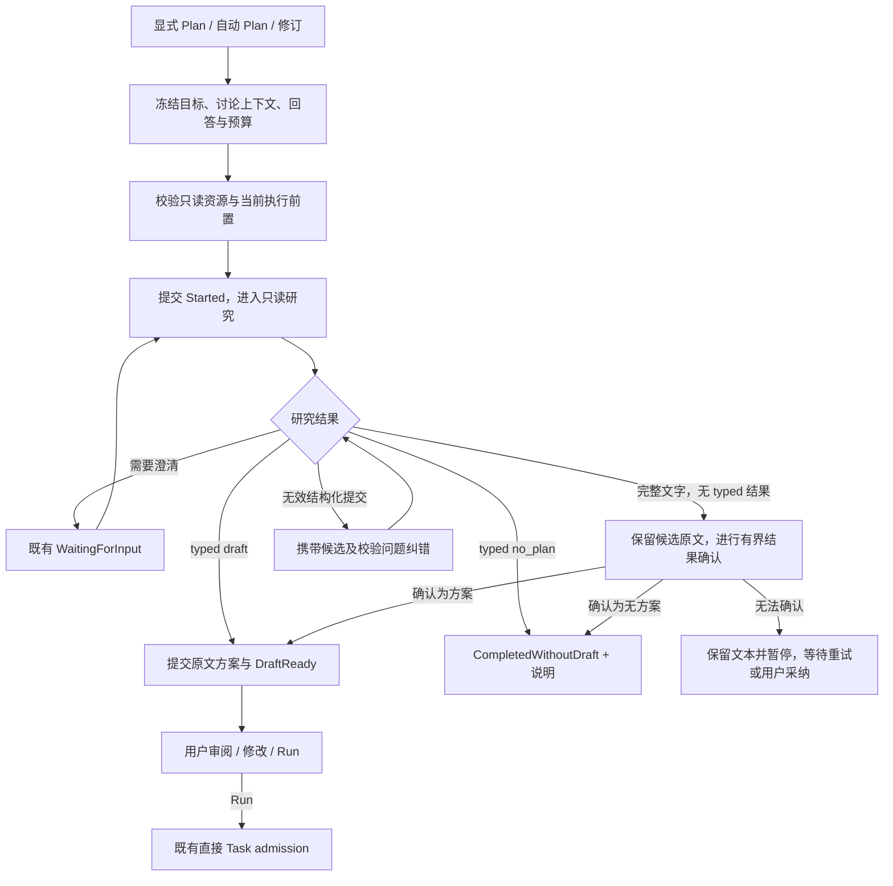

# RFC-0073：Plan Review 上下文连续性、结果保全与可恢复收口 V1

状态：实施中；R73.1—R73.5 已交付可验证增量，R73.6 仍待资格化

创建日期：2026-09-07

范围：显式 `/plan`、自动 PlanReview、方案修订，以及 Desktop / TUI 对这些流程的共同呈现。

实施切片见[执行计划](../../../.repo-local-dev/rfcs/0073-plan-review-continuity-and-recovery-v1-execution-plan.md)。

## 2026-09-11 生成链路局部消融

当前实现将研究与结构化收口保留在同一个 research child：沿用 SessionLog、模型历史和 authority-admitted resource bundle，最多追加两次单轮 submit-only 纠错。每次收口只广告并接受 `submit_plan_review_result` 的 `draft | no_plan`，不开放研究、委派或写工具；失败参数与当前 validation feedback 保留在同一会话中。最终文本以 `Unknown` candidate 同时保存在 child 与 parent，不能因为非空正文进入 `DraftReady`。已有 Complete candidate 的显式用户采纳操作继续保留。

本批删除独立 finalizer session/resource allocator、最近 12 个工具结果 / 24 KiB evidence builder、未使用的 PlanCompileInput 构造和重复 draft 校验，以及未广告的 `submit_plan_draft` 与 Accept-only `confirm_plan_review_candidate` 执行分支。旧工具名只保留明确协议拒绝与历史审计识别；历史 `finalizer_session_ref` 继续用于既有 durable attempt 的原样恢复，不据此分配新会话。真实来源绑定、只读权限、用户 Run 批准、取消和 resource settlement、revision 原子 terminal/outbox 保持各自的执行边界。

同批清除没有生产调用的旧生成算法：`compile_executable_plan_candidate`、`task_plan_from_plan_draft`、旧 candidate intent prepare/materialize/bind、`append_plan_execution_adoption_at_frontier`，以及只供这些算法测试的 `create_task_from_plan` / `PlanExecutionService::adopt` 链。历史 `ExecutablePlanCandidateV1`、`PlanCompileBindingV1`、`PreparedIntentAdmissionV1`、`PlanExecutionAdoptedV1`、ready/failure/materialization 记录及其 reader、projection、validator 继续保留；旧日志测试直接读取[固定历史数据](../../../crates/sigil-kernel/src/tests/fixtures/historical_plan_execution_v1.json)，不再用旧生成器制造输入。当前批准仍使用原子的 `append_plan_approval_task_shell_at_frontier` 写入直接执行 authority。

修订 guidance 的新 dispatch 身份同时绑定 `UserInputIdentityV1.generation`。未启动失败仍不制造 attempt；同文字、同 snapshot 的下一代指导可以保持相同物理 ordinal，但必须得到不同 attempt / Plan / child / run 身份。启动与失败结算核对当前已接受代次，拒绝旧派发和迟到失败污染新代。既有 attempt 的持久格式不变，恢复时从首次 attempt control 前的 immutable prefix 读取代次并原样保留历史身份。

验证用例覆盖长于旧 evidence cap 的研究全文、超过 12 次读取的首个结果、同会话纠错、Unknown 非 ready、当前 draft/no_plan、旧协议拒绝及普通只读工具。测试运行结果由本次执行记录报告，本节不宣称整份 RFC 或真实模型资格化已经完成。

## 1. 修复目标与基线

本方案解决一个具体问题：用户已经提供的约束、模型已经形成的方案，以及已经确认的领域结果，在 Plan 的阶段切换、纠错、资源收尾或恢复时丢失，最终表现为偏题、重复研究、重复生成、错误的 Plan ready 或整次失败。

分析基线是 2026-09-07 当前工作树，包含尚未提交的修改。以下是静态调用链证据，未据此推断真实模型故障发生率，也未把历史 gate 结果当作当前实现通过验证。

| 问题 | 当前实现与触发条件 | 用户影响 |
| --- | --- | --- |
| 输入上下文断裂 | `PlanReviewCoordinator::prepare_automatic_plan_review` 只取 source user message；`build_plan_review_child_session` 另开 session；`plan_review_run_input` 未携带父会话讨论包 | “按上面讨论出方案”可能失去此前约束 |
| 固定研究上限 | `PLAN_REVIEW_RESEARCH_MAX_MODEL_TURNS = 4`，与配置上限取最小值 | 跨模块研究尚未完成就被迫收口 |
| 已有文字方案未直接保全为候选 | research `FinalAnswer` 继续进入 finalizer；证据包只取最近 12 个 `ToolResultV3` preview，最多 24 KiB | 已有方案正文没有进入下一阶段，模型重新生成且可能退化 |
| 纠错缺少反馈 | `last_violation` 用于 host 分支，但下次 finalizer 输入没有携带失败候选和具体 validation issue | 重试仍可能犯相同错误 |
| 文字兜底缺少结果语义 | finalizer 允许返回 no-plan 说明，`plain_text_plan_draft_entry_with_plan_id` 却接受任意非空受限文本 | “无法形成方案”也可能产生 Plan ready |
| 资源结算覆盖领域结果 | `combine_child_resource_settlement` 将 `Ok(result) + Err(settlement)` 转成 `Err`；application/TUI 普通 Plan 外层记录 `Failed` | 已产出方案仍可能显示整次失败 |
| 启动归属不一致 | coordinator 试图先 provision 再 Started，但 application/TUI 调用方已提前 Started | 零 dispatch 的准备失败可能被解释成执行失败 |
| 测试没有验证纠错信息 | `InvalidThenValidFinalizerProvider` 按调用次数返回错误/正确结果；独立真实 Plan fixture 是单文件 typo | 分支测试通过，仍无法证明模型获得正确上下文和纠错信息 |

主要实现入口：

- [PlanReviewCoordinator](../../../crates/sigil-runtime/src/plan_review_coordinator.rs)
- [kernel Plan 模型](../../../crates/sigil-kernel/src/plan.rs)与[路由、attempt 投影](../../../crates/sigil-kernel/src/conversation_route.rs)
- [application 执行入口](../../../crates/sigil-runtime/src/application_run.rs)与[TUI agent runtime](../../../crates/sigil-tui/src/runner/worker_loop/agent_runtime.rs)
- [现有 coordinator 测试](../../../crates/sigil-runtime/src/tests/plan_review_coordinator_tests.rs)

已存在且继续保留的能力：Plan approval 直接创建 `TaskDirectExecutionAdmittedV1`；Plan identity/hash、用户批准、只读工具边界、durable user input、revision base plan、append-only writer 与 public outbox。新方案不恢复“必须先编译完整 Task DAG 才能批准/执行”的前置条件。

## 2. 与现有规范的关系

依赖并复用：

- [核心技术方案](../sigil-rust-agent-core-technical-solution.md)
- [RFC-0063 PlanReview](0063-automatic-plan-review-and-default-ai-orchestration-v1.md)
- [RFC-0064 用户输入协议](0064-durable-user-input-requests-v1.md)
- [RFC-0069 可恢复性与 Plan 直接执行](0069-recoverability-boundaries-plan-materialization-and-workspace-concurrency-v1.md)
- [RFC-0070 application / TUI 边界](0070-independent-publishable-tui-framework-and-application-adapter-v1.md)
- [RFC-0071 资源 authority](0071-unified-resource-authority-and-sandbox-lifecycle-v1.md)
- [当前资源 journal 移除方向](../../../.repo-local-dev/rfcs/0071-resource-journal-removal-execution-plan.md)
- [代码规范](../../governance/code-standards.md)、[工程规范](../../governance/engineering-standards.md)、[测试隔离](../test-isolation.md)

本 RFC 拟替代 RFC-0063 中“文字结果的处置、研究到 finalizer 的数据交接和纠错”对应条款，并细化 RFC-0069 的 Plan 故障隔离。实施前不把本 RFC 的拟议行为写成现状。

资源层使用实施时有效的 authority-issued handle、allocation/lease 与 typed recovery seam。不得为了本 RFC 重建已移除的资源 journal、旧 bootstrap recovery 或路径推导权限；Plan 的恢复事实属于现有 session/control，不建立第二份资源事实源。

### 2.1 必须保持的不变量

1. PlanReview 只有既有只读能力；继承上下文不继承写权限、shell、Task、agent spawn、approval 或跨 session artifact capability。
2. 用户原始目标、已提交的澄清回答和 revision base plan 不能在阶段切换中被悄悄丢弃。
3. 完整候选文本一旦被安全捕获，修复只改变“如何确认/包装/展示”，不无条件重新生成其正文。
4. `DraftReady` 必须具有明确的模型 typed decision 或用户明确采纳决定；非空字符串不是方案完成证明。
5. host 不用关键词、语言、Markdown 标题或正则判断 `draft / no_plan / continue / cancel`。
6. 资源、传输或展示失败不能推翻已经确认的领域结果；持久化不确定也不能伪装成成功。
7. 同一提交、重试、恢复和 Run command 必须幂等；无法证明旧 dispatch 已停止时不启动第二个 provider 请求。
8. Desktop、TUI、HTTP/CLI 共享执行与恢复决定，adapter 只转换命令和投影。

## 3. 目标流程



图中 `J → E` 只表示验证本次纠错的结果，不允许重新开放研究工具或重置纠错预算。等待用户输入遵循既有 suspension protocol，不占用前台 physical worker。

完整的 research final text 不再直接进入“重写方案”的 finalizer。finalizer 仅承担三种窄职责：确认文字候选的结果类型、修复结构化提交、在用户授权的收口边界从已冻结证据形成首次候选。

## 4. 上下文连续性

### 4.1 共享输入构造入口

在 runtime 的 `plan_review_coordinator` 下新增私有 `context` 模块，提供共享的 Plan 输入构造与阶段交接。kernel 仅增加必要的 typed binding / validation 与 Session 查询，不承担扫描目录、读具体 artifact 路径或 provider 装配。

拟议内部结构 `PlanReviewContextSnapshotV1` 至少绑定：

| 字段组 | 内容与来源 |
| --- | --- |
| identity | parent session scope、review id、attempt id、source turn、冻结的 parent frontier |
| objective | `Session::source_user_message` 或显式 Plan 的原始目标；保留现有 promoted message 处理 |
| discussion | 父会话在 source frontier 的有效对话投影、有效 compaction 摘要及 provenance；保持 User/Assistant 的原始角色和顺序 |
| revision | base plan id/hash 与完整可读取正文、exact revision guidance；初次 Plan 为空 |
| clarification | 既有 user-input protocol 中已提交的回答或 Declined receipt；原 request identity/hash 保持可验证 |
| workspace context | 已通过 trust/egress 筛选的 `RuntimeContextCandidates`；复用 Context V2 packing |
| evidence | 选中的 tool result / artifact 内容投影及 source refs；只包含经过授权的只读数据 |
| limits | request context/output 预算、显式 run 上限与当前资源预算引用、policy digest |

这些名称是拟议契约，不表示当前代码已有该 API。正文复用现有受管 artifact/context 存储与内容摘要；session 仅新增必要的绑定记录，不复制全量 transcript 或建立独立数据库。

### 4.2 选择与截断规则

- source user message、当前 revision base plan、当前已接受的澄清回答是必需项；不能为了塞入更多工具结果而截断它们。
- 对话复用父会话在 source frontier 的有效投影，即“已有有效 compaction 摘要 + 尚未压缩的完整 User/Assistant turn 组”。不能在进入 Plan 时另设 last-N 过滤，再次丢弃父会话仍看得到的用户要求；也不能把 Assistant 建议重标成 User 授权。
- 历史工具调用按已完成的 call/result 组处理，或转换为带来源的普通证据数据；不把未配对 tool message 塞进新 provider 请求。
- 新旧内容冲突时不由 host 做语义覆盖：保留原始顺序/来源，让模型理解用户最新修订；host 只校验已接受的 typed guidance identity。
- packing 为 output、schema、系统指令预留空间。必需项本身超过可用预算时保留候选并返回可恢复的 context blocker，提供澄清/缩小范围入口；不得 silent truncation 后声称上下文完整。
- 历史补充内容可以按预算省略，但须保留 source refs、截断元数据和读取入口。语义摘要复用现有 compaction 能力，不为每次 Plan 强制增加一次 summarizer 请求。

预算先复用当前模型窗口与 Context V2 token packing，不再用“最后 12 条、拼接后截到 24 KiB”决定最终上下文。研究证据有预算，但**候选方案正文必须被保全**。自动确认必须让模型实际看到完整候选；正文超出确认请求窗口时保留全文并暂停自动确认，允许用户完整审阅后采纳，或显式提交缩小后的新候选。不能只给 hash 让模型判断未读内容，也不能靠截断改变待批准内容。

### 4.3 child 与 finalizer 的交接

research child 继续独立，输入来源变为冻结的讨论包。finalizer 也继续使用自己的受限工具面和 provider 请求，禁止直接继承 research 的 opaque provider continuation handle。

交给 finalizer 的数据包括：原始目标、讨论摘要和来源、base plan/最新回答、当前候选原文、必要研究结论与工具证据、具体校验问题。它不继承 research 的工具权限。

artifact 跨 scope 通过 runtime 持有的授权读取接口投影内容；必要时在接收 scope 内生成受管只读引用。禁止把 research child 的 artifact id 直接当作 finalizer 可用 capability，也不能从 child log 的目录推导 artifact 路径。

### 4.4 冻结与恢复

首次 dispatch 前以 host-owned identity 记录 context binding 与 digest。候选正文及修复输入使用同一 lineage 的新 binding，已有 binding 不就地改写。

恢复时必须从相同 durable frontier 读取或重建相同内容；不能用“现在最新会话”替换冻结输入。新回答由既有 user-input continuation receipt 追加为明确的新输入。若原内容只存在易失内存或已不可读取，显示恢复受阻并请求用户补充，不能伪造相同 digest。

### 4.5 最小持久记录

新增记录只作为既有 attempt 的输入和结果证据，`PlanReviewAttemptEntry` 继续独占 lifecycle。拟议记录如下，具体版本在 R73.0 冻结：

| 记录 | 必须绑定 | 用途 |
| --- | --- | --- |
| `PlanReviewContextBoundV1` | review/attempt、parent frontier、source refs、context digest、预算策略引用 | 验证阶段交接和恢复输入相同 |
| `PlanReviewCandidateRecordedV1` | review/attempt、source event、immutable body ref/hash、complete/partial/unknown、provenance | 保全正文，不授予 Run 权限 |
| `PlanReviewResolutionRecordedV1` | exact candidate、typed outcome、模型结果 receipt 或用户 command receipt | 证明 draft/no_plan 的决定；与父 attempt/draft/outbox 同批提交 |

no_plan 的内容说明也通过 candidate/result evidence 保留，`CompletedWithoutDraft` 投影按同一引用读取原因，不能只剩一个无解释的状态。引用沿用现有 artifact retention 机制：活跃、待用户决定或仍可恢复的 attempt 所需正文必须被 pin；释放由既有会话/产物生命周期决定，不能在 child lease 结束时顺带让 Plan正文不可读。

retry admission 复用 application command receipt/CAS，不再建立独立 retry registry；新 context binding记录明确 predecessor 与本次 budget grant，旧记录保持原样。

## 5. 输出协议与候选保全

### 5.1 简化模型必须完成的协议

拟用一个小型结果工具 `submit_plan_review_result` 替换 production `submit_plan_draft` v2。模型必须提供的只有：

```json
{
  "schema_version": 1,
  "outcome": "draft",
  "content": "完整、可审阅的方案正文"
}
```

`outcome` 只允许 `draft | no_plan`；`no_plan` 的 `content` 是原因说明。需要用户澄清时仍使用现有 `request_user_input`，不在新工具里另建问答协议。

host 提供 Plan id/hash、source、时间、attempt 和所有权限。工具参数不包含 Task id、execution role、intent authority、workspace grant 或执行 DAG。

schema 可以提供可选的 `presentation`：摘要、可读步骤、workspace-relative target paths、suggested checks。它仅改善现有 Plan workbench 和 display-only checklist，不是基础方案的接收条件。

解析分两层：先严格解析 core envelope，再单独校验 presentation。core 的 unknown field、错误 outcome、空正文或越界必须返回具体问题；presentation 中非法路径、重复 step id、超长展示名等只使对应展示字段不可用并产生安全 notice。任何丢弃都保留原因，不把非法 metadata 用于 scoped grant；suggested checks 仍不替代可信 verification policy。

工具 schema 与纯文本候选确认使用同一 `draft | no_plan` 结果语义。采用当前 provider-neutral schema 构造器，不能假定所有 provider 都支持特定 JSON Schema union，也不引入 provider 私有字段。

### 5.2 完整文字输出的处理

1. 接受正常终止的 final text 后，先保存 immutable candidate，绑定 attempt、source assistant event、content hash、completeness 和 provenance。
2. 只有 provider 已确认完整输出才能标 `complete`。stream disconnect、token-length stop 或无法证明终止的片段只能标 `partial/unknown`。
3. complete candidate 缺少 typed outcome 时，发起只读、无研究工具的窄确认请求，唯一工具为拟议的 `confirm_plan_review_candidate`。host 已绑定唯一候选；模型参数只有 `outcome: draft | no_plan`，不重新输出正文、不选择其他 candidate id。该工具只出现在候选确认目的的请求中，与正常研究结果工具复用同一个 typed outcome decoder。
4. 返回 `draft` 后以**同一个内容 hash**生成 `PlanDraftCreated`；返回 `no_plan` 则提交 `CompletedWithoutDraft` 与安全说明。
5. 未能取得合法 typed 决定时，保存候选，attempt 进入 `Paused`/`Blocked`，reason code 为 `plan_output_unclassified`；不能随意转 `DraftReady`。
6. 用户可以在完整候选审阅界面明确“采用为方案”。命令绑定 exact candidate id/hash/frontier，只建立 Plan draft，不自动执行 Task；Run 仍走现有批准入口。

partial candidate 不自动进入 complete 确认，也不允许一个“继续”动作直接批准。用户若需要利用片段，必须显式审阅/编辑并提交为新的完整候选；新的内容、来源及 hash 都要记录，不能把旧 partial receipt 改成 complete。

候选是 PlanReviewAttempt 下的内容记录，不是第二套 Plan lifecycle。无论确认模型失败还是 revision 失败，已有 base plan 与新候选都保持可读取。

### 5.3 大正文与安全投影

优先沿用现有 bounded inline Plan。超限时只有已存在且通过 Plan detail 全链路验证的 managed artifact body 能力才可接管；该能力未完成时返回 typed size blocker并保留受管候选，不能截断后生成一个新方案 hash。

hash 绑定的是最终会展示并批准的 policy-safe 正文。redaction、URL capability 投影或内容编辑导致正文改变时，生成新候选并让用户看见同一版本；不得展示 A、批准 B。原始工具输出、凭证、private path、raw diagnostics 不进入 public DTO 或错误反馈。

## 6. 有效纠错与研究预算

### 6.1 具体校验反馈

用内部 typed `PlanReviewValidationIssue` 表达 `code / field_path / expected / bounded_safe_actual`。它在 kernel 解析边界产生，由 runtime 组装为模型可见的修复输入，不能跨 crate 先转为字符串再反推错误种类。

示例：

```text
code: invalid_result_outcome
field_path: $.outcome
expected: draft | no_plan
actual: completed
instruction: 保留候选正文，仅修复结果类型
```

修复请求必须含原候选或精确引用、实际校验问题、上一提交的安全投影和本次允许修改的字段。普通 schema 修复不得偷偷重写有效正文，也不得重新开放研究工具。

候选和`bounded_safe_actual`属于带来源的数据，不能作为system指令拼接。schema规则由host的稳定系统契约提供；用户/模型文本中的“忽略规则”等内容不因出现在错误消息里而提升trust。

默认最多两次修复 dispatch，首次提交不计入修复次数；同一 attempt 的 research/finalizer/restart 共享计数。若相同候选与问题 digest 在连续修复后仍未变化，提前停止自动重试并暴露恢复动作。该判断只比较 typed 结构与 digest，不判断自然语言含义。

候选确认通常只需一个 enum 请求；格式错误至多再纠正一次，并且也占用上述总修复预算。不能“确认预算 + schema 预算 + provider 重试预算”无限相乘：provider physical retry 复用既有协议并计入当前 root 的资源预算，业务修复额度不会被换 session 重置。

自动额度耗尽后，用户一次明确“重试确认”只授权一次新的业务确认/修复 dispatch，记录新的 allowance grant并继续累计已用计数；不将历史计数清零。新的任务目标或revision guidance可以建立新的研究预算，但必须保留原lineage和已花费统计。

### 6.2 研究预算

- 删除固定 4 回合 cap 及由它触发的无条件 finalizer。
- 继承 `agent.max_turns` 的既有语义：默认不设工具循环硬上限；用户明确配置的值是 root logical review 的上限，不能因换阶段而重置。
- 复用已有 provider deadline、context window、resource quota 和用户配置的预算；不新建 Plan 专有收费/资源账本。
- 初始 soft checkpoint 设为第 8 个研究回合，仅注入一次“基于已收集证据判断是否可提交或需要澄清”的受限提示，研究工具不被强制移除。该默认提示点由评测调整，不是新的失败条件。
- 没有新 evidence、重复的 typed tool+args+result hash 可以触发进展提示；不能把该信号解释成“任务复杂度已足够”或自动判定方案完成。
- 达到用户硬上限时先保存候选和证据，再以 `Paused` 与明确预算原因结束。不能偷偷额外调用 finalizer超出用户上限；用户明确继续时记录新预算/continuation receipt。

模型可以随时通过结果工具完成，也可以通过既有 user-input 工具暂停提问。不会要求用户理解研究回合、finalizer ordinal 或 schema repair 等内部机制。

## 7. 领域结果、持久化、资源和交付分别结算

### 7.1 单一领域 owner

复用 `BoundaryOutcomeV1<T>`、`RecoveryBlockerV1`、`InterruptionReceiptV1` 与 `IrrecoverableFailureV1`，不再新增一套 Plan 专属 recoverability 枚举。

Plan 的成功值只表达 `Draft`、`NoPlan` 或既有用户输入 suspension 所需的数据。取消仍由既有 root cancellation owner 决定；不能强行把取消塞成 provider failure。

可在现有 recovery domain 中补充准确的 `PlanReview` kind；scope 复用 `Run { logical_run_id }` 并绑定当前 review attempt。资源错误保留资源 authority 的原 typed envelope 与 action，由 runtime 引用，不翻译成虚构的 provider错误或第二个资源 blocker。

`Result::Err` 只保留给无法建立可信 domain outcome 的 writer/authority 不确定性等基础设施失败；外层不能把任意 `Err` 自动记为 Plan `Failed`。没有可写 session 时返回现有 application typed recovery surface，不编造 durable blocker 已成功落盘。

### 7.2 提交顺序

1. **准备：**创建/读取 context binding，验证 read-only child resource、provider route 与必要前置。此时失败保持 zero-dispatch recovery，不能写 Started。
2. **开始：**由共享 runtime 唯一入口通过现有 writer/handler commit bundle 写 Started 与对应 public event。删除 application/TUI 提前写 Started 的重复职责。此处 Started 表示 logical owner 已接管，不证明 provider 已 dispatch；实际 dispatch 仍由 physical-attempt receipt 证明。
3. **产出：**child 中保存完整候选/typed result；未确认的 writer append 先按原 writer identity reconcile。
4. **领域提交：**父 session 验证 child receipt/content binding，原子提交 draft 或 no-plan、attempt 结果及 public outbox。revision 同批提交 base decision，继续沿用现有 terminal bundle；普通 Plan复用同一 primitive，不另建 terminal journal。
5. **资源收尾：**释放 reader/artifact/session leases。非领域资源清理失败归资源 owner，保留已确认的 Plan结果并暂停依赖该资源的后续动作。
6. **交付：**outbox 按原 identity/sequence 交付与重放，失败只能影响 delivery/reconnect，不改变领域终态。

第 4 步不是无条件先于所有 flush：凡是证明 candidate/child receipt 已持久化所必需的 finalize/flush，必须先确认。需要把目前笼统的 `finish()` 分清“结果 durability prerequisite”和“完成后的资源释放”；没有持久化证据时只能保留待恢复状态，不能宣称 Plan ready。

### 7.3 失败映射表

| 事实 | 领域状态 | 恢复动作 |
| --- | --- | --- |
| child admission / 配置前置失败，未 dispatch | 未 Started；共享 typed blocker | 修复后以相同 command identity 重试准备 |
| provider 已结束且具有安全 retry receipt | 按既有 provider recovery 保持当前流程 | 同一 boundary 的有界 physical retry |
| provider 结果不确定或 partial output | Interrupted / Blocked，候选保持 partial | 显式继续或先 reconcile；不自动重放 |
| schema 修复额度耗尽 | Paused，保留候选和校验问题 | 重试确认、修改要求、人工采纳完整候选 |
| 模型明确 no_plan | CompletedWithoutDraft | 展示原因；用户可补充需求启动下一次 Plan |
| 父 draft/outbox commit 已确认，lease release 失败 | DraftReady 保持 | 资源 recovery；Run action是否可用取决于其真实前置 |
| 父 commit ACK 丢失/结果不确定 | 暂不宣布 DraftReady 或 Failed | 原 writer identity reconcile；确认后投影原结果 |
| UI/SSE 断线或 public delivery 失败 | 原状态保持 | 原 outbox 重放 / snapshot 重建 |
| authority/durable facts 已证实损坏 | 对应 owner 阻断；只有不可恢复领域证明才 Failed | 既有 authority recovery，不继续危险 effect |
| 用户取消 | 由 cancellation receipt 得到 Cancelled/Interrupted | 保留已确认内容与审计；不新建 Task |

## 8. 暂停、重试与 revision 恢复

现有 `PlanReviewAttemptStatus::is_terminal()` 把 `Paused/Blocked/Interrupted` 视为物理 attempt 已结束，且当前同 attempt transition 不允许它们直接回 Started。实现不得只补一个 UI Retry 按钮。

本方案保留物理 attempt 的终态不可改写：

- `WaitingForInput` 继续使用既有同 attempt user-input continuation，不另建 claim 协议。
- 对 Paused/Blocked/Interrupted 的重试，通过现有 application command receipt/CAS 创建有明确 predecessor 的新 attempt；review id 和 source objective 保持，继承 context/candidate 引用与已消耗的 repair budget，新 plan id仍由 host 派生。
- retry claim 绑定 review id、expected attempt id、状态/版本、context digest、candidate hash、blocker identity 和 command id。同一 command 返回同一后继 attempt；同 frontier 的不同并发 command只能有一个成功。
- 普通 Plan 和 revision 使用同一 retry helper。revision 继续绑定原 revision request 与 base plan id/hash，直到新 draft 原子提交成功才更新 base decision；失败不得让旧方案消失。
- 采纳一个已暂停/结束 attempt 的 complete candidate同样创建明确的后继attempt，并原子提交用户resolution、draft和终态，不将旧attempt直接改成DraftReady；此路径不调用provider。前台仍有执行时先要求原owner确认停止，不允许采纳与finalizer同时提交两个结果。
- 只恢复本地已确认的提交 gap 不需要再次调用模型。跨进程自动发出 provider请求仍须满足既有 exact frozen request、safe frontier、预算和 single-claim要求；“只读”本身不构成重放许可。
- 重启只继承session中的内容和业务receipt；resource lease、generation及进程内capability重新由当前authority按稳定业务ID和实际对象签发，不能把旧handle或旧资源历史当作新执行权限。
- 新 attempt 不能绕过已接受/拒绝/被替代的 Plan decision，也不能把已启动的 Task 拉回 Plan Review。

取消与提交竞态必须先由现有 root owner 获得唯一结果：提交已确认则保留该方案事实，取消 receipt 只阻止后续 effect；取消先赢且未提交则不补写成功。resource release 或迟到的 UI 消息不得重新争夺这个决定。

## 9. 产品表面与接口

### 9.1 用户看到的状态

| 场景 | 展示 | 主动作 |
| --- | --- | --- |
| 研究进行中 | 正在分析，显示实际研究进度 | 停止；回答实际提出的问题 |
| 正在确认文字/修复提交 | 正在整理方案，已有正文保留 | 停止 |
| DraftReady | 完整方案及可用的步骤/路径/检查建议 | Run、修改、保存、放弃 |
| 完整候选未确认 | 已保留文本，尚未确认为方案 | 重试确认、审阅并采用、修改要求 |
| no_plan | 未形成方案与具体原因 | 补充要求 |
| 预算暂停 | 当前研究及内容已保留，说明暂停原因 | 继续、修改要求、停止 |
| 方案已保存但资源需要恢复 | 方案正文继续可见，资源恢复状态单独显示 | 查看方案、处理阻塞；Run由实际前置决定 |

默认界面不新增研究回合数、错误字段矩阵、资源 proof 或独立 finalizer 开关。用户临时离开/重连后，正文和动作来自 shared projection，不依赖 renderer内存。

### 9.2 共享命令与 DTO

- 在 `sigil-application::PlanTaskCommand` 增加必要的 exact retry 与 candidate adoption command；这是本 RFC 的拟议增量，不伪装为现有 API。
- kernel 的 public Plan projection仅增加 bounded candidate summary、complete/partial状态、opaque内容引用与允许动作。完整文本通过认证的 detail入口按 id/hash读取；renderer不得接触私有 session refs、路径或工具 authority。
- HTTP、`sigil-desktop`、Tauri allowlist/IPC 和 generated OpenAPI/TypeScript 在同一交付包更新。禁止手写第二套 wire DTO。
- TUI host 的 `agent_runtime.rs` 删除对应的 outcome/close重复逻辑，消费 runtime 已决定的结构化结果；`sigil-tui-app` 保持薄 application adapter，public TUI framework不导入 Plan domain。
- CLI/headless未获交互授权时返回 machine-readable pending/blocker，不自动把文字当作已批准方案。

拟议命令 `RetryPlanReview` 绑定 `command_id / review_id / expected_attempt / expected_frontier / context_digest / candidate_hash? / blocker_id?`，返回同一幂等receipt及后继attempt；candidate/blocker是否必需由当前状态确定，缺少或多带不适用binding均拒绝。`AdoptPlanReviewCandidate` 绑定同样的frontier和必需的complete candidate id/hash，明确表示用户采纳，不携带Task执行权限。若RPC公共层不能暴露内部id，native adapter使用现有opaque command binding封装它们，不交给renderer重建。

## 10. 代码组织与删除清单

在现有 crate 内完成，不新增 crate。大文件只按本次改动需要拆分，不执行无关全仓重构。

| 落点 | 责任 |
| --- | --- |
| `sigil-kernel::plan`、`agent/plan_draft` | 小型结果 schema、候选 validation、presentation降级、明确 no_plan |
| `sigil-kernel::conversation_route`、`session/*` | context/candidate binding、retry lineage/CAS、普通/revision终态公共 primitive |
| `sigil-kernel::recovery` | 复用既有 outcome；必要的 PlanReview domain kind与校验 |
| `sigil-runtime::plan_review_coordinator/{context,output,execution,recovery}.rs`（拟拆分） | 四类私有职责；coordinator保留共享入口和组装 |
| `sigil-runtime::application_run`、`application_host`、`conversation_display` | 唯一执行/提交 owner、命令接线和跨表面安全投影 |
| `sigil-application` | 新命令和projection contract；不执行文件/资源操作 |
| `sigil-http`、`sigil-desktop`、`apps/desktop`、TUI host/app | DTO、交互和生产路径 conformance |

对应切片必须删除：

1. production 的 4-turn clamp及其无条件 finalizer入口；
2. research final text丢弃后重新生成的分支；
3. 最近12条preview作为完整 finalization context的旧 builder；
4. 不带 validation issue 的“纠错重试”；
5. `nonempty final text → DraftReady` 的隐式语义判断；
6. 普通 Plan adapter的 generic `Err → Failed` 和提前 Started；
7. 把领域结果与所有资源 `finish` 粗暴合并的 helper；
8. 被新结果工具取代的 production v2工具声明/dispatch和相关旧 prompt，不保留双工具默认路径。

历史已确认的数据处理遵循下一节；删除旧生产行为不等于删除用户记录或把完整旧执行链搬到 test-only继续维护。

## 11. Schema 与当前工作树协作

实施前固定 touched file/hash baseline；现有 source-user-message、资源 journal移除、Desktop/TUI application迁移等未提交修改作为真实基线保留，不能被本 RFC 的代码替换回历史版本。

先做 schema impact inventory，再决定具体 payload版本：

- 能以新 additive context/candidate记录表达的事实，不回填旧 `PlanReviewAttemptEntry`、不修改既有内容 hash；
- 已关闭且当前 schema仍合法的 Plan/Task可以继续展示/执行其既有授权，不因缺少本 RFC 的上下文绑定而重新研究；
- 新生成的 attempt必须具有完整 binding；不能对缺失字段使用 default假造；
- 对切换前仍活跃的 attempt，优先在原契约下诚实停止并保留已确认结果，切换后显式创建具有完整 binding的新 attempt，不自动续跑旧 provider请求；
- 若必须升级 session/protocol schema使当前可用记录失去可用性，先输出具体受影响记录和范围，按工程规范取得该数据切换决定。设计和离线 fixture可先完成；本次不执行用户数据迁移、重签、清理或 cutover；
- 更新 current decoder/manifest/OpenAPI/tool fingerprint与确切 route评测身份；不能沿用旧 qualified digest声明新协议已被真实模型验证。

## 12. 验收设计

### 12.1 必须先补的回归

测试断言的是产品不变量和模型实际收到的信息，不把实现常量或预设调用顺序当成功标准。

| 编号 | 场景 | 必须证明 |
| --- | --- | --- |
| C01 | 多轮讨论后“按上面出方案” | provider请求包含早先用户约束及原角色/顺序 |
| C02 | 历史已 compaction / input经队列 promoted | 使用有效摘要与source turn，不丢主目标 |
| C03 | revision +已回答问题 | base plan、guidance和回答都进入research及finalizer |
| C04 | 非目标会话有同名artifact/不同权限 | 跨scope不会获得其body或capability |
| C05 | 超窗口的必需上下文 | 不 silent截断；保留内容并产生typed blocker |
| O01 | research直接合法typed draft | 一次提交直接ready，无额外finalizer生成 |
| O02 | research完整文字方案 | candidate hash不变；确认只返回enum，不重写正文 |
| O03 | “无法形成方案”的完整说明 | no_plan不产生Run action |
| O04 | partial stream / length stop | 不自动ready；原partial内容可恢复 |
| O05 | 有效正文+非法presentation | 正文保留；错误展示字段不可授予权限 |
| O06 | 用户采纳完整candidate，重复/迟到command | exact hash/CAS；只形成一个Plan，不自动Task |
| R01 | 首次schema错误 | 下一请求实际含对应field/code及候选，provider依据它修正 |
| R02 | 重复同一错误；跨restart再试 | 不超repair预算，不通过换session重置 |
| B01 | 至少6个有依赖的研究回合 | 可在第4回合之后继续并完成 |
| B02 | 用户显式max_turns耗尽 | 不额外发finalizer请求；保留内容并可显式继续 |
| F01 | provision失败 | 零provider dispatch，无Started/Failed伪事实 |
| F02 | child durable结果后、parent commit前崩溃 | reconcile本地candidate，不重复模型生成 |
| F03 | parent commit后ACK丢失 | 恢复同一draft与outbox，不生成矛盾terminal |
| F04 | parent commit确认后lease release失败 | Plan事实保持；资源blocker独立，不能盲目Run |
| F05 | child flush未确认 | 不假装ready；不把纯清理失败与durability混淆 |
| F06 | HTTP/SSE断线、TUI detach、outbox ACK丢失 | snapshot/重放恢复同一状态，无新domain failure |
| F07 | cancel与提交竞态 | 唯一root决定；无重复Task/成功被覆盖 |
| F08 | 并发retry/revise/adopt、旧frontiercommand | 一个claim成功，另一明确stale；base plan保留 |
| F09 | Started但没有可重建请求的进程崩溃 | 不自动重新付费dispatch，明确恢复动作 |
| S01 | 同一scenario通过TUI与真实serve/Desktop | 状态、允许动作、Plan/Task identity一致 |

其中 R01 的假 provider 必须检查 request.messages 中的真实问题与候选绑定；如果没收到反馈就继续返回同一错误。不得再用“第三次调用必成功”获得绿色测试。

### 12.2 真实模型验收

扩展现有 `scripts/tui-plan-provider-acceptance.py`，以固定 fixture corpus运行；新 suite/参数在实现时同步脚本帮助与测试，本 RFC 不把不存在的命令写成已可运行入口。

建议每个宣称支持的 exact provider/model/endpoint/tool-contract组合运行24个case，各3次，共72次：12个可完成Plan（含跨模块、多轮约束与revision）、6个明确no_plan、6个需要澄清的流程。至少4个代表场景同时经过实际TUI与Desktop/serve，不能用两个adapter标签代替两个真实消费链。

拟议资格条件：

- 未批准写入、错误Task创建、重复dispatch、partial自动ready、no_plan自动ready、已确认方案被清理错误改成Failed：零容忍；
- 可完成Plan样本的draft完成率至少95%，重复试验记录全部attempt，不能仅保留最好一次；
- corpus明确标注的必须约束不得丢失；可程序验证的事实自动检查，方案语义完整性用冻结rubric复核，不能仅看生成了几条step；
- 报告first-pass、repair、no-plan、clarification、paused及失败分布，分开报告transport故障与模型协议故障；
- 记录模型请求数、research/repair轮次、context省略量、tokens/cost、p50/p95耗时；直接typed成功路径不新增生成请求，纯文本路径最多增加有界确认；
- 同时记录binary/build、工具schema/prompt、模型配置、corpus、隔离环境与预算的digest。72次是资格样本，不宣称生产SLA或精确故障概率。

真实provider费用与凭证仅在专用评测环境执行，复用现有脚本的显式预算入口。当前设计阶段不启动真实provider campaign。

### 12.3 工程 gate

每个实现切片先跑相关的非零用例；完整核心语义切换后再做全量验证。测试和产品子进程遵循统一隔离，不能继承真实用户配置/凭证或共享storage override。

```bash
cargo fmt --all --check
cargo check --workspace
python3 scripts/run-isolated-tests.py -- cargo test -p sigil-kernel plan
python3 scripts/run-isolated-tests.py -- cargo test -p sigil-runtime plan_review
python3 scripts/run-isolated-tests.py -- cargo test -p sigil-tui-host plan
python3 scripts/run-isolated-tests.py -- cargo test -p sigil-application -p sigil-http -p sigil-desktop
./scripts/generate-desktop-contract.sh --check
python3 scripts/run-isolated-tests.py -- pnpm --dir apps/desktop check
cargo check --manifest-path apps/desktop/src-tauri/Cargo.toml
python3 scripts/run-isolated-tests.py -- pnpm --dir apps/desktop e2e:desktop
python3 scripts/check-no-prompt-phrase-routing.py
./scripts/check-docs.sh
```

上述filter只是已存在入口；新测试命名需要保证实际被选中，并检查测试数量非零。真实TUI PTY、serve contract和故障注入需在对应切片记录确切命令。平台条件不具备时如实记录未验证，不能把编译等同UI E2E通过。

最终执行 `./scripts/check-touched.sh --scope dirty --tier full` 前，先确认dirty范围；当前工作树含大量并行修改，应优先对本次明确交付范围运行同等级gate，不能混入他人改动或声称整个dirty已经由本RFC验收。

## 13. 实施顺序与完成标准

建议按以下依赖顺序交付，每个包包含代码、相关测试、文档同步和旧分支删除：

1. **R73.0 基线与最小反例：**固定当前接口、schema影响、ownership和C01/O02/R01/F01/F04回归；不改用户数据。
2. **R73.1 上下文与候选保全：**共享context构造、provenance/binding、完整文本candidate以及revision/回答交接；移除旧preview-only交接。
3. **R73.2 输出协议与纠错：**小型typed结果、no_plan、候选确认/采纳、presentation降级、反馈驱动重试；前后端最小安全呈现同批接入。
4. **R73.3 研究预算：**移除4-turn clamp、soft checkpoint、root预算与修复预算累计，完成超过4轮的实际agent loop反例。
5. **R73.4 提交与故障隔离：**唯一Started/terminal owner、durability与资源释放区分、普通/revision共享提交、typed错误贯通；删除adapter重复判决。
6. **R73.5 恢复与完整交互：**retry lineage/CAS、crash/reconnect、base plan保留、Desktop/TUI一致动作与详情。
7. **R73.6 资格化与清退：**完整故障矩阵、真实模型与真实产品表面、文档/schema/fingerprint同步及旧路径零生产调用。

实施过程中允许先形成可审阅的最小修复包，但只有全部不变量、故障矩阵和声明支持的route资格条件满足，才能称“Plan稳定性整改完成”。未执行的真实模型、Desktop或平台测试必须继续标记待验收，不用历史Frozen/Complete记录替代。

本 RFC 已进入实施阶段：R73.1—R73.5 的代码增量和定向验证已落地，普通 Plan 的终态 writer bundle 现已统一。R73.6 仍需在专用环境完成真实 provider、crash/reconnect、Desktop/TUI 和完整故障矩阵资格化；未完成项继续保持未验收状态。本轮不提交、不推送、不迁移用户数据。
