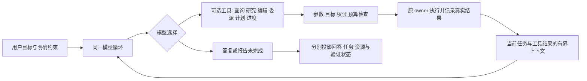

# RFC-0077：模型自主决策与 Harness 职责收敛

日期：2026-09-22。状态：**implementation complete；R77.0—R77.8 已完成，完整真实模型资格化通过**。

实施台账：[R77 执行计划](../../../.repo-local-dev/rfcs/0077-model-autonomy-and-harness-boundaries-v1-execution-plan.md)。

## 1. 目标与边界

Sigil 提供模型可以选择的工具，并负责可靠执行、权限、资源、上下文与持久化。是否规划、怎样调查、怎样拆分、何时委派、如何应对业务失败、如何组织结果，由模型根据用户目标决定。

用户选择“只读”“先给方案”“必须独立审查”“不得联网”等约束仍然有效。它们约束可执行效果或交付要求，不自动生成一条 host 规定的业务流程。一个工具不可用，不意味着 host 可以代替模型选择另一项业务动作。

本 RFC 处理七项当前限制及旧协议残留。采用现有 crate、agent loop、工具、权限分析、application contract 与日志，不新增 workflow engine、任务规划器、策略 DSL 或第二套恢复系统。

本 RFC 初稿阶段仅获准设计；用户随后明确授权按执行计划实施，并要求不保留旧代码或历史数据兼容。日志继续 append-only，不自动改写或删除用户文件；遇到已退役 schema 时明确失败，不转换旧语义。R77.8 已使用专用配置与 USD 1,000 调用预算完成 DeepSeek V4 Flash 的 50-fixture × 3-repetition 真实模型资格化；150/150 repetition 被接受，route gate 为 Qualified。逐项数据、误路由率和费用见 [R77 执行计划 §6](../../../.repo-local-dev/rfcs/0077-model-autonomy-and-harness-boundaries-v1-execution-plan.md#6-实施证据台账)。

## 2. 当前基线与问题映射

依据为 2026-09-20 的工作区源码，包含尚未提交的改动；旧 RFC 的完成标记不能替代当前调用链证据。

已经具备的基础：普通新请求直接暴露业务工具；新 Task 进入 direct root loop；批准 Plan 不再编译 Task DAG；`wait_agent` 可返回有界第一页；普通 Task 不再要求 completion claim。本 RFC 不重复实施这些能力。

| 编号 | 当前限制及源码 | 目标 |
| --- | --- | --- |
| A1 | [agent.rs](../../../crates/sigil-kernel/src/agent.rs) 根据 pending Plan/Task 切换 routing-only 工具面；[conversation_route.rs](../../../crates/sigil-kernel/src/conversation_route.rs) 要求状态询问也继续 Task | 所有普通请求保留实际工具；查询与继续执行分离 |
| A2 | [run_options.rs](../../../crates/sigil-runtime/src/run_options.rs) 的 Plan 白名单和 deny names/prefixes 禁止 Web、MCP 等研究能力 | 按可信能力和逐次调用权限限制效果，不按研究方法封锁 |
| A3 | [result_pages.rs](../../../crates/sigil-runtime/src/agent_tools/result_pages.rs) 的预算错误要求父模型不得接手 | 返回容量与执行事实，由模型决定等待、缩减或接手 |
| A4 | [runner.rs](../../../crates/sigil-kernel/src/task_orchestrator/runner.rs) 自动启动首个 todo；[task_checklist.rs](../../../crates/sigil-kernel/src/task_checklist.rs) 限制一项进行中 | 进度完全由模型维护，允许真实并行进度 |
| A5 | [spawn.rs](../../../crates/sigil-runtime/src/agent_tools/spawn.rs) 拒绝 Direct Task 的 background；写子代理也受后台能力限制 | 补齐同一 background owner 的生命周期，按实际 capability 开放 |
| A6 | [agent_tools/runtime.rs](../../../crates/sigil-runtime/src/agent_tools/runtime.rs) 对部分 join 结果要求全文分页投递才允许最终回答 | 等待所选子任务结束与读取正文解耦，正文按需读取 |
| A7 | [plan_review_coordinator.rs](../../../crates/sigil-runtime/src/plan_review_coordinator.rs) 的 finalizer 清空研究工具并固定单回合提交 | 一个只读模型循环，提交错误按普通工具错误修正 |
| A8 | [task_orchestrator/prompts.rs](../../../crates/sigil-kernel/src/task_orchestrator/prompts.rs) 等仍有固定 discovery、participant、synthesis 协议残留 | 删除已无生产调用的业务阶段和强制提示，不保留隐蔽旧引擎 |

相关设计：[模型负责 Task 编排](../../../.repo-local-dev/rfcs/model-owned-task-orchestration-2026-09-19.md)、[最小内核与可选能力](../../../.repo-local-dev/rfcs/0074-minimal-core-and-optional-capability-composition-v1.md)、[RFC-0073](0073-plan-review-continuity-and-recovery-v1.md)。前两份文档的目标方向继续有效，但 Plan finalizer、全文结果门禁与后台能力的现状以本表为准，不能从历史勾选项推断已经完成。

## 3. 决策与执行的分工

| 决定或事实 | Owner | 执行规则 |
| --- | --- | --- |
| 下一项业务工作、调查方法、是否先计划 | 模型 | 通过正常答复或工具调用表达，不先填路由分类表 |
| 委派、并行、等待、失败后改方案 | 模型 | 在用户授权、实际能力和预算内自由选择 |
| 用户显式限制与批准 | 用户，host 记录 | 限制不因换工具、切模式或子代理而放宽 |
| 工具参数、身份、目标版本和幂等 | kernel/runtime | 检查结构和准确对象；不理解用户自然语言后重判意图 |
| 文件、网络、进程、外部应用权限 | 现有权限与资源 owner | 按实际效果执行批准与隔离；模型文字不能覆盖 |
| 资源占用、取消、未知效果、可安全重试性 | 原 execution/resource owner | 返回事实并进行必要物理收尾；不自动业务重规划 |
| todo、目标覆盖、内容是否充分 | 模型 | 仅为报告，不升级成已验证事实 |
| 验证结果与已执行动作 | 原工具/验证 owner | 原样呈现，不被最终答案或 todo 改写 |

不要求模型证明“为什么不规划”“为什么不用子代理”“为什么已经读够”。不新增 `approve_my_strategy`、`declare_result_understood` 或 mandatory progress/finish 工具。`PlanReview` 表示用户选择的只读研究和计划产物，`Task` 表示持久目标与控制对象，都不拥有独立业务决策引擎。

## 4. A1：对象绑定不再接管对话

### 4.1 普通请求的工具面

不论是否有 pending Plan/unfinished Task，首轮均提供当前用户权限允许的实际工具。当前对象的状态以有界事实放入上下文；存在对象不意味着用户本轮要操作它。

复用现有 `continue_existing_task`、`run_pending_plan`、`request_plan_review` 等正向工具，按需调用。删除 routing-only microturn、负向 `continue_without_task_planning`、仅为退出路由而使用的 `keep_pending_plan`、专用 routing retry/fallback 及隐藏自由文本的过滤器。未调用操作工具时，pending Plan 与 Task 状态自然保持。

查询优先复用现有 application projection 并注入必要摘要。需要刷新时增加一个窄查询工具 **`inspect_current_task({})`（拟议）**，只返回当前绑定对象的状态、todo、子代理状态、检查摘要及截断标志；不创建 attempt、不切换 focus、不启动 executor、不获得写权限。没有当前对象返回明确空状态。

`continue_existing_task` 保留 `resume_task | apply_current_request_as_guidance` 的真实操作区别，删除固定 `reason=continue_current_task` 填报以及“状态询问也必须调用”的描述。是否继续由模型选择；状态查询不产生继续记录。

### 4.2 准确身份和并发

继续沿用 host 在请求装配时冻结的对象身份、source turn、plan hash、generation 和 authority；这些字段不交给模型复制。模型不能传裸路径或自造 Task id 获得权限。

用户显式选择的 Task/Plan 或当前 session 对象就是工具的绑定目标。多个对象含糊时允许模型询问用户或使用已有列表/选择入口，不猜“最新对象等于用户所指对象”；本 RFC 不新增通用对象句柄平台。

对象在 provider 回合中变更时，查询返回新事实；写入/继续/批准调用返回 typed stale/conflict，零新业务 dispatch。不能 silently retarget。批准既有 Plan 保留原 CAS、权限及幂等性，重复请求不新建第二个 Task。

控制工具与互斥业务效果仍不可在同一未确定顺序的 batch 中一起执行；复用现有冲突/顺序规则明确报错。禁止以存在 pending Plan 为由封锁与该 Plan 无关、且用户本轮已授权的操作。用户明确选择的只读研究约束仍作用于本轮所有工具。

## 5. A2：Plan 的只读边界按能力表达

替换 `build_plan_review_tool_registry` 的固定名字清单，复用现有 `ToolSpec`、可信 registration/执行契约、`ToolPermissionEffect`、逐调用 permission plan 和 containment。工具描述或 MCP 的 `readOnlyHint` 不是可信权限证明。

| 能力 | Plan 中的目标处理 |
| --- | --- |
| 文件读取、代码导航、工作区查询 | 按 workspace/外部目录权限提供 |
| Web 搜索、获取、网络只读查询 | 按网络与信息外发策略提供；只读文件系统不表示联网自动获准 |
| MCP 只读调用 | 经现有 trusted registration 与调用分析确认可约束效果后提供；不能仅凭 server 自称 read-only |
| shell/命令 | 仅在现有结构化分析和实际隔离能证明满足本轮只读边界时执行；不依赖命令前缀或自然语言解释 |
| 子代理 | 允许模型选择继承 Plan 只读约束的可信 profile；delegation 权限、预算与深度继续生效 |
| 工作区写入、远端修改、未知效果 | 当前只读授权不足时拒绝或请求明确改变授权；不能把普通工具 Ask 当作退出 Plan 的授权 |

有可信最大效果范围的工具按范围决定可见性；混合能力工具可以公开 schema，在调用时精确检查。缺少可信能力信息且无法隔离的外部工具保持 unavailable 并说明能力缺口，不以名字放行。

Plan 草案、日志、临时缓存由已有 managed owner 按其资源授权写入；不把这些必要内部写入误当模型获得任意工作区写权限。增加新工具不需要再修改 Plan 工具名黑名单。

## 6. A3：资源失败不规定替代业务动作

预算错误复用现有 typed error/details，返回 scope、容量限制、是否可等待、已经接受/启动的成员及已有 thread 引用。删除无条件 `do_not_self_complete_delegated_scope`，删除强制“询问增加预算，不得自己做”的 `next_action`。

host 不因工具失败而自动重试、自动缩批次或改由父模型执行。它把事实反馈给模型，由模型自行选择；模型亲自执行仍走同样的实际工具权限。

仅用户明确要求的独立性、隔离或特定执行者才约束替代方案。这些要求作为原始用户上下文/已接受约束传递，不通过关键词构造新的 `must_delegate` 位；已经存在的 typed 必需委派约束仅在确有用户来源时保留，不能由一次模型自主 spawn 派生。

`ExplicitRequestOnly`、`Proactive`、`None` 等已有用户配置不被本 RFC 静默修改。自主性是在可用权限内选择策略，不意味着绕过用户禁止委派的设置。

批次原子性不变：未启动的原子批次拒绝必须报告零 dispatch；实际已发生的部分效果不能藏在通用“容量不足”后。父模型不能在结果尚不明确时重复派发同一写入。

## 7. A4：Todo 是模型报告

保留 `update_task_checklist(items: [{text, status}])`，不新增任务身份或版本参数。删除 `task_checklist_started_update` 的业务调用及只服务它的代码。允许零项、单项、多项和多个 `in_progress`；保留字符串、数量、状态 enum、host revision 和 journal 一致性检查。

host 不创建“默认第一步进行中”，不因开始/暂停/完成执行而改写条目状态。用户批准的计划可以作为原样展示内容；如果旧路径从计划自动种 todo，则该种子只能是 display-only 未开始条目，不能宣称模型已决定执行顺序。

多个 child 不同时写父列表：root 模型决定何时更新自己的列表，child 结果供 root 参考。多个进行中条目不代表 child 拥有父列表 writer，不需要增加 checklist CRDT 或条目分布式锁。

Desktop/TUI 同时展示所有实际进行中项。Task 运行状态与 todo 分开，未更新 todo 不影响实际工具调用和最终回答；Task 结束时的未完成条目仍原样可见。

## 8. A5：后台子代理复用一个生命周期 owner

### 8.1 模式与 owner

保留现有 `foreground`、`join_before_final`、`background`。前两种模式的同步等待契约保持；`background` 允许 root 继续不依赖其结果的工作。是否依赖某结果由模型选择的调用/模式表达，host 不按目标文本重建 DAG。

将现有 [AgentToolBackgroundRuns](../../../crates/sigil-runtime/src/agent_tools/background.rs)、supervisor、结果 continuation/outbox 从一次 `AgentToolRuntime` 借用提升为 session/application attachment 持有的同一后台 owner。Conversation 与 Direct Task 注入同一 owner；Task 只增加准确的 task/admission/source 绑定，不再复制一套 background executor。

后台接受调用前，原 owner 必须先持久化 child invocation、root/session/task 归属、权限上界、预算、隔离和结果路由，然后才启动物理执行。缺 owner、存储失败或不支持某 isolation/mode 时零 dispatch，并在 capability 中据实隐藏/禁用对应组合。不能先 spawn 再补记录。

### 8.2 完成、通知与恢复

- root 的本次回答可以结束，后台 child 不因此被销毁。Direct Task 仍有活跃 child 时保持 Running，并显示后台状态；回答事件不是 Task 已全部完成的证明。
- child 完成后先持久化 terminal/result，再由既有 outbox 以准确 child/result identity 投递一次 continuation。root 正在运行时在 safe point 合并；空闲时经现有 application queue 创建受预算约束的继续回合。完成事件不自动重派失败工作、不自动合并修改、不自动把 Task 记成成功。
- 模型在用户授权范围内选择 background，即选择了该结果交付方式；后续自动继续不得扩大权限、目标或预算。预算耗尽则仅保留 result-ready 状态，等待用户继续，不循环偷偷启动 provider。已无活跃执行且继续受预算或输入限制时，投影为等待继续并记录原因，不维持虚假的 Running。
- app 退出/用户取消按所属 scope 向 child 传播；只有真实进程/效果收尾后才提交相应终态。不能把 Tokio future 被 abort 视为整棵进程树已停止。
- 重启后从同一 durable owner 对账：有完成结果则投递，已验证仍运行则重连，不可恢复则明确 Interrupted/Blocked。无法证明没有效果时不重跑业务调用。后台支持不承诺所有 OS 子进程都可跨应用重启持续运行。
- child 消息为工具数据，不升级成用户指令；新用户输入撤销权限或取消后，不允许旧 completion 事件重新激活工作。

### 8.3 写入隔离

模型选择的 `worktree`/`changeset_only` 沿用已实现的隔离、差异提取、merge review、`integrate_agent_changes` 与 resource authority。后台 child 不能在结果通知时自动写主工作区；root 通过现有工具决定整合。

验收应覆盖当前真实支持的只读与隔离写后台组合；无法落实 owner、取消和恢复的组合不宣称已支持。R77.5 的完成条件包含这些当前工具已提供的隔离能力接管，不把“先支持只读，写入无限期保留旧拒绝”作为整个切片完成。

## 9. A6：取消全文读取门禁

`join_before_final` 表示模型选择等待 child 执行终止，不表示 host 要求模型读完全部正文。保留真实活动 child 的等待与取消契约，删除以 `fully_delivered` 为最终回答条件的分支。

复用现有有界摘要、第一页、`next_read_args`、result refs 和 delivery outbox。显式 wait 与自动 join 都投递实际状态及可用的有界内容；模型按需分页，也可认为已收到的信息足够。不得新增强制 `ack_result`、理解证明或放弃结果的填表回合。

执行终态、内容保存、当前上下文已投递范围分别记录：历史 `AgentThreadResultDelivered` 不能证明重开/压缩后的模型仍持有文本。没有可读正文时返回准确终态和 availability；正文损坏时报告该故障，不能伪造空成功，也不能诱导无穷分页。

当前 run 即将答复且仍缺已结束 child 的任何通知时，由既有 result-context delivery 注入有界状态/摘要；不能因此要求全文读取。上下文预算不足时减少内容并标注截断，用户可从面板读取已保存结果。

自动 join 与显式 wait 复用同一 result identity 和当前 context delivery 范围，重复请求保持幂等；允许用户/模型按需重读，去重不是永久禁止读取。

## 10. A7：Plan 使用普通只读模型循环

复用 `submit_plan_review_result` 的当前小 schema、不可变 candidate、草案 hash、批准 CAS、user-input 及资源结算机制。取消 research → submit-only finalizer 的强制阶段转换和它自己的回合预算，不建立新的 formatter agent。

1. 模型可研究、提问、调用允许的子代理，再按需提交草案或 `no_plan`。
2. 提交参数无效时，返回现有 typed validation error，继续同一上下文和同一权限工具面；模型可以修参数，也可以继续补证据。
3. 普通完整文本可按已有逻辑保存为未批准 candidate，用户仍能查看和明确采纳；正文不能自动成为批准或 Task authority。不因未调用提交工具强制再开一个模型回合。
4. 用户配置的总 `max_turns`、token/cost、deadline 和取消照常生效；达到预算保留 candidate 与准确暂停状态，不以“修复提交”为由追加超预算请求。
5. provider/存储故障交回原 recovery owner；只有具备安全重试依据才重试传输。模型工具参数错误、provider 响应中断与日志损坏不能混成一个“请重填 JSON”的分支。
6. 第八回合等固定研究提醒一并退出专用阶段逻辑；预算剩余量和上下文压力可作为普通事实提供，不命令此刻必须提交。

既有候选完整性和独立资源结算继续遵循 RFC-0073；本 RFC 替代其中要求强制 finalizer/repair-only 工具面的部分。真正损坏的记录仍由原 owner 拒绝，不用自然语言结果补造成功凭证。

## 11. A8：旧协议与措辞退场

对 planner、discovery、participant、synthesis 的生产入口、public facade、prompt、tool schema、role config、eval contract fingerprint 和文档做调用关系清点。逐项区分：仍被当前通用 profile 使用、仅为当前合法持久记录解码、已无使用者。

删除无生产意义的固定阶段和只为该阶段存在的导出/测试；保留通用 agent profile、用户自定义角色和实际物理执行能力。不能因为字符串含有 planner 就删除用户 profile，不能把整套旧流水线移进 test-only 后称为退场。

`request_task_planning` 的名称和 reason-code 分类仍暗示旧编排。本 RFC 选择在同一工具切片中用薄 **`start_task({title?})`（拟议，承接已有设计）** 替换：绑定当前目标建立 direct Task，标题仅供展示，不生成计划、不调用另一个模型。删除旧名字、固定 reason-code 集合及“跨文件就应该创建 Task”的描述；不长期保留两个等价入口。

普通 Auto 的模型提示继续由模型按用户目标语义选择对话、PlanReview 或 direct Task。范围清楚、只需一次局部编辑的小改动可以留在当前对话，不因存在文件修改就自动创建 Task。需要跨文件/跨工作流协调、持续多步骤执行、委派或 durable progress/recovery 时，模型选择 `start_task`；若选择它，则在首次写入/验证前调用，使 durable Task 成为该次工作的执行 owner。问答和只读调查留在当前对话。Host 不读取关键词或文件数决定路由。

新提示词只解释目标、已授权约束、工具语义和已观察事实。不再规定“必须先搜索再读”“必须恰好 discovery 一次”“禁止模型自己选择测试步骤”。真实不存在路径返回普通工具错误；没有工具能力、权限不足、数据冲突由相应 owner 返回事实。

## 12. 数据、产品表面与治理

### 12.1 不另起恢复协议

优先扩展现有 append-only 事件和 outbox。A1/A3/A4/A6/A7 应优先通过删流程、调整投影与既有契约完成；A5 的新增关系仅承载准确 background ownership/continuation，不能变成新的业务 phase graph。

用户已明确授权 R77 不要求兼容旧代码、工具协议或历史数据；此指示覆盖本 RFC 初稿中保留旧 frozen request / 历史记录恢复的建议。切片应删除旧 decoder、alias、migration、fallback 和并行 workflow，不为旧协议添加第二条生产路径。持久日志仍 append-only：不因不兼容自动删除或原地改写用户文件；遇到已退役 schema 时不得猜测解释、迁移或伪装成功，正常读取/运行可以明确失败。

新 frozen request 只绑定当前工具面、权限和上下文。旧 fingerprint 不通过兼容器适配成新 schema；不新增长期旧 routing engine。

### 12.2 Desktop、TUI、HTTP

两端共享 application projection：当前对象仅展示不强迫选择；多个进行中 todo 正常显示；后台工作在回答后仍显示真实状态；短结果直接可见、长结果可展开；Plan candidate 可查看、修改、提交与批准。

继续/批准/取消/整合沿同一 runtime 命令入口。Desktop renderer 不获取路径、bearer、process handle 或通用 I/O，TUI 不在本地重建另一套流程判断。不得添加面向普通用户的“strict workflow/autonomous engine”永久双路径开关。

模型可以报告“尚未完成”，即使明确要求的检查尚未通过。产品分别呈现回答、运行/后台状态、检查事实和模型进度，不能为了保留验证门禁连错误报告也不让用户看到，更不能据回答将验证失败改成成功。

### 12.3 必须同步修订的规范

本文件是拟议目标，尚不直接改写当前生效规范。相应实现切片中同步修改：

- `code-standards.md` §2.6：删除“已有对象必须专用 routing microturn”，保留模型 typed 决定与 host 校验边界。
- `code-standards.md` §3.1：对象准确绑定保持；display/focus 不授予执行权限，查询不触发 continuation。
- 架构主文档 §8/§9、`automatic-conversation-execution.md`、Task 完成职责、PlanReview、agent-tools 文档与生成工具 schema。
- 相关旧 RFC 标注精确 superseded 范围，不能把仍未通过资格化的模块整体标 done。

## 13. 实施原则与验收

按 [R77 台账](../../../.repo-local-dev/rfcs/0077-model-autonomy-and-harness-boundaries-v1-execution-plan.md) 分片实施，每片同时交付新行为、旧路径删除、回归及最小跨表面同步。默认串行，不为实现设计另造代理编排流程。

核心验收是“同一用户请求、不同合法模型选择，host 都能正确执行”，而不是只匹配新提示词文本。

| 场景 | 必须证明的行为 |
| --- | --- |
| pending Plan 下问无关问题或 Task 进度 | 首轮实际工具可用；不批准 Plan、不新开 Task attempt |
| 模型选择继续 Task，目标在等待中发生变化 | 精确冲突，零错误对象 dispatch；无重路由猜测 |
| 同一研究目标分别选择本地文件、Web、可信只读 MCP 或只读子代理 | 仅由实际能力/权限决定可用性，不因 Plan 标签封锁 |
| Plan 调用写工具、未知 shell/MCP、外发敏感数据 | 原权限/隔离拒绝有效，不能借自主性放行 |
| 容量不足后模型决定亲自执行、缩批次或等待 | 各选择均可表达；无 host 替代派发，无禁止父模型接手的通用提示 |
| 用户明确要求独立审查而子代理不可用 | 不伪称独立审查完成，准确报告未满足的要求 |
| 多个 todo 进行中、开始/暂停/恢复/结束、空列表更新 | 状态只由模型更新；空列表可显式清空，生命周期事件不自行改写或清空 |
| Direct Task 后台只读/隔离写，父回合继续或结束 | owner 持续有效，后台结果准确投递，主工作区无隐式整合 |
| 子代理启动、完成、取消、整合任一关键落盘点崩溃 | 恢复不重放未知效果，不丢唯一工作副本，不重复投递完成 |
| 大结果第一页已足够，模型直接回答 | 不强迫读剩余页；仍显示结果被截断 |
| 结果投递后压缩或重开 | 不把旧 delivery 当作当前正文已在上下文；有界重建，无全文门禁 |
| Plan 提交失败后模型补查再提交或直接给候选正文 | 同一只读权限下完成；无额外 mandatory finalizer |
| 用户取消、预算到期、验证失败 | 停止/报告真实状态；不扩大权限、不伪造成功 |

机械回归通过统一隔离入口；涉及 HTTP/renderer DTO 的切片执行 OpenAPI drift 和真实 `sigil serve` contract；涉及取消/后台隔离的切片覆盖真实进程与 Git worktree。真实模型使用固定任务与独立用户配置比较：成功率、首个业务工具前回合数、无用户必要性的询问次数、总 token/时延、错误恢复及成果可用性。没有真实模型证据时只声明协议和机械验证结果。

无需为 docs-only 设计运行 Cargo 或产品进程。本 RFC 的设计验收为七项与残留逐项映射、owner/失败/恢复闭合、无新增必经模型协议、链接有效；它不表示上述能力已经实现。
