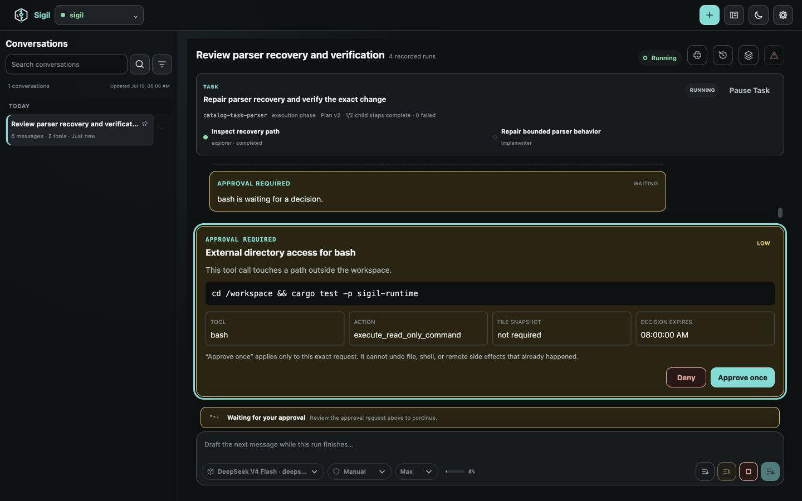
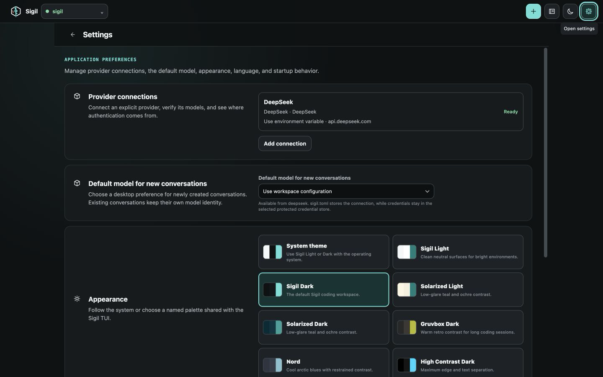
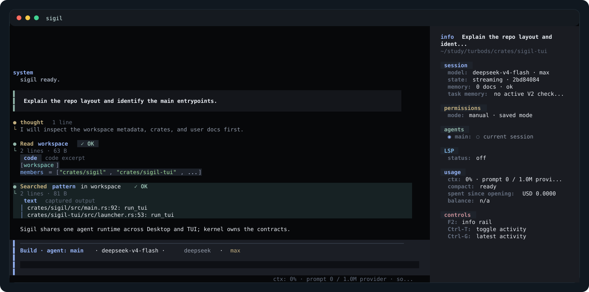
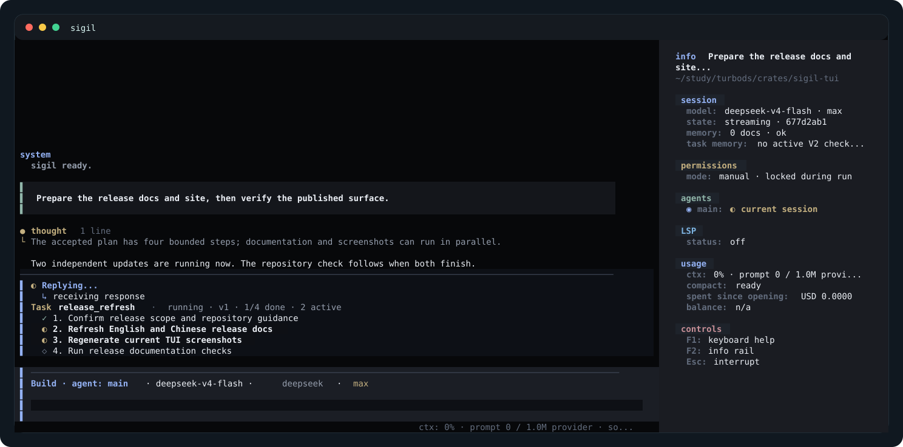
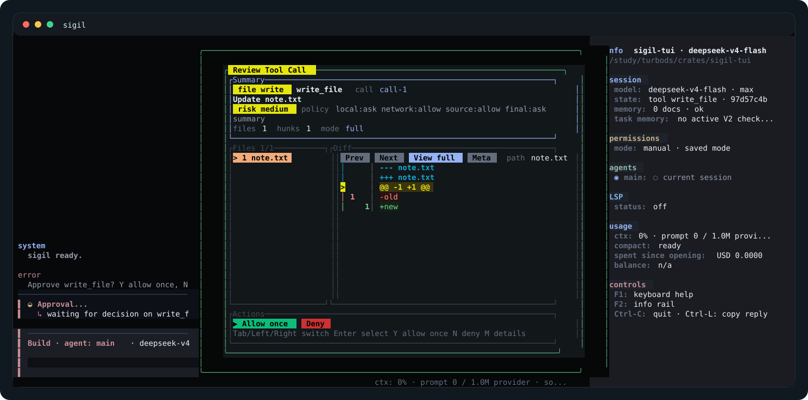
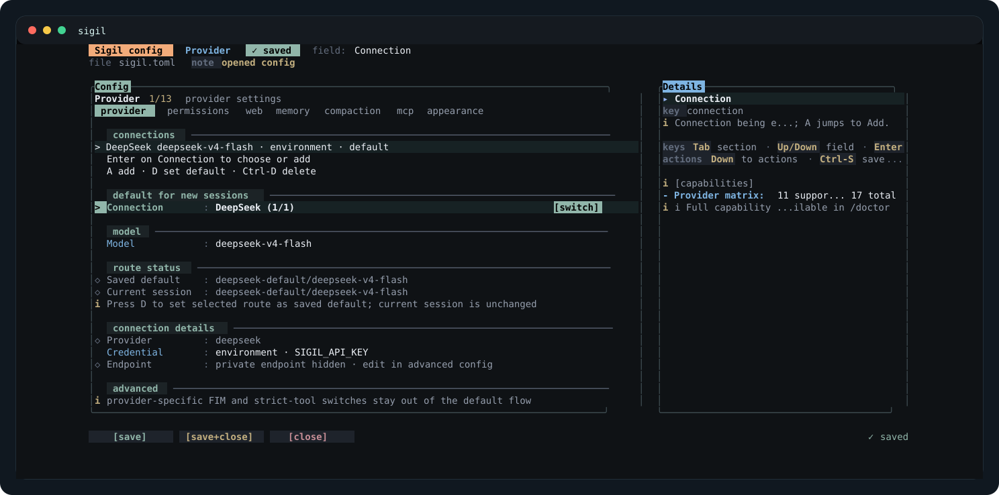
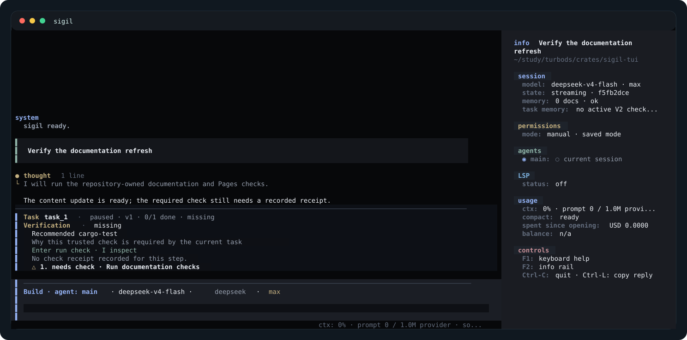
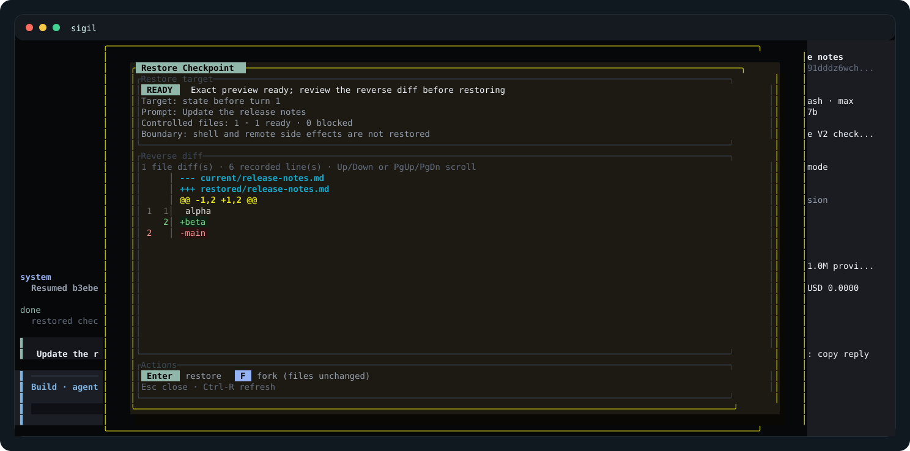
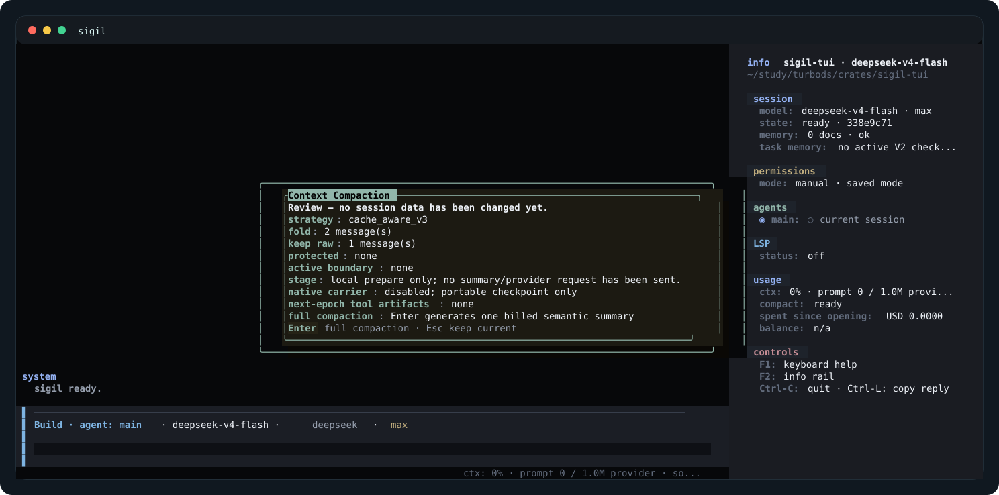

<!-- public-doc-role: visual-tour; authority: visual-orientation; sections: desktop-workbench,desktop-settings,main-tui-session,ai-planned-task-execution,approval-review,configuration-panel,task-verification,checkpoint-restore,context-compaction; cta: start-quickstart -->

# Visual Tour

[Docs home](README.md) · [Quickstart](quickstart.md) · [简体中文](../zh-CN/visual-tour.md)

These real Desktop captures and TUI previews show the main work and decision points on both first-class surfaces.

## Desktop Workbench

The Desktop workbench keeps the saved conversation list, current plan, streamed output, tool activity, approvals, queue, and composer in one bounded workspace.

## Desktop Settings

Use the native settings surface for provider and model defaults, appearance, startup behavior, and diagnostics.

## Main TUI Session

Write in the composer, follow tool activity in the transcript, and use the info rail for current session and permission status.

## AI-Planned Task Execution

Give Sigil a larger goal and it can turn that goal into visible steps, run independent work in parallel, and finish at a verification checkpoint. Starting from `/plan` keeps the proposed steps read-only until you accept them; individual risky actions still follow their normal approvals.

## Approval Review

Check the action, affected files, and diff before allowing a risky tool call.

## Configuration Panel

Use `/config` for common settings; open the linked reference when you need an exact field.

## Task Verification

The Verification card shows the recommended check and its current result. Press `Alt-V` to focus it.

## Checkpoint Restore

Press `Ctrl-R` to review a file restore or fork the conversation without changing shared files.

## Context Compaction

`/compact` is itself explicit intent: one invocation generates, validates, and activates a recoverable checkpoint. Failures keep the current context and remain visible; there is no redundant confirmation step.

<!-- public-doc-cta: start-quickstart -->
Next: [Start with Quickstart](quickstart.md).
