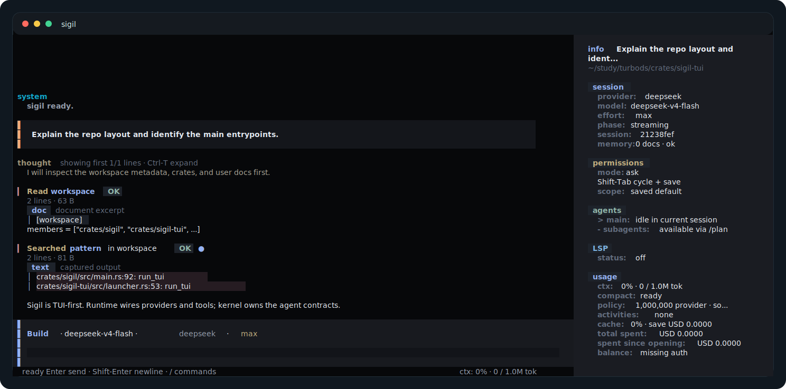
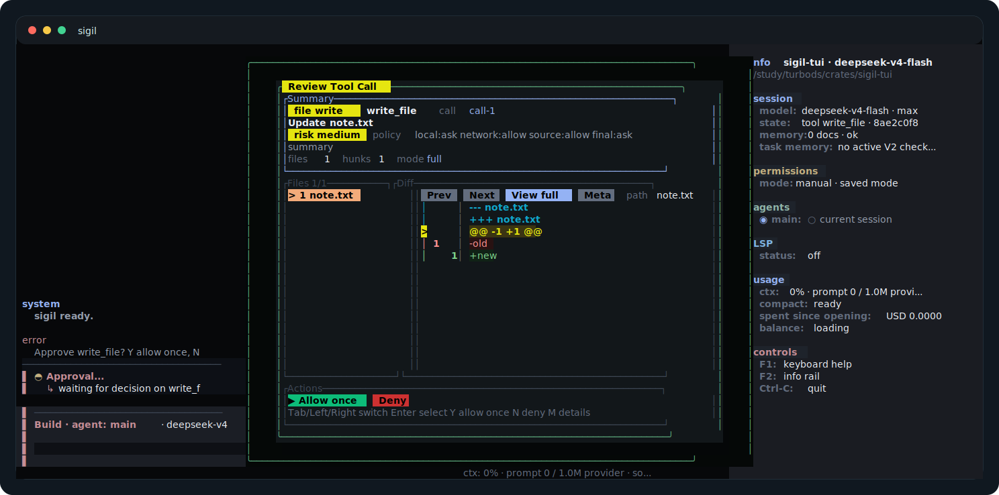
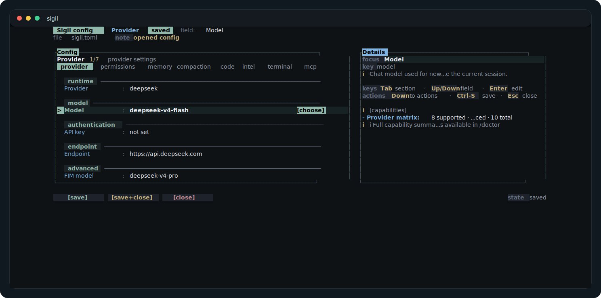

# 视觉导览

[文档首页](README.md) · [快速上手](quickstart.md) · [English](../en/visual-tour.md)

这一页用 TUI renderer 生成的 SVG captures 说明 Sigil 的主要界面。这些图是确定性的文档资产，不是手绘 mockup，因此会贴近真实终端布局。

## 主 TUI 会话



常规流程：

1. 在 workspace 中启动 `sigil`。
2. 在 composer 输入任务。
3. 在 transcript 中查看 repository reads、searches 和 tool activity。
4. 通过 info rail 检查 session、permissions、model、LSP、usage 和 controls。

## 审批检查



高风险动作运行前，检查：

- tool summary；
- affected files；
- diff preview；
- allow 或 deny action。

如果 diff 不符合意图，deny 并要求更窄的改动。

## 配置面板



使用 `/config` 修改常见 provider、permission、memory、compaction、code intelligence、terminal、Skills、插件信任审查和 MCP settings。低频 provider 细节仍留在 `sigil.toml` 和环境变量中。

## 重新生成这些截图

仓库里的 SVG 由 `ratatui::TestBackend` fixture 生成。TUI 布局有明显变化后，重新生成它们：

```bash
scripts/generate-tui-screenshots.sh
scripts/check-pages-site.sh
```

如果需要 release-quality bitmap screenshots 或 GIF，应在受控 demo workspace 中捕获运行中的 TUI：

1. 使用没有 secrets 的测试仓库。
2. 在接近 `120x36` 的终端尺寸运行 `sigil`。
3. 捕获 main screen、approval modal 和 config panel。
4. 用新文件名保存到 `site/assets/screenshots/`。
5. 从这一页链接新资产，并重新运行 `scripts/check-pages-site.sh`。
