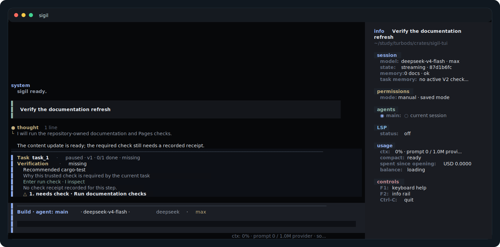
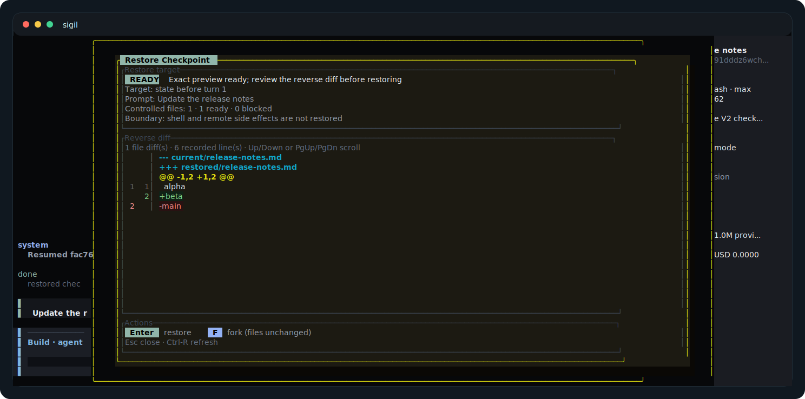
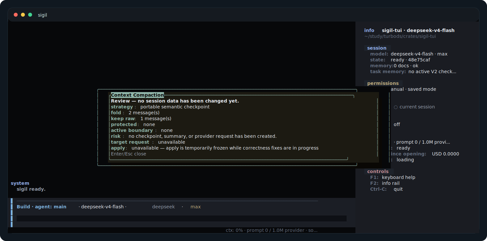

<!-- public-doc-role: visual-tour; authority: visual-orientation; sections: main-tui-session,approval-review,configuration-panel,task-verification,checkpoint-restore,context-compaction-preview; cta: start-quickstart -->

# 界面导览

[文档首页](README.md) · [快速开始](quickstart.md) · [English](../en/visual-tour.md)

这些截图展示 TUI 中主要的工作与决策界面。

## 主 TUI 会话

在输入框中提出任务，在会话记录中查看工具活动，再通过信息栏确认当前会话与权限状态。

## 审批检查

允许高风险工具调用前，请检查具体操作、受影响的文件和文件差异。

## 配置面板

常用设置使用 `/config`；需要精确字段时打开对应参考页。

## 任务验证

验证卡片会显示建议运行的检查和当前结果。按 `Alt-V` 可以直接聚焦。

## 检查点恢复

按 `Ctrl-R` 检查文件恢复；也可以只分叉对话，不修改共享文件。

## 上下文压缩预览

使用 `/compact`，在应用前检查建议的上下文精简方案。

<!-- public-doc-cta: start-quickstart -->
下一步：[从快速开始入门](quickstart.md)。
