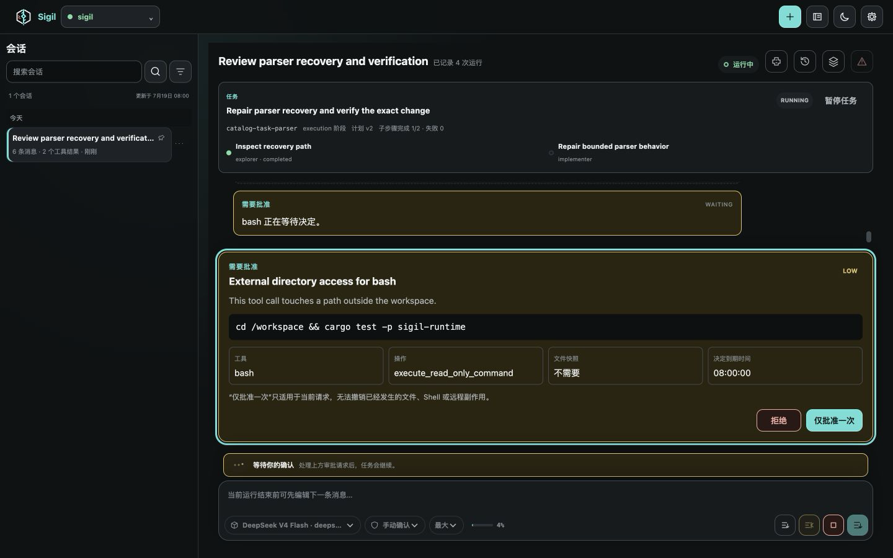
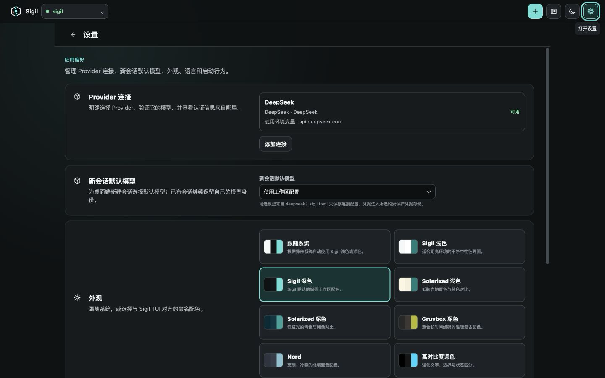

<!-- public-doc-role: visual-tour; authority: visual-orientation; sections: desktop-workbench,desktop-settings,main-tui-session,ai-planned-task-execution,approval-review,configuration-panel,task-verification,checkpoint-restore,context-compaction; cta: start-quickstart -->

# 界面导览

[文档首页](README.md) · [快速开始](quickstart.md) · [English](../en/visual-tour.md)

这些真实 Desktop 截图和 TUI 预览展示两个一等产品表面中的主要工作与决策界面。

## Desktop 工作台

Desktop 工作台在同一个有边界的空间中展示已保存会话、当前计划、流式输出、工具活动、审批、队列与输入框。

## Desktop 设置

通过原生设置界面管理 provider 与 model 默认值、外观、启动行为和诊断信息。

## 主 TUI 会话

在输入框中提出任务，在会话记录中查看工具活动，再通过信息栏确认当前会话与权限状态。

## AI 规划任务执行

给出一个较大的目标后，Sigil 可以把目标拆成可见步骤，并行完成相互独立的工作，最后停在验证节点。使用 `/plan` 开始时，建议步骤在你接受之前保持只读；每项高风险操作仍然遵守原有审批规则。

## 审批检查

作出决定前，请检查具体操作、检测到的副作用与目标、所需执行约束以及文件差异。风险用于解释潜在影响，本身不是审批规则；精确命令回执被接受后，Desktop 与 TUI 都会立即退出等待状态。

## 配置面板

常用设置使用 `/config`；需要精确字段时打开对应参考页。

## 任务验证

验证卡片会显示建议运行的检查和当前结果。按 `Alt-V` 可以直接聚焦。

## 检查点恢复

按 `Ctrl-R` 检查文件恢复；也可以只分叉对话，不修改共享文件。

## 上下文压缩

`/compact` 命令本身就是明确意图：单次调用会生成、校验并激活可恢复 checkpoint。失败时保持当前上下文并显示原因，不再增加一次重复确认。

<!-- public-doc-cta: start-quickstart -->
下一步：[从快速开始入门](quickstart.md)。
